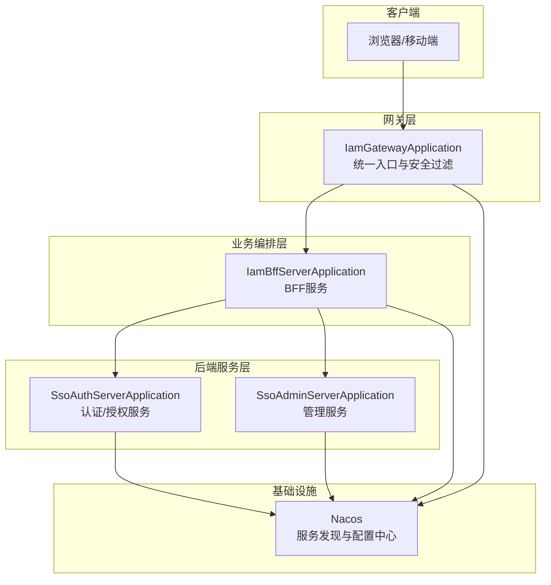
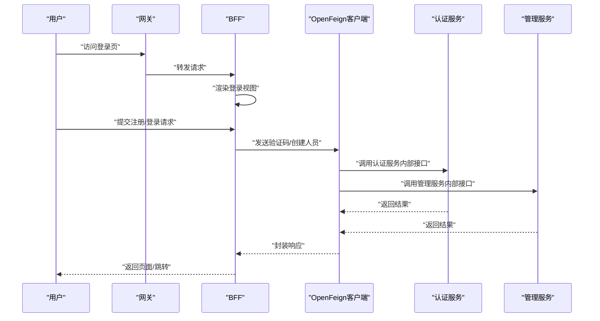
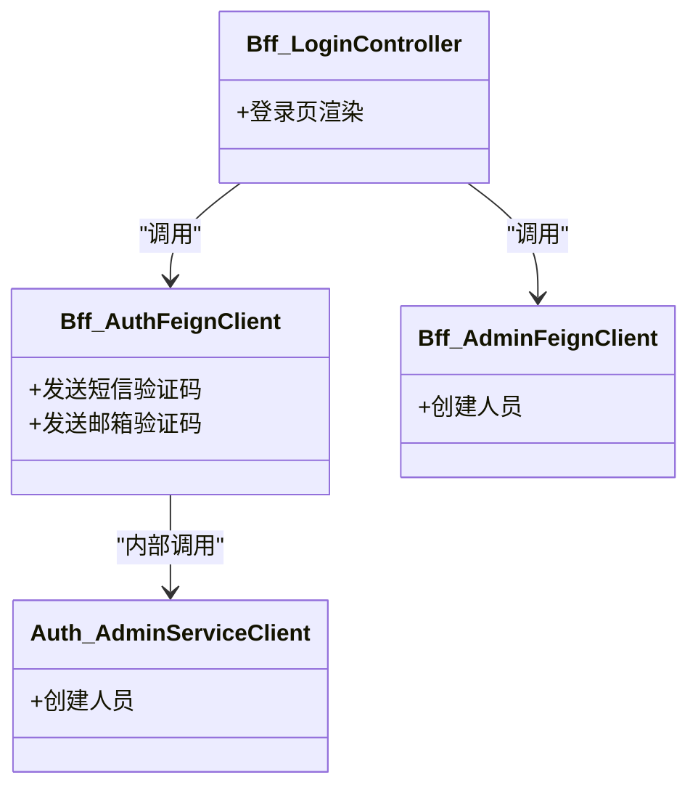
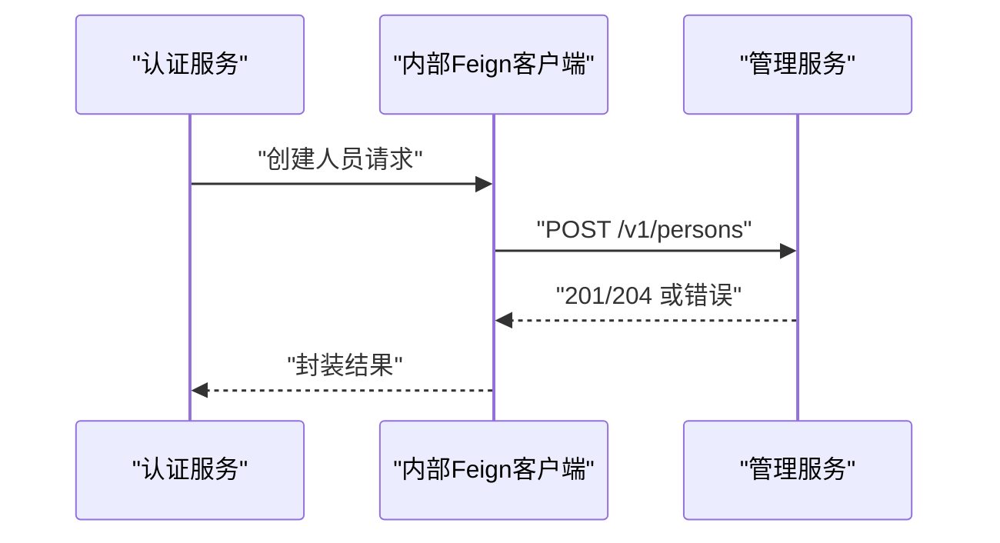
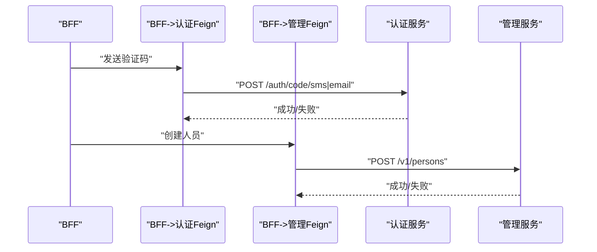
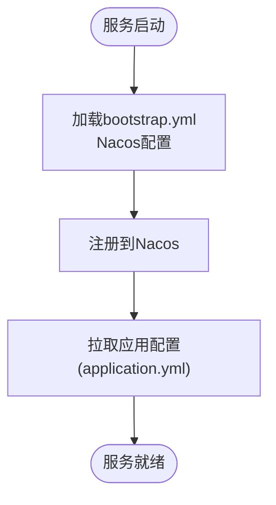
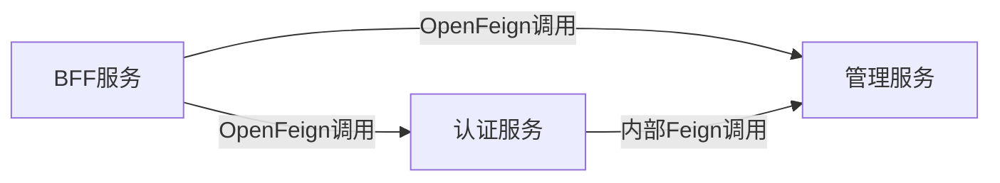

# 组件交互关系

<cite>
**本文引用的文件**
- [IamBffServerApplication.java](file://iam-bff-server/src/main/java/iam/platform/bff/IamBffServerApplication.java)
- [SsoAuthServerApplication.java](file://iam-auth-server/src/main/java/iam/platform/auth/SsoAuthServerApplication.java)
- [SsoAdminServerApplication.java](file://iam-admin-server/src/main/java/iam/platform/admin/SsoAdminServerApplication.java)
- [IamGatewayApplication.java](file://iam-gateway/src/main/java/iam/platform/gateway/IamGatewayApplication.java)
- [AdminFeignClient.java](file://iam-bff-server/src/main/java/iam/platform/bff/infrastructure/client/AdminFeignClient.java)
- [AuthFeignClient.java](file://iam-bff-server/src/main/java/iam/platform/bff/infrastructure/client/AuthFeignClient.java)
- [AdminServiceClient.java](file://iam-auth-server/src/main/java/iam/platform/auth/interfaces/client/AdminServiceClient.java)
- [bootstrap.yml（BFF）](file://iam-bff-server/bootstrap.yml)
- [bootstrap.yml（认证）](file://iam-auth-server/bootstrap.yml)
- [bootstrap.yml（管理）](file://iam-admin-server/bootstrap.yml)
- [application.yml（BFF）](file://iam-bff-server/src/main/resources/application.yml)
- [application.yml（认证）](file://iam-auth-server/src/main/resources/application.yml)
- [application.yml（管理）](file://iam-admin-server/src/main/resources/application.yml)
- [BffLoginController.java](file://iam-bff-server/src/main/java/iam/platform/bff/interfaces/web/BffLoginController.java)
- [AuthenticationController.java](file://iam-auth-server/src/main/java/iam/platform/auth/interfaces/rest/AuthenticationController.java)
</cite>

## 目录
1. [引言](#引言)
2. [项目结构](#项目结构)
3. [核心组件](#核心组件)
4. [架构总览](#架构总览)
5. [详细组件分析](#详细组件分析)
6. [依赖分析](#依赖分析)
7. [性能考虑](#性能考虑)
8. [故障排查指南](#故障排查指南)
9. [结论](#结论)
10. [附录](#附录)

## 引言
本文件聚焦IAM平台的组件交互关系，系统性梳理BFF服务器与认证/管理服务器之间的API调用关系、数据流转路径、服务发现与配置中心协作方式、错误处理与重试策略，并通过时序图与架构图帮助开发者快速理解复杂交互。

## 项目结构
平台采用多模块微服务架构，包含以下关键服务：
- 网关服务：统一入口与安全过滤
- BFF服务：面向前端的业务编排与适配
- 认证服务：统一认证与授权（含OAuth2/OIDC、CAS等）
- 管理服务：组织、人员、权限等管理能力
- 配置与注册中心：基于Nacos的服务发现与配置管理

图表来源
- [IamGatewayApplication.java:1-15](file://iam-gateway/src/main/java/iam/platform/gateway/IamGatewayApplication.java#L1-L15)
- [IamBffServerApplication.java:1-17](file://iam-bff-server/src/main/java/iam/platform/bff/IamBffServerApplication.java#L1-L17)
- [SsoAuthServerApplication.java:1-19](file://iam-auth-server/src/main/java/iam/platform/auth/SsoAuthServerApplication.java#L1-L19)
- [SsoAdminServerApplication.java:1-17](file://iam-admin-server/src/main/java/iam/platform/admin/SsoAdminServerApplication.java#L1-L17)
- [bootstrap.yml（BFF）:1-10](file://iam-bff-server/bootstrap.yml#L1-L10)
- [bootstrap.yml（认证）:1-10](file://iam-auth-server/bootstrap.yml#L1-L10)
- [bootstrap.yml（管理）:1-10](file://iam-admin-server/bootstrap.yml#L1-L10)

章节来源
- [IamGatewayApplication.java:1-15](file://iam-gateway/src/main/java/iam/platform/gateway/IamGatewayApplication.java#L1-L15)
- [IamBffServerApplication.java:1-17](file://iam-bff-server/src/main/java/iam/platform/bff/IamBffServerApplication.java#L1-L17)
- [SsoAuthServerApplication.java:1-19](file://iam-auth-server/src/main/java/iam/platform/auth/SsoAuthServerApplication.java#L1-L19)
- [SsoAdminServerApplication.java:1-17](file://iam-admin-server/src/main/java/iam/platform/admin/SsoAdminServerApplication.java#L1-L17)
- [bootstrap.yml（BFF）:1-10](file://iam-bff-server/bootstrap.yml#L1-L10)
- [bootstrap.yml（认证）:1-10](file://iam-auth-server/bootstrap.yml#L1-L10)
- [bootstrap.yml（管理）:1-10](file://iam-admin-server/bootstrap.yml#L1-L10)

## 核心组件
- BFF服务：负责渲染登录页、触发验证码发送、协调认证/管理服务完成用户注册与登录前置流程；通过OpenFeign调用认证/管理服务的内部接口。
- 认证服务：提供统一认证、会话与令牌管理、CAS单点登出、密码/验证码登录策略、租户解析等能力；对外暴露标准OAuth2/OIDC端点，对内通过Feign调用管理服务。
- 管理服务：提供组织、人员、角色、权限等管理能力；支持审计日志、异步处理与数据库迁移。
- 网关服务：统一入口、安全过滤与路由转发；结合认证服务进行令牌校验与上下文注入。
- 配置与注册中心：Nacos提供服务发现与配置管理，各服务在启动时向Nacos注册并拉取配置。

章节来源
- [IamBffServerApplication.java:1-17](file://iam-bff-server/src/main/java/iam/platform/bff/IamBffServerApplication.java#L1-L17)
- [SsoAuthServerApplication.java:1-19](file://iam-auth-server/src/main/java/iam/platform/auth/SsoAuthServerApplication.java#L1-L19)
- [SsoAdminServerApplication.java:1-17](file://iam-admin-server/src/main/java/iam/platform/admin/SsoAdminServerApplication.java#L1-L17)
- [bootstrap.yml（BFF）:1-10](file://iam-bff-server/bootstrap.yml#L1-L10)
- [bootstrap.yml（认证）:1-10](file://iam-auth-server/bootstrap.yml#L1-L10)
- [bootstrap.yml（管理）:1-10](file://iam-admin-server/bootstrap.yml#L1-L10)

## 架构总览
下图展示了从用户请求到响应返回的完整链路，涵盖BFF与认证/管理服务的交互、服务发现与配置中心的作用，以及错误处理与重试策略的落地位置。

图表来源
- [BffLoginController.java:1-50](file://iam-bff-server/src/main/java/iam/platform/bff/interfaces/web/BffLoginController.java#L1-L50)
- [AuthFeignClient.java:1-31](file://iam-bff-server/src/main/java/iam/platform/bff/infrastructure/client/AuthFeignClient.java#L1-L31)
- [AdminFeignClient.java:1-26](file://iam-bff-server/src/main/java/iam/platform/bff/infrastructure/client/AdminFeignClient.java#L1-L26)
- [AdminServiceClient.java:1-27](file://iam-auth-server/src/main/java/iam/platform/auth/interfaces/client/AdminServiceClient.java#L1-L27)
- [application.yml（BFF）:25-32](file://iam-bff-server/src/main/resources/application.yml#L25-L32)

## 详细组件分析

### BFF与认证/管理服务的API调用关系
- BFF通过OpenFeign客户端分别调用认证服务与管理服务的内部接口，实现验证码发送与人员创建等能力。
- 认证服务内部同样通过Feign客户端调用管理服务，用于用户自注册场景下的人员创建。
- 调用路径遵循服务名与路径约定，便于Nacos服务发现与负载均衡。

图表来源
- [BffLoginController.java:1-50](file://iam-bff-server/src/main/java/iam/platform/bff/interfaces/web/BffLoginController.java#L1-L50)
- [AuthFeignClient.java:1-31](file://iam-bff-server/src/main/java/iam/platform/bff/infrastructure/client/AuthFeignClient.java#L1-L31)
- [AdminFeignClient.java:1-26](file://iam-bff-server/src/main/java/iam/platform/bff/infrastructure/client/AdminFeignClient.java#L1-L26)
- [AdminServiceClient.java:1-27](file://iam-auth-server/src/main/java/iam/platform/auth/interfaces/client/AdminServiceClient.java#L1-L27)

章节来源
- [BffLoginController.java:1-50](file://iam-bff-server/src/main/java/iam/platform/bff/interfaces/web/BffLoginController.java#L1-L50)
- [AuthFeignClient.java:1-31](file://iam-bff-server/src/main/java/iam/platform/bff/infrastructure/client/AuthFeignClient.java#L1-L31)
- [AdminFeignClient.java:1-26](file://iam-bff-server/src/main/java/iam/platform/bff/infrastructure/client/AdminFeignClient.java#L1-L26)
- [AdminServiceClient.java:1-27](file://iam-auth-server/src/main/java/iam/platform/auth/interfaces/client/AdminServiceClient.java#L1-L27)

### 用户信息同步机制（认证服务器与管理服务器）
- 在用户自注册或首次登录时，认证服务内部通过Feign客户端调用管理服务的“创建人员”接口，完成人员实体的初始化与持久化。
- 该机制通过服务内调用实现，避免跨服务直接暴露敏感接口，降低耦合度。

图表来源
- [AdminServiceClient.java:1-27](file://iam-auth-server/src/main/java/iam/platform/auth/interfaces/client/AdminServiceClient.java#L1-L27)
- [AdminFeignClient.java:1-26](file://iam-bff-server/src/main/java/iam/platform/bff/infrastructure/client/AdminFeignClient.java#L1-L26)

章节来源
- [AdminServiceClient.java:1-27](file://iam-auth-server/src/main/java/iam/platform/auth/interfaces/client/AdminServiceClient.java#L1-L27)
- [AdminFeignClient.java:1-26](file://iam-bff-server/src/main/java/iam/platform/bff/infrastructure/client/AdminFeignClient.java#L1-L26)

### BFF与认证/管理服务器的API调用关系
- BFF侧提供登录页渲染与验证码发送能力，通过Feign客户端调用认证服务的验证码接口。
- BFF侧在注册流程中调用管理服务的“创建人员”接口，完成用户信息入库。
- 认证服务对外提供标准OAuth2/OIDC端点，内部通过Feign调用管理服务以完成用户初始化。

图表来源
- [AuthFeignClient.java:1-31](file://iam-bff-server/src/main/java/iam/platform/bff/infrastructure/client/AuthFeignClient.java#L1-L31)
- [AdminFeignClient.java:1-26](file://iam-bff-server/src/main/java/iam/platform/bff/infrastructure/client/AdminFeignClient.java#L1-L26)
- [AuthenticationController.java:1-47](file://iam-auth-server/src/main/java/iam/platform/auth/interfaces/rest/AuthenticationController.java#L1-L47)

章节来源
- [AuthFeignClient.java:1-31](file://iam-bff-server/src/main/java/iam/platform/bff/infrastructure/client/AuthFeignClient.java#L1-L31)
- [AdminFeignClient.java:1-26](file://iam-bff-server/src/main/java/iam/platform/bff/infrastructure/client/AdminFeignClient.java#L1-L26)
- [AuthenticationController.java:1-47](file://iam-auth-server/src/main/java/iam/platform/auth/interfaces/rest/AuthenticationController.java#L1-L47)

### 服务发现与配置中心
- 各服务均启用服务发现注解并在bootstrap.yml中配置Nacos地址、命名空间与分组，实现自动注册与发现。
- 应用配置文件定义了服务端口、SSL、Feign超时、监控与追踪等参数，支撑运行期行为。

图表来源
- [bootstrap.yml（BFF）:1-10](file://iam-bff-server/bootstrap.yml#L1-L10)
- [bootstrap.yml（认证）:1-10](file://iam-auth-server/bootstrap.yml#L1-L10)
- [bootstrap.yml（管理）:1-10](file://iam-admin-server/bootstrap.yml#L1-L10)
- [application.yml（BFF）:1-54](file://iam-bff-server/src/main/resources/application.yml#L1-L54)
- [application.yml（认证）:1-144](file://iam-auth-server/src/main/resources/application.yml#L1-L144)
- [application.yml（管理）:1-102](file://iam-admin-server/src/main/resources/application.yml#L1-L102)

章节来源
- [bootstrap.yml（BFF）:1-10](file://iam-bff-server/bootstrap.yml#L1-L10)
- [bootstrap.yml（认证）:1-10](file://iam-auth-server/bootstrap.yml#L1-L10)
- [bootstrap.yml（管理）:1-10](file://iam-admin-server/bootstrap.yml#L1-L10)
- [application.yml（BFF）:1-54](file://iam-bff-server/src/main/resources/application.yml#L1-L54)
- [application.yml（认证）:1-144](file://iam-auth-server/src/main/resources/application.yml#L1-L144)
- [application.yml（管理）:1-102](file://iam-admin-server/src/main/resources/application.yml#L1-L102)

### 错误处理与重试机制
- 超时配置：BFF侧Feign默认连接超时与读超时已配置，有助于在网络波动时快速失败，避免长时间占用资源。
- 运行期监控与追踪：各服务开启Prometheus指标与Zipkin追踪，便于定位延迟与错误根因。
- 建议策略（通用指导，非代码实现）：
  - 对于可重试的临时性错误（如网络抖动），可在BFF或上游网关层引入指数退避重试。
  - 对于认证/管理服务内部调用，建议在Feign层面配置重试与熔断（如结合Resilience4j），并记录追踪Span以便回溯。
  - 对于外部验证码服务（短信/邮件），建议在认证服务侧增加幂等与去重策略，避免重复发送。

章节来源
- [application.yml（BFF）:25-32](file://iam-bff-server/src/main/resources/application.yml#L25-L32)
- [application.yml（认证）:128-144](file://iam-auth-server/src/main/resources/application.yml#L128-L144)
- [application.yml（管理）:76-92](file://iam-admin-server/src/main/resources/application.yml#L76-L92)

## 依赖分析
- 松耦合设计：
  - BFF通过OpenFeign客户端与认证/管理服务解耦，仅依赖服务名与接口契约。
  - 认证服务内部也通过Feign调用管理服务，避免直接依赖具体实现细节。
- 依赖关系可视化：

图表来源
- [AuthFeignClient.java:1-31](file://iam-bff-server/src/main/java/iam/platform/bff/infrastructure/client/AuthFeignClient.java#L1-L31)
- [AdminFeignClient.java:1-26](file://iam-bff-server/src/main/java/iam/platform/bff/infrastructure/client/AdminFeignClient.java#L1-L26)
- [AdminServiceClient.java:1-27](file://iam-auth-server/src/main/java/iam/platform/auth/interfaces/client/AdminServiceClient.java#L1-L27)

章节来源
- [AuthFeignClient.java:1-31](file://iam-bff-server/src/main/java/iam/platform/bff/infrastructure/client/AuthFeignClient.java#L1-L31)
- [AdminFeignClient.java:1-26](file://iam-bff-server/src/main/java/iam/platform/bff/infrastructure/client/AdminFeignClient.java#L1-L26)
- [AdminServiceClient.java:1-27](file://iam-auth-server/src/main/java/iam/platform/auth/interfaces/client/AdminServiceClient.java#L1-L27)

## 性能考虑
- 连接与读超时：BFF侧已设置默认连接与读超时，有助于快速失败与资源回收。
- 指标与追踪：开启Prometheus与Zipkin，便于观测延迟、错误率与调用链路。
- 数据库与缓存：认证/管理服务配置了Redis与数据库连接池参数，需结合实际QPS调整最大连接数与空闲时间。
- 缓存策略：建议在BFF层对登录页模板与静态资源进行缓存，减少后端压力。

章节来源
- [application.yml（BFF）:25-32](file://iam-bff-server/src/main/resources/application.yml#L25-L32)
- [application.yml（认证）:15-38](file://iam-auth-server/src/main/resources/application.yml#L15-L38)
- [application.yml（管理）:15-38](file://iam-admin-server/src/main/resources/application.yml#L15-L38)

## 故障排查指南
- 服务无法发现：
  - 检查Nacos地址、命名空间与分组配置是否一致。
  - 确认服务健康检查与端口开放情况。
- 调用超时或失败：
  - 查看Feign超时配置与后端服务处理耗时。
  - 结合Zipkin追踪定位慢调用环节。
- 注册/登录异常：
  - 关注BFF控制器参数传递与模板消息渲染。
  - 认证服务内部接口不暴露密码登录端点，应使用标准OAuth2令牌端点。

章节来源
- [bootstrap.yml（BFF）:1-10](file://iam-bff-server/bootstrap.yml#L1-L10)
- [bootstrap.yml（认证）:1-10](file://iam-auth-server/bootstrap.yml#L1-L10)
- [bootstrap.yml（管理）:1-10](file://iam-admin-server/bootstrap.yml#L1-L10)
- [application.yml（BFF）:25-32](file://iam-bff-server/src/main/resources/application.yml#L25-L32)
- [application.yml（认证）:128-144](file://iam-auth-server/src/main/resources/application.yml#L128-L144)
- [application.yml（管理）:76-92](file://iam-admin-server/src/main/resources/application.yml#L76-L92)
- [BffLoginController.java:1-50](file://iam-bff-server/src/main/java/iam/platform/bff/interfaces/web/BffLoginController.java#L1-L50)
- [AuthenticationController.java:1-47](file://iam-auth-server/src/main/java/iam/platform/auth/interfaces/rest/AuthenticationController.java#L1-L47)

## 结论
本平台通过BFF+网关+认证/管理服务的分层设计，结合Nacos服务发现与配置中心，实现了清晰的职责划分与松耦合的组件交互。BFF侧以OpenFeign作为主要通信手段，既满足前端适配需求，又通过内部调用保障用户信息同步的可靠性。配合超时、监控与追踪配置，整体具备良好的可观测性与可维护性。

## 附录
- 关键配置要点速览：
  - Nacos服务发现：在bootstrap.yml中配置server-addr、namespace与group。
  - Feign超时：在application.yml中设置default连接与读超时。
  - 监控与追踪：开启Prometheus与Zipkin，采样概率设为1.0便于全量追踪。
  - SSL：根据部署环境启用HTTPS与证书配置。