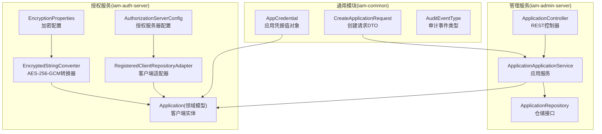
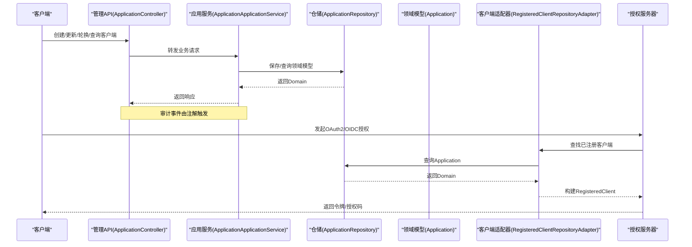
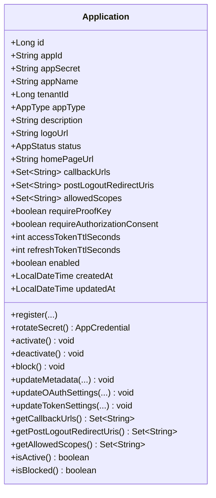
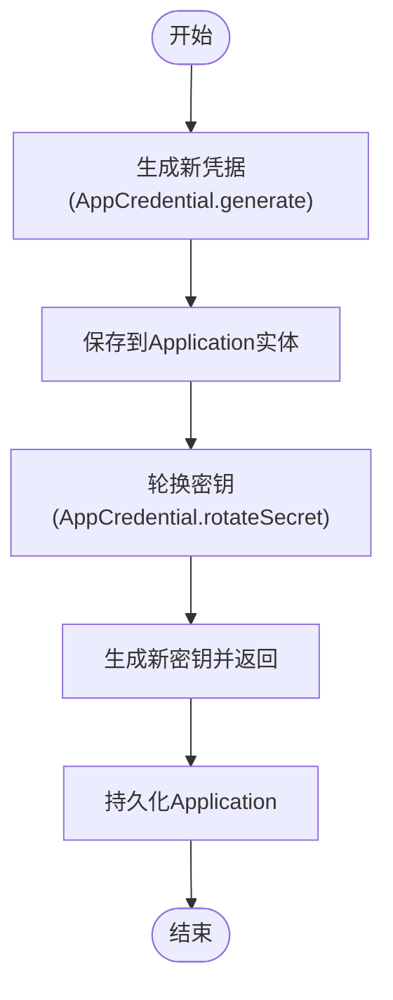
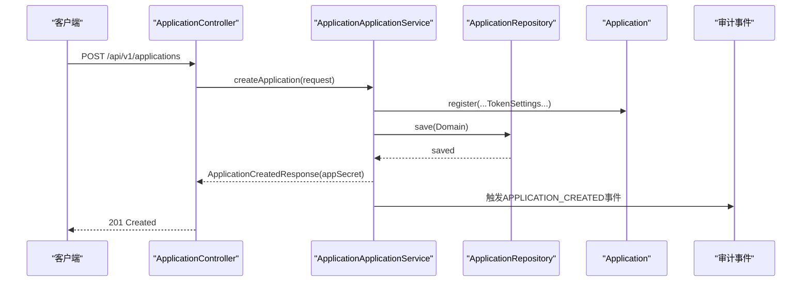
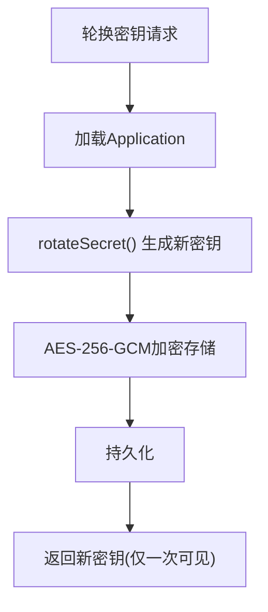
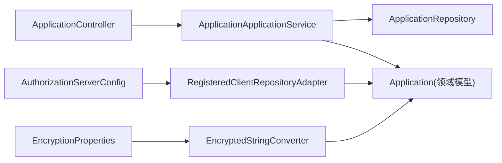

# OAuth2客户端管理

<cite>
**本文引用的文件**
- [ApplicationController.java](file://iam-admin-server/src/main/java/iam/platform/admin/interfaces/rest/ApplicationController.java)
- [ApplicationApplicationService.java](file://iam-admin-server/src/main/java/iam/platform/admin/application/service/ApplicationApplicationService.java)
- [Application.java](file://iam-auth-server/src/main/java/iam/platform/auth/domain/model/entity/Application.java)
- [RegisteredClientRepositoryAdapter.java](file://iam-auth-server/src/main/java/iam/platform/auth/infrastructure/security/RegisteredClientRepositoryAdapter.java)
- [CreateApplicationRequest.java](file://iam-common/src/main/java/iam/platform/common/dto/request/CreateApplicationRequest.java)
- [AppCredential.java](file://iam-common/src/main/java/iam/platform/common/model/valueobject/AppCredential.java)
- [EncryptedStringConverter.java](file://iam-auth-server/src/main/java/iam/platform/auth/infrastructure/persistence/converter/EncryptedStringConverter.java)
- [EncryptionProperties.java](file://iam-auth-server/src/main/java/iam/platform/auth/infrastructure/config/EncryptionProperties.java)
- [AuthorizationServerConfig.java](file://iam-auth-server/src/main/java/iam/platform/auth/infrastructure/config/AuthorizationServerConfig.java)
- [AuditApplicationService.java](file://iam-admin-server/src/main/java/iam/platform/admin/application/service/AuditApplicationService.java)
- [AuditEventType.java](file://iam-common/src/main/java/iam/platform/common/model/enums/AuditEventType.java)
- [V1__complete_schema_initialization.sql](file://iam-admin-server/src/main/resources/db/migration/V1__complete_schema_initialization.sql)
- [Spring Authorization Server 原理与流程.md](file://docs/design/Spring Authorization Server 原理与流程.md)
- [统一认证框架.md](file://docs/design/统一认证框架.md)
</cite>

## 目录
1. [简介](#简介)
2. [项目结构](#项目结构)
3. [核心组件](#核心组件)
4. [架构总览](#架构总览)
5. [详细组件分析](#详细组件分析)
6. [依赖分析](#依赖分析)
7. [性能考虑](#性能考虑)
8. [故障排除指南](#故障排除指南)
9. [结论](#结论)
10. [附录](#附录)

## 简介
本技术文档围绕OAuth2客户端管理能力，系统阐述以下主题：
- OAuth2客户端的注册与配置流程
- Client Secret管理机制（AES-256-GCM对称加密）
- 授权类型与作用域配置
- 客户端实体模型设计、注册流程实现、密钥轮换策略与安全存储机制
- 客户端管理API的完整接口规范（创建、更新、删除、查询、状态变更、密钥轮换）
- 不同授权类型的适用场景与配置方法（Authorization Code、Client Credentials、Password等）
- 客户端集成最佳实践（回调地址、作用域、权限控制、安全策略）
- 客户端监控、审计日志与故障排除

## 项目结构
本项目采用多模块分层架构，OAuth2客户端管理相关的关键模块与文件如下：
- 管理服务（iam-admin-server）：对外提供客户端管理REST API，负责业务编排与审计
- 授权服务（iam-auth-server）：承载Spring Authorization Server，负责OAuth2/OIDC协议处理与客户端适配
- 通用模块（iam-common）：共享数据传输对象、值对象与枚举
- 文档（docs/design）：协议原理与集成指南

图表来源
- [ApplicationController.java:28-139](file://iam-admin-server/src/main/java/iam/platform/admin/interfaces/rest/ApplicationController.java#L28-L139)
- [ApplicationApplicationService.java:30-255](file://iam-admin-server/src/main/java/iam/platform/admin/application/service/ApplicationApplicationService.java#L30-L255)
- [Application.java:21-211](file://iam-auth-server/src/main/java/iam/platform/auth/domain/model/entity/Application.java#L21-L211)
- [RegisteredClientRepositoryAdapter.java:20-101](file://iam-auth-server/src/main/java/iam/platform/auth/infrastructure/security/RegisteredClientRepositoryAdapter.java#L20-L101)
- [EncryptedStringConverter.java:17-109](file://iam-auth-server/src/main/java/iam/platform/auth/infrastructure/persistence/converter/EncryptedStringConverter.java#L17-L109)
- [EncryptionProperties.java:12-15](file://iam-auth-server/src/main/java/iam/platform/auth/infrastructure/config/EncryptionProperties.java#L12-L15)
- [AuthorizationServerConfig.java:38-130](file://iam-auth-server/src/main/java/iam/platform/auth/infrastructure/config/AuthorizationServerConfig.java#L38-L130)
- [AppCredential.java:14-67](file://iam-common/src/main/java/iam/platform/common/model/valueobject/AppCredential.java#L14-L67)
- [CreateApplicationRequest.java:17-44](file://iam-common/src/main/java/iam/platform/common/dto/request/CreateApplicationRequest.java#L17-L44)

章节来源
- [ApplicationController.java:28-139](file://iam-admin-server/src/main/java/iam/platform/admin/interfaces/rest/ApplicationController.java#L28-L139)
- [ApplicationApplicationService.java:30-255](file://iam-admin-server/src/main/java/iam/platform/admin/application/service/ApplicationApplicationService.java#L30-L255)
- [Application.java:21-211](file://iam-auth-server/src/main/java/iam/platform/auth/domain/model/entity/Application.java#L21-L211)
- [RegisteredClientRepositoryAdapter.java:20-101](file://iam-auth-server/src/main/java/iam/platform/auth/infrastructure/security/RegisteredClientRepositoryAdapter.java#L20-L101)
- [EncryptedStringConverter.java:17-109](file://iam-auth-server/src/main/java/iam/platform/auth/infrastructure/persistence/converter/EncryptedStringConverter.java#L17-L109)
- [EncryptionProperties.java:12-15](file://iam-auth-server/src/main/java/iam/platform/auth/infrastructure/config/EncryptionProperties.java#L12-L15)
- [AuthorizationServerConfig.java:38-130](file://iam-auth-server/src/main/java/iam/platform/auth/infrastructure/config/AuthorizationServerConfig.java#L38-L130)
- [AppCredential.java:14-67](file://iam-common/src/main/java/iam/platform/common/model/valueobject/AppCredential.java#L14-L67)
- [CreateApplicationRequest.java:17-44](file://iam-common/src/main/java/iam/platform/common/dto/request/CreateApplicationRequest.java#L17-L44)

## 核心组件
- 客户端实体模型（Application）：封装客户端元数据、OAuth2配置、令牌TTL、状态与生命周期管理
- 凭据值对象（AppCredential）：生成与轮换客户端凭据（appId/appSecret）
- 管理API控制器（ApplicationController）：提供客户端的CRUD、状态变更与密钥轮换接口
- 应用服务（ApplicationApplicationService）：编排业务逻辑、事务控制、审计日志注解
- 客户端适配器（RegisteredClientRepositoryAdapter）：将Application映射为Spring RegisteredClient，注入授权服务器
- 加密转换器（EncryptedStringConverter）：基于AES-256-GCM对称加密存储Client Secret
- 加密配置（EncryptionProperties）：读取ENCRYPTION_KEY环境变量
- 授权服务器配置（AuthorizationServerConfig）：启用OIDC、JWT解码与租户过滤器链
- 审计服务（AuditApplicationService）：审计日志查询、统计与导出

章节来源
- [Application.java:21-211](file://iam-auth-server/src/main/java/iam/platform/auth/domain/model/entity/Application.java#L21-L211)
- [AppCredential.java:14-67](file://iam-common/src/main/java/iam/platform/common/model/valueobject/AppCredential.java#L14-L67)
- [ApplicationController.java:28-139](file://iam-admin-server/src/main/java/iam/platform/admin/interfaces/rest/ApplicationController.java#L28-L139)
- [ApplicationApplicationService.java:30-255](file://iam-admin-server/src/main/java/iam/platform/admin/application/service/ApplicationApplicationService.java#L30-L255)
- [RegisteredClientRepositoryAdapter.java:20-101](file://iam-auth-server/src/main/java/iam/platform/auth/infrastructure/security/RegisteredClientRepositoryAdapter.java#L20-L101)
- [EncryptedStringConverter.java:17-109](file://iam-auth-server/src/main/java/iam/platform/auth/infrastructure/persistence/converter/EncryptedStringConverter.java#L17-L109)
- [EncryptionProperties.java:12-15](file://iam-auth-server/src/main/java/iam/platform/auth/infrastructure/config/EncryptionProperties.java#L12-L15)
- [AuthorizationServerConfig.java:38-130](file://iam-auth-server/src/main/java/iam/platform/auth/infrastructure/config/AuthorizationServerConfig.java#L38-L130)
- [AuditApplicationService.java:30-217](file://iam-admin-server/src/main/java/iam/platform/admin/application/service/AuditApplicationService.java#L30-L217)

## 架构总览
OAuth2客户端管理贯穿“管理服务-领域模型-授权服务”的协作路径：
- 管理服务接收HTTP请求，调用应用服务进行业务处理
- 应用服务持久化领域模型（Application），触发审计事件
- 授权服务通过RegisteredClientRepositoryAdapter读取Application，构建Spring RegisteredClient
- 客户端凭据经由AES-256-GCM加密存储，运行时解密供授权服务器使用

图表来源
- [ApplicationController.java:28-139](file://iam-admin-server/src/main/java/iam/platform/admin/interfaces/rest/ApplicationController.java#L28-L139)
- [ApplicationApplicationService.java:30-255](file://iam-admin-server/src/main/java/iam/platform/admin/application/service/ApplicationApplicationService.java#L30-L255)
- [Application.java:21-211](file://iam-auth-server/src/main/java/iam/platform/auth/domain/model/entity/Application.java#L21-L211)
- [RegisteredClientRepositoryAdapter.java:20-101](file://iam-auth-server/src/main/java/iam/platform/auth/infrastructure/security/RegisteredClientRepositoryAdapter.java#L20-L101)

## 详细组件分析

### 客户端实体模型设计
- 关键属性：appId、appSecret、appName、tenantId、appType、描述、Logo、状态、主页URL、回调地址、登出后重定向URI、允许的作用域、是否要求PKCE、是否要求授权同意、访问令牌与刷新令牌TTL、启用状态、创建/更新时间
- 行为方法：
  - 注册：自动生成凭据、默认ACTIVE状态、启用
  - 密钥轮换：保持appId不变，生成新的appSecret
  - 状态生命周期：ACTIVE/INACTIVE/BLOCKED，启用/禁用
  - 更新元数据、OAuth设置、令牌TTL
  - 查询方法：空集合懒初始化，保证线程安全

图表来源
- [Application.java:21-211](file://iam-auth-server/src/main/java/iam/platform/auth/domain/model/entity/Application.java#L21-L211)

章节来源
- [Application.java:21-211](file://iam-auth-server/src/main/java/iam/platform/auth/domain/model/entity/Application.java#L21-L211)

### 凭据生成与轮换（AppCredential）
- 生成规则：appId为16字符字母数字；appSecret为64字符字母数字
- 轮换策略：保持appId不变，生成新的appSecret，返回新凭据对象
- 用途：注册时生成初始凭据；轮换接口返回新密钥（仅一次可见）

图表来源
- [AppCredential.java:14-67](file://iam-common/src/main/java/iam/platform/common/model/valueobject/AppCredential.java#L14-L67)
- [Application.java:82-92](file://iam-auth-server/src/main/java/iam/platform/auth/domain/model/entity/Application.java#L82-L92)

章节来源
- [AppCredential.java:14-67](file://iam-common/src/main/java/iam/platform/common/model/valueobject/AppCredential.java#L14-L67)
- [Application.java:82-92](file://iam-auth-server/src/main/java/iam/platform/auth/domain/model/entity/Application.java#L82-L92)

### 客户端注册流程实现
- 请求体：CreateApplicationRequest（名称、租户ID、类型、回调地址、作用域、PKCE、授权同意、令牌TTL等）
- 业务流程：
  - 应用服务组装TokenSettings
  - 调用Application.register生成凭据与默认配置
  - 保存至仓储，返回创建响应（含新生成的appSecret，仅一次可见）
- 审计：使用@AuditLog注解记录创建事件

图表来源
- [ApplicationController.java:38-45](file://iam-admin-server/src/main/java/iam/platform/admin/interfaces/rest/ApplicationController.java#L38-L45)
- [ApplicationApplicationService.java:35-62](file://iam-admin-server/src/main/java/iam/platform/admin/application/service/ApplicationApplicationService.java#L35-L62)
- [CreateApplicationRequest.java:17-44](file://iam-common/src/main/java/iam/platform/common/dto/request/CreateApplicationRequest.java#L17-L44)

章节来源
- [ApplicationController.java:38-45](file://iam-admin-server/src/main/java/iam/platform/admin/interfaces/rest/ApplicationController.java#L38-L45)
- [ApplicationApplicationService.java:35-62](file://iam-admin-server/src/main/java/iam/platform/admin/application/service/ApplicationApplicationService.java#L35-L62)
- [CreateApplicationRequest.java:17-44](file://iam-common/src/main/java/iam/platform/common/dto/request/CreateApplicationRequest.java#L17-L44)

### 客户端更新与状态管理
- 更新字段：元数据、OAuth设置（回调地址、登出重定向、作用域、PKCE、授权同意）、令牌TTL
- 状态管理：激活、停用、封禁（不可逆，需特殊处理）
- 审计：分别记录APPLICATION_UPDATED、APPLICATION_ACTIVATED、APPLICATION_BLOCKED事件

章节来源
- [ApplicationApplicationService.java:86-176](file://iam-admin-server/src/main/java/iam/platform/admin/application/service/ApplicationApplicationService.java#L86-L176)
- [Application.java:129-178](file://iam-auth-server/src/main/java/iam/platform/auth/domain/model/entity/Application.java#L129-L178)
- [AuditEventType.java:35-44](file://iam-common/src/main/java/iam/platform/common/model/enums/AuditEventType.java#L35-L44)

### 密钥轮换策略与安全存储
- 轮换接口：POST /api/v1/applications/{id}/rotate-secret
- 运行机制：
  - 应用服务加载Application，调用rotateSecret生成新凭据
  - 持久化后返回新凭据（仅一次可见）
- 存储机制：
  - 数据库存储：AES-256-GCM加密（IV+密文）
  - 解密后为明文，授权服务器以PasswordEncoder编码格式注入（开发环境可使用{noop}）
- 配置项：ENCRYPTION_KEY（32字节UTF-8）

图表来源
- [ApplicationApplicationService.java:136-147](file://iam-admin-server/src/main/java/iam/platform/admin/application/service/ApplicationApplicationService.java#L136-L147)
- [Application.java:82-92](file://iam-auth-server/src/main/java/iam/platform/auth/domain/model/entity/Application.java#L82-L92)
- [EncryptedStringConverter.java:17-109](file://iam-auth-server/src/main/java/iam/platform/auth/infrastructure/persistence/converter/EncryptedStringConverter.java#L17-L109)
- [EncryptionProperties.java:12-15](file://iam-auth-server/src/main/java/iam/platform/auth/infrastructure/config/EncryptionProperties.java#L12-L15)

章节来源
- [ApplicationApplicationService.java:136-147](file://iam-admin-server/src/main/java/iam/platform/admin/application/service/ApplicationApplicationService.java#L136-L147)
- [Application.java:82-92](file://iam-auth-server/src/main/java/iam/platform/auth/domain/model/entity/Application.java#L82-L92)
- [EncryptedStringConverter.java:17-109](file://iam-auth-server/src/main/java/iam/platform/auth/infrastructure/persistence/converter/EncryptedStringConverter.java#L17-L109)
- [EncryptionProperties.java:12-15](file://iam-auth-server/src/main/java/iam/platform/auth/infrastructure/config/EncryptionProperties.java#L12-L15)

### 授权类型与作用域配置
- 授权类型：
  - 授权码模式（authorization_code）：标准OIDC/OAuth2流程，推荐用于Web/移动/SPA
  - 密码模式（password）：遗留系统迁移，需高信任客户端
  - 客户端凭证模式（client_credentials）：微服务间认证，无用户参与
- 作用域（scopes）：从Application.allowedScopes注入
- PKCE：通过requireProofKey控制
- 授权同意：通过requireAuthorizationConsent控制

章节来源
- [RegisteredClientRepositoryAdapter.java:71-96](file://iam-auth-server/src/main/java/iam/platform/auth/infrastructure/security/RegisteredClientRepositoryAdapter.java#L71-L96)
- [Application.java:150-168](file://iam-auth-server/src/main/java/iam/platform/auth/domain/model/entity/Application.java#L150-L168)
- [统一认证框架.md:258-484](file://docs/design/统一认证框架.md#L258-L484)

### 客户端管理API接口文档
- 创建应用
  - 方法：POST /api/v1/applications
  - 请求体：CreateApplicationRequest（名称、租户ID、类型、回调地址列表、作用域列表、PKCE、授权同意、令牌TTL）
  - 响应：ApplicationCreatedResponse（包含新生成的appSecret，仅一次可见）
- 获取应用
  - GET /api/v1/applications/{id}
  - GET /api/v1/applications/by-app-id/{appId}
- 列表查询
  - GET /api/v1/applications/tenant/{tenantId}
  - GET /api/v1/applications
- 更新应用
  - PUT /api/v1/applications/{id}
  - 支持更新元数据、OAuth设置、令牌TTL
- 删除应用
  - DELETE /api/v1/applications/{id}
- 密钥轮换
  - POST /api/v1/applications/{id}/rotate-secret
  - 响应：ApplicationCreatedResponse（包含新密钥）
- 状态管理
  - POST /api/v1/applications/{id}/activate
  - POST /api/v1/applications/{id}/deactivate
  - POST /api/v1/applications/{id}/block

章节来源
- [ApplicationController.java:38-114](file://iam-admin-server/src/main/java/iam/platform/admin/interfaces/rest/ApplicationController.java#L38-L114)
- [CreateApplicationRequest.java:17-44](file://iam-common/src/main/java/iam/platform/common/dto/request/CreateApplicationRequest.java#L17-L44)

### 授权服务器集成与适配
- RegisteredClientRepositoryAdapter：
  - 将Application映射为RegisteredClient
  - 设置clientSecret（开发环境{noop}，生产建议BCrypt或KMS）
  - 注入授权类型、作用域、回调地址、PKCE与授权同意设置
  - 令牌TTL来自Application的TokenSettings
- AuthorizationServerConfig：
  - 启用OIDC与JWT解码
  - 注入租户感知过滤器链

章节来源
- [RegisteredClientRepositoryAdapter.java:20-101](file://iam-auth-server/src/main/java/iam/platform/auth/infrastructure/security/RegisteredClientRepositoryAdapter.java#L20-L101)
- [AuthorizationServerConfig.java:38-130](file://iam-auth-server/src/main/java/iam/platform/auth/infrastructure/config/AuthorizationServerConfig.java#L38-L130)

### 客户端监控、审计日志与故障排除
- 审计事件类型：APPLICATION_CREATED/UPDATED/DELETED/ACTIVATED/BLOCKED等
- 审计服务能力：
  - 分页查询、按资源/用户/时间范围筛选
  - 统计报表（事件类别分布、结果分布、Top事件类型）
  - CSV导出
- 故障排除要点：
  - 密钥长度校验失败：确认ENCRYPTION_KEY为32字节
  - 回调地址未匹配：核对Application.callbackUrls与授权请求redirect_uri
  - 作用域未匹配：核对Application.allowedScopes与授权请求scope
  - PKCE未满足：公共客户端需开启requireProofKey并正确传递code_challenge

章节来源
- [AuditApplicationService.java:30-217](file://iam-admin-server/src/main/java/iam/platform/admin/application/service/AuditApplicationService.java#L30-L217)
- [AuditEventType.java:35-44](file://iam-common/src/main/java/iam/platform/common/model/enums/AuditEventType.java#L35-L44)
- [EncryptedStringConverter.java:28-41](file://iam-auth-server/src/main/java/iam/platform/auth/infrastructure/persistence/converter/EncryptedStringConverter.java#L28-L41)
- [V1__complete_schema_initialization.sql:724-760](file://iam-admin-server/src/main/resources/db/migration/V1__complete_schema_initialization.sql#L724-L760)

## 依赖分析
- 控制器到应用服务：强依赖，负责HTTP请求与响应封装
- 应用服务到仓储：依赖倒置，便于测试与替换实现
- 领域模型到值对象：组合关系，封装业务不变量
- 授权服务适配器到领域模型：只读访问，避免写扩散
- 加密转换器到配置：外部依赖，影响运行时行为

图表来源
- [ApplicationController.java:28-139](file://iam-admin-server/src/main/java/iam/platform/admin/interfaces/rest/ApplicationController.java#L28-L139)
- [ApplicationApplicationService.java:30-255](file://iam-admin-server/src/main/java/iam/platform/admin/application/service/ApplicationApplicationService.java#L30-L255)
- [Application.java:21-211](file://iam-auth-server/src/main/java/iam/platform/auth/domain/model/entity/Application.java#L21-L211)
- [RegisteredClientRepositoryAdapter.java:20-101](file://iam-auth-server/src/main/java/iam/platform/auth/infrastructure/security/RegisteredClientRepositoryAdapter.java#L20-L101)
- [EncryptedStringConverter.java:17-109](file://iam-auth-server/src/main/java/iam/platform/auth/infrastructure/persistence/converter/EncryptedStringConverter.java#L17-L109)
- [EncryptionProperties.java:12-15](file://iam-auth-server/src/main/java/iam/platform/auth/infrastructure/config/EncryptionProperties.java#L12-L15)
- [AuthorizationServerConfig.java:38-130](file://iam-auth-server/src/main/java/iam/platform/auth/infrastructure/config/AuthorizationServerConfig.java#L38-L130)

## 性能考虑
- AES-256-GCM加解密：在高并发下可能成为瓶颈，建议：
  - 使用连接池与缓存（如Redis）减少数据库往返
  - 对频繁读取的客户端信息做本地缓存（带失效策略）
  - 生产环境启用BCrypt或KMS，兼顾安全与性能
- 审计日志异步化：保存审计日志不应阻塞主业务流程
- 授权服务器：合理设置令牌TTL，避免频繁刷新导致的负载

## 故障排除指南
- 创建应用返回appSecret为空
  - 确认注册流程成功且仅一次可见
- 密钥轮换后旧密钥仍有效
  - 确认新密钥已下发至客户端并完成切换
- 授权失败（回调地址不匹配）
  - 核对Application.callbackUrls与授权请求redirect_uri
- 作用域拒绝
  - 核对Application.allowedScopes与授权请求scope
- PKCE错误
  - 公共客户端必须开启requireProofKey，并正确传递code_challenge
- 加密异常
  - 检查ENCRYPTION_KEY长度与格式，确认转换器启用

章节来源
- [EncryptedStringConverter.java:33-41](file://iam-auth-server/src/main/java/iam/platform/auth/infrastructure/persistence/converter/EncryptedStringConverter.java#L33-L41)
- [RegisteredClientRepositoryAdapter.java:71-96](file://iam-auth-server/src/main/java/iam/platform/auth/infrastructure/security/RegisteredClientRepositoryAdapter.java#L71-L96)

## 结论
本方案通过清晰的分层与职责分离，实现了OAuth2客户端的全生命周期管理：
- 安全性：AES-256-GCM对称加密、可选BCrypt/KMS、严格的审计与状态管理
- 可运维性：完善的API、审计与监控能力
- 可扩展性：适配器模式对接授权服务器，易于演进

## 附录
- 授权记录表结构参考（用于审计与问题定位）
  - oauth2_authorization表包含授权码、访问令牌、ID Token、刷新令牌等字段，支持按registered_client_id与principal_name索引查询

章节来源
- [V1__complete_schema_initialization.sql:724-760](file://iam-admin-server/src/main/resources/db/migration/V1__complete_schema_initialization.sql#L724-L760)
- [Spring Authorization Server 原理与流程.md:724-760](file://docs/design/Spring Authorization Server 原理与流程.md#L724-L760)