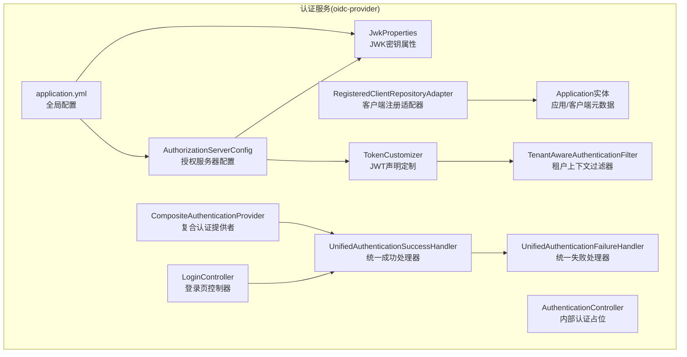
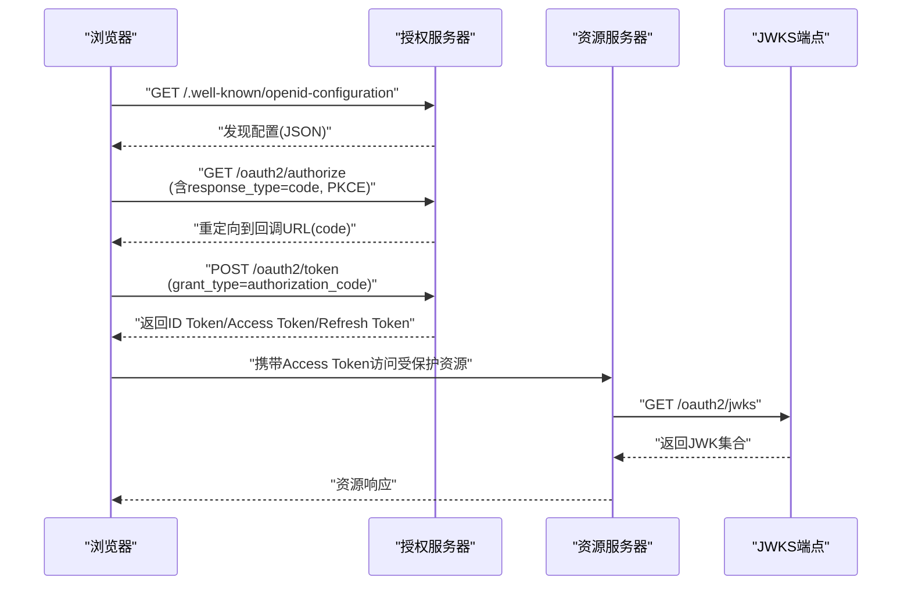
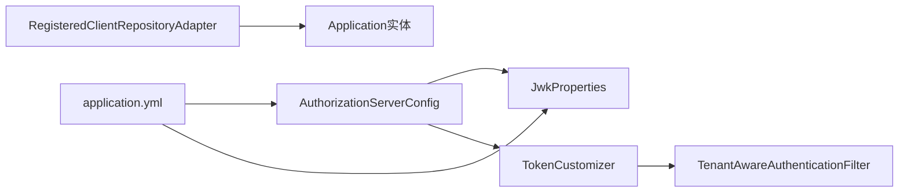

# OIDC Provider功能

<cite>
**本文引用的文件**
- [AuthorizationServerConfig.java](file://iam-auth-server/src/main/java/iam/platform/auth/infrastructure/config/AuthorizationServerConfig.java)
- [JwkProperties.java](file://iam-auth-server/src/main/java/iam/platform/auth/infrastructure/config/JwkProperties.java)
- [RegisteredClientRepositoryAdapter.java](file://iam-auth-server/src/main/java/iam/platform/auth/infrastructure/security/RegisteredClientRepositoryAdapter.java)
- [TokenCustomizer.java](file://iam-auth-server/src/main/java/iam/platform/auth/infrastructure/security/TokenCustomizer.java)
- [TenantAwareAuthenticationFilter.java](file://iam-auth-server/src/main/java/iam/platform/auth/infrastructure/security/TenantAwareAuthenticationFilter.java)
- [Application.java](file://iam-auth-server/src/main/java/iam/platform/auth/domain/model/entity/Application.java)
- [application.yml](file://iam-auth-server/src/main/resources/application.yml)
- [LoginController.java](file://iam-auth-server/src/main/java/iam/platform/auth/interfaces/web/LoginController.java)
- [AuthenticationController.java](file://iam-auth-server/src/main/java/iam/platform/auth/interfaces/rest/AuthenticationController.java)
- [UnifiedAuthenticationSuccessHandler.java](file://iam-auth-server/src/main/java/iam/platform/auth/infrastructure/security/UnifiedAuthenticationSuccessHandler.java)
- [UnifiedAuthenticationFailureHandler.java](file://iam-auth-server/src/main/java/iam/platform/auth/infrastructure/security/UnifiedAuthenticationFailureHandler.java)
- [CompositeAuthenticationProvider.java](file://iam-auth-server/src/main/java/iam/platform/auth/infrastructure/security/CompositeAuthenticationProvider.java)
</cite>

## 目录
1. [简介](#简介)
2. [项目结构](#项目结构)
3. [核心组件](#核心组件)
4. [架构总览](#架构总览)
5. [详细组件分析](#详细组件分析)
6. [依赖分析](#依赖分析)
7. [性能考虑](#性能考虑)
8. [故障排查指南](#故障排查指南)
9. [结论](#结论)
10. [附录](#附录)

## 简介
本文件面向OIDC Provider（OpenID Connect 1.0）能力的完整技术说明，覆盖以下关键能力：
- 授权码授权 + PKCE（Authorization Code Grant + PKCE）
- 客户端凭证授权（Client Credentials Grant）
- 刷新令牌（Refresh Token）刷新机制
- 发现端点（/.well-known/openid-configuration）
- JWKS端点（/oauth2/jwks）
- 用户信息端点（/userinfo）
- 令牌撤销（Token Revocation）

同时，文档将详细说明各OAuth2/OIDC标准端点的实现要点、参数配置、安全机制与使用场景；提供API调用示例路径、错误处理策略与性能优化建议；解释JWT生成、签名与验证流程及RS256非对称加密实现；并给出客户端集成指南与最佳实践。

## 项目结构
OIDC Provider能力主要位于认证服务模块（iam-auth-server），通过Spring Authorization Server自动暴露标准OAuth2/OIDC端点，并由自定义组件扩展多租户上下文、令牌声明与密钥管理等能力。

图表来源
- [AuthorizationServerConfig.java:1-130](file://iam-auth-server/src/main/java/iam/platform/auth/infrastructure/config/AuthorizationServerConfig.java#L1-L130)
- [RegisteredClientRepositoryAdapter.java:1-101](file://iam-auth-server/src/main/java/iam/platform/auth/infrastructure/security/RegisteredClientRepositoryAdapter.java#L1-L101)
- [TokenCustomizer.java:1-127](file://iam-auth-server/src/main/java/iam/platform/auth/infrastructure/security/TokenCustomizer.java#L1-L127)
- [JwkProperties.java:1-16](file://iam-auth-server/src/main/java/iam/platform/auth/infrastructure/config/JwkProperties.java#L1-L16)
- [TenantAwareAuthenticationFilter.java:1-68](file://iam-auth-server/src/main/java/iam/platform/auth/infrastructure/security/TenantAwareAuthenticationFilter.java#L1-L68)
- [Application.java:1-211](file://iam-auth-server/src/main/java/iam/platform/auth/domain/model/entity/Application.java#L1-L211)
- [application.yml:1-144](file://iam-auth-server/src/main/resources/application.yml#L1-L144)
- [LoginController.java:1-58](file://iam-auth-server/src/main/java/iam/platform/auth/interfaces/web/LoginController.java#L1-L58)
- [AuthenticationController.java:1-47](file://iam-auth-server/src/main/java/iam/platform/auth/interfaces/rest/AuthenticationController.java#L1-L47)
- [UnifiedAuthenticationSuccessHandler.java:1-68](file://iam-auth-server/src/main/java/iam/platform/auth/infrastructure/security/UnifiedAuthenticationSuccessHandler.java#L1-L68)
- [UnifiedAuthenticationFailureHandler.java:1-37](file://iam-auth-server/src/main/java/iam/platform/auth/infrastructure/security/UnifiedAuthenticationFailureHandler.java#L1-L37)
- [CompositeAuthenticationProvider.java:1-75](file://iam-auth-server/src/main/java/iam/platform/auth/infrastructure/security/CompositeAuthenticationProvider.java#L1-L75)

章节来源
- [AuthorizationServerConfig.java:1-130](file://iam-auth-server/src/main/java/iam/platform/auth/infrastructure/config/AuthorizationServerConfig.java#L1-L130)
- [application.yml:1-144](file://iam-auth-server/src/main/resources/application.yml#L1-L144)

## 核心组件
- 授权服务器配置：启用OIDC默认配置、设置发现端点、资源服务器JWT解码器、租户感知过滤器接入。
- 客户端注册适配器：将业务应用实体映射为RegisteredClient，支持授权码+密码两种授权类型，可按客户端配置开启PKCE与同意授权。
- JWT声明定制：在访问令牌中注入多租户上下文、角色与权限等声明，支持未选择租户时返回候选账户列表。
- 密钥与JWK：加载PEM格式RSA私钥/公钥，生成JWK集合，使用SHA-256指纹生成稳定KeyID，保证重启后JWKS缓存可用。
- 多租户上下文：登录后将租户ID/账户ID写入会话，后续请求通过过滤器恢复到线程本地上下文。
- 登录与路由：登录页控制器支持多种租户识别方式；统一成功处理器执行后置认证流程并根据协议路由重定向。
- 认证策略：复合认证提供者按凭据类型分派至不同认证策略，串联前置/后置管道。

章节来源
- [AuthorizationServerConfig.java:44-99](file://iam-auth-server/src/main/java/iam/platform/auth/infrastructure/config/AuthorizationServerConfig.java#L44-L99)
- [RegisteredClientRepositoryAdapter.java:47-99](file://iam-auth-server/src/main/java/iam/platform/auth/infrastructure/security/RegisteredClientRepositoryAdapter.java#L47-L99)
- [TokenCustomizer.java:33-125](file://iam-auth-server/src/main/java/iam/platform/auth/infrastructure/security/TokenCustomizer.java#L33-L125)
- [JwkProperties.java:8-16](file://iam-auth-server/src/main/java/iam/platform/auth/infrastructure/config/JwkProperties.java#L8-L16)
- [TenantAwareAuthenticationFilter.java:28-66](file://iam-auth-server/src/main/java/iam/platform/auth/infrastructure/security/TenantAwareAuthenticationFilter.java#L28-L66)
- [LoginController.java:19-57](file://iam-auth-server/src/main/java/iam/platform/auth/interfaces/web/LoginController.java#L19-L57)
- [UnifiedAuthenticationSuccessHandler.java:35-66](file://iam-auth-server/src/main/java/iam/platform/auth/infrastructure/security/UnifiedAuthenticationSuccessHandler.java#L35-L66)
- [CompositeAuthenticationProvider.java:31-68](file://iam-auth-server/src/main/java/iam/platform/auth/infrastructure/security/CompositeAuthenticationProvider.java#L31-L68)

## 架构总览
下图展示OIDC Provider的核心交互：浏览器发起授权请求，授权服务器完成认证与授权，颁发ID Token/Access Token/Refresh Token；资源服务器使用JWKS解码JWT；客户端通过令牌端点进行刷新与撤销。

图表来源
- [AuthorizationServerConfig.java:46-64](file://iam-auth-server/src/main/java/iam/platform/auth/infrastructure/config/AuthorizationServerConfig.java#L46-L64)
- [application.yml:81-88](file://iam-auth-server/src/main/resources/application.yml#L81-L88)

## 详细组件分析

### 授权服务器配置与发现端点
- 启用OIDC默认配置与标准端点，自动暴露发现端点与JWKS端点。
- 设置issuer URI，用于生成标准的iss字段与JWKS中的kid。
- 注册JWT解码器，基于JWK集合解析与验证JWT签名。

章节来源
- [AuthorizationServerConfig.java:46-64](file://iam-auth-server/src/main/java/iam/platform/auth/infrastructure/config/AuthorizationServerConfig.java#L46-L64)
- [AuthorizationServerConfig.java:95-99](file://iam-auth-server/src/main/java/iam/platform/auth/infrastructure/config/AuthorizationServerConfig.java#L95-L99)
- [application.yml:81-88](file://iam-auth-server/src/main/resources/application.yml#L81-L88)

### JWKS端点与密钥管理
- 加载PEM格式RSA私钥与公钥，构建JWK集合，使用公钥编码的SHA-256指纹生成稳定KeyID，避免重启导致客户端缓存失效。
- 支持从配置指定密钥文件位置，便于环境隔离与密钥轮换。

章节来源
- [AuthorizationServerConfig.java:66-93](file://iam-auth-server/src/main/java/iam/platform/auth/infrastructure/config/AuthorizationServerConfig.java#L66-L93)
- [JwkProperties.java:12-15](file://iam-auth-server/src/main/java/iam/platform/auth/infrastructure/config/JwkProperties.java#L12-L15)
- [application.yml:82-85](file://iam-auth-server/src/main/resources/application.yml#L82-L85)

### 客户端注册与授权类型
- 将应用实体映射为RegisteredClient，支持授权码与密码两种授权类型。
- 按客户端配置决定是否要求PKCE与授权同意，动态注入回调地址、作用域与令牌TTL。

章节来源
- [RegisteredClientRepositoryAdapter.java:47-99](file://iam-auth-server/src/main/java/iam/platform/auth/infrastructure/security/RegisteredClientRepositoryAdapter.java#L47-L99)
- [Application.java:35-38](file://iam-auth-server/src/main/java/iam/platform/auth/domain/model/entity/Application.java#L35-L38)
- [Application.java:152-168](file://iam-auth-server/src/main/java/iam/platform/auth/domain/model/entity/Application.java#L152-L168)

### 授权码授权 + PKCE（Authorization Code + PKCE）
- 授权端点：/oauth2/authorize（由授权服务器自动暴露）。
- 流程要点：
  - 客户端生成随机S256 code_challenge与对应code_verifier。
  - 授权请求携带response_type=code、code_challenge、code_challenge_method=S256。
  - 回调URL收到授权码后，交换令牌端点换取ID Token/Access Token/Refresh Token。
- 客户端配置：需在RegisteredClient中注册合法回调地址与作用域；若requireProofKey=true则强制PKCE。

章节来源
- [RegisteredClientRepositoryAdapter.java:74-83](file://iam-auth-server/src/main/java/iam/platform/auth/infrastructure/security/RegisteredClientRepositoryAdapter.java#L74-L83)
- [Application.java:152-168](file://iam-auth-server/src/main/java/iam/platform/auth/domain/model/entity/Application.java#L152-L168)

### 客户端凭证授权（Client Credentials Grant）
- 适用场景：机器到机器（M2M）调用，无需用户参与。
- 实现方式：Spring Authorization Server自动暴露令牌端点，客户端以client_id/client_secret向POST /oauth2/token提交grant_type=client_credentials。
- 注意：本项目未显式扩展额外的客户端凭证授权逻辑，遵循标准实现。

章节来源
- [RegisteredClientRepositoryAdapter.java:67-78](file://iam-auth-server/src/main/java/iam/platform/auth/infrastructure/security/RegisteredClientRepositoryAdapter.java#L67-L78)

### 刷新令牌（Refresh Token）刷新机制
- 客户端在授权码流程中可能获得Refresh Token；后续使用POST /oauth2/token提交grant_type=refresh_token刷新访问令牌。
- 刷新令牌TTL由客户端配置决定，过期后需重新授权。

章节来源
- [RegisteredClientRepositoryAdapter.java:90-96](file://iam-auth-server/src/main/java/iam/platform/auth/infrastructure/security/RegisteredClientRepositoryAdapter.java#L90-L96)
- [Application.java:173-178](file://iam-auth-server/src/main/java/iam/platform/auth/domain/model/entity/Application.java#L173-L178)

### 用户信息端点（/userinfo）
- OIDC标准端点，返回受保护的用户档案信息。
- 在本项目中，ID Token已包含基本用户声明（如email、nickname、person_id），/userinfo端点通常用于补充信息或与ID Token互补。
- 资源服务器需具备有效的Access Token才能访问该端点。

章节来源
- [TokenCustomizer.java:44-48](file://iam-auth-server/src/main/java/iam/platform/auth/infrastructure/security/TokenCustomizer.java#L44-L48)

### 令牌撤销（Token Revocation）
- OIDC标准端点：POST /oauth2/revoke（由授权服务器自动暴露）。
- 客户端以表单格式提交token与token_type_hint（access_token或refresh_token）。
- 本项目未提供额外扩展，遵循标准实现。

章节来源
- [AuthorizationServerConfig.java:46-64](file://iam-auth-server/src/main/java/iam/platform/auth/infrastructure/config/AuthorizationServerConfig.java#L46-L64)

### JWT生成、签名与验证（RS256非对称）
- 生成：使用RSA私钥对JWT进行签名，声明由TokenCustomizer注入。
- 验证：资源服务器通过JWKS端点获取公钥，使用相同算法验证签名与iss匹配。
- KeyID稳定性：基于公钥编码的SHA-256指纹生成固定kid，避免重启导致客户端缓存失效。

章节来源
- [AuthorizationServerConfig.java:66-93](file://iam-auth-server/src/main/java/iam/platform/auth/infrastructure/config/AuthorizationServerConfig.java#L66-L93)
- [TokenCustomizer.java:33-61](file://iam-auth-server/src/main/java/iam/platform/auth/infrastructure/security/TokenCustomizer.java#L33-L61)

### 多租户上下文与声明注入
- 登录后将当前租户ID/账户ID写入会话，过滤器在后续请求中恢复到线程本地上下文。
- JWT声明定制器根据上下文注入tenant_id、tenant_account_id、tenant_code、employee_no、roles、permissions等。

章节来源
- [TenantAwareAuthenticationFilter.java:49-66](file://iam-auth-server/src/main/java/iam/platform/auth/infrastructure/security/TenantAwareAuthenticationFilter.java#L49-L66)
- [TokenCustomizer.java:54-97](file://iam-auth-server/src/main/java/iam/platform/auth/infrastructure/security/TokenCustomizer.java#L54-L97)

### 登录与协议路由
- 登录页控制器支持子域名、查询参数与头部等多种租户识别方式；未识别时引导用户选择租户。
- 统一成功处理器完成后置认证流程，依据协议与结果计算重定向URL。

章节来源
- [LoginController.java:19-57](file://iam-auth-server/src/main/java/iam/platform/auth/interfaces/web/LoginController.java#L19-L57)
- [UnifiedAuthenticationSuccessHandler.java:35-66](file://iam-auth-server/src/main/java/iam/platform/auth/infrastructure/security/UnifiedAuthenticationSuccessHandler.java#L35-L66)

### 认证策略与流水线
- 复合认证提供者根据凭据类型分派至具体认证策略，执行前置/后置认证流水线，最终返回统一认证令牌。

章节来源
- [CompositeAuthenticationProvider.java:31-68](file://iam-auth-server/src/main/java/iam/platform/auth/infrastructure/security/CompositeAuthenticationProvider.java#L31-L68)

## 依赖分析
- 授权服务器配置依赖JWK属性与租户过滤器，负责装配标准端点与JWT解码器。
- 客户端注册适配器依赖应用仓库，将业务实体映射为RegisteredClient。
- 令牌定制器依赖人员、租户账户与角色服务，注入多租户上下文与权限声明。
- 应用配置文件提供issuer URI、JWK密钥位置与安全策略开关。

图表来源
- [AuthorizationServerConfig.java:40-42](file://iam-auth-server/src/main/java/iam/platform/auth/infrastructure/config/AuthorizationServerConfig.java#L40-L42)
- [RegisteredClientRepositoryAdapter.java:22](file://iam-auth-server/src/main/java/iam/platform/auth/infrastructure/security/RegisteredClientRepositoryAdapter.java#L22)
- [TokenCustomizer.java:29-31](file://iam-auth-server/src/main/java/iam/platform/auth/infrastructure/security/TokenCustomizer.java#L29-L31)
- [application.yml:81-88](file://iam-auth-server/src/main/resources/application.yml#L81-L88)

章节来源
- [AuthorizationServerConfig.java:40-42](file://iam-auth-server/src/main/java/iam/platform/auth/infrastructure/config/AuthorizationServerConfig.java#L40-L42)
- [RegisteredClientRepositoryAdapter.java:22](file://iam-auth-server/src/main/java/iam/platform/auth/infrastructure/security/RegisteredClientRepositoryAdapter.java#L22)
- [TokenCustomizer.java:29-31](file://iam-auth-server/src/main/java/iam/platform/auth/infrastructure/security/TokenCustomizer.java#L29-L31)
- [application.yml:81-88](file://iam-auth-server/src/main/resources/application.yml#L81-L88)

## 性能考虑
- 密钥与JWK缓存：JWKS端点返回静态JWK集合，KeyID稳定有助于客户端缓存复用，减少网络开销。
- 令牌TTL：按客户端配置设置访问令牌与刷新令牌有效期，平衡安全性与用户体验。
- 并发与连接池：数据库连接池与Redis连接池参数已在配置中设定，建议结合压测调整最大连接数与超时时间。
- 会话存储：使用Redis存储会话，降低内存占用与跨节点同步成本。

章节来源
- [AuthorizationServerConfig.java:120-128](file://iam-auth-server/src/main/java/iam/platform/auth/infrastructure/config/AuthorizationServerConfig.java#L120-L128)
- [RegisteredClientRepositoryAdapter.java:90-96](file://iam-auth-server/src/main/java/iam/platform/auth/infrastructure/security/RegisteredClientRepositoryAdapter.java#L90-L96)
- [application.yml:15-32](file://iam-auth-server/src/main/resources/application.yml#L15-L32)
- [application.yml:49-53](file://iam-auth-server/src/main/resources/application.yml#L49-L53)

## 故障排查指南
- 发现端点不可用：检查授权服务器配置与issuer URI是否正确。
- JWKS端点异常：确认密钥文件路径与PEM格式正确，KeyID生成逻辑是否生效。
- 授权码交换失败：核对回调地址、作用域与PKCE参数是否匹配客户端配置。
- 令牌验证失败：确认资源服务器JWKS端点可达且返回的公钥与签发方匹配。
- 登录后无租户上下文：检查会话中租户ID/账户ID是否存在，过滤器是否正确恢复上下文。
- 认证失败重定向：查看统一失败处理器的错误参数与登录页提示。

章节来源
- [AuthorizationServerConfig.java:46-64](file://iam-auth-server/src/main/java/iam/platform/auth/infrastructure/config/AuthorizationServerConfig.java#L46-L64)
- [JwkProperties.java:12-15](file://iam-auth-server/src/main/java/iam/platform/auth/infrastructure/config/JwkProperties.java#L12-L15)
- [RegisteredClientRepositoryAdapter.java:74-83](file://iam-auth-server/src/main/java/iam/platform/auth/infrastructure/security/RegisteredClientRepositoryAdapter.java#L74-L83)
- [TenantAwareAuthenticationFilter.java:49-66](file://iam-auth-server/src/main/java/iam/platform/auth/infrastructure/security/TenantAwareAuthenticationFilter.java#L49-L66)
- [UnifiedAuthenticationFailureHandler.java:13-35](file://iam-auth-server/src/main/java/iam/platform/auth/infrastructure/security/UnifiedAuthenticationFailureHandler.java#L13-L35)

## 结论
本OIDC Provider基于Spring Authorization Server实现了标准的OAuth2/OIDC能力，并通过自定义组件增强了多租户上下文、令牌声明与密钥管理。整体架构清晰、扩展点明确，适合在企业级多租户场景中部署与演进。

## 附录

### API调用示例（路径指引）
- 发现端点：GET /.well-known/openid-configuration
- 授权端点：GET /oauth2/authorize（由授权服务器暴露）
- 令牌端点：POST /oauth2/token（授权码交换、刷新令牌、客户端凭证）
- JWKS端点：GET /oauth2/jwks
- 用户信息端点：GET /userinfo（由授权服务器暴露）
- 令牌撤销：POST /oauth2/revoke（由授权服务器暴露）

章节来源
- [AuthorizationServerConfig.java:46-64](file://iam-auth-server/src/main/java/iam/platform/auth/infrastructure/config/AuthorizationServerConfig.java#L46-L64)
- [application.yml:81-88](file://iam-auth-server/src/main/resources/application.yml#L81-L88)

### 安全机制与最佳实践
- 强制PKCE：对所有公共客户端启用PKCE，防止授权码拦截。
- 最小权限：仅授予必要作用域，避免过度授权。
- 令牌TTL：合理设置访问令牌与刷新令牌有效期，定期轮换密钥。
- 密钥管理：使用安全的密钥存储方案（如KMS），定期轮换RSA密钥并更新JWKS。
- 日志与审计：记录关键事件（登录、令牌发放、撤销），便于追踪与合规。

### 客户端集成指南
- 注册应用：在后台管理系统创建应用，配置回调地址、作用域与令牌TTL。
- 授权码+PKCE：前端生成code_verifier与code_challenge，发起授权请求并处理回调。
- 资源访问：使用Access Token访问受保护资源，资源服务器通过JWKS验证JWT。
- 刷新令牌：在Access Token过期时使用Refresh Token刷新，注意刷新令牌的生命周期。
- 令牌撤销：在敏感操作（如退出登录）后主动撤销令牌，提升安全性。