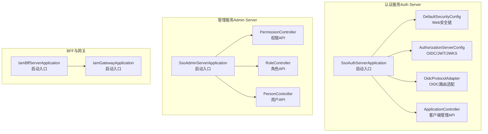
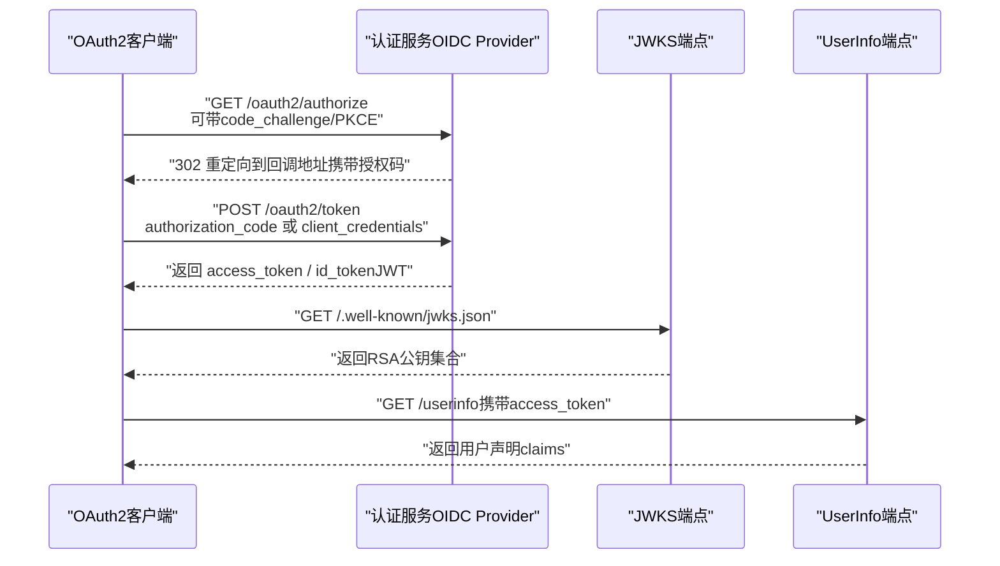
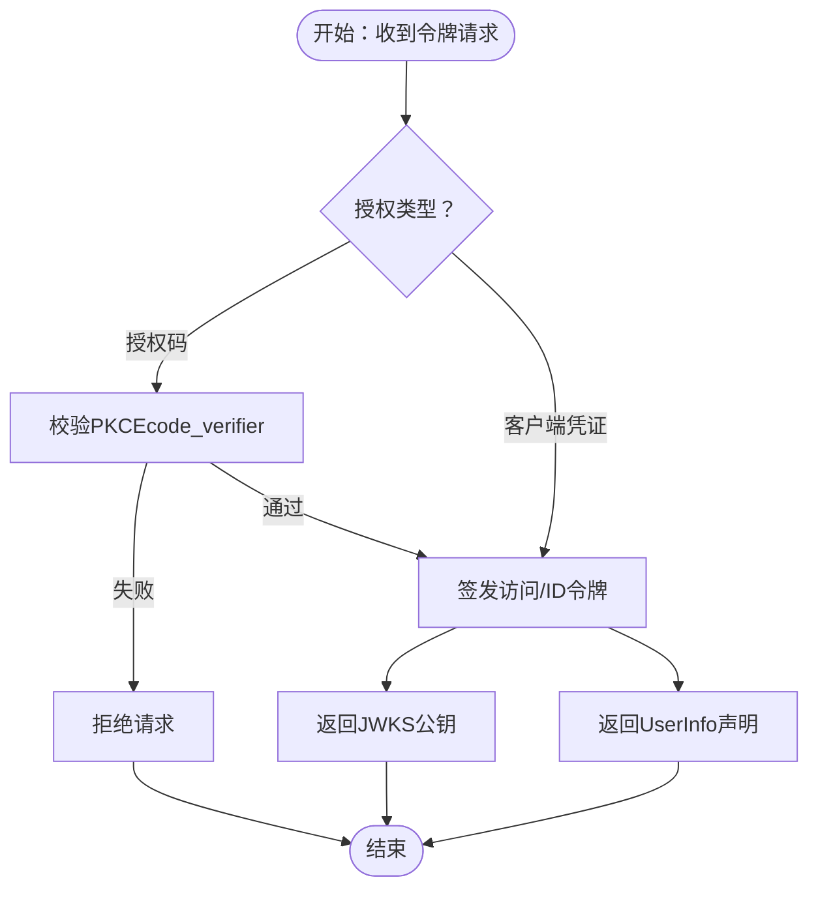
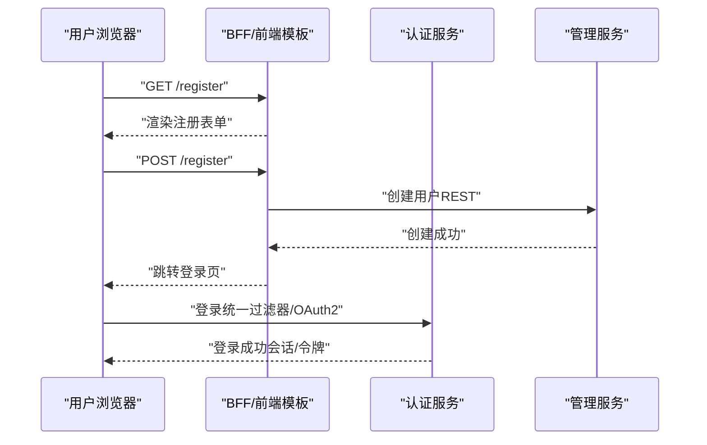
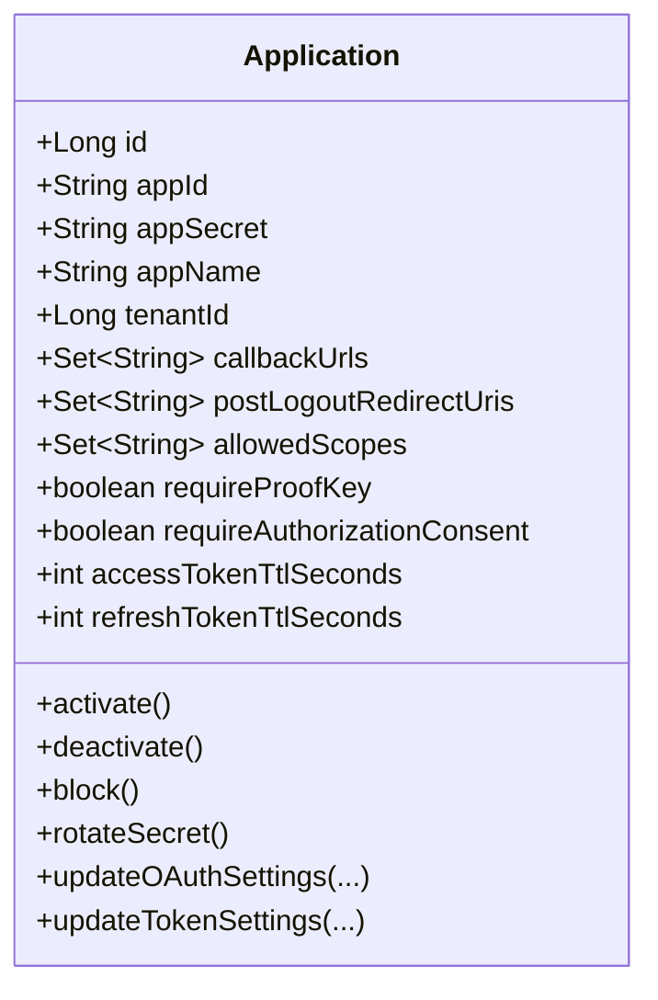
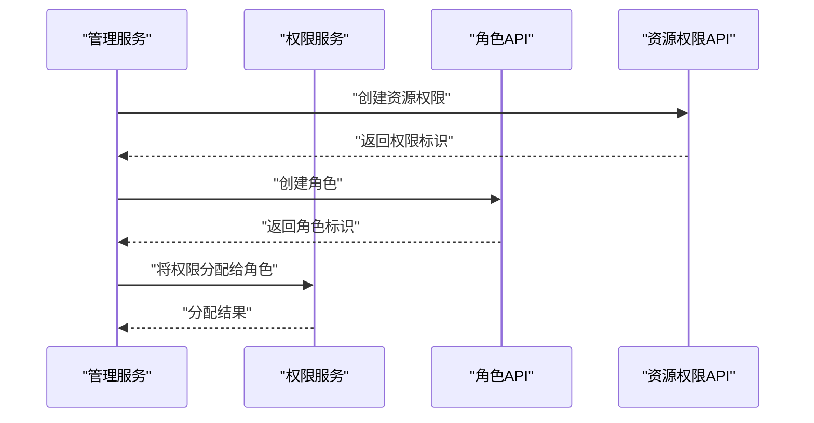
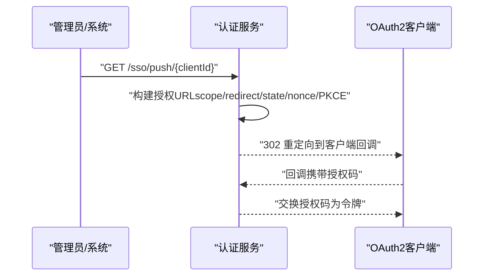
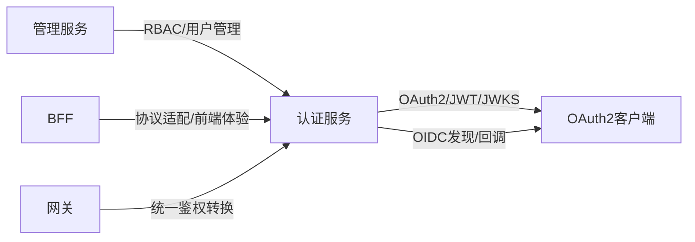

# 核心功能

<cite>
**本文引用的文件**
- [SsoAdminServerApplication.java](file://iam-admin-server/src/main/java/iam/platform/admin/SsoAdminServerApplication.java)
- [SsoAuthServerApplication.java](file://iam-auth-server/src/main/java/iam/platform/auth/SsoAuthServerApplication.java)
- [IamBffServerApplication.java](file://iam-bff-server/src/main/java/iam/platform/bff/IamBffServerApplication.java)
- [IamGatewayApplication.java](file://iam-gateway/src/main/java/iam/platform/gateway/IamGatewayApplication.java)
- [AuthorizationServerConfig.java](file://iam-auth-server/src/main/java/iam/platform/auth/infrastructure/config/AuthorizationServerConfig.java)
- [DefaultSecurityConfig.java](file://iam-auth-server/src/main/java/iam/platform/auth/infrastructure/config/DefaultSecurityConfig.java)
- [application.yml（认证服务）](file://iam-auth-server/src/main/resources/application.yml)
- [application.yml（管理服务）](file://iam-admin-server/src/main/resources/application.yml)
- [PersonController.java](file://iam-admin-server/src/main/java/iam/platform/admin/interfaces/rest/PersonController.java)
- [RoleController.java](file://iam-admin-server/src/main/java/iam/platform/admin/interfaces/rest/RoleController.java)
- [ApplicationController.java](file://iam-admin-server/src/main/java/iam/platform/admin/interfaces/rest/ApplicationController.java)
- [PermissionController.java](file://iam-admin-server/src/main/java/iam/platform/admin/interfaces/rest/PermissionController.java)
- [PermissionApplicationService.java](file://iam-admin-server/src/main/java/iam/platform/admin/application/service/PermissionApplicationService.java)
- [TokenSettings.java](file://iam-common/src/main/java/iam/platform/common/model/valueobject/TokenSettings.java)
- [Application.java](file://iam-auth-server/src/main/java/iam/platform/auth/domain/model/entity/Application.java)
- [统一认证框架.md](file://docs/design/统一认证框架.md)
- [TOKEN_VALIDATION_TEST.md](file://docs/TOKEN_VALIDATION_TEST.md)
- [OidcProtocolAdapter.java](file://iam-auth-server/src/main/java/iam/platform/auth/application/service/routing/OidcProtocolAdapter.java)
- [SsoProactiveAuthService.java](file://iam-auth-server/src/main/java/iam/platform/auth/application/service/SsoProactiveAuthService.java)
- [SsoProactiveAuthController.java](file://iam-auth-server/src/main/java/iam/platform/auth/interfaces/rest/SsoProactiveAuthController.java)
- [RegistrationController.java](file://iam-auth-server/src/main/java/iam/platform/auth/interfaces/web/RegistrationController.java)
</cite>

## 目录
1. [简介](#简介)
2. [项目结构](#项目结构)
3. [核心组件](#核心组件)
4. [架构总览](#架构总览)
5. [详细组件分析](#详细组件分析)
6. [依赖分析](#依赖分析)
7. [性能考虑](#性能考虑)
8. [故障排查指南](#故障排查指南)
9. [结论](#结论)
10. [附录](#附录)

## 简介
本文件面向IAM平台项目，系统化梳理并解释平台的核心功能与实现要点，覆盖以下方面：
- OIDC Provider能力：授权码（含PKCE）、客户端凭证、刷新令牌、发现、JWKS、UserInfo、撤销
- 用户管理：注册/登录、用户CRUD、密码策略、账户状态
- OAuth2客户端管理：注册/配置、Client Secret轮换、授权类型与作用域
- 角色权限管理：角色CRUD、角色分配、RBAC
- 技术实现细节：JWT、加密算法、安全策略
- 实际场景与业务价值：单点登录、第三方集成、多租户与组织架构
- 扩展与定制：协议适配、鉴权策略扩展、租户隔离

## 项目结构
平台采用多服务分层架构，包含认证服务、管理服务、BFF网关与网关层，配合统一的认证框架与安全配置。

图表来源
- [SsoAuthServerApplication.java:13-18](file://iam-auth-server/src/main/java/iam/platform/auth/SsoAuthServerApplication.java#L13-L18)
- [DefaultSecurityConfig.java:27-63](file://iam-auth-server/src/main/java/iam/platform/auth/infrastructure/config/DefaultSecurityConfig.java#L27-L63)
- [AuthorizationServerConfig.java:36-64](file://iam-auth-server/src/main/java/iam/platform/auth/infrastructure/config/AuthorizationServerConfig.java#L36-L64)
- [OidcProtocolAdapter.java:12-39](file://iam-auth-server/src/main/java/iam/platform/auth/application/service/routing/OidcProtocolAdapter.java#L12-L39)
- [ApplicationController.java:32-84](file://iam-admin-server/src/main/java/iam/platform/admin/interfaces/rest/ApplicationController.java#L32-L84)
- [SsoAdminServerApplication.java:11-15](file://iam-admin-server/src/main/java/iam/platform/admin/SsoAdminServerApplication.java#L11-L15)
- [PermissionController.java:25-88](file://iam-admin-server/src/main/java/iam/platform/admin/interfaces/rest/PermissionController.java#L25-L88)
- [RoleController.java:23-58](file://iam-admin-server/src/main/java/iam/platform/admin/interfaces/rest/RoleController.java#L23-L58)
- [PersonController.java:25-68](file://iam-admin-server/src/main/java/iam/platform/admin/interfaces/rest/PersonController.java#L25-L68)
- [IamBffServerApplication.java:11-16](file://iam-bff-server/src/main/java/iam/platform/bff/IamBffServerApplication.java#L11-L16)
- [IamGatewayApplication.java:9-14](file://iam-gateway/src/main/java/iam/platform/gateway/IamGatewayApplication.java#L9-L14)

章节来源
- [SsoAuthServerApplication.java:13-18](file://iam-auth-server/src/main/java/iam/platform/auth/SsoAuthServerApplication.java#L13-L18)
- [SsoAdminServerApplication.java:11-15](file://iam-admin-server/src/main/java/iam/platform/admin/SsoAdminServerApplication.java#L11-L15)
- [IamBffServerApplication.java:11-16](file://iam-bff-server/src/main/java/iam/platform/bff/IamBffServerApplication.java#L11-L16)
- [IamGatewayApplication.java:9-14](file://iam-gateway/src/main/java/iam/platform/gateway/IamGatewayApplication.java#L9-L14)

## 核心组件
- 认证服务（OIDC Provider）
  - OIDC/JWT/JWKS：基于Spring Authorization Server，提供授权码（含PKCE）、客户端凭证、刷新令牌、发现、JWKS、UserInfo、撤销等能力
  - 安全过滤链：统一登录入口、OAuth2登录、会话与租户上下文
  - 协议适配：根据Referer与回调路径识别OIDC流程，进行重定向与路由
- 管理服务（RBAC与用户）
  - 用户管理：用户CRUD、注册入口、密码策略
  - 角色与权限：角色CRUD、角色-权限分配、资源权限
  - 客户端管理：应用CRUD、状态管理、Secret轮换、作用域与回调配置
- BFF与网关
  - BFF：前端体验与协议适配
  - 网关：统一鉴权转换、路由与安全

章节来源
- [AuthorizationServerConfig.java:36-99](file://iam-auth-server/src/main/java/iam/platform/auth/infrastructure/config/AuthorizationServerConfig.java#L36-L99)
- [DefaultSecurityConfig.java:27-94](file://iam-auth-server/src/main/java/iam/platform/auth/infrastructure/config/DefaultSecurityConfig.java#L27-L94)
- [OidcProtocolAdapter.java:12-39](file://iam-auth-server/src/main/java/iam/platform/auth/application/service/routing/OidcProtocolAdapter.java#L12-L39)
- [PersonController.java:25-68](file://iam-admin-server/src/main/java/iam/platform/admin/interfaces/rest/PersonController.java#L25-L68)
- [RoleController.java:23-58](file://iam-admin-server/src/main/java/iam/platform/admin/interfaces/rest/RoleController.java#L23-L58)
- [PermissionController.java:25-88](file://iam-admin-server/src/main/java/iam/platform/admin/interfaces/rest/PermissionController.java#L25-L88)
- [ApplicationController.java:32-139](file://iam-admin-server/src/main/java/iam/platform/admin/interfaces/rest/ApplicationController.java#L32-L139)

## 架构总览
下图展示OIDC Provider与客户端交互的关键流程，涵盖授权码（含PKCE）、令牌签发、JWKS与UserInfo端点、以及主动推送授权码的能力。

图表来源
- [统一认证框架.md:440-484](file://docs/design/统一认证框架.md#L440-L484)
- [AuthorizationServerConfig.java:44-99](file://iam-auth-server/src/main/java/iam/platform/auth/infrastructure/config/AuthorizationServerConfig.java#L44-L99)
- [application.yml（认证服务）:81-88](file://iam-auth-server/src/main/resources/application.yml#L81-L88)

## 详细组件分析

### OIDC Provider能力与实现
- 授权码（Authorization Code）+ PKCE
  - 支持标准授权码流程，并强制公共客户端使用PKCE；挑战值在授权端点生成，换取令牌时使用原始随机串校验
  - 由Spring Authorization Server在令牌端点自动处理PKCE校验
- 客户端凭证（Client Credentials）
  - 适用于机器对机器调用，直接使用client_id与client_secret换取访问令牌
- 刷新令牌（Refresh Token）
  - 默认启用，令牌设置对象提供访问令牌与刷新令牌TTL配置
- 发现端点（OIDC Discovery）
  - 通过授权服务器设置暴露issuer，供客户端动态发现端点
- JWKS端点（JSON Web Key Set）
  - 基于RSA密钥对生成JWK集合，KeyID使用公钥SHA-256指纹前128位，保证重启后KeyID稳定
- UserInfo端点
  - 通过OAuth2 Resource Server配置启用，使用JWT解码器验证签名并解析声明
- 令牌撤销（Token Revocation）
  - 通过Spring Authorization Server默认实现，结合Redis存储与会话管理

图表来源
- [统一认证框架.md:440-484](file://docs/design/统一认证框架.md#L440-L484)
- [AuthorizationServerConfig.java:66-99](file://iam-auth-server/src/main/java/iam/platform/auth/infrastructure/config/AuthorizationServerConfig.java#L66-L99)
- [TokenSettings.java:17-48](file://iam-common/src/main/java/iam/platform/common/model/valueobject/TokenSettings.java#L17-L48)

章节来源
- [统一认证框架.md:440-484](file://docs/design/统一认证框架.md#L440-L484)
- [AuthorizationServerConfig.java:66-128](file://iam-auth-server/src/main/java/iam/platform/auth/infrastructure/config/AuthorizationServerConfig.java#L66-L128)
- [application.yml（认证服务）:81-88](file://iam-auth-server/src/main/resources/application.yml#L81-L88)
- [TokenSettings.java:17-62](file://iam-common/src/main/java/iam/platform/common/model/valueobject/TokenSettings.java#L17-L62)

### 用户管理功能
- 注册与登录
  - 提供注册页面与控制器，提交后调用管理服务创建用户
  - 登录采用统一过滤器与OAuth2登录配置，支持多协议适配
- 用户CRUD API
  - 管理服务提供用户增删改查与分页列表接口
- 密码管理
  - 使用BCrypt编码器进行密码存储与校验
- 账户状态管理
  - 结合预/后置认证管道，支持账户锁定、白名单/黑名单、速率限制等策略

图表来源
- [RegistrationController.java:19-37](file://iam-auth-server/src/main/java/iam/platform/auth/interfaces/web/RegistrationController.java#L19-L37)
- [PersonController.java:33-66](file://iam-admin-server/src/main/java/iam/platform/admin/interfaces/rest/PersonController.java#L33-L66)
- [DefaultSecurityConfig.java:35-88](file://iam-auth-server/src/main/java/iam/platform/auth/infrastructure/config/DefaultSecurityConfig.java#L35-L88)

章节来源
- [RegistrationController.java:19-37](file://iam-auth-server/src/main/java/iam/platform/auth/interfaces/web/RegistrationController.java#L19-L37)
- [PersonController.java:33-66](file://iam-admin-server/src/main/java/iam/platform/admin/interfaces/rest/PersonController.java#L33-L66)
- [DefaultSecurityConfig.java:91-93](file://iam-auth-server/src/main/java/iam/platform/auth/infrastructure/config/DefaultSecurityConfig.java#L91-L93)

### OAuth2客户端管理
- 客户端注册与配置
  - 应用实体包含应用ID/密钥、名称、描述、Logo、主页、回调地址、退出回调、允许的作用域、是否要求PKCE/同意、令牌TTL等
  - 支持状态生命周期：激活/停用/封禁
- Client Secret管理
  - 支持Secret轮换，新Secret仅在创建时可见
- 授权类型与作用域配置
  - 通过回调地址、退出回调、作用域集合与PKCE要求进行灵活配置

图表来源
- [Application.java:21-211](file://iam-auth-server/src/main/java/iam/platform/auth/domain/model/entity/Application.java#L21-L211)
- [ApplicationController.java:38-115](file://iam-admin-server/src/main/java/iam/platform/admin/interfaces/rest/ApplicationController.java#L38-L115)

章节来源
- [Application.java:48-178](file://iam-auth-server/src/main/java/iam/platform/auth/domain/model/entity/Application.java#L48-L178)
- [ApplicationController.java:38-139](file://iam-admin-server/src/main/java/iam/platform/admin/interfaces/rest/ApplicationController.java#L38-L139)

### 角色权限管理（RBAC）
- 角色CRUD与分配
  - 角色API支持创建、查询、列表与删除；权限API支持资源权限创建、删除与角色-权限分配
  - 分配时进行存在性校验，避免重复分配
- 权限评估与审计
  - 权限服务提供角色-权限映射与资源权限查询，结合审计注解记录操作

图表来源
- [PermissionController.java:66-87](file://iam-admin-server/src/main/java/iam/platform/admin/interfaces/rest/PermissionController.java#L66-L87)
- [PermissionApplicationService.java:82-102](file://iam-admin-server/src/main/java/iam/platform/admin/application/service/PermissionApplicationService.java#L82-L102)
- [RoleController.java:31-56](file://iam-admin-server/src/main/java/iam/platform/admin/interfaces/rest/RoleController.java#L31-L56)

章节来源
- [PermissionController.java:25-88](file://iam-admin-server/src/main/java/iam/platform/admin/interfaces/rest/PermissionController.java#L25-L88)
- [PermissionApplicationService.java:82-106](file://iam-admin-server/src/main/java/iam/platform/admin/application/service/PermissionApplicationService.java#L82-L106)
- [RoleController.java:23-58](file://iam-admin-server/src/main/java/iam/platform/admin/interfaces/rest/RoleController.java#L23-L58)

### 主动推送授权码（SSO Proactive Auth）
- 场景：在用户已登录的情况下，服务端模拟授权请求，生成授权码并重定向至客户端回调地址
- 关键点：根据客户端配置构造授权URL，自动选择首个回调地址与默认scope，支持state、nonce、PKCE参数透传

图表来源
- [SsoProactiveAuthController.java:48-62](file://iam-auth-server/src/main/java/iam/platform/auth/interfaces/rest/SsoProactiveAuthController.java#L48-L62)
- [SsoProactiveAuthService.java:37-67](file://iam-auth-server/src/main/java/iam/platform/auth/application/service/SsoProactiveAuthService.java#L37-L67)
- [OidcProtocolAdapter.java:12-39](file://iam-auth-server/src/main/java/iam/platform/auth/application/service/routing/OidcProtocolAdapter.java#L12-L39)

章节来源
- [SsoProactiveAuthController.java:35-62](file://iam-auth-server/src/main/java/iam/platform/auth/interfaces/rest/SsoProactiveAuthController.java#L35-L62)
- [SsoProactiveAuthService.java:36-67](file://iam-auth-server/src/main/java/iam/platform/auth/application/service/SsoProactiveAuthService.java#L36-L67)
- [OidcProtocolAdapter.java:12-39](file://iam-auth-server/src/main/java/iam/platform/auth/application/service/routing/OidcProtocolAdapter.java#L12-L39)

## 依赖分析
- 认证服务
  - 启动类启用配置扫描与JPA仓库扫描，安全配置包含统一认证过滤器、OAuth2登录与JWT资源服务器
  - OIDC配置注入JWK源与JWT解码器，授权服务器设置暴露issuer
- 管理服务
  - 启动类启用配置扫描与JPA仓库扫描，提供用户、角色、权限与应用管理API
- BFF与网关
  - BFF启用服务发现与Feign客户端，网关注入统一认证转换器与安全配置

图表来源
- [SsoAuthServerApplication.java:9-12](file://iam-auth-server/src/main/java/iam/platform/auth/SsoAuthServerApplication.java#L9-L12)
- [SsoAdminServerApplication.java:8-10](file://iam-admin-server/src/main/java/iam/platform/admin/SsoAdminServerApplication.java#L8-L10)
- [IamBffServerApplication.java:8-10](file://iam-bff-server/src/main/java/iam/platform/bff/IamBffServerApplication.java#L8-L10)
- [IamGatewayApplication.java:7-8](file://iam-gateway/src/main/java/iam/platform/gateway/IamGatewayApplication.java#L7-L8)

章节来源
- [SsoAuthServerApplication.java:9-12](file://iam-auth-server/src/main/java/iam/platform/auth/SsoAuthServerApplication.java#L9-L12)
- [SsoAdminServerApplication.java:8-10](file://iam-admin-server/src/main/java/iam/platform/admin/SsoAdminServerApplication.java#L8-L10)
- [IamBffServerApplication.java:8-10](file://iam-bff-server/src/main/java/iam/platform/bff/IamBffServerApplication.java#L8-L10)
- [IamGatewayApplication.java:7-8](file://iam-gateway/src/main/java/iam/platform/gateway/IamGatewayApplication.java#L7-L8)

## 性能考虑
- 令牌TTL与刷新策略：通过令牌设置对象控制访问令牌与刷新令牌有效期，建议按业务风险调整
- JWKS稳定性：KeyID基于公钥SHA-256指纹，避免重启导致缓存失效
- 会话与速率限制：结合Redis会话与速率限制策略，降低暴力破解与滥用风险
- 数据库连接池：合理配置连接池大小与超时，保障高并发下的响应时间

## 故障排查指南
- OIDC端点可用性
  - 检查发现端点与JWKS端点是否可达，确认issuer配置与证书链
- 令牌验证
  - 使用测试清单核对JWT格式、必要声明与自定义声明，验证签名与过期时间
- 客户端配置
  - 确认回调地址、退出回调、作用域与PKCE要求是否与客户端一致
- 用户注册/登录
  - 检查注册控制器与管理服务调用链路，确认异常处理与冲突提示

章节来源
- [TOKEN_VALIDATION_TEST.md:222-235](file://docs/TOKEN_VALIDATION_TEST.md#L222-L235)
- [application.yml（认证服务）:81-88](file://iam-auth-server/src/main/resources/application.yml#L81-L88)
- [application.yml（管理服务）:66-68](file://iam-admin-server/src/main/resources/application.yml#L66-L68)

## 结论
本平台围绕“统一认证框架”构建，提供完整的OIDC Provider能力与RBAC体系，结合多租户与组织架构支持，满足企业级身份与访问管理需求。通过标准化的API与灵活的配置，既能快速落地，又具备良好的扩展与定制空间。

## 附录
- 配置要点
  - 认证服务：SSL、数据库、Redis、JWK密钥、安全策略、CAS与LDAP等
  - 管理服务：数据库迁移、OpenAPI文档路径、审计日志与异步队列
- 测试与验证
  - 参考OIDC端点测试清单，逐项验证令牌、JWKS、发现与用户信息端点

章节来源
- [application.yml（认证服务）:1-144](file://iam-auth-server/src/main/resources/application.yml#L1-L144)
- [application.yml（管理服务）:1-102](file://iam-admin-server/src/main/resources/application.yml#L1-L102)
- [TOKEN_VALIDATION_TEST.md:222-235](file://docs/TOKEN_VALIDATION_TEST.md#L222-L235)