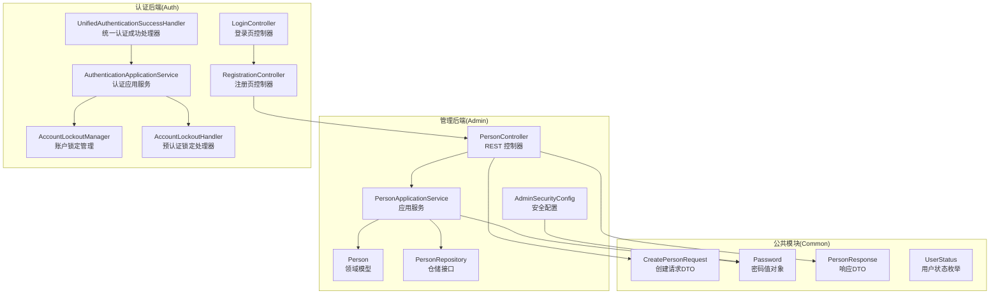
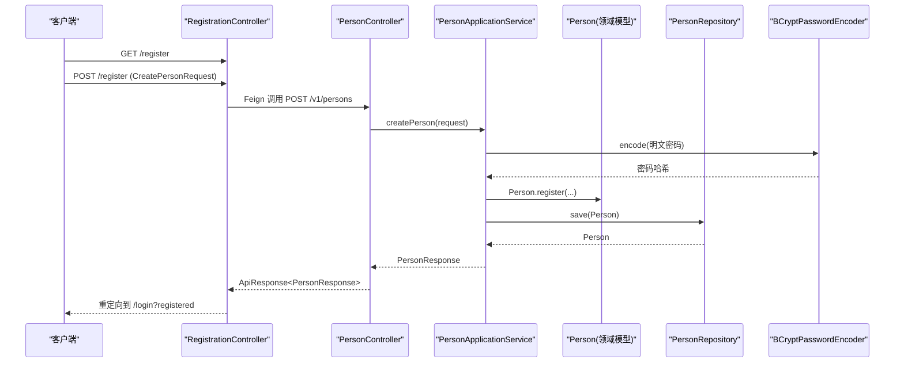
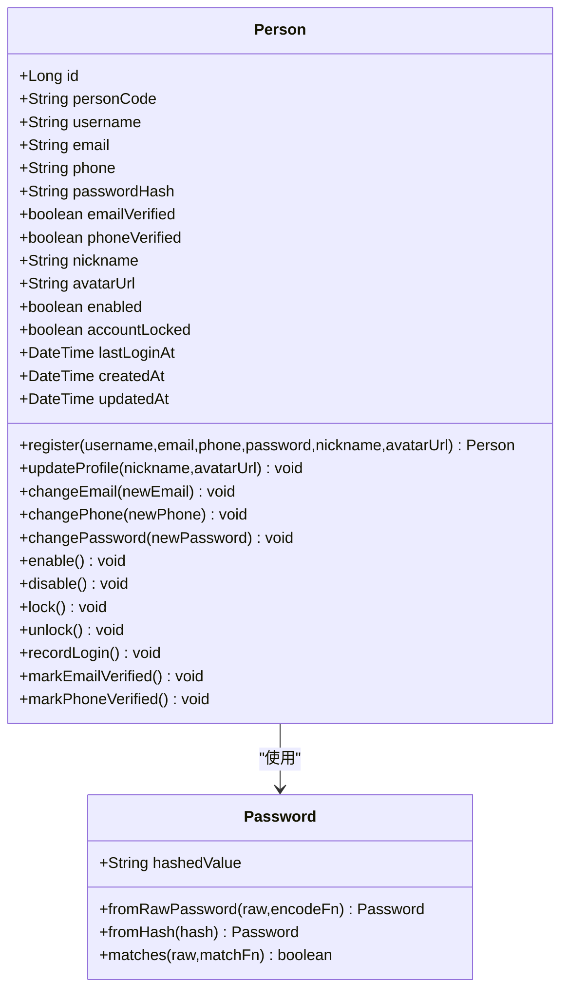
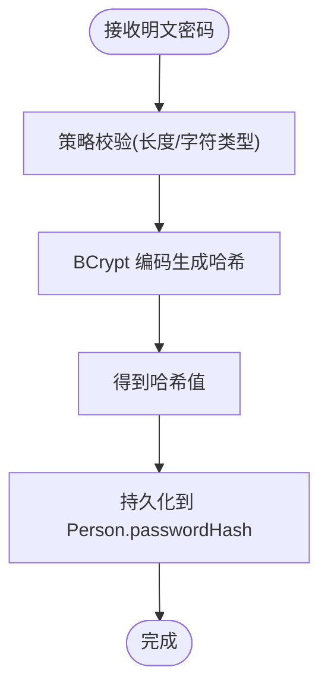
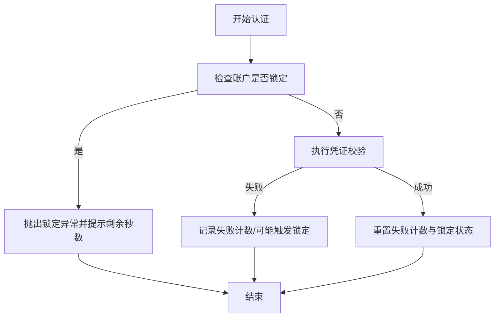
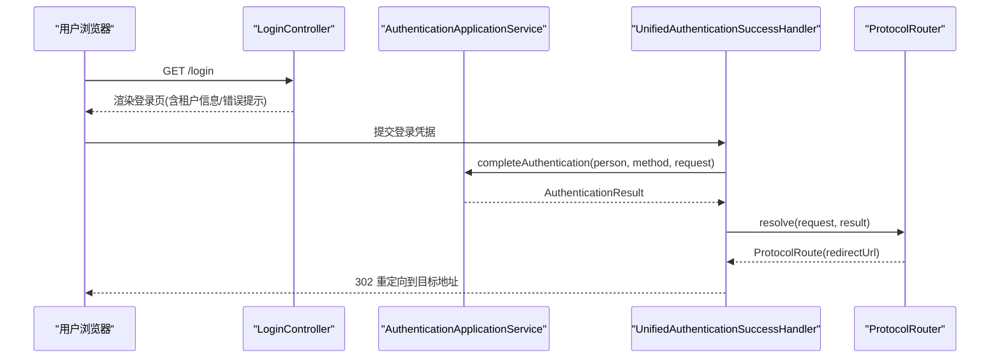
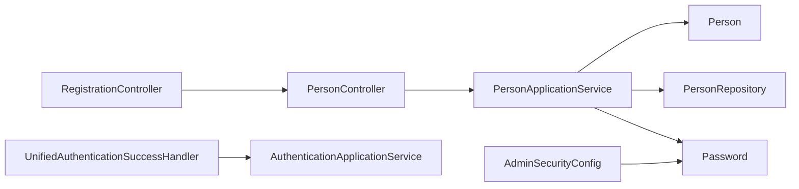

# 用户管理功能

<cite>
**本文引用的文件**
- [PersonController.java](file://iam-admin-server/src/main/java/iam/platform/admin/interfaces/rest/PersonController.java)
- [PersonApplicationService.java](file://iam-admin-server/src/main/java/iam/platform/admin/application/service/PersonApplicationService.java)
- [Person.java](file://iam-admin-server/src/main/java/iam/platform/admin/domain/model/entity/Person.java)
- [PersonRepository.java](file://iam-admin-server/src/main/java/iam/platform/admin/domain/repository/PersonRepository.java)
- [CreatePersonRequest.java](file://iam-common/src/main/java/iam/platform/common/dto/request/CreatePersonRequest.java)
- [PersonResponse.java](file://iam-common/src/main/java/iam/platform/common/dto/response/PersonResponse.java)
- [Password.java](file://iam-common/src/main/java/iam/platform/common/model/valueobject/Password.java)
- [AdminSecurityConfig.java](file://iam-admin-server/src/main/java/iam/platform/admin/infrastructure/config/AdminSecurityConfig.java)
- [LoginController.java](file://iam-auth-server/src/main/java/iam/platform/auth/interfaces/web/LoginController.java)
- [RegistrationController.java](file://iam-auth-server/src/main/java/iam/platform/auth/interfaces/web/RegistrationController.java)
- [AuthenticationApplicationService.java](file://iam-auth-server/src/main/java/iam/platform/auth/application/service/AuthenticationApplicationService.java)
- [UnifiedAuthenticationSuccessHandler.java](file://iam-auth-server/src/main/java/iam/platform/auth/infrastructure/security/UnifiedAuthenticationSuccessHandler.java)
- [AccountLockoutManager.java](file://iam-auth-server/src/main/java/iam/platform/auth/infrastructure/security/AccountLockoutManager.java)
- [AccountLockoutHandler.java](file://iam-auth-server/src/main/java/iam/platform/auth/application/service/pipeline/AccountLockoutHandler.java)
- [UserStatus.java](file://iam-common/src/main/java/iam/platform/common/model/enums/UserStatus.java)
</cite>

## 目录
1. [简介](#简介)
2. [项目结构](#项目结构)
3. [核心组件](#核心组件)
4. [架构总览](#架构总览)
5. [详细组件分析](#详细组件分析)
6. [依赖分析](#依赖分析)
7. [性能考虑](#性能考虑)
8. [故障排查指南](#故障排查指南)
9. [结论](#结论)
10. [附录](#附录)

## 简介
本文件面向用户管理功能，系统性阐述注册与登录流程、用户CRUD API、密码管理机制（BCrypt加密与策略校验）、账户状态管理、实体模型设计与业务规则、验证与认证机制、会话与安全防护、RESTful接口规范、最佳实践（数据验证、权限控制、审计日志）以及数据迁移、批量操作与集成测试指导。目标是帮助开发者与运维人员快速理解并正确实施用户管理能力。

## 项目结构
用户管理涉及三大模块：
- 管理后端（iam-admin-server）：提供用户CRUD API、领域模型与仓储、审计日志与安全配置。
- 认证后端（iam-auth-server）：提供登录/注册页面、统一认证成功处理器、多租户上下文与会话管理、账户锁定等安全策略。
- 公共模块（iam-common）：定义DTO、值对象（如Password）、枚举（如UserStatus）与通用异常。

图表来源
- [PersonController.java:1-68](file://iam-admin-server/src/main/java/iam/platform/admin/interfaces/rest/PersonController.java#L1-L68)
- [PersonApplicationService.java:1-122](file://iam-admin-server/src/main/java/iam/platform/admin/application/service/PersonApplicationService.java#L1-L122)
- [Person.java:1-158](file://iam-admin-server/src/main/java/iam/platform/admin/domain/model/entity/Person.java#L1-L158)
- [PersonRepository.java:1-34](file://iam-admin-server/src/main/java/iam/platform/admin/domain/repository/PersonRepository.java#L1-L34)
- [AdminSecurityConfig.java:1-41](file://iam-admin-server/src/main/java/iam/platform/admin/infrastructure/config/AdminSecurityConfig.java#L1-L41)
- [LoginController.java:1-58](file://iam-auth-server/src/main/java/iam/platform/auth/interfaces/web/LoginController.java#L1-L58)
- [RegistrationController.java:1-46](file://iam-auth-server/src/main/java/iam/platform/auth/interfaces/web/RegistrationController.java#L1-L46)
- [AuthenticationApplicationService.java:1-139](file://iam-auth-server/src/main/java/iam/platform/auth/application/service/AuthenticationApplicationService.java#L1-L139)
- [UnifiedAuthenticationSuccessHandler.java:1-68](file://iam-auth-server/src/main/java/iam/platform/auth/infrastructure/security/UnifiedAuthenticationSuccessHandler.java#L1-L68)
- [AccountLockoutManager.java:1-134](file://iam-auth-server/src/main/java/iam/platform/auth/infrastructure/security/AccountLockoutManager.java#L1-L134)
- [AccountLockoutHandler.java:1-41](file://iam-auth-server/src/main/java/iam/platform/auth/application/service/pipeline/AccountLockoutHandler.java#L1-L41)
- [CreatePersonRequest.java:1-37](file://iam-common/src/main/java/iam/platform/common/dto/request/CreatePersonRequest.java#L1-L37)
- [Password.java:1-90](file://iam-common/src/main/java/iam/platform/common/model/valueobject/Password.java#L1-L90)
- [PersonResponse.java:1-30](file://iam-common/src/main/java/iam/platform/common/dto/response/PersonResponse.java#L1-L30)
- [UserStatus.java:1-8](file://iam-common/src/main/java/iam/platform/common/model/enums/UserStatus.java#L1-L8)

章节来源
- [PersonController.java:1-68](file://iam-admin-server/src/main/java/iam/platform/admin/interfaces/rest/PersonController.java#L1-L68)
- [PersonApplicationService.java:1-122](file://iam-admin-server/src/main/java/iam/platform/admin/application/service/PersonApplicationService.java#L1-L122)
- [AdminSecurityConfig.java:1-41](file://iam-admin-server/src/main/java/iam/platform/admin/infrastructure/config/AdminSecurityConfig.java#L1-L41)

## 核心组件
- 用户实体模型（Person）
  - 字段覆盖身份标识（用户名、邮箱、手机号）、凭证（密码哈希）、状态（启用/锁定/已验证）、时间戳（最后登录、创建/更新）。
  - 行为方法包括注册工厂方法、资料更新、邮箱/手机变更、密码变更、启停用、锁定/解锁、登录记录、验证标记。
- 密码值对象（Password）
  - 提供从明文生成哈希、从存储哈希重建、匹配校验的方法；内置最小长度、大小写、数字等策略校验。
- 应用服务（PersonApplicationService）
  - 负责唯一性校验、密码策略与哈希、领域模型构建与持久化、分页查询、审计日志注解。
- 安全配置（AdminSecurityConfig）
  - 配置BCrypt编码器、无状态会话、JWT上下文过滤器、放通健康检查与文档路径。
- 登录/注册控制器
  - 登录页控制器支持多租户识别与错误提示；注册页控制器通过Feign调用管理后端创建用户。
- 认证应用服务与统一处理器
  - 完成认证后处理（多租户选择、权限装载、会话设置、上下文注入），统一处理首方与OAuth2认证成功。

章节来源
- [Person.java:1-158](file://iam-admin-server/src/main/java/iam/platform/admin/domain/model/entity/Person.java#L1-L158)
- [Password.java:1-90](file://iam-common/src/main/java/iam/platform/common/model/valueobject/Password.java#L1-L90)
- [PersonApplicationService.java:1-122](file://iam-admin-server/src/main/java/iam/platform/admin/application/service/PersonApplicationService.java#L1-L122)
- [AdminSecurityConfig.java:1-41](file://iam-admin-server/src/main/java/iam/platform/admin/infrastructure/config/AdminSecurityConfig.java#L1-L41)
- [LoginController.java:1-58](file://iam-auth-server/src/main/java/iam/platform/auth/interfaces/web/LoginController.java#L1-L58)
- [RegistrationController.java:1-46](file://iam-auth-server/src/main/java/iam/platform/auth/interfaces/web/RegistrationController.java#L1-L46)
- [AuthenticationApplicationService.java:1-139](file://iam-auth-server/src/main/java/iam/platform/auth/application/service/AuthenticationApplicationService.java#L1-L139)
- [UnifiedAuthenticationSuccessHandler.java:1-68](file://iam-auth-server/src/main/java/iam/platform/auth/infrastructure/security/UnifiedAuthenticationSuccessHandler.java#L1-L68)

## 架构总览
用户管理采用分层与DDD思想：
- 接口层：REST控制器（管理后端）与Web控制器（认证后端）。
- 应用层：应用服务编排业务流程、调用仓储与领域模型。
- 领域层：实体与值对象封装不变量与行为。
- 基础设施：安全配置、密码编码器、会话与上下文、管道式认证处理。

图表来源
- [RegistrationController.java:1-46](file://iam-auth-server/src/main/java/iam/platform/auth/interfaces/web/RegistrationController.java#L1-L46)
- [PersonController.java:1-68](file://iam-admin-server/src/main/java/iam/platform/admin/interfaces/rest/PersonController.java#L1-L68)
- [PersonApplicationService.java:1-122](file://iam-admin-server/src/main/java/iam/platform/admin/application/service/PersonApplicationService.java#L1-L122)
- [Person.java:1-158](file://iam-admin-server/src/main/java/iam/platform/admin/domain/model/entity/Person.java#L1-L158)
- [PersonRepository.java:1-34](file://iam-admin-server/src/main/java/iam/platform/admin/domain/repository/PersonRepository.java#L1-L34)
- [AdminSecurityConfig.java:1-41](file://iam-admin-server/src/main/java/iam/platform/admin/infrastructure/config/AdminSecurityConfig.java#L1-L41)

## 详细组件分析

### 用户实体模型与业务规则
- 设计理念
  - 使用值对象Password封装密码策略与哈希，避免在通用模块引入Spring Security依赖。
  - 实体Person集中维护账户状态（启用/锁定）、验证状态（邮箱/手机）、登录记录等不变量。
- 字段与规则
  - 身份标识：用户名必填且唯一；邮箱/手机号唯一性由应用服务在创建/更新时校验。
  - 凭证：仅保存哈希，不保留明文；密码策略在值对象中强制执行。
  - 状态：enabled表示是否启用；accountLocked用于临时锁定；emailVerified/phoneVerified用于二次验证标记。
  - 时间：createdAt/updatedAt自动维护；lastLoginAt记录最近一次登录。
- 关键行为
  - 注册工厂方法：生成PersonCode，初始化默认状态。
  - 更新资料：支持昵称与头像更新。
  - 变更邮箱/手机：触发唯一性校验并清除对应验证标记。
  - 启停用/锁定/解锁：更新状态并刷新时间戳。
  - 登录记录：更新最近登录时间。

图表来源
- [Person.java:1-158](file://iam-admin-server/src/main/java/iam/platform/admin/domain/model/entity/Person.java#L1-L158)
- [Password.java:1-90](file://iam-common/src/main/java/iam/platform/common/model/valueobject/Password.java#L1-L90)

章节来源
- [Person.java:1-158](file://iam-admin-server/src/main/java/iam/platform/admin/domain/model/entity/Person.java#L1-L158)
- [Password.java:1-90](file://iam-common/src/main/java/iam/platform/common/model/valueobject/Password.java#L1-L90)

### 用户CRUD API接口
- 创建用户
  - 方法与路径：POST /v1/persons
  - 请求体：CreatePersonRequest（用户名、邮箱、手机号、密码、昵称、头像URL）
  - 成功响应：201 Created，返回PersonResponse
  - 错误：400 参数无效；409 冲突（唯一性冲突）
- 查询用户
  - 获取详情：GET /v1/persons/{id}
  - 列表分页：GET /v1/persons?page=0&size=20
  - 成功响应：200 OK，返回PersonResponse或分页包装
- 更新用户
  - 方法与路径：PUT /v1/persons/{id}
  - 请求体：UpdatePersonRequest（可选昵称、头像、邮箱、手机号、启用状态）
  - 成功响应：200 OK，返回PersonResponse
  - 错误：404 用户不存在；400 参数无效；409 冲突
- 删除用户
  - 方法与路径：DELETE /v1/persons/{id}
  - 成功响应：204 No Content
  - 错误：404 用户不存在

章节来源
- [PersonController.java:1-68](file://iam-admin-server/src/main/java/iam/platform/admin/interfaces/rest/PersonController.java#L1-L68)
- [CreatePersonRequest.java:1-37](file://iam-common/src/main/java/iam/platform/common/dto/request/CreatePersonRequest.java#L1-L37)
- [PersonResponse.java:1-30](file://iam-common/src/main/java/iam/platform/common/dto/response/PersonResponse.java#L1-L30)

### 密码管理机制（BCrypt与策略）
- 编码器
  - 管理后端使用BCryptPasswordEncoder进行密码哈希与匹配。
- 值对象策略
  - Password值对象在构造时执行最小长度、大小写字母、数字等策略校验，并通过传入的编码函数生成哈希。
- 匹配机制
  - 登录侧通过匹配函数验证明文与存储哈希，避免在公共模块直接依赖具体编码器。

图表来源
- [AdminSecurityConfig.java:1-41](file://iam-admin-server/src/main/java/iam/platform/admin/infrastructure/config/AdminSecurityConfig.java#L1-L41)
- [Password.java:1-90](file://iam-common/src/main/java/iam/platform/common/model/valueobject/Password.java#L1-L90)

章节来源
- [AdminSecurityConfig.java:1-41](file://iam-admin-server/src/main/java/iam/platform/admin/infrastructure/config/AdminSecurityConfig.java#L1-L41)
- [Password.java:1-90](file://iam-common/src/main/java/iam/platform/common/model/valueobject/Password.java#L1-L90)

### 账户状态管理
- 状态枚举：ACTIVE、INACTIVE、LOCKED（用于通用场景）
- 实体状态：
  - enabled：启用/禁用账户
  - accountLocked：锁定/解锁账户
  - emailVerified/phoneVerified：验证标记
- 登录流程中的锁定策略：
  - 预认证阶段检查账户锁定状态，超过阈值则临时锁定并提示剩余秒数。
  - 成功登录后重置失败计数与锁定状态。

图表来源
- [AccountLockoutManager.java:1-134](file://iam-auth-server/src/main/java/iam/platform/auth/infrastructure/security/AccountLockoutManager.java#L1-L134)
- [AccountLockoutHandler.java:1-41](file://iam-auth-server/src/main/java/iam/platform/auth/application/service/pipeline/AccountLockoutHandler.java#L1-L41)
- [UserStatus.java:1-8](file://iam-common/src/main/java/iam/platform/common/model/enums/UserStatus.java#L1-L8)

章节来源
- [AccountLockoutManager.java:1-134](file://iam-auth-server/src/main/java/iam/platform/auth/infrastructure/security/AccountLockoutManager.java#L1-L134)
- [AccountLockoutHandler.java:1-41](file://iam-auth-server/src/main/java/iam/platform/auth/application/service/pipeline/AccountLockoutHandler.java#L1-L41)
- [UserStatus.java:1-8](file://iam-common/src/main/java/iam/platform/common/model/enums/UserStatus.java#L1-L8)

### 注册与登录流程
- 注册流程
  - 前端访问注册页，提交CreatePersonRequest。
  - 认证后端通过Feign调用管理后端创建用户，若唯一性冲突返回错误。
  - 成功后重定向到登录页并提示注册成功。
- 登录流程
  - 支持多租户识别（子域名/查询参数/头部），登录页根据租户信息渲染。
  - 统一认证成功处理器汇聚首方与OAuth2认证结果，运行后置管道，选择租户账号并建立带权限的认证上下文，写入会话，重定向至协议路由目标。

图表来源
- [LoginController.java:1-58](file://iam-auth-server/src/main/java/iam/platform/auth/interfaces/web/LoginController.java#L1-L58)
- [AuthenticationApplicationService.java:1-139](file://iam-auth-server/src/main/java/iam/platform/auth/application/service/AuthenticationApplicationService.java#L1-L139)
- [UnifiedAuthenticationSuccessHandler.java:1-68](file://iam-auth-server/src/main/java/iam/platform/auth/infrastructure/security/UnifiedAuthenticationSuccessHandler.java#L1-L68)

章节来源
- [LoginController.java:1-58](file://iam-auth-server/src/main/java/iam/platform/auth/interfaces/web/LoginController.java#L1-L58)
- [RegistrationController.java:1-46](file://iam-auth-server/src/main/java/iam/platform/auth/interfaces/web/RegistrationController.java#L1-L46)
- [AuthenticationApplicationService.java:1-139](file://iam-auth-server/src/main/java/iam/platform/auth/application/service/AuthenticationApplicationService.java#L1-L139)
- [UnifiedAuthenticationSuccessHandler.java:1-68](file://iam-auth-server/src/main/java/iam/platform/auth/infrastructure/security/UnifiedAuthenticationSuccessHandler.java#L1-L68)

### 会话管理与安全防护
- 会话策略
  - 管理后端采用无状态会话（STATELESS），通过JWT上下文过滤器传递身份。
  - 认证后端在成功认证后将租户ID与账号ID写入HTTP会话，便于后续请求识别。
- 安全防护
  - BCrypt密码编码器保障凭证安全。
  - 账户锁定基于Redis失败次数阈值，超限临时锁定并提示剩余秒数。
  - 预认证管道在认证前执行账户状态与速率限制等检查。

章节来源
- [AdminSecurityConfig.java:1-41](file://iam-admin-server/src/main/java/iam/platform/admin/infrastructure/config/AdminSecurityConfig.java#L1-L41)
- [AuthenticationApplicationService.java:1-139](file://iam-auth-server/src/main/java/iam/platform/auth/application/service/AuthenticationApplicationService.java#L1-L139)
- [AccountLockoutManager.java:1-134](file://iam-auth-server/src/main/java/iam/platform/auth/infrastructure/security/AccountLockoutManager.java#L1-L134)

### 数据验证、权限控制与审计日志
- 数据验证
  - 请求DTO对用户名、邮箱、手机号、密码长度与格式进行约束。
  - 应用服务在创建/更新时再次执行唯一性校验。
- 权限控制
  - 认证成功后按租户账号加载权限集合，构建带权限的身份令牌。
- 审计日志
  - 应用服务方法使用审计注解，记录创建/更新/删除事件与资源标识。

章节来源
- [CreatePersonRequest.java:1-37](file://iam-common/src/main/java/iam/platform/common/dto/request/CreatePersonRequest.java#L1-L37)
- [PersonApplicationService.java:1-122](file://iam-admin-server/src/main/java/iam/platform/admin/application/service/PersonApplicationService.java#L1-L122)
- [AuthenticationApplicationService.java:1-139](file://iam-auth-server/src/main/java/iam/platform/auth/application/service/AuthenticationApplicationService.java#L1-L139)

## 依赖分析
- 模块间依赖
  - 认证后端通过Feign客户端调用管理后端的用户创建接口。
  - 管理后端使用BCryptPasswordEncoder与Password值对象处理密码。
  - 认证后端在统一处理器中调用认证应用服务完成租户选择与权限装载。
- 组件耦合
  - 控制器与应用服务松耦合，应用服务通过仓储与领域模型实现业务逻辑。
  - 安全配置与应用服务解耦，通过Spring Security过滤链生效。

图表来源
- [RegistrationController.java:1-46](file://iam-auth-server/src/main/java/iam/platform/auth/interfaces/web/RegistrationController.java#L1-L46)
- [PersonController.java:1-68](file://iam-admin-server/src/main/java/iam/platform/admin/interfaces/rest/PersonController.java#L1-L68)
- [PersonApplicationService.java:1-122](file://iam-admin-server/src/main/java/iam/platform/admin/application/service/PersonApplicationService.java#L1-L122)
- [Person.java:1-158](file://iam-admin-server/src/main/java/iam/platform/admin/domain/model/entity/Person.java#L1-L158)
- [PersonRepository.java:1-34](file://iam-admin-server/src/main/java/iam/platform/admin/domain/repository/PersonRepository.java#L1-L34)
- [Password.java:1-90](file://iam-common/src/main/java/iam/platform/common/model/valueobject/Password.java#L1-L90)
- [AdminSecurityConfig.java:1-41](file://iam-admin-server/src/main/java/iam/platform/admin/infrastructure/config/AdminSecurityConfig.java#L1-L41)
- [UnifiedAuthenticationSuccessHandler.java:1-68](file://iam-auth-server/src/main/java/iam/platform/auth/infrastructure/security/UnifiedAuthenticationSuccessHandler.java#L1-L68)
- [AuthenticationApplicationService.java:1-139](file://iam-auth-server/src/main/java/iam/platform/auth/application/service/AuthenticationApplicationService.java#L1-L139)

章节来源
- [RegistrationController.java:1-46](file://iam-auth-server/src/main/java/iam/platform/auth/interfaces/web/RegistrationController.java#L1-L46)
- [PersonController.java:1-68](file://iam-admin-server/src/main/java/iam/platform/admin/interfaces/rest/PersonController.java#L1-L68)
- [PersonApplicationService.java:1-122](file://iam-admin-server/src/main/java/iam/platform/admin/application/service/PersonApplicationService.java#L1-L122)
- [AdminSecurityConfig.java:1-41](file://iam-admin-server/src/main/java/iam/platform/admin/infrastructure/config/AdminSecurityConfig.java#L1-L41)
- [UnifiedAuthenticationSuccessHandler.java:1-68](file://iam-auth-server/src/main/java/iam/platform/auth/infrastructure/security/UnifiedAuthenticationSuccessHandler.java#L1-L68)
- [AuthenticationApplicationService.java:1-139](file://iam-auth-server/src/main/java/iam/platform/auth/application/service/AuthenticationApplicationService.java#L1-L139)

## 性能考虑
- 密码哈希成本
  - BCrypt默认迭代次数较高，建议在生产环境监控认证延迟并结合硬件资源评估。
- Redis依赖
  - 账户锁定依赖Redis，需确保高可用与低延迟；异常时采用“失败放行”策略以保证可用性。
- 分页查询
  - 列表接口使用分页参数，建议配合索引优化与合理页大小控制。
- 会话无状态
  - 管理后端无状态设计降低会话存储压力，但需确保网关与下游服务正确传递认证上下文。

## 故障排查指南
- 注册失败（409）
  - 检查用户名/邮箱/手机号唯一性冲突；确认前端校验与后端唯一性服务一致。
- 登录被锁定
  - 查看账户锁定Redis键是否存在与过期时间；确认失败计数是否递增。
- 会话未生效
  - 管理后端为无状态，确认JWT上下文过滤器是否正确注入；认证后端检查会话属性是否写入。
- 密码不匹配
  - 确认使用BCrypt编码器与匹配函数；避免在不同模块混用不同编码器。

章节来源
- [PersonApplicationService.java:1-122](file://iam-admin-server/src/main/java/iam/platform/admin/application/service/PersonApplicationService.java#L1-L122)
- [AccountLockoutManager.java:1-134](file://iam-auth-server/src/main/java/iam/platform/auth/infrastructure/security/AccountLockoutManager.java#L1-L134)
- [AdminSecurityConfig.java:1-41](file://iam-admin-server/src/main/java/iam/platform/admin/infrastructure/config/AdminSecurityConfig.java#L1-L41)

## 结论
该用户管理方案以清晰的分层与DDD模型为核心，结合BCrypt密码策略、账户锁定与多租户认证上下文，提供了可扩展、可审计、可安全的用户生命周期管理能力。通过RESTful API与统一认证处理器，既能满足内部管理需求，也能与外部协议（CAS/OAuth2）协同工作。

## 附录
- 数据迁移建议
  - 密码迁移：使用BCrypt编码器批量重编码旧密码，更新存储哈希。
  - 唯一性迁移：先清理重复数据，再添加唯一约束并回填索引。
- 批量操作
  - 建议使用分页查询与事务批处理，控制单次事务大小，避免长时间锁表。
- 集成测试
  - 覆盖注册/登录/更新/删除全流程；模拟账户锁定与租户切换；验证审计日志与会话属性。