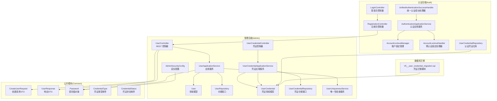
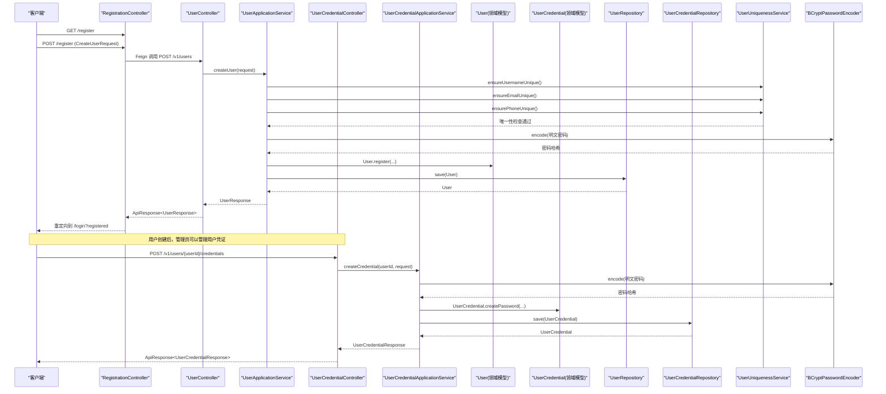
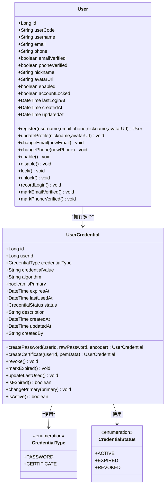
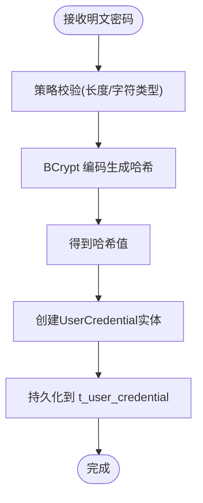
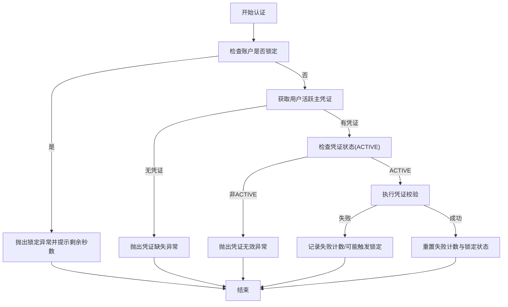
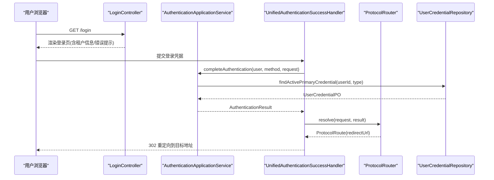
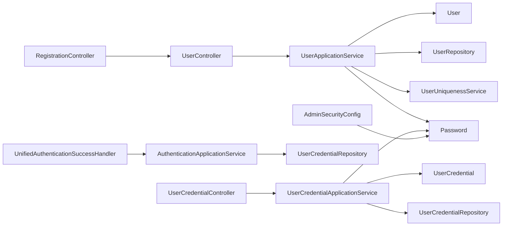

# 用户管理功能

<cite>
**本文引用的文件**
- [UserController.java](file://iam-admin-server/src/main/java/iam/platform/admin/interfaces/rest/UserController.java)
- [UserApplicationService.java](file://iam-admin-server/src/main/java/iam/platform/admin/application/service/UserApplicationService.java)
- [User.java](file://iam-admin-server/src/main/java/iam/platform/admin/domain/model/entity/User.java)
- [UserRepository.java](file://iam-admin-server/src/main/java/iam/platform/admin/domain/repository/UserRepository.java)
- [CreateUserRequest.java](file://iam-common/src/main/java/iam/platform/common/dto/request/CreateUserRequest.java)
- [UserResponse.java](file://iam-common/src/main/java/iam/platform/common/dto/response/UserResponse.java)
- [Password.java](file://iam-common/src/main/java/iam/platform/common/model/valueobject/Password.java)
- [AdminSecurityConfig.java](file://iam-admin-server/src/main/java/iam/platform/admin/infrastructure/config/AdminSecurityConfig.java)
- [LoginController.java](file://iam-auth-server/src/main/java/iam/platform/auth/interfaces/web/LoginController.java)
- [RegistrationController.java](file://iam-auth-server/src/main/java/iam/platform/auth/interfaces/web/RegistrationController.java)
- [AuthenticationApplicationService.java](file://iam-auth-server/src/main/java/iam/platform/auth/application/service/AuthenticationApplicationService.java)
- [UnifiedAuthenticationSuccessHandler.java](file://iam-auth-server/src/main/java/iam/platform/auth/infrastructure/security/UnifiedAuthenticationSuccessHandler.java)
- [AccountLockoutManager.java](file://iam-auth-server/src/main/java/iam/platform/auth/infrastructure/security/AccountLockoutManager.java)
- [AccountLockoutHandler.java](file://iam-auth-server/src/main/java/iam/platform/auth/application/service/pipeline/AccountLockoutHandler.java)
- [UserUniquenessService.java](file://iam-admin-server/src/main/java/iam/platform/admin/domain/service/UserUniquenessService.java)
- [AuditApplicationService.java](file://iam-admin-server/src/main/java/iam/platform/admin/application/service/AuditApplicationService.java)
- [UserCredentialApplicationService.java](file://iam-admin-server/src/main/java/iam/platform/admin/application/service/UserCredentialApplicationService.java)
- [UserCredential.java](file://iam-admin-server/src/main/java/iam/platform/admin/domain/model/entity/UserCredential.java)
- [UserCredentialController.java](file://iam-admin-server/src/main/java/iam/platform/admin/interfaces/rest/UserCredentialController.java)
- [UserCredentialRepository.java](file://iam-admin-server/src/main/java/iam/platform/admin/domain/repository/UserCredentialRepository.java)
- [UserCredentialJpaRepository.java](file://iam-admin-server/src/main/java/iam/platform/admin/infrastructure/persistence/repository/UserCredentialJpaRepository.java)
- [UserCredentialPO.java](file://iam-admin-server/src/main/java/iam/platform/admin/infrastructure/persistence/entity/UserCredentialPO.java)
- [UserCredentialRepositoryImpl.java](file://iam-admin-server/src/main/java/iam/platform/admin/infrastructure/persistence/impl/UserCredentialRepositoryImpl.java)
- [UserCredentialRepository.java](file://iam-auth-server/src/main/java/iam/platform/auth/domain/repository/UserCredentialRepository.java)
- [UserCredentialJpaRepository.java](file://iam-auth-server/src/main/java/iam/platform/auth/infrastructure/persistence/repository/UserCredentialJpaRepository.java)
- [UserCredentialPO.java](file://iam-auth-server/src/main/java/iam/platform/auth/infrastructure/persistence/entity/UserCredentialPO.java)
- [UserCredentialRepositoryImpl.java](file://iam-auth-server/src/main/java/iam/platform/auth/infrastructure/persistence/impl/UserCredentialRepositoryImpl.java)
- [CredentialType.java](file://iam-common/src/main/java/iam/platform/common/model/enums/CredentialType.java)
- [CredentialStatus.java](file://iam-common/src/main/java/iam/platform/common/model/enums/CredentialStatus.java)
- [CreateUserCredentialRequest.java](file://iam-common/src/main/java/iam/platform/common/dto/request/CreateUserCredentialRequest.java)
- [UpdateUserCredentialRequest.java](file://iam-common/src/main/java/iam/platform/common/dto/request/UpdateUserCredentialRequest.java)
- [UserCredentialResponse.java](file://iam-common/src/main/java/iam/platform/common/dto/response/UserCredentialResponse.java)
- [V5__user_credential_migration.sql](file://iam-admin-server/src/main/resources/db/migration/V5__user_credential_migration.sql)
</cite>

## 更新摘要
**所做更改**
- 新增独立的用户凭证管理系统，包含t_user_credential表和完整的凭证生命周期管理
- 支持PASSWORD和CERTIFICATE两种凭证类型，实现凭证与用户实体的完全解耦
- 新增凭证CRUD API接口，包括创建、查询、更新、设置主凭证、吊销和删除功能
- 更新用户实体模型，移除内置密码字段，改为通过凭证实体管理
- 新增凭证状态管理（ACTIVE、EXPIRED、REVOKED）和过期时间控制
- 更新认证流程，从凭证仓库获取活跃主凭证进行验证

## 目录
1. [简介](#简介)
2. [项目结构](#项目结构)
3. [核心组件](#核心组件)
4. [架构总览](#架构总览)
5. [详细组件分析](#详细组件分析)
6. [依赖分析](#依赖分析)
7. [性能考虑](#性能考虑)
8. [故障排查指南](#故障排查指南)
9. [结论](#结论)
10. [附录](#附录)

## 简介
本文件面向用户管理功能，系统性阐述注册与登录流程、用户CRUD API、密码管理机制（BCrypt加密与策略校验）、账户状态管理、实体模型设计与业务规则、验证与认证机制、会话与安全防护、RESTful接口规范、最佳实践（数据验证、权限控制、审计日志）以及数据迁移、批量操作与集成测试指导。特别关注用户凭证系统的重构，包括独立的t_user_credential表、凭证类型管理、生命周期控制和认证流程的更新。

**更新** 本版本反映了用户凭证系统的重大重构，从单一用户实体密码管理转变为独立的凭证管理体系，支持多种凭证类型和完整的生命周期管理。

## 项目结构
用户管理涉及四大模块：
- 管理后端（iam-admin-server）：提供用户CRUD API、用户凭证管理API、领域模型与仓储、审计日志与安全配置。
- 认证后端（iam-auth-server）：提供登录/注册页面、统一认证成功处理器、多租户上下文与会话管理、账户锁定等安全策略、凭证仓库访问。
- 公共模块（iam-common）：定义DTO、值对象（如Password）、枚举（如UserStatus、CredentialType、CredentialStatus）与通用异常。
- 数据库迁移：包含t_user_credential表结构定义和数据迁移脚本。

**图表来源**
- [UserController.java:1-68](file://iam-admin-server/src/main/java/iam/platform/admin/interfaces/rest/UserController.java#L1-L68)
- [UserApplicationService.java:1-122](file://iam-admin-server/src/main/java/iam/platform/admin/application/service/UserApplicationService.java#L1-L122)
- [User.java:1-158](file://iam-admin-server/src/main/java/iam/platform/admin/domain/model/entity/User.java#L1-L158)
- [UserRepository.java:1-34](file://iam-admin-server/src/main/java/iam/platform/admin/domain/repository/UserRepository.java#L1-L34)
- [UserUniquenessService.java:1-34](file://iam-admin-server/src/main/java/iam/platform/admin/domain/service/UserUniquenessService.java#L1-L34)
- [AdminSecurityConfig.java:1-41](file://iam-admin-server/src/main/java/iam/platform/admin/infrastructure/config/AdminSecurityConfig.java#L1-L41)
- [UserCredentialController.java:1-109](file://iam-admin-server/src/main/java/iam/platform/admin/interfaces/rest/UserCredentialController.java#L1-L109)
- [UserCredentialApplicationService.java:1-223](file://iam-admin-server/src/main/java/iam/platform/admin/application/service/UserCredentialApplicationService.java#L1-L223)
- [UserCredential.java:1-124](file://iam-admin-server/src/main/java/iam/platform/admin/domain/model/entity/UserCredential.java#L1-L124)
- [UserCredentialRepository.java:1-30](file://iam-admin-server/src/main/java/iam/platform/admin/domain/repository/UserCredentialRepository.java#L1-L30)
- [UserCredentialJpaRepository.java:1-30](file://iam-admin-server/src/main/java/iam/platform/admin/infrastructure/persistence/repository/UserCredentialJpaRepository.java#L1-L30)
- [UserCredentialPO.java:1-102](file://iam-admin-server/src/main/java/iam/platform/admin/infrastructure/persistence/entity/UserCredentialPO.java#L1-L102)
- [UserCredentialRepositoryImpl.java:1-28](file://iam-admin-server/src/main/java/iam/platform/admin/infrastructure/persistence/impl/UserCredentialRepositoryImpl.java#L1-L28)
- [UserCredentialRepository.java:1-13](file://iam-auth-server/src/main/java/iam/platform/auth/domain/repository/UserCredentialRepository.java#L1-L13)
- [UserCredentialJpaRepository.java:1-29](file://iam-auth-server/src/main/java/iam/platform/auth/infrastructure/persistence/repository/UserCredentialJpaRepository.java#L1-L29)
- [UserCredentialPO.java:1-60](file://iam-auth-server/src/main/java/iam/platform/auth/infrastructure/persistence/entity/UserCredentialPO.java#L1-L60)
- [UserCredentialRepositoryImpl.java:1-28](file://iam-auth-server/src/main/java/iam/platform/auth/infrastructure/persistence/impl/UserCredentialRepositoryImpl.java#L1-L28)
- [CredentialType.java:1-14](file://iam-common/src/main/java/iam/platform/common/model/enums/CredentialType.java#L1-L14)
- [CredentialStatus.java:1-15](file://iam-common/src/main/java/iam/platform/common/model/enums/CredentialStatus.java#L1-L15)
- [V5__user_credential_migration.sql:1-84](file://iam-admin-server/src/main/resources/db/migration/V5__user_credential_migration.sql#L1-L84)

**章节来源**
- [UserController.java:1-68](file://iam-admin-server/src/main/java/iam/platform/admin/interfaces/rest/UserController.java#L1-L68)
- [UserApplicationService.java:1-122](file://iam-admin-server/src/main/java/iam/platform/admin/application/service/UserApplicationService.java#L1-L122)
- [AdminSecurityConfig.java:1-41](file://iam-admin-server/src/main/java/iam/platform/admin/infrastructure/config/AdminSecurityConfig.java#L1-L41)
- [UserCredentialController.java:1-109](file://iam-admin-server/src/main/java/iam/platform/admin/interfaces/rest/UserCredentialController.java#L1-L109)
- [UserCredentialApplicationService.java:1-223](file://iam-admin-server/src/main/java/iam/platform/admin/application/service/UserCredentialApplicationService.java#L1-L223)
- [UserCredential.java:1-124](file://iam-admin-server/src/main/java/iam/platform/admin/domain/model/entity/UserCredential.java#L1-L124)
- [UserCredentialRepository.java:1-30](file://iam-admin-server/src/main/java/iam/platform/admin/domain/repository/UserCredentialRepository.java#L1-L30)
- [UserCredentialJpaRepository.java:1-30](file://iam-admin-server/src/main/java/iam/platform/admin/infrastructure/persistence/repository/UserCredentialJpaRepository.java#L1-L30)
- [UserCredentialPO.java:1-102](file://iam-admin-server/src/main/java/iam/platform/admin/infrastructure/persistence/entity/UserCredentialPO.java#L1-L102)
- [UserCredentialRepositoryImpl.java:1-28](file://iam-admin-server/src/main/java/iam/platform/admin/infrastructure/persistence/impl/UserCredentialRepositoryImpl.java#L1-L28)
- [UserCredentialRepository.java:1-13](file://iam-auth-server/src/main/java/iam/platform/auth/domain/repository/UserCredentialRepository.java#L1-L13)
- [UserCredentialJpaRepository.java:1-29](file://iam-auth-server/src/main/java/iam/platform/auth/infrastructure/persistence/repository/UserCredentialJpaRepository.java#L1-L29)
- [UserCredentialPO.java:1-60](file://iam-auth-server/src/main/java/iam/platform/auth/infrastructure/persistence/entity/UserCredentialPO.java#L1-L60)
- [UserCredentialRepositoryImpl.java:1-28](file://iam-auth-server/src/main/java/iam/platform/auth/infrastructure/persistence/impl/UserCredentialRepositoryImpl.java#L1-L28)
- [CredentialType.java:1-14](file://iam-common/src/main/java/iam/platform/common/model/enums/CredentialType.java#L1-L14)
- [CredentialStatus.java:1-15](file://iam-common/src/main/java/iam/platform/common/model/enums/CredentialStatus.java#L1-L15)
- [V5__user_credential_migration.sql:1-84](file://iam-admin-server/src/main/resources/db/migration/V5__user_credential_migration.sql#L1-L84)

## 核心组件
- 用户实体模型（User）
  - 字段覆盖身份标识（用户名、邮箱、手机号）、状态（启用/锁定/已验证）、时间戳（最后登录、创建/更新）。
  - 行为方法包括注册工厂方法、资料更新、邮箱/手机变更、启停用、锁定/解锁、登录记录、验证标记。
  - **更新** 移除了内置密码字段，密码管理迁移到UserCredential实体。
- 用户凭证实体模型（UserCredential）
  - 字段包括用户ID、凭证类型（PASSWORD/CERTIFICATE）、凭证值（加密存储）、算法、是否主凭证、过期时间、最后使用时间、状态、描述、时间戳。
  - 行为方法包括凭证创建工厂方法、吊销、标记过期、更新最后使用时间、检查过期状态、设置主凭证、检查激活状态。
- 凭证类型枚举（CredentialType）
  - 定义PASSWORD和CERTIFICATE两种凭证类型及其描述。
- 凭证状态枚举（CredentialStatus）
  - 定义ACTIVE、EXPIRED、REVOKED三种状态及其描述。
- 凭证应用服务（UserCredentialApplicationService）
  - 负责凭证的创建、查询、更新、设置主凭证、吊销、删除、密码修改等业务逻辑。
  - 支持密码凭证的BCrypt编码和证书凭证的PEM数据存储。
- 凭证仓库接口（UserCredentialRepository）
  - 提供凭证的CRUD操作、按用户和类型查询、按状态查询、分页查询、过期凭证查询等功能。
- 安全配置（AdminSecurityConfig）
  - 配置BCrypt编码器、无状态会话、JWT上下文过滤器、放通健康检查与文档路径。
- 登录/注册控制器
  - 登录页控制器支持多租户识别与错误提示；注册页控制器通过Feign调用管理后端创建用户。
- 认证应用服务与统一处理器
  - 完成认证后处理（多租户选择、权限装载、会话设置、上下文注入），统一处理首方与OAuth2认证成功。
- 凭证仓库实现
  - 认证后端和管理后端分别提供凭证仓库的实现，支持活跃主凭证查询、过期凭证查询、最后使用时间更新等。

**章节来源**
- [User.java:1-158](file://iam-admin-server/src/main/java/iam/platform/admin/domain/model/entity/User.java#L1-L158)
- [UserCredential.java:1-124](file://iam-admin-server/src/main/java/iam/platform/admin/domain/model/entity/UserCredential.java#L1-L124)
- [CredentialType.java:1-14](file://iam-common/src/main/java/iam/platform/common/model/enums/CredentialType.java#L1-L14)
- [CredentialStatus.java:1-15](file://iam-common/src/main/java/iam/platform/common/model/enums/CredentialStatus.java#L1-L15)
- [UserCredentialApplicationService.java:1-223](file://iam-admin-server/src/main/java/iam/platform/admin/application/service/UserCredentialApplicationService.java#L1-L223)
- [UserCredentialRepository.java:1-30](file://iam-admin-server/src/main/java/iam/platform/admin/domain/repository/UserCredentialRepository.java#L1-L30)
- [AdminSecurityConfig.java:1-41](file://iam-admin-server/src/main/java/iam/platform/admin/infrastructure/config/AdminSecurityConfig.java#L1-L41)
- [LoginController.java:1-58](file://iam-auth-server/src/main/java/iam/platform/auth/interfaces/web/LoginController.java#L1-L58)
- [RegistrationController.java:1-46](file://iam-auth-server/src/main/java/iam/platform/auth/interfaces/web/RegistrationController.java#L1-L46)
- [AuthenticationApplicationService.java:1-146](file://iam-auth-server/src/main/java/iam/platform/auth/application/service/AuthenticationApplicationService.java#L1-L146)
- [UnifiedAuthenticationSuccessHandler.java:1-68](file://iam-auth-server/src/main/java/iam/platform/auth/infrastructure/security/UnifiedAuthenticationSuccessHandler.java#L1-L68)
- [UserCredentialRepository.java:1-13](file://iam-auth-server/src/main/java/iam/platform/auth/domain/repository/UserCredentialRepository.java#L1-L13)

## 架构总览
用户管理采用分层与DDD思想，新增凭证管理子系统：
- 接口层：REST控制器（管理后端）与Web控制器（认证后端）。
- 应用层：应用服务编排业务流程、调用仓储与领域模型。
- 领域层：实体与值对象封装不变量与行为，包括用户实体和凭证实体。
- 基础设施：安全配置、密码编码器、会话与上下文、凭证仓库实现、管道式认证处理。

**图表来源**
- [RegistrationController.java:1-46](file://iam-auth-server/src/main/java/iam/platform/auth/interfaces/web/RegistrationController.java#L1-L46)
- [UserController.java:1-68](file://iam-admin-server/src/main/java/iam/platform/admin/interfaces/rest/UserController.java#L1-L68)
- [UserApplicationService.java:1-122](file://iam-admin-server/src/main/java/iam/platform/admin/application/service/UserApplicationService.java#L1-L122)
- [UserCredentialController.java:1-109](file://iam-admin-server/src/main/java/iam/platform/admin/interfaces/rest/UserCredentialController.java#L1-L109)
- [UserCredentialApplicationService.java:1-223](file://iam-admin-server/src/main/java/iam/platform/admin/application/service/UserCredentialApplicationService.java#L1-L223)
- [User.java:1-158](file://iam-admin-server/src/main/java/iam/platform/admin/domain/model/entity/User.java#L1-L158)
- [UserCredential.java:1-124](file://iam-admin-server/src/main/java/iam/platform/admin/domain/model/entity/UserCredential.java#L1-L124)
- [UserRepository.java:1-34](file://iam-admin-server/src/main/java/iam/platform/admin/domain/repository/UserRepository.java#L1-L34)
- [UserCredentialRepository.java:1-30](file://iam-admin-server/src/main/java/iam/platform/admin/domain/repository/UserCredentialRepository.java#L1-L30)
- [UserUniquenessService.java:1-34](file://iam-admin-server/src/main/java/iam/platform/admin/domain/service/UserUniquenessService.java#L1-L34)
- [AdminSecurityConfig.java:1-41](file://iam-admin-server/src/main/java/iam/platform/admin/infrastructure/config/AdminSecurityConfig.java#L1-L41)

## 详细组件分析

### 用户凭证实体模型与业务规则
- 设计理念
  - 凭证实体完全独立于用户实体，支持多种凭证类型和生命周期管理。
  - 使用枚举定义凭证类型和状态，确保数据一致性。
  - 支持主凭证概念，每个用户每种类型只能有一个主凭证。
- 字段与规则
  - 用户关联：userId外键关联用户实体，支持级联删除。
  - 凭证类型：PASSWORD使用BCrypt哈希存储，CERTIFICATE存储PEM格式证书。
  - 状态管理：ACTIVE、EXPIRED、REVOKED三种状态，支持过期时间控制。
  - 主凭证控制：isPrimary字段标识主凭证，唯一约束确保每种类型只有一个主凭证。
  - 时间戳：createdAt、updatedAt、lastUsedAt自动维护。
- 关键行为
  - 工厂方法：createPassword创建密码凭证并自动编码，createCertificate创建证书凭证。
  - 状态转换：revoke吊销凭证，markExpired标记过期，changePrimary设置主凭证。
  - 生命周期：isExpired检查过期状态，isActive检查激活状态。
  - 安全操作：updateLastUsed更新最后使用时间。

**图表来源**
- [User.java:1-158](file://iam-admin-server/src/main/java/iam/platform/admin/domain/model/entity/User.java#L1-L158)
- [UserCredential.java:1-124](file://iam-admin-server/src/main/java/iam/platform/admin/domain/model/entity/UserCredential.java#L1-L124)
- [CredentialType.java:1-14](file://iam-common/src/main/java/iam/platform/common/model/enums/CredentialType.java#L1-L14)
- [CredentialStatus.java:1-15](file://iam-common/src/main/java/iam/platform/common/model/enums/CredentialStatus.java#L1-L15)

**章节来源**
- [UserCredential.java:1-124](file://iam-admin-server/src/main/java/iam/platform/admin/domain/model/entity/UserCredential.java#L1-L124)
- [CredentialType.java:1-14](file://iam-common/src/main/java/iam/platform/common/model/enums/CredentialType.java#L1-L14)
- [CredentialStatus.java:1-15](file://iam-common/src/main/java/iam/platform/common/model/enums/CredentialStatus.java#L1-L15)

### 用户凭证CRUD API接口
- 创建凭证
  - 方法与路径：POST /v1/users/{userId}/credentials
  - 请求体：CreateUserCredentialRequest（credentialType、credentialValue、algorithm、isPrimary、expiresAt、description）
  - 成功响应：201 Created，返回UserCredentialResponse
  - 错误：400 参数无效；404 用户不存在
- 查询凭证
  - 获取详情：GET /v1/users/{userId}/credentials/{credentialId}
  - 列表分页：GET /v1/users/{userId}/credentials?page=0&size=20
  - 成功响应：200 OK，返回UserCredentialResponse或分页包装
- 更新凭证
  - 方法与路径：PUT /v1/users/{userId}/credentials/{credentialId}
  - 请求体：UpdateUserCredentialRequest（credentialValue、expiresAt、description、isPrimary）
  - 成功响应：200 OK，返回UserCredentialResponse
  - 错误：404 凭证不存在；400 参数无效
- 设置主凭证
  - 方法与路径：PUT /v1/users/{userId}/credentials/{credentialId}/primary
  - 功能：将指定凭证设为主凭证，自动取消其他主凭证
  - 成功响应：200 OK
- 吊销凭证
  - 方法与路径：PUT /v1/users/{userId}/credentials/{credentialId}/revoke
  - 功能：吊销指定凭证，不可撤销密码凭证的最后一条
  - 成功响应：200 OK
- 删除凭证
  - 方法与路径：DELETE /v1/users/{userId}/credentials/{credentialId}
  - 功能：删除指定凭证，不可删除密码凭证的最后一条
  - 成功响应：200 OK
- 修改密码（快捷方式）
  - 方法与路径：PUT /v1/users/{userId}/password
  - 请求体：ChangePasswordRequest（oldPassword、newPassword）
  - 功能：修改用户的主密码凭证
  - 成功响应：200 OK

**章节来源**
- [UserCredentialController.java:1-109](file://iam-admin-server/src/main/java/iam/platform/admin/interfaces/rest/UserCredentialController.java#L1-L109)
- [CreateUserCredentialRequest.java:1-31](file://iam-common/src/main/java/iam/platform/common/dto/request/CreateUserCredentialRequest.java#L1-L31)
- [UpdateUserCredentialRequest.java:1-23](file://iam-common/src/main/java/iam/platform/common/dto/request/UpdateUserCredentialRequest.java#L1-L23)
- [UserCredentialResponse.java:1-28](file://iam-common/src/main/java/iam/platform/common/dto/response/UserCredentialResponse.java#L1-L28)

### 凭证仓库与数据访问
- 凭证仓库接口
  - 提供save、findById、findByUserId、findByUserIdAndType、findPrimaryByUserIdAndType、findByUserIdAndStatus、findByUserId、findExpiredCredentials、deleteById等方法。
  - 支持分页查询和条件查询。
- 凭证JPA仓库
  - 提供原生查询支持，包括活跃主凭证查询、过期凭证查询、最后使用时间更新。
  - 使用@Query注解实现复杂查询逻辑。
- 凭证实体映射
  - UserCredentialPO映射到t_user_credential表，包含所有凭证字段。
  - 支持枚举类型映射和时间戳自动维护。
- 凭证仓库实现
  - 认证后端和管理后端分别实现仓库接口，提供不同的查询策略。
  - 支持凭证状态检查和过期时间处理。

**章节来源**
- [UserCredentialRepository.java:1-30](file://iam-admin-server/src/main/java/iam/platform/admin/domain/repository/UserCredentialRepository.java#L1-L30)
- [UserCredentialJpaRepository.java:1-30](file://iam-admin-server/src/main/java/iam/platform/admin/infrastructure/persistence/repository/UserCredentialJpaRepository.java#L1-L30)
- [UserCredentialPO.java:1-102](file://iam-admin-server/src/main/java/iam/platform/admin/infrastructure/persistence/entity/UserCredentialPO.java#L1-L102)
- [UserCredentialRepositoryImpl.java:1-28](file://iam-admin-server/src/main/java/iam/platform/admin/infrastructure/persistence/impl/UserCredentialRepositoryImpl.java#L1-L28)
- [UserCredentialRepository.java:1-13](file://iam-auth-server/src/main/java/iam/platform/auth/domain/repository/UserCredentialRepository.java#L1-L13)
- [UserCredentialJpaRepository.java:1-29](file://iam-auth-server/src/main/java/iam/platform/auth/infrastructure/persistence/repository/UserCredentialJpaRepository.java#L1-L29)
- [UserCredentialPO.java:1-60](file://iam-auth-server/src/main/java/iam/platform/auth/infrastructure/persistence/entity/UserCredentialPO.java#L1-L60)
- [UserCredentialRepositoryImpl.java:1-28](file://iam-auth-server/src/main/java/iam/platform/auth/infrastructure/persistence/impl/UserCredentialRepositoryImpl.java#L1-L28)

### 凭证生命周期管理
- 凭证状态流转
  - ACTIVE → EXPIRED：过期时间到达自动标记
  - ACTIVE → REVOKED：管理员手动吊销
  - REVOKED：不可恢复的状态
- 过期控制机制
  - expiresAt字段控制凭证有效期
  - 自动过期查询：findExpiredCredentials查询已过期的凭证
  - 活跃凭证检查：查询时自动过滤过期状态
- 主凭证管理
  - 每种凭证类型只能有一个主凭证
  - 设置新主凭证时自动取消其他主凭证
  - 删除凭证时确保至少保留一个密码凭证
- 安全策略
  - 最后密码凭证保护：防止删除用户唯一的密码凭证
  - 凭证使用追踪：记录lastUsedAt时间戳
  - 算法兼容性：支持多种加密算法（BCRYPT、X509等）

**章节来源**
- [UserCredentialApplicationService.java:196-210](file://iam-admin-server/src/main/java/iam/platform/admin/application/service/UserCredentialApplicationService.java#L196-L210)
- [UserCredentialJpaRepository.java:23-28](file://iam-auth-server/src/main/java/iam/platform/auth/infrastructure/persistence/repository/UserCredentialJpaRepository.java#L23-L28)
- [UserCredentialJpaRepository.java:28-29](file://iam-admin-server/src/main/java/iam/platform/admin/infrastructure/persistence/repository/UserCredentialJpaRepository.java#L28-L29)

### 数据迁移与向后兼容
- 迁移脚本分析
  - 创建t_user_credential表，包含所有凭证相关字段
  - 创建必要的索引和约束，确保数据完整性
  - 数据迁移：将现有用户密码哈希迁移到新表
  - 向后兼容：保留t_user.password_hash字段，支持渐进式迁移
- 迁移策略
  - 渐进式：新功能使用新表，旧功能继续使用旧字段
  - 数据同步：迁移过程中保持数据一致性
  - 回滚机制：支持迁移失败时的数据恢复
- 兼容性保证
  - 业务逻辑适配：应用服务同时支持新旧两种存储方式
  - API兼容：对外API保持不变，内部实现透明切换

**章节来源**
- [V5__user_credential_migration.sql:1-84](file://iam-admin-server/src/main/resources/db/migration/V5__user_credential_migration.sql#L1-L84)

### 认证流程中的凭证管理
- 凭证验证流程
  - 预认证阶段：从UserCredentialRepository获取用户活跃主凭证
  - 凭证检查：验证凭证状态（ACTIVE且未过期）
  - 凭证匹配：使用相应算法验证凭证值
  - 使用记录：更新凭证lastUsedAt时间戳
- 多凭证支持
  - 用户可拥有多种类型的凭证（密码、证书）
  - 每种类型可有多个凭证实例
  - 主凭证决定默认认证方式
- 安全增强
  - 凭证过期自动失效
  - 凭证吊销即时生效
  - 凭证使用追踪便于审计
  - 支持多种认证算法

**章节来源**
- [UserCredentialRepository.java:18-22](file://iam-auth-server/src/main/java/iam/platform/auth/domain/repository/UserCredentialRepository.java#L18-L22)
- [UserCredentialRepositoryImpl.java:18-27](file://iam-auth-server/src/main/java/iam/platform/auth/infrastructure/persistence/impl/UserCredentialRepositoryImpl.java#L18-L27)
- [UserCredentialJpaRepository.java:16-19](file://iam-auth-server/src/main/java/iam/platform/auth/infrastructure/persistence/repository/UserCredentialJpaRepository.java#L16-L19)

### 密码管理机制（BCrypt与策略）
- 编码器
  - 管理后端使用BCryptPasswordEncoder进行密码哈希与匹配。
- 值对象策略
  - Password值对象在构造时执行最小长度、大小写字母、数字等策略校验，并通过传入的编码函数生成哈希。
- 匹配机制
  - 登录侧通过匹配函数验证明文与存储哈希，避免在公共模块直接依赖具体编码器。
- **更新** 密码管理现在通过UserCredential实体实现，支持主密码凭证的概念。

**图表来源**
- [AdminSecurityConfig.java:1-41](file://iam-admin-server/src/main/java/iam/platform/admin/infrastructure/config/AdminSecurityConfig.java#L1-L41)
- [Password.java:1-90](file://iam-common/src/main/java/iam/platform/common/model/valueobject/Password.java#L1-L90)
- [UserCredentialApplicationService.java:38-53](file://iam-admin-server/src/main/java/iam/platform/admin/application/service/UserCredentialApplicationService.java#L38-L53)

**章节来源**
- [AdminSecurityConfig.java:1-41](file://iam-admin-server/src/main/java/iam/platform/admin/infrastructure/config/AdminSecurityConfig.java#L1-L41)
- [Password.java:1-90](file://iam-common/src/main/java/iam/platform/common/model/valueobject/Password.java#L1-L90)
- [UserCredentialApplicationService.java:38-53](file://iam-admin-server/src/main/java/iam/platform/admin/application/service/UserCredentialApplicationService.java#L38-L53)

### 唯一性检查与增强验证
- 唯一性服务
  - UserUniquenessService提供用户名、邮箱、手机号的唯一性验证。
  - 支持更新场景排除特定用户ID，避免自更新时的误报。
  - 在创建和更新流程中自动执行，确保数据完整性。
- 增强验证
  - 应用服务在保存用户前执行唯一性检查。
  - DTO层面的基础验证（长度、格式）与领域层面的业务验证相结合。
  - 审计日志自动记录所有用户操作事件。
- **更新** 凭证唯一性：每种凭证类型在同一用户下只能有一个主凭证。

**章节来源**
- [UserUniquenessService.java:1-34](file://iam-admin-server/src/main/java/iam/platform/admin/domain/service/UserUniquenessService.java#L1-L34)
- [UserApplicationService.java:1-122](file://iam-admin-server/src/main/java/iam/platform/admin/application/service/UserApplicationService.java#L1-L122)
- [UserCredentialRepository.java:43-45](file://iam-admin-server/src/main/java/iam/platform/admin/infrastructure/persistence/repository/UserCredentialJpaRepository.java#L43-L45)

### 账户状态管理
- 状态枚举：ACTIVE、INACTIVE、LOCKED（用于通用场景）
- 实体状态：
  - enabled：启用/禁用账户
  - accountLocked：锁定/解锁账户
  - emailVerified/phoneVerified：验证标记
- 凭证状态：
  - ACTIVE：可用凭证
  - EXPIRED：已过期凭证
  - REVOKED：已吊销凭证
- 登录流程中的锁定策略：
  - 预认证阶段检查账户锁定状态，超过阈值则临时锁定并提示剩余秒数。
  - 成功登录后重置失败计数与锁定状态。
  - **更新** 凭证状态影响认证：过期或吊销的凭证无法用于认证。

**图表来源**
- [AccountLockoutManager.java:1-134](file://iam-auth-server/src/main/java/iam/platform/auth/infrastructure/security/AccountLockoutManager.java#L1-L134)
- [AccountLockoutHandler.java:1-41](file://iam-auth-server/src/main/java/iam/platform/auth/application/service/pipeline/AccountLockoutHandler.java#L1-L41)
- [UserCredentialRepository.java:18-22](file://iam-auth-server/src/main/java/iam/platform/auth/domain/repository/UserCredentialRepository.java#L18-L22)

**章节来源**
- [AccountLockoutManager.java:1-134](file://iam-auth-server/src/main/java/iam/platform/auth/infrastructure/security/AccountLockoutManager.java#L1-L134)
- [AccountLockoutHandler.java:1-41](file://iam-auth-server/src/main/java/iam/platform/auth/application/service/pipeline/AccountLockoutHandler.java#L1-L41)
- [UserCredentialRepository.java:18-22](file://iam-auth-server/src/main/java/iam/platform/auth/domain/repository/UserCredentialRepository.java#L18-L22)

### 注册与登录流程
- 注册流程
  - 前端访问注册页，提交CreateUserRequest。
  - 认证后端通过Feign调用管理后端创建用户，若唯一性冲突返回错误。
  - 成功后重定向到登录页并提示注册成功。
  - **更新** 注册后可立即创建初始凭证（如密码凭证）。
- 登录流程
  - 支持多租户识别（子域名/查询参数/头部），登录页根据租户信息渲染。
  - 统一认证成功处理器汇聚首方与OAuth2认证结果，运行后置管道，选择租户账号并建立带权限的认证上下文，写入会话，重定向至协议路由目标。
  - **更新** 认证时从凭证仓库获取活跃主凭证，支持多凭证类型认证。

**图表来源**
- [LoginController.java:1-58](file://iam-auth-server/src/main/java/iam/platform/auth/interfaces/web/LoginController.java#L1-L58)
- [AuthenticationApplicationService.java:1-146](file://iam-auth-server/src/main/java/iam/platform/auth/application/service/AuthenticationApplicationService.java#L1-L146)
- [UnifiedAuthenticationSuccessHandler.java:1-68](file://iam-auth-server/src/main/java/iam/platform/auth/infrastructure/security/UnifiedAuthenticationSuccessHandler.java#L1-L68)
- [UserCredentialRepository.java:18-22](file://iam-auth-server/src/main/java/iam/platform/auth/domain/repository/UserCredentialRepository.java#L18-L22)

**章节来源**
- [LoginController.java:1-58](file://iam-auth-server/src/main/java/iam/platform/auth/interfaces/web/LoginController.java#L1-L58)
- [RegistrationController.java:1-46](file://iam-auth-server/src/main/java/iam/platform/auth/interfaces/web/RegistrationController.java#L1-L46)
- [AuthenticationApplicationService.java:1-146](file://iam-auth-server/src/main/java/iam/platform/auth/application/service/AuthenticationApplicationService.java#L1-L146)
- [UnifiedAuthenticationSuccessHandler.java:1-68](file://iam-auth-server/src/main/java/iam/platform/auth/infrastructure/security/UnifiedAuthenticationSuccessHandler.java#L1-L68)
- [UserCredentialRepository.java:18-22](file://iam-auth-server/src/main/java/iam/platform/auth/domain/repository/UserCredentialRepository.java#L18-L22)

### 会话管理与安全防护
- 会话策略
  - 管理后端采用无状态会话（STATELESS），通过JWT上下文过滤器传递身份。
  - 认证后端在成功认证后将租户ID与账号ID写入HTTP会话，便于后续请求识别。
- 安全防护
  - BCrypt密码编码器保障凭证安全。
  - 账户锁定基于Redis失败次数阈值，超限临时锁定并提示剩余秒数。
  - 预认证管道在认证前执行账户状态与速率限制等检查。
  - **更新** 凭证状态检查：过期或吊销的凭证无法通过认证。
  - 凭证使用追踪：记录凭证最后使用时间，便于安全审计。

**章节来源**
- [AdminSecurityConfig.java:1-41](file://iam-admin-server/src/main/java/iam/platform/admin/infrastructure/config/AdminSecurityConfig.java#L1-L41)
- [AuthenticationApplicationService.java:1-146](file://iam-auth-server/src/main/java/iam/platform/auth/application/service/AuthenticationApplicationService.java#L1-L146)
- [AccountLockoutManager.java:1-134](file://iam-auth-server/src/main/java/iam/platform/auth/infrastructure/security/AccountLockoutManager.java#L1-L134)
- [UserCredentialRepository.java:23-28](file://iam-auth-server/src/main/java/iam/platform/auth/infrastructure/persistence/repository/UserCredentialJpaRepository.java#L23-L28)

### 数据验证、权限控制与审计日志
- 数据验证
  - 请求DTO对凭证类型、凭证值、算法、过期时间等进行约束。
  - 应用服务在创建/更新时再次执行唯一性校验和业务规则验证。
- 权限控制
  - 认证成功后按租户账号加载权限集合，构建带权限的身份令牌。
  - **更新** 凭证权限：不同凭证类型可能有不同的权限要求。
- 审计日志
  - 应用服务方法使用审计注解，记录凭证创建/更新/删除/吊销事件与资源标识。
  - 审计导出功能支持CSV格式，包含详细的凭证操作追踪信息。
  - **更新** 凭证审计：记录凭证状态变更、主凭证切换、使用情况等。

**章节来源**
- [CreateUserCredentialRequest.java:1-31](file://iam-common/src/main/java/iam/platform/common/dto/request/CreateUserCredentialRequest.java#L1-L31)
- [UserCredentialApplicationService.java:31-34](file://iam-admin-server/src/main/java/iam/platform/admin/application/service/UserCredentialApplicationService.java#L31-L34)
- [AuthenticationApplicationService.java:1-146](file://iam-auth-server/src/main/java/iam/platform/auth/application/service/AuthenticationApplicationService.java#L1-L146)
- [AuditApplicationService.java:160-216](file://iam-admin-server/src/main/java/iam/platform/admin/application/service/AuditApplicationService.java#L160-L216)

## 依赖分析
- 模块间依赖
  - 认证后端通过Feign客户端调用管理后端的用户创建接口。
  - 管理后端使用BCryptPasswordEncoder与Password值对象处理密码。
  - 认证后端在统一处理器中调用认证应用服务完成租户选择与权限装载。
  - **更新** 认证后端通过UserCredentialRepository访问凭证数据。
- 组件耦合
  - 控制器与应用服务松耦合，应用服务通过仓储与领域模型实现业务逻辑。
  - 安全配置与应用服务解耦，通过Spring Security过滤链生效。
  - 唯一性检查服务独立于实体，通过仓储接口实现业务规则。
  - **更新** 凭证仓库接口提供统一的凭证访问抽象。

**图表来源**
- [RegistrationController.java:1-46](file://iam-auth-server/src/main/java/iam/platform/auth/interfaces/web/RegistrationController.java#L1-L46)
- [UserController.java:1-68](file://iam-admin-server/src/main/java/iam/platform/admin/interfaces/rest/UserController.java#L1-L68)
- [UserApplicationService.java:1-122](file://iam-admin-server/src/main/java/iam/platform/admin/application/service/UserApplicationService.java#L1-L122)
- [User.java:1-158](file://iam-admin-server/src/main/java/iam/platform/admin/domain/model/entity/User.java#L1-L158)
- [UserRepository.java:1-34](file://iam-admin-server/src/main/java/iam/platform/admin/domain/repository/UserRepository.java#L1-L34)
- [UserUniquenessService.java:1-34](file://iam-admin-server/src/main/java/iam/platform/admin/domain/service/UserUniquenessService.java#L1-L34)
- [Password.java:1-90](file://iam-common/src/main/java/iam/platform/common/model/valueobject/Password.java#L1-L90)
- [AdminSecurityConfig.java:1-41](file://iam-admin-server/src/main/java/iam/platform/admin/infrastructure/config/AdminSecurityConfig.java#L1-L41)
- [UserCredentialController.java:1-109](file://iam-admin-server/src/main/java/iam/platform/admin/interfaces/rest/UserCredentialController.java#L1-L109)
- [UserCredentialApplicationService.java:1-223](file://iam-admin-server/src/main/java/iam/platform/admin/application/service/UserCredentialApplicationService.java#L1-L223)
- [UserCredential.java:1-124](file://iam-admin-server/src/main/java/iam/platform/admin/domain/model/entity/UserCredential.java#L1-L124)
- [UserCredentialRepository.java:1-30](file://iam-admin-server/src/main/java/iam/platform/admin/domain/repository/UserCredentialRepository.java#L1-L30)
- [UserCredentialRepository.java:1-13](file://iam-auth-server/src/main/java/iam/platform/auth/domain/repository/UserCredentialRepository.java#L1-L13)
- [UnifiedAuthenticationSuccessHandler.java:1-68](file://iam-auth-server/src/main/java/iam/platform/auth/infrastructure/security/UnifiedAuthenticationSuccessHandler.java#L1-L68)
- [AuthenticationApplicationService.java:1-146](file://iam-auth-server/src/main/java/iam/platform/auth/application/service/AuthenticationApplicationService.java#L1-L146)

**章节来源**
- [RegistrationController.java:1-46](file://iam-auth-server/src/main/java/iam/platform/auth/interfaces/web/RegistrationController.java#L1-L46)
- [UserController.java:1-68](file://iam-admin-server/src/main/java/iam/platform/admin/interfaces/rest/UserController.java#L1-L68)
- [UserApplicationService.java:1-122](file://iam-admin-server/src/main/java/iam/platform/admin/application/service/UserApplicationService.java#L1-L122)
- [AdminSecurityConfig.java:1-41](file://iam-admin-server/src/main/java/iam/platform/admin/infrastructure/config/AdminSecurityConfig.java#L1-L41)
- [UnifiedAuthenticationSuccessHandler.java:1-68](file://iam-auth-server/src/main/java/iam/platform/auth/infrastructure/security/UnifiedAuthenticationSuccessHandler.java#L1-L68)
- [AuthenticationApplicationService.java:1-146](file://iam-auth-server/src/main/java/iam/platform/auth/application/service/AuthenticationApplicationService.java#L1-L146)
- [UserCredentialController.java:1-109](file://iam-admin-server/src/main/java/iam/platform/admin/interfaces/rest/UserCredentialController.java#L1-L109)
- [UserCredentialApplicationService.java:1-223](file://iam-admin-server/src/main/java/iam/platform/admin/application/service/UserCredentialApplicationService.java#L1-L223)
- [UserCredentialRepository.java:1-30](file://iam-admin-server/src/main/java/iam/platform/admin/domain/repository/UserCredentialRepository.java#L1-L30)
- [UserCredentialRepository.java:1-13](file://iam-auth-server/src/main/java/iam/platform/auth/domain/repository/UserCredentialRepository.java#L1-L13)

## 性能考虑
- 密码哈希成本
  - BCrypt默认迭代次数较高，建议在生产环境监控认证延迟并结合硬件资源评估。
- Redis依赖
  - 账户锁定依赖Redis，需确保高可用与低延迟；异常时采用"失败放行"策略以保证可用性。
- 分页查询
  - 列表接口使用分页参数，建议配合索引优化与合理页大小控制。
- 会话无状态
  - 管理后端无状态设计降低会话存储压力，但需确保网关与下游服务正确传递认证上下文。
- 唯一性检查
  - 唯一性服务通过仓储接口执行数据库查询，建议在高频场景下考虑缓存策略。
- **更新** 凭证查询优化
  - 凭证仓库使用专用索引优化查询性能
  - 过期凭证批量处理减少实时查询开销
  - 主凭证查询使用专门的SQL优化

## 故障排查指南
- 注册失败（409）
  - 检查用户名/邮箱/手机号唯一性冲突；确认前端校验与后端唯一性服务一致。
- 登录被锁定
  - 查看账户锁定Redis键是否存在与过期时间；确认失败计数是否递增。
- 会话未生效
  - 管理后端为无状态，确认JWT上下文过滤器是否正确注入；认证后端检查会话属性是否写入。
- 密码不匹配
  - 确认使用BCrypt编码器与匹配函数；避免在不同模块混用不同编码器。
- 审计日志异常
  - 检查审计注解配置与日志导出功能；确认CSV导出格式与字段映射。
- **更新** 凭证相关问题
  - 凭证创建失败：检查凭证类型和值的有效性，确认算法兼容性
  - 凭证认证失败：确认凭证状态为ACTIVE且未过期，检查主凭证设置
  - 凭证吊销异常：确认不是最后一条密码凭证，避免违反业务规则
  - 凭证查询异常：检查索引是否正常，确认查询条件的准确性

**章节来源**
- [UserApplicationService.java:1-122](file://iam-admin-server/src/main/java/iam/platform/admin/application/service/UserApplicationService.java#L1-L122)
- [AccountLockoutManager.java:1-134](file://iam-auth-server/src/main/java/iam/platform/auth/infrastructure/security/AccountLockoutManager.java#L1-L134)
- [AdminSecurityConfig.java:1-41](file://iam-admin-server/src/main/java/iam/platform/admin/infrastructure/config/AdminSecurityConfig.java#L1-L41)
- [AuditApplicationService.java:160-216](file://iam-admin-server/src/main/java/iam/platform/admin/application/service/AuditApplicationService.java#L160-L216)
- [UserCredentialApplicationService.java:196-210](file://iam-admin-server/src/main/java/iam/platform/admin/application/service/UserCredentialApplicationService.java#L196-L210)

## 结论
该用户管理方案经过重大重构，实现了凭证系统的独立化和多样化。新的t_user_credential表支持PASSWORD和CERTIFICATE两种凭证类型，提供完整的生命周期管理能力。系统以清晰的分层与DDD模型为核心，结合BCrypt密码策略、账户锁定与多租户认证上下文，以及凭证状态管理，提供了可扩展、可审计、可安全的用户生命周期管理能力。通过RESTful API与统一认证处理器，既能满足内部管理需求，也能与外部协议（CAS/OAuth2）协同工作。系统已完成从Person到User的完整迁移，并成功重构了凭证管理子系统，提供了更加灵活和安全的用户认证解决方案。

## 附录
- 数据迁移建议
  - 密码迁移：使用BCrypt编码器批量重编码旧密码，更新存储哈希到t_user_credential表。
  - 唯一性迁移：先清理重复数据，再添加唯一约束并回填索引。
  - API迁移：更新所有客户端调用从/persons到/users的路径映射。
  - **更新** 凭证迁移：确保所有现有用户都有对应的密码凭证记录。
- 批量操作
  - 建议使用分页查询与事务批处理，控制单次事务大小，避免长时间锁表。
  - 利用UserUniquenessService的批量验证功能，提高数据一致性。
  - **更新** 凭证批量操作：支持批量设置主凭证、批量吊销、批量过期处理。
- 集成测试
  - 覆盖注册/登录/更新/删除全流程；模拟账户锁定与租户切换；验证审计日志与会话属性。
  - 测试唯一性检查服务在创建和更新场景下的行为差异。
  - **更新** 凭证测试：覆盖多种凭证类型、状态变更、生命周期管理等场景。
  - 测试凭证仓库的查询性能和并发访问能力。
  - 测试凭证过期自动处理和吊销即时生效的功能。