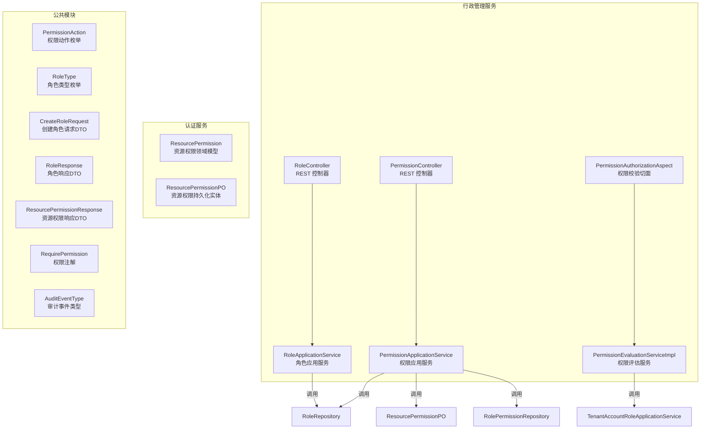
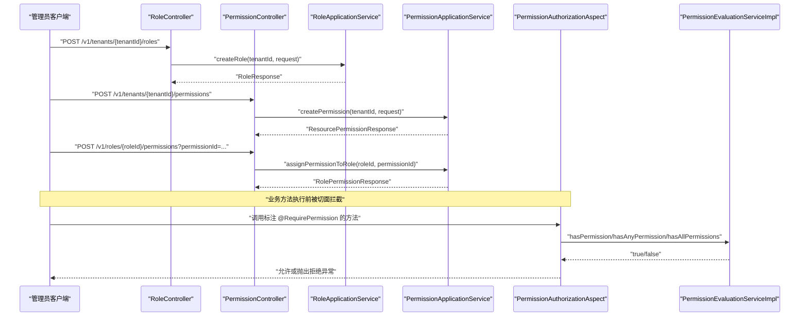
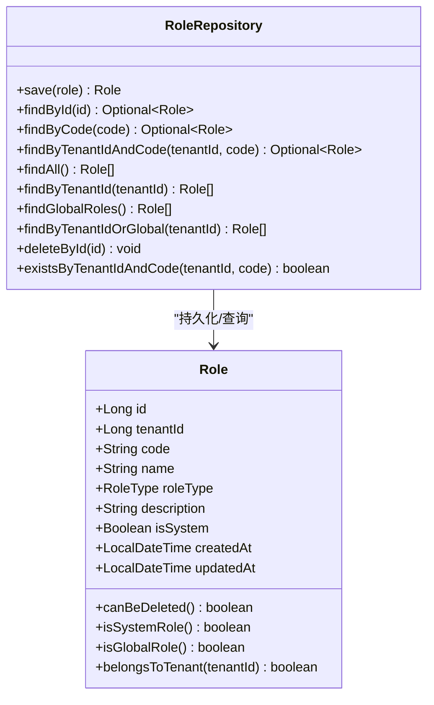
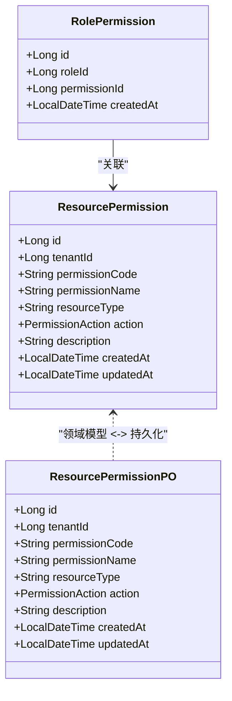
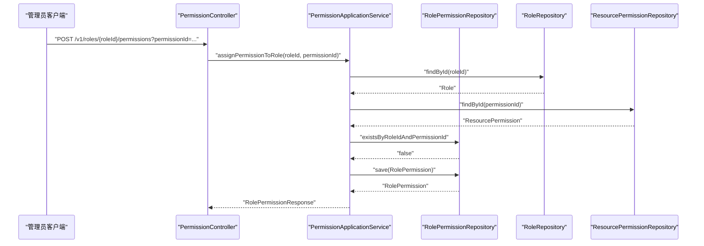
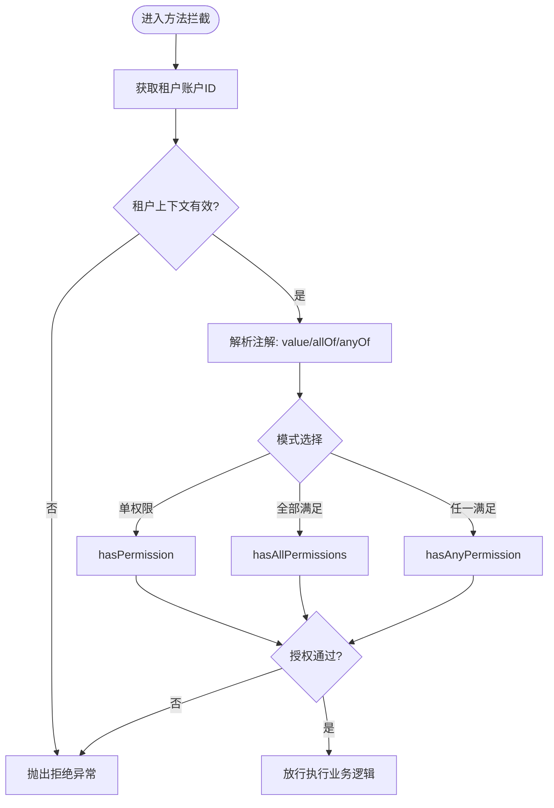
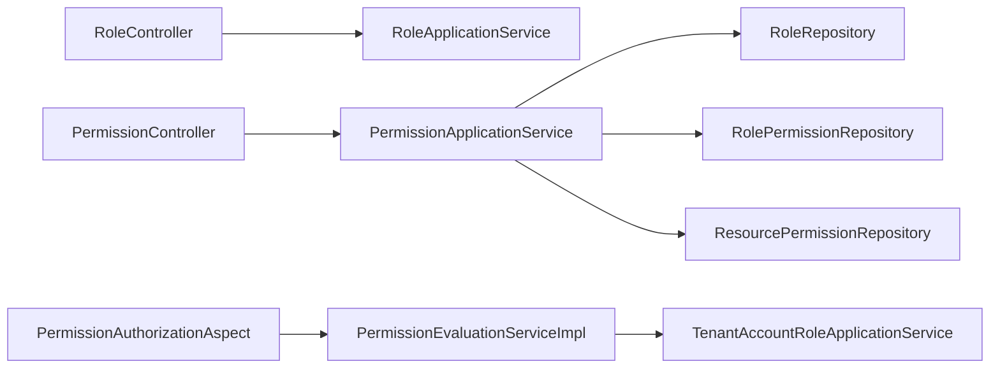

# 角色权限管理

<cite>
**本文引用的文件**
- [Role.java](file://iam-admin-server/src/main/java/iam/platform/admin/domain/model/entity/Role.java)
- [RolePermission.java](file://iam-admin-server/src/main/java/iam/platform/admin/domain/model/entity/RolePermission.java)
- [RoleController.java](file://iam-admin-server/src/main/java/iam/platform/admin/interfaces/rest/RoleController.java)
- [RoleApplicationService.java](file://iam-admin-server/src/main/java/iam/platform/admin/application/service/RoleApplicationService.java)
- [RoleRepository.java](file://iam-admin-server/src/main/java/iam/platform/admin/domain/repository/RoleRepository.java)
- [PermissionController.java](file://iam-admin-server/src/main/java/iam/platform/admin/interfaces/rest/PermissionController.java)
- [PermissionApplicationService.java](file://iam-admin-server/src/main/java/iam/platform/admin/application/service/PermissionApplicationService.java)
- [PermissionEvaluationServiceImpl.java](file://iam-admin-server/src/main/java/iam/platform/admin/domain/service/impl/PermissionEvaluationServiceImpl.java)
- [PermissionAuthorizationAspect.java](file://iam-admin-server/src/main/java/iam/platform/admin/infrastructure/aspect/PermissionAuthorizationAspect.java)
- [ResourcePermission.java](file://iam-auth-server/src/main/java/iam/platform/auth/domain/model/entity/ResourcePermission.java)
- [ResourcePermissionPO.java](file://iam-admin-server/src/main/java/iam/platform/admin/infrastructure/persistence/entity/ResourcePermissionPO.java)
- [PermissionAction.java](file://iam-common/src/main/java/iam/platform/common/model/enums/PermissionAction.java)
- [RoleType.java](file://iam-common/src/main/java/iam/platform/common/model/enums/RoleType.java)
- [CreateRoleRequest.java](file://iam-common/src/main/java/iam/platform/common/dto/request/CreateRoleRequest.java)
- [RoleResponse.java](file://iam-common/src/main/java/iam/platform/common/dto/response/RoleResponse.java)
- [ResourcePermissionResponse.java](file://iam-common/src/main/java/iam/platform/common/dto/response/ResourcePermissionResponse.java)
- [RequirePermission.java](file://iam-common/src/main/java/iam/platform/common/model/annotation/RequirePermission.java)
- [AuditEventType.java](file://iam-common/src/main/java/iam/platform/common/model/enums/AuditEventType.java)
</cite>

## 目录
1. [简介](#简介)
2. [项目结构](#项目结构)
3. [核心组件](#核心组件)
4. [架构总览](#架构总览)
5. [详细组件分析](#详细组件分析)
6. [依赖分析](#依赖分析)
7. [性能考虑](#性能考虑)
8. [故障排查指南](#故障排查指南)
9. [结论](#结论)
10. [附录](#附录)

## 简介
本技术文档围绕基于角色的访问控制（RBAC）模型，系统化阐述角色权限管理功能的实现与应用。内容涵盖角色的创建、查询、列表与删除；角色与权限的分配与回收；权限实体模型与资源权限映射；权限评估算法与注解式授权拦截；以及在菜单权限、按钮权限、数据权限等业务场景中的落地方式。同时提供权限审计、冲突检测与优化建议，并给出扩展性设计与自定义权限策略的实现指南。

## 项目结构
IAM 平台采用多模块分层架构，RBAC 功能主要分布在以下模块与包中：
- 行政管理服务（iam-admin-server）
  - 领域模型：角色与角色-权限映射实体
  - 应用服务：角色与权限的业务编排
  - 接口层：REST 控制器暴露 RBAC API
  - 基础设施：权限评估切面与审计事件类型
- 认证服务（iam-auth-server）
  - 资源权限领域模型与持久化实体
- 公共模块（iam-common）
  - DTO、枚举（权限动作、角色类型）、注解（权限校验）

图表来源
- [RoleController.java:23-57](file://iam-admin-server/src/main/java/iam/platform/admin/interfaces/rest/RoleController.java#L23-L57)
- [PermissionController.java:25-88](file://iam-admin-server/src/main/java/iam/platform/admin/interfaces/rest/PermissionController.java#L25-L88)
- [RoleApplicationService.java:20-83](file://iam-admin-server/src/main/java/iam/platform/admin/application/service/RoleApplicationService.java#L20-L83)
- [PermissionApplicationService.java:25-134](file://iam-admin-server/src/main/java/iam/platform/admin/application/service/PermissionApplicationService.java#L25-L134)
- [PermissionEvaluationServiceImpl.java:16-52](file://iam-admin-server/src/main/java/iam/platform/admin/domain/service/impl/PermissionEvaluationServiceImpl.java#L16-L52)
- [PermissionAuthorizationAspect.java:34-78](file://iam-admin-server/src/main/java/iam/platform/admin/infrastructure/aspect/PermissionAuthorizationAspect.java#L34-L78)
- [ResourcePermission.java:16-38](file://iam-auth-server/src/main/java/iam/platform/auth/domain/model/entity/ResourcePermission.java#L16-L38)
- [ResourcePermissionPO.java:20-72](file://iam-admin-server/src/main/java/iam/platform/admin/infrastructure/persistence/entity/ResourcePermissionPO.java#L20-L72)
- [PermissionAction.java:3-5](file://iam-common/src/main/java/iam/platform/common/model/enums/PermissionAction.java#L3-L5)
- [RoleType.java:3-6](file://iam-common/src/main/java/iam/platform/common/model/enums/RoleType.java#L3-L6)
- [CreateRoleRequest.java:15-29](file://iam-common/src/main/java/iam/platform/common/dto/request/CreateRoleRequest.java#L15-L29)
- [RoleResponse.java:15-25](file://iam-common/src/main/java/iam/platform/common/dto/response/RoleResponse.java#L15-L25)
- [ResourcePermissionResponse.java:15-24](file://iam-common/src/main/java/iam/platform/common/dto/response/ResourcePermissionResponse.java#L15-L24)
- [RequirePermission.java:17-33](file://iam-common/src/main/java/iam/platform/common/model/annotation/RequirePermission.java#L17-L33)
- [AuditEventType.java:6-47](file://iam-common/src/main/java/iam/platform/common/model/enums/AuditEventType.java#L6-L47)

章节来源
- [RoleController.java:23-57](file://iam-admin-server/src/main/java/iam/platform/admin/interfaces/rest/RoleController.java#L23-L57)
- [PermissionController.java:25-88](file://iam-admin-server/src/main/java/iam/platform/admin/interfaces/rest/PermissionController.java#L25-L88)
- [RoleApplicationService.java:20-83](file://iam-admin-server/src/main/java/iam/platform/admin/application/service/RoleApplicationService.java#L20-L83)
- [PermissionApplicationService.java:25-134](file://iam-admin-server/src/main/java/iam/platform/admin/application/service/PermissionApplicationService.java#L25-L134)
- [PermissionEvaluationServiceImpl.java:16-52](file://iam-admin-server/src/main/java/iam/platform/admin/domain/service/impl/PermissionEvaluationServiceImpl.java#L16-L52)
- [PermissionAuthorizationAspect.java:34-78](file://iam-admin-server/src/main/java/iam/platform/admin/infrastructure/aspect/PermissionAuthorizationAspect.java#L34-L78)
- [ResourcePermission.java:16-38](file://iam-auth-server/src/main/java/iam/platform/auth/domain/model/entity/ResourcePermission.java#L16-L38)
- [ResourcePermissionPO.java:20-72](file://iam-admin-server/src/main/java/iam/platform/admin/infrastructure/persistence/entity/ResourcePermissionPO.java#L20-L72)
- [PermissionAction.java:3-5](file://iam-common/src/main/java/iam/platform/common/model/enums/PermissionAction.java#L3-L5)
- [RoleType.java:3-6](file://iam-common/src/main/java/iam/platform/common/model/enums/RoleType.java#L3-L6)
- [CreateRoleRequest.java:15-29](file://iam-common/src/main/java/iam/platform/common/dto/request/CreateRoleRequest.java#L15-L29)
- [RoleResponse.java:15-25](file://iam-common/src/main/java/iam/platform/common/dto/response/RoleResponse.java#L15-L25)
- [ResourcePermissionResponse.java:15-24](file://iam-common/src/main/java/iam/platform/common/dto/response/ResourcePermissionResponse.java#L15-L24)
- [RequirePermission.java:17-33](file://iam-common/src/main/java/iam/platform/common/model/annotation/RequirePermission.java#L17-L33)
- [AuditEventType.java:6-47](file://iam-common/src/main/java/iam/platform/common/model/enums/AuditEventType.java#L6-L47)

## 核心组件
- 角色实体与工厂方法：封装角色属性、类型与可删除性判断，支持系统内置与租户自定义两类角色。
- 角色-权限映射实体：记录角色与权限的关联关系。
- 角色应用服务：负责角色的创建、查询、列表与删除，含唯一性校验与审计日志。
- 权限应用服务：负责资源权限的创建、查询、删除与回收，以及角色-权限的分配与回收。
- 权限评估服务：基于用户所属角色聚合权限集合，提供“拥有该权限”、“任一满足”、“全部满足”的判定。
- 注解式权限拦截：通过切面解析 RequirePermission 注解，对方法执行前进行权限校验。
- 资源权限模型：以“资源类型:动作”组合形成权限码，支持全局与租户范围的权限。

章节来源
- [Role.java:16-82](file://iam-admin-server/src/main/java/iam/platform/admin/domain/model/entity/Role.java#L16-L82)
- [RolePermission.java:14-19](file://iam-admin-server/src/main/java/iam/platform/admin/domain/model/entity/RolePermission.java#L14-L19)
- [RoleApplicationService.java:24-75](file://iam-admin-server/src/main/java/iam/platform/admin/application/service/RoleApplicationService.java#L24-L75)
- [PermissionApplicationService.java:31-118](file://iam-admin-server/src/main/java/iam/platform/admin/application/service/PermissionApplicationService.java#L31-L118)
- [PermissionEvaluationServiceImpl.java:20-51](file://iam-admin-server/src/main/java/iam/platform/admin/domain/service/impl/PermissionEvaluationServiceImpl.java#L20-L51)
- [PermissionAuthorizationAspect.java:51-77](file://iam-admin-server/src/main/java/iam/platform/admin/infrastructure/aspect/PermissionAuthorizationAspect.java#L51-L77)
- [ResourcePermission.java:16-38](file://iam-auth-server/src/main/java/iam/platform/auth/domain/model/entity/ResourcePermission.java#L16-L38)

## 架构总览
RBAC 在平台中的运行时交互如下：
- 管理端通过 REST API 创建角色与资源权限，并建立角色-权限映射。
- 用户登录后，系统通过切面拦截标注了 RequirePermission 的方法，调用权限评估服务判断是否具备所需权限。
- 权限评估服务缓存用户权限集合，减少重复查询开销。

图表来源
- [RoleController.java:31-37](file://iam-admin-server/src/main/java/iam/platform/admin/interfaces/rest/RoleController.java#L31-L37)
- [PermissionController.java:35-41](file://iam-admin-server/src/main/java/iam/platform/admin/interfaces/rest/PermissionController.java#L35-L41)
- [PermissionController.java:66-72](file://iam-admin-server/src/main/java/iam/platform/admin/interfaces/rest/PermissionController.java#L66-L72)
- [RoleApplicationService.java:26-43](file://iam-admin-server/src/main/java/iam/platform/admin/application/service/RoleApplicationService.java#L26-L43)
- [PermissionApplicationService.java:33-49](file://iam-admin-server/src/main/java/iam/platform/admin/application/service/PermissionApplicationService.java#L33-L49)
- [PermissionApplicationService.java:82-102](file://iam-admin-server/src/main/java/iam/platform/admin/application/service/PermissionApplicationService.java#L82-L102)
- [PermissionAuthorizationAspect.java:51-64](file://iam-admin-server/src/main/java/iam/platform/admin/infrastructure/aspect/PermissionAuthorizationAspect.java#L51-L64)
- [PermissionEvaluationServiceImpl.java:20-42](file://iam-admin-server/src/main/java/iam/platform/admin/domain/service/impl/PermissionEvaluationServiceImpl.java#L20-L42)

## 详细组件分析

### 角色实体模型与CRUD
- 实体属性：包含租户标识、编码、名称、类型、描述、系统内置标记及时间戳。
- 工厂方法：统一创建入口，确保必填参数校验与默认值处理。
- 行为方法：判断是否可删除、是否系统角色、是否全局角色、是否属于某租户。
- CRUD 操作：
  - 创建：校验同租户内编码唯一性，支持全局唯一性校验。
  - 查询：按ID查询与列表查询（租户+全局）。
  - 删除：禁止删除系统内置角色。

图表来源
- [Role.java:16-82](file://iam-admin-server/src/main/java/iam/platform/admin/domain/model/entity/Role.java#L16-L82)
- [RoleRepository.java:8-28](file://iam-admin-server/src/main/java/iam/platform/admin/domain/repository/RoleRepository.java#L8-L28)

章节来源
- [Role.java:27-82](file://iam-admin-server/src/main/java/iam/platform/admin/domain/model/entity/Role.java#L27-L82)
- [RoleRepository.java:8-28](file://iam-admin-server/src/main/java/iam/platform/admin/domain/repository/RoleRepository.java#L8-L28)
- [RoleApplicationService.java:24-75](file://iam-admin-server/src/main/java/iam/platform/admin/application/service/RoleApplicationService.java#L24-L75)
- [RoleController.java:31-56](file://iam-admin-server/src/main/java/iam/platform/admin/interfaces/rest/RoleController.java#L31-L56)
- [CreateRoleRequest.java:15-29](file://iam-common/src/main/java/iam/platform/common/dto/request/CreateRoleRequest.java#L15-L29)
- [RoleResponse.java:15-25](file://iam-common/src/main/java/iam/platform/common/dto/response/RoleResponse.java#L15-L25)

### 权限实体模型与资源权限映射
- 资源权限模型：包含租户标识、权限编码（由资源类型与动作组合生成）、资源类型、动作枚举、名称与描述。
- 权限持久化实体：映射到数据库表 t_resource_permission，字段覆盖权限模型。
- 权限动作枚举：READ、WRITE、DELETE、EXPORT、APPROVE、EXECUTE。
- 角色-权限映射：通过中间表记录角色与权限的关联，支持批量查询与删除。

图表来源
- [ResourcePermission.java:16-38](file://iam-auth-server/src/main/java/iam/platform/auth/domain/model/entity/ResourcePermission.java#L16-L38)
- [ResourcePermissionPO.java:20-72](file://iam-admin-server/src/main/java/iam/platform/admin/infrastructure/persistence/entity/ResourcePermissionPO.java#L20-L72)
- [RolePermission.java:14-19](file://iam-admin-server/src/main/java/iam/platform/admin/domain/model/entity/RolePermission.java#L14-L19)
- [PermissionAction.java:3-5](file://iam-common/src/main/java/iam/platform/common/model/enums/PermissionAction.java#L3-L5)

章节来源
- [ResourcePermission.java:16-38](file://iam-auth-server/src/main/java/iam/platform/auth/domain/model/entity/ResourcePermission.java#L16-L38)
- [ResourcePermissionPO.java:20-72](file://iam-admin-server/src/main/java/iam/platform/admin/infrastructure/persistence/entity/ResourcePermissionPO.java#L20-L72)
- [RolePermission.java:14-19](file://iam-admin-server/src/main/java/iam/platform/admin/domain/model/entity/RolePermission.java#L14-L19)
- [PermissionAction.java:3-5](file://iam-common/src/main/java/iam/platform/common/model/enums/PermissionAction.java#L3-L5)

### 权限分配与回收
- 分配：校验角色与权限存在性，避免重复分配，保存映射关系。
- 回收：校验映射存在性，删除对应记录。
- 查询：根据角色ID查询其所有资源权限。

图表来源
- [PermissionController.java:66-72](file://iam-admin-server/src/main/java/iam/platform/admin/interfaces/rest/PermissionController.java#L66-L72)
- [PermissionApplicationService.java:82-102](file://iam-admin-server/src/main/java/iam/platform/admin/application/service/PermissionApplicationService.java#L82-L102)
- [RoleRepository.java:11-11](file://iam-admin-server/src/main/java/iam/platform/admin/domain/repository/RoleRepository.java#L11-L11)
- [RolePermissionRepository.java:14-14](file://iam-admin-server/src/main/java/iam/platform/admin/domain/repository/RolePermissionRepository.java#L14-L14)
- [ResourcePermissionRepository.java:12-12](file://iam-admin-server/src/main/java/iam/platform/admin/domain/repository/ResourcePermissionRepository.java#L12-L12)

章节来源
- [PermissionApplicationService.java:81-118](file://iam-admin-server/src/main/java/iam/platform/admin/application/service/PermissionApplicationService.java#L81-L118)
- [PermissionController.java:66-87](file://iam-admin-server/src/main/java/iam/platform/admin/interfaces/rest/PermissionController.java#L66-L87)

### 权限评估算法与注解式授权
- 权限评估服务：
  - 单个权限：直接判断权限码是否包含于用户权限集合。
  - 任一满足：判断给定集合中是否存在交集。
  - 全部满足：判断给定集合是否均为用户权限子集。
  - 缓存：对用户权限集合进行缓存，提升评估效率。
- 注解式拦截：
  - 支持三种模式：单权限、任一满足（OR）、全部满足（AND），优先级为单权限 > 全部满足 > 任一满足。
  - 当无租户上下文或权限不足时，抛出拒绝异常。

图表来源
- [PermissionAuthorizationAspect.java:51-77](file://iam-admin-server/src/main/java/iam/platform/admin/infrastructure/aspect/PermissionAuthorizationAspect.java#L51-L77)
- [PermissionEvaluationServiceImpl.java:20-51](file://iam-admin-server/src/main/java/iam/platform/admin/domain/service/impl/PermissionEvaluationServiceImpl.java#L20-L51)
- [RequirePermission.java:17-33](file://iam-common/src/main/java/iam/platform/common/model/annotation/RequirePermission.java#L17-L33)

章节来源
- [PermissionEvaluationServiceImpl.java:20-51](file://iam-admin-server/src/main/java/iam/platform/admin/domain/service/impl/PermissionEvaluationServiceImpl.java#L20-L51)
- [PermissionAuthorizationAspect.java:51-77](file://iam-admin-server/src/main/java/iam/platform/admin/infrastructure/aspect/PermissionAuthorizationAspect.java#L51-L77)
- [RequirePermission.java:17-33](file://iam-common/src/main/java/iam/platform/common/model/annotation/RequirePermission.java#L17-L33)

### API 定义与使用说明
- 角色管理
  - 创建角色：POST /v1/tenants/{tenantId}/roles
  - 获取角色：GET /v1/tenants/{tenantId}/roles/{id}
  - 列出角色：GET /v1/tenants/{tenantId}/roles
  - 删除角色：DELETE /v1/tenants/{tenantId}/roles/{id}
- 权限管理
  - 创建资源权限：POST /v1/tenants/{tenantId}/permissions
  - 获取权限：GET /v1/permissions/{id}
  - 列出权限：GET /v1/permissions?tenantId=&resourceType=
  - 删除权限：DELETE /v1/permissions/{id}
- 角色-权限
  - 分配权限到角色：POST /v1/roles/{roleId}/permissions?permissionId=...
  - 从角色移除权限：DELETE /v1/roles/{roleId}/permissions/{permissionId}
  - 查询角色权限：GET /v1/roles/{roleId}/permissions

章节来源
- [RoleController.java:31-56](file://iam-admin-server/src/main/java/iam/platform/admin/interfaces/rest/RoleController.java#L31-L56)
- [PermissionController.java:35-87](file://iam-admin-server/src/main/java/iam/platform/admin/interfaces/rest/PermissionController.java#L35-L87)

### 权限动作枚举、资源权限类型与权限表达式
- 权限动作枚举：READ、WRITE、DELETE、EXPORT、APPROVE、EXECUTE。
- 资源权限类型：以“资源类型:动作”形式表达，如 user:read、order:write。
- 权限表达式：支持单个权限码、任一满足（OR）与全部满足（AND）的组合表达。

章节来源
- [PermissionAction.java:3-5](file://iam-common/src/main/java/iam/platform/common/model/enums/PermissionAction.java#L3-L5)
- [ResourcePermission.java:19-22](file://iam-auth-server/src/main/java/iam/platform/auth/domain/model/entity/ResourcePermission.java#L19-L22)
- [RequirePermission.java:19-33](file://iam-common/src/main/java/iam/platform/common/model/annotation/RequirePermission.java#L19-L33)

### RBAC 在业务中的应用场景
- 菜单权限：通过资源类型区分菜单项，动作用于控制可见性与点击行为。
- 按钮权限：针对具体操作按钮授予或限制特定动作权限。
- 数据权限：结合业务规则与权限评估结果，实现数据级过滤与可见性控制。

（本节为概念性说明，不直接分析具体文件）

## 依赖分析
- 控制器依赖应用服务，应用服务依赖仓库与领域模型。
- 权限评估服务依赖角色应用服务以获取用户权限集合。
- 注解式拦截依赖权限评估服务进行判定。
- 资源权限模型与持久化实体分离，便于跨模块共享与演进。

图表来源
- [RoleController.java:29-29](file://iam-admin-server/src/main/java/iam/platform/admin/interfaces/rest/RoleController.java#L29-L29)
- [PermissionController.java:31-31](file://iam-admin-server/src/main/java/iam/platform/admin/interfaces/rest/PermissionController.java#L31-L31)
- [RoleApplicationService.java:22-22](file://iam-admin-server/src/main/java/iam/platform/admin/application/service/RoleApplicationService.java#L22-L22)
- [PermissionApplicationService.java:27-29](file://iam-admin-server/src/main/java/iam/platform/admin/application/service/PermissionApplicationService.java#L27-L29)
- [PermissionAuthorizationAspect.java:18-18](file://iam-admin-server/src/main/java/iam/platform/admin/infrastructure/aspect/PermissionAuthorizationAspect.java#L18-L18)
- [PermissionEvaluationServiceImpl.java:18-18](file://iam-admin-server/src/main/java/iam/platform/admin/domain/service/impl/PermissionEvaluationServiceImpl.java#L18-L18)

章节来源
- [RoleApplicationService.java:22-22](file://iam-admin-server/src/main/java/iam/platform/admin/application/service/RoleApplicationService.java#L22-L22)
- [PermissionApplicationService.java:27-29](file://iam-admin-server/src/main/java/iam/platform/admin/application/service/PermissionApplicationService.java#L27-L29)
- [PermissionEvaluationServiceImpl.java:18-18](file://iam-admin-server/src/main/java/iam/platform/admin/domain/service/impl/PermissionEvaluationServiceImpl.java#L18-L18)
- [PermissionAuthorizationAspect.java:18-18](file://iam-admin-server/src/main/java/iam/platform/admin/infrastructure/aspect/PermissionAuthorizationAspect.java#L18-L18)

## 性能考虑
- 权限缓存：权限评估服务对用户权限集合进行缓存，降低频繁查询成本。
- 批量查询：角色-权限映射支持按角色ID批量查询，减少多次往返。
- 唯一性校验：在创建阶段进行租户内唯一性检查，避免后续复杂冲突处理。
- 事务边界：创建与删除操作置于事务中，保证一致性。

（本节提供一般性指导，不直接分析具体文件）

## 故障排查指南
- 角色删除失败：若提示系统内置角色不可删除，需确认角色类型与系统标记。
- 权限分配重复：若提示已分配，需先移除再重新分配。
- 权限不足：注解拦截会抛出拒绝异常，需核对用户权限集合与所需权限表达式。
- 审计事件：相关操作会记录审计事件，可用于追踪与复盘。

章节来源
- [RoleApplicationService.java:68-71](file://iam-admin-server/src/main/java/iam/platform/admin/application/service/RoleApplicationService.java#L68-L71)
- [PermissionApplicationService.java:94-96](file://iam-admin-server/src/main/java/iam/platform/admin/application/service/PermissionApplicationService.java#L94-L96)
- [PermissionAuthorizationAspect.java:42-46](file://iam-admin-server/src/main/java/iam/platform/admin/infrastructure/aspect/PermissionAuthorizationAspect.java#L42-L46)
- [AuditEventType.java:40-47](file://iam-common/src/main/java/iam/platform/common/model/enums/AuditEventType.java#L40-L47)

## 结论
本 RBAC 实现以清晰的领域模型与分层架构为基础，结合注解式权限拦截与缓存优化，提供了可扩展的角色与权限管理能力。通过“资源类型:动作”的权限表达式与灵活的权限评估算法，能够覆盖菜单、按钮与数据等多维权限需求。配合审计与冲突检测机制，可在保障安全的同时提升运维效率。

## 附录
- 角色类型枚举：SYSTEM（系统内置）、TENANT_CUSTOM（租户自定义）。
- 权限动作枚举：READ、WRITE、DELETE、EXPORT、APPROVE、EXECUTE。
- 请求/响应 DTO：CreateRoleRequest、RoleResponse、ResourcePermissionResponse。

章节来源
- [RoleType.java:3-6](file://iam-common/src/main/java/iam/platform/common/model/enums/RoleType.java#L3-L6)
- [PermissionAction.java:3-5](file://iam-common/src/main/java/iam/platform/common/model/enums/PermissionAction.java#L3-L5)
- [CreateRoleRequest.java:15-29](file://iam-common/src/main/java/iam/platform/common/dto/request/CreateRoleRequest.java#L15-L29)
- [RoleResponse.java:15-25](file://iam-common/src/main/java/iam/platform/common/dto/response/RoleResponse.java#L15-L25)
- [ResourcePermissionResponse.java:15-24](file://iam-common/src/main/java/iam/platform/common/dto/response/ResourcePermissionResponse.java#L15-L24)