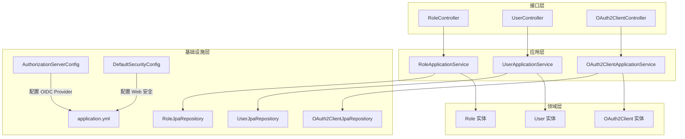
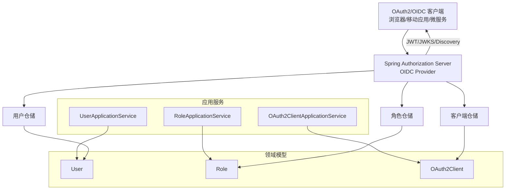
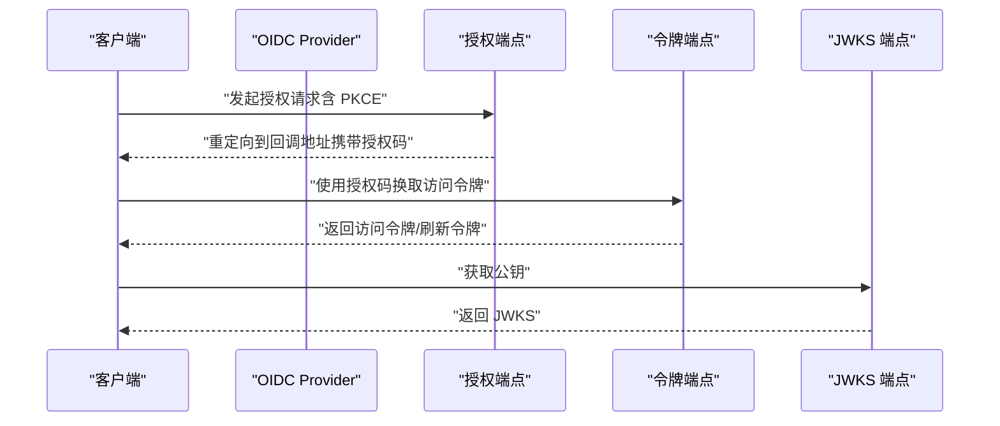
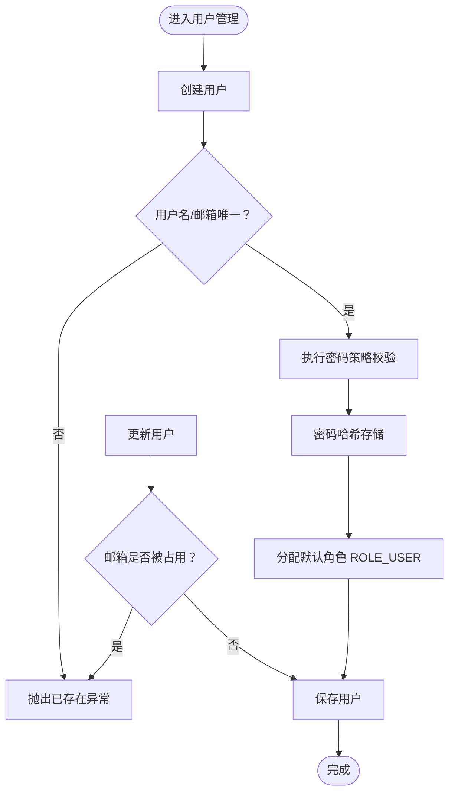
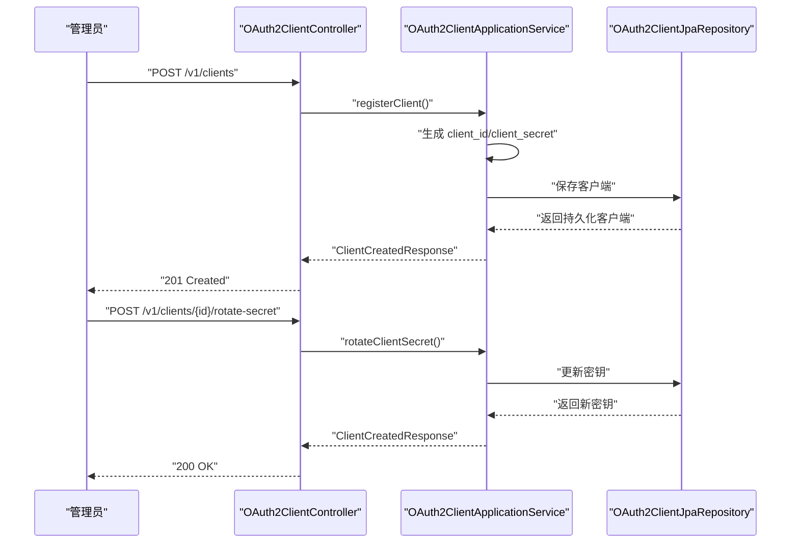
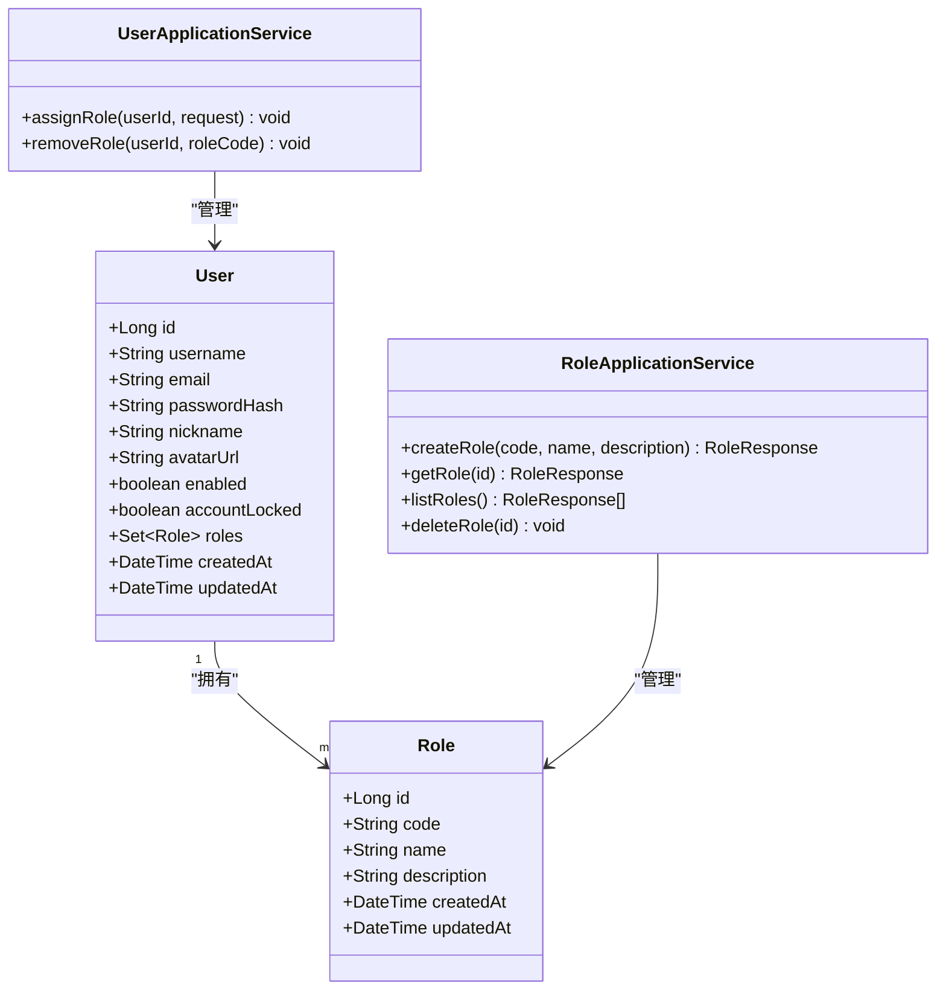
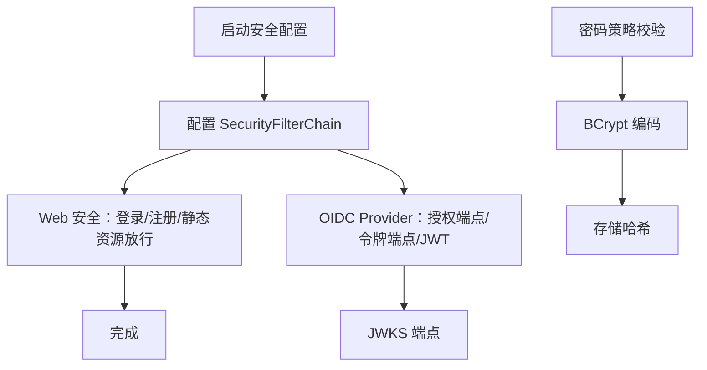
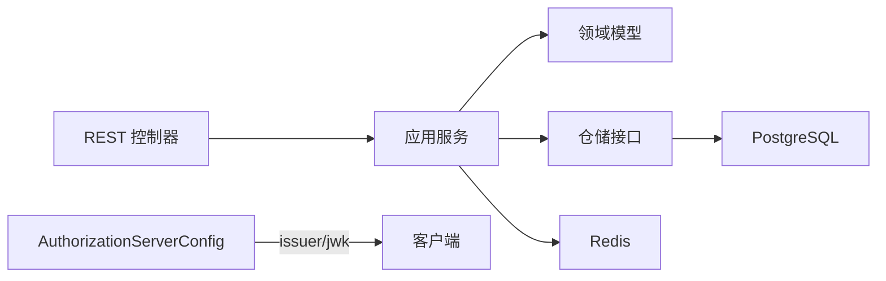

# 核心功能概览

<cite>
**本文引用的文件**
- [SsoOidcApplication.java](file://src/main/java/sso/oidc/SsoOidcApplication.java)
- [AuthorizationServerConfig.java](file://src/main/java/sso/oidc/infrastructure/config/AuthorizationServerConfig.java)
- [DefaultSecurityConfig.java](file://src/main/java/sso/oidc/infrastructure/config/DefaultSecurityConfig.java)
- [User.java](file://src/main/java/sso/oidc/domain/model/entity/User.java)
- [OAuth2Client.java](file://src/main/java/sso/oidc/domain/model/entity/OAuth2Client.java)
- [Role.java](file://src/main/java/sso/oidc/domain/model/entity/Role.java)
- [UserApplicationService.java](file://src/main/java/sso/oidc/application/service/UserApplicationService.java)
- [RoleApplicationService.java](file://src/main/java/sso/oidc/application/service/RoleApplicationService.java)
- [OAuth2ClientApplicationService.java](file://src/main/java/sso/oidc/application/service/OAuth2ClientApplicationService.java)
- [UserController.java](file://src/main/java/sso/oidc/interfaces/rest/UserController.java)
- [RoleController.java](file://src/main/java/sso/oidc/interfaces/rest/RoleController.java)
- [OAuth2ClientController.java](file://src/main/java/sso/oidc/interfaces/rest/OAuth2ClientController.java)
- [application.yml](file://src/main/resources/application.yml)
- [UserJpaRepository.java](file://src/main/java/sso/oidc/infrastructure/persistence/repository/UserJpaRepository.java)
- [RoleJpaRepository.java](file://src/main/java/sso/oidc/infrastructure/persistence/repository/RoleJpaRepository.java)
- [OAuth2ClientJpaRepository.java](file://src/main/java/sso/oidc/infrastructure/persistence/repository/OAuth2ClientJpaRepository.java)
- [README.md](file://README.md)
</cite>

## 目录
1. [简介](#简介)
2. [项目结构](#项目结构)
3. [核心组件](#核心组件)
4. [架构总览](#架构总览)
5. [详细组件分析](#详细组件分析)
6. [依赖分析](#依赖分析)
7. [性能考虑](#性能考虑)
8. [故障排查指南](#故障排查指南)
9. [结论](#结论)
10. [附录](#附录)

## 简介
本项目是一个基于 OpenID Connect 1.0 协议的统一身份认证服务（SSO），为微服务架构提供集中式认证与授权能力。系统以 Spring Authorization Server 为核心，提供 OIDC Provider、用户管理、OAuth2 客户端管理、角色权限管理等能力，并通过标准 OIDC 端点对外提供授权码流程、客户端凭证流程、PKCE、刷新令牌、发现与 JWKS 等能力。同时，项目内置基于角色的访问控制（RBAC）模型，配合 JWT 的自定义声明，使下游微服务能够基于角色进行细粒度权限控制。

## 项目结构
项目采用分层架构，主要分为四层：
- 应用层：封装业务用例与 DTO，协调领域模型与基础设施交互
- 领域层：定义实体、值对象、枚举与异常，承载核心业务规则
- 基础设施层：负责配置、持久化、安全与外部集成
- 接口层：暴露 REST API 与 Web 页面（Thymeleaf）

图表来源
- [AuthorizationServerConfig.java:1-144](file://src/main/java/sso/oidc/infrastructure/config/AuthorizationServerConfig.java#L1-L144)
- [DefaultSecurityConfig.java:1-44](file://src/main/java/sso/oidc/infrastructure/config/DefaultSecurityConfig.java#L1-L44)
- [UserApplicationService.java:1-165](file://src/main/java/sso/oidc/application/service/UserApplicationService.java#L1-L165)
- [RoleApplicationService.java:1-63](file://src/main/java/sso/oidc/application/service/RoleApplicationService.java#L1-L63)
- [OAuth2ClientApplicationService.java:1-170](file://src/main/java/sso/oidc/application/service/OAuth2ClientApplicationService.java#L1-L170)
- [User.java:1-40](file://src/main/java/sso/oidc/domain/model/entity/User.java#L1-L40)
- [Role.java:1-24](file://src/main/java/sso/oidc/domain/model/entity/Role.java#L1-L24)
- [OAuth2Client.java:1-73](file://src/main/java/sso/oidc/domain/model/entity/OAuth2Client.java#L1-L73)
- [UserJpaRepository.java:1-17](file://src/main/java/sso/oidc/infrastructure/persistence/repository/UserJpaRepository.java#L1-L17)
- [RoleJpaRepository.java:1-11](file://src/main/java/sso/oidc/infrastructure/persistence/repository/RoleJpaRepository.java#L1-L11)
- [OAuth2ClientJpaRepository.java:1-11](file://src/main/java/sso/oidc/infrastructure/persistence/repository/OAuth2ClientJpaRepository.java#L1-L11)
- [application.yml:1-78](file://src/main/resources/application.yml#L1-L78)

章节来源
- [README.md:104-139](file://README.md#L104-L139)

## 核心组件
- OIDC Provider：基于 Spring Authorization Server 提供授权码、客户端凭证、刷新令牌、PKCE、发现与 JWKS 等能力
- 用户管理：提供用户注册、登录、CRUD、密码管理、角色分配与移除
- OAuth2 客户端管理：提供客户端注册、更新、密钥轮换、列表与查询
- 角色权限管理：提供角色 CRUD、角色分配与移除，支持 RBAC
- 安全配置：Web 表单登录、登出、密码编码器、过滤链配置
- 数据与持久化：JPA + Flyway 迁移，Redis 缓存与分布式会话

章节来源
- [AuthorizationServerConfig.java:49-91](file://src/main/java/sso/oidc/infrastructure/config/AuthorizationServerConfig.java#L49-L91)
- [UserApplicationService.java:36-149](file://src/main/java/sso/oidc/application/service/UserApplicationService.java#L36-L149)
- [OAuth2ClientApplicationService.java:29-153](file://src/main/java/sso/oidc/application/service/OAuth2ClientApplicationService.java#L29-L153)
- [RoleApplicationService.java:21-50](file://src/main/java/sso/oidc/application/service/RoleApplicationService.java#L21-L50)
- [DefaultSecurityConfig.java:18-42](file://src/main/java/sso/oidc/infrastructure/config/DefaultSecurityConfig.java#L18-L42)
- [application.yml:9-46](file://src/main/resources/application.yml#L9-L46)

## 架构总览
系统以 Spring Boot 为基础，通过 Spring Authorization Server 构建 OIDC Provider，结合应用层服务与领域模型实现用户、角色、客户端的管理；通过 REST API 对外提供统一认证与授权能力；通过 Redis 实现分布式会话与缓存；通过 Flyway 管理数据库迁移。

图表来源
- [AuthorizationServerConfig.java:49-124](file://src/main/java/sso/oidc/infrastructure/config/AuthorizationServerConfig.java#L49-L124)
- [UserApplicationService.java:31-34](file://src/main/java/sso/oidc/application/service/UserApplicationService.java#L31-L34)
- [RoleApplicationService.java:19](file://src/main/java/sso/oidc/application/service/RoleApplicationService.java#L19)
- [OAuth2ClientApplicationService.java:27](file://src/main/java/sso/oidc/application/service/OAuth2ClientApplicationService.java#L27)
- [UserJpaRepository.java:8-16](file://src/main/java/sso/oidc/infrastructure/persistence/repository/UserJpaRepository.java#L8-L16)
- [RoleJpaRepository.java:8-9](file://src/main/java/sso/oidc/infrastructure/persistence/repository/RoleJpaRepository.java#L8-L9)
- [OAuth2ClientJpaRepository.java:8-9](file://src/main/java/sso/oidc/infrastructure/persistence/repository/OAuth2ClientJpaRepository.java#L8-L9)

## 详细组件分析

### OIDC Provider 与协议实现
- 授权码流程（含 PKCE）：通过授权端点发起授权，回调后换取令牌，支持 Public Client 强制 PKCE
- 客户端凭证流程：用于服务到服务的认证
- 刷新令牌：支持刷新令牌轮换与生命周期控制
- 发现与 JWKS：提供 /.well-known/openid-configuration 与 /oauth2/jwks
- 用户信息端点：/userinfo 返回受保护的用户信息
- 令牌内省与撤销：/oauth2/introspect 与 /oauth2/revoke

图表来源
- [AuthorizationServerConfig.java:51-66](file://src/main/java/sso/oidc/infrastructure/config/AuthorizationServerConfig.java#L51-L66)
- [AuthorizationServerConfig.java:69-91](file://src/main/java/sso/oidc/infrastructure/config/AuthorizationServerConfig.java#L69-L91)
- [AuthorizationServerConfig.java:119-124](file://src/main/java/sso/oidc/infrastructure/config/AuthorizationServerConfig.java#L119-L124)

章节来源
- [AuthorizationServerConfig.java:49-124](file://src/main/java/sso/oidc/infrastructure/config/AuthorizationServerConfig.java#L49-L124)
- [README.md:360-371](file://README.md#L360-L371)

### 用户管理
- 用户注册：校验唯一性、执行密码策略、分配默认角色
- 登录与会话：基于表单登录，使用 Redis 存储会话
- 用户 CRUD：支持昵称、邮箱、头像、启用状态更新
- 密码管理：旧密码校验、新密码策略校验、哈希存储
- 角色分配与移除：按角色编码分配或移除

图表来源
- [UserApplicationService.java:36-63](file://src/main/java/sso/oidc/application/service/UserApplicationService.java#L36-L63)
- [UserApplicationService.java:71-92](file://src/main/java/sso/oidc/application/service/UserApplicationService.java#L71-L92)
- [UserApplicationService.java:112-125](file://src/main/java/sso/oidc/application/service/UserApplicationService.java#L112-L125)
- [UserApplicationService.java:127-139](file://src/main/java/sso/oidc/application/service/UserApplicationService.java#L127-L139)

章节来源
- [UserApplicationService.java:36-149](file://src/main/java/sso/oidc/application/service/UserApplicationService.java#L36-L149)
- [UserController.java:35-88](file://src/main/java/sso/oidc/interfaces/rest/UserController.java#L35-L88)
- [User.java:17-39](file://src/main/java/sso/oidc/domain/model/entity/User.java#L17-L39)
- [UserJpaRepository.java:8-16](file://src/main/java/sso/oidc/infrastructure/persistence/repository/UserJpaRepository.java#L8-L16)

### OAuth2 客户端管理
- 客户端注册：自动生成 client_id/client_secret，支持多种授权类型、重定向 URI、作用域、PKCE 与授权同意
- 客户端更新：动态修改授权类型、重定向 URI、作用域、令牌 TTL、启用状态
- 密钥轮换：仅在创建/轮换时返回明文密钥，保障安全性
- 列表与查询：分页查询客户端信息

图表来源
- [OAuth2ClientController.java:34-73](file://src/main/java/sso/oidc/interfaces/rest/OAuth2ClientController.java#L34-L73)
- [OAuth2ClientApplicationService.java:29-72](file://src/main/java/sso/oidc/application/service/OAuth2ClientApplicationService.java#L29-L72)
- [OAuth2ClientApplicationService.java:128-153](file://src/main/java/sso/oidc/application/service/OAuth2ClientApplicationService.java#L128-L153)
- [OAuth2ClientJpaRepository.java:8-9](file://src/main/java/sso/oidc/infrastructure/persistence/repository/OAuth2ClientJpaRepository.java#L8-L9)

章节来源
- [OAuth2ClientApplicationService.java:29-153](file://src/main/java/sso/oidc/application/service/OAuth2ClientApplicationService.java#L29-L153)
- [OAuth2ClientController.java:34-73](file://src/main/java/sso/oidc/interfaces/rest/OAuth2ClientController.java#L34-L73)
- [OAuth2Client.java:17-72](file://src/main/java/sso/oidc/domain/model/entity/OAuth2Client.java#L17-L72)

### 角色权限管理（RBAC）
- 角色 CRUD：创建、查询、列表、删除
- 角色分配：按角色编码将角色分配给用户
- 角色移除：按角色编码从用户移除角色
- 默认角色：系统初始化默认角色（如 ROLE_USER），新用户注册时自动分配

图表来源
- [Role.java:15-23](file://src/main/java/sso/oidc/domain/model/entity/Role.java#L15-L23)
- [User.java:17-39](file://src/main/java/sso/oidc/domain/model/entity/User.java#L17-L39)
- [RoleApplicationService.java:21-50](file://src/main/java/sso/oidc/application/service/RoleApplicationService.java#L21-L50)
- [UserApplicationService.java:127-149](file://src/main/java/sso/oidc/application/service/UserApplicationService.java#L127-L149)

章节来源
- [RoleApplicationService.java:21-50](file://src/main/java/sso/oidc/application/service/RoleApplicationService.java#L21-L50)
- [RoleController.java:29-56](file://src/main/java/sso/oidc/interfaces/rest/RoleController.java#L29-L56)
- [UserApplicationService.java:127-149](file://src/main/java/sso/oidc/application/service/UserApplicationService.java#L127-L149)

### 安全与配置
- Web 安全：表单登录页面、登出、静态资源放行、登录页放行
- OIDC Provider 安全：默认注入安全过滤链、OIDC 端点启用、JWT 解码器配置
- 密码策略：BCrypt 编码器，密码强度策略由领域服务校验
- JWK：加载 PEM 私钥/公钥，生成 RSAKey 并暴露 JWKS

图表来源
- [DefaultSecurityConfig.java:18-42](file://src/main/java/sso/oidc/infrastructure/config/DefaultSecurityConfig.java#L18-L42)
- [AuthorizationServerConfig.java:51-66](file://src/main/java/sso/oidc/infrastructure/config/AuthorizationServerConfig.java#L51-L66)
- [AuthorizationServerConfig.java:93-117](file://src/main/java/sso/oidc/infrastructure/config/AuthorizationServerConfig.java#L93-L117)

章节来源
- [DefaultSecurityConfig.java:18-42](file://src/main/java/sso/oidc/infrastructure/config/DefaultSecurityConfig.java#L18-L42)
- [AuthorizationServerConfig.java:93-117](file://src/main/java/sso/oidc/infrastructure/config/AuthorizationServerConfig.java#L93-L117)

## 依赖分析
- 组件耦合与内聚：应用服务聚合领域模型与仓储接口，控制器仅负责请求编排与响应包装，保持较高内聚与清晰边界
- 外部依赖：Spring Authorization Server、PostgreSQL、Redis、Flyway、Springdoc
- 配置驱动：通过 application.yml 驱动数据库、Redis、JWK、会话与监控等配置

图表来源
- [application.yml:9-46](file://src/main/resources/application.yml#L9-L46)
- [AuthorizationServerConfig.java:119-124](file://src/main/java/sso/oidc/infrastructure/config/AuthorizationServerConfig.java#L119-L124)

章节来源
- [application.yml:9-46](file://src/main/resources/application.yml#L9-L46)

## 性能考虑
- 连接池与超时：HikariCP 最大池大小、空闲超时、最大生存时间等参数可按环境调优
- 缓存与会话：Redis 作为缓存与分布式会话，降低数据库压力
- 分页查询：用户与客户端列表均支持分页，避免一次性加载大量数据
- JWT TTL：访问令牌与刷新令牌 TTL 合理配置，平衡安全与性能

## 故障排查指南
- 用户不存在/已存在：检查用户名与邮箱唯一性约束与异常处理
- 密码错误：确认旧密码匹配与新密码策略校验
- 客户端不存在：确认客户端 ID 正确与授权类型/重定向 URI 配置
- OIDC 端点不可用：检查授权服务器配置与过滤链顺序
- JWT 验证失败：核对 JWK 私钥/公钥路径与签名算法

章节来源
- [UserApplicationService.java:36-43](file://src/main/java/sso/oidc/application/service/UserApplicationService.java#L36-L43)
- [UserApplicationService.java:112-125](file://src/main/java/sso/oidc/application/service/UserApplicationService.java#L112-L125)
- [OAuth2ClientApplicationService.java:74-77](file://src/main/java/sso/oidc/application/service/OAuth2ClientApplicationService.java#L74-L77)
- [AuthorizationServerConfig.java:51-66](file://src/main/java/sso/oidc/infrastructure/config/AuthorizationServerConfig.java#L51-L66)

## 结论
本项目以 Spring Authorization Server 为核心，提供了完整的 OIDC Provider 能力与统一认证授权服务，结合用户、角色、客户端管理，形成可扩展的 RBAC 模型。通过标准 OIDC 端点与 JWT，为微服务架构提供集中式认证与授权支撑，具备良好的安全性、可维护性与可扩展性。

## 附录
- OIDC 端点清单与用途详见 README 的 OIDC 端点表格
- 与下游服务集成时，建议在资源服务器中配置 JWT 验证指向本服务的 issuer-uri，并解析 roles 等自定义声明进行权限控制

章节来源
- [README.md:360-387](file://README.md#L360-L387)