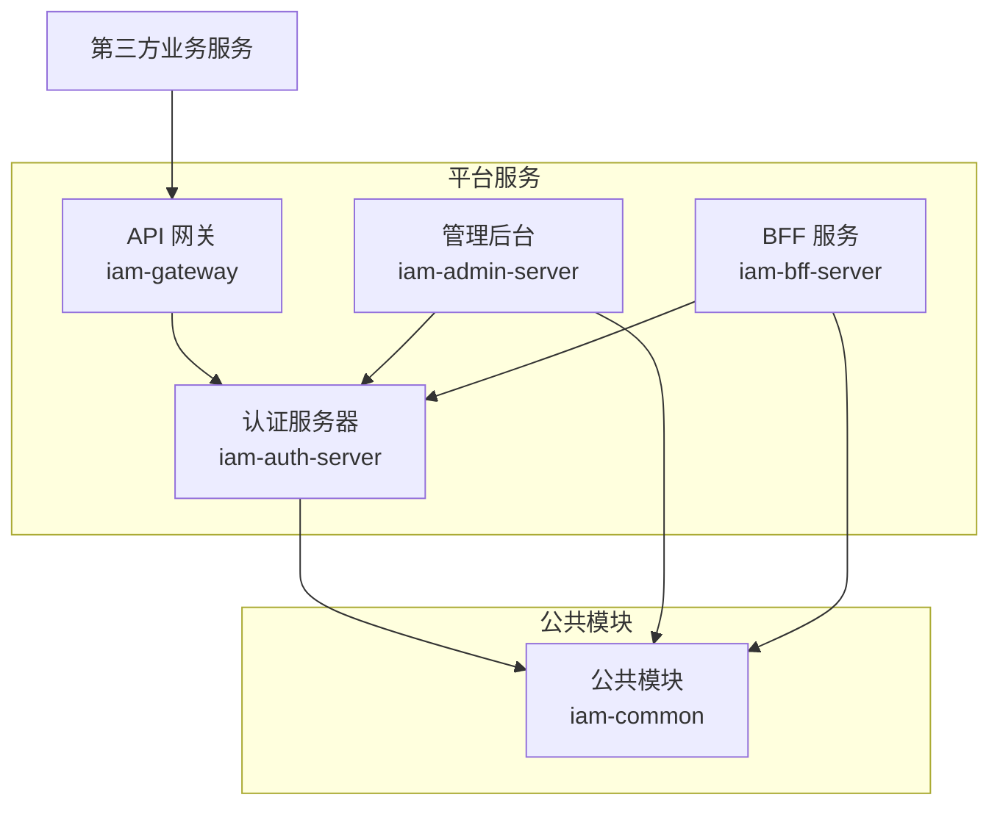
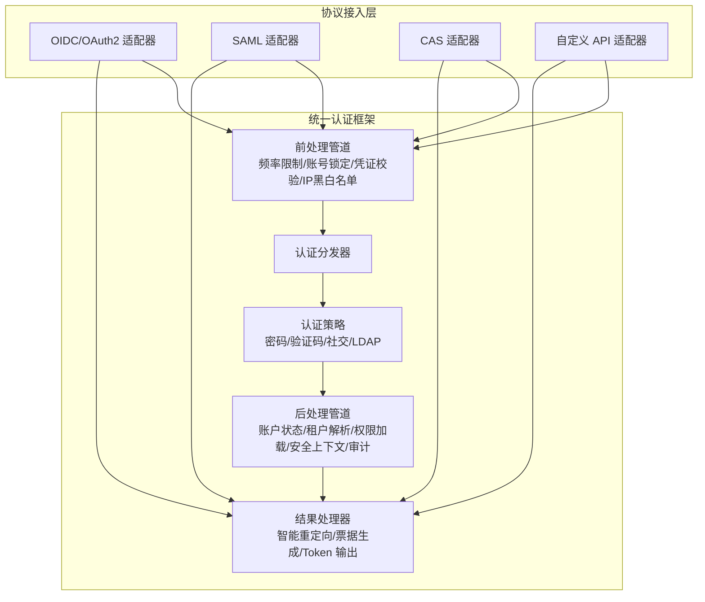
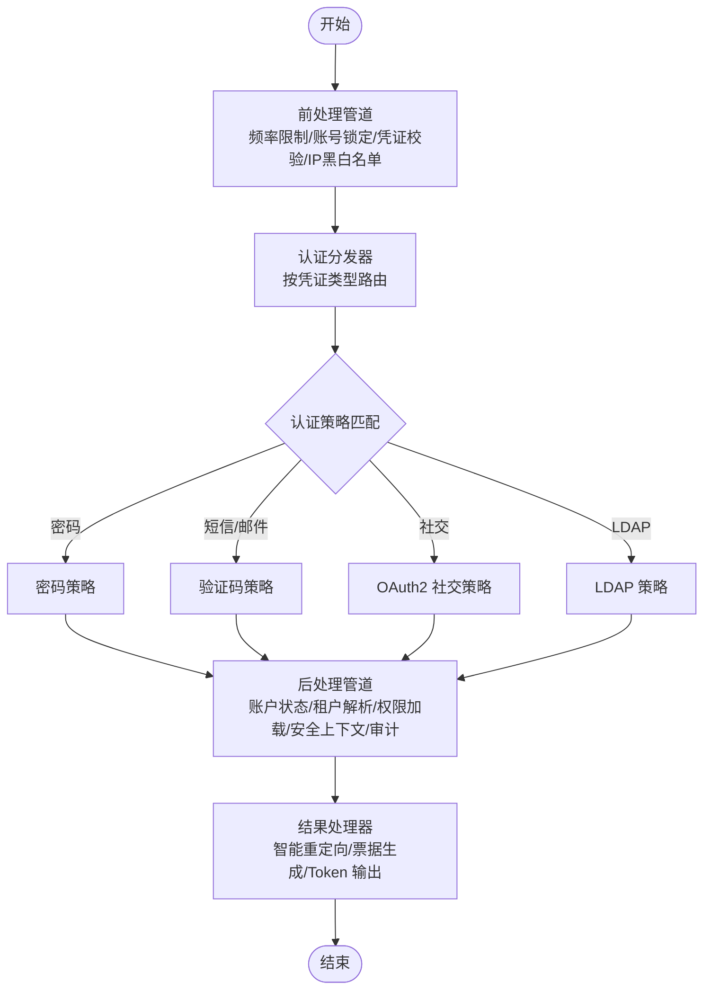
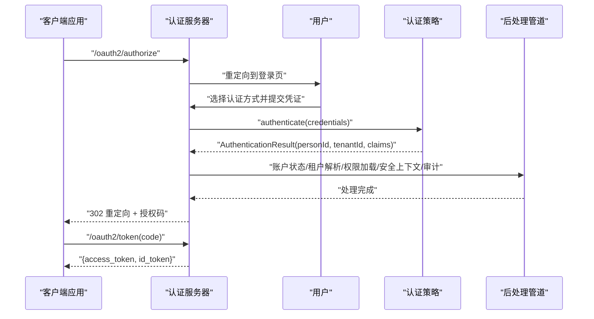
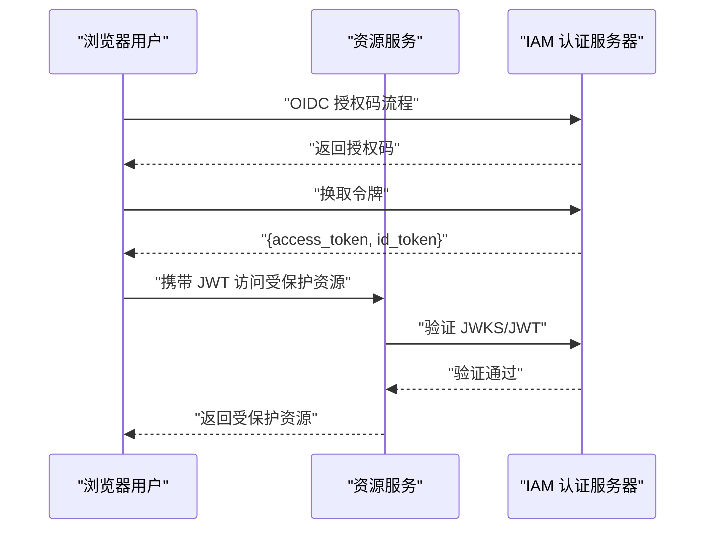
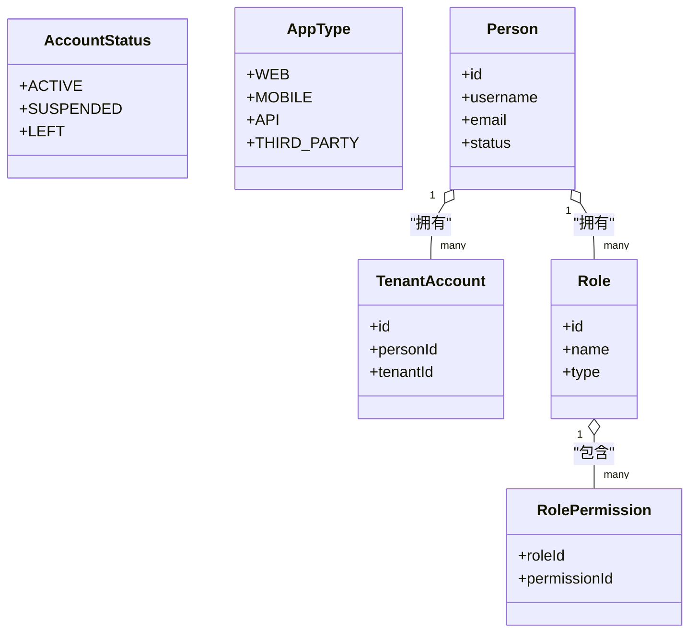
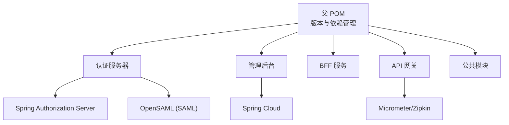

# 项目介绍

<cite>
**本文档引用的文件**
- [README.md](file://README.md)
- [docs/index.md](file://docs/index.md)
- [docs/design/统一认证框架.md](file://docs/design/统一认证框架.md)
- [docs/design/第三方服务对接指南.md](file://docs/design/第三方服务对接指南.md)
- [docs/archived/k8s/ARCHIVE_NOTICE.md](file://docs/archived/k8s/ARCHIVE_NOTICE.md)
- [docs/unfinished-features-checklist.md](file://docs/unfinished-features-checklist.md)
- [pom.xml](file://pom.xml)
- [iam-auth-server/src/main/resources/application.yml](file://iam-auth-server/src/main/resources/application.yml)
- [iam-admin-server/src/main/resources/application.yml](file://iam-admin-server/src/main/resources/application.yml)
- [iam-auth-server/src/main/java/iam/platform/auth/SsoAuthServerApplication.java](file://iam-auth-server/src/main/java/iam/platform/auth/SsoAuthServerApplication.java)
- [iam-admin-server/src/main/java/iam/platform/admin/SsoAdminServerApplication.java](file://iam-admin-server/src/main/java/iam/platform/admin/SsoAdminServerApplication.java)
- [iam-bff-server/src/main/java/iam/platform/bff/IamBffServerApplication.java](file://iam-bff-server/src/main/java/iam/platform/bff/IamBffServerApplication.java)
- [iam-gateway/src/main/java/iam/platform/gateway/IamGatewayApplication.java](file://iam-gateway/src/main/java/iam/platform/gateway/IamGatewayApplication.java)
- [iam-common/src/main/java/iam/platform/common/model/enums/AccountStatus.java](file://iam-common/src/main/java/iam/platform/common/model/enums/AccountStatus.java)
- [iam-common/src/main/java/iam/platform/common/model/enums/AppType.java](file://iam-common/src/main/java/iam/platform/common/model/enums/AppType.java)
</cite>

## 目录
1. [引言](#引言)
2. [项目结构](#项目结构)
3. [核心组件](#核心组件)
4. [架构总览](#架构总览)
5. [详细组件分析](#详细组件分析)
6. [依赖分析](#依赖分析)
7. [性能考虑](#性能考虑)
8. [故障排查指南](#故障排查指南)
9. [结论](#结论)
10. [附录](#附录)

## 引言
IAM 平台项目是一个基于 OpenID Connect 1.0 协议的统一身份认证与单点登录（SSO）服务，面向微服务架构与多租户场景，提供集中式的认证授权能力。项目旨在解决以下关键业务问题：
- 微服务架构下的统一认证与跨服务会话共享难题；
- 多租户系统中用户身份隔离、权限控制与租户上下文管理；
- 企业级应用对多种认证协议（OIDC/OAuth2、SAML、CAS）与第三方登录的支持需求；
- 安全性与合规性要求（密码加密、令牌签名、速率限制、审计日志等）。

项目通过“协议接入层 + 身份认证层”的双层抽象设计，既保证了对多种协议的灵活适配，又实现了认证策略的可插拔与可扩展，从而在统一框架下满足不同业务场景的差异化需求。

## 项目结构
项目采用多模块的 Maven 聚合工程组织，包含统一的公共模块与四个核心服务模块：
- iam-common：公共模型、异常、枚举与通用工具；
- iam-auth-server：认证服务器（OIDC Provider），负责用户认证、令牌签发与协议适配；
- iam-admin-server：管理后台，提供应用、用户、组织、权限等管理能力；
- iam-bff-server：前端后端代理（BFF），承载 Web 层交互与部分协议适配；
- iam-gateway：API 网关，负责路由、JWT 校验与统一入口。

图表来源
- [pom.xml:21-27](file://pom.xml#L21-L27)
- [iam-auth-server/src/main/java/iam/platform/auth/SsoAuthServerApplication.java:1-19](file://iam-auth-server/src/main/java/iam/platform/auth/SsoAuthServerApplication.java#L1-L19)
- [iam-admin-server/src/main/java/iam/platform/admin/SsoAdminServerApplication.java:1-17](file://iam-admin-server/src/main/java/iam/platform/admin/SsoAdminServerApplication.java#L1-L17)
- [iam-bff-server/src/main/java/iam/platform/bff/IamBffServerApplication.java:1-17](file://iam-bff-server/src/main/java/iam/platform/bff/IamBffServerApplication.java#L1-L17)
- [iam-gateway/src/main/java/iam/platform/gateway/IamGatewayApplication.java:1-15](file://iam-gateway/src/main/java/iam/platform/gateway/IamGatewayApplication.java#L1-L15)

章节来源
- [README.md:95-109](file://README.md#L95-L109)
- [docs/index.md:200-232](file://docs/index.md#L200-L232)
- [pom.xml:21-27](file://pom.xml#L21-L27)

## 核心组件
- 认证服务器（iam-auth-server）
  - 提供 OIDC/OAuth2 协议端点，支持授权码模式（含 PKCE）、密码模式、客户端凭证模式、刷新令牌等；
  - 内置统一认证框架，支持密码、短信/邮件验证码、OAuth2 社交登录、LDAP/AD 等多种认证方式；
  - 提供 SSO 主动推送授权码能力，便于门户与应用间跳转；
  - 集成安全策略（频率限制、账号锁定、IP 白名单/黑名单）、审计事件与租户上下文解析。
- 管理后台（iam-admin-server）
  - 提供应用注册、用户管理、组织与角色权限管理、审计日志统计等管理能力；
  - 通过 OIDC 与认证服务器联动，保障管理后台自身的安全访问。
- BFF 服务（iam-bff-server）
  - 承载 Web 登录、注册、同意授权、租户选择等前端交互页面；
  - 作为协议适配层的一部分，与认证服务器协同完成登录体验的一致性。
- API 网关（iam-gateway）
  - 统一入口，负责 JWT 校验、路由转发与可观测性；
  - 与认证服务器配合，实现资源服务侧的统一鉴权。
- 公共模块（iam-common）
  - 定义统一的 API 响应、分页响应、DTO、异常体系、枚举与通用工具；
  - 为各服务提供一致的数据契约与行为规范。

章节来源
- [docs/design/统一认证框架.md:1-138](file://docs/design/统一认证框架.md#L1-L138)
- [docs/design/第三方服务对接指南.md:1-40](file://docs/design/第三方服务对接指南.md#L1-L40)
- [iam-auth-server/src/main/resources/application.yml:1-144](file://iam-auth-server/src/main/resources/application.yml#L1-L144)
- [iam-admin-server/src/main/resources/application.yml:1-102](file://iam-admin-server/src/main/resources/application.yml#L1-L102)

## 架构总览
IAM 平台采用“协议接入层 + 身份认证层”的双层架构：
- 协议接入层：负责与不同协议（OIDC/OAuth2、SAML、CAS、自定义 API）对接，按来源协议输出对应的结果（授权码、断言、票据、Token JSON）；
- 身份认证层：在需要验证用户身份时调用，完成凭证校验、账户状态验证、租户解析、权限加载、安全上下文建立与审计事件发布。

图表来源
- [docs/design/统一认证框架.md:14-93](file://docs/design/统一认证框架.md#L14-L93)
- [docs/design/统一认证框架.md:140-233](file://docs/design/统一认证框架.md#L140-L233)

章节来源
- [docs/design/统一认证框架.md:1-138](file://docs/design/统一认证框架.md#L1-L138)

## 详细组件分析

### 组件A：统一认证框架（身份认证层）
- 前处理管道：在任何认证策略执行前进行轻量级安全检查（频率限制、账号锁定、凭证格式、IP 白名单/黑名单）；
- 认证分发器：根据凭证类型动态路由到相应策略；
- 认证策略：支持密码、短信/邮件验证码、OAuth2 社交登录、LDAP/AD 等；
- 后处理管道：认证成功后的通用处理（账户状态验证、租户解析、登录记录、权限加载、安全上下文、审计事件）；
- 结果处理器：依据来源协议智能输出结果（OIDC 授权码/推送、SAML 断言、CAS 票据、API Token JSON）。

图表来源
- [docs/design/统一认证框架.md:333-354](file://docs/design/统一认证框架.md#L333-L354)
- [docs/design/统一认证框架.md:311-332](file://docs/design/统一认证框架.md#L311-L332)
- [docs/design/统一认证框架.md:273-326](file://docs/design/统一认证框架.md#L273-L326)

章节来源
- [docs/design/统一认证框架.md:273-354](file://docs/design/统一认证框架.md#L273-L354)

### 组件B：OIDC/OAuth2 协议接入（认证服务器）
- 支持授权码模式（含 PKCE）、密码模式、客户端凭证模式、刷新令牌模式；
- 通过 Spring Authorization Server 提供标准 OIDC 端点（发现、授权、令牌、用户信息、JWKS、撤销等）；
- 提供 SSO 主动推送授权码能力，便于门户与应用间跳转；
- 集成安全策略（频率限制、账号锁定、IP 白名单/黑名单）与审计事件。

图表来源
- [docs/design/统一认证框架.md:95-133](file://docs/design/统一认证框架.md#L95-L133)
- [docs/design/统一认证框架.md:408-484](file://docs/design/统一认证框架.md#L408-L484)

章节来源
- [docs/design/统一认证框架.md:408-521](file://docs/design/统一认证框架.md#L408-L521)
- [iam-auth-server/src/main/resources/application.yml:54-71](file://iam-auth-server/src/main/resources/application.yml#L54-L71)

### 组件C：第三方服务对接（资源服务集成）
- 通过 OIDC 发现端点获取授权服务器配置；
- 在资源服务中配置 Spring Security OAuth2 Resource Server，使用 RS256 签名的 JWKS 验证 JWT；
- 从 JWT 中提取用户身份与角色，实现 RBAC 权限控制；
- 支持刷新令牌流程与注销流程。

图表来源
- [docs/design/第三方服务对接指南.md:1-40](file://docs/design/第三方服务对接指南.md#L1-L40)
- [docs/design/第三方服务对接指南.md:100-123](file://docs/design/第三方服务对接指南.md#L100-L123)

章节来源
- [docs/design/第三方服务对接指南.md:1-200](file://docs/design/第三方服务对接指南.md#L1-L200)

### 组件D：多租户与权限控制
- 账户状态枚举（ACTIVE/SUSPENDED/LEFT）与应用类型枚举（WEB/MOBILE/API/THIRD_PARTY）支撑多租户场景下的用户与应用管理；
- 验证码登录流程已迁移到 Person 模型并关联多租户体系，自动识别租户并加载权限；
- 管理后台提供应用、组织、角色、权限的统一管理能力，支持审计日志与异步处理优化。

图表来源
- [iam-common/src/main/java/iam/platform/common/model/enums/AccountStatus.java:1-6](file://iam-common/src/main/java/iam/platform/common/model/enums/AccountStatus.java#L1-L6)
- [iam-common/src/main/java/iam/platform/common/model/enums/AppType.java:1-6](file://iam-common/src/main/java/iam/platform/common/model/enums/AppType.java#L1-L6)

章节来源
- [docs/unfinished-features-checklist.md:117-137](file://docs/unfinished-features-checklist.md#L117-L137)
- [iam-common/src/main/java/iam/platform/common/model/enums/AccountStatus.java:1-6](file://iam-common/src/main/java/iam/platform/common/model/enums/AccountStatus.java#L1-L6)
- [iam-common/src/main/java/iam/platform/common/model/enums/AppType.java:1-6](file://iam-common/src/main/java/iam/platform/common/model/enums/AppType.java#L1-L6)

## 依赖分析
- 技术栈与版本
  - Java 21、Spring Boot 3.2.5、Spring Authorization Server 1.2.5、PostgreSQL 14+、Redis 7+、Flyway、MapStruct、Thymeleaf、Springdoc、Testcontainers 等；
- 模块依赖
  - iam-auth-server、iam-admin-server、iam-bff-server、iam-gateway 均依赖 iam-common；
  - 认证服务器引入 Spring Authorization Server 与 OpenSAML（SAML 支持）；
  - 管理后台与网关引入 Spring Cloud 与 Micrometer/Zipkin 用于可观测性；
- 多环境配置
  - 通过 Spring Profile 实现 dev/test/canary/prod 四套环境隔离，支持 Docker 镜像标签区分。

图表来源
- [pom.xml:43-122](file://pom.xml#L43-L122)
- [pom.xml:177-226](file://pom.xml#L177-L226)

章节来源
- [README.md:16-33](file://README.md#L16-L33)
- [pom.xml:1-226](file://pom.xml#L1-L226)

## 性能考虑
- 会话与水平扩展
  - 使用 Redis 存储 Session，支持水平扩容与跨实例共享；
- 令牌与缓存
  - JWKS 与令牌签发采用 RS256 签名，减少 CPU 开销；
  - 频繁访问的元数据与配置可缓存，降低数据库压力；
- 安全与审计
  - 频率限制、账号锁定、IP 白名单/黑名单等前置安全检查，避免后端重负载；
  - 审计日志异步化与队列化（建议）可进一步降低主流程延迟；
- 观测性
  - 集成 Micrometer 与 Zipkin，便于追踪与指标采集。

## 故障排查指南
- OIDC 协议对接
  - 检查 OIDC 发现端点与 JWKS 配置是否正确；
  - 确认客户端注册与回调地址、作用域、PKCE 设置；
- 登录与认证
  - 查看统一认证框架的前/后处理管道日志，定位频率限制、账号锁定、凭证校验、租户解析等问题；
  - 验证验证码登录是否已迁移到 Person 模型并正确关联多租户；
- 部署与环境
  - 确认 Spring Profile 与环境变量配置（DB、Redis、SSL、Issuer URI 等）；
  - 当前已从 Kubernetes 迁移至 Docker 直接部署与 Docker Compose，参考归档说明与 CI/CD 脚本。

章节来源
- [docs/design/第三方服务对接指南.md:100-123](file://docs/design/第三方服务对接指南.md#L100-L123)
- [docs/unfinished-features-checklist.md:1-319](file://docs/unfinished-features-checklist.md#L1-L319)
- [docs/archived/k8s/ARCHIVE_NOTICE.md:1-30](file://docs/archived/k8s/ARCHIVE_NOTICE.md#L1-L30)

## 结论
IAM 平台通过“协议接入层 + 身份认证层”的双层架构，为微服务与多租户场景提供了统一、安全、可扩展的身份认证与单点登录解决方案。项目具备以下优势：
- 协议支持全面：OIDC/OAuth2、SAML、CAS 及自定义 API；
- 认证策略灵活：密码、验证码、社交登录、LDAP/AD 等；
- 安全与合规：密码加密、令牌签名、速率限制、审计日志；
- 易于集成：标准化的 OIDC 发现与 JWKS，资源服务可快速接入；
- 可运维性强：多环境配置、可观测性与 Docker 部署。

## 附录

### 应用场景与目标用户
- 企业级应用：统一登录门户、多系统单点登录；
- 微服务架构：服务间认证、资源服务保护；
- 多租户系统：租户隔离、权限控制与审计；
- 第三方服务：快速对接 IAM 平台，实现统一认证与授权。

### 创新点与竞争优势
- 双层抽象设计：协议与认证解耦，提升灵活性与可扩展性；
- 多协议统一适配：一套登录页，多协议输出；
- 多租户深度集成：租户上下文自动建立与权限加载；
- 安全策略内置：频率限制、账号锁定、IP 白名单/黑名单；
- 开放生态：支持第三方登录提供商与自定义认证策略。

### 发展历程与未来规划
- 已完成
  - 租户上下文识别与自动建立；
  - User → Person 模型迁移与验证码登录关联多租户；
  - SecureRandom 与速率限制的安全加固；
- 待完成
  - 集成真实 SMS/Email 验证码服务；
  - OAuth2 第三方登录 Provider 配置；
  - 审计日志异步化与 Redis 集群配置；
- 部署方式
  - 已从 Kubernetes 迁移至 Docker 直接部署与 Docker Compose。

章节来源
- [docs/unfinished-features-checklist.md:279-319](file://docs/unfinished-features-checklist.md#L279-L319)
- [docs/archived/k8s/ARCHIVE_NOTICE.md:14-24](file://docs/archived/k8s/ARCHIVE_NOTICE.md#L14-L24)