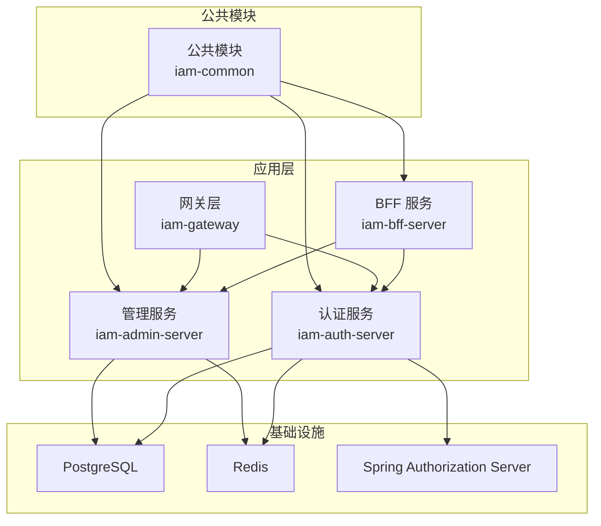
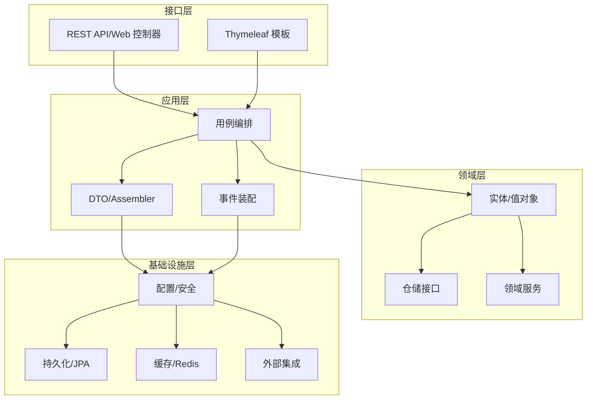
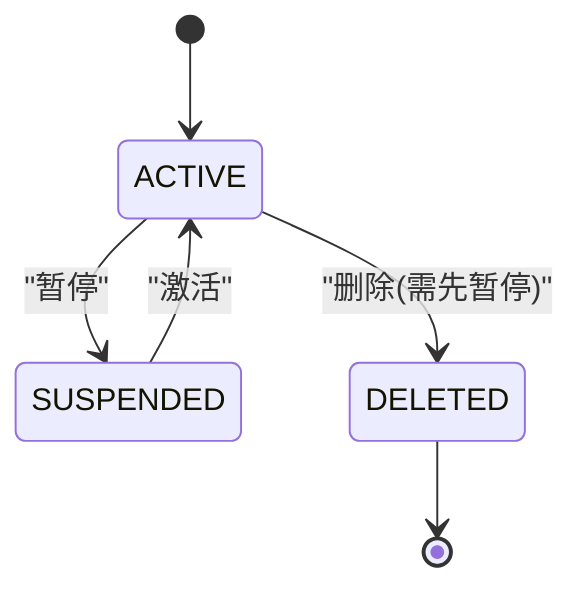
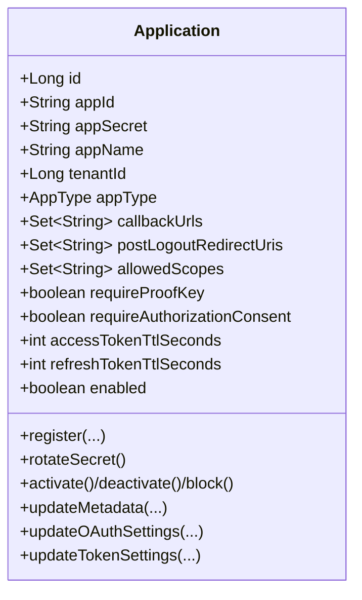
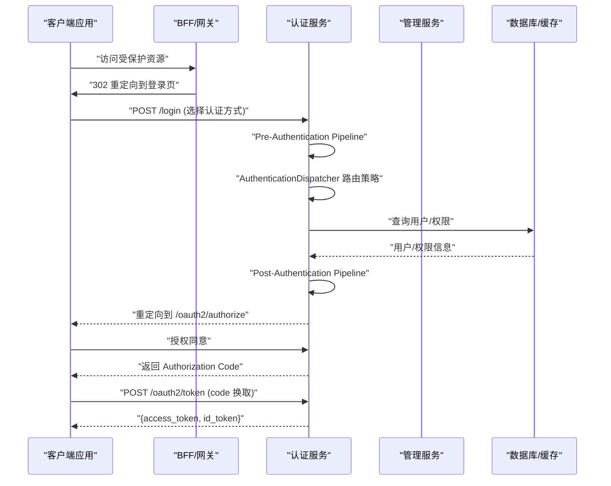
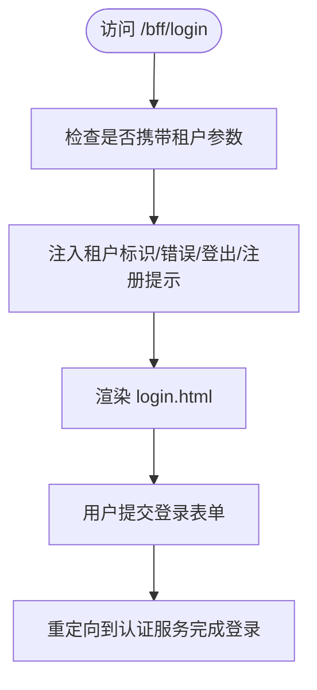
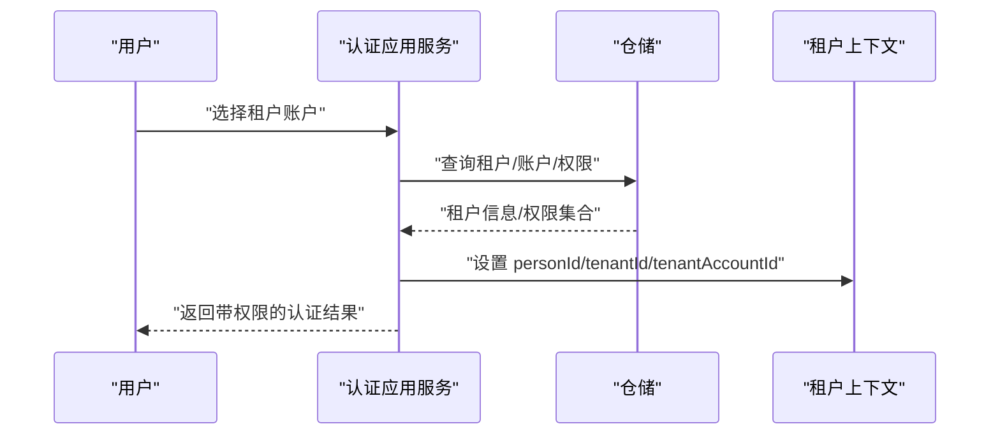
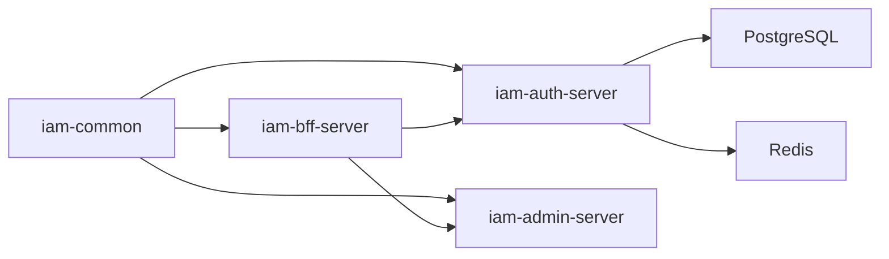

# 项目概述

<cite>
**本文引用的文件**
- [README.md](file://README.md)
- [pom.xml](file://pom.xml)
- [SsoAdminServerApplication.java](file://iam-admin-server/src/main/java/iam/platform/admin/SsoAdminServerApplication.java)
- [SsoAuthServerApplication.java](file://iam-auth-server/src/main/java/iam/platform/auth/SsoAuthServerApplication.java)
- [IamBffServerApplication.java](file://iam-bff-server/src/main/java/iam/platform/bff/IamBffServerApplication.java)
- [统一认证框架.md](file://docs/design/统一认证框架.md)
- [Spring Authorization Server 原理与流程.md](file://docs/design/Spring Authorization Server 原理与流程.md)
- [AccountStatus.java](file://iam-common/src/main/java/iam/platform/common/model/enums/AccountStatus.java)
- [TenantStatus.java](file://iam-common/src/main/java/iam/platform/common/model/enums/TenantStatus.java)
- [Application.java](file://iam-auth-server/src/main/java/iam/platform/auth/domain/model/entity/Application.java)
- [Tenant.java](file://iam-admin-server/src/main/java/iam/platform/admin/domain/model/entity/Tenant.java)
- [TenantApplicationService.java](file://iam-admin-server/src/main/java/iam/platform/admin/application/service/TenantApplicationService.java)
- [AuthenticationApplicationService.java](file://iam-auth-server/src/main/java/iam/platform/auth/application/service/AuthenticationApplicationService.java)
- [BffRegistrationController.java](file://iam-bff-server/src/main/java/iam/platform/bff/interfaces/web/BffRegistrationController.java)
- [BffLoginController.java](file://iam-bff-server/src/main/java/iam/platform/bff/interfaces/web/BffLoginController.java)
- [BffTenantSelectionController.java](file://iam-bff-server/src/main/java/iam/platform/bff/interfaces/web/BffTenantSelectionController.java)
- [BffWebMvcConfig.java](file://iam-bff-server/src/main/java/iam/platform/bff/infrastructure/config/BffWebMvcConfig.java)
- [unfinished-features-checklist.md](file://docs/unfinished-features-checklist.md)
</cite>

## 目录
1. [简介](#简介)
2. [项目结构](#项目结构)
3. [核心组件](#核心组件)
4. [架构总览](#架构总览)
5. [详细组件分析](#详细组件分析)
6. [依赖分析](#依赖分析)
7. [性能考虑](#性能考虑)
8. [故障排除指南](#故障排除指南)
9. [结论](#结论)
10. [附录](#附录)

## 简介
本项目是一个基于 OpenID Connect 1.0 协议的统一身份认证服务（SSO），为微服务架构提供集中式认证与授权能力。项目采用 Clean Architecture 与 Domain-Driven Design 设计，围绕“身份认证层”和“协议接入层”的两层抽象，实现多协议（OIDC/OAuth2、SAML、CAS）与多认证方式（密码、验证码、社交、LDAP）的统一接入与治理。

项目核心目标：
- 提供统一的认证与授权中心，支撑多租户与多应用生态
- 支持多种协议与认证方式，满足不同客户端与组织形态需求
- 通过 Clean Architecture 与 DDD 实现高内聚、低耦合、易演进的系统设计
- 以 Spring Authorization Server 为核心，提供标准化 OAuth2/OIDC 能力

## 项目结构
项目采用多模块聚合工程，模块划分遵循 Clean Architecture 的分层思想，并结合微服务拆分：
- iam-common：公共模型、异常、DTO、枚举与通用工具
- iam-auth-server：认证与授权服务（OIDC Provider、协议接入、认证策略）
- iam-admin-server：管理与运营服务（租户、用户、角色、权限等管理）
- iam-bff-server：前端代理与门户服务（BFF 层，负责页面渲染与轻量 API 聚合）
- iam-gateway：网关层（路由、鉴权、跨域）

图表来源
- [pom.xml:21-27](file://pom.xml#L21-L27)
- [SsoAuthServerApplication.java:9-12](file://iam-auth-server/src/main/java/iam/platform/auth/SsoAuthServerApplication.java#L9-L12)
- [SsoAdminServerApplication.java:8-11](file://iam-admin-server/src/main/java/iam/platform/admin/SsoAdminServerApplication.java#L8-L11)
- [IamBffServerApplication.java:8-10](file://iam-bff-server/src/main/java/iam/platform/bff/IamBffServerApplication.java#L8-L10)

章节来源
- [README.md:95-109](file://README.md#L95-L109)
- [pom.xml:21-27](file://pom.xml#L21-L27)

## 核心组件
- 认证与授权服务（iam-auth-server）
  - 基于 Spring Authorization Server 提供 OIDC/OAuth2 能力
  - 统一认证框架：前处理管道（风控、白名单）、认证分发器、后处理管道（状态校验、租户解析、权限加载、审计）
  - 支持多种认证方式：密码、短信/邮件验证码、社交登录、LDAP
- 管理与运营服务（iam-admin-server）
  - 多租户管理：租户生命周期、限额与到期控制
  - 用户与权限：人员、组织、角色、权限的 CRUD 与映射
  - 审计与日志：统一审计事件与日志装配
- 前端代理与门户（iam-bff-server）
  - 页面渲染（Thymeleaf）与轻量 API 聚合
  - 登录、注册、租户选择等前端页面
- 网关层（iam-gateway）
  - 统一入口、路由、鉴权转换与跨域配置
- 公共模块（iam-common）
  - 统一异常、DTO、枚举、注解与通用工具

章节来源
- [统一认证框架.md:1-13](file://docs/design/统一认证框架.md#L1-L13)
- [Spring Authorization Server 原理与流程.md:22-84](file://docs/design/Spring Authorization Server 原理与流程.md#L22-L84)
- [AccountStatus.java:1-6](file://iam-common/src/main/java/iam/platform/common/model/enums/AccountStatus.java#L1-L6)
- [TenantStatus.java:1-6](file://iam-common/src/main/java/iam/platform/common/model/enums/TenantStatus.java#L1-L6)

## 架构总览
项目采用 Clean Architecture + DDD 的分层设计：
- 领域层（Domain）：实体、值对象、领域服务与仓储接口，承载核心业务规则
- 应用层（Application）：用例编排、DTO、Assembler、事件装配
- 基础设施层（Infrastructure）：配置、安全、持久化、缓存、第三方集成
- 接口层（Interfaces）：REST API、Web 控制器、模板页面

协议与认证分离：
- 协议接入层：面向应用的协议适配（OIDC/OAuth2、SAML、CAS）
- 身份认证层：面向用户的认证策略（密码、验证码、社交、LDAP）

图表来源
- [统一认证框架.md:14-93](file://docs/design/统一认证框架.md#L14-L93)
- [Spring Authorization Server 原理与流程.md:52-84](file://docs/design/Spring Authorization Server 原理与流程.md#L52-L84)

章节来源
- [统一认证框架.md:1-13](file://docs/design/统一认证框架.md#L1-L13)
- [Spring Authorization Server 原理与流程.md:22-84](file://docs/design/Spring Authorization Server 原理与流程.md#L22-L84)

## 详细组件分析

### 多租户与租户状态管理
- 领域模型：Tenant 实体封装租户编码、名称、状态、限额、到期时间等
- 状态机：ACTIVE → SUSPENDED → DELETED，禁止对 ACTIVE 状态直接删除
- 应用服务：TenantApplicationService 提供创建、更新、激活、暂停、删除等编排逻辑，并进行业务规则校验与审计日志装配

图表来源
- [Tenant.java:50-80](file://iam-admin-server/src/main/java/iam/platform/admin/domain/model/entity/Tenant.java#L50-L80)
- [TenantApplicationService.java:75-109](file://iam-admin-server/src/main/java/iam/platform/admin/application/service/TenantApplicationService.java#L75-L109)

章节来源
- [Tenant.java:1-117](file://iam-admin-server/src/main/java/iam/platform/admin/domain/model/entity/Tenant.java#L1-L117)
- [TenantApplicationService.java:1-130](file://iam-admin-server/src/main/java/iam/platform/admin/application/service/TenantApplicationService.java#L1-L130)

### 应用与客户端管理
- 领域模型：Application 实体封装应用标识、类型、回调地址、作用域、PKCE 与同意页要求、令牌 TTL 等
- 生命周期：注册（生成凭证）、激活/停用/封禁、元数据与 OAuth2 设置更新、密钥轮换
- 价值对象：AppCredential、TokenSettings 等

图表来源
- [Application.java:21-211](file://iam-auth-server/src/main/java/iam/platform/auth/domain/model/entity/Application.java#L21-L211)

章节来源
- [Application.java:1-211](file://iam-auth-server/src/main/java/iam/platform/auth/domain/model/entity/Application.java#L1-L211)

### 统一认证流程（以 OIDC 授权码为例）
- 前处理管道：频率限制、账号锁定、凭证校验、IP 白名单
- 认证分发器：根据凭证类型路由到对应策略（密码、验证码、社交、LDAP）
- 后处理管道：账户状态验证、租户解析、登录记录、权限加载、安全上下文、审计事件
- 协议结果处理器：根据来源协议输出 Code/Assertion/Ticket/Token

图表来源
- [统一认证框架.md:95-133](file://docs/design/统一认证框架.md#L95-L133)
- [Spring Authorization Server 原理与流程.md:88-158](file://docs/design/Spring Authorization Server 原理与流程.md#L88-L158)

章节来源
- [统一认证框架.md:1-13](file://docs/design/统一认证框架.md#L1-L13)
- [Spring Authorization Server 原理与流程.md:86-158](file://docs/design/Spring Authorization Server 原理与流程.md#L86-L158)

### BFF 与前端页面
- BFF 提供 Thymeleaf 页面：登录、注册、租户选择、同意页等
- Web 配置：本地开发允许 CORS，生产由网关统一处理
- 控制器职责：渲染视图、传递参数、引导用户到认证流程

图表来源
- [BffLoginController.java:18-48](file://iam-bff-server/src/main/java/iam/platform/bff/interfaces/web/BffLoginController.java#L18-L48)
- [BffWebMvcConfig.java:13-21](file://iam-bff-server/src/main/java/iam/platform/bff/infrastructure/config/BffWebMvcConfig.java#L13-L21)

章节来源
- [BffRegistrationController.java:1-39](file://iam-bff-server/src/main/java/iam/platform/bff/interfaces/web/BffRegistrationController.java#L1-L39)
- [BffLoginController.java:1-49](file://iam-bff-server/src/main/java/iam/platform/bff/interfaces/web/BffLoginController.java#L1-L49)
- [BffTenantSelectionController.java:1-21](file://iam-bff-server/src/main/java/iam/platform/bff/interfaces/web/BffTenantSelectionController.java#L1-L21)
- [BffWebMvcConfig.java:1-22](file://iam-bff-server/src/main/java/iam/platform/bff/infrastructure/config/BffWebMvcConfig.java#L1-L22)

### 租户上下文与权限装配
- 认证完成后，应用服务根据用户与租户账户加载权限，构建带租户上下文的认证令牌
- 将当前租户、租户账户、权限集写入会话与安全上下文，供后续资源服务使用

图表来源
- [AuthenticationApplicationService.java:51-111](file://iam-auth-server/src/main/java/iam/platform/auth/application/service/AuthenticationApplicationService.java#L51-L111)

章节来源
- [AuthenticationApplicationService.java:1-139](file://iam-auth-server/src/main/java/iam/platform/auth/application/service/AuthenticationApplicationService.java#L1-L139)

## 依赖分析
- 技术栈与版本
  - Java 21、Spring Boot 3.2.5、Spring Authorization Server 1.2.5、PostgreSQL 14+、Redis 7+
  - MapStruct、Springdoc、Testcontainers、OpenSAML（SAML 支持）
- 模块依赖
  - iam-auth-server 与 iam-admin-server 依赖 iam-common
  - iam-bff-server 依赖 iam-common，并通过 Feign 客户端调用管理与认证服务
  - 父 POM 管理 Spring Cloud 与 Spring Cloud Alibaba 版本

图表来源
- [pom.xml:63-68](file://pom.xml#L63-L68)
- [SsoAuthServerApplication.java:9-12](file://iam-auth-server/src/main/java/iam/platform/auth/SsoAuthServerApplication.java#L9-L12)
- [SsoAdminServerApplication.java:8-11](file://iam-admin-server/src/main/java/iam/platform/admin/SsoAdminServerApplication.java#L8-L11)
- [IamBffServerApplication.java:8-10](file://iam-bff-server/src/main/java/iam/platform/bff/IamBffServerApplication.java#L8-L10)

章节来源
- [README.md:16-32](file://README.md#L16-L32)
- [pom.xml:34-121](file://pom.xml#L34-L121)

## 性能考虑
- 会话与水平扩容：基于 Redis 的 Session 存储，支持多实例水平扩展
- 令牌签发：仅在 Token 端点签发 JWT，减少无谓的令牌生成
- 速率限制与风控：验证码发送与登录尝试的频率限制，降低暴力破解风险
- 异步审计：建议在生产启用异步审计日志，降低主流程延迟

## 故障排除指南
- 认证失败
  - 检查租户状态与账户状态（AccountStatus、TenantStatus）
  - 确认租户账户权限是否正确加载
- 协议与端点
  - OIDC 元数据与 JWKS 端点是否可达
  - PKCE 参数是否正确传递与校验
- BFF 页面
  - 确认本地 CORS 配置仅用于开发环境
  - 检查 Thymeleaf 模板路径与参数传递
- 未完成功能与待办
  - 验证码服务：短信/邮件真实集成（待第三方服务接入）
  - OAuth2 第三方登录 Provider 配置（需在第三方平台注册应用）
  - Redis 集群/哨兵模式（生产环境按需配置）

章节来源
- [AccountStatus.java:1-6](file://iam-common/src/main/java/iam/platform/common/model/enums/AccountStatus.java#L1-L6)
- [TenantStatus.java:1-6](file://iam-common/src/main/java/iam/platform/common/model/enums/TenantStatus.java#L1-L6)
- [unfinished-features-checklist.md:10-37](file://docs/unfinished-features-checklist.md#L10-L37)
- [Spring Authorization Server 原理与流程.md:160-228](file://docs/design/Spring Authorization Server 原理与流程.md#L160-L228)

## 结论
本项目以 Clean Architecture 与 DDD 为核心，构建了统一的认证与授权平台，具备良好的可维护性与扩展性。通过“协议接入层”与“身份认证层”的清晰分离，既能满足多协议对接，又能灵活组合多种认证方式。结合多租户、RBAC、审计与风控机制，项目为微服务生态提供了坚实的身份基础设施。未来将持续完善验证码与第三方登录集成、审计异步化与 Redis 集群化等能力，提升生产可用性与性能表现。

## 附录
- 快速开始与本地运行
  - 环境要求：JDK 21+、PostgreSQL 14+、Redis 7+、Maven 3.8+
  - 本地运行：mvnw 编译与启动
  - 访问端点：Swagger UI、OIDC 元数据、登录页面、健康检查
- 多环境配置
  - 通过 Spring Profile 实现 dev/test/canary/prod 环境隔离
- 集成指南
  - 资源服务通过 spring-boot-starter-oauth2-resource-server 配置 JWT 验证，从 JWT 中提取角色与自定义声明

章节来源
- [README.md:65-201](file://README.md#L65-L201)