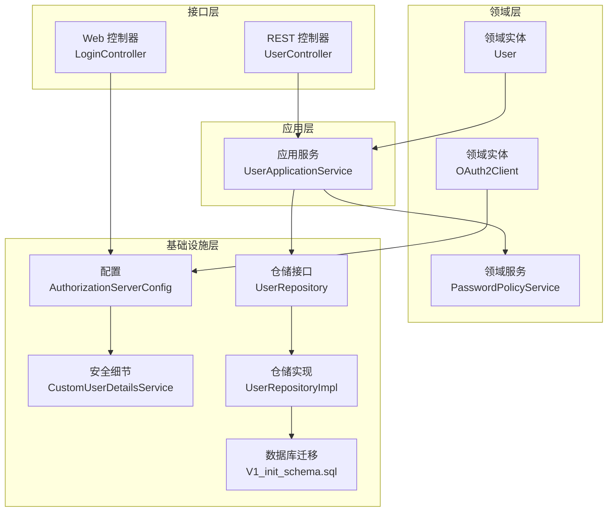
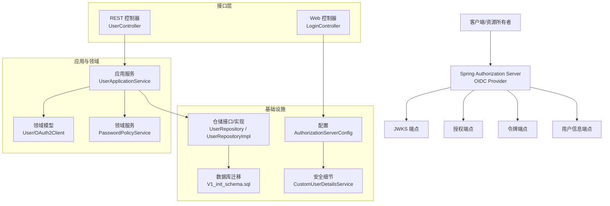
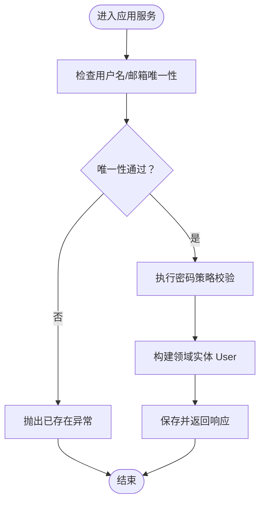
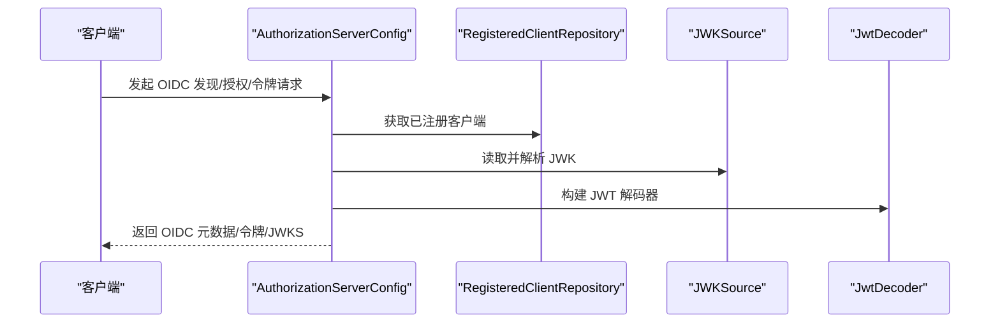
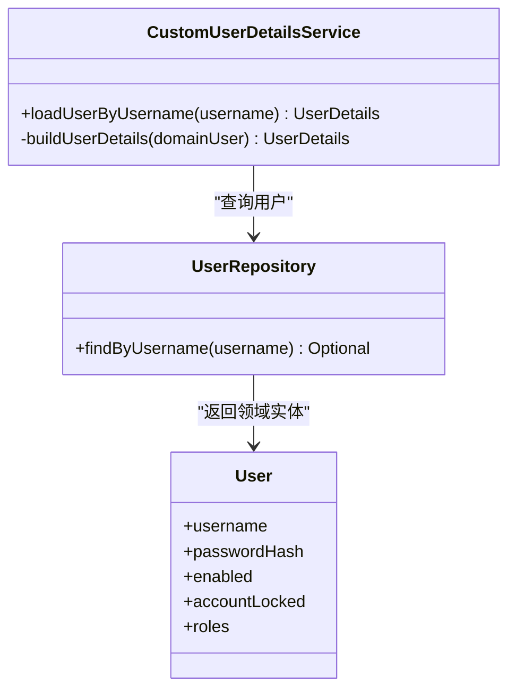
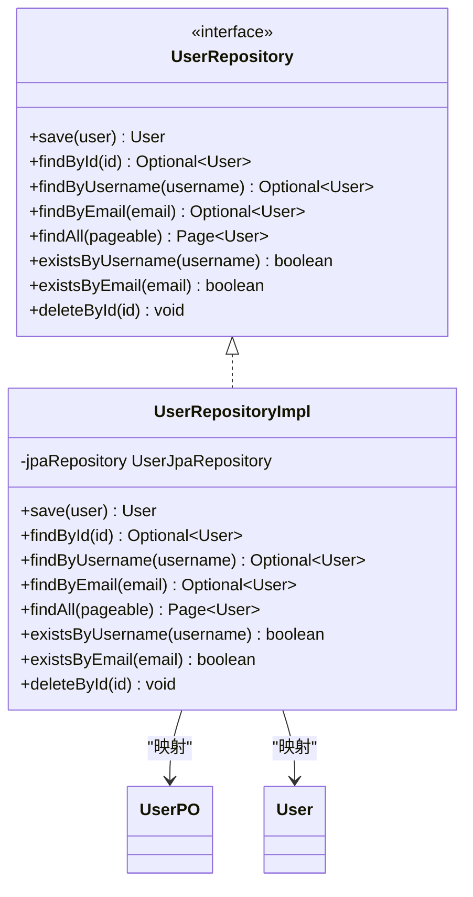
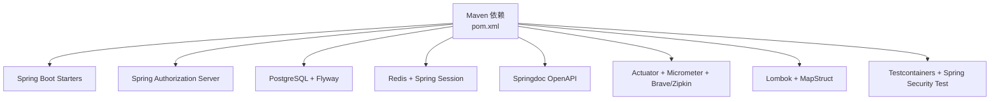

# 项目概述

<cite>
**本文引用的文件**
- [README.md](file://README.md)
- [SsoOidcApplication.java](file://src/main/java/sso/oidc/SsoOidcApplication.java)
- [pom.xml](file://pom.xml)
- [application.yml](file://src/main/resources/application.yml)
- [AuthorizationServerConfig.java](file://src/main/java/sso/oidc/infrastructure/config/AuthorizationServerConfig.java)
- [User.java](file://src/main/java/sso/oidc/domain/model/entity/User.java)
- [OAuth2Client.java](file://src/main/java/sso/oidc/domain/model/entity/OAuth2Client.java)
- [UserController.java](file://src/main/java/sso/oidc/interfaces/rest/UserController.java)
- [UserApplicationService.java](file://src/main/java/sso/oidc/application/service/UserApplicationService.java)
- [UserRepository.java](file://src/main/java/sso/oidc/domain/repository/UserRepository.java)
- [UserRepositoryImpl.java](file://src/main/java/sso/oidc/infrastructure/persistence/impl/UserRepositoryImpl.java)
- [CustomUserDetailsService.java](file://src/main/java/sso/oidc/infrastructure/security/CustomUserDetailsService.java)
- [PasswordPolicyService.java](file://src/main/java/sso/oidc/domain/service/PasswordPolicyService.java)
- [V1__init_schema.sql](file://src/main/resources/db/migration/V1__init_schema.sql)
- [LoginController.java](file://src/main/java/sso/oidc/interfaces/web/LoginController.java)
- [DEPLOYMENT.md](file://DEPLOYMENT.md)
</cite>

## 目录
1. [引言](#引言)
2. [项目结构](#项目结构)
3. [核心组件](#核心组件)
4. [架构总览](#架构总览)
5. [详细组件分析](#详细组件分析)
6. [依赖分析](#依赖分析)
7. [性能考虑](#性能考虑)
8. [故障排查指南](#故障排查指南)
9. [结论](#结论)
10. [附录](#附录)

## 引言
本项目是一个基于 Spring Authorization Server 的 OpenID Connect 1.0 协议的统一身份认证与授权服务（IAM Platform Provider），面向微服务架构提供集中式认证与授权能力。项目以分层架构与领域驱动设计（DDD）为核心理念，将应用层、领域层、基础设施层与接口层清晰分离，既保证了业务语义的内聚性，也便于在多环境（Dev/Test/Canary/Prod）下进行标准化部署与可观测性治理。

项目支持多种 OAuth2/OIDC 授权流程，包括授权码流程（含 PKCE）、客户端凭证流程、刷新令牌、发现端点、JWKS、用户信息端点与令牌撤销等；同时提供用户、角色与 OAuth2 客户端的管理 API，满足企业级 SSO 场景下的典型需求。

## 项目结构
项目采用按“关注点”分层的组织方式，核心目录与职责如下：
- application：应用层，封装用例、DTO、Assembler，协调领域服务完成业务编排
- domain：领域层，包含实体、值对象、枚举、异常与领域服务，承载核心业务规则
- infrastructure：基础设施层，负责配置、持久化实现、安全适配与外部集成
- interfaces：接口层，暴露 REST API 与 Web 页面控制器，统一对外交互入口
- resources：配置、数据库迁移脚本、静态资源与模板页面
- k8s：Kubernetes 多环境部署模板（Base + Overlay）

图表来源
- [AuthorizationServerConfig.java:1-143](file://src/main/java/sso/oidc/infrastructure/config/AuthorizationServerConfig.java#L1-L143)
- [User.java:1-36](file://src/main/java/sso/oidc/domain/model/entity/User.java#L1-L36)
- [OAuth2Client.java:1-69](file://src/main/java/sso/oidc/domain/model/entity/OAuth2Client.java#L1-L69)
- [UserController.java:1-90](file://src/main/java/sso/oidc/interfaces/rest/UserController.java#L1-L90)
- [UserApplicationService.java:1-166](file://src/main/java/sso/oidc/application/service/UserApplicationService.java#L1-L166)
- [UserRepository.java:1-26](file://src/main/java/sso/oidc/domain/repository/UserRepository.java#L1-L26)
- [UserRepositoryImpl.java:1-92](file://src/main/java/sso/oidc/infrastructure/persistence/impl/UserRepositoryImpl.java#L1-L92)
- [V1__init_schema.sql:1-180](file://src/main/resources/db/migration/V1__init_schema.sql#L1-L180)

章节来源
- [README.md:104-139](file://README.md#L104-L139)

## 核心组件
- 应用服务（UserApplicationService）
  - 负责用户生命周期管理、密码变更、角色分配与查询分页等业务编排
  - 通过仓储接口与领域实体交互，确保业务规则在应用层得到执行
- 领域实体与值对象
  - User、OAuth2Client 等承载业务不变量与行为
  - PasswordPolicyService 提供密码强度校验
- 基础设施配置
  - AuthorizationServerConfig：启用 OIDC Provider、配置 JWK、授权设置与过滤链
  - CustomUserDetailsService：将领域用户映射为 Spring Security 的 UserDetails
- 接口层
  - UserController：提供用户管理 REST API
  - LoginController：提供登录页面 Web 控制器
- 数据持久化
  - UserRepository 接口与 UserRepositoryImpl 实现，结合 JPA PO/DO 映射与 Flyway 迁移

章节来源
- [UserApplicationService.java:1-166](file://src/main/java/sso/oidc/application/service/UserApplicationService.java#L1-L166)
- [User.java:1-36](file://src/main/java/sso/oidc/domain/model/entity/User.java#L1-L36)
- [OAuth2Client.java:1-69](file://src/main/java/sso/oidc/domain/model/entity/OAuth2Client.java#L1-L69)
- [AuthorizationServerConfig.java:1-143](file://src/main/java/sso/oidc/infrastructure/config/AuthorizationServerConfig.java#L1-L143)
- [CustomUserDetailsService.java:1-41](file://src/main/java/sso/oidc/infrastructure/security/CustomUserDetailsService.java#L1-L41)
- [UserController.java:1-90](file://src/main/java/sso/oidc/interfaces/rest/UserController.java#L1-L90)
- [LoginController.java:1-14](file://src/main/java/sso/oidc/interfaces/web/LoginController.java#L1-L14)
- [UserRepository.java:1-26](file://src/main/java/sso/oidc/domain/repository/UserRepository.java#L1-L26)
- [UserRepositoryImpl.java:1-92](file://src/main/java/sso/oidc/infrastructure/persistence/impl/UserRepositoryImpl.java#L1-L92)
- [PasswordPolicyService.java:1-36](file://src/main/java/sso/oidc/domain/service/PasswordPolicyService.java#L1-L36)

## 架构总览
系统采用分层架构与 DDD 思想，围绕“应用服务编排、领域模型内聚、基础设施解耦”的原则组织代码。Spring Authorization Server 作为 OIDC Provider，提供授权端点、令牌端点、发现端点、JWKS 等标准能力；应用层通过仓储接口与领域模型协作，完成用户与客户端的管理；接口层统一暴露 REST 与 Web 控制器；基础设施层负责配置、安全与持久化。

图表来源
- [AuthorizationServerConfig.java:1-143](file://src/main/java/sso/oidc/infrastructure/config/AuthorizationServerConfig.java#L1-L143)
- [UserApplicationService.java:1-166](file://src/main/java/sso/oidc/application/service/UserApplicationService.java#L1-L166)
- [UserRepositoryImpl.java:1-92](file://src/main/java/sso/oidc/infrastructure/persistence/impl/UserRepositoryImpl.java#L1-L92)
- [V1__init_schema.sql:1-180](file://src/main/resources/db/migration/V1__init_schema.sql#L1-L180)

## 详细组件分析

### 应用服务与用户管理
- 用户创建：校验唯一性、执行密码策略、分配默认角色、持久化并返回响应
- 用户更新：按字段条件更新、邮箱唯一性校验
- 密码变更：旧密码匹配校验、新密码策略校验
- 角色分配/移除：基于角色编码进行增删
- 分页查询：基于 Spring Data Pageable 的分页返回

图表来源
- [UserApplicationService.java:37-64](file://src/main/java/sso/oidc/application/service/UserApplicationService.java#L37-L64)

章节来源
- [UserApplicationService.java:1-166](file://src/main/java/sso/oidc/application/service/UserApplicationService.java#L1-L166)
- [UserController.java:1-90](file://src/main/java/sso/oidc/interfaces/rest/UserController.java#L1-L90)
- [PasswordPolicyService.java:1-36](file://src/main/java/sso/oidc/domain/service/PasswordPolicyService.java#L1-L36)

### OIDC Provider 配置与安全细节
- 启用 OIDC 默认安全：登录入口、资源服务器 JWT 校验
- 注册客户端：内存中注册演示客户端，支持授权码、刷新令牌与客户端凭证
- JWK 源：加载 PEM 私钥/公钥，生成 RSA JWK 并暴露 JWKS 端点
- 授权服务器设置：基于配置的 issuer URI

图表来源
- [AuthorizationServerConfig.java:49-123](file://src/main/java/sso/oidc/infrastructure/config/AuthorizationServerConfig.java#L49-L123)

章节来源
- [AuthorizationServerConfig.java:1-143](file://src/main/java/sso/oidc/infrastructure/config/AuthorizationServerConfig.java#L1-L143)

### 用户详情服务与鉴权映射
- 将领域用户映射为 Spring Security 的 UserDetails
- 角色集合映射为 GrantedAuthority，支持 RBAC 授权

图表来源
- [CustomUserDetailsService.java:15-40](file://src/main/java/sso/oidc/infrastructure/security/CustomUserDetailsService.java#L15-L40)
- [UserRepository.java:1-26](file://src/main/java/sso/oidc/domain/repository/UserRepository.java#L1-L26)
- [User.java:1-36](file://src/main/java/sso/oidc/domain/model/entity/User.java#L1-L36)

章节来源
- [CustomUserDetailsService.java:1-41](file://src/main/java/sso/oidc/infrastructure/security/CustomUserDetailsService.java#L1-L41)
- [UserRepository.java:1-26](file://src/main/java/sso/oidc/domain/repository/UserRepository.java#L1-L26)
- [User.java:1-36](file://src/main/java/sso/oidc/domain/model/entity/User.java#L1-L36)

### 数据持久化与仓储模式
- UserRepository 接口定义标准 CRUD 与查询方法
- UserRepositoryImpl 实现将领域实体与 JPA PO 进行双向映射
- Flyway 迁移脚本初始化核心表结构与索引

图表来源
- [UserRepository.java:1-26](file://src/main/java/sso/oidc/domain/repository/UserRepository.java#L1-L26)
- [UserRepositoryImpl.java:14-91](file://src/main/java/sso/oidc/infrastructure/persistence/impl/UserRepositoryImpl.java#L14-L91)
- [V1__init_schema.sql:19-179](file://src/main/resources/db/migration/V1__init_schema.sql#L19-L179)

章节来源
- [UserRepository.java:1-26](file://src/main/java/sso/oidc/domain/repository/UserRepository.java#L1-L26)
- [UserRepositoryImpl.java:1-92](file://src/main/java/sso/oidc/infrastructure/persistence/impl/UserRepositoryImpl.java#L1-L92)
- [V1__init_schema.sql:1-180](file://src/main/resources/db/migration/V1__init_schema.sql#L1-L180)

### OAuth2 客户端与授权模型
- OAuth2Client 领域实体承载客户端标识、授权类型、重定向地址、作用域、PKCE 与同意策略等
- AuthorizationServerConfig 注册演示客户端，支持授权码、刷新令牌与客户端凭证
- Spring Authorization Server 存储授权状态、令牌与授权同意信息

章节来源
- [OAuth2Client.java:1-69](file://src/main/java/sso/oidc/domain/model/entity/OAuth2Client.java#L1-L69)
- [AuthorizationServerConfig.java:68-91](file://src/main/java/sso/oidc/infrastructure/config/AuthorizationServerConfig.java#L68-L91)
- [V1__init_schema.sql:120-179](file://src/main/resources/db/migration/V1__init_schema.sql#L120-L179)

## 依赖分析
- 技术栈概览
  - Java 21、Spring Boot 3.2.5、Spring Authorization Server 1.2.5、PostgreSQL、Redis、Flyway、MapStruct、Lombok、Thymeleaf、Springdoc、Testcontainers
- 关键依赖关系
  - Web、Security、Data JPA、Data Redis、Actuator、Prometheus、Tracing、OAuth2 Authorization Server
  - 构建与编译：Lombok、MapStruct Processor、Maven Compiler Plugin
  - 测试：Spring Boot Starter Test、Security Test、Testcontainers

图表来源
- [pom.xml:29-140](file://pom.xml#L29-L140)

章节来源
- [pom.xml:1-225](file://pom.xml#L1-L225)
- [README.md:5-22](file://README.md#L5-L22)

## 性能考虑
- 连接池与会话
  - HikariCP 最大连接数、空闲超时与最大生存时间配置
  - Redis 作为分布式会话存储，提升横向扩展能力
- 数据访问
  - JPA 分页查询、索引优化（用户名、邮箱、令牌索引）
- 观测性
  - Actuator、Prometheus 指标、Zipkin 链路追踪，便于定位性能瓶颈
- 部署弹性
  - Kubernetes HPA、多环境隔离与灰度发布策略，降低变更风险

章节来源
- [application.yml:9-46](file://src/main/resources/application.yml#L9-L46)
- [V1__init_schema.sql:53-165](file://src/main/resources/db/migration/V1__init_schema.sql#L53-L165)
- [pom.xml:87-103](file://pom.xml#L87-L103)
- [DEPLOYMENT.md:169-183](file://DEPLOYMENT.md#L169-L183)

## 故障排查指南
- OIDC 端点可用性
  - 通过 Actuator 健康检查与 OIDC 发现端点验证服务状态
- 登录与授权
  - 登录页面由 Web 控制器提供，若未生效检查安全过滤链与登录入口配置
- 数据库与迁移
  - Flyway 启用并指定迁移路径，确认迁移脚本执行结果
- 密钥与签名
  - JWK 私钥/公钥位置与格式正确性，确保 JWKS 可用
- 日志与追踪
  - 启用 Zipkin 端点，结合日志定位问题根因

章节来源
- [DEPLOYMENT.md:33-52](file://DEPLOYMENT.md#L33-L52)
- [LoginController.java:1-14](file://src/main/java/sso/oidc/interfaces/web/LoginController.java#L1-L14)
- [application.yml:32-35](file://src/main/resources/application.yml#L32-L35)
- [AuthorizationServerConfig.java:94-116](file://src/main/java/sso/oidc/infrastructure/config/AuthorizationServerConfig.java#L94-L116)
- [V1__init_schema.sql:1-180](file://src/main/resources/db/migration/V1__init_schema.sql#L1-L180)

## 结论
本项目以清晰的分层架构与 DDD 设计，实现了 OpenID Connect 1.0 的核心能力与企业级用户/客户端管理 API。通过 Spring Authorization Server 提供标准化的 OIDC Provider 能力，结合 Redis 与 PostgreSQL 的基础设施，满足微服务架构下的统一认证与授权需求。配合完善的多环境部署与可观测性配置，具备良好的可维护性与可扩展性。

## 附录
- 快速开始与部署
  - 本地运行、Docker 构建与 Kubernetes 部署流程详见部署文档
- OIDC 端点清单
  - 发现、授权、令牌、用户信息、JWKS、令牌撤销与内省等端点
- 多环境配置
  - Dev/Test/Canary/Prod 四环境 Profile 与 Kustomize Overlay 配置

章节来源
- [README.md:48-103](file://README.md#L48-L103)
- [DEPLOYMENT.md:1-200](file://DEPLOYMENT.md#L1-L200)