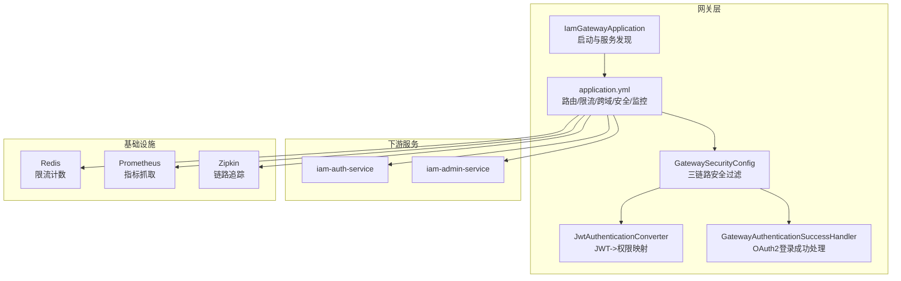
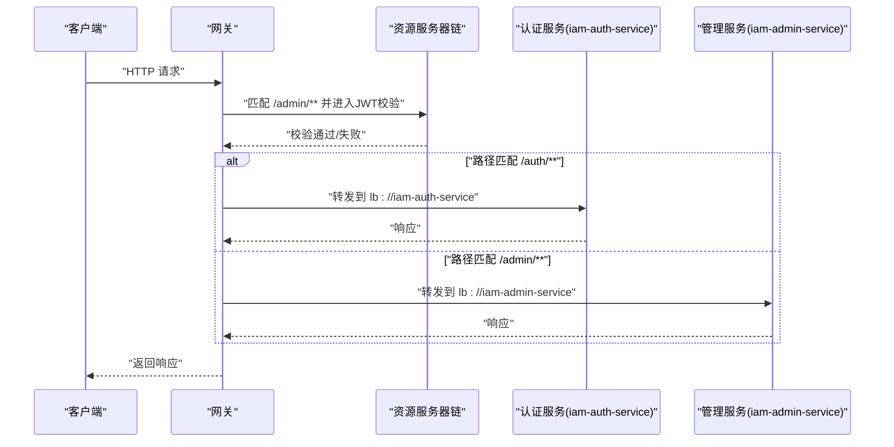
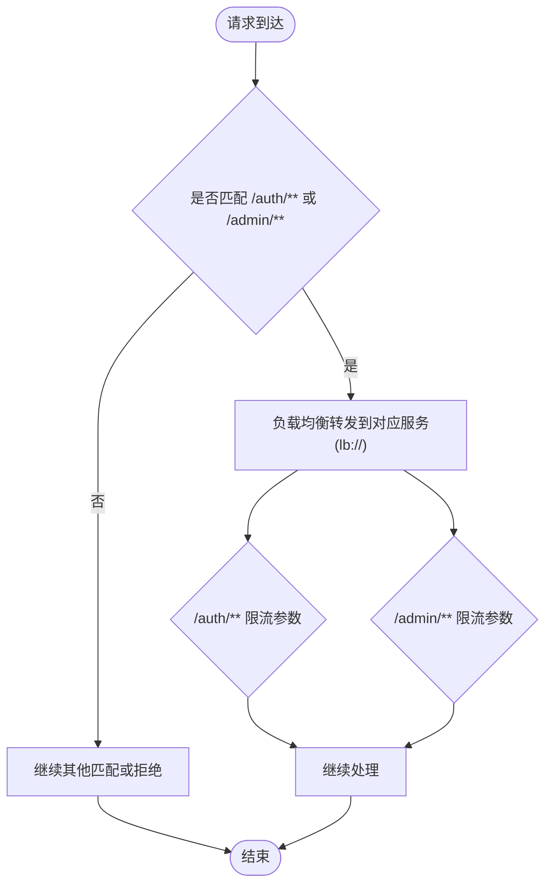
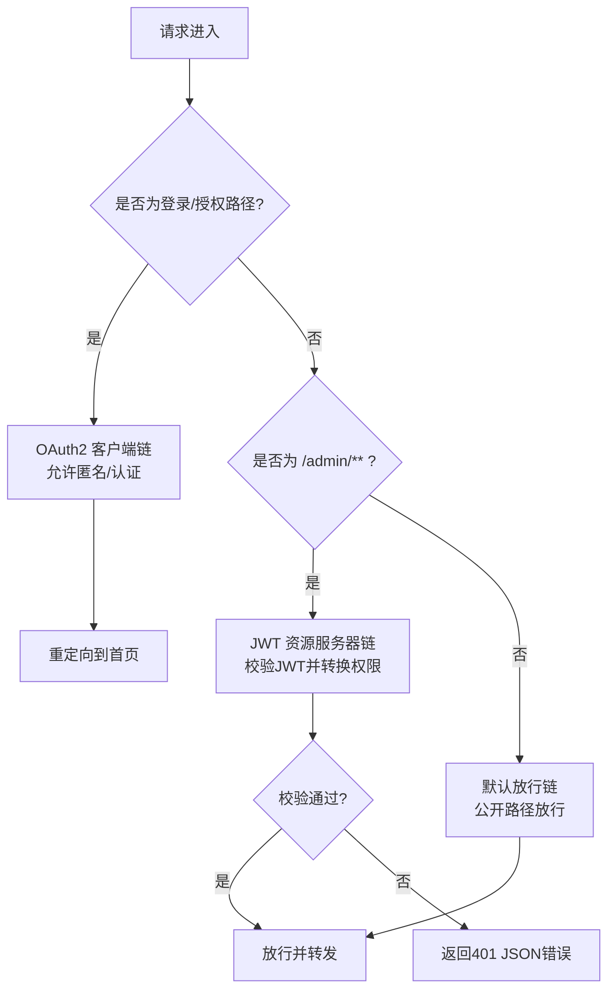
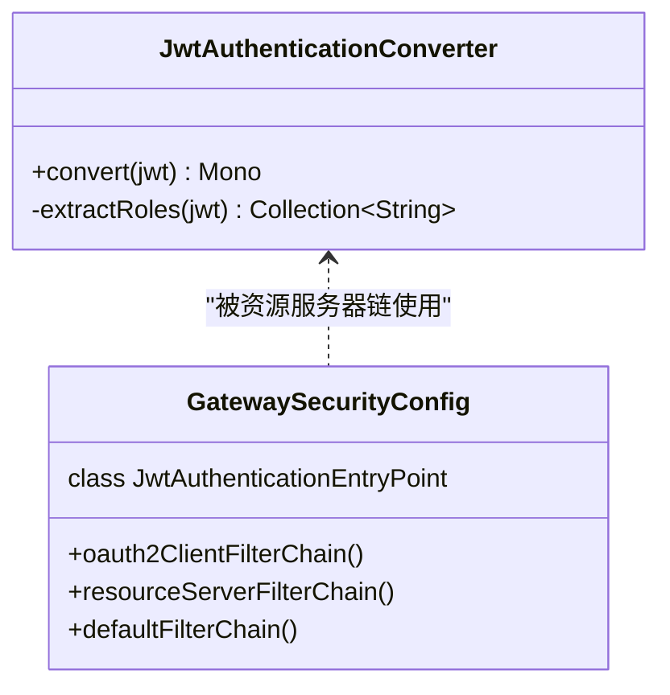
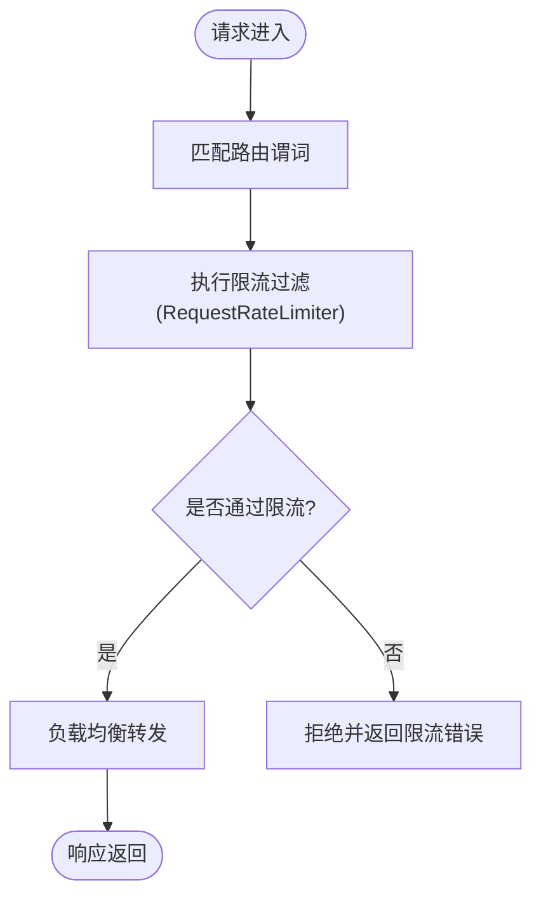
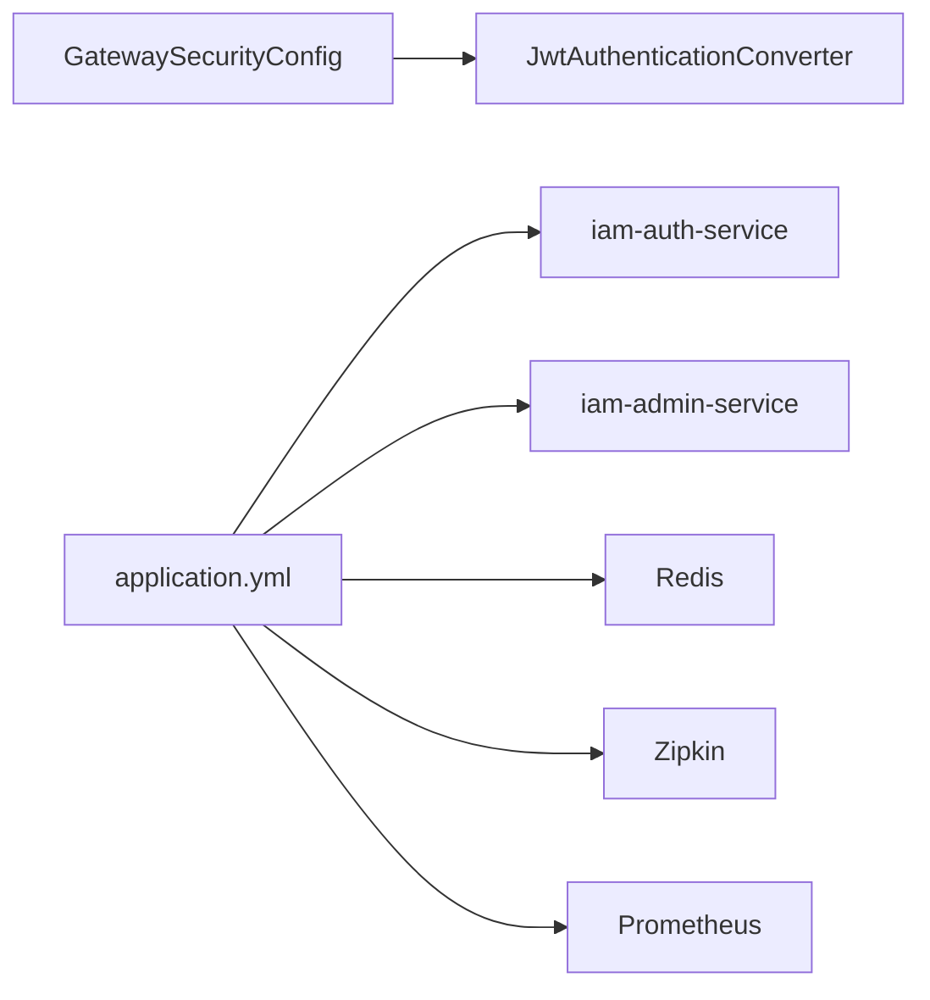

# API网关 (iam-gateway)

<cite>
**本文引用的文件**
- [IamGatewayApplication.java](file://iam-gateway/src/main/java/iam/platform/gateway/IamGatewayApplication.java)
- [application.yml](file://iam-gateway/src/main/resources/application.yml)
- [application-dev.yml](file://iam-gateway/src/main/resources/application-dev.yml)
- [GatewaySecurityConfig.java](file://iam-gateway/src/main/java/iam/platform/gateway/infrastructure/security/GatewaySecurityConfig.java)
- [JwtAuthenticationConverter.java](file://iam-gateway/src/main/java/iam/platform/gateway/infrastructure/security/JwtAuthenticationConverter.java)
- [GatewayAuthenticationSuccessHandler.java](file://iam-gateway/src/main/java/iam/platform/gateway/infrastructure/security/GatewayAuthenticationSuccessHandler.java)
- [prometheus.yml](file://prometheus/prometheus.yml)
- [FeignClientConfig.java](file://iam-auth-server/src/main/java/iam/platform/auth/infrastructure/config/FeignClientConfig.java)
- [RedisBasedRateLimiter.java](file://iam-auth-server/src/main/java/iam/platform/auth/infrastructure/security/RedisBasedRateLimiter.java)
</cite>

## 目录
1. [简介](#简介)
2. [项目结构](#项目结构)
3. [核心组件](#核心组件)
4. [架构总览](#架构总览)
5. [详细组件分析](#详细组件分析)
6. [依赖分析](#依赖分析)
7. [性能考虑](#性能考虑)
8. [故障排查指南](#故障排查指南)
9. [结论](#结论)
10. [附录](#附录)

## 简介
本文件为 iam-gateway 模块的技术文档，系统性阐述该API网关在微服务架构中的定位与职责：作为统一入口承接外部请求、进行路由分发、安全鉴权与限流控制，并与下游服务（认证服务、管理服务）协同工作。文档覆盖启动配置、路由策略、安全体系（OAuth2/OIDC登录、JWT资源服务器）、限流与性能优化、与下游通信机制、日志与监控集成等主题。

## 项目结构
iam-gateway 采用 Spring Boot + Spring Cloud Gateway 的响应式网关架构，核心由以下部分组成：
- 应用入口：负责启用服务发现并启动网关服务
- 路由与过滤：基于 YAML 的静态路由配置，结合内置过滤器（如限流）
- 安全配置：三段式安全过滤链（OAuth2客户端链、JWT资源服务器链、默认放行链）
- 安全转换器：将 JWT 中的角色/权限映射为 Spring Security 的认证主体
- 监控与日志：Actuator 暴露指标、Zipkin 链路追踪、Prometheus 抓取

图表来源
- [IamGatewayApplication.java:1-15](file://iam-gateway/src/main/java/iam/platform/gateway/IamGatewayApplication.java#L1-L15)
- [application.yml:1-116](file://iam-gateway/src/main/resources/application.yml#L1-L116)
- [GatewaySecurityConfig.java:1-131](file://iam-gateway/src/main/java/iam/platform/gateway/infrastructure/security/GatewaySecurityConfig.java#L1-L131)
- [JwtAuthenticationConverter.java:1-49](file://iam-gateway/src/main/java/iam/platform/gateway/infrastructure/security/JwtAuthenticationConverter.java#L1-L49)
- [GatewayAuthenticationSuccessHandler.java:1-37](file://iam-gateway/src/main/java/iam/platform/gateway/infrastructure/security/GatewayAuthenticationSuccessHandler.java#L1-L37)

章节来源
- [IamGatewayApplication.java:1-15](file://iam-gateway/src/main/java/iam/platform/gateway/IamGatewayApplication.java#L1-L15)
- [application.yml:1-116](file://iam-gateway/src/main/resources/application.yml#L1-L116)

## 核心组件
- 启动类与服务发现
  - 启用 Spring Cloud Discovery 客户端，接入服务注册中心以实现服务发现与负载均衡
- 路由与过滤
  - 手动配置路由规则，基于路径与主机头匹配；对特定路径启用请求限流过滤
  - 使用负载均衡 URI（lb://）与服务名联动
- 安全体系
  - 三段式安全过滤链：OAuth2 客户端链（浏览器登录）、JWT 资源服务器链（受保护资源）、默认放行链（公开资源）
  - 自定义 JWT 认证转换器，将角色/权限注入到认证主体
  - 自定义 OAuth2 登录成功处理器，完成登录后的重定向
- 监控与日志
  - 暴露 Actuator 指标端点，集成 Zipkin 与 Prometheus
  - 开启调试级别日志以便问题定位

章节来源
- [IamGatewayApplication.java:1-15](file://iam-gateway/src/main/java/iam/platform/gateway/IamGatewayApplication.java#L1-L15)
- [application.yml:14-68](file://iam-gateway/src/main/resources/application.yml#L14-L68)
- [GatewaySecurityConfig.java:28-73](file://iam-gateway/src/main/java/iam/platform/gateway/infrastructure/security/GatewaySecurityConfig.java#L28-L73)
- [JwtAuthenticationConverter.java:18-30](file://iam-gateway/src/main/java/iam/platform/gateway/infrastructure/security/JwtAuthenticationConverter.java#L18-L30)
- [GatewayAuthenticationSuccessHandler.java:17-35](file://iam-gateway/src/main/java/iam/platform/gateway/infrastructure/security/GatewayAuthenticationSuccessHandler.java#L17-L35)

## 架构总览
下图展示从客户端到网关再到下游服务的整体调用链，以及安全与限流的关键节点：

图表来源
- [application.yml:18-53](file://iam-gateway/src/main/resources/application.yml#L18-L53)
- [GatewaySecurityConfig.java:47-58](file://iam-gateway/src/main/java/iam/platform/gateway/infrastructure/security/GatewaySecurityConfig.java#L47-L58)

## 详细组件分析

### 启动与服务发现
- 启动类启用 Discovery 客户端，使网关具备服务发现能力
- 网关通过 lb:// 协议与服务名交互，实现基于注册中心的负载均衡

章节来源
- [IamGatewayApplication.java:7-8](file://iam-gateway/src/main/java/iam/platform/gateway/IamGatewayApplication.java#L7-L8)
- [application.yml:21-23](file://iam-gateway/src/main/resources/application.yml#L21-L23)
- [application.yml:33-35](file://iam-gateway/src/main/resources/application.yml#L33-L35)

### 路由策略与负载均衡
- 路由规则
  - 认证服务：路径前缀 /auth/** 与主机头 auth.iam.local
  - 管理服务：路径前缀 /admin/** 与主机头 admin.iam.local
- 负载均衡
  - 使用 lb:// 服务名进行转发，结合注册中心实现多实例负载均衡
- 限流策略
  - 对 /auth/** 与 /admin/** 分别配置 RequestRateLimiter 过滤器，参数包含补充速率、桶容量与请求令牌数

图表来源
- [application.yml:18-53](file://iam-gateway/src/main/resources/application.yml#L18-L53)

章节来源
- [application.yml:18-53](file://iam-gateway/src/main/resources/application.yml#L18-L53)

### 安全配置与认证链路
- OAuth2 客户端链（优先级1）
  - 匹配登录相关路径，允许匿名访问登录页面，其余需认证
  - 登录成功后由处理器重定向到首页
- JWT 资源服务器链（优先级2）
  - 匹配 /admin/**，要求携带有效 JWT
  - 使用自定义转换器将 JWT 角色/权限映射为认证主体
  - 认证失败时返回 JSON 错误响应
- 默认放行链（优先级3）
  - 放行公开路径（如 /auth/**、静态资源、/.well-known/** 等）

图表来源
- [GatewaySecurityConfig.java:28-73](file://iam-gateway/src/main/java/iam/platform/gateway/infrastructure/security/GatewaySecurityConfig.java#L28-L73)
- [JwtAuthenticationConverter.java:18-30](file://iam-gateway/src/main/java/iam/platform/gateway/infrastructure/security/JwtAuthenticationConverter.java#L18-L30)

章节来源
- [GatewaySecurityConfig.java:28-73](file://iam-gateway/src/main/java/iam/platform/gateway/infrastructure/security/GatewaySecurityConfig.java#L28-L73)
- [GatewayAuthenticationSuccessHandler.java:17-35](file://iam-gateway/src/main/java/iam/platform/gateway/infrastructure/security/GatewayAuthenticationSuccessHandler.java#L17-L35)
- [JwtAuthenticationConverter.java:18-30](file://iam-gateway/src/main/java/iam/platform/gateway/infrastructure/security/JwtAuthenticationConverter.java#L18-L30)

### 权限验证机制
- JWT 权限提取
  - 从 JWT 的 realm_access.claims.roles 或自定义 roles 声明中提取角色集合
  - 将角色映射为 GrantedAuthority，注入到 JwtAuthenticationToken
- 异常分类与错误响应
  - 对认证异常进行分类（过期、签名无效、发行者不匹配、缺少令牌等）
  - 返回结构化的 JSON 错误体，包含错误类型、描述与请求路径

图表来源
- [JwtAuthenticationConverter.java:18-47](file://iam-gateway/src/main/java/iam/platform/gateway/infrastructure/security/JwtAuthenticationConverter.java#L18-L47)
- [GatewaySecurityConfig.java:47-58](file://iam-gateway/src/main/java/iam/platform/gateway/infrastructure/security/GatewaySecurityConfig.java#L47-L58)

章节来源
- [JwtAuthenticationConverter.java:18-47](file://iam-gateway/src/main/java/iam/platform/gateway/infrastructure/security/JwtAuthenticationConverter.java#L18-L47)
- [GatewaySecurityConfig.java:78-129](file://iam-gateway/src/main/java/iam/platform/gateway/infrastructure/security/GatewaySecurityConfig.java#L78-L129)

### 与下游服务的通信机制
- 服务发现与负载均衡
  - 通过 lb:// 与服务名交互，结合注册中心实现多实例轮询
- 超时与可靠性
  - 下游服务侧（认证服务）提供 Feign 客户端超时配置，保障上游转发稳定性
- 健康检查与监控
  - Actuator 暴露健康、指标、网关路由等端点，便于健康检查与运行状态观测

章节来源
- [application.yml:21-23](file://iam-gateway/src/main/resources/application.yml#L21-L23)
- [application.yml:33-35](file://iam-gateway/src/main/resources/application.yml#L33-L35)
- [FeignClientConfig.java:15-18](file://iam-auth-server/src/main/java/iam/platform/auth/infrastructure/config/FeignClientConfig.java#L15-L18)
- [application.yml:96-99](file://iam-gateway/src/main/resources/application.yml#L96-L99)

### 性能优化措施
- 请求转发
  - 基于 lb:// 的负载均衡转发，减少单点压力
- 响应缓存
  - 当前配置未显式开启网关侧缓存；建议在下游服务侧或 CDN 层实现静态资源缓存
- 限流控制
  - 在 /auth/** 与 /admin/** 路径上启用 RequestRateLimiter 过滤器，分别设置补充速率、桶容量与请求令牌数
  - 下游服务侧也提供基于 Redis 的滑动窗口限流实现，用于认证尝试的精细化防护

图表来源
- [application.yml:24-29](file://iam-gateway/src/main/resources/application.yml#L24-L29)
- [application.yml:36-41](file://iam-gateway/src/main/resources/application.yml#L36-L41)
- [RedisBasedRateLimiter.java:32-67](file://iam-auth-server/src/main/java/iam/platform/auth/infrastructure/security/RedisBasedRateLimiter.java#L32-L67)

章节来源
- [application.yml:24-41](file://iam-gateway/src/main/resources/application.yml#L24-L41)
- [RedisBasedRateLimiter.java:32-67](file://iam-auth-server/src/main/java/iam/platform/auth/infrastructure/security/RedisBasedRateLimiter.java#L32-L67)

### 日志记录与监控
- 日志级别
  - 提供开发环境下的更详细日志级别，便于问题定位
- 监控暴露
  - 暴露 health、info、metrics、gateway、prometheus 等端点
  - 通过 Prometheus 抓取 iam-gateway 的指标数据
- 链路追踪
  - 集成 Zipkin，采样概率设为 1.0，便于全链路追踪

章节来源
- [application.yml:110-116](file://iam-gateway/src/main/resources/application.yml#L110-L116)
- [application.yml:96-108](file://iam-gateway/src/main/resources/application.yml#L96-L108)
- [prometheus.yml:12-15](file://prometheus/prometheus.yml#L12-L15)

## 依赖分析
- 组件耦合
  - 网关安全链路与 JWT 转换器存在直接依赖关系
  - 路由配置与下游服务（认证/管理）存在运行时耦合
- 外部依赖
  - Redis：用于限流计数
  - 注册中心：用于服务发现与负载均衡
  - Zipkin/Prometheus：用于链路追踪与指标采集

图表来源
- [GatewaySecurityConfig.java:47-58](file://iam-gateway/src/main/java/iam/platform/gateway/infrastructure/security/GatewaySecurityConfig.java#L47-L58)
- [JwtAuthenticationConverter.java:18-30](file://iam-gateway/src/main/java/iam/platform/gateway/infrastructure/security/JwtAuthenticationConverter.java#L18-L30)
- [application.yml:18-53](file://iam-gateway/src/main/resources/application.yml#L18-L53)
- [prometheus.yml:12-15](file://prometheus/prometheus.yml#L12-L15)

章节来源
- [application.yml:18-53](file://iam-gateway/src/main/resources/application.yml#L18-L53)
- [prometheus.yml:12-15](file://prometheus/prometheus.yml#L12-L15)

## 性能考虑
- 路由与转发
  - 使用 lb:// 实现就近与多实例负载均衡，降低单点瓶颈
- 限流策略
  - 网关侧与下游侧双重限流，避免突发流量冲击
- 超时与降级
  - 下游服务侧已配置合理的连接与读取超时，提升整体稳定性
- 缓存与CDN
  - 建议在静态资源与下游接口层面引入缓存与 CDN，进一步降低延迟

## 故障排查指南
- 认证失败
  - 检查 JWT 发行方与密钥配置是否一致
  - 查看资源服务器链返回的 JSON 错误体，识别具体错误类型（过期、签名无效、缺少令牌等）
- 路由不生效
  - 确认请求路径与主机头是否满足路由谓词
  - 检查服务名与 lb:// URI 是否正确
- 限流异常
  - 核对 RequestRateLimiter 参数与 Redis 连接配置
  - 关注下游服务侧限流实现的键空间与窗口设置
- 监控与日志
  - 开启调试日志级别，查看网关与安全链路的详细输出
  - 通过 Prometheus 抓取指标，结合 Zipkin 进行链路追踪

章节来源
- [GatewaySecurityConfig.java:78-129](file://iam-gateway/src/main/java/iam/platform/gateway/infrastructure/security/GatewaySecurityConfig.java#L78-L129)
- [application.yml:18-53](file://iam-gateway/src/main/resources/application.yml#L18-L53)
- [RedisBasedRateLimiter.java:32-67](file://iam-auth-server/src/main/java/iam/platform/auth/infrastructure/security/RedisBasedRateLimiter.java#L32-L67)

## 结论
iam-gateway 通过明确的路由策略、三段式安全过滤链与限流控制，构建了统一的微服务入口。结合服务发现、负载均衡与下游服务侧的限流与超时配置，形成了较为完善的性能与可靠性保障。配合 Actuator、Prometheus 与 Zipkin 的监控体系，能够有效支撑生产环境的运维与问题定位。

## 附录
- 环境变量与配置要点
  - SSL 开关与证书路径
  - Redis 主机、端口与密码
  - OAuth2 客户端与提供商配置
  - Zipkin 与 Prometheus 地址
- 开发与生产差异
  - application-dev.yml 提供更详细的日志级别
  - 生产环境建议关闭调试日志，合理设置采样率与限流参数

章节来源
- [application.yml:3-8](file://iam-gateway/src/main/resources/application.yml#L3-L8)
- [application.yml:84-88](file://iam-gateway/src/main/resources/application.yml#L84-L88)
- [application.yml:70-83](file://iam-gateway/src/main/resources/application.yml#L70-L83)
- [application.yml:103-108](file://iam-gateway/src/main/resources/application.yml#L103-L108)
- [application-dev.yml:1-6](file://iam-gateway/src/main/resources/application-dev.yml#L1-L6)