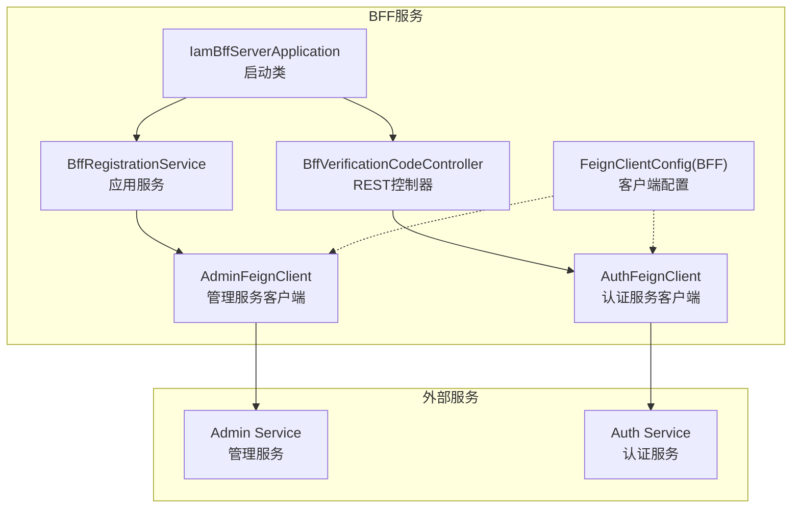
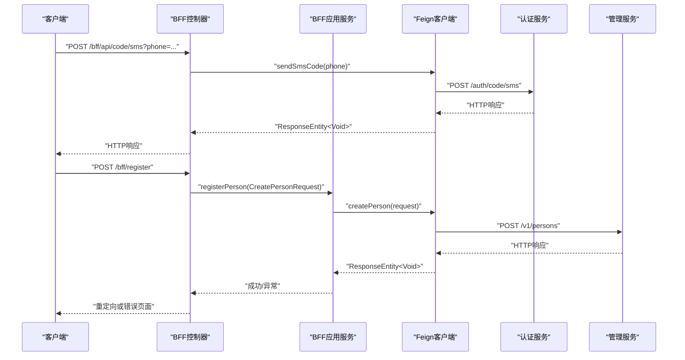
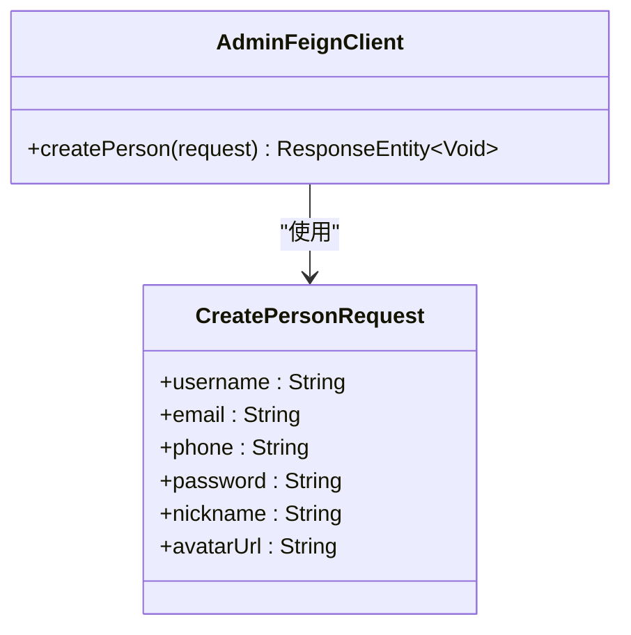
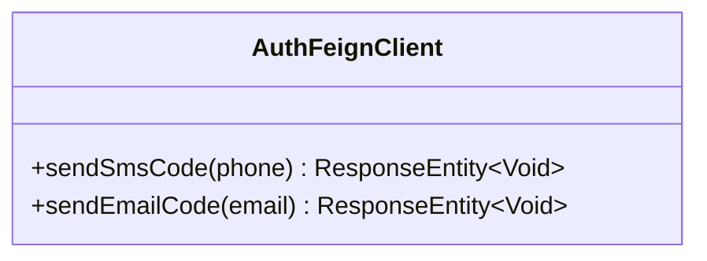
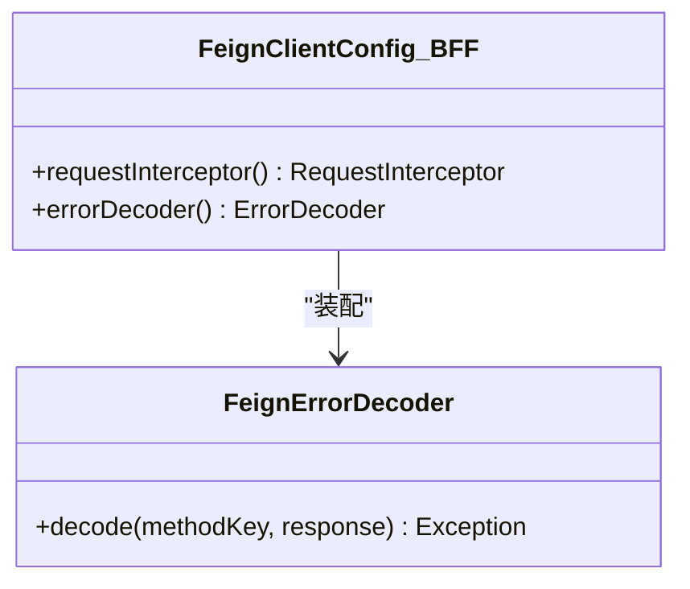
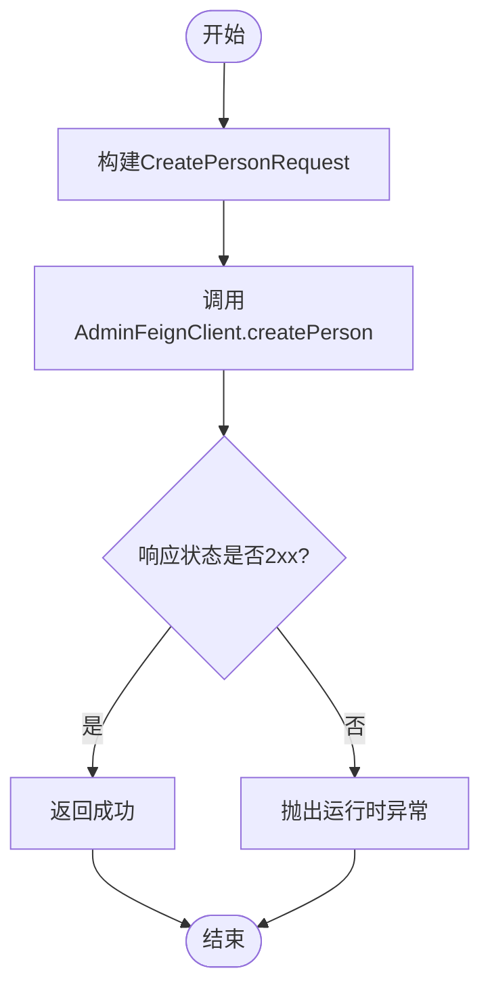
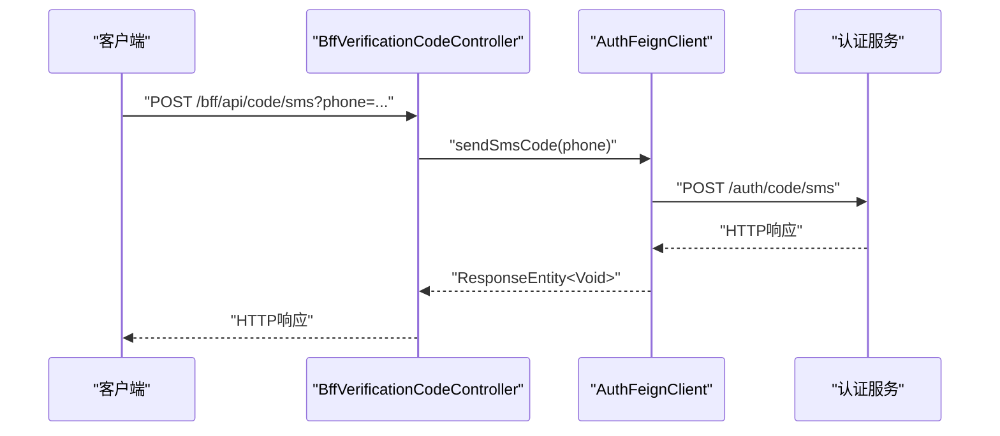
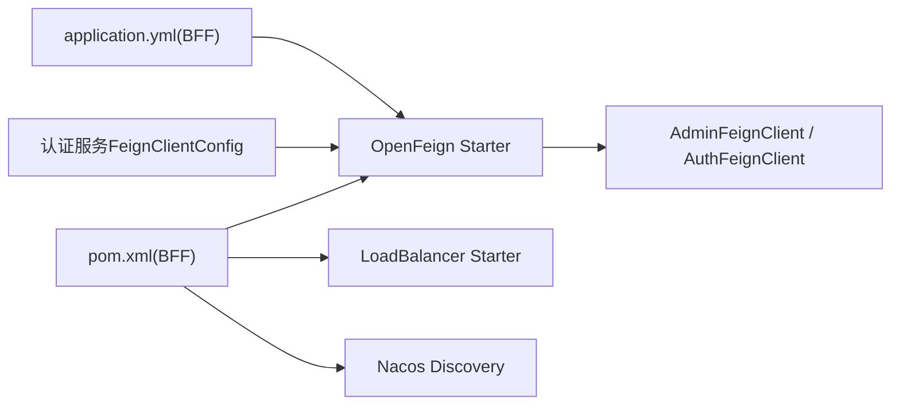

# Feign客户端通信

<cite>
**本文引用的文件**
- [AdminFeignClient.java](file://iam-bff-server/src/main/java/iam/platform/bff/infrastructure/client/AdminFeignClient.java)
- [AuthFeignClient.java](file://iam-bff-server/src/main/java/iam/platform/bff/infrastructure/client/AuthFeignClient.java)
- [FeignClientConfig.java（BFF）](file://iam-bff-server/src/main/java/iam/platform/bff/infrastructure/config/FeignClientConfig.java)
- [FeignClientConfig.java（认证服务）](file://iam-auth-server/src/main/java/iam/platform/auth/infrastructure/config/FeignClientConfig.java)
- [BffRegistrationService.java](file://iam-bff-server/src/main/java/iam/platform/bff/application/service/BffRegistrationService.java)
- [BffVerificationCodeController.java](file://iam-bff-server/src/main/java/iam/platform/bff/interfaces/rest/BffVerificationCodeController.java)
- [IamBffServerApplication.java](file://iam-bff-server/src/main/java/iam/platform/bff/IamBffServerApplication.java)
- [application.yml（BFF）](file://iam-bff-server/src/main/resources/application.yml)
- [bootstrap.yml（BFF）](file://iam-bff-server/bootstrap.yml)
- [pom.xml（BFF）](file://iam-bff-server/pom.xml)
- [CreatePersonRequest.java](file://iam-common/src/main/java/iam/platform/common/dto/request/CreatePersonRequest.java)
</cite>

## 目录
1. [引言](#引言)
2. [项目结构](#项目结构)
3. [核心组件](#核心组件)
4. [架构总览](#架构总览)
5. [详细组件分析](#详细组件分析)
6. [依赖分析](#依赖分析)
7. [性能考虑](#性能考虑)
8. [故障排查指南](#故障排查指南)
9. [结论](#结论)
10. [附录](#附录)

## 引言
本文件聚焦于BFF（Backend For Frontend）中的Feign客户端通信模块，系统性解析AdminFeignClient与AuthFeignClient的接口定义、方法实现与调用链路；详解Feign客户端的配置与使用方式，包括负载均衡、超时控制、错误处理与拦截器；说明BFF如何通过Feign与认证服务器（Auth Service）和管理服务器（Admin Service）进行通信；解释参数传递、响应处理与异常管理；介绍拦截器与自定义配置，并给出最佳实践与性能优化建议。

## 项目结构
BFF服务中与Feign客户端通信直接相关的模块与文件如下：
- 客户端接口：AdminFeignClient、AuthFeignClient
- 客户端配置：FeignClientConfig（BFF侧）
- 应用层服务：BffRegistrationService（注册流程）
- 控制器：BffVerificationCodeController（验证码发送）
- 启动类：IamBffServerApplication（启用Feign与服务发现）
- 配置文件：application.yml（BFF）、bootstrap.yml（BFF Nacos发现）
- 依赖声明：pom.xml（BFF）

图表来源
- [IamBffServerApplication.java:1-16](file://iam-bff-server/src/main/java/iam/platform/bff/IamBffServerApplication.java#L1-L16)
- [BffRegistrationService.java:1-31](file://iam-bff-server/src/main/java/iam/platform/bff/application/service/BffRegistrationService.java#L1-L31)
- [BffVerificationCodeController.java:1-39](file://iam-bff-server/src/main/java/iam/platform/bff/interfaces/rest/BffVerificationCodeController.java#L1-L39)
- [AdminFeignClient.java:1-26](file://iam-bff-server/src/main/java/iam/platform/bff/infrastructure/client/AdminFeignClient.java#L1-L26)
- [AuthFeignClient.java:1-31](file://iam-bff-server/src/main/java/iam/platform/bff/infrastructure/client/AuthFeignClient.java#L1-L31)
- [FeignClientConfig.java（BFF）:1-52](file://iam-bff-server/src/main/java/iam/platform/bff/infrastructure/config/FeignClientConfig.java#L1-L52)

章节来源
- [IamBffServerApplication.java:1-16](file://iam-bff-server/src/main/java/iam/platform/bff/IamBffServerApplication.java#L1-L16)
- [application.yml（BFF）:1-54](file://iam-bff-server/src/main/resources/application.yml#L1-L54)
- [bootstrap.yml（BFF）:1-10](file://iam-bff-server/bootstrap.yml#L1-L10)
- [pom.xml（BFF）:1-107](file://iam-bff-server/pom.xml#L1-L107)

## 核心组件
- AdminFeignClient：面向管理服务的Feign客户端，用于在用户自助注册时创建人员信息。
- AuthFeignClient：面向认证服务的Feign客户端，提供短信与邮箱验证码发送能力。
- FeignClientConfig（BFF）：统一注入请求拦截器与错误解码器，设置通用请求头与错误分类处理。
- BffRegistrationService：封装注册流程，调用AdminFeignClient完成人员创建并校验响应状态。
- BffVerificationCodeController：对外暴露REST接口，转发验证码发送请求至AuthFeignClient。

章节来源
- [AdminFeignClient.java:1-26](file://iam-bff-server/src/main/java/iam/platform/bff/infrastructure/client/AdminFeignClient.java#L1-L26)
- [AuthFeignClient.java:1-31](file://iam-bff-server/src/main/java/iam/platform/bff/infrastructure/client/AuthFeignClient.java#L1-L31)
- [FeignClientConfig.java（BFF）:1-52](file://iam-bff-server/src/main/java/iam/platform/bff/infrastructure/config/FeignClientConfig.java#L1-L52)
- [BffRegistrationService.java:1-31](file://iam-bff-server/src/main/java/iam/platform/bff/application/service/BffRegistrationService.java#L1-L31)
- [BffVerificationCodeController.java:1-39](file://iam-bff-server/src/main/java/iam/platform/bff/interfaces/rest/BffVerificationCodeController.java#L1-L39)

## 架构总览
下图展示BFF通过Feign客户端与认证/管理服务交互的整体流程，以及关键配置对行为的影响。

图表来源
- [BffVerificationCodeController.java:1-39](file://iam-bff-server/src/main/java/iam/platform/bff/interfaces/rest/BffVerificationCodeController.java#L1-L39)
- [BffRegistrationService.java:1-31](file://iam-bff-server/src/main/java/iam/platform/bff/application/service/BffRegistrationService.java#L1-L31)
- [AdminFeignClient.java:1-26](file://iam-bff-server/src/main/java/iam/platform/bff/infrastructure/client/AdminFeignClient.java#L1-L26)
- [AuthFeignClient.java:1-31](file://iam-bff-server/src/main/java/iam/platform/bff/infrastructure/client/AuthFeignClient.java#L1-L31)

## 详细组件分析

### AdminFeignClient 分析
- 接口职责：向管理服务发起“创建人员”请求，供BFF注册流程使用。
- 路径与命名：@FeignClient(name="iam-admin-service", path="/v1")，方法映射到/v1/persons。
- 方法签名：createPerson(CreatePersonRequest)，返回ResponseEntity<Void>。
- 参数传递：请求体为CreatePersonRequest对象，由Spring MVC自动序列化。
- 响应处理：调用方需检查状态码是否2xx成功，失败则抛出运行时异常。
- 配置关联：共享FeignClientConfig（BFF），包含请求拦截器与错误解码器。

图表来源
- [AdminFeignClient.java:1-26](file://iam-bff-server/src/main/java/iam/platform/bff/infrastructure/client/AdminFeignClient.java#L1-L26)
- [CreatePersonRequest.java:1-37](file://iam-common/src/main/java/iam/platform/common/dto/request/CreatePersonRequest.java#L1-L37)

章节来源
- [AdminFeignClient.java:1-26](file://iam-bff-server/src/main/java/iam/platform/bff/infrastructure/client/AdminFeignClient.java#L1-L26)
- [CreatePersonRequest.java:1-37](file://iam-common/src/main/java/iam/platform/common/dto/request/CreatePersonRequest.java#L1-L37)

### AuthFeignClient 分析
- 接口职责：向认证服务发起“发送验证码”请求，支持短信与邮箱两种渠道。
- 路径与命名：@FeignClient(name="iam-auth-service", path="/auth")。
- 方法签名：
  - sendSmsCode(@RequestParam String phone)
  - sendEmailCode(@RequestParam String email)
- 参数传递：均通过URL查询参数传入，无需请求体。
- 响应处理：返回ResponseEntity<Void>，调用方通常仅关注状态码。
- 配置关联：共享FeignClientConfig（BFF），包含请求拦截器与错误解码器。

图表来源
- [AuthFeignClient.java:1-31](file://iam-bff-server/src/main/java/iam/platform/bff/infrastructure/client/AuthFeignClient.java#L1-L31)

章节来源
- [AuthFeignClient.java:1-31](file://iam-bff-server/src/main/java/iam/platform/bff/infrastructure/client/AuthFeignClient.java#L1-L31)

### FeignClientConfig（BFF侧）分析
- 请求拦截器：在每个请求模板上添加通用头部（如X-Source），便于下游审计与追踪。
- 错误解码器：根据HTTP状态码范围区分客户端错误与服务端错误，统一包装为RuntimeException，便于上层捕获与处理。
- 与认证服务配置的关系：认证服务有独立的超时配置（连接/读取超时），BFF侧通过全局default配置与本地Bean覆盖共同生效。

图表来源
- [FeignClientConfig.java（BFF）:1-52](file://iam-bff-server/src/main/java/iam/platform/bff/infrastructure/config/FeignClientConfig.java#L1-L52)

章节来源
- [FeignClientConfig.java（BFF）:1-52](file://iam-bff-server/src/main/java/iam/platform/bff/infrastructure/config/FeignClientConfig.java#L1-L52)

### BffRegistrationService 分析
- 调用链：BFF注册控制器 -> 应用服务 -> AdminFeignClient -> 管理服务。
- 参数与响应：接收CreatePersonRequest，调用createPerson后检查响应状态，非2xx即抛出异常。
- 异常管理：将底层异常转换为运行时异常，便于控制器层统一处理。

图表来源
- [BffRegistrationService.java:1-31](file://iam-bff-server/src/main/java/iam/platform/bff/application/service/BffRegistrationService.java#L1-L31)
- [AdminFeignClient.java:1-26](file://iam-bff-server/src/main/java/iam/platform/bff/infrastructure/client/AdminFeignClient.java#L1-L26)

章节来源
- [BffRegistrationService.java:1-31](file://iam-bff-server/src/main/java/iam/platform/bff/application/service/BffRegistrationService.java#L1-L31)

### BffVerificationCodeController 分析
- 路由：/bff/api/code/sms 与 /bff/api/code/email。
- 调用链：REST控制器 -> AuthFeignClient -> 认证服务。
- 参数传递：通过@RequestParam从URL获取phone或email。
- 响应处理：直接返回Feign客户端的响应，不做额外转换。

图表来源
- [BffVerificationCodeController.java:1-39](file://iam-bff-server/src/main/java/iam/platform/bff/interfaces/rest/BffVerificationCodeController.java#L1-L39)
- [AuthFeignClient.java:1-31](file://iam-bff-server/src/main/java/iam/platform/bff/infrastructure/client/AuthFeignClient.java#L1-L31)

章节来源
- [BffVerificationCodeController.java:1-39](file://iam-bff-server/src/main/java/iam/platform/bff/interfaces/rest/BffVerificationCodeController.java#L1-L39)

## 依赖分析
- 启用Feign与服务发现：启动类启用@EnableFeignClients与@EnableDiscoveryClient，并指定扫描包路径。
- 依赖声明：BFF服务引入spring-cloud-starter-openfeign、spring-cloud-starter-loadbalancer、Nacos Discovery等。
- 配置来源：application.yml提供默认超时配置；认证服务提供独立的超时Bean；两者共同影响客户端行为。

图表来源
- [pom.xml（BFF）:1-107](file://iam-bff-server/pom.xml#L1-L107)
- [application.yml（BFF）:25-32](file://iam-bff-server/src/main/resources/application.yml#L25-L32)
- [FeignClientConfig.java（认证服务）:1-20](file://iam-auth-server/src/main/java/iam/platform/auth/infrastructure/config/FeignClientConfig.java#L1-L20)

章节来源
- [IamBffServerApplication.java:1-16](file://iam-bff-server/src/main/java/iam/platform/bff/IamBffServerApplication.java#L1-L16)
- [pom.xml（BFF）:1-107](file://iam-bff-server/pom.xml#L1-L107)
- [application.yml（BFF）:25-32](file://iam-bff-server/src/main/resources/application.yml#L25-L32)
- [bootstrap.yml（BFF）:1-10](file://iam-bff-server/bootstrap.yml#L1-L10)

## 性能考虑
- 超时配置：BFF侧通过application.yml设置默认连接/读取超时；认证服务提供独立Options Bean，建议保持一致以避免行为差异。
- 负载均衡：引入spring-cloud-starter-loadbalancer，结合服务注册中心实现客户端负载均衡。
- 拦截器与头部：统一添加X-Source等头部，便于链路追踪与限流策略落地。
- 错误处理：集中式错误解码器将4xx/5xx错误统一为运行时异常，减少重复判断逻辑。
- 最佳实践：
  - 明确区分“客户端错误”与“服务端错误”，便于快速定位问题。
  - 对高频调用的接口增加幂等设计与重试策略（可结合Spring Retry或熔断器）。
  - 在网关层统一做CORS与安全防护，BFF侧保留最小化跨域配置。
  - 使用Micrometer与Zipkin进行可观测性建设，结合Prometheus采集指标。

## 故障排查指南
- 无法连接服务实例
  - 检查服务发现配置（bootstrap.yml中的Nacos地址与命名空间）。
  - 确认服务已正确注册，且客户端能解析到目标服务名（Feign @FeignClient name）。
- 调用超时
  - 对比BFF默认配置与认证服务Options Bean，确保超时参数一致。
  - 观察日志与监控指标，确认是否存在网络抖动或下游延迟。
- 响应状态异常
  - 在BffRegistrationService中检查ResponseEntity状态码，非2xx时抛出异常。
  - 使用FeignClientConfig的错误解码器，捕获并记录4xx/5xx错误。
- 头部缺失
  - 确认FeignClientConfig的RequestInterceptor已生效，请求模板中包含X-Source等必要头部。

章节来源
- [bootstrap.yml（BFF）:1-10](file://iam-bff-server/bootstrap.yml#L1-L10)
- [application.yml（BFF）:25-32](file://iam-bff-server/src/main/resources/application.yml#L25-L32)
- [FeignClientConfig.java（BFF）:1-52](file://iam-bff-server/src/main/java/iam/platform/bff/infrastructure/config/FeignClientConfig.java#L1-L52)
- [BffRegistrationService.java:1-31](file://iam-bff-server/src/main/java/iam/platform/bff/application/service/BffRegistrationService.java#L1-L31)

## 结论
BFF通过简洁明确的Feign客户端接口，将前端请求转发至认证与管理服务，实现了清晰的边界与职责分离。借助统一的拦截器与错误解码器，以及合理的超时与负载均衡配置，系统在可维护性与可观测性方面具备良好基础。后续可在重试、熔断与链路追踪等方面进一步完善，以提升整体稳定性与性能表现。

## 附录
- 关键配置要点
  - BFF默认超时：connectTimeout/readTimeout
  - 认证服务超时：Options Bean
  - 服务发现：Nacos地址、命名空间、分组
  - Micrometer与Zipkin：指标与链路追踪
- 建议的扩展方向
  - 引入Spring Retry或Resilience4j实现重试与熔断
  - 在网关层统一接入限流与鉴权
  - 为关键Feign接口增加超时与重试策略配置