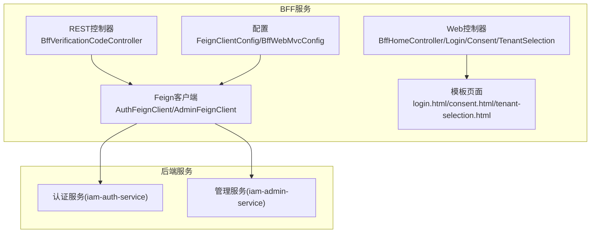
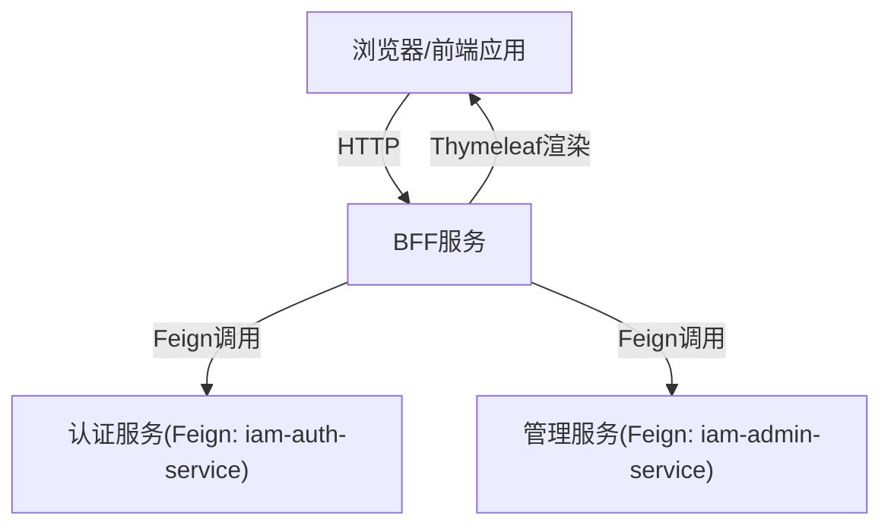
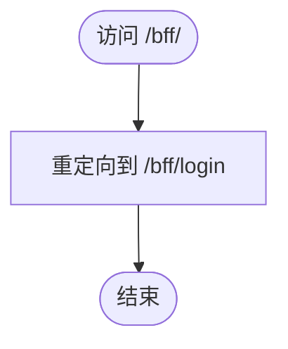
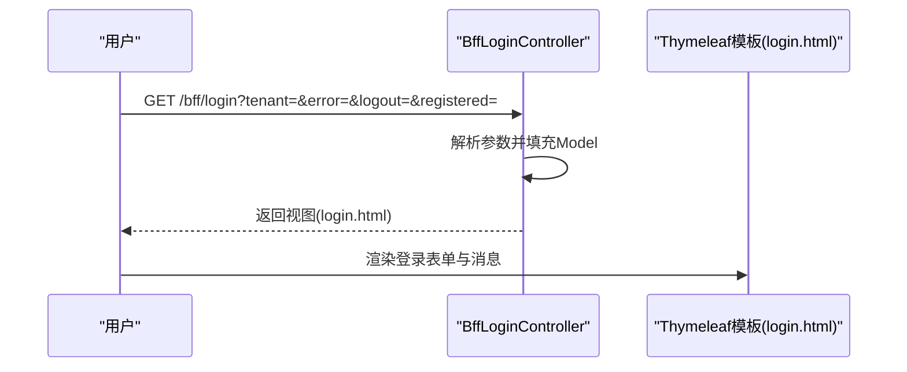
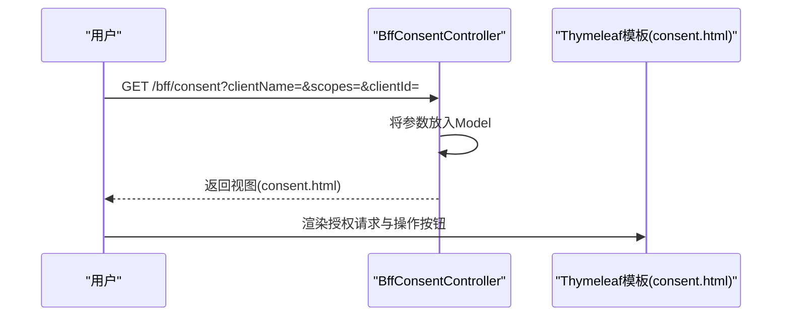
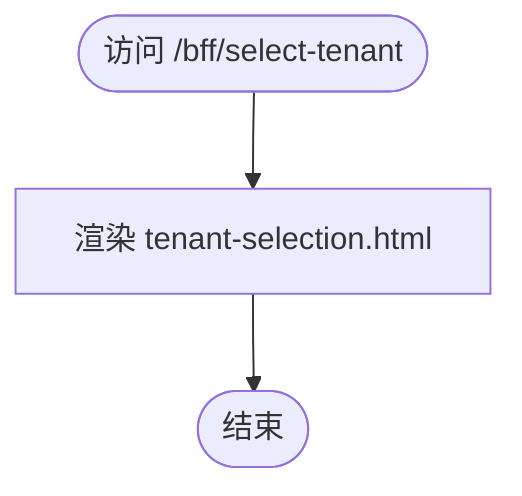
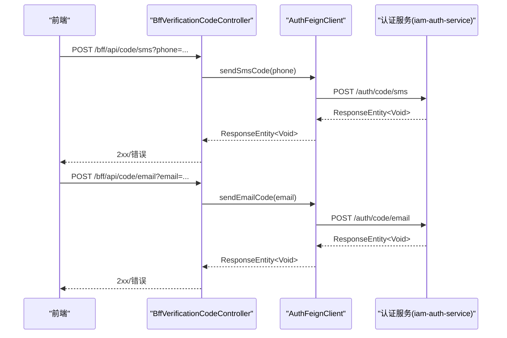
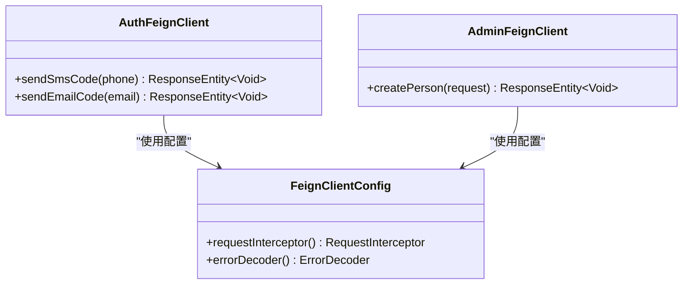
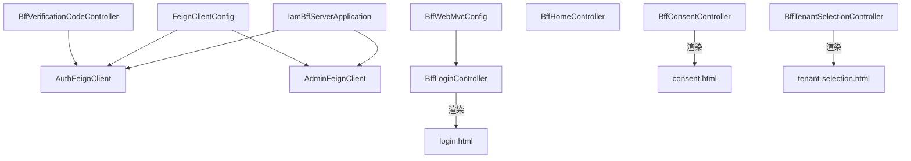

# Web控制器设计

<cite>
**本文引用的文件**
- [BffHomeController.java](file://iam-bff-server/src/main/java/iam/platform/bff/interfaces/web/BffHomeController.java)
- [BffLoginController.java](file://iam-bff-server/src/main/java/iam/platform/bff/interfaces/web/BffLoginController.java)
- [BffConsentController.java](file://iam-bff-server/src/main/java/iam/platform/bff/interfaces/web/BffConsentController.java)
- [BffTenantSelectionController.java](file://iam-bff-server/src/main/java/iam/platform/bff/interfaces/web/BffTenantSelectionController.java)
- [BffVerificationCodeController.java](file://iam-bff-server/src/main/java/iam/platform/bff/interfaces/rest/BffVerificationCodeController.java)
- [AuthFeignClient.java](file://iam-bff-server/src/main/java/iam/platform/bff/infrastructure/client/AuthFeignClient.java)
- [AdminFeignClient.java](file://iam-bff-server/src/main/java/iam/platform/bff/infrastructure/client/AdminFeignClient.java)
- [FeignClientConfig.java](file://iam-bff-server/src/main/java/iam/platform/bff/infrastructure/config/FeignClientConfig.java)
- [BffWebMvcConfig.java](file://iam-bff-server/src/main/java/iam/platform/bff/infrastructure/config/BffWebMvcConfig.java)
- [IamBffServerApplication.java](file://iam-bff-server/src/main/java/iam/platform/bff/IamBffServerApplication.java)
- [login.html](file://iam-bff-server/src/main/resources/templates/login.html)
- [consent.html](file://iam-bff-server/src/main/resources/templates/consent.html)
- [tenant-selection.html](file://iam-bff-server/src/main/resources/templates/tenant-selection.html)
</cite>

## 目录
1. [简介](#简介)
2. [项目结构](#项目结构)
3. [核心组件](#核心组件)
4. [架构总览](#架构总览)
5. [详细组件分析](#详细组件分析)
6. [依赖分析](#依赖分析)
7. [性能考虑](#性能考虑)
8. [故障排查指南](#故障排查指南)
9. [结论](#结论)
10. [附录](#附录)

## 简介
本文件面向BFF（Backend For Frontend）Web控制器设计模块，系统性梳理首页控制器、登录控制器、同意控制器与租户选择控制器的职责边界、请求处理流程、与后端服务的交互方式（Feign客户端）、安全与会话管理机制，并总结如何通过BFF提供简化的API接口以提升前端开发效率。同时给出使用示例与最佳实践，帮助读者快速理解与落地。

## 项目结构
BFF服务位于iam-bff-server模块，采用分层+按功能域组织的结构：
- 接口层：web包提供页面型控制器，rest包提供REST API控制器
- 基础设施层：client包定义Feign客户端，config包提供Web与Feign配置
- 资源层：templates目录存放Thymeleaf页面模板
- 应用入口：IamBffServerApplication启用服务发现与Feign客户端扫描

图表来源
- [IamBffServerApplication.java:1-17](file://iam-bff-server/src/main/java/iam/platform/bff/IamBffServerApplication.java#L1-L17)
- [BffHomeController.java:1-22](file://iam-bff-server/src/main/java/iam/platform/bff/interfaces/web/BffHomeController.java#L1-L22)
- [BffLoginController.java:1-50](file://iam-bff-server/src/main/java/iam/platform/bff/interfaces/web/BffLoginController.java#L1-L50)
- [BffConsentController.java:1-35](file://iam-bff-server/src/main/java/iam/platform/bff/interfaces/web/BffConsentController.java#L1-L35)
- [BffTenantSelectionController.java:1-22](file://iam-bff-server/src/main/java/iam/platform/bff/interfaces/web/BffTenantSelectionController.java#L1-L22)
- [BffVerificationCodeController.java:1-39](file://iam-bff-server/src/main/java/iam/platform/bff/interfaces/rest/BffVerificationCodeController.java#L1-L39)
- [AuthFeignClient.java:1-31](file://iam-bff-server/src/main/java/iam/platform/bff/infrastructure/client/AuthFeignClient.java#L1-L31)
- [AdminFeignClient.java:1-26](file://iam-bff-server/src/main/java/iam/platform/bff/infrastructure/client/AdminFeignClient.java#L1-L26)
- [FeignClientConfig.java:1-52](file://iam-bff-server/src/main/java/iam/platform/bff/infrastructure/config/FeignClientConfig.java#L1-L52)
- [BffWebMvcConfig.java:1-23](file://iam-bff-server/src/main/java/iam/platform/bff/infrastructure/config/BffWebMvcConfig.java#L1-L23)

章节来源
- [IamBffServerApplication.java:1-17](file://iam-bff-server/src/main/java/iam/platform/bff/IamBffServerApplication.java#L1-L17)

## 核心组件
- 首页控制器：负责根路径重定向至登录页，作为BFF统一入口
- 登录控制器：渲染登录页面，注入租户标识与状态消息，支持多种登录方式
- 同意控制器：渲染OAuth2授权同意页，传递客户端名称、作用域与客户端ID
- 租户选择控制器：渲染租户选择页，预留后续通过Feign拉取可用租户列表
- 验证码REST控制器：转发短信/邮件验证码发送请求到认证服务
- Feign客户端：封装对认证与管理服务的调用
- 配置：统一请求拦截与错误解码，以及本地开发CORS放行

章节来源
- [BffHomeController.java:1-22](file://iam-bff-server/src/main/java/iam/platform/bff/interfaces/web/BffHomeController.java#L1-L22)
- [BffLoginController.java:1-50](file://iam-bff-server/src/main/java/iam/platform/bff/interfaces/web/BffLoginController.java#L1-L50)
- [BffConsentController.java:1-35](file://iam-bff-server/src/main/java/iam/platform/bff/interfaces/web/BffConsentController.java#L1-L35)
- [BffTenantSelectionController.java:1-22](file://iam-bff-server/src/main/java/iam/platform/bff/interfaces/web/BffTenantSelectionController.java#L1-L22)
- [BffVerificationCodeController.java:1-39](file://iam-bff-server/src/main/java/iam/platform/bff/interfaces/rest/BffVerificationCodeController.java#L1-L39)
- [AuthFeignClient.java:1-31](file://iam-bff-server/src/main/java/iam/platform/bff/infrastructure/client/AuthFeignClient.java#L1-L31)
- [AdminFeignClient.java:1-26](file://iam-bff-server/src/main/java/iam/platform/bff/infrastructure/client/AdminFeignClient.java#L1-L26)
- [FeignClientConfig.java:1-52](file://iam-bff-server/src/main/java/iam/platform/bff/infrastructure/config/FeignClientConfig.java#L1-L52)
- [BffWebMvcConfig.java:1-23](file://iam-bff-server/src/main/java/iam/platform/bff/infrastructure/config/BffWebMvcConfig.java#L1-L23)

## 架构总览
BFF在整体IAM平台中承担“前端后端化”的角色，将多后端服务整合为统一入口，屏蔽复杂性并提供一致的用户体验。Web控制器负责页面渲染与轻量态交互，REST控制器负责与后端服务的直接通信。

图表来源
- [IamBffServerApplication.java:1-17](file://iam-bff-server/src/main/java/iam/platform/bff/IamBffServerApplication.java#L1-L17)
- [AuthFeignClient.java:1-31](file://iam-bff-server/src/main/java/iam/platform/bff/infrastructure/client/AuthFeignClient.java#L1-L31)
- [AdminFeignClient.java:1-26](file://iam-bff-server/src/main/java/iam/platform/bff/infrastructure/client/AdminFeignClient.java#L1-L26)

## 详细组件分析

### 首页控制器（BffHomeController）
- 职责：根路径“/”重定向至登录页，作为BFF统一入口
- 处理流程：GET “/bff/”，返回重定向视图
- 设计要点：保持极简，避免引入业务逻辑；未来可扩展为已登录用户的仪表盘或欢迎页

图表来源
- [BffHomeController.java:15-20](file://iam-bff-server/src/main/java/iam/platform/bff/interfaces/web/BffHomeController.java#L15-L20)

章节来源
- [BffHomeController.java:1-22](file://iam-bff-server/src/main/java/iam/platform/bff/interfaces/web/BffHomeController.java#L1-L22)

### 登录控制器（BffLoginController）
- 职责：渲染登录页面，注入租户标识与状态消息（错误/登出/注册成功）
- 参数接收：tenant（租户代码）、error（错误）、logout（登出）、registered（注册）
- 视图模型：根据参数设置tenantIdentified、tenantCode及提示信息
- 安全与会话：仅负责页面渲染，认证由网关与认证服务器处理

图表来源
- [BffLoginController.java:18-48](file://iam-bff-server/src/main/java/iam/platform/bff/interfaces/web/BffLoginController.java#L18-L48)
- [login.html:140-222](file://iam-bff-server/src/main/resources/templates/login.html#L140-L222)

章节来源
- [BffLoginController.java:1-50](file://iam-bff-server/src/main/java/iam/platform/bff/interfaces/web/BffLoginController.java#L1-L50)
- [login.html:1-341](file://iam-bff-server/src/main/resources/templates/login.html#L1-L341)

### 同意控制器（BffConsentController）
- 职责：渲染OAuth2授权同意页，展示客户端名称、请求的作用域与客户端ID
- 参数接收：clientName、scopes、clientId
- 视图模型：将参数注入Thymeleaf，供consent.html渲染

图表来源
- [BffConsentController.java:16-33](file://iam-bff-server/src/main/java/iam/platform/bff/interfaces/web/BffConsentController.java#L16-L33)
- [consent.html:9-31](file://iam-bff-server/src/main/resources/templates/consent.html#L9-L31)

章节来源
- [BffConsentController.java:1-35](file://iam-bff-server/src/main/java/iam/platform/bff/interfaces/web/BffConsentController.java#L1-L35)
- [consent.html:1-34](file://iam-bff-server/src/main/resources/templates/consent.html#L1-L34)

### 租户选择控制器（BffTenantSelectionController）
- 职责：渲染租户选择页面，预留通过Feign拉取可用租户列表
- 当前实现：直接返回视图，未从后端查询数据
- 扩展建议：在selectTenant方法中调用AdminFeignClient获取当前用户可用租户集合，再注入Model

图表来源
- [BffTenantSelectionController.java:15-20](file://iam-bff-server/src/main/java/iam/platform/bff/interfaces/web/BffTenantSelectionController.java#L15-L20)
- [tenant-selection.html:181-224](file://iam-bff-server/src/main/resources/templates/tenant-selection.html#L181-L224)

章节来源
- [BffTenantSelectionController.java:1-22](file://iam-bff-server/src/main/java/iam/platform/bff/interfaces/web/BffTenantSelectionController.java#L1-L22)
- [tenant-selection.html:1-238](file://iam-bff-server/src/main/resources/templates/tenant-selection.html#L1-L238)

### 验证码REST控制器（BffVerificationCodeController）
- 职责：提供短信/邮件验证码发送的REST接口，内部转发给认证服务
- 请求处理：接收手机号或邮箱，记录日志并调用AuthFeignClient
- 错误处理：由FeignClientConfig中的自定义ErrorDecoder统一处理

图表来源
- [BffVerificationCodeController.java:24-37](file://iam-bff-server/src/main/java/iam/platform/bff/interfaces/rest/BffVerificationCodeController.java#L24-L37)
- [AuthFeignClient.java:22-29](file://iam-bff-server/src/main/java/iam/platform/bff/infrastructure/client/AuthFeignClient.java#L22-L29)

章节来源
- [BffVerificationCodeController.java:1-39](file://iam-bff-server/src/main/java/iam/platform/bff/interfaces/rest/BffVerificationCodeController.java#L1-L39)
- [AuthFeignClient.java:1-31](file://iam-bff-server/src/main/java/iam/platform/bff/infrastructure/client/AuthFeignClient.java#L1-L31)

### Feign客户端与配置
- AuthFeignClient：声明对认证服务的调用，包含短信与邮件验证码发送接口
- AdminFeignClient：声明对管理服务的调用，用于自注册场景创建人员
- FeignClientConfig：统一添加请求头与自定义错误解码器
- BffWebMvcConfig：本地开发阶段允许CORS跨域

图表来源
- [AuthFeignClient.java:12-29](file://iam-bff-server/src/main/java/iam/platform/bff/infrastructure/client/AuthFeignClient.java#L12-L29)
- [AdminFeignClient.java:13-24](file://iam-bff-server/src/main/java/iam/platform/bff/infrastructure/client/AdminFeignClient.java#L13-L24)
- [FeignClientConfig.java:17-31](file://iam-bff-server/src/main/java/iam/platform/bff/infrastructure/config/FeignClientConfig.java#L17-L31)

章节来源
- [AuthFeignClient.java:1-31](file://iam-bff-server/src/main/java/iam/platform/bff/infrastructure/client/AuthFeignClient.java#L1-L31)
- [AdminFeignClient.java:1-26](file://iam-bff-server/src/main/java/iam/platform/bff/infrastructure/client/AdminFeignClient.java#L1-L26)
- [FeignClientConfig.java:1-52](file://iam-bff-server/src/main/java/iam/platform/bff/infrastructure/config/FeignClientConfig.java#L1-L52)
- [BffWebMvcConfig.java:1-23](file://iam-bff-server/src/main/java/iam/platform/bff/infrastructure/config/BffWebMvcConfig.java#L1-L23)

## 依赖分析
- 控制器依赖：Web控制器依赖Thymeleaf模板；REST控制器依赖Feign客户端
- Feign客户端依赖：通过@EnableFeignClients在应用入口启用扫描
- 配置依赖：FeignClientConfig为所有Feign客户端提供统一拦截与错误处理；BffWebMvcConfig仅在本地开发生效

图表来源
- [IamBffServerApplication.java:10-10](file://iam-bff-server/src/main/java/iam/platform/bff/IamBffServerApplication.java#L10-L10)
- [BffWebMvcConfig.java:14-21](file://iam-bff-server/src/main/java/iam/platform/bff/infrastructure/config/BffWebMvcConfig.java#L14-L21)
- [FeignClientConfig.java:17-31](file://iam-bff-server/src/main/java/iam/platform/bff/infrastructure/config/FeignClientConfig.java#L17-L31)
- [BffLoginController.java:18-48](file://iam-bff-server/src/main/java/iam/platform/bff/interfaces/web/BffLoginController.java#L18-L48)
- [BffConsentController.java:16-33](file://iam-bff-server/src/main/java/iam/platform/bff/interfaces/web/BffConsentController.java#L16-L33)
- [BffTenantSelectionController.java:15-20](file://iam-bff-server/src/main/java/iam/platform/bff/interfaces/web/BffTenantSelectionController.java#L15-L20)
- [BffVerificationCodeController.java:19-37](file://iam-bff-server/src/main/java/iam/platform/bff/interfaces/rest/BffVerificationCodeController.java#L19-L37)

章节来源
- [IamBffServerApplication.java:1-17](file://iam-bff-server/src/main/java/iam/platform/bff/IamBffServerApplication.java#L1-L17)
- [BffWebMvcConfig.java:1-23](file://iam-bff-server/src/main/java/iam/platform/bff/infrastructure/config/BffWebMvcConfig.java#L1-L23)
- [FeignClientConfig.java:1-52](file://iam-bff-server/src/main/java/iam/platform/bff/infrastructure/config/FeignClientConfig.java#L1-L52)

## 性能考虑
- 减少后端往返：将常用页面逻辑前置到BFF，避免重复请求
- 缓存策略：对静态资源与模板进行合理缓存，降低模板渲染开销
- 异步处理：对于耗时操作（如发送验证码），采用异步或队列化处理
- 连接池与超时：Feign默认连接池与超时配置需结合压测结果优化

## 故障排查指南
- 认证失败/登录页不显示：检查网关与认证服务器连通性，确认登录控制器参数是否正确传入
- 验证码发送失败：查看BffVerificationCodeController日志与Feign错误解码器输出，定位4xx/5xx错误
- 租户选择页无数据：确认AdminFeignClient已实现并返回有效租户列表
- CORS问题：生产环境由网关统一处理CORS，本地开发可通过BffWebMvcConfig放行

章节来源
- [FeignClientConfig.java:36-50](file://iam-bff-server/src/main/java/iam/platform/bff/infrastructure/config/FeignClientConfig.java#L36-L50)
- [BffWebMvcConfig.java:14-21](file://iam-bff-server/src/main/java/iam/platform/bff/infrastructure/config/BffWebMvcConfig.java#L14-L21)

## 结论
BFF Web控制器通过清晰的职责划分与简洁的请求处理流程，为前端提供了统一、稳定的入口。配合Feign客户端与统一配置，实现了与后端服务的高效协作。未来可在租户选择控制器中接入后端数据，进一步完善用户体验与安全性。

## 附录

### 使用示例与最佳实践
- 登录页集成
  - 在登录控制器中注入租户标识与状态消息，确保页面友好提示
  - 前端通过隐藏字段传递认证方式（密码/短信/邮箱/OAuth2）
- 验证码发送
  - 前端点击“发送验证码”按钮时，调用BFF的REST接口，BFF再转发至认证服务
  - 注意前后端联动：发送成功后禁用按钮并倒计时
- 租户选择
  - 当前仅渲染页面，建议后续实现通过AdminFeignClient拉取可用租户并注入视图
- 安全与会话
  - BFF不承载认证逻辑，仅负责页面渲染与轻量转发
  - 通过网关与认证服务器完成统一认证与会话管理

章节来源
- [BffLoginController.java:18-48](file://iam-bff-server/src/main/java/iam/platform/bff/interfaces/web/BffLoginController.java#L18-L48)
- [BffVerificationCodeController.java:24-37](file://iam-bff-server/src/main/java/iam/platform/bff/interfaces/rest/BffVerificationCodeController.java#L24-L37)
- [login.html:267-322](file://iam-bff-server/src/main/resources/templates/login.html#L267-L322)
- [tenant-selection.html:194-219](file://iam-bff-server/src/main/resources/templates/tenant-selection.html#L194-L219)