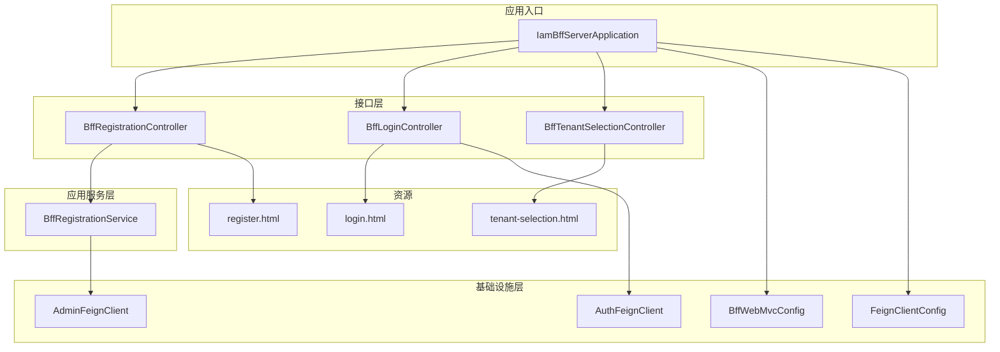
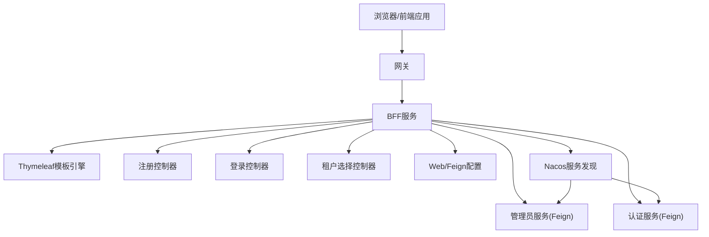
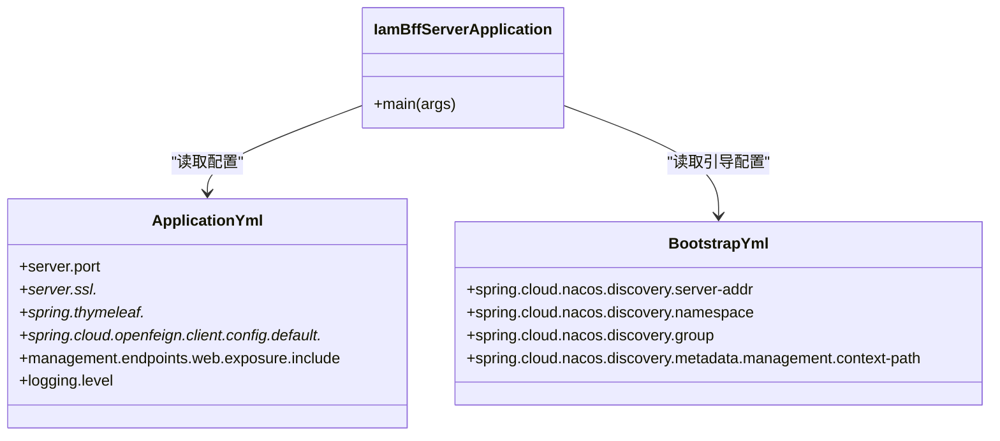
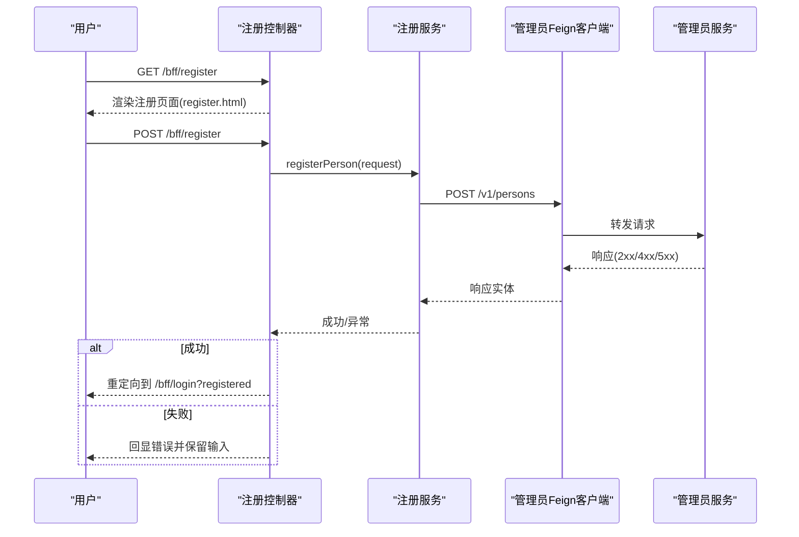
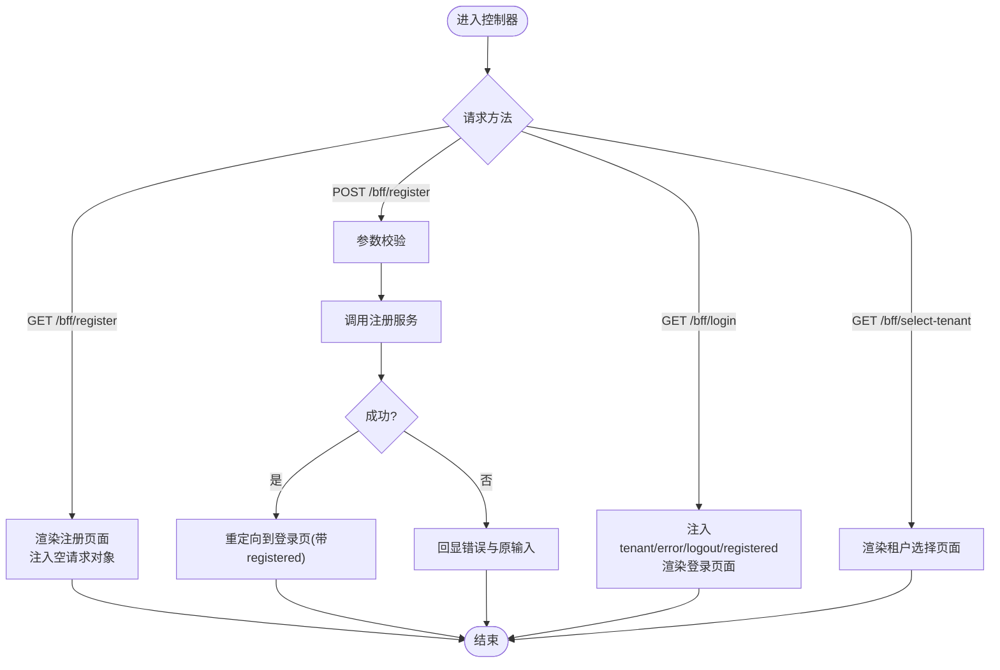
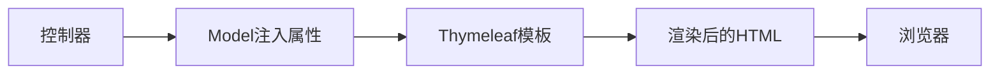
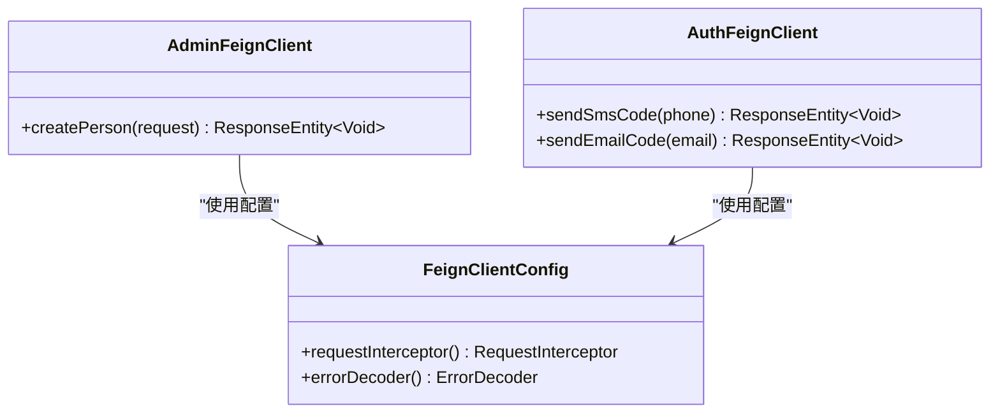
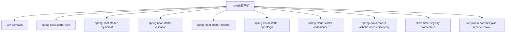

# 前端代理服务器（iam-bff-server）

<cite>
**本文引用的文件**
- [IamBffServerApplication.java](file://iam-bff-server/src/main/java/iam/platform/bff/IamBffServerApplication.java)
- [BffRegistrationService.java](file://iam-bff-server/src/main/java/iam/platform/bff/application/service/BffRegistrationService.java)
- [BffRegistrationController.java](file://iam-bff-server/src/main/java/iam/platform/bff/interfaces/web/BffRegistrationController.java)
- [BffLoginController.java](file://iam-bff-server/src/main/java/iam/platform/bff/interfaces/web/BffLoginController.java)
- [BffTenantSelectionController.java](file://iam-bff-server/src/main/java/iam/platform/bff/interfaces/web/BffTenantSelectionController.java)
- [AdminFeignClient.java](file://iam-bff-server/src/main/java/iam/platform/bff/infrastructure/client/AdminFeignClient.java)
- [AuthFeignClient.java](file://iam-bff-server/src/main/java/iam/platform/bff/infrastructure/client/AuthFeignClient.java)
- [BffWebMvcConfig.java](file://iam-bff-server/src/main/java/iam/platform/bff/infrastructure/config/BffWebMvcConfig.java)
- [FeignClientConfig.java](file://iam-bff-server/src/main/java/iam/platform/bff/infrastructure/config/FeignClientConfig.java)
- [register.html](file://iam-bff-server/src/main/resources/templates/register.html)
- [login.html](file://iam-bff-server/src/main/resources/templates/login.html)
- [tenant-selection.html](file://iam-bff-server/src/main/resources/templates/tenant-selection.html)
- [application.yml](file://iam-bff-server/src/main/resources/application.yml)
- [pom.xml](file://iam-bff-server/pom.xml)
- [bootstrap.yml](file://iam-bff-server/bootstrap.yml)
</cite>

## 目录
1. [简介](#简介)
2. [项目结构](#项目结构)
3. [核心组件](#核心组件)
4. [架构总览](#架构总览)
5. [详细组件分析](#详细组件分析)
6. [依赖分析](#依赖分析)
7. [性能考虑](#性能考虑)
8. [故障排查指南](#故障排查指南)
9. [结论](#结论)
10. [附录](#附录)

## 简介
本文件面向前端代理服务器模块（iam-bff-server），系统性阐述其设计理念与实现架构。该服务以“前端后端之友”（Backend for Frontend, BFF）的身份，为前端应用提供统一的页面渲染、用户注册、登录引导、租户选择以及与后端服务的轻量化通信能力。通过集成Spring Web、Thymeleaf模板引擎、OpenFeign客户端与Nacos服务发现，BFF在不暴露复杂后端细节的前提下，简化了客户端与后端服务之间的交互，提升了前端开发效率与用户体验。

## 项目结构
iam-bff-server采用按层次与职责划分的目录组织方式：
- 应用入口：IamBffServerApplication 负责应用启动、启用服务发现与Feign客户端扫描。
- 接口层（web）：提供注册、登录、租户选择等页面控制器，负责参数接收、模型注入与视图渲染。
- 应用服务层（application/service）：封装业务编排，如注册流程的调用与错误处理。
- 基础设施层（infrastructure）：包含Feign客户端定义、Web MVC与Feign配置。
- 资源：Thymeleaf模板与静态资源，支撑页面渲染与前端交互。

图表来源
- [IamBffServerApplication.java:1-17](file://iam-bff-server/src/main/java/iam/platform/bff/IamBffServerApplication.java#L1-L17)
- [BffRegistrationController.java:1-40](file://iam-bff-server/src/main/java/iam/platform/bff/interfaces/web/BffRegistrationController.java#L1-L40)
- [BffLoginController.java:1-50](file://iam-bff-server/src/main/java/iam/platform/bff/interfaces/web/BffLoginController.java#L1-L50)
- [BffTenantSelectionController.java:1-22](file://iam-bff-server/src/main/java/iam/platform/bff/interfaces/web/BffTenantSelectionController.java#L1-L22)
- [BffRegistrationService.java:1-31](file://iam-bff-server/src/main/java/iam/platform/bff/application/service/BffRegistrationService.java#L1-L31)
- [AdminFeignClient.java:1-26](file://iam-bff-server/src/main/java/iam/platform/bff/infrastructure/client/AdminFeignClient.java#L1-L26)
- [AuthFeignClient.java:1-31](file://iam-bff-server/src/main/java/iam/platform/bff/infrastructure/client/AuthFeignClient.java#L1-L31)
- [BffWebMvcConfig.java:1-23](file://iam-bff-server/src/main/java/iam/platform/bff/infrastructure/config/BffWebMvcConfig.java#L1-L23)
- [FeignClientConfig.java:1-52](file://iam-bff-server/src/main/java/iam/platform/bff/infrastructure/config/FeignClientConfig.java#L1-L52)
- [register.html:1-64](file://iam-bff-server/src/main/resources/templates/register.html#L1-L64)
- [login.html:1-341](file://iam-bff-server/src/main/resources/templates/login.html#L1-L341)
- [tenant-selection.html:1-238](file://iam-bff-server/src/main/resources/templates/tenant-selection.html#L1-L238)

章节来源
- [IamBffServerApplication.java:1-17](file://iam-bff-server/src/main/java/iam/platform/bff/IamBffServerApplication.java#L1-L17)
- [application.yml:1-54](file://iam-bff-server/src/main/resources/application.yml#L1-L54)
- [pom.xml:1-107](file://iam-bff-server/pom.xml#L1-L107)
- [bootstrap.yml:1-10](file://iam-bff-server/bootstrap.yml#L1-L10)

## 核心组件
- 应用启动类：启用服务发现与Feign客户端扫描，定位基础包进行自动装配。
- 注册服务：封装注册流程，调用后端管理员服务创建人员实体，并对响应进行校验。
- 控制器集合：注册、登录、租户选择控制器分别负责页面渲染与请求处理。
- Feign客户端：定义与管理员服务、认证服务的远程调用契约。
- 配置：Web MVC跨域策略与Feign通用拦截与错误解码。
- 模板引擎：Thymeleaf模板负责页面渲染与静态资源引入。

章节来源
- [IamBffServerApplication.java:8-11](file://iam-bff-server/src/main/java/iam/platform/bff/IamBffServerApplication.java#L8-L11)
- [BffRegistrationService.java:13-30](file://iam-bff-server/src/main/java/iam/platform/bff/application/service/BffRegistrationService.java#L13-L30)
- [BffRegistrationController.java:14-39](file://iam-bff-server/src/main/java/iam/platform/bff/interfaces/web/BffRegistrationController.java#L14-L39)
- [BffLoginController.java:14-49](file://iam-bff-server/src/main/java/iam/platform/bff/interfaces/web/BffLoginController.java#L14-L49)
- [BffTenantSelectionController.java:11-21](file://iam-bff-server/src/main/java/iam/platform/bff/interfaces/web/BffTenantSelectionController.java#L11-L21)
- [AdminFeignClient.java:13-25](file://iam-bff-server/src/main/java/iam/platform/bff/infrastructure/client/AdminFeignClient.java#L13-L25)
- [AuthFeignClient.java:12-30](file://iam-bff-server/src/main/java/iam/platform/bff/infrastructure/client/AuthFeignClient.java#L12-L30)
- [BffWebMvcConfig.java:11-22](file://iam-bff-server/src/main/java/iam/platform/bff/infrastructure/config/BffWebMvcConfig.java#L11-L22)
- [FeignClientConfig.java:12-51](file://iam-bff-server/src/main/java/iam/platform/bff/infrastructure/config/FeignClientConfig.java#L12-L51)

## 架构总览
BFF服务位于前端与后端服务之间，承担以下职责：
- 页面渲染：基于Thymeleaf模板输出HTML，引入CSS与脚本，完成用户引导与交互。
- 请求编排：注册流程由控制器调用应用服务，再通过Feign客户端访问管理员服务；登录页用于引导到认证服务或第三方登录。
- 安全边界：登录与注册等页面由BFF直接渲染，避免直接暴露后端API；认证与授权由网关与认证服务处理。
- 可观测性：集成Actuator、Prometheus与Zipkin，支持健康检查、指标与链路追踪。

图表来源
- [IamBffServerApplication.java:9-10](file://iam-bff-server/src/main/java/iam/platform/bff/IamBffServerApplication.java#L9-L10)
- [BffRegistrationController.java:14-39](file://iam-bff-server/src/main/java/iam/platform/bff/interfaces/web/BffRegistrationController.java#L14-L39)
- [BffLoginController.java:14-49](file://iam-bff-server/src/main/java/iam/platform/bff/interfaces/web/BffLoginController.java#L14-L49)
- [BffTenantSelectionController.java:11-21](file://iam-bff-server/src/main/java/iam/platform/bff/interfaces/web/BffTenantSelectionController.java#L11-L21)
- [AdminFeignClient.java:13-25](file://iam-bff-server/src/main/java/iam/platform/bff/infrastructure/client/AdminFeignClient.java#L13-L25)
- [AuthFeignClient.java:12-30](file://iam-bff-server/src/main/java/iam/platform/bff/infrastructure/client/AuthFeignClient.java#L12-L30)
- [BffWebMvcConfig.java:11-22](file://iam-bff-server/src/main/java/iam/platform/bff/infrastructure/config/BffWebMvcConfig.java#L11-L22)
- [bootstrap.yml:3-9](file://iam-bff-server/bootstrap.yml#L3-L9)

## 详细组件分析

### 应用启动类与配置结构
- 启动类启用服务发现与Feign客户端扫描，指定扫描基础包，确保客户端接口被纳入容器管理。
- 应用配置文件定义端口、SSL、Thymeleaf模板路径、Jackson日期格式与时区、Feign默认超时、Actuator端口与暴露的监控项、Zipkin追踪采样率与端点、日志级别等。
- 引导配置文件设置Nacos地址、命名空间、分组与管理上下文路径，便于服务注册与监控。

图表来源
- [IamBffServerApplication.java:8-11](file://iam-bff-server/src/main/java/iam/platform/bff/IamBffServerApplication.java#L8-L11)
- [application.yml:1-54](file://iam-bff-server/src/main/resources/application.yml#L1-L54)
- [bootstrap.yml:1-10](file://iam-bff-server/bootstrap.yml#L1-L10)

章节来源
- [IamBffServerApplication.java:8-11](file://iam-bff-server/src/main/java/iam/platform/bff/IamBffServerApplication.java#L8-L11)
- [application.yml:1-54](file://iam-bff-server/src/main/resources/application.yml#L1-L54)
- [bootstrap.yml:1-10](file://iam-bff-server/bootstrap.yml#L1-L10)

### 注册服务的设计与实现
- 设计目标：在BFF中编排注册流程，隐藏后端API细节，统一错误处理。
- 实现要点：
  - 依赖注入管理员Feign客户端。
  - 调用后端创建人员接口，基于响应状态判断是否成功，失败时抛出运行时异常。
  - 控制器负责接收表单参数、绑定模型、捕获异常并回显错误信息。

图表来源
- [BffRegistrationController.java:21-38](file://iam-bff-server/src/main/java/iam/platform/bff/interfaces/web/BffRegistrationController.java#L21-L38)
- [BffRegistrationService.java:20-29](file://iam-bff-server/src/main/java/iam/platform/bff/application/service/BffRegistrationService.java#L20-L29)
- [AdminFeignClient.java:20-24](file://iam-bff-server/src/main/java/iam/platform/bff/infrastructure/client/AdminFeignClient.java#L20-L24)

章节来源
- [BffRegistrationService.java:13-30](file://iam-bff-server/src/main/java/iam/platform/bff/application/service/BffRegistrationService.java#L13-L30)
- [BffRegistrationController.java:14-39](file://iam-bff-server/src/main/java/iam/platform/bff/interfaces/web/BffRegistrationController.java#L14-L39)
- [AdminFeignClient.java:13-25](file://iam-bff-server/src/main/java/iam/platform/bff/infrastructure/client/AdminFeignClient.java#L13-L25)

### 前端控制器设计模式
- 注册控制器：GET返回注册表单并注入空请求对象；POST接收并验证请求，调用注册服务，成功则重定向至登录页带提示参数，失败则回显错误与原输入。
- 登录控制器：GET根据查询参数注入租户标识、错误与登出消息，渲染登录页面；登录实际由认证服务与网关处理。
- 租户选择控制器：GET渲染租户选择页面，预留后续通过Feign获取可用租户列表。

图表来源
- [BffRegistrationController.java:21-38](file://iam-bff-server/src/main/java/iam/platform/bff/interfaces/web/BffRegistrationController.java#L21-L38)
- [BffLoginController.java:18-48](file://iam-bff-server/src/main/java/iam/platform/bff/interfaces/web/BffLoginController.java#L18-L48)
- [BffTenantSelectionController.java:15-20](file://iam-bff-server/src/main/java/iam/platform/bff/interfaces/web/BffTenantSelectionController.java#L15-L20)

章节来源
- [BffRegistrationController.java:14-39](file://iam-bff-server/src/main/java/iam/platform/bff/interfaces/web/BffRegistrationController.java#L14-L39)
- [BffLoginController.java:14-49](file://iam-bff-server/src/main/java/iam/platform/bff/interfaces/web/BffLoginController.java#L14-L49)
- [BffTenantSelectionController.java:11-21](file://iam-bff-server/src/main/java/iam/platform/bff/interfaces/web/BffTenantSelectionController.java#L11-L21)

### Thymeleaf模板引擎使用
- 模板位置与缓存：模板前缀与后缀在配置中定义，生产环境开启缓存以提升性能。
- 页面渲染机制：控制器向Model注入属性（如错误信息、租户标识、注册提示等），模板通过Thymeleaf表达式读取并渲染。
- 静态资源管理：模板中通过Thymeleaf链接引入CSS样式，确保资源路径与BFF上下文一致。

图表来源
- [application.yml:15-18](file://iam-bff-server/src/main/resources/application.yml#L15-L18)
- [register.html:7-14](file://iam-bff-server/src/main/resources/templates/register.html#L7-L14)
- [login.html:7-151](file://iam-bff-server/src/main/resources/templates/login.html#L7-L151)
- [tenant-selection.html:7-192](file://iam-bff-server/src/main/resources/templates/tenant-selection.html#L7-L192)

章节来源
- [application.yml:15-18](file://iam-bff-server/src/main/resources/application.yml#L15-L18)
- [register.html:1-64](file://iam-bff-server/src/main/resources/templates/register.html#L1-L64)
- [login.html:1-341](file://iam-bff-server/src/main/resources/templates/login.html#L1-L341)
- [tenant-selection.html:1-238](file://iam-bff-server/src/main/resources/templates/tenant-selection.html#L1-L238)

### BFF与后端服务的通信机制
- Feign客户端配置：
  - 管理员Feign客户端：指向管理员服务，路径前缀为/v1，使用自定义配置类。
  - 认证Feign客户端：指向认证服务，路径前缀为/auth，同样使用自定义配置类。
- 自定义配置：
  - 请求拦截器：为所有Feign请求添加来源标识头，便于后端审计与追踪。
  - 错误解码器：区分4xx与5xx错误，统一转换为运行时异常，便于上层控制器捕获与展示。
- Web MVC配置：
  - 在本地开发场景下允许跨域，生产环境由网关统一处理跨域。

图表来源
- [AdminFeignClient.java:13-25](file://iam-bff-server/src/main/java/iam/platform/bff/infrastructure/client/AdminFeignClient.java#L13-L25)
- [AuthFeignClient.java:12-30](file://iam-bff-server/src/main/java/iam/platform/bff/infrastructure/client/AuthFeignClient.java#L12-L30)
- [FeignClientConfig.java:17-50](file://iam-bff-server/src/main/java/iam/platform/bff/infrastructure/config/FeignClientConfig.java#L17-L50)

章节来源
- [AdminFeignClient.java:1-26](file://iam-bff-server/src/main/java/iam/platform/bff/infrastructure/client/AdminFeignClient.java#L1-L26)
- [AuthFeignClient.java:1-31](file://iam-bff-server/src/main/java/iam/platform/bff/infrastructure/client/AuthFeignClient.java#L1-L31)
- [FeignClientConfig.java:1-52](file://iam-bff-server/src/main/java/iam/platform/bff/infrastructure/config/FeignClientConfig.java#L1-L52)
- [BffWebMvcConfig.java:11-22](file://iam-bff-server/src/main/java/iam/platform/bff/infrastructure/config/BffWebMvcConfig.java#L11-L22)

### 前端代理服务的安全设计
- 会话与状态：登录页面由BFF渲染，认证与会话管理由网关与认证服务负责；BFF仅传递必要的查询参数（如租户、错误、登出、注册成功）给视图。
- 安全边界：注册与登录等页面在BFF侧完成，避免直接暴露后端REST接口；认证流程通过标准协议与网关协作完成。
- 可观测性：集成Zipkin与Prometheus，便于追踪与监控。

章节来源
- [BffLoginController.java:18-48](file://iam-bff-server/src/main/java/iam/platform/bff/interfaces/web/BffLoginController.java#L18-L48)
- [login.html:161-216](file://iam-bff-server/src/main/resources/templates/login.html#L161-L216)
- [application.yml:33-48](file://iam-bff-server/src/main/resources/application.yml#L33-L48)

### 提供简化的API接口
- BFF通过控制器与模板，将复杂的后端交互抽象为简洁的页面与少量API（如发送验证码的轻量接口），降低前端开发复杂度。
- 通过统一的错误处理与消息注入，提升用户体验与一致性。

章节来源
- [BffRegistrationController.java:27-38](file://iam-bff-server/src/main/java/iam/platform/bff/interfaces/web/BffRegistrationController.java#L27-L38)
- [login.html:293-322](file://iam-bff-server/src/main/resources/templates/login.html#L293-L322)

## 依赖分析
- 内部依赖：依赖iam-common模块，复用公共DTO、枚举与异常模型。
- 外部依赖：Spring Web、Thymeleaf、校验、Actuator、OpenFeign、负载均衡、Nacos发现、Micrometer与Zipkin等。

图表来源
- [pom.xml:18-87](file://iam-bff-server/pom.xml#L18-L87)

章节来源
- [pom.xml:1-107](file://iam-bff-server/pom.xml#L1-L107)

## 性能考虑
- 模板缓存：生产环境开启Thymeleaf缓存，减少模板解析开销。
- 超时控制：Feign默认连接与读取超时已配置，避免前端长时间等待。
- 跨域策略：本地开发允许跨域，生产由网关集中处理，减少重复配置。
- 监控与追踪：启用Actuator与Zipkin，结合Prometheus指标，便于性能观测与问题定位。

章节来源
- [application.yml:15-32](file://iam-bff-server/src/main/resources/application.yml#L15-L32)
- [BffWebMvcConfig.java:14-21](file://iam-bff-server/src/main/java/iam/platform/bff/infrastructure/config/BffWebMvcConfig.java#L14-L21)
- [application.yml:33-48](file://iam-bff-server/src/main/resources/application.yml#L33-L48)

## 故障排查指南
- 注册失败：
  - 检查管理员服务是否可达与响应状态。
  - 查看Feign错误解码器的日志输出，确认4xx/5xx错误类型。
  - 确认请求体参数与DTO字段匹配。
- 登录页面无响应：
  - 检查认证服务与网关连通性。
  - 确认登录表单提交的目标URL与方法正确。
- 验证码发送失败：
  - 检查认证服务的短信/邮件发送接口是否可用。
  - 查看BFF侧网络超时与错误解码器日志。
- 模板渲染异常：
  - 检查Thymeleaf模板语法与Model属性是否存在。
  - 确认静态资源路径与上下文映射。

章节来源
- [BffRegistrationService.java:23-29](file://iam-bff-server/src/main/java/iam/platform/bff/application/service/BffRegistrationService.java#L23-L29)
- [FeignClientConfig.java:36-50](file://iam-bff-server/src/main/java/iam/platform/bff/infrastructure/config/FeignClientConfig.java#L36-L50)
- [login.html:293-322](file://iam-bff-server/src/main/resources/templates/login.html#L293-L322)
- [register.html:1-64](file://iam-bff-server/src/main/resources/templates/register.html#L1-L64)

## 结论
iam-bff-server通过清晰的分层设计与Thymeleaf模板渲染，有效简化了前端与后端服务的交互复杂度。借助Feign客户端与Nacos服务发现，BFF实现了稳定的远程调用与可观测性。登录与注册等关键流程在BFF侧完成页面引导与错误处理，配合网关与认证服务，构建了安全、高效且易于扩展的统一认证体验。

## 附录
- 关键文件清单与用途概览：
  - IamBffServerApplication：应用启动与组件扫描。
  - BffRegistrationService：注册流程编排与错误处理。
  - BffRegistrationController、BffLoginController、BffTenantSelectionController：页面渲染与请求处理。
  - AdminFeignClient、AuthFeignClient：远程调用契约。
  - BffWebMvcConfig、FeignClientConfig：Web与Feign配置。
  - register.html、login.html、tenant-selection.html：页面模板与静态资源。
  - application.yml、bootstrap.yml：应用与引导配置。

章节来源
- [IamBffServerApplication.java:1-17](file://iam-bff-server/src/main/java/iam/platform/bff/IamBffServerApplication.java#L1-L17)
- [BffRegistrationService.java:1-31](file://iam-bff-server/src/main/java/iam/platform/bff/application/service/BffRegistrationService.java#L1-L31)
- [BffRegistrationController.java:1-40](file://iam-bff-server/src/main/java/iam/platform/bff/interfaces/web/BffRegistrationController.java#L1-L40)
- [BffLoginController.java:1-50](file://iam-bff-server/src/main/java/iam/platform/bff/interfaces/web/BffLoginController.java#L1-L50)
- [BffTenantSelectionController.java:1-22](file://iam-bff-server/src/main/java/iam/platform/bff/interfaces/web/BffTenantSelectionController.java#L1-L22)
- [AdminFeignClient.java:1-26](file://iam-bff-server/src/main/java/iam/platform/bff/infrastructure/client/AdminFeignClient.java#L1-L26)
- [AuthFeignClient.java:1-31](file://iam-bff-server/src/main/java/iam/platform/bff/infrastructure/client/AuthFeignClient.java#L1-L31)
- [BffWebMvcConfig.java:1-23](file://iam-bff-server/src/main/java/iam/platform/bff/infrastructure/config/BffWebMvcConfig.java#L1-L23)
- [FeignClientConfig.java:1-52](file://iam-bff-server/src/main/java/iam/platform/bff/infrastructure/config/FeignClientConfig.java#L1-L52)
- [register.html:1-64](file://iam-bff-server/src/main/resources/templates/register.html#L1-L64)
- [login.html:1-341](file://iam-bff-server/src/main/resources/templates/login.html#L1-L341)
- [tenant-selection.html:1-238](file://iam-bff-server/src/main/resources/templates/tenant-selection.html#L1-L238)
- [application.yml:1-54](file://iam-bff-server/src/main/resources/application.yml#L1-L54)
- [pom.xml:1-107](file://iam-bff-server/pom.xml#L1-L107)
- [bootstrap.yml:1-10](file://iam-bff-server/bootstrap.yml#L1-L10)