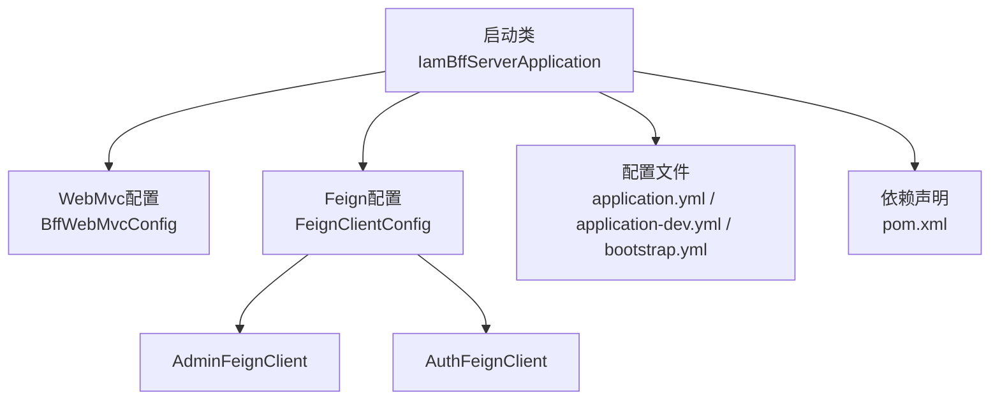
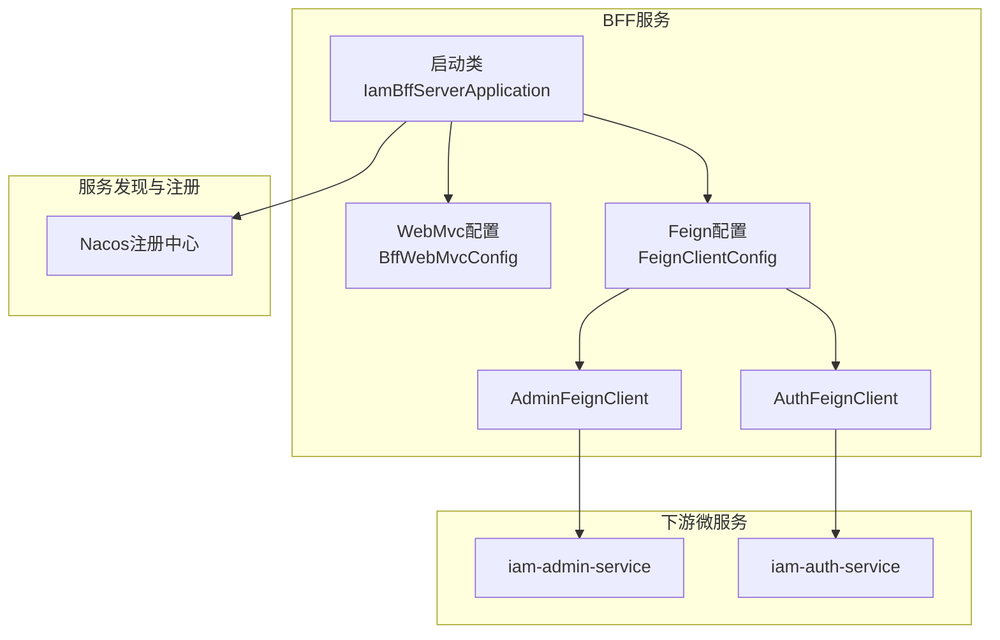
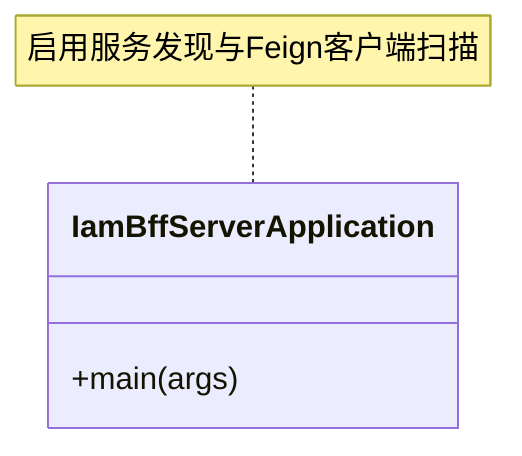
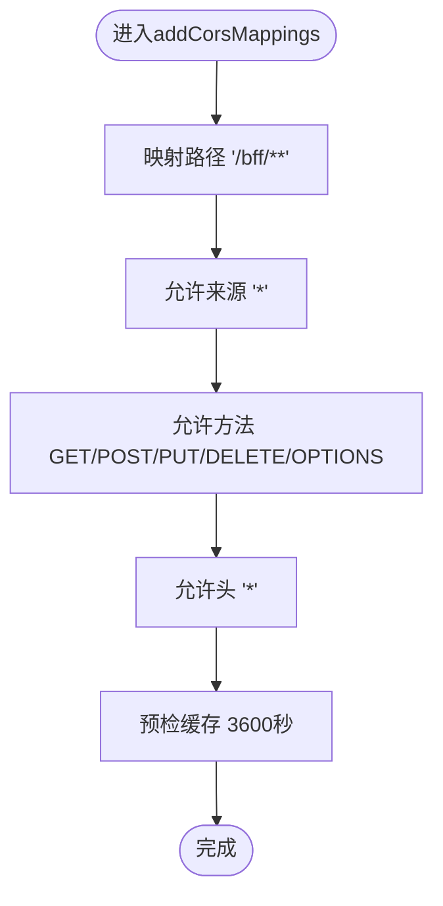
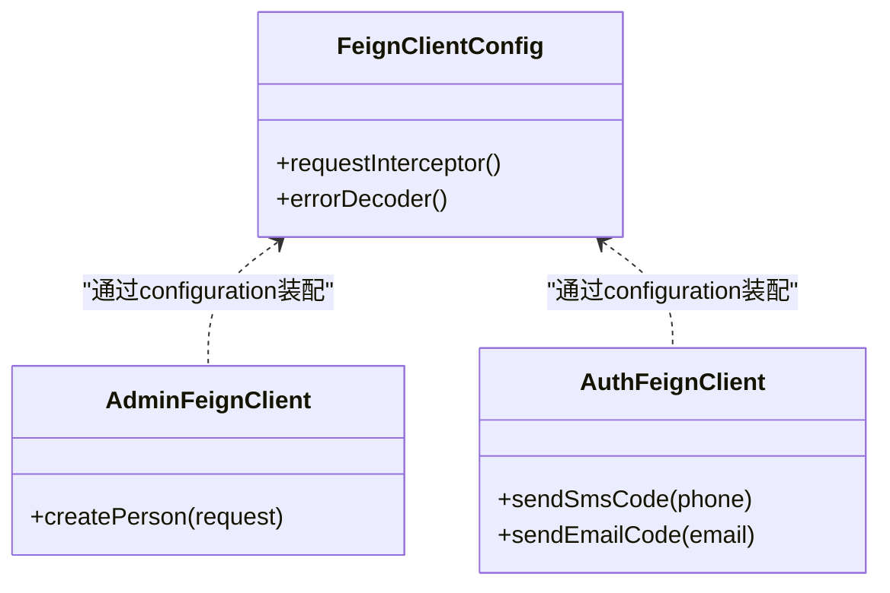
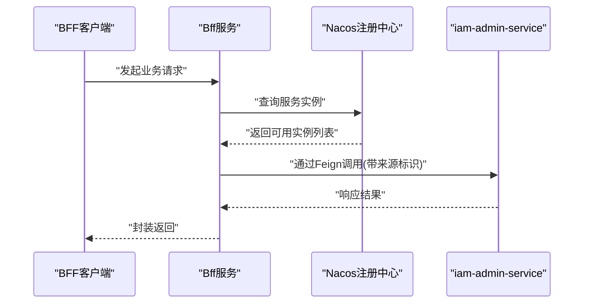
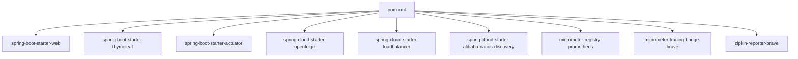

# 应用启动与配置

<cite>
**本文引用的文件**
- [IamBffServerApplication.java](file://iam-bff-server/src/main/java/iam/platform/bff/IamBffServerApplication.java)
- [BffWebMvcConfig.java](file://iam-bff-server/src/main/java/iam/platform/bff/infrastructure/config/BffWebMvcConfig.java)
- [FeignClientConfig.java](file://iam-bff-server/src/main/java/iam/platform/bff/infrastructure/config/FeignClientConfig.java)
- [AdminFeignClient.java](file://iam-bff-server/src/main/java/iam/platform/bff/infrastructure/client/AdminFeignClient.java)
- [AuthFeignClient.java](file://iam-bff-server/src/main/java/iam/platform/bff/infrastructure/client/AuthFeignClient.java)
- [application.yml](file://iam-bff-server/src/main/resources/application.yml)
- [application-dev.yml](file://iam-bff-server/src/main/resources/application-dev.yml)
- [bootstrap.yml](file://iam-bff-server/src/main/resources/bootstrap.yml)
- [pom.xml](file://iam-bff-server/pom.xml)
</cite>

## 目录
1. [简介](#简介)
2. [项目结构](#项目结构)
3. [核心组件](#核心组件)
4. [架构总览](#架构总览)
5. [详细组件分析](#详细组件分析)
6. [依赖分析](#依赖分析)
7. [性能考虑](#性能考虑)
8. [故障排查指南](#故障排查指南)
9. [结论](#结论)
10. [附录](#附录)

## 简介
本章节面向BFF（Backend For Frontend）应用的启动与配置模块，系统性阐述启动类设计、WebMvc配置、Feign客户端配置与使用、服务发现与通信机制，以及配置文件的最佳实践。目标是帮助读者快速理解并高效运维该模块。

## 项目结构
BFF服务位于独立模块中，核心入口为启动类，配置集中在基础设施层，Feign客户端接口定义在独立包内，模板与静态资源位于resources目录，配置文件分为通用与开发环境两套。

**图表来源**
- [IamBffServerApplication.java:1-17](file://iam-bff-server/src/main/java/iam/platform/bff/IamBffServerApplication.java#L1-L17)
- [BffWebMvcConfig.java:1-23](file://iam-bff-server/src/main/java/iam/platform/bff/infrastructure/config/BffWebMvcConfig.java#L1-L23)
- [FeignClientConfig.java:1-52](file://iam-bff-server/src/main/java/iam/platform/bff/infrastructure/config/FeignClientConfig.java#L1-L52)
- [AdminFeignClient.java:1-26](file://iam-bff-server/src/main/java/iam/platform/bff/infrastructure/client/AdminFeignClient.java#L1-L26)
- [AuthFeignClient.java:1-31](file://iam-bff-server/src/main/java/iam/platform/bff/infrastructure/client/AuthFeignClient.java#L1-L31)
- [application.yml:1-54](file://iam-bff-server/src/main/resources/application.yml#L1-L54)
- [application-dev.yml:1-10](file://iam-bff-server/src/main/resources/application-dev.yml#L1-L10)
- [bootstrap.yml:1-10](file://iam-bff-server/src/main/resources/bootstrap.yml#L1-L10)
- [pom.xml:1-107](file://iam-bff-server/pom.xml#L1-L107)

**章节来源**
- [IamBffServerApplication.java:1-17](file://iam-bff-server/src/main/java/iam/platform/bff/IamBffServerApplication.java#L1-L17)
- [application.yml:1-54](file://iam-bff-server/src/main/resources/application.yml#L1-L54)
- [bootstrap.yml:1-10](file://iam-bff-server/src/main/resources/bootstrap.yml#L1-L10)
- [pom.xml:1-107](file://iam-bff-server/pom.xml#L1-L107)

## 核心组件
- 启动类：负责启用服务注册与发现、开启Feign客户端扫描，并作为Spring Boot应用入口。
- WebMvc配置：统一跨域策略，适配本地开发场景。
- Feign配置：全局请求拦截器与错误解码器，统一注入来源标识并按状态分类处理异常。
- Feign客户端：面向admin与auth服务的接口定义，声明式调用与路径映射。
- 配置文件：端口、SSL、模板引擎、Feign超时、管理端点、链路追踪与日志级别等。

**章节来源**
- [IamBffServerApplication.java:8-16](file://iam-bff-server/src/main/java/iam/platform/bff/IamBffServerApplication.java#L8-L16)
- [BffWebMvcConfig.java:10-22](file://iam-bff-server/src/main/java/iam/platform/bff/infrastructure/config/BffWebMvcConfig.java#L10-L22)
- [FeignClientConfig.java:11-52](file://iam-bff-server/src/main/java/iam/platform/bff/infrastructure/config/FeignClientConfig.java#L11-L52)
- [AdminFeignClient.java:13-25](file://iam-bff-server/src/main/java/iam/platform/bff/infrastructure/client/AdminFeignClient.java#L13-L25)
- [AuthFeignClient.java:12-30](file://iam-bff-server/src/main/java/iam/platform/bff/infrastructure/client/AuthFeignClient.java#L12-L30)
- [application.yml:10-54](file://iam-bff-server/src/main/resources/application.yml#L10-L54)
- [application-dev.yml:1-10](file://iam-bff-server/src/main/resources/application-dev.yml#L1-L10)
- [bootstrap.yml:1-10](file://iam-bff-server/src/main/resources/bootstrap.yml#L1-L10)

## 架构总览
下图展示BFF启动、Web层与Feign调用的关键交互：

**图表来源**
- [IamBffServerApplication.java:8-16](file://iam-bff-server/src/main/java/iam/platform/bff/IamBffServerApplication.java#L8-L16)
- [BffWebMvcConfig.java:10-22](file://iam-bff-server/src/main/java/iam/platform/bff/infrastructure/config/BffWebMvcConfig.java#L10-L22)
- [FeignClientConfig.java:11-52](file://iam-bff-server/src/main/java/iam/platform/bff/infrastructure/config/FeignClientConfig.java#L11-L52)
- [AdminFeignClient.java:13-25](file://iam-bff-server/src/main/java/iam/platform/bff/infrastructure/client/AdminFeignClient.java#L13-L25)
- [AuthFeignClient.java:12-30](file://iam-bff-server/src/main/java/iam/platform/bff/infrastructure/client/AuthFeignClient.java#L12-L30)
- [bootstrap.yml:3-9](file://iam-bff-server/src/main/resources/bootstrap.yml#L3-L9)

## 详细组件分析

### 启动类与注解解析
- @SpringBootApplication：标准Spring Boot启动注解，激活自动配置与组件扫描。
- @EnableDiscoveryClient：启用服务发现客户端，结合Nacos配置进行服务注册与发现。
- @EnableFeignClients：开启Feign客户端扫描，限定扫描范围为指定基础包以提升性能与安全性。

**图表来源**
- [IamBffServerApplication.java:8-16](file://iam-bff-server/src/main/java/iam/platform/bff/IamBffServerApplication.java#L8-L16)

**章节来源**
- [IamBffServerApplication.java:8-16](file://iam-bff-server/src/main/java/iam/platform/bff/IamBffServerApplication.java#L8-L16)

### WebMvc配置详解
- 跨域策略：针对“/bff/**”路径开放跨域，允许常见方法与头信息，便于本地联调。
- 生产建议：生产环境应收紧来源域名与允许方法，避免通配符暴露风险。

**图表来源**
- [BffWebMvcConfig.java:14-21](file://iam-bff-server/src/main/java/iam/platform/bff/infrastructure/config/BffWebMvcConfig.java#L14-L21)

**章节来源**
- [BffWebMvcConfig.java:10-22](file://iam-bff-server/src/main/java/iam/platform/bff/infrastructure/config/BffWebMvcConfig.java#L10-L22)

### Feign客户端配置与使用
- 全局拦截器：统一为请求添加来源标识，便于后端审计与限流。
- 错误解码器：按HTTP状态区间区分客户端错误与服务端错误，返回语义化异常。
- 客户端接口：
  - AdminFeignClient：调用管理员服务的人员创建接口。
  - AuthFeignClient：调用认证服务的短信/邮箱验证码发送接口。
- 负载均衡：通过Spring Cloud LoadBalancer实现多实例间的客户端侧均衡。
- 错误处理：默认错误解码器兜底，确保非预期状态也能被正确处理。

**图表来源**
- [FeignClientConfig.java:17-31](file://iam-bff-server/src/main/java/iam/platform/bff/infrastructure/config/FeignClientConfig.java#L17-L31)
- [AdminFeignClient.java:13-25](file://iam-bff-server/src/main/java/iam/platform/bff/infrastructure/client/AdminFeignClient.java#L13-L25)
- [AuthFeignClient.java:12-30](file://iam-bff-server/src/main/java/iam/platform/bff/infrastructure/client/AuthFeignClient.java#L12-L30)

**章节来源**
- [FeignClientConfig.java:11-52](file://iam-bff-server/src/main/java/iam/platform/bff/infrastructure/config/FeignClientConfig.java#L11-L52)
- [AdminFeignClient.java:10-25](file://iam-bff-server/src/main/java/iam/platform/bff/infrastructure/client/AdminFeignClient.java#L10-L25)
- [AuthFeignClient.java:9-30](file://iam-bff-server/src/main/java/iam/platform/bff/infrastructure/client/AuthFeignClient.java#L9-L30)

### 服务发现与通信机制
- 服务发现：通过Nacos配置注册到命名空间与分组，支持元数据透传（如管理端点上下文路径）。
- 服务通信：BFF基于Feign声明式调用下游服务；负载均衡由客户端侧组件提供；服务名与路径在Feign客户端中明确声明。

**图表来源**
- [bootstrap.yml:3-9](file://iam-bff-server/src/main/resources/bootstrap.yml#L3-L9)
- [AdminFeignClient.java:13-25](file://iam-bff-server/src/main/java/iam/platform/bff/infrastructure/client/AdminFeignClient.java#L13-L25)
- [FeignClientConfig.java:17-23](file://iam-bff-server/src/main/java/iam/platform/bff/infrastructure/config/FeignClientConfig.java#L17-L23)

**章节来源**
- [bootstrap.yml:1-10](file://iam-bff-server/src/main/resources/bootstrap.yml#L1-L10)
- [AdminFeignClient.java:13-25](file://iam-bff-server/src/main/java/iam/platform/bff/infrastructure/client/AdminFeignClient.java#L13-L25)
- [AuthFeignClient.java:12-30](file://iam-bff-server/src/main/java/iam/platform/bff/infrastructure/client/AuthFeignClient.java#L12-L30)

### 配置文件详解与最佳实践
- 通用配置(application.yml)
  - 服务器：端口、SSL开关与证书参数。
  - 应用：应用名、活动Profile、模板引擎前缀/后缀与缓存。
  - Jackson：日期格式与时区设置。
  - Feign：默认连接与读取超时。
  - 管理：端口、暴露端点、指标标签、Zipkin与Tracing采样。
  - 日志：根与BFF包的日志级别。
- 开发配置(application-dev.yml)
  - 提升日志级别，关闭模板缓存以便调试。
- 引导配置(bootstrap.yml)
  - Nacos地址、命名空间、分组与元数据（含管理端点上下文路径）。

最佳实践建议
- 生产环境：严格限制CORS来源，启用HTTPS与强密码策略，合理设置超时与重试。
- 追踪与可观测：开启全量采样，暴露必要监控端点，统一指标标签。
- 模板与静态资源：生产关闭模板缓存，确保前端资源版本化与CDN加速。
- 服务治理：为关键接口配置熔断与隔离，结合灰度发布策略。

**章节来源**
- [application.yml:1-54](file://iam-bff-server/src/main/resources/application.yml#L1-L54)
- [application-dev.yml:1-10](file://iam-bff-server/src/main/resources/application-dev.yml#L1-L10)
- [bootstrap.yml:1-10](file://iam-bff-server/src/main/resources/bootstrap.yml#L1-L10)

## 依赖分析
BFF模块依赖Spring Boot Web、Thymeleaf、Actuator、OpenFeign、LoadBalancer与Nacos Discovery，同时集成Micrometer与Zipkin用于观测与追踪。

**图表来源**
- [pom.xml:26-70](file://iam-bff-server/pom.xml#L26-L70)

**章节来源**
- [pom.xml:18-87](file://iam-bff-server/pom.xml#L18-L87)

## 性能考虑
- 超时与重试：合理设置Feign连接与读取超时，避免阻塞；对关键接口可引入重试与熔断。
- 负载均衡：优先使用客户端侧LB，减少网关压力；结合健康检查与权重策略。
- 缓存与模板：生产关闭模板缓存，配合CDN与静态资源优化。
- 观测：开启Prometheus指标与Zipkin追踪，建立告警与性能基线。

## 故障排查指南
- 无法连接下游服务
  - 检查服务名与路径是否与Feign声明一致。
  - 核对Nacos命名空间、分组与实例注册状态。
- 跨域问题
  - 生产环境避免使用通配符来源，确认CORS策略覆盖实际路径。
- 超时与异常
  - 调整Feign超时配置，结合错误解码器定位具体状态码。
- 日志与追踪
  - 提升日志级别至DEBUG，核对Zipkin链路与Prometheus指标。

**章节来源**
- [bootstrap.yml:3-9](file://iam-bff-server/src/main/resources/bootstrap.yml#L3-L9)
- [application.yml:25-32](file://iam-bff-server/src/main/resources/application.yml#L25-L32)
- [FeignClientConfig.java:28-50](file://iam-bff-server/src/main/java/iam/platform/bff/infrastructure/config/FeignClientConfig.java#L28-L50)

## 结论
本模块通过简洁的启动类与清晰的配置分层，实现了服务发现、Web层跨域与Feign客户端的统一治理。结合Nacos与OpenFeign，BFF能够稳定地聚合下游能力并对外提供一致的访问体验。建议在生产环境中强化安全与可观测性配置，持续优化超时与负载均衡策略。

## 附录
- 关键配置项速览
  - 服务器与SSL：server.port、server.ssl.*
  - 应用与模板：spring.application.name、spring.thymeleaf.*
  - Jackson：spring.jackson.*
  - Feign：spring.cloud.openfeign.client.config.default.*
  - 管理与追踪：management.*、logging.level.*