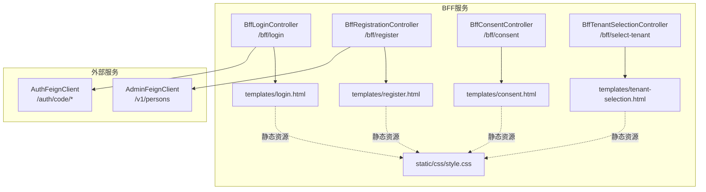
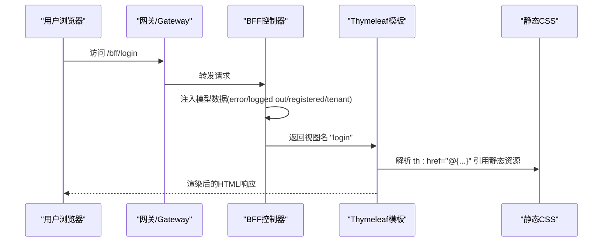
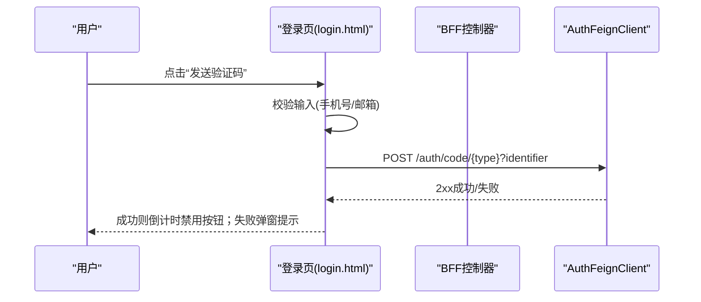
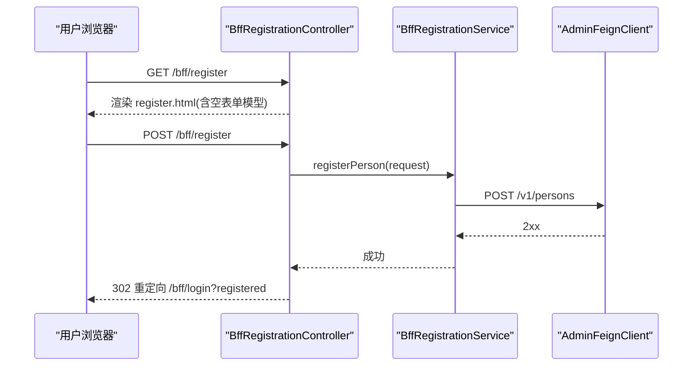
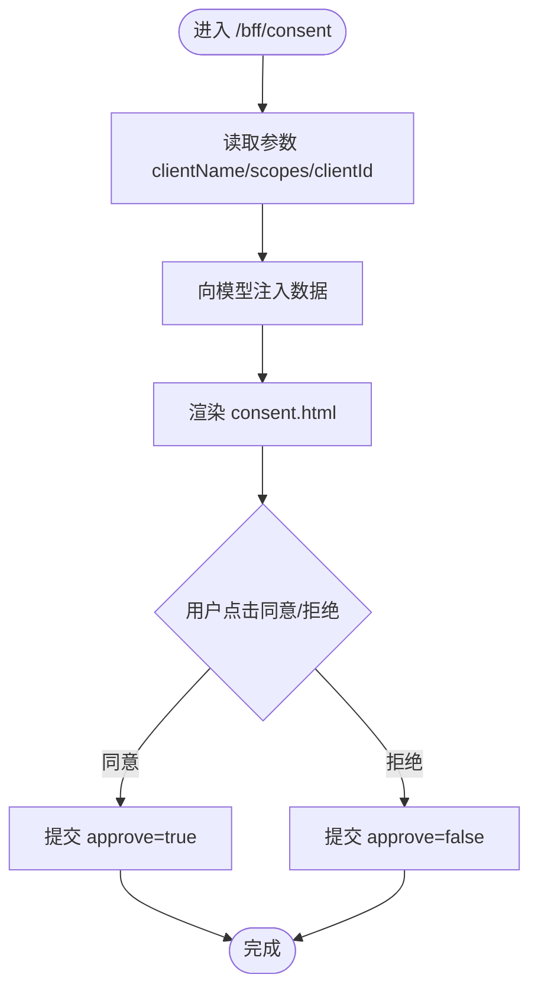
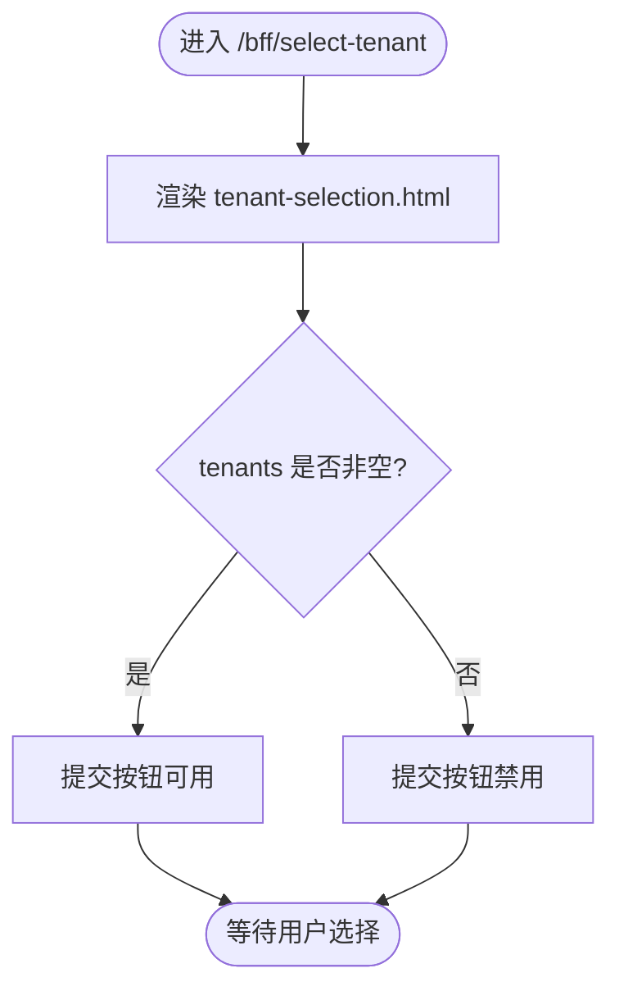
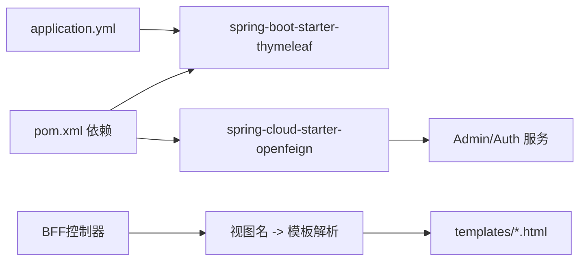

# 模板引擎与页面渲染

<cite>
**本文引用的文件**
- [application.yml](file://iam-bff-server/src/main/resources/application.yml)
- [BffWebMvcConfig.java](file://iam-bff-server/src/main/java/iam/platform/bff/infrastructure/config/BffWebMvcConfig.java)
- [BffLoginController.java](file://iam-bff-server/src/main/java/iam/platform/bff/interfaces/web/BffLoginController.java)
- [BffRegistrationController.java](file://iam-bff-server/src/main/java/iam/platform/bff/interfaces/web/BffRegistrationController.java)
- [BffConsentController.java](file://iam-bff-server/src/main/java/iam/platform/bff/interfaces/web/BffConsentController.java)
- [BffTenantSelectionController.java](file://iam-bff-server/src/main/java/iam/platform/bff/interfaces/web/BffTenantSelectionController.java)
- [BffRegistrationService.java](file://iam-bff-server/src/main/java/iam/platform/bff/application/service/BffRegistrationService.java)
- [AdminFeignClient.java](file://iam-bff-server/src/main/java/iam/platform/bff/infrastructure/client/AdminFeignClient.java)
- [AuthFeignClient.java](file://iam-bff-server/src/main/java/iam/platform/bff/infrastructure/client/AuthFeignClient.java)
- [CreatePersonRequest.java](file://iam-common/src/main/java/iam/platform/common/dto/request/CreatePersonRequest.java)
- [login.html](file://iam-bff-server/src/main/resources/templates/login.html)
- [register.html](file://iam-bff-server/src/main/resources/templates/register.html)
- [consent.html](file://iam-bff-server/src/main/resources/templates/consent.html)
- [tenant-selection.html](file://iam-bff-server/src/main/resources/templates/tenant-selection.html)
- [style.css](file://iam-bff-server/src/main/resources/static/css/style.css)
- [pom.xml](file://iam-bff-server/pom.xml)
</cite>

## 目录
1. [简介](#简介)
2. [项目结构](#项目结构)
3. [核心组件](#核心组件)
4. [架构总览](#架构总览)
5. [详细组件分析](#详细组件分析)
6. [依赖分析](#依赖分析)
7. [性能考虑](#性能考虑)
8. [故障排查指南](#故障排查指南)
9. [结论](#结论)
10. [附录](#附录)

## 简介
本章节面向BFF（Backend For Frontend）模板引擎与页面渲染模块，系统性阐述Thymeleaf模板在BFF中的配置与使用方式，覆盖模板文件组织结构、渲染机制、页面设计与实现、Thymeleaf表达式与标签用法、静态资源管理与样式设计、国际化支持与本地化处理建议，以及模板开发最佳实践与调试技巧。重点页面包括：登录页、注册页、授权同意页、租户选择页。

## 项目结构
BFF服务采用Spring Boot + Thymeleaf作为视图层，模板位于classpath:/templates目录，静态资源位于classpath:/static。Web层通过控制器暴露REST风格的路径，返回逻辑视图名，由Thymeleaf解析并渲染HTML。

图表来源
- [BffLoginController.java:18-48](file://iam-bff-server/src/main/java/iam/platform/bff/interfaces/web/BffLoginController.java#L18-L48)
- [BffRegistrationController.java:21-38](file://iam-bff-server/src/main/java/iam/platform/bff/interfaces/web/BffRegistrationController.java#L21-L38)
- [BffConsentController.java:16-33](file://iam-bff-server/src/main/java/iam/platform/bff/interfaces/web/BffConsentController.java#L16-L33)
- [BffTenantSelectionController.java:15-20](file://iam-bff-server/src/main/java/iam/platform/bff/interfaces/web/BffTenantSelectionController.java#L15-L20)
- [login.html:1-341](file://iam-bff-server/src/main/resources/templates/login.html#L1-L341)
- [register.html:1-64](file://iam-bff-server/src/main/resources/templates/register.html#L1-L64)
- [consent.html:1-34](file://iam-bff-server/src/main/resources/templates/consent.html#L1-L34)
- [tenant-selection.html:1-238](file://iam-bff-server/src/main/resources/templates/tenant-selection.html#L1-L238)
- [style.css:1-171](file://iam-bff-server/src/main/resources/static/css/style.css#L1-L171)
- [AdminFeignClient.java:13-24](file://iam-bff-server/src/main/java/iam/platform/bff/infrastructure/client/AdminFeignClient.java#L13-L24)
- [AuthFeignClient.java:12-29](file://iam-bff-server/src/main/java/iam/platform/bff/infrastructure/client/AuthFeignClient.java#L12-L29)

章节来源
- [application.yml:10-23](file://iam-bff-server/src/main/resources/application.yml#L10-L23)
- [BffWebMvcConfig.java:10-22](file://iam-bff-server/src/main/java/iam/platform/bff/infrastructure/config/BffWebMvcConfig.java#L10-L22)
- [pom.xml:26-33](file://iam-bff-server/pom.xml#L26-L33)

## 核心组件
- 视图引擎配置：Thymeleaf前缀与后缀、缓存策略等在application.yml中集中配置，确保模板加载与渲染行为一致。
- 控制器层：四个页面控制器分别负责渲染登录、注册、授权同意、租户选择页面，并向模型注入必要的数据。
- 模板层：Thymeleaf模板通过表达式绑定数据、条件判断、循环渲染；页面包含内联样式与外链CSS，统一使用主题色变量。
- 客户端层：Feign客户端调用Admin与Auth服务，用于注册与验证码发送等业务。

章节来源
- [application.yml:15-18](file://iam-bff-server/src/main/resources/application.yml#L15-L18)
- [BffLoginController.java:18-48](file://iam-bff-server/src/main/java/iam/platform/bff/interfaces/web/BffLoginController.java#L18-L48)
- [BffRegistrationController.java:21-38](file://iam-bff-server/src/main/java/iam/platform/bff/interfaces/web/BffRegistrationController.java#L21-L38)
- [BffConsentController.java:16-33](file://iam-bff-server/src/main/java/iam/platform/bff/interfaces/web/BffConsentController.java#L16-L33)
- [BffTenantSelectionController.java:15-20](file://iam-bff-server/src/main/java/iam/platform/bff/interfaces/web/BffTenantSelectionController.java#L15-L20)
- [login.html:1-341](file://iam-bff-server/src/main/resources/templates/login.html#L1-L341)
- [register.html:1-64](file://iam-bff-server/src/main/resources/templates/register.html#L1-L64)
- [consent.html:1-34](file://iam-bff-server/src/main/resources/templates/consent.html#L1-L34)
- [tenant-selection.html:1-238](file://iam-bff-server/src/main/resources/templates/tenant-selection.html#L1-L238)
- [style.css:1-171](file://iam-bff-server/src/main/resources/static/css/style.css#L1-L171)
- [AdminFeignClient.java:13-24](file://iam-bff-server/src/main/java/iam/platform/bff/infrastructure/client/AdminFeignClient.java#L13-L24)
- [AuthFeignClient.java:12-29](file://iam-bff-server/src/main/java/iam/platform/bff/infrastructure/client/AuthFeignClient.java#L12-L29)

## 架构总览
下图展示从浏览器请求到Thymeleaf渲染的关键交互流程，包括控制器、模型数据注入、模板渲染与静态资源加载。

图表来源
- [BffLoginController.java:18-48](file://iam-bff-server/src/main/java/iam/platform/bff/interfaces/web/BffLoginController.java#L18-L48)
- [login.html:1-341](file://iam-bff-server/src/main/resources/templates/login.html#L1-L341)
- [style.css:1-171](file://iam-bff-server/src/main/resources/static/css/style.css#L1-L171)

## 详细组件分析

### 登录页面（login.html）
- 设计要点
  - 多登录方式切换：密码登录、短信/邮箱验证码登录、第三方OAuth2社交登录。
  - 动态表单切换：通过JavaScript根据选中方式显示对应字段段落，并设置隐藏域标识当前方法。
  - 验证码发送：支持短信与邮箱两种通道，前端发起异步请求，带倒计时防刷。
  - 反馈提示：基于URL参数注入错误、登出、注册成功等消息，使用Thymeleaf条件渲染。
- Thymeleaf表达式与标签
  - 条件渲染：th:if 显示错误/成功/登出消息。
  - 链接生成：th:href="@{...}" 生成静态资源与路由链接。
  - 文本绑定：th:text 输出动态文本。
  - 表单字段：th:value/th:text 绑定模型数据。
- 静态资源与样式
  - 外链CSS：th:href="@{/bff/css/style.css}" 统一样式。
  - 内联样式：针对登录页布局与交互的局部样式。
- 交互流程（验证码发送）

图表来源
- [login.html:267-322](file://iam-bff-server/src/main/resources/templates/login.html#L267-L322)
- [AuthFeignClient.java:19-29](file://iam-bff-server/src/main/java/iam/platform/bff/infrastructure/client/AuthFeignClient.java#L19-L29)
- [BffLoginController.java:18-48](file://iam-bff-server/src/main/java/iam/platform/bff/interfaces/web/BffLoginController.java#L18-L48)

章节来源
- [login.html:1-341](file://iam-bff-server/src/main/resources/templates/login.html#L1-L341)
- [BffLoginController.java:18-48](file://iam-bff-server/src/main/java/iam/platform/bff/interfaces/web/BffLoginController.java#L18-L48)
- [AuthFeignClient.java:12-29](file://iam-bff-server/src/main/java/iam/platform/bff/infrastructure/client/AuthFeignClient.java#L12-L29)

### 注册页面（register.html）
- 设计要点
  - 基础信息收集：用户名、邮箱、昵称、密码、确认密码。
  - 前端校验：确认密码一致性检查。
  - 错误反馈：基于模型注入的错误消息进行条件渲染。
- Thymeleaf表达式与标签
  - 条件渲染：th:if 显示错误消息。
  - 表单绑定：th:action/@{...} 生成提交地址；th:href 生成跳转链接。
  - 字段验证：required/minlength/maxlength 等HTML5属性配合后端校验。
- 后端流程
  - GET：初始化表单模型对象。
  - POST：调用注册服务，成功后重定向至登录页并携带成功参数。

图表来源
- [BffRegistrationController.java:21-38](file://iam-bff-server/src/main/java/iam/platform/bff/interfaces/web/BffRegistrationController.java#L21-L38)
- [BffRegistrationService.java:20-29](file://iam-bff-server/src/main/java/iam/platform/bff/application/service/BffRegistrationService.java#L20-L29)
- [AdminFeignClient.java:13-24](file://iam-bff-server/src/main/java/iam/platform/bff/infrastructure/client/AdminFeignClient.java#L13-L24)
- [register.html:1-64](file://iam-bff-server/src/main/resources/templates/register.html#L1-L64)

章节来源
- [register.html:1-64](file://iam-bff-server/src/main/resources/templates/register.html#L1-L64)
- [BffRegistrationController.java:21-38](file://iam-bff-server/src/main/java/iam/platform/bff/interfaces/web/BffRegistrationController.java#L21-L38)
- [BffRegistrationService.java:20-29](file://iam-bff-server/src/main/java/iam/platform/bff/application/service/BffRegistrationService.java#L20-L29)
- [AdminFeignClient.java:13-24](file://iam-bff-server/src/main/java/iam/platform/bff/infrastructure/client/AdminFeignClient.java#L13-L24)
- [CreatePersonRequest.java:11-36](file://iam-common/src/main/java/iam/platform/common/dto/request/CreatePersonRequest.java#L11-L36)

### 授权同意页面（consent.html）
- 设计要点
  - 展示客户端名称与请求的作用域列表。
  - 提供“同意/拒绝”两个提交选项，传递approve参数。
- Thymeleaf表达式与标签
  - 数组拆分：#strings.arraySplit(scopes, ",") 进行循环渲染。
  - 隐藏域：th:value 绑定clientId。
  - 文本绑定：th:text 输出clientName与scope项。

图表来源
- [BffConsentController.java:16-33](file://iam-bff-server/src/main/java/iam/platform/bff/interfaces/web/BffConsentController.java#L16-L33)
- [consent.html:1-34](file://iam-bff-server/src/main/resources/templates/consent.html#L1-L34)

章节来源
- [consent.html:1-34](file://iam-bff-server/src/main/resources/templates/consent.html#L1-L34)
- [BffConsentController.java:16-33](file://iam-bff-server/src/main/java/iam/platform/bff/interfaces/web/BffConsentController.java#L16-L33)

### 租户选择页面（tenant-selection.html）
- 设计要点
  - 列表式租户卡片：名称、编码、工号（可选）、状态。
  - 单选框选择：提交tenantAccountId。
  - 按钮禁用：当无可用租户时禁用提交。
- Thymeleaf表达式与标签
  - 循环渲染：th:each 遍历 tenants。
  - 字符串截取：#strings.substring 获取首字母作为图标内容。
  - 条件渲染：th:if 判断字段是否存在。
  - 禁用控制：th:disabled 基于集合是否为空。
- 当前实现
  - 控制器暂未从下游服务拉取租户列表，页面保留占位以便后续扩展。

图表来源
- [BffTenantSelectionController.java:15-20](file://iam-bff-server/src/main/java/iam/platform/bff/interfaces/web/BffTenantSelectionController.java#L15-L20)
- [tenant-selection.html:1-238](file://iam-bff-server/src/main/resources/templates/tenant-selection.html#L1-L238)

章节来源
- [tenant-selection.html:1-238](file://iam-bff-server/src/main/resources/templates/tenant-selection.html#L1-L238)
- [BffTenantSelectionController.java:15-20](file://iam-bff-server/src/main/java/iam/platform/bff/interfaces/web/BffTenantSelectionController.java#L15-L20)

### Thymeleaf表达式与标签使用清单
- 条件渲染
  - th:if：根据布尔值显示/隐藏元素。
- 数据绑定
  - th:text：输出文本内容。
  - th:value：设置表单字段值。
  - th:href：生成URL（支持/不支持上下文路径取决于配置）。
- 列表渲染
  - th:each：遍历集合，结合字符串工具函数进行分割或截取。
- 表单与交互
  - th:action/@{...}：生成表单提交地址与链接。
  - th:disabled：根据条件禁用按钮。
  - th:for/th:ids：配合单选/复选框。
- 工具函数
  - #strings.arraySplit：按分隔符拆分字符串为数组。
  - #strings.substring：截取子串。

章节来源
- [login.html:144-151](file://iam-bff-server/src/main/resources/templates/login.html#L144-L151)
- [login.html:161-208](file://iam-bff-server/src/main/resources/templates/login.html#L161-L208)
- [register.html:14-14](file://iam-bff-server/src/main/resources/templates/register.html#L14-L14)
- [consent.html:16-21](file://iam-bff-server/src/main/resources/templates/consent.html#L16-L21)
- [consent.html:23-28](file://iam-bff-server/src/main/resources/templates/consent.html#L23-L28)
- [tenant-selection.html:195-214](file://iam-bff-server/src/main/resources/templates/tenant-selection.html#L195-L214)
- [tenant-selection.html:216-218](file://iam-bff-server/src/main/resources/templates/tenant-selection.html#L216-L218)

### 静态资源管理与CSS设计
- 资源定位
  - 模板通过th:href="@{/bff/css/style.css}" 引用静态资源，实际由Spring静态资源映射提供。
- 主题化设计
  - 使用CSS变量定义主色、次色、边框、背景等，便于统一风格与夜间模式扩展。
- 结构化样式
  - 通用容器、卡片、表单组、按钮、警告提示、作用域列表等类名规范，提升可维护性。
- 响应式与交互
  - 基于Flex布局与盒阴影，提供良好的视觉层次与交互反馈。

章节来源
- [login.html:8-8](file://iam-bff-server/src/main/resources/templates/login.html#L8-L8)
- [register.html:7-7](file://iam-bff-server/src/main/resources/templates/register.html#L7-L7)
- [consent.html:7-7](file://iam-bff-server/src/main/resources/templates/consent.html#L7-L7)
- [tenant-selection.html:178-178](file://iam-bff-server/src/main/resources/templates/tenant-selection.html#L178-L178)
- [style.css:1-171](file://iam-bff-server/src/main/resources/static/css/style.css#L1-L171)

### 国际化支持与本地化处理
- 模板侧建议
  - 使用th:text="#{key}" 与th:with="${#locale}" 结合，将语言环境注入到模板上下文。
  - 对固定文案（如按钮、提示、标题）统一抽取为消息键，便于多语言替换。
- 后端侧建议
  - 在控制器中通过LocaleResolver获取区域信息，注入到Model。
  - 配置MessageSource与拦截器，确保模板渲染时具备正确的语言上下文。
- 实施要点
  - 将所有用户可见文本迁移到messages_xx.properties文件。
  - 在模板中仅使用消息键，避免硬编码中文。

[本节为概念性指导，不直接分析具体文件，故无章节来源]

## 依赖分析
- 模板引擎依赖
  - spring-boot-starter-thymeleaf 已在BFF服务中声明，确保Thymeleaf自动装配与视图解析。
- 控制器与模板
  - 控制器方法返回视图名，交由Thymeleaf解析为模板文件（前缀/后缀由application.yml配置）。
- 客户端依赖
  - OpenFeign用于调用Admin与Auth服务，注册流程与验证码发送依赖这些客户端接口。
- CORS与静态资源
  - WebMvcConfig允许本地开发跨域访问；静态资源默认由Spring Boot提供。

图表来源
- [pom.xml:26-33](file://iam-bff-server/pom.xml#L26-L33)
- [application.yml:15-18](file://iam-bff-server/src/main/resources/application.yml#L15-L18)
- [BffRegistrationController.java:21-38](file://iam-bff-server/src/main/java/iam/platform/bff/interfaces/web/BffRegistrationController.java#L21-L38)
- [AdminFeignClient.java:13-24](file://iam-bff-server/src/main/java/iam/platform/bff/infrastructure/client/AdminFeignClient.java#L13-L24)
- [AuthFeignClient.java:12-29](file://iam-bff-server/src/main/java/iam/platform/bff/infrastructure/client/AuthFeignClient.java#L12-L29)

章节来源
- [pom.xml:26-33](file://iam-bff-server/pom.xml#L26-L33)
- [application.yml:15-18](file://iam-bff-server/src/main/resources/application.yml#L15-L18)
- [BffWebMvcConfig.java:14-20](file://iam-bff-server/src/main/java/iam/platform/bff/infrastructure/config/BffWebMvcConfig.java#L14-L20)

## 性能考虑
- 模板缓存
  - application.yml已启用Thymeleaf缓存，生产环境建议保持开启以减少模板解析开销。
- 静态资源优化
  - 生产部署时建议启用Gzip压缩与CDN缓存，合理设置Cache-Control。
- 请求路径与负载
  - 登录页验证码发送为独立接口，避免阻塞主表单提交；建议对发送频率做限流。
- 渲染复杂度
  - 租户列表若数据量大，建议后端分页或懒加载，前端虚拟滚动优化体验。

[本节提供一般性建议，不直接分析具体文件，故无章节来源]

## 故障排查指南
- 页面空白或模板未找到
  - 检查视图名与模板文件名是否一致，确认前缀/后缀配置正确。
  - 查看日志中是否有模板解析异常。
- 静态资源404
  - 确认th:href路径与实际静态资源位置匹配；开发环境下允许跨域访问。
- 表单提交失败
  - 检查控制器参数绑定与模型注入；注册流程需确认Admin服务返回状态。
- 验证码发送失败
  - 检查Auth服务接口连通性与超时配置；前端捕获异常并提示用户。
- 国际化无效
  - 确保消息键存在且Locale上下文正确注入到模板。

章节来源
- [application.yml:15-18](file://iam-bff-server/src/main/resources/application.yml#L15-L18)
- [BffRegistrationController.java:27-38](file://iam-bff-server/src/main/java/iam/platform/bff/interfaces/web/BffRegistrationController.java#L27-L38)
- [BffLoginController.java:36-45](file://iam-bff-server/src/main/java/iam/platform/bff/interfaces/web/BffLoginController.java#L36-L45)
- [AuthFeignClient.java:19-29](file://iam-bff-server/src/main/java/iam/platform/bff/infrastructure/client/AuthFeignClient.java#L19-L29)

## 结论
BFF模板引擎与页面渲染模块以Thymeleaf为核心，结合控制器与Feign客户端，实现了登录、注册、授权同意与租户选择等关键页面的快速交付。通过统一的CSS变量体系与清晰的模板结构，提升了可维护性与可扩展性。建议在后续迭代中完善租户列表数据拉取、国际化消息键迁移与静态资源性能优化，进一步提升用户体验与系统稳定性。

## 附录
- 开发最佳实践
  - 所有用户可见文本使用消息键，避免硬编码。
  - 表单字段添加最小必要校验，前后端协同保障数据质量。
  - 模板中尽量使用语义化标签与可访问性属性。
- 调试技巧
  - 使用浏览器开发者工具观察网络请求与模板渲染结果。
  - 在application.yml临时关闭Thymeleaf缓存以加速迭代。
  - 对关键接口增加日志与追踪，便于问题定位。

[本节为概念性总结，不直接分析具体文件，故无章节来源]