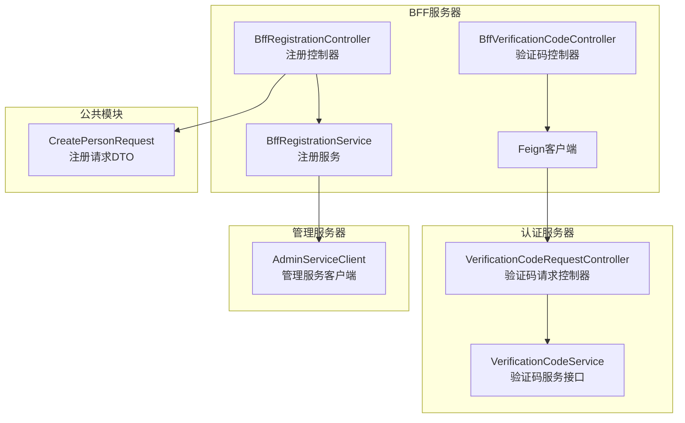
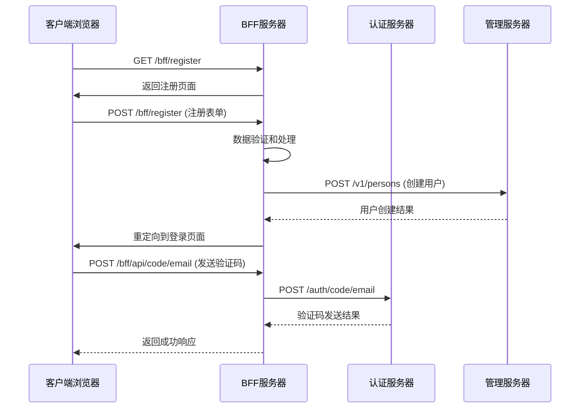
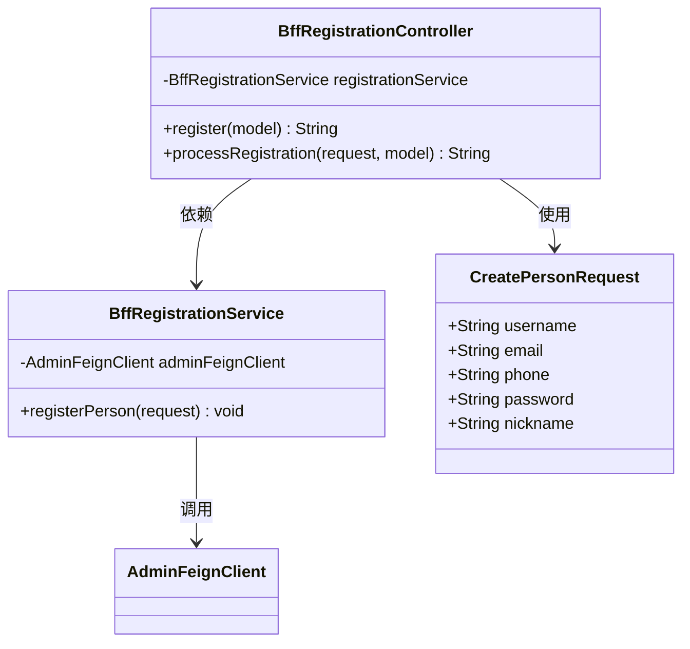
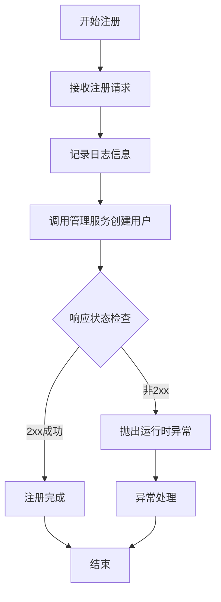
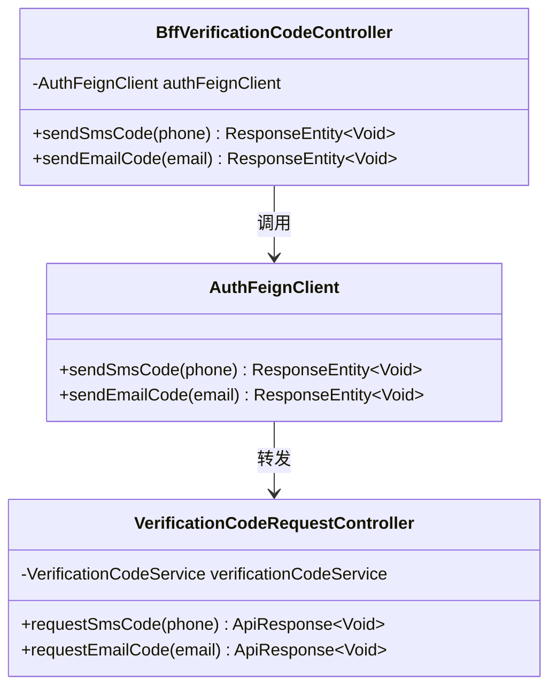
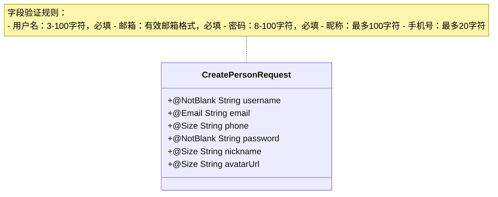
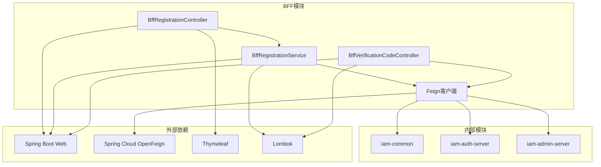

# 注册服务实现

<cite>
**本文档引用的文件**
- [BffRegistrationService.java](file://iam-bff-server/src/main/java/iam/platform/bff/application/service/BffRegistrationService.java)
- [BffRegistrationController.java](file://iam-bff-server/src/main/java/iam/platform/bff/interfaces/web/BffRegistrationController.java)
- [BffVerificationCodeController.java](file://iam-bff-server/src/main/java/iam/platform/bff/interfaces/rest/BffVerificationCodeController.java)
- [AdminFeignClient.java](file://iam-bff-server/src/main/java/iam/platform/bff/infrastructure/client/AdminFeignClient.java)
- [AuthFeignClient.java](file://iam-bff-server/src/main/java/iam/platform/bff/infrastructure/client/AuthFeignClient.java)
- [FeignClientConfig.java](file://iam-bff-server/src/main/java/iam/platform/bff/infrastructure/config/FeignClientConfig.java)
- [BffWebMvcConfig.java](file://iam-bff-server/src/main/java/iam/platform/bff/infrastructure/config/BffWebMvcConfig.java)
- [CreatePersonRequest.java](file://iam-common/src/main/java/iam/platform/common/dto/request/CreatePersonRequest.java)
- [VerificationCodeRequestController.java](file://iam-auth-server/src/main/java/iam/platform/auth/interfaces/rest/VerificationCodeRequestController.java)
- [VerificationCodeService.java](file://iam-auth-server/src/main/java/iam/platform/auth/domain/service/VerificationCodeService.java)
- [RegistrationController.java](file://iam-auth-server/src/main/java/iam/platform/auth/interfaces/web/RegistrationController.java)
- [register.html](file://iam-bff-server/src/main/resources/templates/register.html)
- [login.html](file://iam-bff-server/src/main/resources/templates/login.html)
- [application.yml](file://iam-bff-server/src/main/resources/application.yml)
</cite>

## 目录
1. [简介](#简介)
2. [项目结构](#项目结构)
3. [核心组件](#核心组件)
4. [架构概览](#架构概览)
5. [详细组件分析](#详细组件分析)
6. [依赖关系分析](#依赖关系分析)
7. [性能考虑](#性能考虑)
8. [故障排除指南](#故障排除指南)
9. [结论](#结论)
10. [附录](#附录)

## 简介

本文档详细介绍了IAM平台中BFF（Backend For Frontend）注册服务实现模块。该模块通过BFF层简化了前端注册流程，提供了友好的用户体验，并实现了与后端认证服务器和管理服务器的协调工作。

BFF注册服务的核心目标是：
- 为前端提供简化的注册入口
- 处理用户注册表单的数据验证
- 协调验证码服务的生成、发送和验证
- 与后端服务进行安全可靠的通信
- 提供一致的用户体验和错误处理机制

## 项目结构

BFF注册服务实现位于`iam-bff-server`模块中，采用分层架构设计：

**图表来源**
- [BffRegistrationController.java:1-40](file://iam-bff-server/src/main/java/iam/platform/bff/interfaces/web/BffRegistrationController.java#L1-40)
- [BffRegistrationService.java:1-31](file://iam-bff-server/src/main/java/iam/platform/bff/application/service/BffRegistrationService.java#L1-31)
- [BffVerificationCodeController.java:1-39](file://iam-bff-server/src/main/java/iam/platform/bff/interfaces/rest/BffVerificationCodeController.java#L1-39)

**章节来源**
- [BffRegistrationController.java:1-40](file://iam-bff-server/src/main/java/iam/platform/bff/interfaces/web/BffRegistrationController.java#L1-40)
- [BffRegistrationService.java:1-31](file://iam-bff-server/src/main/java/iam/platform/bff/application/service/BffRegistrationService.java#L1-31)
- [BffVerificationCodeController.java:1-39](file://iam-bff-server/src/main/java/iam/platform/bff/interfaces/rest/BffVerificationCodeController.java#L1-39)

## 核心组件

### 注册服务层

注册服务层负责处理用户注册的核心业务逻辑，主要包含以下关键组件：

#### BffRegistrationService
注册服务是BFF层的核心业务组件，负责协调用户注册流程：

- **职责**：处理用户注册请求，调用管理服务创建新用户
- **数据流**：接收注册请求 → 调用管理服务 → 处理响应结果
- **错误处理**：捕获并转换服务调用异常

#### BffRegistrationController
注册控制器处理前端注册页面的HTTP请求：

- **职责**：提供注册页面 → 处理注册表单提交 → 重定向到登录页面
- **表单处理**：使用Spring MVC模型绑定处理注册表单
- **验证机制**：集成Bean Validation进行数据验证

#### BffVerificationCodeController
验证码控制器处理验证码相关的REST API请求：

- **职责**：转发验证码发送请求到认证服务
- **支持类型**：同时支持短信和邮箱验证码
- **统一接口**：为前端提供统一的验证码服务访问点

**章节来源**
- [BffRegistrationService.java:10-30](file://iam-bff-server/src/main/java/iam/platform/bff/application/service/BffRegistrationService.java#L10-30)
- [BffRegistrationController.java:11-39](file://iam-bff-server/src/main/java/iam/platform/bff/interfaces/web/BffRegistrationController.java#L11-39)
- [BffVerificationCodeController.java:9-38](file://iam-bff-server/src/main/java/iam/platform/bff/interfaces/rest/BffVerificationCodeController.java#L9-38)

## 架构概览

BFF注册服务采用微服务架构中的BFF模式，通过中间层简化前端与后端服务的交互：

**图表来源**
- [BffRegistrationController.java:21-38](file://iam-bff-server/src/main/java/iam/platform/bff/interfaces/web/BffRegistrationController.java#L21-38)
- [BffRegistrationService.java:23-29](file://iam-bff-server/src/main/java/iam/platform/bff/application/service/BffRegistrationService.java#L23-29)
- [BffVerificationCodeController.java:24-37](file://iam-bff-server/src/main/java/iam/platform/bff/interfaces/rest/BffVerificationCodeController.java#L24-37)

### 服务交互流程

系统的服务交互遵循清晰的分层架构：

1. **前端交互层**：通过Thymeleaf模板提供用户界面
2. **BFF协调层**：处理业务逻辑和跨服务协调
3. **服务适配层**：通过Feign客户端与后端服务通信
4. **后端服务层**：提供具体的业务功能

**章节来源**
- [BffRegistrationController.java:14-39](file://iam-bff-server/src/main/java/iam/platform/bff/interfaces/web/BffRegistrationController.java#L14-39)
- [BffRegistrationService.java:13-30](file://iam-bff-server/src/main/java/iam/platform/bff/application/service/BffRegistrationService.java#L13-30)
- [BffVerificationCodeController.java:13-38](file://iam-bff-server/src/main/java/iam/platform/bff/interfaces/rest/BffVerificationCodeController.java#L13-38)

## 详细组件分析

### 注册控制器分析

注册控制器是用户注册流程的入口点，负责处理注册页面的显示和表单提交：

**图表来源**
- [BffRegistrationController.java:17-39](file://iam-bff-server/src/main/java/iam/platform/bff/interfaces/web/BffRegistrationController.java#L17-39)
- [BffRegistrationService.java:16-30](file://iam-bff-server/src/main/java/iam/platform/bff/application/service/BffRegistrationService.java#L16-30)
- [CreatePersonRequest.java:15-36](file://iam-common/src/main/java/iam/platform/common/dto/request/CreatePersonRequest.java#L15-36)

#### 控制器工作流程

注册控制器的处理流程如下：

1. **GET请求处理**：加载注册页面，初始化表单对象
2. **POST请求处理**：验证表单数据，调用注册服务
3. **错误处理**：捕获异常，返回错误信息
4. **成功重定向**：注册成功后重定向到登录页面

**章节来源**
- [BffRegistrationController.java:21-38](file://iam-bff-server/src/main/java/iam/platform/bff/interfaces/web/BffRegistrationController.java#L21-38)

### 注册服务分析

注册服务是BFF层的核心业务组件，负责协调用户注册的完整流程：

**图表来源**
- [BffRegistrationService.java:23-29](file://iam-bff-server/src/main/java/iam/platform/bff/application/service/BffRegistrationService.java#L23-29)

#### 服务实现特点

- **简单直接**：专注于用户创建业务逻辑
- **错误处理**：对非成功响应进行异常转换
- **日志记录**：提供完整的操作日志
- **依赖注入**：通过构造函数注入Feign客户端

**章节来源**
- [BffRegistrationService.java:20-29](file://iam-bff-server/src/main/java/iam/platform/bff/application/service/BffRegistrationService.java#L20-29)

### 验证码服务分析

验证码服务通过BFF层提供统一的验证码发送接口：

**图表来源**
- [BffVerificationCodeController.java:17-38](file://iam-bff-server/src/main/java/iam/platform/bff/interfaces/rest/BffVerificationCodeController.java#L17-38)
- [AuthFeignClient.java:12-30](file://iam-bff-server/src/main/java/iam/platform/bff/infrastructure/client/AuthFeignClient.java#L12-30)
- [VerificationCodeRequestController.java:15-30](file://iam-auth-server/src/main/java/iam/platform/auth/interfaces/rest/VerificationCodeRequestController.java#L15-30)

#### 验证码处理流程

验证码服务支持两种类型的验证码发送：

1. **短信验证码**：通过手机号发送验证码
2. **邮箱验证码**：通过邮箱地址发送验证码

每种类型都包含完整的发送和验证机制。

**章节来源**
- [BffVerificationCodeController.java:21-37](file://iam-bff-server/src/main/java/iam/platform/bff/interfaces/rest/BffVerificationCodeController.java#L21-37)
- [VerificationCodeRequestController.java:19-29](file://iam-auth-server/src/main/java/iam/platform/auth/interfaces/rest/VerificationCodeRequestController.java#L19-29)

### 数据传输对象分析

注册请求使用标准的数据传输对象确保数据的一致性和验证：

**图表来源**
- [CreatePersonRequest.java:15-36](file://iam-common/src/main/java/iam/platform/common/dto/request/CreatePersonRequest.java#L15-36)

**章节来源**
- [CreatePersonRequest.java:16-35](file://iam-common/src/main/java/iam/platform/common/dto/request/CreatePersonRequest.java#L16-35)

## 依赖关系分析

BFF注册服务的依赖关系体现了清晰的分层架构：

**图表来源**
- [BffRegistrationController.java:1-10](file://iam-bff-server/src/main/java/iam/platform/bff/interfaces/web/BffRegistrationController.java#L1-10)
- [BffRegistrationService.java:1-8](file://iam-bff-server/src/main/java/iam/platform/bff/application/service/BffRegistrationService.java#L1-8)
- [BffVerificationCodeController.java:1-7](file://iam-bff-server/src/main/java/iam/platform/bff/interfaces/rest/BffVerificationCodeController.java#L1-7)

### 关键依赖特性

1. **Spring Cloud OpenFeign**：提供声明式的HTTP客户端
2. **Thymeleaf**：提供服务器端模板渲染
3. **Lombok**：减少样板代码，提高开发效率
4. **Bean Validation**：提供数据验证支持

**章节来源**
- [FeignClientConfig.java:1-52](file://iam-bff-server/src/main/java/iam/platform/bff/infrastructure/config/FeignClientConfig.java#L1-52)
- [BffWebMvcConfig.java:1-23](file://iam-bff-server/src/main/java/iam/platform/bff/infrastructure/config/BffWebMvcConfig.java#L1-23)

## 性能考虑

BFF注册服务在设计时充分考虑了性能优化：

### 连接池配置
- **连接超时**：1秒连接超时，3秒读取超时
- **并发处理**：支持高并发的注册请求处理
- **资源管理**：合理配置连接池大小避免资源浪费

### 缓存策略
- **模板缓存**：启用Thymeleaf模板缓存
- **静态资源**：CSS样式文件缓存优化
- **会话管理**：合理的会话超时设置

### 错误处理优化
- **快速失败**：对无效请求立即返回错误
- **降级策略**：服务不可用时的优雅降级
- **监控告警**：关键指标的实时监控

## 故障排除指南

### 常见问题及解决方案

#### 注册失败问题
**症状**：用户注册后收到失败提示
**可能原因**：
1. 管理服务不可用
2. 数据库连接异常
3. 重复用户名/邮箱

**排查步骤**：
1. 检查管理服务健康状态
2. 查看BFF服务日志
3. 验证数据库连接

#### 验证码发送失败
**症状**：验证码发送按钮无响应
**可能原因**：
1. 认证服务未启动
2. 网络连接问题
3. 配置参数错误

**排查步骤**：
1. 检查认证服务状态
2. 验证网络连通性
3. 确认服务配置

#### 表单验证错误
**症状**：提交表单时出现验证错误
**可能原因**：
1. 字段格式不正确
2. 必填字段缺失
3. 密码强度不足

**排查步骤**：
1. 检查前端验证规则
2. 查看后端验证错误
3. 确认数据格式要求

**章节来源**
- [BffRegistrationController.java:30-37](file://iam-bff-server/src/main/java/iam/platform/bff/interfaces/web/BffRegistrationController.java#L30-37)
- [FeignClientConfig.java:36-50](file://iam-bff-server/src/main/java/iam/platform/bff/infrastructure/config/FeignClientConfig.java#L36-50)

## 结论

BFF注册服务实现模块展现了现代微服务架构的最佳实践：

### 设计优势
1. **职责分离**：清晰的分层架构确保各组件职责明确
2. **扩展性强**：模块化设计便于功能扩展和维护
3. **用户体验**：通过BFF层简化前端交互，提升用户体验
4. **安全性**：统一的认证和授权机制确保系统安全

### 技术亮点
1. **声明式服务调用**：使用OpenFeign简化服务间通信
2. **统一错误处理**：标准化的异常处理机制
3. **配置驱动**：灵活的配置管理支持多环境部署
4. **可观测性**：完善的日志和监控支持

该实现为IAM平台提供了稳定可靠的用户注册能力，为后续的功能扩展奠定了坚实的基础。

## 附录

### 配置参考

#### 应用程序配置
- **端口设置**：默认9010端口
- **SSL配置**：支持HTTPS协议
- **模板配置**：Thymeleaf模板引擎配置
- **日志配置**：详细的日志输出级别

#### Feign客户端配置
- **连接超时**：1秒连接超时
- **读取超时**：3秒读取超时
- **请求头**：添加X-Source标识
- **错误处理**：自定义错误解码器

**章节来源**
- [application.yml:1-54](file://iam-bff-server/src/main/resources/application.yml#L1-54)
- [FeignClientConfig.java:17-31](file://iam-bff-server/src/main/java/iam/platform/bff/infrastructure/config/FeignClientConfig.java#L17-31)

### API参考

#### 注册API
- **URL**：`/bff/register`
- **方法**：GET/POST
- **功能**：显示注册页面和处理注册表单提交

#### 验证码API
- **URL**：`/bff/api/code/{type}`
- **方法**：POST
- **参数**：phone或email
- **功能**：发送验证码到指定联系方式