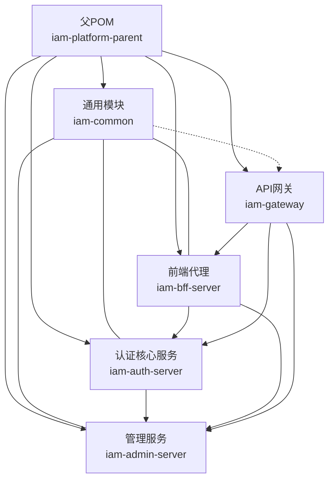
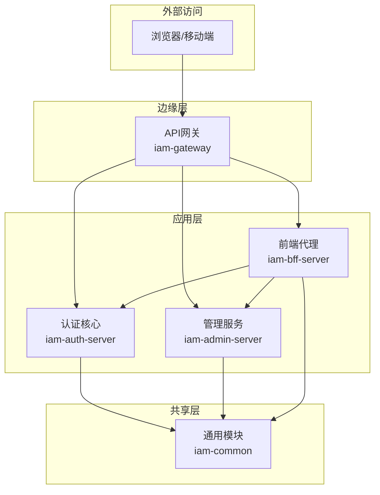
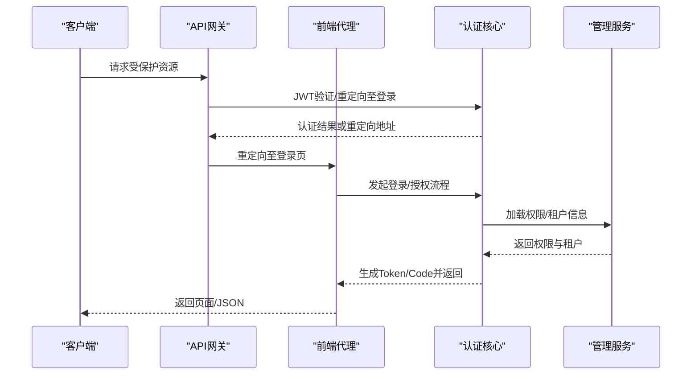
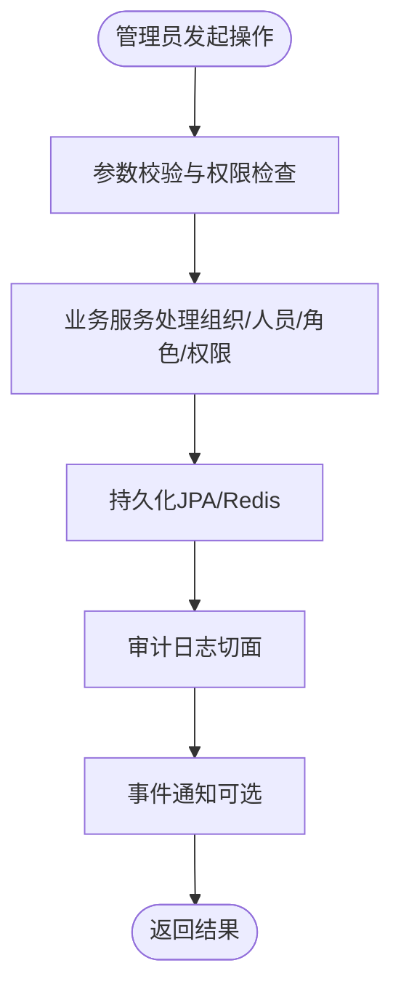
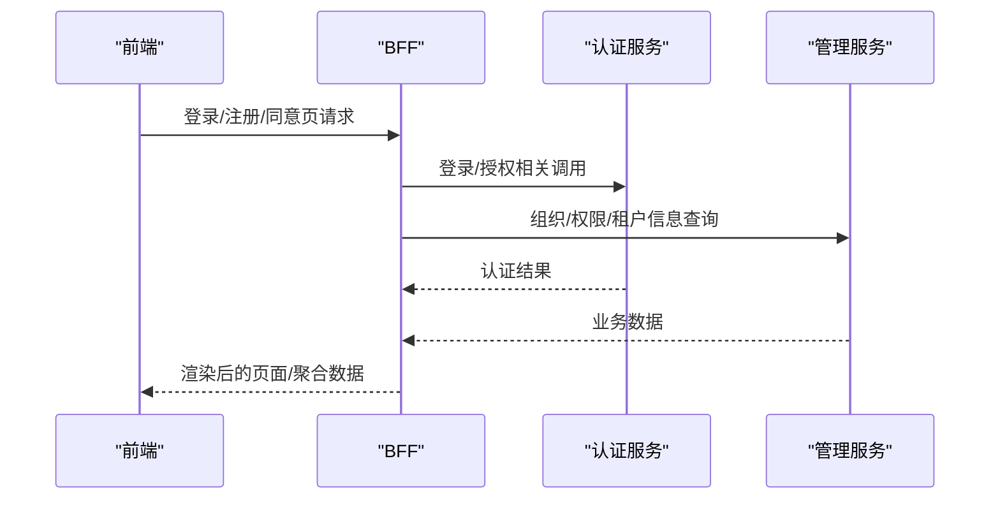
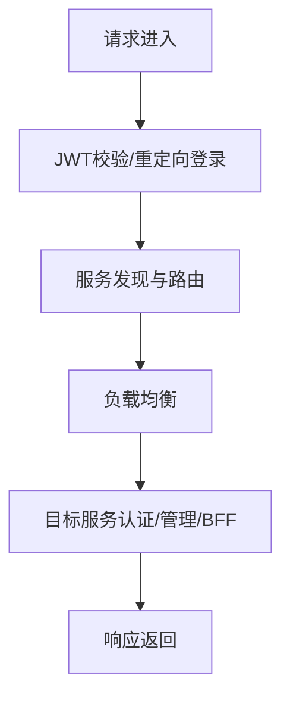
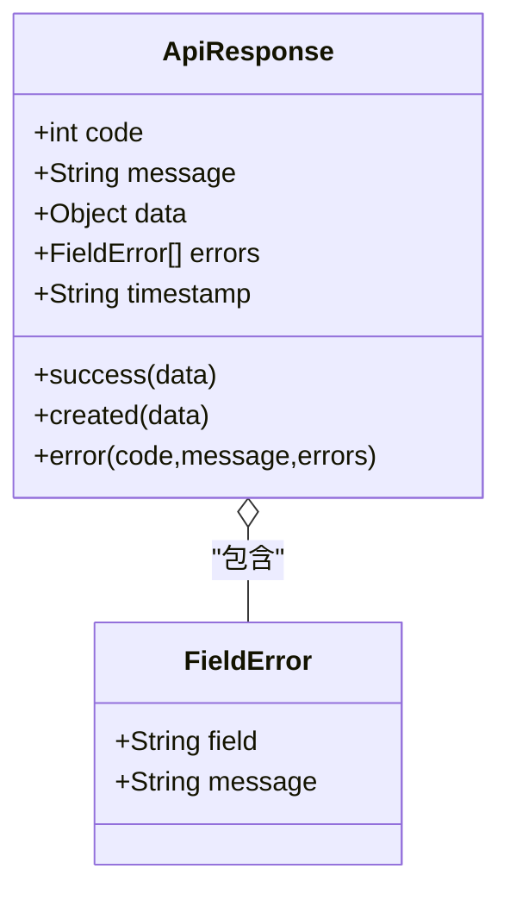
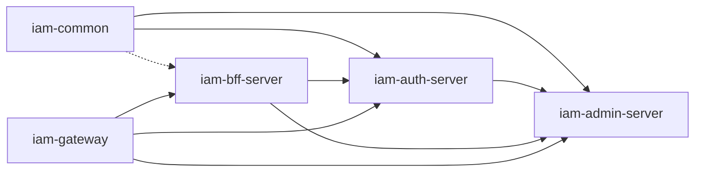

# 模块总览

<cite>
**本文引用的文件**
- [pom.xml](file://pom.xml)
- [iam-common\pom.xml](file://iam-common/pom.xml)
- [iam-auth-server\pom.xml](file://iam-auth-server/pom.xml)
- [iam-admin-server\pom.xml](file://iam-admin-server/pom.xml)
- [iam-bff-server\pom.xml](file://iam-bff-server/pom.xml)
- [iam-gateway\pom.xml](file://iam-gateway/pom.xml)
- [iam-common\src\main\java\iam\platform\common\api\ApiResponse.java](file://iam-common/src/main/java/iam/platform/common/api/ApiResponse.java)
- [iam-auth-server\src\main\java\iam\platform\auth\SsoAuthServerApplication.java](file://iam-auth-server/src/main/java/iam/platform/auth/SsoAuthServerApplication.java)
- [iam-admin-server\src\main\java\iam\platform\admin\SsoAdminServerApplication.java](file://iam-admin-server/src/main/java/iam/platform/admin/SsoAdminServerApplication.java)
- [iam-bff-server\src\main\java\iam\platform\bff\IamBffServerApplication.java](file://iam-bff-server/src/main/java/iam/platform/bff/IamBffServerApplication.java)
- [iam-gateway\src\main\java\iam\platform\gateway\IamGatewayApplication.java](file://iam-gateway/src/main/java/iam/platform/gateway/IamGatewayApplication.java)
- [iam-auth-server\bootstrap.yml](file://iam-auth-server/bootstrap.yml)
- [iam-admin-server\bootstrap.yml](file://iam-admin-server/bootstrap.yml)
- [iam-bff-server\bootstrap.yml](file://iam-bff-server/bootstrap.yml)
- [iam-gateway\bootstrap.yml](file://iam-gateway/bootstrap.yml)
- [docs\design\统一认证框架.md](file://docs/design/统一认证框架.md)
- [docs\design\Spring Authorization Server 原理与流程.md](file://docs/design/Spring Authorization Server 原理与流程.md)
</cite>

## 目录
1. [简介](#简介)
2. [项目结构](#项目结构)
3. [核心组件](#核心组件)
4. [架构总览](#架构总览)
5. [详细组件分析](#详细组件分析)
6. [依赖分析](#依赖分析)
7. [性能考虑](#性能考虑)
8. [故障排查指南](#故障排查指南)
9. [结论](#结论)
10. [附录](#附录)

## 简介
本文件面向IAM平台的模块化架构，系统性梳理五大核心模块：iam-common（通用模块）、iam-auth-server（认证核心服务）、iam-admin-server（管理服务）、iam-bff-server（前端代理）、iam-gateway（API网关）。文档从模块化设计目的与优势出发，阐明各模块在整体系统中的定位与职责，解释模块间的依赖关系与通信机制，并总结版本管理与构建策略（Maven多模块管理、依赖管理与打包发布流程），帮助读者快速理解平台整体设计与落地实践。

## 项目结构
平台采用Maven多模块聚合工程，父POM统一管理版本、依赖与插件；子模块按功能边界拆分，彼此低耦合、高内聚，便于团队并行开发与独立演进。

图示来源
- [pom.xml:21-27](file://pom.xml#L21-L27)
- [iam-common\pom.xml:14](file://iam-common/pom.xml#L14)
- [iam-auth-server\pom.xml:14](file://iam-auth-server/pom.xml#L14)
- [iam-admin-server\pom.xml:14](file://iam-admin-server/pom.xml#L14)
- [iam-bff-server\pom.xml:14](file://iam-bff-server/pom.xml#L14)
- [iam-gateway\pom.xml:13](file://iam-gateway/pom.xml#L13)

章节来源
- [pom.xml:21-27](file://pom.xml#L21-L27)
- [iam-common\pom.xml:14](file://iam-common/pom.xml#L14)
- [iam-auth-server\pom.xml:14](file://iam-auth-server/pom.xml#L14)
- [iam-admin-server\pom.xml:14](file://iam-admin-server/pom.xml#L14)
- [iam-bff-server\pom.xml:14](file://iam-bff-server/pom.xml#L14)
- [iam-gateway\pom.xml:13](file://iam-gateway/pom.xml#L13)

## 核心组件
- iam-common：提供跨模块共享的数据传输对象（DTO）、响应封装、枚举、值对象、异常体系与工具类，是所有业务模块的“基础设施”，确保数据契约一致与错误处理规范。
- iam-auth-server：基于Spring Authorization Server实现的OAuth2/OIDC认证中心，负责协议适配、认证策略、安全上下文建立、票据签发与会话治理，是SSO与第三方登录的核心。
- iam-admin-server：管理后台服务，提供组织、人员、角色、权限、审计等业务CRUD能力，内置Flyway进行数据库迁移，承担平台治理与运营支撑。
- iam-bff-server：前端代理服务，聚合后端能力、编排跨服务请求、处理登录/注册/同意页等前端交互，降低前端复杂度并提升安全性。
- iam-gateway：API网关，统一接入鉴权、限流、路由与可观测性，作为系统的唯一入口，屏蔽后端服务差异并提供统一的安全边界。

章节来源
- [iam-common\src\main\java\iam\platform\common\api\ApiResponse.java:18-50](file://iam-common/src/main/java/iam/platform/common/api/ApiResponse.java#L18-L50)
- [iam-auth-server\src\main\java\iam\platform\auth\SsoAuthServerApplication.java:9-12](file://iam-auth-server/src/main/java/iam/platform/auth/SsoAuthServerApplication.java#L9-L12)
- [iam-admin-server\src\main\java\iam\platform\admin\SsoAdminServerApplication.java:8-11](file://iam-admin-server/src/main/java/iam/platform/admin/SsoAdminServerApplication.java#L8-L11)
- [iam-bff-server\src\main\java\iam\platform\bff\IamBffServerApplication.java:8-10](file://iam-bff-server/src/main/java/iam/platform/bff/IamBffServerApplication.java#L8-L10)
- [iam-gateway\src\main\java\iam\platform\gateway\IamGatewayApplication.java:7-9](file://iam-gateway/src/main/java/iam/platform/gateway/IamGatewayApplication.java#L7-L9)

## 架构总览
平台采用“网关+多后端服务”的分布式架构。网关负责统一入口与横切能力；BFF承接前端交互并聚合后端服务；认证服务提供统一的身份认证与授权；管理服务承载平台治理；通用模块沉淀共性能力。

图示来源
- [iam-gateway\pom.xml:18-46](file://iam-gateway/pom.xml#L18-L46)
- [iam-bff-server\pom.xml:18-47](file://iam-bff-server/pom.xml#L18-L47)
- [iam-auth-server\pom.xml:18-73](file://iam-auth-server/pom.xml#L18-L73)
- [iam-admin-server\pom.xml:18-86](file://iam-admin-server/pom.xml#L18-L86)
- [iam-common\pom.xml:18-36](file://iam-common/pom.xml#L18-L36)

## 详细组件分析

### 认证核心服务（iam-auth-server）
- 设计思想：以“协议适配层-认证分发层-前/后处理管道-结果处理层”分层解耦，支持OIDC/SAML/CAS等多种协议，通过可插拔的认证策略满足密码、短信、LDAP、社交登录等多样化需求。
- 关键职责：
  - 协议适配：对OIDC、SAML、CAS进行适配与统一封装。
  - 认证分发：根据凭证类型选择对应策略。
  - 前/后处理管道：统一执行限流、风控、账户状态、租户解析、权限加载、审计等横切逻辑。
  - 结果处理：按协议生成Token、Code或Assertion，并进行智能重定向。
- 技术要点：基于Spring Authorization Server实现OIDC Provider；集成OpenSAML支持SAML；结合Redis实现分布式会话与限流；通过OpenFeign与管理服务交互。

图示来源
- [docs\design\统一认证框架.md:140-232](file://docs/design/统一认证框架.md#L140-L232)
- [docs\design\Spring Authorization Server 原理与流程.md:52-84](file://docs/design/Spring Authorization Server 原理与流程.md#L52-L84)
- [iam-auth-server\pom.xml:63-73](file://iam-auth-server/pom.xml#L63-L73)
- [iam-admin-server\pom.xml:65-69](file://iam-admin-server/pom.xml#L65-L69)

章节来源
- [iam-auth-server\src\main\java\iam\platform\auth\SsoAuthServerApplication.java:9-12](file://iam-auth-server/src/main/java/iam/platform/auth/SsoAuthServerApplication.java#L9-L12)
- [iam-auth-server\bootstrap.yml:1-10](file://iam-auth-server/bootstrap.yml#L1-L10)
- [docs\design\统一认证框架.md:140-232](file://docs/design/统一认证框架.md#L140-L232)
- [docs\design\Spring Authorization Server 原理与流程.md:52-84](file://docs/design/Spring Authorization Server 原理与流程.md#L52-L84)

### 管理服务（iam-admin-server）
- 设计思想：围绕组织、人员、角色、权限等实体提供完整的CRUD与治理能力，强调领域模型与仓储分离，配合审计与AOP横切，保证操作可追溯。
- 关键职责：
  - 领域建模：Application、Person、Role、Tenant等实体与映射。
  - 业务服务：组织层级、权限评估、人员唯一性、租户策略等。
  - 基础设施：JPA持久化、Redis缓存、OpenAPI文档、审计切面。
  - 运维支撑：Flyway数据库迁移、Actuator监控。
- 通信机制：通过OpenFeign与认证服务交互，如获取权限、租户解析等。

图示来源
- [iam-admin-server\pom.xml:18-86](file://iam-admin-server/pom.xml#L18-L86)
- [iam-admin-server\pom.xml:77-80](file://iam-admin-server/pom.xml#L77-L80)

章节来源
- [iam-admin-server\src\main\java\iam\platform\admin\SsoAdminServerApplication.java:8-11](file://iam-admin-server/src/main/java/iam/platform/admin/SsoAdminServerApplication.java#L8-L11)
- [iam-admin-server\bootstrap.yml:1-10](file://iam-admin-server/bootstrap.yml#L1-L10)

### 前端代理（iam-bff-server）
- 设计思想：以“前端友好、后端聚合”为目标，封装登录/注册/同意页等交互，聚合多个后端服务的响应，减少前端复杂度与网络往返。
- 关键职责：
  - 控制器：登录、注册、同意页、租户选择等页面控制器。
  - 客户端：通过OpenFeign调用认证与管理服务。
  - 配置：Web MVC与Feign客户端配置。
- 通信机制：与认证/管理服务通过OpenFeign进行声明式调用。

图示来源
- [iam-bff-server\pom.xml:18-47](file://iam-bff-server/pom.xml#L18-L47)
- [iam-bff-server\src\main\java\iam\platform\bff\IamBffServerApplication.java:8-10](file://iam-bff-server/src/main/java/iam/platform/bff/IamBffServerApplication.java#L8-L10)

章节来源
- [iam-bff-server\src\main\java\iam\platform\bff\IamBffServerApplication.java:8-10](file://iam-bff-server/src/main/java/iam/platform/bff/IamBffServerApplication.java#L8-L10)
- [iam-bff-server\bootstrap.yml:1-10](file://iam-bff-server/bootstrap.yml#L1-L10)

### API网关（iam-gateway）
- 设计思想：统一入口、统一鉴权、统一限流与可观测性，屏蔽后端差异，提供安全与稳定的服务边界。
- 关键职责：
  - 路由与负载均衡：基于Nacos与Spring Cloud LoadBalancer。
  - 安全：OAuth2客户端与资源服务器，JWT转换与校验。
  - 限流与熔断：结合Redis Reactive与Sentinel（通过依赖体现）。
  - 可观测性：Actuator、Prometheus、Zipkin链路追踪。
- 通信机制：与认证/管理/BFF服务通过服务发现与负载均衡进行交互。

图示来源
- [iam-gateway\pom.xml:18-80](file://iam-gateway/pom.xml#L18-L80)
- [iam-gateway\src\main\java\iam\platform\gateway\IamGatewayApplication.java:7-9](file://iam-gateway/src/main/java/iam/platform/gateway/IamGatewayApplication.java#L7-L9)

章节来源
- [iam-gateway\src\main\java\iam\platform\gateway\IamGatewayApplication.java:7-9](file://iam-gateway/src/main/java/iam/platform/gateway/IamGatewayApplication.java#L7-L9)
- [iam-gateway\bootstrap.yml:1-10](file://iam-gateway/bootstrap.yml#L1-L10)

### 通用模块（iam-common）
- 设计思想：沉淀跨模块的“最小可用”公共能力，避免重复造轮子，统一错误码、响应体、枚举与异常，降低模块间耦合。
- 关键职责：
  - 响应封装：统一的API响应体与字段错误封装。
  - DTO与枚举：请求/响应DTO、业务枚举（状态、权限动作、审计事件等）。
  - 异常体系：业务异常、访问拒绝、状态冲突等。
  - 工具类：Guard等辅助工具。
- 使用方式：其他模块通过依赖引入，无需重复实现。

图示来源
- [iam-common\src\main\java\iam\platform\common\api\ApiResponse.java:18-60](file://iam-common/src/main/java/iam/platform/common/api/ApiResponse.java#L18-L60)

章节来源
- [iam-common\src\main\java\iam\platform\common\api\ApiResponse.java:18-60](file://iam-common/src/main/java/iam/platform/common/api/ApiResponse.java#L18-L60)
- [iam-common\pom.xml:18-36](file://iam-common/pom.xml#L18-L36)

## 依赖分析
- 内部依赖：认证与管理服务均依赖通用模块；BFF同时依赖认证与管理；网关依赖全部后端服务；认证服务通过OpenFeign调用管理服务。
- 外部依赖：Spring Cloud生态（Nacos、OpenFeign、Gateway、LoadBalancer）、Spring Security（OAuth2/OIDC/CAS/LDAP/SAML）、PostgreSQL、Redis、Micrometer/Zipkin等。
- 版本管理：父POM集中管理Spring Cloud与Spring Cloud Alibaba版本，内部模块通过BOM统一版本，确保一致性。

图示来源
- [pom.xml:43-122](file://pom.xml#L43-L122)
- [iam-auth-server\pom.xml:18-73](file://iam-auth-server/pom.xml#L18-L73)
- [iam-admin-server\pom.xml:18-86](file://iam-admin-server/pom.xml#L18-L86)
- [iam-bff-server\pom.xml:18-47](file://iam-bff-server/pom.xml#L18-L47)
- [iam-gateway\pom.xml:18-80](file://iam-gateway/pom.xml#L18-L80)

章节来源
- [pom.xml:43-122](file://pom.xml#L43-L122)
- [iam-auth-server\pom.xml:18-73](file://iam-auth-server/pom.xml#L18-L73)
- [iam-admin-server\pom.xml:18-86](file://iam-admin-server/pom.xml#L18-L86)
- [iam-bff-server\pom.xml:18-47](file://iam-bff-server/pom.xml#L18-L47)
- [iam-gateway\pom.xml:18-80](file://iam-gateway/pom.xml#L18-L80)

## 性能考虑
- 服务拆分带来的收益：独立扩展、故障隔离、技术栈灵活选择；但需关注跨服务调用延迟与链路追踪成本。
- 缓存与会话：认证服务与管理服务均使用Redis，建议合理设置TTL与热点数据预热。
- 网关限流：结合Redis Reactive与负载均衡，对热点接口与来源IP进行限流。
- 观测性：启用Actuator、Prometheus与Zipkin，持续监控QPS、P95/P99、错误率与链路耗时。
- 并发与线程池：BFF与网关的异步与线程池配置需结合业务峰值流量评估。

## 故障排查指南
- 认证失败/重定向异常：检查网关是否正确转发Cookie/JWT；确认认证服务的租户解析与权限加载流程。
- BFF页面空白：检查BFF到认证/管理服务的连通性与健康状态；核对模板路径与静态资源。
- 管理服务数据库迁移：确认Flyway脚本执行顺序与数据库连接；关注迁移失败回滚策略。
- 网关路由异常：核对Nacos服务列表与路由规则；检查负载均衡策略与实例权重。
- 通用响应异常：确认iam-common版本与各模块依赖一致，避免序列化/反序列化问题。

## 结论
通过模块化设计，平台实现了关注点分离、代码复用与团队协作效率的最大化。通用模块提供统一契约，认证服务聚焦协议与策略，管理服务承载治理，BFF与网关分别面向前端与外部流量，形成清晰的职责边界与稳定的依赖关系。配合Maven多模块管理与版本控制，平台具备良好的可维护性与可扩展性。

## 附录

### 版本管理与构建策略
- 父POM统一管理：
  - Java版本与编码、MapStruct、SpringDoc、Testcontainers、Spring Cloud与Spring Cloud Alibaba版本。
  - 通过dependencyManagement集中管理内部模块与外部依赖版本，避免版本漂移。
- Maven多模块：
  - 通过modules声明五大模块，子模块通过相对路径继承父POM。
  - 子模块按需引入依赖，避免不必要的传递依赖。
- 打包与发布：
  - 各模块独立打包为可执行jar；通过profiles区分环境（dev/test/canary/prod），镜像标签随版本变化。
  - 插件层面统一编译与资源处理，注解处理器按模块启用。

章节来源
- [pom.xml:29-41](file://pom.xml#L29-L41)
- [pom.xml:43-122](file://pom.xml#L43-L122)
- [pom.xml:177-216](file://pom.xml#L177-L216)