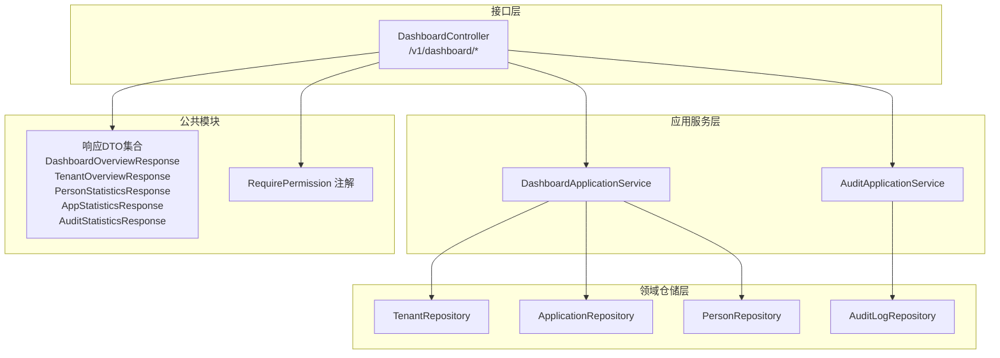
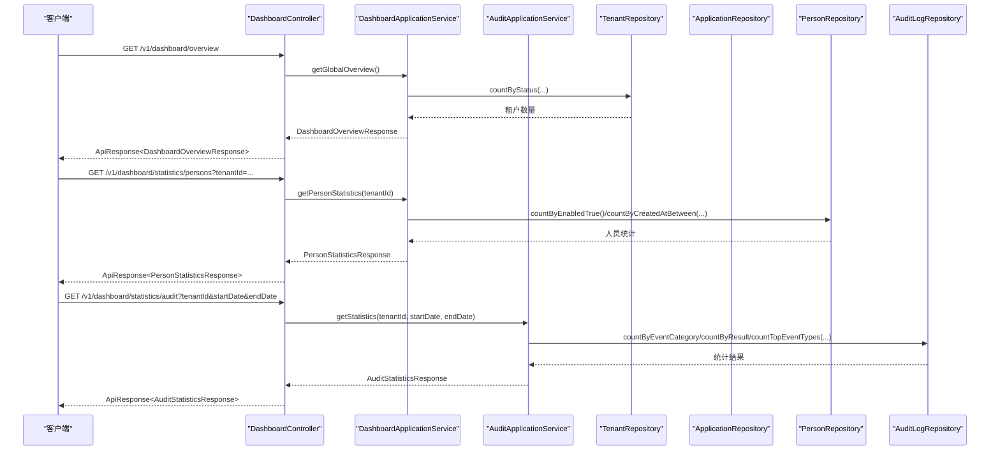
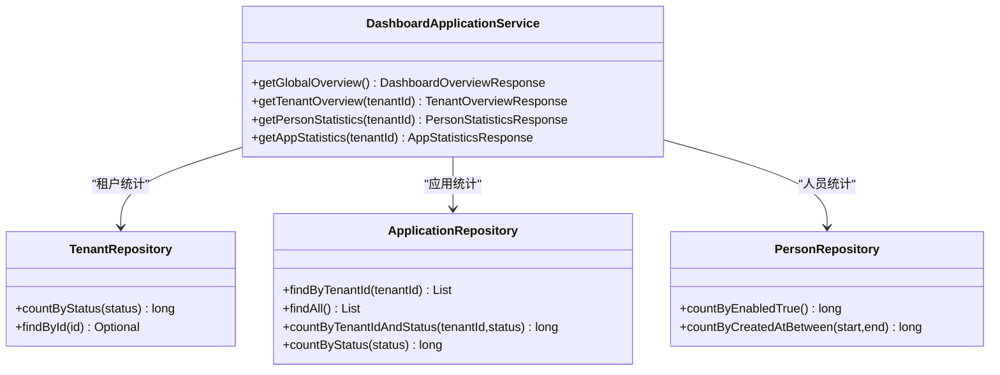
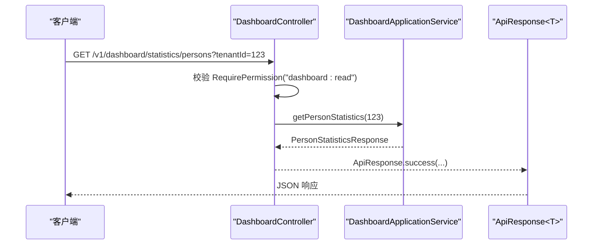
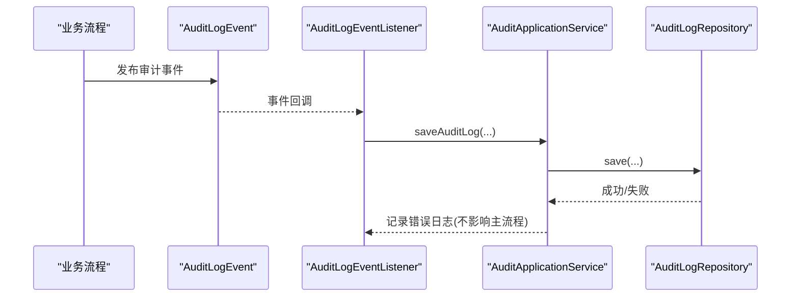
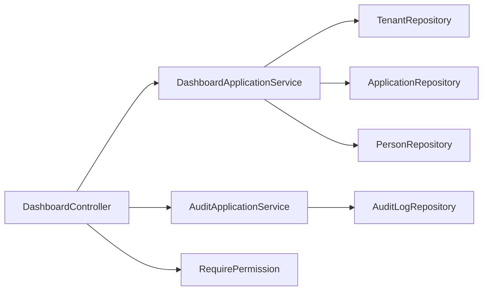

# 仪表板与统计分析

<cite>
**本文引用的文件**
- [DashboardApplicationService.java](file://iam-admin-server/src/main/java/iam/platform/admin/application/service/DashboardApplicationService.java)
- [DashboardController.java](file://iam-admin-server/src/main/java/iam/platform/admin/interfaces/rest/DashboardController.java)
- [AuditApplicationService.java](file://iam-admin-server/src/main/java/iam/platform/admin/application/service/AuditApplicationService.java)
- [AuditLogEventListener.java](file://iam-admin-server/src/main/java/iam/platform/admin/application/event/AuditLogEventListener.java)
- [AuditLogEvent.java](file://iam-admin-server/src/main/java/iam/platform/admin/application/event/AuditLogEvent.java)
- [AdminSecurityConfig.java](file://iam-admin-server/src/main/java/iam/platform/admin/infrastructure/config/AdminSecurityConfig.java)
- [RequirePermission.java](file://iam-common/src/main/java/iam/platform/common/model/annotation/RequirePermission.java)
- [DashboardOverviewResponse.java](file://iam-common/src/main/java/iam/platform/common/dto/response/DashboardOverviewResponse.java)
- [TenantOverviewResponse.java](file://iam-common/src/main/java/iam/platform/common/dto/response/TenantOverviewResponse.java)
- [PersonStatisticsResponse.java](file://iam-common/src/main/java/iam/platform/common/dto/response/PersonStatisticsResponse.java)
- [AppStatisticsResponse.java](file://iam-common/src/main/java/iam/platform/common/dto/response/AppStatisticsResponse.java)
- [AuditStatisticsResponse.java](file://iam-common/src/main/java/iam/platform/common/dto/response/AuditStatisticsResponse.java)
- [TenantRepository.java](file://iam-admin-server/src/main/java/iam/platform/admin/domain/repository/TenantRepository.java)
- [ApplicationRepository.java](file://iam-admin-server/src/main/java/iam/platform/admin/domain/repository/ApplicationRepository.java)
- [PersonRepository.java](file://iam-admin-server/src/main/java/iam/platform/admin/domain/repository/PersonRepository.java)
</cite>

## 目录
1. [引言](#引言)
2. [项目结构](#项目结构)
3. [核心组件](#核心组件)
4. [架构总览](#架构总览)
5. [详细组件分析](#详细组件分析)
6. [依赖分析](#依赖分析)
7. [性能考虑](#性能考虑)
8. [故障排查指南](#故障排查指南)
9. [结论](#结论)
10. [附录](#附录)

## 引言
本技术文档聚焦于“仪表板与统计分析”功能，系统性阐述以下内容：
- 仪表板应用服务的统计数据聚合与业务指标计算逻辑
- 仪表板控制器的REST API设计与接口规范
- 统计分析的数据模型（应用统计、人员统计等）及查询优化要点
- 统计数据的采集与处理机制（实时写入与历史分析）
- 仪表板展示的数据可视化设计思路与趋势分析能力
- 权限控制与数据隔离机制
- 系统扩展性与自定义能力

## 项目结构
仪表板与统计分析功能主要分布在管理端服务中，采用“接口层-应用服务层-领域仓储层”的分层架构：
- 接口层：提供REST API，负责请求参数接收与响应封装
- 应用服务层：编排统计聚合逻辑，调用仓储层进行数据查询
- 领域仓储层：抽象数据访问接口，屏蔽具体持久化实现
- 公共模块：提供统一的响应DTO与权限注解

图示来源
- [DashboardController.java:23-70](file://iam-admin-server/src/main/java/iam/platform/admin/interfaces/rest/DashboardController.java#L23-L70)
- [DashboardApplicationService.java:26-157](file://iam-admin-server/src/main/java/iam/platform/admin/application/service/DashboardApplicationService.java#L26-L157)
- [AuditApplicationService.java:30-217](file://iam-admin-server/src/main/java/iam/platform/admin/application/service/AuditApplicationService.java#L30-L217)
- [TenantRepository.java:10-26](file://iam-admin-server/src/main/java/iam/platform/admin/domain/repository/TenantRepository.java#L10-L26)
- [ApplicationRepository.java:8-24](file://iam-admin-server/src/main/java/iam/platform/admin/domain/repository/ApplicationRepository.java#L8-L24)
- [PersonRepository.java:9-33](file://iam-admin-server/src/main/java/iam/platform/admin/domain/repository/PersonRepository.java#L9-L33)
- [DashboardOverviewResponse.java:15-25](file://iam-common/src/main/java/iam/platform/common/dto/response/DashboardOverviewResponse.java#L15-L25)
- [TenantOverviewResponse.java:17-32](file://iam-common/src/main/java/iam/platform/common/dto/response/TenantOverviewResponse.java#L17-L32)
- [PersonStatisticsResponse.java:15-28](file://iam-common/src/main/java/iam/platform/common/dto/response/PersonStatisticsResponse.java#L15-L28)
- [AppStatisticsResponse.java:17-26](file://iam-common/src/main/java/iam/platform/common/dto/response/AppStatisticsResponse.java#L17-L26)
- [AuditStatisticsResponse.java:16-32](file://iam-common/src/main/java/iam/platform/common/dto/response/AuditStatisticsResponse.java#L16-L32)
- [RequirePermission.java:17-34](file://iam-common/src/main/java/iam/platform/common/model/annotation/RequirePermission.java#L17-L34)

章节来源
- [DashboardController.java:23-70](file://iam-admin-server/src/main/java/iam/platform/admin/interfaces/rest/DashboardController.java#L23-L70)
- [DashboardApplicationService.java:26-157](file://iam-admin-server/src/main/java/iam/platform/admin/application/service/DashboardApplicationService.java#L26-L157)
- [AuditApplicationService.java:30-217](file://iam-admin-server/src/main/java/iam/platform/admin/application/service/AuditApplicationService.java#L30-L217)

## 核心组件
- DashboardApplicationService：负责全局概览、租户概览、人员统计、应用统计等聚合计算
- DashboardController：暴露REST API，统一鉴权与响应包装
- AuditApplicationService：审计统计、日志查询、导出CSV
- 审计事件监听器：异步落库审计日志，避免阻塞主业务链路
- 响应DTO集合：标准化返回结构，便于前端可视化渲染
- 权限注解：基于方法级注解的细粒度权限控制

章节来源
- [DashboardApplicationService.java:26-157](file://iam-admin-server/src/main/java/iam/platform/admin/application/service/DashboardApplicationService.java#L26-L157)
- [DashboardController.java:23-70](file://iam-admin-server/src/main/java/iam/platform/admin/interfaces/rest/DashboardController.java#L23-L70)
- [AuditApplicationService.java:30-217](file://iam-admin-server/src/main/java/iam/platform/admin/application/service/AuditApplicationService.java#L30-L217)
- [AuditLogEventListener.java:15-30](file://iam-admin-server/src/main/java/iam/platform/admin/application/event/AuditLogEventListener.java#L15-L30)
- [RequirePermission.java:17-34](file://iam-common/src/main/java/iam/platform/common/model/annotation/RequirePermission.java#L17-L34)

## 架构总览
下图展示了仪表板与统计分析在系统中的位置与交互关系。

图示来源
- [DashboardController.java:32-69](file://iam-admin-server/src/main/java/iam/platform/admin/interfaces/rest/DashboardController.java#L32-L69)
- [DashboardApplicationService.java:37-124](file://iam-admin-server/src/main/java/iam/platform/admin/application/service/DashboardApplicationService.java#L37-L124)
- [AuditApplicationService.java:129-158](file://iam-admin-server/src/main/java/iam/platform/admin/application/service/AuditApplicationService.java#L129-L158)
- [TenantRepository.java:23-25](file://iam-admin-server/src/main/java/iam/platform/admin/domain/repository/TenantRepository.java#L23-L25)
- [ApplicationRepository.java:21-23](file://iam-admin-server/src/main/java/iam/platform/admin/domain/repository/ApplicationRepository.java#L21-L23)
- [PersonRepository.java:30-32](file://iam-admin-server/src/main/java/iam/platform/admin/domain/repository/PersonRepository.java#L30-L32)
- [AuditLogRepository.java](file://iam-admin-server/src/main/java/iam/platform/admin/domain/repository/AuditLogRepository.java)

## 详细组件分析

### DashboardApplicationService 组件分析
职责与实现要点：
- 全局概览：聚合租户总数/活跃数、用户总数/活跃数、应用总数/活跃数
- 租户概览：按租户维度统计用户、应用、组织数量以及到期时间
- 人员统计：新增人数（日/周/月）、登录成功率、当日登录/失败次数
- 应用统计：应用总数、活跃/非活跃数量、按类型分组统计

图示来源
- [DashboardApplicationService.java:26-157](file://iam-admin-server/src/main/java/iam/platform/admin/application/service/DashboardApplicationService.java#L26-L157)
- [TenantRepository.java:23-25](file://iam-admin-server/src/main/java/iam/platform/admin/domain/repository/TenantRepository.java#L23-L25)
- [ApplicationRepository.java:15-23](file://iam-admin-server/src/main/java/iam/platform/admin/domain/repository/ApplicationRepository.java#L15-L23)
- [PersonRepository.java:30-32](file://iam-admin-server/src/main/java/iam/platform/admin/domain/repository/PersonRepository.java#L30-L32)

章节来源
- [DashboardApplicationService.java:34-156](file://iam-admin-server/src/main/java/iam/platform/admin/application/service/DashboardApplicationService.java#L34-L156)

### DashboardController 组件分析
REST API 设计与鉴权：
- /v1/dashboard/overview：全局概览，需要 dashboard:read 权限
- /v1/dashboard/tenants/{id}/overview：租户概览，需要 dashboard:read 权限
- /v1/dashboard/statistics/persons：人员统计，支持按租户过滤，需要 dashboard:read 权限
- /v1/dashboard/statistics/apps：应用统计，支持按租户过滤，需要 dashboard:read 权限
- /v1/dashboard/statistics/audit：审计统计，需要 audit:read 权限

图示来源
- [DashboardController.java:32-69](file://iam-admin-server/src/main/java/iam/platform/admin/interfaces/rest/DashboardController.java#L32-L69)
- [RequirePermission.java:17-34](file://iam-common/src/main/java/iam/platform/common/model/annotation/RequirePermission.java#L17-L34)

章节来源
- [DashboardController.java:23-70](file://iam-admin-server/src/main/java/iam/platform/admin/interfaces/rest/DashboardController.java#L23-L70)

### 审计统计与日志处理
- 审计统计：按事件类别、结果、Top事件类型聚合，支持起止时间范围
- 日志查询：支持多维过滤（租户、人员、事件类型、资源、时间区间），默认拒绝无条件全量查询
- 导出CSV：限制最大导出条目，保证性能与稳定性
- 异步落库：通过事件监听器异步保存审计日志，避免阻塞主业务

图示来源
- [AuditLogEvent.java:10-20](file://iam-admin-server/src/main/java/iam/platform/admin/application/event/AuditLogEvent.java#L10-L20)
- [AuditLogEventListener.java:18-29](file://iam-admin-server/src/main/java/iam/platform/admin/application/event/AuditLogEventListener.java#L18-L29)
- [AuditApplicationService.java:41-48](file://iam-admin-server/src/main/java/iam/platform/admin/application/service/AuditApplicationService.java#L41-L48)

章节来源
- [AuditApplicationService.java:127-158](file://iam-admin-server/src/main/java/iam/platform/admin/application/service/AuditApplicationService.java#L127-L158)
- [AuditLogEventListener.java:22-28](file://iam-admin-server/src/main/java/iam/platform/admin/application/event/AuditLogEventListener.java#L22-L28)

### 数据模型与查询优化
- DashboardOverviewResponse：平台级租户、用户、应用总量与活跃量
- TenantOverviewResponse：租户维度的用户/应用/组织数量与到期时间
- PersonStatisticsResponse：人员总量/活跃量与新增趋势、登录成功率、当日登录/失败
- AppStatisticsResponse：应用总量、活跃/非活跃、按类型分组、授权总数
- AuditStatisticsResponse：审计日志总量、按类别/结果分组、Top事件类型、时间范围

查询优化建议：
- 使用仓储接口提供的精确计数方法，避免全表扫描
- 对高频统计字段建立数据库索引（如状态、创建时间、租户标识）
- 分页查询与上限导出，防止大查询影响数据库性能
- 对时间范围查询使用覆盖索引，减少回表

章节来源
- [DashboardOverviewResponse.java:15-25](file://iam-common/src/main/java/iam/platform/common/dto/response/DashboardOverviewResponse.java#L15-L25)
- [TenantOverviewResponse.java:17-32](file://iam-common/src/main/java/iam/platform/common/dto/response/TenantOverviewResponse.java#L17-L32)
- [PersonStatisticsResponse.java:15-28](file://iam-common/src/main/java/iam/platform/common/dto/response/PersonStatisticsResponse.java#L15-L28)
- [AppStatisticsResponse.java:17-26](file://iam-common/src/main/java/iam/platform/common/dto/response/AppStatisticsResponse.java#L17-L26)
- [AuditStatisticsResponse.java:16-32](file://iam-common/src/main/java/iam/platform/common/dto/response/AuditStatisticsResponse.java#L16-L32)

## 依赖分析
- 控制器依赖应用服务与权限注解，统一鉴权入口
- 应用服务依赖仓储接口，面向抽象编程，降低耦合
- 审计服务依赖仓储与装配器，提供统计与导出能力
- 事件监听器异步处理审计日志，提升系统吞吐

图示来源
- [DashboardController.java:23-70](file://iam-admin-server/src/main/java/iam/platform/admin/interfaces/rest/DashboardController.java#L23-L70)
- [DashboardApplicationService.java:26-157](file://iam-admin-server/src/main/java/iam/platform/admin/application/service/DashboardApplicationService.java#L26-L157)
- [AuditApplicationService.java:30-217](file://iam-admin-server/src/main/java/iam/platform/admin/application/service/AuditApplicationService.java#L30-L217)
- [RequirePermission.java:17-34](file://iam-common/src/main/java/iam/platform/common/model/annotation/RequirePermission.java#L17-L34)

章节来源
- [DashboardController.java:23-70](file://iam-admin-server/src/main/java/iam/platform/admin/interfaces/rest/DashboardController.java#L23-L70)
- [DashboardApplicationService.java:26-157](file://iam-admin-server/src/main/java/iam/platform/admin/application/service/DashboardApplicationService.java#L26-L157)
- [AuditApplicationService.java:30-217](file://iam-admin-server/src/main/java/iam/platform/admin/application/service/AuditApplicationService.java#L30-L217)

## 性能考虑
- 异步审计：审计事件监听器使用异步线程池，避免阻塞主业务
- 分页与上限：日志导出限制最大条目，查询接口默认拒绝无条件全量查询
- 精准计数：优先使用仓储提供的计数方法，减少复杂聚合
- 时间窗口：人员统计以日/周/月切片，避免跨长周期全表扫描
- 缓存策略：可对热点概览数据增加短期缓存，降低数据库压力

## 故障排查指南
- 审计日志写入失败：应用服务会捕获异常并记录错误日志，不影响主流程；检查异步线程池配置与存储可用性
- 权限不足：接口均标注 RequirePermission，确认当前用户是否具备 dashboard:read 或 audit:read 权限
- 查询无结果：审计日志查询需至少提供一个过滤条件，默认返回空分页；检查请求参数（租户ID、人员ID、事件类型、资源类型+ID、起止时间）

章节来源
- [AuditApplicationService.java:41-48](file://iam-admin-server/src/main/java/iam/platform/admin/application/service/AuditApplicationService.java#L41-L48)
- [DashboardController.java:34-68](file://iam-admin-server/src/main/java/iam/platform/admin/interfaces/rest/DashboardController.java#L34-L68)

## 结论
该仪表板与统计分析子系统通过清晰的分层设计与标准化的响应模型，实现了对平台、租户、人员与应用的多维度统计，并提供了审计统计与异步日志处理能力。结合权限注解与查询优化策略，系统在功能完整性与运行效率之间取得了良好平衡。后续可在缓存、可视化图表与趋势分析方面进一步增强。

## 附录

### API 规范速览
- GET /v1/dashboard/overview
  - 权限：dashboard:read
  - 返回：DashboardOverviewResponse
- GET /v1/dashboard/tenants/{id}/overview
  - 权限：dashboard:read
  - 返回：TenantOverviewResponse
- GET /v1/dashboard/statistics/persons?tenantId={id}
  - 权限：dashboard:read
  - 返回：PersonStatisticsResponse
- GET /v1/dashboard/statistics/apps?tenantId={id}
  - 权限：dashboard:read
  - 返回：AppStatisticsResponse
- GET /v1/dashboard/statistics/audit?tenantId={id}&startDate={iso}&endDate={iso}
  - 权限：audit:read
  - 返回：AuditStatisticsResponse

章节来源
- [DashboardController.java:32-69](file://iam-admin-server/src/main/java/iam/platform/admin/interfaces/rest/DashboardController.java#L32-L69)