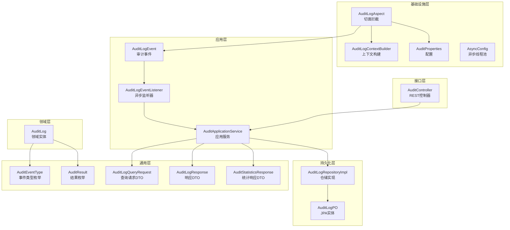
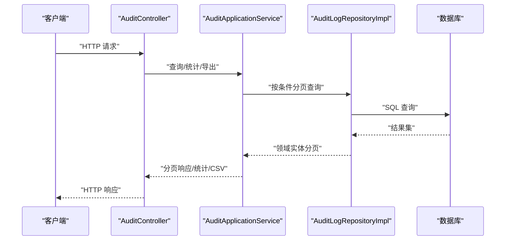
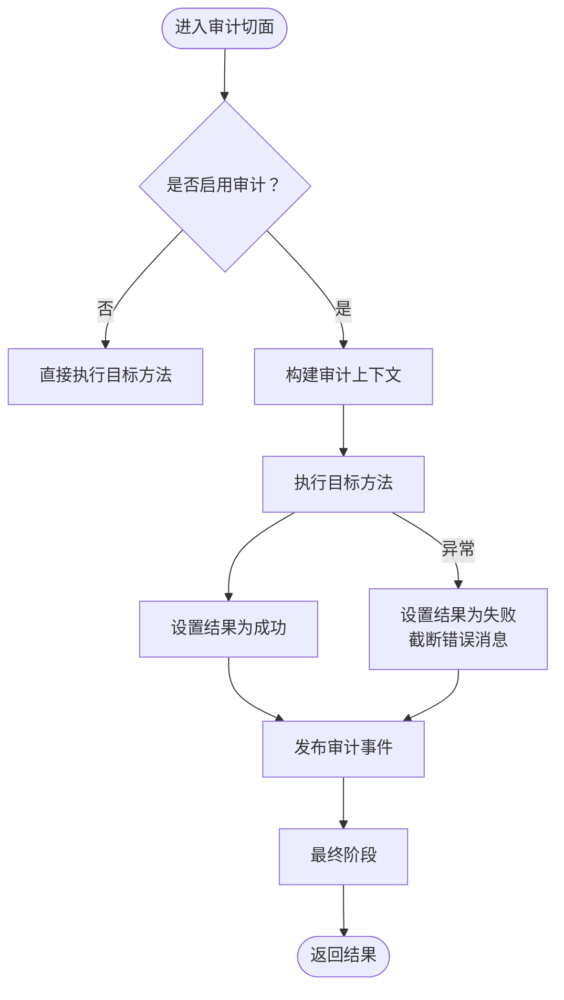
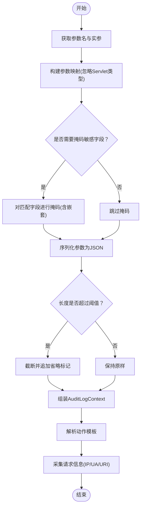
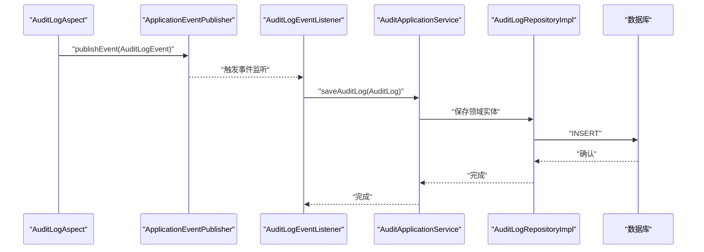
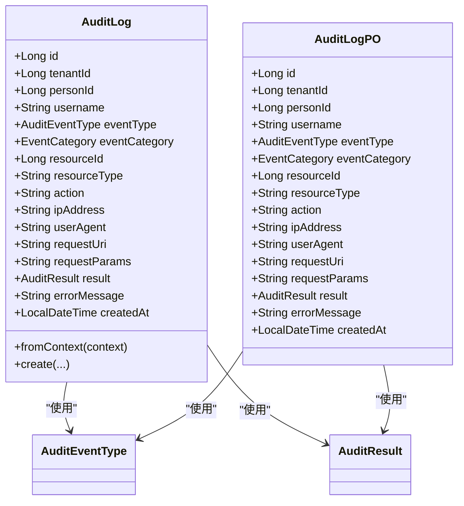
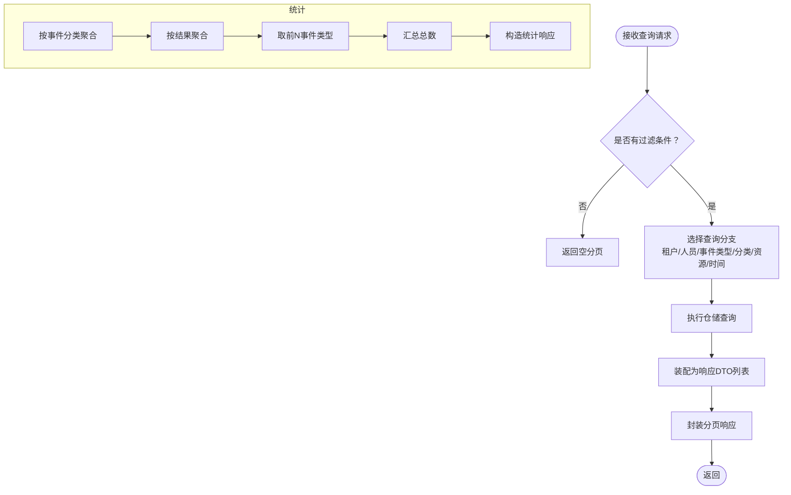
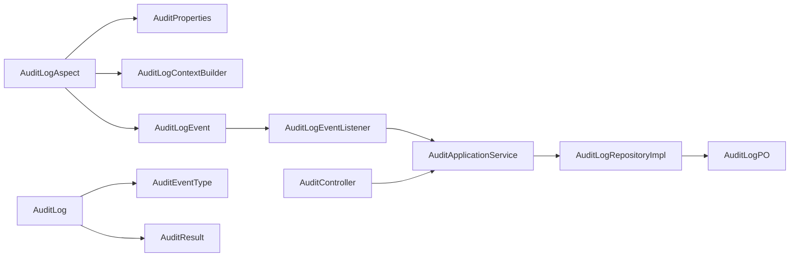

# 审计日志系统

<cite>
**本文引用的文件**
- [AuditLogAspect.java](file://iam-admin-server/src/main/java/iam/platform/admin/infrastructure/aspect/AuditLogAspect.java)
- [AuditLogContext.java](file://iam-admin-server/src/main/java/iam/platform/admin/infrastructure/aspect/AuditLogContext.java)
- [AuditLogContextBuilder.java](file://iam-admin-server/src/main/java/iam/platform/admin/infrastructure/aspect/AuditLogContextBuilder.java)
- [AuditLogEvent.java](file://iam-admin-server/src/main/java/iam/platform/admin/application/event/AuditLogEvent.java)
- [AuditLogEventListener.java](file://iam-admin-server/src/main/java/iam/platform/admin/application/event/AuditLogEventListener.java)
- [AuditApplicationService.java](file://iam-admin-server/src/main/java/iam/platform/admin/application/service/AuditApplicationService.java)
- [AuditController.java](file://iam-admin-server/src/main/java/iam/platform/admin/interfaces/rest/AuditController.java)
- [AuditLog.java](file://iam-admin-server/src/main/java/iam/platform/admin/domain/model/entity/AuditLog.java)
- [AuditLogPO.java](file://iam-admin-server/src/main/java/iam/platform/admin/infrastructure/persistence/entity/AuditLogPO.java)
- [AuditLogRepositoryImpl.java](file://iam-admin-server/src/main/java/iam/platform/admin/infrastructure/persistence/impl/AuditLogRepositoryImpl.java)
- [AuditProperties.java](file://iam-admin-server/src/main/java/iam/platform/admin/infrastructure/config/AuditProperties.java)
- [AsyncConfig.java](file://iam-admin-server/src/main/java/iam/platform/admin/infrastructure/config/AsyncConfig.java)
- [AuditEventType.java](file://iam-common/src/main/java/iam/platform/common/model/enums/AuditEventType.java)
- [AuditResult.java](file://iam-common/src/main/java/iam/platform/common/model/enums/AuditResult.java)
- [AuditLogQueryRequest.java](file://iam-common/src/main/java/iam/platform/common/dto/request/AuditLogQueryRequest.java)
- [AuditLogResponse.java](file://iam-common/src/main/java/iam/platform/common/dto/response/AuditLogResponse.java)
- [AuditStatisticsResponse.java](file://iam-common/src/main/java/iam/platform/common/dto/response/AuditStatisticsResponse.java)
</cite>

## 目录
1. [简介](#简介)
2. [项目结构](#项目结构)
3. [核心组件](#核心组件)
4. [架构总览](#架构总览)
5. [详细组件分析](#详细组件分析)
6. [依赖分析](#依赖分析)
7. [性能考虑](#性能考虑)
8. [故障排查指南](#故障排查指南)
9. [结论](#结论)
10. [附录](#附录)

## 简介
本技术文档围绕审计日志系统展开，系统通过AOP切面拦截标注了审计注解的方法，自动采集审计上下文并发布审计事件；异步事件监听器将审计事件转换为领域实体并持久化；应用服务提供查询、统计与导出能力；控制器暴露REST接口供前端或外部系统调用。文档重点覆盖以下方面：
- 审计切面的设计原理与事件捕获机制
- 审计上下文的构建与数据采集逻辑
- 审计实体模型与枚举类型
- 应用服务的日志记录、查询与统计实现
- 性能优化策略（异步与批量）
- 查询接口设计与统计功能
- 配置项与扩展机制

## 项目结构
审计日志系统主要分布在管理员服务模块中，采用分层架构：基础设施层负责切面与配置，应用层负责事件与服务，领域层负责实体与仓库，接口层提供REST控制器。

图表来源
- [AuditLogAspect.java:1-66](file://iam-admin-server/src/main/java/iam/platform/admin/infrastructure/aspect/AuditLogAspect.java#L1-L66)
- [AuditLogContextBuilder.java:1-183](file://iam-admin-server/src/main/java/iam/platform/admin/infrastructure/aspect/AuditLogContextBuilder.java#L1-L183)
- [AuditProperties.java:1-37](file://iam-admin-server/src/main/java/iam/platform/admin/infrastructure/config/AuditProperties.java#L1-L37)
- [AsyncConfig.java:1-31](file://iam-admin-server/src/main/java/iam/platform/admin/infrastructure/config/AsyncConfig.java#L1-L31)
- [AuditLogEvent.java:1-21](file://iam-admin-server/src/main/java/iam/platform/admin/application/event/AuditLogEvent.java#L1-L21)
- [AuditLogEventListener.java:1-31](file://iam-admin-server/src/main/java/iam/platform/admin/application/event/AuditLogEventListener.java#L1-L31)
- [AuditApplicationService.java:1-217](file://iam-admin-server/src/main/java/iam/platform/admin/application/service/AuditApplicationService.java#L1-L217)
- [AuditLog.java:1-118](file://iam-admin-server/src/main/java/iam/platform/admin/domain/model/entity/AuditLog.java#L1-L118)
- [AuditLogPO.java:1-86](file://iam-admin-server/src/main/java/iam/platform/admin/infrastructure/persistence/entity/AuditLogPO.java#L1-L86)
- [AuditLogRepositoryImpl.java:1-152](file://iam-admin-server/src/main/java/iam/platform/admin/infrastructure/persistence/impl/AuditLogRepositoryImpl.java#L1-L152)
- [AuditEventType.java:1-59](file://iam-common/src/main/java/iam/platform/common/model/enums/AuditEventType.java#L1-L59)
- [AuditResult.java:1-9](file://iam-common/src/main/java/iam/platform/common/model/enums/AuditResult.java#L1-L9)
- [AuditLogQueryRequest.java:1-41](file://iam-common/src/main/java/iam/platform/common/dto/request/AuditLogQueryRequest.java#L1-L41)
- [AuditLogResponse.java:1-31](file://iam-common/src/main/java/iam/platform/common/dto/response/AuditLogResponse.java#L1-L31)
- [AuditStatisticsResponse.java:1-33](file://iam-common/src/main/java/iam/platform/common/dto/response/AuditStatisticsResponse.java#L1-L33)

章节来源
- [AuditLogAspect.java:1-66](file://iam-admin-server/src/main/java/iam/platform/admin/infrastructure/aspect/AuditLogAspect.java#L1-L66)
- [AuditLogContextBuilder.java:1-183](file://iam-admin-server/src/main/java/iam/platform/admin/infrastructure/aspect/AuditLogContextBuilder.java#L1-L183)
- [AuditApplicationService.java:1-217](file://iam-admin-server/src/main/java/iam/platform/admin/application/service/AuditApplicationService.java#L1-L217)
- [AuditController.java:1-89](file://iam-admin-server/src/main/java/iam/platform/admin/interfaces/rest/AuditController.java#L1-L89)
- [AuditLog.java:1-118](file://iam-admin-server/src/main/java/iam/platform/admin/domain/model/entity/AuditLog.java#L1-L118)
- [AuditLogPO.java:1-86](file://iam-admin-server/src/main/java/iam/platform/admin/infrastructure/persistence/entity/AuditLogPO.java#L1-L86)
- [AuditLogRepositoryImpl.java:1-152](file://iam-admin-server/src/main/java/iam/platform/admin/infrastructure/persistence/impl/AuditLogRepositoryImpl.java#L1-L152)
- [AuditProperties.java:1-37](file://iam-admin-server/src/main/java/iam/platform/admin/infrastructure/config/AuditProperties.java#L1-L37)
- [AsyncConfig.java:1-31](file://iam-admin-server/src/main/java/iam/platform/admin/infrastructure/config/AsyncConfig.java#L1-L31)
- [AuditEventType.java:1-59](file://iam-common/src/main/java/iam/platform/common/model/enums/AuditEventType.java#L1-L59)
- [AuditResult.java:1-9](file://iam-common/src/main/java/iam/platform/common/model/enums/AuditResult.java#L1-L9)
- [AuditLogQueryRequest.java:1-41](file://iam-common/src/main/java/iam/platform/common/dto/request/AuditLogQueryRequest.java#L1-L41)
- [AuditLogResponse.java:1-31](file://iam-common/src/main/java/iam/platform/common/dto/response/AuditLogResponse.java#L1-L31)
- [AuditStatisticsResponse.java:1-33](file://iam-common/src/main/java/iam/platform/common/dto/response/AuditStatisticsResponse.java#L1-L33)

## 核心组件
- 审计切面：拦截带审计注解的方法，构建上下文、设置结果、发布事件。
- 上下文构建器：从请求与方法参数提取审计信息，支持敏感字段掩码与参数截断。
- 审计事件：Spring应用事件，承载审计上下文。
- 异步监听器：将上下文转为领域实体并调用应用服务保存。
- 应用服务：提供查询、统计、导出与保存能力。
- 控制器：对外暴露REST接口，支持分页查询、详情、用户/资源维度查询、统计与CSV导出。
- 实体与仓储：领域实体与JPA实体映射，仓储实现提供多维查询与统计聚合。
- 配置：启用开关、保留天数、异步线程池参数。

章节来源
- [AuditLogAspect.java:1-66](file://iam-admin-server/src/main/java/iam/platform/admin/infrastructure/aspect/AuditLogAspect.java#L1-L66)
- [AuditLogContextBuilder.java:1-183](file://iam-admin-server/src/main/java/iam/platform/admin/infrastructure/aspect/AuditLogContextBuilder.java#L1-L183)
- [AuditLogEvent.java:1-21](file://iam-admin-server/src/main/java/iam/platform/admin/application/event/AuditLogEvent.java#L1-L21)
- [AuditLogEventListener.java:1-31](file://iam-admin-server/src/main/java/iam/platform/admin/application/event/AuditLogEventListener.java#L1-L31)
- [AuditApplicationService.java:1-217](file://iam-admin-server/src/main/java/iam/platform/admin/application/service/AuditApplicationService.java#L1-L217)
- [AuditController.java:1-89](file://iam-admin-server/src/main/java/iam/platform/admin/interfaces/rest/AuditController.java#L1-L89)
- [AuditLog.java:1-118](file://iam-admin-server/src/main/java/iam/platform/admin/domain/model/entity/AuditLog.java#L1-L118)
- [AuditLogPO.java:1-86](file://iam-admin-server/src/main/java/iam/platform/admin/infrastructure/persistence/entity/AuditLogPO.java#L1-L86)
- [AuditLogRepositoryImpl.java:1-152](file://iam-admin-server/src/main/java/iam/platform/admin/infrastructure/persistence/impl/AuditLogRepositoryImpl.java#L1-L152)
- [AuditProperties.java:1-37](file://iam-admin-server/src/main/java/iam/platform/admin/infrastructure/config/AuditProperties.java#L1-L37)
- [AsyncConfig.java:1-31](file://iam-admin-server/src/main/java/iam/platform/admin/infrastructure/config/AsyncConfig.java#L1-L31)

## 架构总览
审计系统采用“切面采集—事件发布—异步持久化—应用服务查询”的链路，确保主业务不被阻塞，并提供灵活的查询与统计能力。

图表来源
- [AuditController.java:1-89](file://iam-admin-server/src/main/java/iam/platform/admin/interfaces/rest/AuditController.java#L1-L89)
- [AuditApplicationService.java:1-217](file://iam-admin-server/src/main/java/iam/platform/admin/application/service/AuditApplicationService.java#L1-L217)
- [AuditLogRepositoryImpl.java:1-152](file://iam-admin-server/src/main/java/iam/platform/admin/infrastructure/persistence/impl/AuditLogRepositoryImpl.java#L1-L152)

## 详细组件分析

### 审计切面与事件捕获
- 切面在方法执行前后进行拦截，若未启用则直接放行；否则构建上下文、设置成功/失败结果、发布审计事件。
- 发布异常时记录错误日志，避免影响主流程。
- 结果设置与异常消息截断，防止超长文本入库。

图表来源
- [AuditLogAspect.java:1-66](file://iam-admin-server/src/main/java/iam/platform/admin/infrastructure/aspect/AuditLogAspect.java#L1-L66)

章节来源
- [AuditLogAspect.java:1-66](file://iam-admin-server/src/main/java/iam/platform/admin/infrastructure/aspect/AuditLogAspect.java#L1-L66)

### 审计上下文构建器
- 参数收集：根据方法参数名与实参构建参数映射，忽略Servlet相关类型。
- 敏感字段掩码：对指定字段进行掩码处理，支持嵌套Map的基本处理。
- 参数序列化与截断：JSON序列化后限制长度，避免超长参数入库。
- 动作解析：支持SpEL风格占位符替换生成动作描述。
- 请求信息采集：IP、UA、URI等，支持代理场景取首个IP。

图表来源
- [AuditLogContextBuilder.java:1-183](file://iam-admin-server/src/main/java/iam/platform/admin/infrastructure/aspect/AuditLogContextBuilder.java#L1-L183)

章节来源
- [AuditLogContextBuilder.java:1-183](file://iam-admin-server/src/main/java/iam/platform/admin/infrastructure/aspect/AuditLogContextBuilder.java#L1-L183)

### 审计事件与异步监听
- 事件封装：包含不可序列化的上下文对象，便于监听器转换为领域实体。
- 监听器：使用自定义线程池异步处理，避免阻塞主业务线程。
- 转换与保存：监听器将上下文转为领域实体并调用应用服务保存。

图表来源
- [AuditLogAspect.java:1-66](file://iam-admin-server/src/main/java/iam/platform/admin/infrastructure/aspect/AuditLogAspect.java#L1-L66)
- [AuditLogEvent.java:1-21](file://iam-admin-server/src/main/java/iam/platform/admin/application/event/AuditLogEvent.java#L1-L21)
- [AuditLogEventListener.java:1-31](file://iam-admin-server/src/main/java/iam/platform/admin/application/event/AuditLogEventListener.java#L1-L31)
- [AuditApplicationService.java:1-217](file://iam-admin-server/src/main/java/iam/platform/admin/application/service/AuditApplicationService.java#L1-L217)
- [AuditLogRepositoryImpl.java:1-152](file://iam-admin-server/src/main/java/iam/platform/admin/infrastructure/persistence/impl/AuditLogRepositoryImpl.java#L1-L152)

章节来源
- [AuditLogEvent.java:1-21](file://iam-admin-server/src/main/java/iam/platform/admin/application/event/AuditLogEvent.java#L1-L21)
- [AuditLogEventListener.java:1-31](file://iam-admin-server/src/main/java/iam/platform/admin/application/event/AuditLogEventListener.java#L1-L31)
- [AuditApplicationService.java:1-217](file://iam-admin-server/src/main/java/iam/platform/admin/application/service/AuditApplicationService.java#L1-L217)

### 审计实体模型与枚举
- 领域实体：包含租户、人员、用户名、事件类型与分类、资源类型与ID、动作、IP、UA、URI、请求参数、结果、错误信息、创建时间等字段；提供从上下文工厂方法与手动创建工厂方法。
- JPA实体：与数据库表映射，包含索引以支撑高频查询。
- 枚举：
  - 事件类型：按认证、授权、账户、管理、会话等分类，便于统计与过滤。
  - 结果：成功/失败。

图表来源
- [AuditLog.java:1-118](file://iam-admin-server/src/main/java/iam/platform/admin/domain/model/entity/AuditLog.java#L1-L118)
- [AuditLogPO.java:1-86](file://iam-admin-server/src/main/java/iam/platform/admin/infrastructure/persistence/entity/AuditLogPO.java#L1-L86)
- [AuditEventType.java:1-59](file://iam-common/src/main/java/iam/platform/common/model/enums/AuditEventType.java#L1-L59)
- [AuditResult.java:1-9](file://iam-common/src/main/java/iam/platform/common/model/enums/AuditResult.java#L1-L9)

章节来源
- [AuditLog.java:1-118](file://iam-admin-server/src/main/java/iam/platform/admin/domain/model/entity/AuditLog.java#L1-L118)
- [AuditLogPO.java:1-86](file://iam-admin-server/src/main/java/iam/platform/admin/infrastructure/persistence/entity/AuditLogPO.java#L1-L86)
- [AuditEventType.java:1-59](file://iam-common/src/main/java/iam/platform/common/model/enums/AuditEventType.java#L1-L59)
- [AuditResult.java:1-9](file://iam-common/src/main/java/iam/platform/common/model/enums/AuditResult.java#L1-L9)

### 应用服务：记录、查询、统计与导出
- 记录：异步监听器调用保存方法，异常仅记录日志，不影响主流程。
- 查询：支持按租户、人员、事件类型、事件分类、资源类型+ID、时间范围等条件分页查询；默认要求至少一个过滤条件。
- 统计：按事件分类、结果、前N事件类型进行聚合统计，输出总数与明细。
- 导出：将满足条件的日志导出为CSV，限制最大导出条目数量。

图表来源
- [AuditApplicationService.java:1-217](file://iam-admin-server/src/main/java/iam/platform/admin/application/service/AuditApplicationService.java#L1-L217)
- [AuditLogRepositoryImpl.java:1-152](file://iam-admin-server/src/main/java/iam/platform/admin/infrastructure/persistence/impl/AuditLogRepositoryImpl.java#L1-L152)

章节来源
- [AuditApplicationService.java:1-217](file://iam-admin-server/src/main/java/iam/platform/admin/application/service/AuditApplicationService.java#L1-L217)

### REST接口设计与统计功能
- 接口路径：/v1/audit
- 支持：
  - 分页查询：GET /logs
  - 详情：GET /logs/{id}
  - 用户审计日志：GET /users/{userId}/logs
  - 资源审计日志：GET /resources/{resourceType}/{resourceId}/logs
  - 统计：GET /statistics
  - 导出：POST /logs/export
- 统计响应包含：总条数、按事件分类计数、按结果计数、前N事件类型Top列表。

章节来源
- [AuditController.java:1-89](file://iam-admin-server/src/main/java/iam/platform/admin/interfaces/rest/AuditController.java#L1-L89)
- [AuditLogQueryRequest.java:1-41](file://iam-common/src/main/java/iam/platform/common/dto/request/AuditLogQueryRequest.java#L1-L41)
- [AuditLogResponse.java:1-31](file://iam-common/src/main/java/iam/platform/common/dto/response/AuditLogResponse.java#L1-L31)
- [AuditStatisticsResponse.java:1-33](file://iam-common/src/main/java/iam/platform/common/dto/response/AuditStatisticsResponse.java#L1-L33)

## 依赖分析
- 切面依赖：事件发布器、上下文构建器、配置属性。
- 监听器依赖：应用服务。
- 应用服务依赖：仓储与装配器。
- 仓储实现依赖：JPA仓库与领域/PO转换。
- 实体依赖：事件类型与结果枚举。
- 控制器依赖：应用服务与响应包装。

图表来源
- [AuditLogAspect.java:1-66](file://iam-admin-server/src/main/java/iam/platform/admin/infrastructure/aspect/AuditLogAspect.java#L1-L66)
- [AuditLogContextBuilder.java:1-183](file://iam-admin-server/src/main/java/iam/platform/admin/infrastructure/aspect/AuditLogContextBuilder.java#L1-L183)
- [AuditLogEvent.java:1-21](file://iam-admin-server/src/main/java/iam/platform/admin/application/event/AuditLogEvent.java#L1-L21)
- [AuditLogEventListener.java:1-31](file://iam-admin-server/src/main/java/iam/platform/admin/application/event/AuditLogEventListener.java#L1-L31)
- [AuditApplicationService.java:1-217](file://iam-admin-server/src/main/java/iam/platform/admin/application/service/AuditApplicationService.java#L1-L217)
- [AuditLogRepositoryImpl.java:1-152](file://iam-admin-server/src/main/java/iam/platform/admin/infrastructure/persistence/impl/AuditLogRepositoryImpl.java#L1-L152)
- [AuditLogPO.java:1-86](file://iam-admin-server/src/main/java/iam/platform/admin/infrastructure/persistence/entity/AuditLogPO.java#L1-L86)
- [AuditLog.java:1-118](file://iam-admin-server/src/main/java/iam/platform/admin/domain/model/entity/AuditLog.java#L1-L118)
- [AuditEventType.java:1-59](file://iam-common/src/main/java/iam/platform/common/model/enums/AuditEventType.java#L1-L59)
- [AuditResult.java:1-9](file://iam-common/src/main/java/iam/platform/common/model/enums/AuditResult.java#L1-L9)
- [AuditController.java:1-89](file://iam-admin-server/src/main/java/iam/platform/admin/interfaces/rest/AuditController.java#L1-L89)

章节来源
- 同上

## 性能考虑
- 异步持久化：通过自定义线程池异步处理审计写入，避免阻塞主业务线程。
- 批量写入：仓储实现提供批量保存方法，可结合业务场景在监听器或应用服务中使用批量写入以降低IO开销。
- 参数截断：对请求参数与错误信息进行截断，控制字段长度，减少存储与传输压力。
- 索引优化：JPA实体定义了多处索引，覆盖租户、人员、事件类型、分类、资源、结果、时间等高频查询字段。
- 导出限制：导出接口限制最大查询条目，防止大范围扫描导致性能问题。
- 线程池策略：拒绝策略采用调用者运行策略，保证在高负载下仍能处理任务。

章节来源
- [AsyncConfig.java:1-31](file://iam-admin-server/src/main/java/iam/platform/admin/infrastructure/config/AsyncConfig.java#L1-L31)
- [AuditLogRepositoryImpl.java:1-152](file://iam-admin-server/src/main/java/iam/platform/admin/infrastructure/persistence/impl/AuditLogRepositoryImpl.java#L1-L152)
- [AuditLogPO.java:1-86](file://iam-admin-server/src/main/java/iam/platform/admin/infrastructure/persistence/entity/AuditLogPO.java#L1-L86)
- [AuditApplicationService.java:1-217](file://iam-admin-server/src/main/java/iam/platform/admin/application/service/AuditApplicationService.java#L1-L217)
- [AuditLogContextBuilder.java:1-183](file://iam-admin-server/src/main/java/iam/platform/admin/infrastructure/aspect/AuditLogContextBuilder.java#L1-L183)

## 故障排查指南
- 审计未生效
  - 检查配置开关是否启用。
  - 确认方法是否标注了审计注解且满足过滤条件。
- 写入失败
  - 应用服务保存方法已捕获异常并记录日志，检查日志输出。
- 查询无结果
  - 确认至少提供一个过滤条件；默认未提供条件时返回空分页。
- 导出为空
  - 导出接口受最大条目限制，且仅支持部分组合条件，请调整查询条件或分批导出。
- 异步线程池饱和
  - 检查线程池容量与队列大小配置，必要时增大核心/最大线程数与队列容量。

章节来源
- [AuditProperties.java:1-37](file://iam-admin-server/src/main/java/iam/platform/admin/infrastructure/config/AuditProperties.java#L1-L37)
- [AuditApplicationService.java:1-217](file://iam-admin-server/src/main/java/iam/platform/admin/application/service/AuditApplicationService.java#L1-L217)
- [AsyncConfig.java:1-31](file://iam-admin-server/src/main/java/iam/platform/admin/infrastructure/config/AsyncConfig.java#L1-L31)

## 结论
该审计日志系统通过AOP切面与事件驱动实现非侵入式审计，结合异步持久化与完善的查询统计能力，既保障了主业务性能，又提供了丰富的审计分析手段。通过合理的索引与参数截断策略，系统在大数据量场景下具备较好的可扩展性。建议在生产环境中结合业务流量合理配置异步线程池与导出策略，并定期清理过期日志以维持性能。

## 附录
- 配置项
  - 开关：是否启用审计
  - 保留天数：日志保留周期
  - 异步线程池：核心/最大线程数、队列容量
- 扩展建议
  - 自定义事件类型与分类，丰富统计维度
  - 在监听器中引入批量写入策略
  - 增加审计规则引擎，支持动态过滤与告警

章节来源
- [AuditProperties.java:1-37](file://iam-admin-server/src/main/java/iam/platform/admin/infrastructure/config/AuditProperties.java#L1-L37)
- [AsyncConfig.java:1-31](file://iam-admin-server/src/main/java/iam/platform/admin/infrastructure/config/AsyncConfig.java#L1-L31)