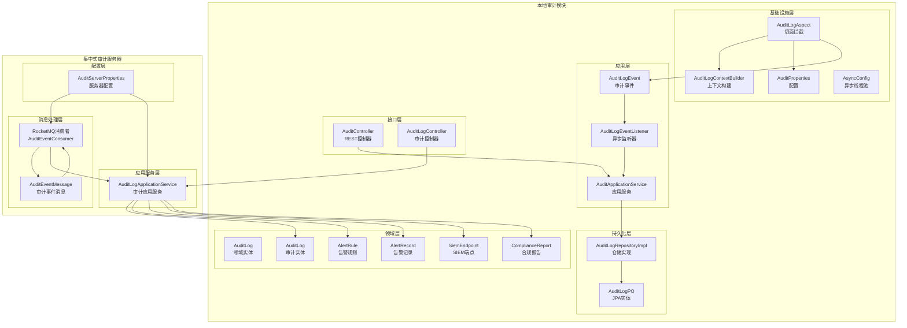
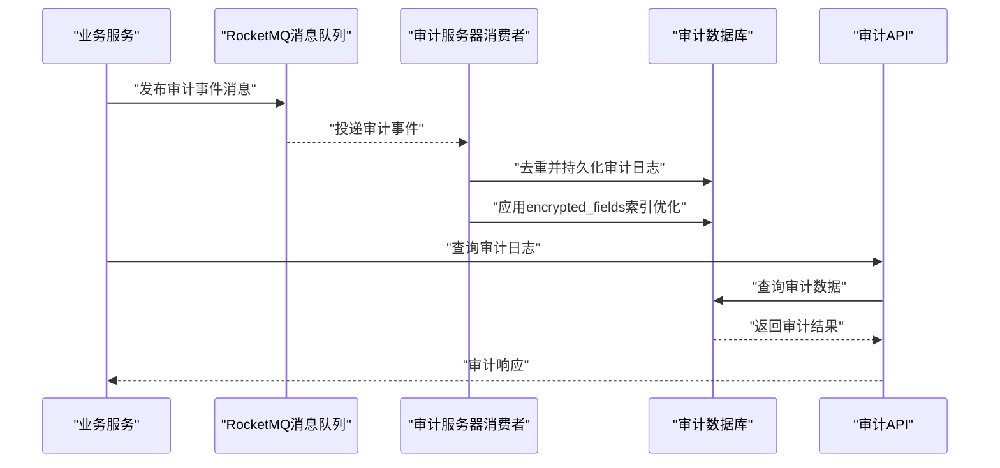
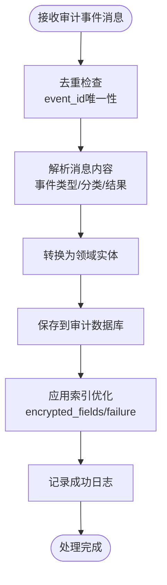
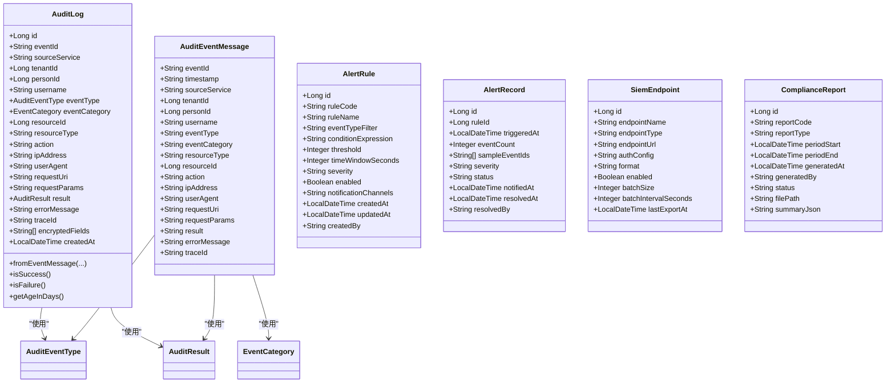
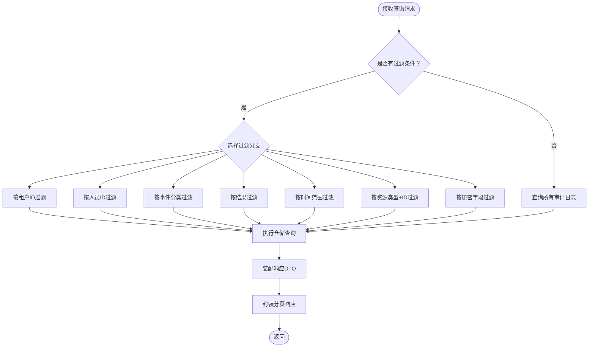
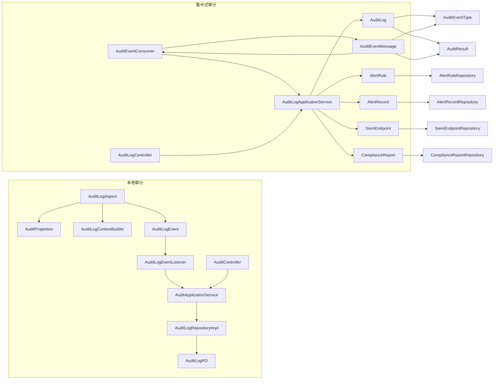

# 审计日志系统

<cite>
**本文引用的文件**
- [AuditLogAspect.java](file://iam-admin-server/src/main/java/iam/platform/admin/infrastructure/aspect/AuditLogAspect.java)
- [AuditLogContext.java](file://iam-admin-server/src/main/java/iam/platform/admin/infrastructure/aspect/AuditLogContext.java)
- [AuditLogContextBuilder.java](file://iam-admin-server/src/main/java/iam/platform/admin/infrastructure/aspect/AuditLogContextBuilder.java)
- [AuditLogEvent.java](file://iam-admin-server/src/main/java/iam/platform/admin/application/event/AuditLogEvent.java)
- [AuditLogEventListener.java](file://iam-admin-server/src/main/java/iam/platform/admin/application/event/AuditLogEventListener.java)
- [AuditApplicationService.java](file://iam-admin-server/src/main/java/iam/platform/admin/application/service/AuditApplicationService.java)
- [AuditController.java](file://iam-admin-server/src/main/java/iam/platform/admin/interfaces/rest/AuditController.java)
- [AuditLog.java](file://iam-admin-server/src/main/java/iam/platform/admin/domain/model/entity/AuditLog.java)
- [AuditLogPO.java](file://iam-admin-server/src/main/java/iam/platform/admin/infrastructure/persistence/entity/AuditLogPO.java)
- [AuditLogRepositoryImpl.java](file://iam-admin-server/src/main/java/iam/platform/admin/infrastructure/persistence/impl/AuditLogRepositoryImpl.java)
- [AuditProperties.java](file://iam-admin-server/src/main/java/iam/platform/admin/infrastructure/config/AuditProperties.java)
- [AsyncConfig.java](file://iam-admin-server/src/main/java/iam/platform/admin/infrastructure/config/AsyncConfig.java)
- [AuditEventType.java](file://iam-common/src/main/java/iam/platform/common/model/enums/AuditEventType.java)
- [AuditResult.java](file://iam-common/src/main/java/iam/platform/common/model/enums/AuditResult.java)
- [AuditLogQueryRequest.java](file://iam-common/src/main/java/iam/platform/common/dto/request/AuditLogQueryRequest.java)
- [AuditLogResponse.java](file://iam-common/src/main/java/iam/platform/common/dto/response/AuditLogResponse.java)
- [AuditStatisticsResponse.java](file://iam-common/src/main/java/iam/platform/common/dto/response/AuditStatisticsResponse.java)
- [AuditServerApplication.java](file://iam-audit-server/src/main/java/iam/platform/audit/AuditServerApplication.java)
- [AuditEventConsumer.java](file://iam-audit-server/src/main/java/iam/platform/audit/application/consumer/AuditEventConsumer.java)
- [AuditLogApplicationService.java](file://iam-audit-server/src/main/java/iam/platform/audit/application/service/AuditLogApplicationService.java)
- [AuditLogController.java](file://iam-audit-server/src/main/java/iam/platform/audit/interfaces/controller/AuditLogController.java)
- [AuditLog.java](file://iam-audit-server/src/main/java/iam/platform/audit/domain/model/entity/AuditLog.java)
- [AuditServerProperties.java](file://iam-audit-server/src/main/java/iam/platform/audit/infrastructure/config/AuditServerProperties.java)
- [V1__audit_schema_initialization.sql](file://iam-audit-server/src/main/resources/db/migration/V1__audit_schema_initialization.sql)
- [V4__audit_advanced_features.sql](file://iam-admin-server/src/main/resources/db/migration/V4__audit_advanced_features.sql)
- [AuditEventMessage.java](file://iam-common/src/main/java/iam/platform/common/dto/AuditEventMessage.java)
- [AlertRule.java](file://iam-audit-server/src/main/java/iam/platform/audit/domain/model/entity/AlertRule.java)
- [AlertRecord.java](file://iam-audit-server/src/main/java/iam/platform/audit/domain/model/entity/AlertRecord.java)
- [SiemEndpoint.java](file://iam-audit-server/src/main/java/iam/platform/audit/domain/model/entity/SiemEndpoint.java)
- [ComplianceReport.java](file://iam-audit-server/src/main/java/iam/platform/audit/domain/model/entity/ComplianceReport.java)
- [AlertRuleRepository.java](file://iam-audit-server/src/main/java/iam/platform/audit/domain/repository/AlertRuleRepository.java)
- [AlertRecordRepository.java](file://iam-audit-server/src/main/java/iam/platform/audit/domain/repository/AlertRecordRepository.java)
- [SiemEndpointRepository.java](file://iam-audit-server/src/main/java/iam/platform/audit/domain/repository/SiemEndpointRepository.java)
- [ComplianceReportRepository.java](file://iam-audit-server/src/main/java/iam/platform/audit/domain/repository/ComplianceReportRepository.java)
- [application.yml](file://iam-audit-server/src/main/resources/application.yml)
- [application-dev.yml](file://iam-audit-server/src/main/resources/application-dev.yml)
</cite>

## 更新摘要
**变更内容**
- 新增审计日志表的encrypted_fields字段支持敏感数据加密标记
- 新增failure部分索引优化，提升失败审计事件查询性能
- 新增告警规则(t_alert_rule)实体及管理功能
- 新增告警记录(t_alert_record)实体及状态跟踪
- 新增SIEM端点(t_siem_endpoint)实体及安全集成能力
- 新增合规报告(t_compliance_report)实体及合规管理功能
- 更新数据库迁移脚本，包含完整的高级功能初始化
- 增强审计实体模型，支持分布式追踪和加密字段标记

## 目录
1. [简介](#简介)
2. [项目结构](#项目结构)
3. [核心组件](#核心组件)
4. [架构总览](#架构总览)
5. [详细组件分析](#详细组件分析)
6. [依赖分析](#依赖分析)
7. [性能考虑](#性能考虑)
8. [故障排查指南](#故障排查指南)
9. [结论](#结论)
10. [附录](#附录)

## 简介
本技术文档围绕审计日志系统展开，系统现已发展为包含本地审计和集中式审计服务器的完整解决方案。系统通过AOP切面拦截标注了审计注解的方法，自动采集审计上下文并发布审计事件；集中式审计服务器通过消息队列实时消费审计事件，提供统一的审计日志管理能力，包括审计事件持久化、查询统计、告警监控、合规报告和SIEM集成等功能。本次更新重点反映了审计系统高级功能的增强，包括新增的告警规则、告警记录、SIEM端点、合规报告等高级功能，以及审计日志表的encrypted_fields字段和failure部分索引优化。

**章节来源**
- [AuditLogAspect.java:1-66](file://iam-admin-server/src/main/java/iam/platform/admin/infrastructure/aspect/AuditLogAspect.java#L1-L66)
- [AuditEventConsumer.java:1-110](file://iam-audit-server/src/main/java/iam/platform/audit/application/consumer/AuditEventConsumer.java#L1-L110)
- [AuditLogApplicationService.java:1-184](file://iam-audit-server/src/main/java/iam/platform/audit/application/service/AuditLogApplicationService.java#L1-L184)

## 项目结构
审计日志系统现已演进为多层次架构，包含管理员服务模块的本地审计和独立的集中式审计服务器模块，采用分层架构：基础设施层负责切面与配置，应用层负责事件与服务，领域层负责实体与仓库，接口层提供REST控制器。新增的高级功能包括告警引擎、合规报告、SIEM集成等模块。

**图表来源**
- [AuditLogAspect.java:1-66](file://iam-admin-server/src/main/java/iam/platform/admin/infrastructure/aspect/AuditLogAspect.java#L1-L66)
- [AuditEventConsumer.java:1-110](file://iam-audit-server/src/main/java/iam/platform/audit/application/consumer/AuditEventConsumer.java#L1-L110)
- [AuditLogApplicationService.java:1-184](file://iam-audit-server/src/main/java/iam/platform/audit/application/service/AuditLogApplicationService.java#L1-L184)
- [AuditLogController.java:1-87](file://iam-audit-server/src/main/java/iam/platform/audit/interfaces/controller/AuditLogController.java#L1-L87)
- [AuditServerProperties.java:1-78](file://iam-audit-server/src/main/java/iam/platform/audit/infrastructure/config/AuditServerProperties.java#L1-L78)

## 核心组件
- **本地审计组件**：审计切面、上下文构建器、审计事件、异步监听器、应用服务、控制器、实体与仓储、配置
- **集中式审计服务器**：消息队列消费者、审计应用服务、审计控制器、审计实体、告警规则、告警记录、合规报告、服务器配置
- **高级功能模块**：告警引擎、合规报告生成、SIEM集成、加密配置、数据库索引优化
- **消息传递**：AuditEventMessage作为跨服务审计事件的标准消息格式
- **数据库增强**：encrypted_fields字段支持敏感数据加密标记，failure部分索引优化查询性能

**章节来源**
- [AuditLogAspect.java:1-66](file://iam-admin-server/src/main/java/iam/platform/admin/infrastructure/aspect/AuditLogAspect.java#L1-L66)
- [AuditEventConsumer.java:1-110](file://iam-audit-server/src/main/java/iam/platform/audit/application/consumer/AuditEventConsumer.java#L1-L110)
- [AuditLogApplicationService.java:1-184](file://iam-audit-server/src/main/java/iam/platform/audit/application/service/AuditLogApplicationService.java#L1-L184)
- [AuditEventMessage.java:1-76](file://iam-common/src/main/java/iam/platform/common/dto/AuditEventMessage.java#L1-L76)

## 架构总览
审计系统现已采用"本地审计+集中式审计服务器"的双层架构，通过消息队列实现事件的异步传递和统一处理，确保主业务不被阻塞，并提供强大的查询统计、告警监控和合规管理能力。新增的高级功能模块进一步增强了系统的安全性和合规性。

**图表来源**
- [AuditEventConsumer.java:31-73](file://iam-audit-server/src/main/java/iam/platform/audit/application/consumer/AuditEventConsumer.java#L31-L73)
- [AuditLogApplicationService.java:36-74](file://iam-audit-server/src/main/java/iam/platform/audit/application/service/AuditLogApplicationService.java#L36-L74)

## 详细组件分析

### 本地审计组件（传统模式）
- **审计切面**：拦截带审计注解的方法，构建上下文、设置结果、发布事件
- **上下文构建器**：从请求与方法参数提取审计信息，支持敏感字段掩码与参数截断
- **审计事件**：Spring应用事件，承载审计上下文
- **异步监听器**：将上下文转为领域实体并调用应用服务保存
- **应用服务**：提供查询、统计、导出与保存能力
- **控制器**：对外暴露REST接口，支持分页查询、详情、用户/资源维度查询、统计与CSV导出

**章节来源**
- [AuditLogAspect.java:1-66](file://iam-admin-server/src/main/java/iam/platform/admin/infrastructure/aspect/AuditLogAspect.java#L1-L66)
- [AuditLogContextBuilder.java:1-183](file://iam-admin-server/src/main/java/iam/platform/admin/infrastructure/aspect/AuditLogContextBuilder.java#L1-L183)
- [AuditLogEvent.java:1-21](file://iam-admin-server/src/main/java/iam/platform/admin/application/event/AuditLogEvent.java#L1-L21)
- [AuditLogEventListener.java:1-31](file://iam-admin-server/src/main/java/iam/platform/admin/application/event/AuditLogEventListener.java#L1-L31)
- [AuditApplicationService.java:1-217](file://iam-admin-server/src/main/java/iam/platform/admin/application/service/AuditApplicationService.java#L1-L217)
- [AuditController.java:1-89](file://iam-admin-server/src/main/java/iam/platform/admin/interfaces/rest/AuditController.java#L1-L89)

### 集中式审计服务器（新增）
- **消息队列消费者**：监听"audit-events"主题，去重处理审计事件消息，转换为领域实体并持久化
- **审计应用服务**：提供统一的审计日志查询、统计、导出功能，支持多种过滤条件
- **审计控制器**：暴露REST接口，支持分页查询、详情、用户/资源维度查询、统计与CSV导出
- **高级功能实体**：
  - 告警规则：定义审计事件监控规则和阈值
  - 告警记录：记录触发的告警事件和状态
  - 合规报告：生成和管理合规性报告
  - SIEM端点：配置外部安全平台集成
- **配置管理**：支持加密配置、告警通知、SIEM集成、合规报告等高级功能

**图表来源**
- [AuditEventConsumer.java:32-73](file://iam-audit-server/src/main/java/iam/platform/audit/application/consumer/AuditEventConsumer.java#L32-L73)

**章节来源**
- [AuditEventConsumer.java:1-110](file://iam-audit-server/src/main/java/iam/platform/audit/application/consumer/AuditEventConsumer.java#L1-L110)
- [AuditLogApplicationService.java:1-184](file://iam-audit-server/src/main/java/iam/platform/audit/application/service/AuditLogApplicationService.java#L1-L184)
- [AuditLogController.java:1-87](file://iam-audit-server/src/main/java/iam/platform/audit/interfaces/controller/AuditLogController.java#L1-L87)

### 审计实体模型与枚举
- **本地审计实体**：包含租户、人员、用户名、事件类型与分类、资源类型与ID、动作、IP、UA、URI、请求参数、结果、错误信息、创建时间等字段
- **集中式审计实体**：增强版审计日志实体，增加sourceService、traceId、encrypted_fields等字段，支持分布式追踪
- **消息实体**：AuditEventMessage作为跨服务审计事件的标准消息格式，包含事件标识、时间戳、来源服务、租户信息、用户信息、事件详情等
- **高级实体**：
  - 告警规则：规则代码、名称、事件类型过滤器、条件表达式、阈值、时间窗口、严重级别、通知渠道
  - 告警记录：规则ID、触发时间、事件数量、样本事件ID列表、严重级别、状态、通知时间、解决时间
  - SIEM端点：端点名称、类型、URL、认证配置、格式、启用状态、批量大小、批量间隔
  - 合规报告：报告代码、类型、期间开始结束、生成时间、生成者、状态、文件路径、摘要JSON
- **枚举类型**：事件类型、结果、事件分类等枚举保持一致

**图表来源**
- [AuditLog.java:22-103](file://iam-audit-server/src/main/java/iam/platform/audit/domain/model/entity/AuditLog.java#L22-L103)
- [AuditEventMessage.java:18-75](file://iam-common/src/main/java/iam/platform/common/dto/AuditEventMessage.java#L18-L75)
- [AlertRule.java:17-52](file://iam-audit-server/src/main/java/iam/platform/audit/domain/model/entity/AlertRule.java#L17-52)
- [AlertRecord.java:18-52](file://iam-audit-server/src/main/java/iam/platform/audit/domain/model/entity/AlertRecord.java#L18-52)
- [SiemEndpoint.java:17-56](file://iam-audit-server/src/main/java/iam/platform/audit/domain/model/entity/SiemEndpoint.java#L17-56)
- [ComplianceReport.java:17-54](file://iam-audit-server/src/main/java/iam/platform/audit/domain/model/entity/ComplianceReport.java#L17-54)

**章节来源**
- [AuditLog.java:1-104](file://iam-audit-server/src/main/java/iam/platform/audit/domain/model/entity/AuditLog.java#L1-L104)
- [AuditEventMessage.java:1-76](file://iam-common/src/main/java/iam/platform/common/dto/AuditEventMessage.java#L1-L76)
- [AuditLog.java:1-118](file://iam-admin-server/src/main/java/iam/platform/admin/domain/model/entity/AuditLog.java#L1-L118)

### 数据库增强与索引优化
- **encrypted_fields字段**：在t_audit_log表中新增encrypted_fields列，用于标记需要加密的字段名称数组，支持JSON格式存储
- **failure部分索引**：创建result列的部分索引，仅索引FAILURE结果的记录，优化失败事件的查询性能
- **高级功能表结构**：
  - t_alert_rule：告警规则定义表，包含规则代码、名称、事件类型过滤器、条件表达式等
  - t_alert_record：告警记录表，跟踪触发的告警事件和状态变化
  - t_siem_endpoint：SIEM端点配置表，支持SYSLOG、HTTP、KAFKA等多种集成方式
  - t_compliance_report：合规报告元数据表，支持SOC2、GDPR、ISO27001等合规标准

**章节来源**
- [V4__audit_advanced_features.sql:16-29](file://iam-admin-server/src/main/resources/db/migration/V4__audit_advanced_features.sql#L16-L29)
- [V4__audit_advanced_features.sql:140-149](file://iam-admin-server/src/main/resources/db/migration/V4__audit_advanced_features.sql#L140-L149)
- [V1__audit_schema_initialization.sql:144-171](file://iam-audit-server/src/main/resources/db/migration/V1__audit_schema_initialization.sql#L144-L171)

### 应用服务：记录、查询、统计与导出
- **本地应用服务**：记录异步监听器调用保存方法，查询支持按租户、人员、事件类型、事件分类、资源类型+ID、时间范围等条件分页查询；统计按事件分类、结果、前N事件类型进行聚合统计；导出为CSV
- **集中式应用服务**：提供统一的审计日志查询、统计、导出功能，支持更丰富的过滤条件和统计维度；内置CSV导出功能

**图表来源**
- [AuditLogApplicationService.java:36-74](file://iam-audit-server/src/main/java/iam/platform/audit/application/service/AuditLogApplicationService.java#L36-L74)

**章节来源**
- [AuditApplicationService.java:1-217](file://iam-admin-server/src/main/java/iam/platform/admin/application/service/AuditApplicationService.java#L1-L217)
- [AuditLogApplicationService.java:1-184](file://iam-audit-server/src/main/java/iam/platform/audit/application/service/AuditLogApplicationService.java#L1-L184)

### REST接口设计与统计功能
- **本地控制器**：接口路径/v1/audit，支持分页查询、详情、用户审计日志、资源审计日志、统计、导出
- **集中式控制器**：接口路径/v1/audit，提供相同的查询、统计、导出功能，支持更丰富的过滤条件
- **统计响应**：包含总条数、按事件分类计数、按结果计数、前N事件类型Top列表

**章节来源**
- [AuditController.java:1-89](file://iam-admin-server/src/main/java/iam/platform/admin/interfaces/rest/AuditController.java#L1-L89)
- [AuditLogController.java:1-87](file://iam-audit-server/src/main/java/iam/platform/audit/interfaces/controller/AuditLogController.java#L1-L87)
- [AuditLogQueryRequest.java:1-41](file://iam-common/src/main/java/iam/platform/common/dto/request/AuditLogQueryRequest.java#L1-L41)
- [AuditLogResponse.java:1-31](file://iam-common/src/main/java/iam/platform/common/dto/response/AuditLogResponse.java#L1-L31)
- [AuditStatisticsResponse.java:1-33](file://iam-common/src/main/java/iam/platform/common/dto/response/AuditStatisticsResponse.java#L1-L33)

### 高级功能：告警引擎、合规报告、SIEM集成
- **告警引擎**：基于规则的实时监控，支持暴力破解检测、账户锁定级联、权限提升、非工作时间访问、大量数据导出等预设规则
- **合规报告**：支持SOC2、GDPR、ISO27001等合规性报告生成和管理
- **SIEM集成**：支持Syslog、HTTP、Kafka等多种SIEM端点集成，支持CEF、LEEF、JSON等格式
- **加密配置**：支持AES-256加密，可配置敏感字段和加密密钥

**章节来源**
- [AlertRule.java:1-53](file://iam-audit-server/src/main/java/iam/platform/audit/domain/model/entity/AlertRule.java#L1-L53)
- [AlertRecord.java:1-53](file://iam-audit-server/src/main/java/iam/platform/audit/domain/model/entity/AlertRecord.java#L1-L53)
- [SiemEndpoint.java:1-57](file://iam-audit-server/src/main/java/iam/platform/audit/domain/model/entity/SiemEndpoint.java#L1-L57)
- [ComplianceReport.java:1-55](file://iam-audit-server/src/main/java/iam/platform/audit/domain/model/entity/ComplianceReport.java#L1-L55)
- [AuditServerProperties.java:1-78](file://iam-audit-server/src/main/java/iam/platform/audit/infrastructure/config/AuditServerProperties.java#L1-L78)

## 依赖分析
- **本地审计依赖**：切面依赖事件发布器、上下文构建器、配置属性；监听器依赖应用服务；应用服务依赖仓储与装配器；仓储实现依赖JPA仓库与领域/PO转换
- **集中式审计依赖**：消费者依赖消息队列、审计日志仓储；应用服务依赖审计日志仓储；控制器依赖应用服务；实体依赖事件类型与结果枚举
- **高级功能依赖**：告警规则、告警记录、合规报告、SIEM端点分别依赖对应的仓库接口；所有实体依赖事件类型与结果枚举
- **通用依赖**：AuditEventMessage作为跨服务通信标准格式

**图表来源**
- [AuditLogAspect.java:1-66](file://iam-admin-server/src/main/java/iam/platform/admin/infrastructure/aspect/AuditLogAspect.java#L1-L66)
- [AuditEventConsumer.java:27-29](file://iam-audit-server/src/main/java/iam/platform/audit/application/consumer/AuditEventConsumer.java#L27-L29)
- [AuditLogApplicationService.java:34-34](file://iam-audit-server/src/main/java/iam/platform/audit/application/service/AuditLogApplicationService.java#L34-L34)
- [AuditEventMessage.java:18-75](file://iam-common/src/main/java/iam/platform/common/dto/AuditEventMessage.java#L18-L75)

**章节来源**
- [AuditLogAspect.java:1-66](file://iam-admin-server/src/main/java/iam/platform/admin/infrastructure/aspect/AuditLogAspect.java#L1-L66)
- [AuditEventConsumer.java:1-110](file://iam-audit-server/src/main/java/iam/platform/audit/application/consumer/AuditEventConsumer.java#L1-L110)
- [AuditLogApplicationService.java:1-184](file://iam-audit-server/src/main/java/iam/platform/audit/application/service/AuditLogApplicationService.java#L1-L184)

## 性能考虑
- **异步持久化**：本地审计通过自定义线程池异步处理审计写入；集中式审计通过消息队列实现异步处理
- **批量写入**：集中式审计支持批量处理审计事件，可结合业务场景在消费者中使用批量写入策略
- **去重机制**：集中式审计通过event_id实现去重，避免重复处理相同事件
- **参数截断**：本地审计对请求参数与错误信息进行截断，控制字段长度
- **索引优化**：审计数据库表建立多处索引，覆盖租户、人员、事件类型、分类、资源、结果、时间等高频查询字段；新增encrypted_fields和failure部分索引优化特定查询场景
- **导出限制**：导出接口限制最大查询条目，防止大范围扫描导致性能问题
- **线程池策略**：本地审计线程池采用调用者运行策略，保证在高负载下仍能处理任务
- **消息队列配置**：支持配置消费者组、批量大小、重试策略等

**章节来源**
- [AsyncConfig.java:1-31](file://iam-admin-server/src/main/java/iam/platform/admin/infrastructure/config/AsyncConfig.java#L1-L31)
- [AuditEventConsumer.java:37-41](file://iam-audit-server/src/main/java/iam/platform/audit/application/consumer/AuditEventConsumer.java#L37-L41)
- [AuditLogRepositoryImpl.java:1-152](file://iam-admin-server/src/main/java/iam/platform/admin/infrastructure/persistence/impl/AuditLogRepositoryImpl.java#L1-L152)
- [AuditServerProperties.java:42-61](file://iam-audit-server/src/main/java/iam/platform/audit/infrastructure/config/AuditServerProperties.java#L42-L61)

## 故障排查指南
- **本地审计未生效**
  - 检查配置开关是否启用
  - 确认方法是否标注了审计注解且满足过滤条件
- **集中式审计无数据**
  - 检查RocketMQ连接配置和服务启动状态
  - 确认消息队列主题"audit-events"是否正确配置
  - 检查消费者组配置是否正确
- **重复数据问题**
  - 集中式审计通过event_id去重，检查消息中的event_id是否唯一
- **写入失败**
  - 应用服务保存方法已捕获异常并记录日志，检查日志输出
- **查询无结果**
  - 确认至少提供一个过滤条件；默认未提供条件时返回空分页
- **导出为空**
  - 导出接口受最大条目限制，且仅支持部分组合条件，请调整查询条件或分批导出
- **异步线程池饱和**
  - 检查线程池容量与队列大小配置，必要时增大核心/最大线程数与队列容量
- **告警不触发**
  - 检查告警规则配置和评估间隔设置
  - 确认事件类型过滤和阈值设置是否合理
- **索引性能问题**
  - 检查encrypted_fields和failure索引是否正确创建
  - 验证查询语句是否有效利用索引
- **高级功能配置错误**
  - 检查告警规则、SIEM端点、合规报告的配置参数
  - 确认数据库表结构与迁移脚本同步

**章节来源**
- [AuditProperties.java:1-37](file://iam-admin-server/src/main/java/iam/platform/admin/infrastructure/config/AuditProperties.java#L1-L37)
- [AuditApplicationService.java:1-217](file://iam-admin-server/src/main/java/iam/platform/admin/application/service/AuditApplicationService.java#L1-L217)
- [AsyncConfig.java:1-31](file://iam-admin-server/src/main/java/iam/platform/admin/infrastructure/config/AsyncConfig.java#L1-L31)
- [AuditEventConsumer.java:69-72](file://iam-audit-server/src/main/java/iam/platform/audit/application/consumer/AuditEventConsumer.java#L69-L72)

## 结论
该审计日志系统现已发展为完整的分布式审计解决方案，通过本地审计和集中式审计服务器的协同工作，既保障了主业务性能，又提供了强大的审计分析、告警监控和合规管理能力。本次更新显著增强了系统的高级功能，包括新增的告警规则、告警记录、SIEM端点、合规报告等模块，以及审计日志表的encrypted_fields字段和failure部分索引优化。本地审计模块通过AOP切面与事件驱动实现非侵入式审计，集中式审计服务器通过消息队列实现统一的实时审计处理，结合告警引擎、合规报告、SIEM集成等高级功能，显著增强了平台的审计能力和合规性。通过合理的索引与参数截断策略，系统在大数据量场景下具备较好的可扩展性。建议在生产环境中结合业务流量合理配置异步线程池、消息队列和导出策略，并定期清理过期日志以维持性能。

## 附录
- **本地审计配置项**
  - 开关：是否启用审计
  - 保留天数：日志保留周期
  - 异步线程池：核心/最大线程数、队列容量
- **集中式审计配置项**
  - RocketMQ：名称服务器地址、消费者组配置
  - 加密配置：AES密钥、敏感字段列表
  - 告警配置：评估间隔、通知渠道（邮件、Webhook）
  - SIEM配置：导出间隔、批量大小
  - 合规配置：报告存储路径
- **数据库增强配置**
  - encrypted_fields：敏感字段加密标记配置
  - failure索引：失败事件查询性能优化
  - 高级功能表：告警规则、告警记录、SIEM端点、合规报告表结构
- **扩展建议**
  - 在监听器中引入批量写入策略
  - 自定义事件类型与分类，丰富统计维度
  - 增强告警规则引擎，支持动态过滤与复杂条件
  - 扩展SIEM端点类型，支持更多第三方安全平台
  - 增加审计数据的生命周期管理功能

**章节来源**
- [AuditProperties.java:1-37](file://iam-admin-server/src/main/java/iam/platform/admin/infrastructure/config/AuditProperties.java#L1-L37)
- [AsyncConfig.java:1-31](file://iam-admin-server/src/main/java/iam/platform/admin/infrastructure/config/AsyncConfig.java#L1-L31)
- [AuditServerProperties.java:1-78](file://iam-audit-server/src/main/java/iam/platform/audit/infrastructure/config/AuditServerProperties.java#L1-L78)
- [application.yml:36-61](file://iam-audit-server/src/main/resources/application.yml#L36-L61)
- [V4__audit_advanced_features.sql:16-149](file://iam-admin-server/src/main/resources/db/migration/V4__audit_advanced_features.sql#L16-L149)