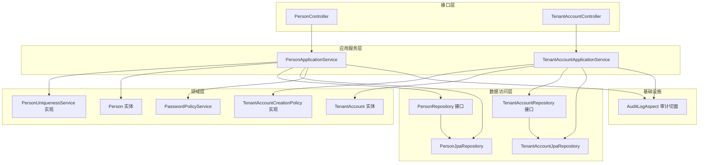
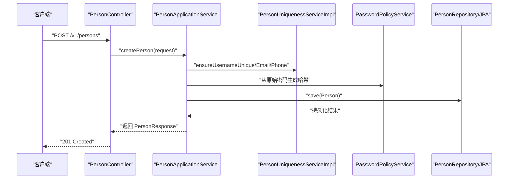
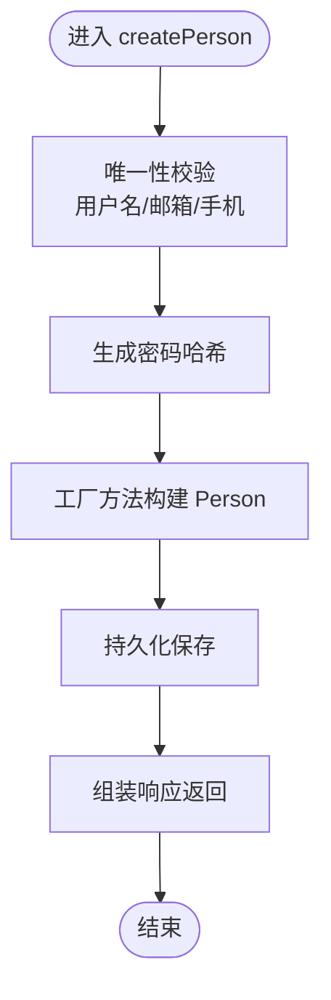
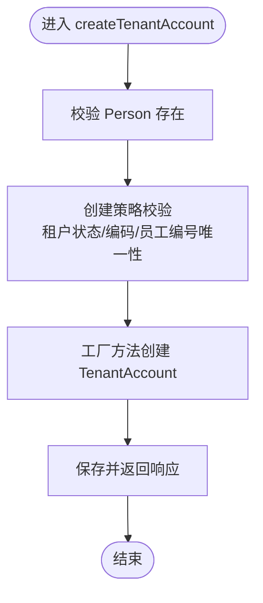
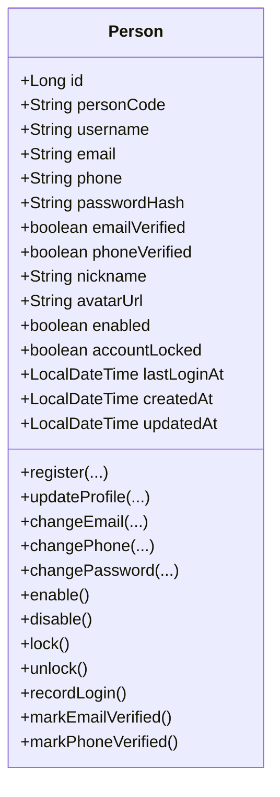
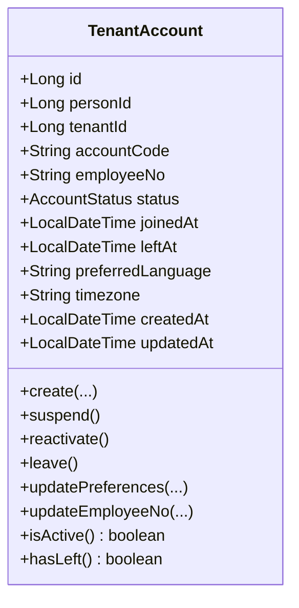
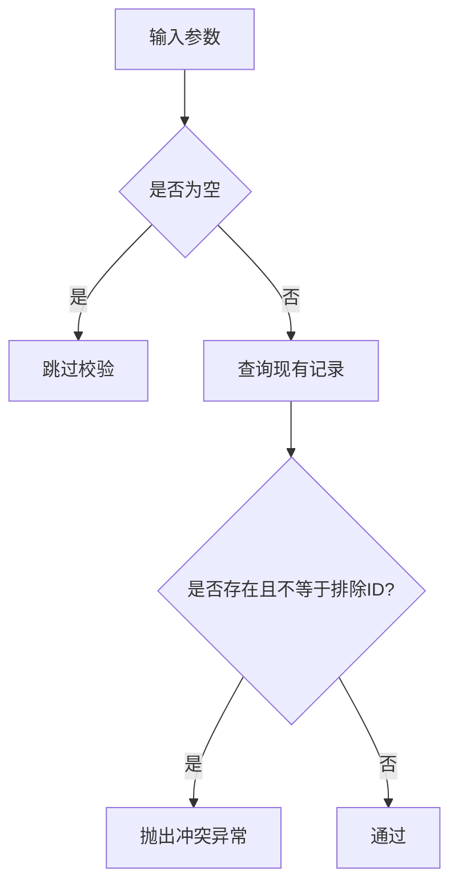
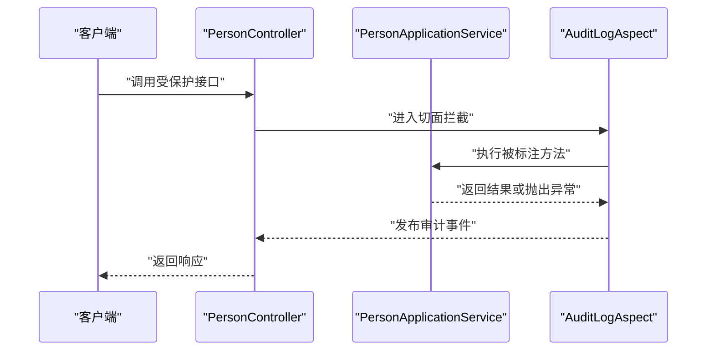
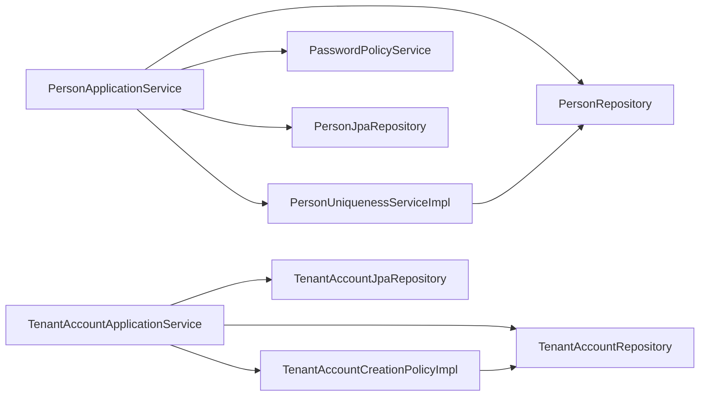

# 用户管理功能

<cite>
**本文引用的文件**
- [PersonApplicationService.java](file://iam-admin-server/src/main/java/iam/platform/admin/application/service/PersonApplicationService.java)
- [TenantAccountApplicationService.java](file://iam-admin-server/src/main/java/iam/platform/admin/application/service/TenantAccountApplicationService.java)
- [Person.java](file://iam-admin-server/src/main/java/iam/platform/admin/domain/model/entity/Person.java)
- [TenantAccount.java](file://iam-admin-server/src/main/java/iam/platform/admin/domain/model/entity/TenantAccount.java)
- [PersonController.java](file://iam-admin-server/src/main/java/iam/platform/admin/interfaces/rest/PersonController.java)
- [TenantAccountController.java](file://iam-admin-server/src/main/java/iam/platform/admin/interfaces/rest/TenantAccountController.java)
- [PersonUniquenessService.java](file://iam-admin-server/src/main/java/iam/platform/admin/domain/service/PersonUniquenessService.java)
- [PersonUniquenessServiceImpl.java](file://iam-admin-server/src/main/java/iam/platform/admin/domain/service/impl/PersonUniquenessServiceImpl.java)
- [TenantAccountCreationPolicy.java](file://iam-admin-server/src/main/java/iam/platform/admin/domain/service/TenantAccountCreationPolicy.java)
- [TenantAccountCreationPolicyImpl.java](file://iam-admin-server/src/main/java/iam/platform/admin/domain/service/impl/TenantAccountCreationPolicyImpl.java)
- [PasswordPolicyService.java](file://iam-admin-server/src/main/java/iam/platform/admin/domain/service/PasswordPolicyService.java)
- [PersonRepository.java](file://iam-admin-server/src/main/java/iam/platform/admin/domain/repository/PersonRepository.java)
- [TenantAccountRepository.java](file://iam-admin-server/src/main/java/iam/platform/admin/domain/repository/TenantAccountRepository.java)
- [PersonJpaRepository.java](file://iam-admin-server/src/main/java/iam/platform/admin/infrastructure/persistence/repository/PersonJpaRepository.java)
- [TenantAccountJpaRepository.java](file://iam-admin-server/src/main/java/iam/platform/admin/infrastructure/persistence/repository/TenantAccountJpaRepository.java)
- [AuditLogAspect.java](file://iam-admin-server/src/main/java/iam/platform/admin/infrastructure/aspect/AuditLogAspect.java)
</cite>

## 目录
1. [简介](#简介)
2. [项目结构](#项目结构)
3. [核心组件](#核心组件)
4. [架构总览](#架构总览)
5. [详细组件分析](#详细组件分析)
6. [依赖分析](#依赖分析)
7. [性能考虑](#性能考虑)
8. [故障排查指南](#故障排查指南)
9. [结论](#结论)
10. [附录](#附录)

## 简介
本技术文档围绕用户管理功能展开，系统性阐述自然人（Person）与租户账户（TenantAccount）两大核心实体的领域建模、应用服务层（Application Service）的业务编排、REST 接口设计、唯一性校验与密码策略、数据访问层（JPA Repository）实现与查询优化、以及与审计日志系统的集成方式。读者可据此快速理解并扩展用户管理能力。

## 项目结构
用户管理功能主要位于 admin-server 模块中，采用分层架构：
- 接口层：REST 控制器负责请求接入与响应封装
- 应用服务层：编排业务流程、调用领域服务与仓储
- 领域层：实体与值对象承载业务不变量与行为
- 数据访问层：JPA Repository 提供数据持久化能力
- 基础设施层：AOP 审计切面、配置与安全上下文

图表来源
- [PersonController.java:25-67](file://iam-admin-server/src/main/java/iam/platform/admin/interfaces/rest/PersonController.java#L25-L67)
- [TenantAccountController.java:26-93](file://iam-admin-server/src/main/java/iam/platform/admin/interfaces/rest/TenantAccountController.java#L26-L93)
- [PersonApplicationService.java:25-121](file://iam-admin-server/src/main/java/iam/platform/admin/application/service/PersonApplicationService.java#L25-L121)
- [TenantAccountApplicationService.java:29-187](file://iam-admin-server/src/main/java/iam/platform/admin/application/service/TenantAccountApplicationService.java#L29-L187)
- [Person.java:17-157](file://iam-admin-server/src/main/java/iam/platform/admin/domain/model/entity/Person.java#L17-L157)
- [TenantAccount.java:17-130](file://iam-admin-server/src/main/java/iam/platform/admin/domain/model/entity/TenantAccount.java#L17-L130)
- [PersonUniquenessServiceImpl.java:11-43](file://iam-admin-server/src/main/java/iam/platform/admin/domain/service/impl/PersonUniquenessServiceImpl.java#L11-L43)
- [TenantAccountCreationPolicyImpl.java:15-44](file://iam-admin-server/src/main/java/iam/platform/admin/domain/service/impl/TenantAccountCreationPolicyImpl.java#L15-L44)
- [PersonRepository.java:9-33](file://iam-admin-server/src/main/java/iam/platform/admin/domain/repository/PersonRepository.java#L9-L33)
- [TenantAccountRepository.java:10-32](file://iam-admin-server/src/main/java/iam/platform/admin/domain/repository/TenantAccountRepository.java#L10-L32)
- [PersonJpaRepository.java:8-24](file://iam-admin-server/src/main/java/iam/platform/admin/infrastructure/persistence/repository/PersonJpaRepository.java#L8-L24)
- [TenantAccountJpaRepository.java:11-27](file://iam-admin-server/src/main/java/iam/platform/admin/infrastructure/persistence/repository/TenantAccountJpaRepository.java#L11-L27)
- [AuditLogAspect.java:21-65](file://iam-admin-server/src/main/java/iam/platform/admin/infrastructure/aspect/AuditLogAspect.java#L21-L65)

章节来源
- [PersonController.java:25-67](file://iam-admin-server/src/main/java/iam/platform/admin/interfaces/rest/PersonController.java#L25-L67)
- [TenantAccountController.java:26-93](file://iam-admin-server/src/main/java/iam/platform/admin/interfaces/rest/TenantAccountController.java#L26-L93)

## 核心组件
- PersonApplicationService：负责自然人创建、查询、更新、删除与分页列表；在创建时执行字段唯一性校验与密码哈希；在更新时支持昵称头像更新、邮箱/手机变更的唯一性校验与启用状态切换；统一输出领域响应对象。
- TenantAccountApplicationService：负责为自然人创建租户账户、按 ID/人/租户查询、更新偏好语言与时区、员工编号唯一性校验、挂起/恢复/离职等生命周期操作；创建前通过策略校验租户状态与编码唯一性。
- Person 实体：承载用户名、邮箱、手机号、密码哈希、启用/锁定、认证信息等不变量与行为方法（如更新资料、变更邮箱/手机、启用/禁用、记录登录、标记已验证等）。
- TenantAccount 实体：承载人员与租户关联、账户状态（ACTIVE/SUSPENDED/LEFT）、加入时间、偏好设置（语言/时区）、员工编号等；提供状态机方法（挂起/恢复/离职）与查询方法。
- 唯一性服务与策略：PersonUniquenessServiceImpl 在应用服务层调用仓储进行唯一性检查；TenantAccountCreationPolicyImpl 在创建前校验租户状态与编码/员工编号唯一性。
- 密码策略：PasswordPolicyService 提供最小长度、大小写字母、数字等基础校验与强度判断。
- 数据访问：PersonRepository/TenantAccountRepository 抽象仓储接口，PersonJpaRepository/TenantAccountJpaRepository 承载 JPA 查询实现；提供存在性、分页、统计等常用查询。
- 审计日志：AuditLogAspect 以 AOP 切面拦截带注解的方法，自动记录审计事件并发布事件。

章节来源
- [PersonApplicationService.java:25-121](file://iam-admin-server/src/main/java/iam/platform/admin/application/service/PersonApplicationService.java#L25-L121)
- [TenantAccountApplicationService.java:29-187](file://iam-admin-server/src/main/java/iam/platform/admin/application/service/TenantAccountApplicationService.java#L29-L187)
- [Person.java:17-157](file://iam-admin-server/src/main/java/iam/platform/admin/domain/model/entity/Person.java#L17-L157)
- [TenantAccount.java:17-130](file://iam-admin-server/src/main/java/iam/platform/admin/domain/model/entity/TenantAccount.java#L17-L130)
- [PersonUniquenessServiceImpl.java:11-43](file://iam-admin-server/src/main/java/iam/platform/admin/domain/service/impl/PersonUniquenessServiceImpl.java#L11-L43)
- [TenantAccountCreationPolicyImpl.java:15-44](file://iam-admin-server/src/main/java/iam/platform/admin/domain/service/impl/TenantAccountCreationPolicyImpl.java#L15-L44)
- [PasswordPolicyService.java:7-34](file://iam-admin-server/src/main/java/iam/platform/admin/domain/service/PasswordPolicyService.java#L7-L34)
- [PersonRepository.java:9-33](file://iam-admin-server/src/main/java/iam/platform/admin/domain/repository/PersonRepository.java#L9-L33)
- [TenantAccountRepository.java:10-32](file://iam-admin-server/src/main/java/iam/platform/admin/domain/repository/TenantAccountRepository.java#L10-L32)
- [PersonJpaRepository.java:8-24](file://iam-admin-server/src/main/java/iam/platform/admin/infrastructure/persistence/repository/PersonJpaRepository.java#L8-L24)
- [TenantAccountJpaRepository.java:11-27](file://iam-admin-server/src/main/java/iam/platform/admin/infrastructure/persistence/repository/TenantAccountJpaRepository.java#L11-L27)
- [AuditLogAspect.java:21-65](file://iam-admin-server/src/main/java/iam/platform/admin/infrastructure/aspect/AuditLogAspect.java#L21-L65)

## 架构总览
用户管理遵循“接口层-应用服务层-领域层-数据访问层”的清晰分层，应用服务承担业务编排职责，领域实体内聚业务不变量与行为，仓储接口抽象数据访问，JPA 实现具体查询，AOP 审计贯穿关键业务路径。

图表来源
- [PersonController.java:33-38](file://iam-admin-server/src/main/java/iam/platform/admin/interfaces/rest/PersonController.java#L33-L38)
- [PersonApplicationService.java:34-51](file://iam-admin-server/src/main/java/iam/platform/admin/application/service/PersonApplicationService.java#L34-L51)
- [PersonUniquenessServiceImpl.java:15-42](file://iam-admin-server/src/main/java/iam/platform/admin/domain/service/impl/PersonUniquenessServiceImpl.java#L15-L42)
- [PasswordPolicyService.java:11-24](file://iam-admin-server/src/main/java/iam/platform/admin/domain/service/PasswordPolicyService.java#L11-L24)
- [PersonRepository.java](file://iam-admin-server/src/main/java/iam/platform/admin/domain/repository/PersonRepository.java#L10)
- [PersonJpaRepository.java:8-24](file://iam-admin-server/src/main/java/iam/platform/admin/infrastructure/persistence/repository/PersonJpaRepository.java#L8-L24)

## 详细组件分析

### PersonApplicationService 分析
- 职责边界：自然人 CRUD、分页查询、唯一性校验、密码处理、审计日志标注。
- 关键流程：
  - 创建：先执行用户名/邮箱/手机唯一性校验，再基于密码值对象生成哈希，通过工厂方法构造 Person，保存并返回响应。
  - 更新：先加载实体，支持昵称/头像更新、邮箱/手机变更的唯一性校验、启用/禁用切换；保存后返回响应。
  - 删除：按 ID 查询存在性，不存在抛异常；存在则删除。
  - 列表：分页查询并转换为响应对象。
- 审计：通过 @AuditLog 注解标注创建/更新/删除方法，由 AOP 切面统一采集上下文并发布审计事件。

图表来源
- [PersonApplicationService.java:34-51](file://iam-admin-server/src/main/java/iam/platform/admin/application/service/PersonApplicationService.java#L34-L51)
- [PersonUniquenessServiceImpl.java:15-42](file://iam-admin-server/src/main/java/iam/platform/admin/domain/service/impl/PersonUniquenessServiceImpl.java#L15-L42)
- [PasswordPolicyService.java:11-24](file://iam-admin-server/src/main/java/iam/platform/admin/domain/service/PasswordPolicyService.java#L11-L24)

章节来源
- [PersonApplicationService.java:31-121](file://iam-admin-server/src/main/java/iam/platform/admin/application/service/PersonApplicationService.java#L31-L121)

### TenantAccountApplicationService 分析
- 职责边界：为自然人创建租户账户、账户生命周期管理（挂起/恢复/离职）、偏好设置更新、跨租户唯一性校验、按人/租户查询与分页。
- 关键流程：
  - 创建：校验自然人存在性，调用创建策略校验租户状态与编码/员工编号唯一性，工厂方法创建账户，保存并返回响应。
  - 更新：对员工编号进行跨租户唯一性校验，委托实体更新偏好与员工编号，保存并返回响应。
  - 生命周期：仅允许 ACTIVE 账户挂起，仅允许 SUSPENDED 账户恢复；LEFT 状态不可逆。
  - 查询：按人/租户查询与分页，组装包含租户信息的响应。
- 审计：通过 @AuditLog 注解标注关键操作，AOP 切面统一记录。

图表来源
- [TenantAccountApplicationService.java:36-63](file://iam-admin-server/src/main/java/iam/platform/admin/application/service/TenantAccountApplicationService.java#L36-L63)
- [TenantAccountCreationPolicyImpl.java:20-44](file://iam-admin-server/src/main/java/iam/platform/admin/domain/service/impl/TenantAccountCreationPolicyImpl.java#L20-L44)

章节来源
- [TenantAccountApplicationService.java:29-187](file://iam-admin-server/src/main/java/iam/platform/admin/application/service/TenantAccountApplicationService.java#L29-L187)

### Person 实体模型
- 属性：标识、人员编码、用户名、邮箱、手机、密码哈希、验证状态、昵称、头像、启用/锁定、最近登录时间、创建/更新时间。
- 行为：
  - 工厂方法：注册时生成人员编码、默认状态与初始值。
  - 更新资料：更新昵称/头像并刷新时间戳。
  - 变更邮箱/手机：校验非空并重置验证状态，刷新时间戳。
  - 启用/禁用/锁定/解锁：维护状态并刷新时间戳。
  - 登录记录：记录成功登录时间并刷新时间戳。
  - 标记验证：分别标记邮箱/手机已验证并刷新时间戳。

图表来源
- [Person.java:17-157](file://iam-admin-server/src/main/java/iam/platform/admin/domain/model/entity/Person.java#L17-L157)

章节来源
- [Person.java:17-157](file://iam-admin-server/src/main/java/iam/platform/admin/domain/model/entity/Person.java#L17-L157)

### TenantAccount 实体模型
- 属性：标识、人员 ID、租户 ID、账户编码、员工编号、状态、加入/离开时间、偏好设置（语言/时区）、创建/更新时间。
- 行为：
  - 工厂方法：创建时设置默认语言/时区、状态为 ACTIVE、加入时间为当前时间。
  - 状态机：仅 ACTIVE 可挂起，仅 SUSPENDED 可恢复；LEFT 不可逆。
  - 偏好设置：可选更新语言与时区。
  - 员工编号：可更新。
  - 查询：提供活跃与已离开状态判断。

图表来源
- [TenantAccount.java:17-130](file://iam-admin-server/src/main/java/iam/platform/admin/domain/model/entity/TenantAccount.java#L17-L130)

章节来源
- [TenantAccount.java:17-130](file://iam-admin-server/src/main/java/iam/platform/admin/domain/model/entity/TenantAccount.java#L17-L130)

### REST API 设计
- 自然人接口
  - POST /v1/persons：创建自然人（请求体为 CreatePersonRequest，响应 201）。
  - GET /v1/persons/{id}：按 ID 获取自然人。
  - PUT /v1/persons/{id}：更新自然人。
  - DELETE /v1/persons/{id}：删除自然人（204）。
  - GET /v1/persons?page=&size=：分页列出自然人。
- 租户账户接口
  - POST /v1/persons/{personId}/tenant-accounts：为自然人创建租户账户。
  - GET /v1/tenant-accounts/{id}：按 ID 获取租户账户。
  - PUT /v1/tenant-accounts/{id}：更新租户账户。
  - POST /v1/tenant-accounts/{id}/suspend：挂起租户账户。
  - POST /v1/tenant-accounts/{id}/reactivate：恢复租户账户。
  - POST /v1/tenant-accounts/{id}/leave：离开租户。
  - GET /v1/persons/{personId}/tenant-accounts：获取某人的所有租户账户。
  - GET /v1/tenants/{tenantId}/tenant-accounts?page=&size=：分页列出某租户的账户。

章节来源
- [PersonController.java:25-67](file://iam-admin-server/src/main/java/iam/platform/admin/interfaces/rest/PersonController.java#L25-L67)
- [TenantAccountController.java:26-93](file://iam-admin-server/src/main/java/iam/platform/admin/interfaces/rest/TenantAccountController.java#L26-L93)

### 唯一性验证机制
- 自然人唯一性：用户名全局唯一；邮箱/手机在更新场景支持排除当前用户 ID 的唯一性校验，避免自更新失败。
- 租户账户唯一性：账户编码与员工编号在租户维度唯一，创建前通过策略统一校验。

图表来源
- [PersonUniquenessServiceImpl.java:15-42](file://iam-admin-server/src/main/java/iam/platform/admin/domain/service/impl/PersonUniquenessServiceImpl.java#L15-L42)
- [TenantAccountCreationPolicyImpl.java:20-44](file://iam-admin-server/src/main/java/iam/platform/admin/domain/service/impl/TenantAccountCreationPolicyImpl.java#L20-L44)

章节来源
- [PersonUniquenessService.java:7-35](file://iam-admin-server/src/main/java/iam/platform/admin/domain/service/PersonUniquenessService.java#L7-L35)
- [PersonUniquenessServiceImpl.java:11-43](file://iam-admin-server/src/main/java/iam/platform/admin/domain/service/impl/PersonUniquenessServiceImpl.java#L11-L43)
- [TenantAccountCreationPolicy.java:7-23](file://iam-admin-server/src/main/java/iam/platform/admin/domain/service/TenantAccountCreationPolicy.java#L7-L23)
- [TenantAccountCreationPolicyImpl.java:15-45](file://iam-admin-server/src/main/java/iam/platform/admin/domain/service/impl/TenantAccountCreationPolicyImpl.java#L15-L45)

### 密码策略服务
- 最小长度：至少 8 个字符。
- 字符要求：至少一个大写字母、一个小写字母、一个数字。
- 提供校验方法与强度判断方法，便于在应用服务或值对象层面复用。

章节来源
- [PasswordPolicyService.java:7-34](file://iam-admin-server/src/main/java/iam/platform/admin/domain/service/PasswordPolicyService.java#L7-L34)

### 租户账户创建策略
- 前置条件：
  - 租户必须存在且处于 ACTIVE 状态。
  - 账户编码在租户内唯一。
  - 员工编号在租户内唯一（若提供）。
- 违反任一条件将抛出相应异常，阻止非法创建。

章节来源
- [TenantAccountCreationPolicy.java:7-23](file://iam-admin-server/src/main/java/iam/platform/admin/domain/service/TenantAccountCreationPolicy.java#L7-L23)
- [TenantAccountCreationPolicyImpl.java:15-45](file://iam-admin-server/src/main/java/iam/platform/admin/domain/service/impl/TenantAccountCreationPolicyImpl.java#L15-L45)

### 数据访问层实现与查询优化
- 仓储接口：
  - PersonRepository：提供保存、按主键/用户名/邮箱/手机查询、存在性检查、分页、统计等。
  - TenantAccountRepository：提供保存、按主键/人/租户查询、分页、存在性检查、统计等。
- JPA 实现：
  - PersonJpaRepository：继承 JpaRepository，提供用户名/邮箱/手机查询与存在性检查、启用用户统计、时间段统计。
  - TenantAccountJpaRepository：继承 JpaRepository，提供人/租户维度查询、分页、存在性检查、状态统计。
- 查询优化建议：
  - 对高频查询（如按用户名/邮箱/手机查询）确保数据库建立对应索引。
  - 分页查询使用 PageRequest，避免一次性加载全量数据。
  - 复合唯一性校验（租户内账户编码/员工编号）应结合数据库唯一约束与应用层校验，减少并发冲突。

章节来源
- [PersonRepository.java:9-33](file://iam-admin-server/src/main/java/iam/platform/admin/domain/repository/PersonRepository.java#L9-L33)
- [TenantAccountRepository.java:10-32](file://iam-admin-server/src/main/java/iam/platform/admin/domain/repository/TenantAccountRepository.java#L10-L32)
- [PersonJpaRepository.java:8-24](file://iam-admin-server/src/main/java/iam/platform/admin/infrastructure/persistence/repository/PersonJpaRepository.java#L8-L24)
- [TenantAccountJpaRepository.java:11-27](file://iam-admin-server/src/main/java/iam/platform/admin/infrastructure/persistence/repository/TenantAccountJpaRepository.java#L11-L27)

### 与权限系统和审计日志系统的集成
- 权限系统：接口层使用注解声明所需权限，权限评估与授权切面在请求进入控制器前进行校验，未满足权限将拒绝访问。
- 审计日志：应用服务层通过 @AuditLog 标注关键业务方法，AOP 切面在方法执行前后收集上下文、捕获异常并发布审计事件，最终由事件监听器落库或异步处理。

图表来源
- [PersonController.java:25-67](file://iam-admin-server/src/main/java/iam/platform/admin/interfaces/rest/PersonController.java#L25-L67)
- [PersonApplicationService.java:31-121](file://iam-admin-server/src/main/java/iam/platform/admin/application/service/PersonApplicationService.java#L31-L121)
- [AuditLogAspect.java:27-48](file://iam-admin-server/src/main/java/iam/platform/admin/infrastructure/aspect/AuditLogAspect.java#L27-L48)

章节来源
- [AuditLogAspect.java:21-65](file://iam-admin-server/src/main/java/iam/platform/admin/infrastructure/aspect/AuditLogAspect.java#L21-L65)

## 依赖分析
- 应用服务对领域服务与仓储的依赖清晰：PersonApplicationService 依赖 PersonUniquenessService 与 PasswordPolicyService；TenantAccountApplicationService 依赖 TenantAccountCreationPolicy。
- 仓储接口与 JPA 实现解耦：通过接口隔离具体实现，便于替换与测试。
- 审计切面横切关注点：对业务方法无侵入式增强，提升可观测性。

图表来源
- [PersonApplicationService.java:27-29](file://iam-admin-server/src/main/java/iam/platform/admin/application/service/PersonApplicationService.java#L27-L29)
- [TenantAccountApplicationService.java:31-34](file://iam-admin-server/src/main/java/iam/platform/admin/application/service/TenantAccountApplicationService.java#L31-L34)
- [PersonUniquenessServiceImpl.java](file://iam-admin-server/src/main/java/iam/platform/admin/domain/service/impl/PersonUniquenessServiceImpl.java#L13)
- [TenantAccountCreationPolicyImpl.java:17-18](file://iam-admin-server/src/main/java/iam/platform/admin/domain/service/impl/TenantAccountCreationPolicyImpl.java#L17-L18)
- [PersonRepository.java:9-33](file://iam-admin-server/src/main/java/iam/platform/admin/domain/repository/PersonRepository.java#L9-L33)
- [TenantAccountRepository.java:10-32](file://iam-admin-server/src/main/java/iam/platform/admin/domain/repository/TenantAccountRepository.java#L10-L32)
- [PersonJpaRepository.java:8-24](file://iam-admin-server/src/main/java/iam/platform/admin/infrastructure/persistence/repository/PersonJpaRepository.java#L8-L24)
- [TenantAccountJpaRepository.java:11-27](file://iam-admin-server/src/main/java/iam/platform/admin/infrastructure/persistence/repository/TenantAccountJpaRepository.java#L11-L27)

章节来源
- [PersonApplicationService.java:27-29](file://iam-admin-server/src/main/java/iam/platform/admin/application/service/PersonApplicationService.java#L27-L29)
- [TenantAccountApplicationService.java:31-34](file://iam-admin-server/src/main/java/iam/platform/admin/application/service/TenantAccountApplicationService.java#L31-L34)

## 性能考虑
- 查询分页：列表与分页接口使用 PageRequest，避免一次性加载大量数据。
- 唯一性检查：在创建/更新前进行存在性检查，必要时配合数据库唯一约束降低重复提交带来的开销。
- 缓存策略：对于只读查询（如按 ID 查询），可在仓储层引入缓存以减少数据库压力。
- 并发控制：创建租户账户时的唯一性校验可能产生竞争，建议结合数据库唯一约束与幂等设计，确保高并发下的数据一致性。

## 故障排查指南
- 唯一性冲突：当用户名/邮箱/手机或租户内账户编码/员工编号冲突时，会抛出冲突异常；请检查输入参数与现有数据。
- 租户状态异常：仅 ACTIVE 租户可创建账户；若提示租户非 ACTIVE，请先激活租户。
- 资源不存在：按 ID 查询不到实体时抛出“未找到”异常；请确认 ID 是否正确。
- 审计事件失败：审计切面在发布事件时出现异常会被记录到日志；请检查审计配置与事件发布通道。

章节来源
- [PersonUniquenessServiceImpl.java:17-41](file://iam-admin-server/src/main/java/iam/platform/admin/domain/service/impl/PersonUniquenessServiceImpl.java#L17-L41)
- [TenantAccountCreationPolicyImpl.java:23-43](file://iam-admin-server/src/main/java/iam/platform/admin/domain/service/impl/TenantAccountCreationPolicyImpl.java#L23-L43)
- [AuditLogAspect.java:50-58](file://iam-admin-server/src/main/java/iam/platform/admin/infrastructure/aspect/AuditLogAspect.java#L50-L58)

## 结论
用户管理功能通过清晰的分层设计与强约束的领域模型，实现了自然人与租户账户的完整生命周期管理。应用服务承担编排职责，结合唯一性校验与密码策略保障数据质量；JPA 仓储提供稳定的数据访问能力；AOP 审计贯穿关键业务路径，提升系统的可观测性与合规性。该架构易于扩展与维护，适合在多租户场景下持续演进。

## 附录
- 常用查询建议
  - 自然人：按用户名/邮箱/手机查询时，确保数据库建立对应索引；分页查询使用 PageRequest。
  - 租户账户：按租户维度查询时，优先使用租户 ID 作为过滤条件；对账户编码与员工编号建立唯一索引。
- 安全建议
  - 密码存储使用强哈希算法，避免明文存储。
  - 对外暴露的接口需开启权限校验与审计日志。
  - 对高风险操作（如挂起/恢复/删除）增加二次确认与审计记录。