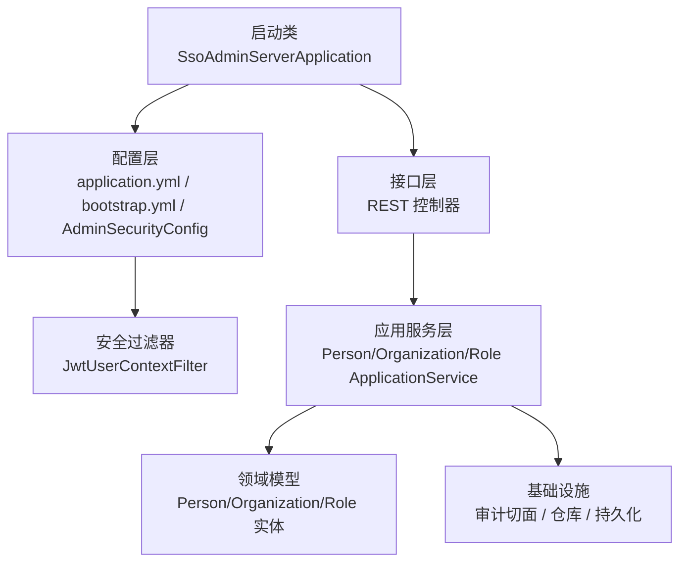
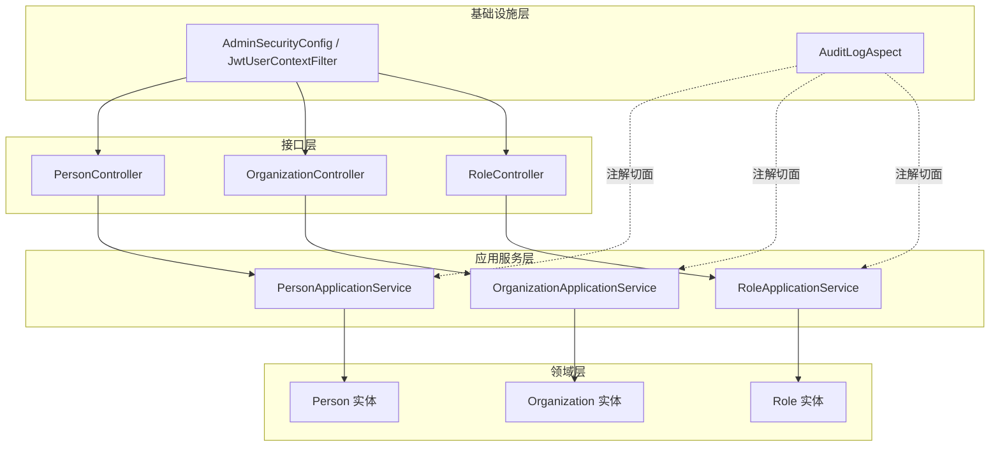
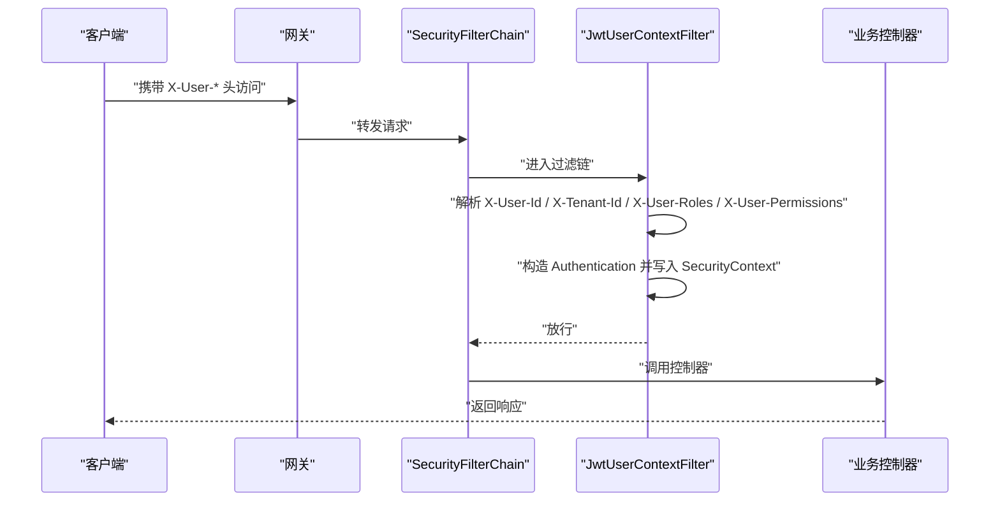
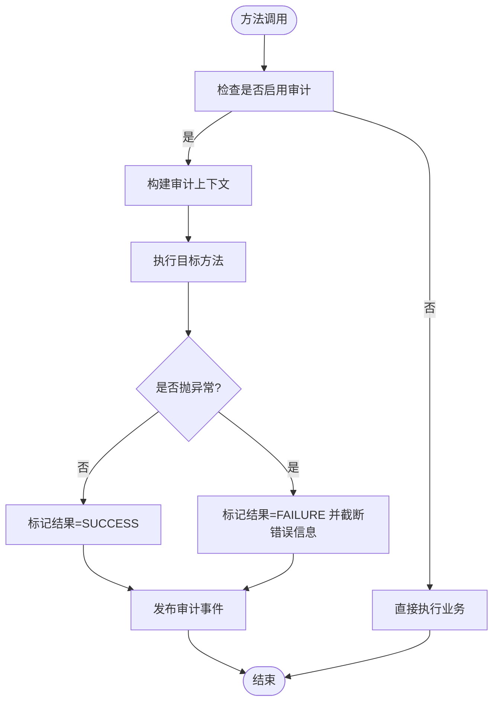
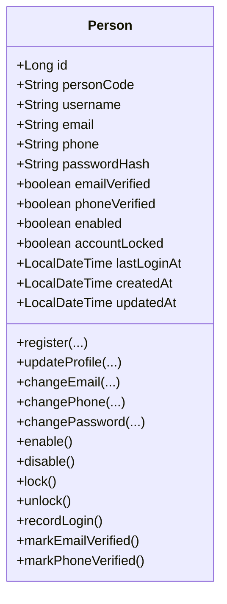
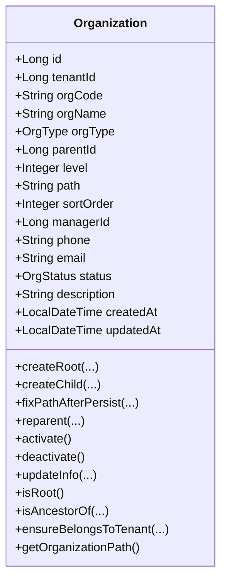
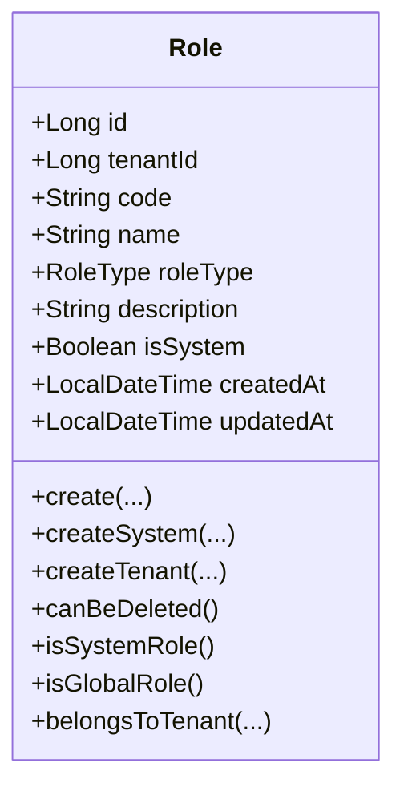
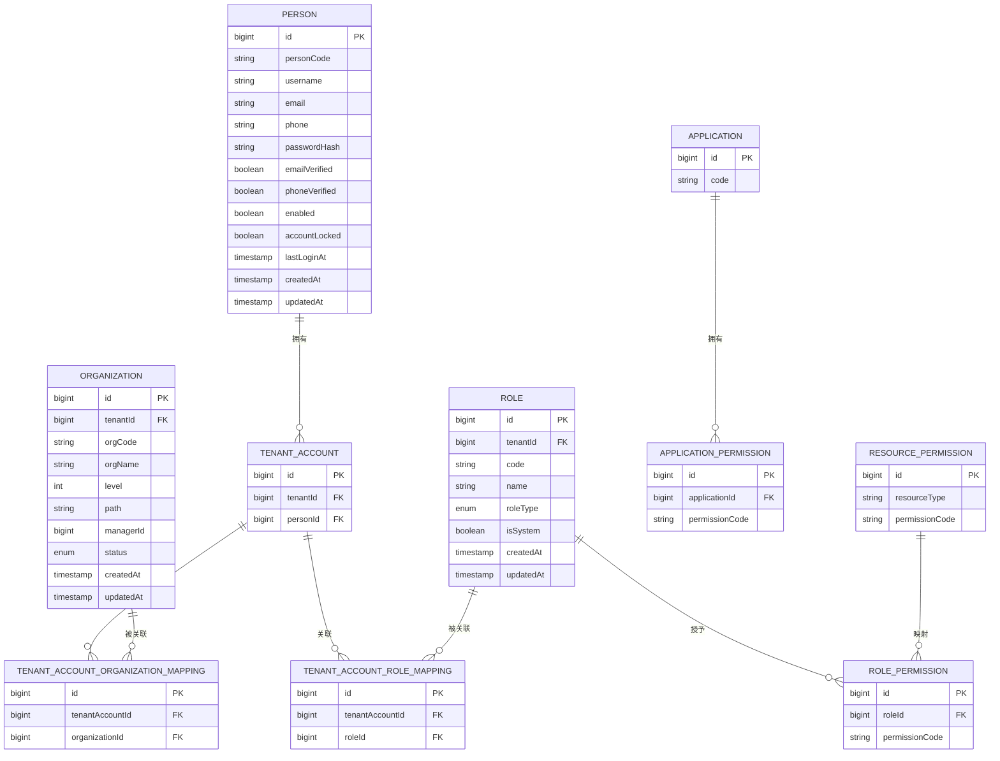

# 管理服务器（iam-admin-server）

<cite>
**本文引用的文件**
- [SsoAdminServerApplication.java](file://iam-admin-server/src/main/java/iam/platform/admin/SsoAdminServerApplication.java)
- [pom.xml](file://iam-admin-server/pom.xml)
- [application.yml](file://iam-admin-server/src/main/resources/application.yml)
- [bootstrap.yml](file://iam-admin-server/bootstrap.yml)
- [AdminSecurityConfig.java](file://iam-admin-server/src/main/java/iam/platform/admin/infrastructure/config/AdminSecurityConfig.java)
- [JwtUserContextFilter.java](file://iam-admin-server/src/main/java/iam/platform/admin/infrastructure/security/JwtUserContextFilter.java)
- [AuditLogAspect.java](file://iam-admin-server/src/main/java/iam/platform/admin/infrastructure/aspect/AuditLogAspect.java)
- [Person.java](file://iam-admin-server/src/main/java/iam/platform/admin/domain/model/entity/Person.java)
- [Organization.java](file://iam-admin-server/src/main/java/iam/platform/admin/domain/model/entity/Organization.java)
- [Role.java](file://iam-admin-server/src/main/java/iam/platform/admin/domain/model/entity/Role.java)
- [PersonApplicationService.java](file://iam-admin-server/src/main/java/iam/platform/admin/application/service/PersonApplicationService.java)
- [OrganizationApplicationService.java](file://iam-admin-server/src/main/java/iam/platform/admin/application/service/OrganizationApplicationService.java)
- [RoleApplicationService.java](file://iam-admin-server/src/main/java/iam/platform/admin/application/service/RoleApplicationService.java)
- [PersonController.java](file://iam-admin-server/src/main/java/iam/platform/admin/interfaces/rest/PersonController.java)
- [OrganizationController.java](file://iam-admin-server/src/main/java/iam/platform/admin/interfaces/rest/OrganizationController.java)
- [RoleController.java](file://iam-admin-server/src/main/java/iam/platform/admin/interfaces/rest/RoleController.java)
</cite>

## 目录
1. [简介](#简介)
2. [项目结构](#项目结构)
3. [核心组件](#核心组件)
4. [架构总览](#架构总览)
5. [详细组件分析](#详细组件分析)
6. [依赖分析](#依赖分析)
7. [性能考虑](#性能考虑)
8. [故障排查指南](#故障排查指南)
9. [结论](#结论)
10. [附录](#附录)

## 简介
本文件面向管理服务器模块（iam-admin-server），系统性阐述其作为用户与权限管理中心的整体架构与实现要点。重点覆盖：
- 应用启动类与整体配置
- 用户管理（人员、组织、角色）的业务实现
- 权限管理机制（RBAC 模型、权限评估）
- 审计日志系统（切面设计、事件捕获与异步记录）
- 安全配置（JWT 用户上下文过滤器、租户上下文、权限授权拦截）
- 数据模型设计（用户、组织、角色等实体关系）
- 管理界面 REST API 设计与实现（CRUD 与业务接口）

## 项目结构
管理服务器采用分层与领域驱动设计（DDD）相结合的组织方式：
- 启动入口：SsoAdminServerApplication
- 配置层：application.yml、bootstrap.yml、AdminSecurityConfig、JwtUserContextFilter
- 领域层：domain/model/entity 下的 Person、Organization、Role 等实体
- 应用层：application/service 下的 PersonApplicationService、OrganizationApplicationService、RoleApplicationService 等
- 接口层：interfaces/rest 下的 PersonController、OrganizationController、RoleController 等
- 基础设施：aspect（审计）、persistence（JPA 映射与仓库）、security（上下文与拦截器）、config（安全、Redis、OpenAPI 等）

图表来源
- [SsoAdminServerApplication.java:1-17](file://iam-admin-server/src/main/java/iam/platform/admin/SsoAdminServerApplication.java#L1-L17)
- [application.yml:1-102](file://iam-admin-server/src/main/resources/application.yml#L1-L102)
- [bootstrap.yml:1-10](file://iam-admin-server/bootstrap.yml#L1-L10)
- [AdminSecurityConfig.java:1-41](file://iam-admin-server/src/main/java/iam/platform/admin/infrastructure/config/AdminSecurityConfig.java#L1-L41)
- [JwtUserContextFilter.java:1-87](file://iam-admin-server/src/main/java/iam/platform/admin/infrastructure/security/JwtUserContextFilter.java#L1-L87)

章节来源
- [SsoAdminServerApplication.java:1-17](file://iam-admin-server/src/main/java/iam/platform/admin/SsoAdminServerApplication.java#L1-L17)
- [pom.xml:1-150](file://iam-admin-server/pom.xml#L1-L150)
- [application.yml:1-102](file://iam-admin-server/src/main/resources/application.yml#L1-L102)
- [bootstrap.yml:1-10](file://iam-admin-server/bootstrap.yml#L1-L10)

## 核心组件
- 应用启动与扫描
  - 启动类启用 Spring Boot 自动装配、配置属性扫描与 JPA 仓库扫描，统一在包路径下完成组件发现。
- 安全与上下文
  - AdminSecurityConfig 定义无状态会话策略与过滤链，JwtUserContextFilter 从网关透传头中提取用户上下文（用户ID、租户ID、角色与权限），注入到 Spring Security 上下文中。
- 审计系统
  - AuditLogAspect 基于注解拦截方法执行，构建审计上下文并在成功或失败后发布审计事件，支持异步处理与结果标记。
- 用户与组织/角色管理
  - PersonApplicationService、OrganizationApplicationService、RoleApplicationService 提供完整的增删改查与业务校验；各实体封装不变量与行为方法，确保领域内聚。

章节来源
- [AdminSecurityConfig.java:1-41](file://iam-admin-server/src/main/java/iam/platform/admin/infrastructure/config/AdminSecurityConfig.java#L1-L41)
- [JwtUserContextFilter.java:1-87](file://iam-admin-server/src/main/java/iam/platform/admin/infrastructure/security/JwtUserContextFilter.java#L1-L87)
- [AuditLogAspect.java:1-66](file://iam-admin-server/src/main/java/iam/platform/admin/infrastructure/aspect/AuditLogAspect.java#L1-L66)
- [PersonApplicationService.java:1-122](file://iam-admin-server/src/main/java/iam/platform/admin/application/service/PersonApplicationService.java#L1-L122)
- [OrganizationApplicationService.java:1-191](file://iam-admin-server/src/main/java/iam/platform/admin/application/service/OrganizationApplicationService.java#L1-L191)
- [RoleApplicationService.java:1-84](file://iam-admin-server/src/main/java/iam/platform/admin/application/service/RoleApplicationService.java#L1-L84)

## 架构总览
管理服务器采用“接口层-应用服务层-领域层-基础设施层”的清晰分层，结合 Spring Security 的无状态过滤链与自定义上下文注入，形成统一的鉴权与授权入口。审计通过 AOP 切面贯穿业务方法，保证可追溯性。

图表来源
- [PersonController.java:1-68](file://iam-admin-server/src/main/java/iam/platform/admin/interfaces/rest/PersonController.java#L1-L68)
- [OrganizationController.java:1-84](file://iam-admin-server/src/main/java/iam/platform/admin/interfaces/rest/OrganizationController.java#L1-L84)
- [RoleController.java:1-58](file://iam-admin-server/src/main/java/iam/platform/admin/interfaces/rest/RoleController.java#L1-L58)
- [PersonApplicationService.java:1-122](file://iam-admin-server/src/main/java/iam/platform/admin/application/service/PersonApplicationService.java#L1-L122)
- [OrganizationApplicationService.java:1-191](file://iam-admin-server/src/main/java/iam/platform/admin/application/service/OrganizationApplicationService.java#L1-L191)
- [RoleApplicationService.java:1-84](file://iam-admin-server/src/main/java/iam/platform/admin/application/service/RoleApplicationService.java#L1-L84)
- [AdminSecurityConfig.java:1-41](file://iam-admin-server/src/main/java/iam/platform/admin/infrastructure/config/AdminSecurityConfig.java#L1-L41)
- [JwtUserContextFilter.java:1-87](file://iam-admin-server/src/main/java/iam/platform/admin/infrastructure/security/JwtUserContextFilter.java#L1-L87)
- [AuditLogAspect.java:1-66](file://iam-admin-server/src/main/java/iam/platform/admin/infrastructure/aspect/AuditLogAspect.java#L1-L66)

## 详细组件分析

### 应用启动与配置
- 启动类职责
  - 扫描配置属性与 JPA 仓库，承载应用上下文初始化。
- 运行时配置
  - application.yml 定义端口、SSL、数据库连接、JPA 方言、Redis、Flyway、Jackson 时区与格式、Spring Session 存储、OpenAPI 路径、Actuator/Micrometer/Zipkin 等。
  - bootstrap.yml 集成 Nacos 发现，设置命名空间与元数据。
- 依赖与技术栈
  - 使用 Spring Web、Data JPA、Security、Redis、AOP、OAuth2 Client、Flyway、OpenAPI、Actuator+Prometheus+Tracing 等。

章节来源
- [SsoAdminServerApplication.java:1-17](file://iam-admin-server/src/main/java/iam/platform/admin/SsoAdminServerApplication.java#L1-L17)
- [application.yml:1-102](file://iam-admin-server/src/main/resources/application.yml#L1-L102)
- [bootstrap.yml:1-10](file://iam-admin-server/bootstrap.yml#L1-L10)
- [pom.xml:1-150](file://iam-admin-server/pom.xml#L1-L150)

### 安全与租户上下文
- 安全过滤链
  - 无状态会话策略，放行健康检查、API 文档与错误页面，其余请求均需认证。
  - 在用户名密码过滤器之前插入 JwtUserContextFilter。
- JWT 用户上下文过滤器
  - 从请求头读取用户ID、租户ID、角色数组与权限数组，构造 GrantedAuthority 并写入 SecurityContext。
  - 将租户ID写入 TenantContext，便于后续业务按租户隔离。
- 密码编码器
  - 使用 BCryptPasswordEncoder。

图表来源
- [AdminSecurityConfig.java:18-34](file://iam-admin-server/src/main/java/iam/platform/admin/infrastructure/config/AdminSecurityConfig.java#L18-L34)
- [JwtUserContextFilter.java:29-63](file://iam-admin-server/src/main/java/iam/platform/admin/infrastructure/security/JwtUserContextFilter.java#L29-L63)

章节来源
- [AdminSecurityConfig.java:1-41](file://iam-admin-server/src/main/java/iam/platform/admin/infrastructure/config/AdminSecurityConfig.java#L1-L41)
- [JwtUserContextFilter.java:1-87](file://iam-admin-server/src/main/java/iam/platform/admin/infrastructure/security/JwtUserContextFilter.java#L1-L87)

### 审计日志系统
- 切面设计
  - 基于 @AuditLog 注解拦截方法，构建审计上下文，记录资源类型、动作模板与参数占位符。
  - 成功标记为 SUCCESS，异常时标记 FAILURE 并截断错误消息长度。
- 事件发布
  - 通过 ApplicationEventPublisher 异步发布审计事件，避免阻塞主业务流程。
- 配置项
  - application.yml 中开启审计、设置保留天数与异步线程池大小。

图表来源
- [AuditLogAspect.java:27-48](file://iam-admin-server/src/main/java/iam/platform/admin/infrastructure/aspect/AuditLogAspect.java#L27-L48)
- [application.yml:93-102](file://iam-admin-server/src/main/resources/application.yml#L93-L102)

章节来源
- [AuditLogAspect.java:1-66](file://iam-admin-server/src/main/java/iam/platform/admin/infrastructure/aspect/AuditLogAspect.java#L1-L66)
- [application.yml:93-102](file://iam-admin-server/src/main/resources/application.yml#L93-L102)

### 用户管理（人员）
- 业务能力
  - 创建、查询、更新（含资料变更、邮箱/手机唯一性校验、启用/禁用）、删除、分页列表。
  - 使用 @AuditLog 注解记录审计事件。
- 领域模型
  - Person 实体包含账号状态、认证信息、个人资料、验证状态与时间戳；提供注册、修改密码、启用/禁用、锁定/解锁、登录记录、邮箱/手机验证等行为方法。
- 应用服务
  - PersonApplicationService 调用领域工厂方法与仓储保存，使用 Password 值对象进行密码哈希与校验。

图表来源
- [Person.java:17-158](file://iam-admin-server/src/main/java/iam/platform/admin/domain/model/entity/Person.java#L17-L158)

章节来源
- [PersonApplicationService.java:1-122](file://iam-admin-server/src/main/java/iam/platform/admin/application/service/PersonApplicationService.java#L1-L122)
- [Person.java:1-158](file://iam-admin-server/src/main/java/iam/platform/admin/domain/model/entity/Person.java#L1-L158)
- [PersonController.java:1-68](file://iam-admin-server/src/main/java/iam/platform/admin/interfaces/rest/PersonController.java#L1-L68)

### 组织管理（组织）
- 业务能力
  - 创建根组织/子组织、更新、移动（重父）、激活/停用、删除（禁止有子节点）、树形查询。
  - 使用 @AuditLog 注解记录审计事件。
- 领域模型
  - Organization 实体支持层级路径（OrganizationPath）与祖先关系判断；提供创建根/子组织、修复路径、重父、状态变更、信息更新等行为。
- 应用服务
  - OrganizationApplicationService 调用仓储与领域服务，确保租户一致性与路径修正。

图表来源
- [Organization.java:18-217](file://iam-admin-server/src/main/java/iam/platform/admin/domain/model/entity/Organization.java#L18-L217)

章节来源
- [OrganizationApplicationService.java:1-191](file://iam-admin-server/src/main/java/iam/platform/admin/application/service/OrganizationApplicationService.java#L1-L191)
- [Organization.java:1-217](file://iam-admin-server/src/main/java/iam/platform/admin/domain/model/entity/Organization.java#L1-L217)
- [OrganizationController.java:1-84](file://iam-admin-server/src/main/java/iam/platform/admin/interfaces/rest/OrganizationController.java#L1-L84)

### 角色管理（角色）
- 业务能力
  - 创建（区分全局与租户自定义）、查询、列表（租户可见全局+租户角色）、删除（系统内置角色不可删）。
  - 使用 @AuditLog 注解记录审计事件。
- 领域模型
  - Role 实体支持系统内置与租户自定义类型；提供创建系统角色/租户角色、删除约束、归属租户判断等。

图表来源
- [Role.java:16-83](file://iam-admin-server/src/main/java/iam/platform/admin/domain/model/entity/Role.java#L16-L83)

章节来源
- [RoleApplicationService.java:1-84](file://iam-admin-server/src/main/java/iam/platform/admin/application/service/RoleApplicationService.java#L1-L84)
- [Role.java:1-83](file://iam-admin-server/src/main/java/iam/platform/admin/domain/model/entity/Role.java#L1-L83)
- [RoleController.java:1-58](file://iam-admin-server/src/main/java/iam/platform/admin/interfaces/rest/RoleController.java#L1-L58)

### 权限管理与 RBAC 模型
- 权限来源
  - JwtUserContextFilter 从网关头中解析角色与权限数组，并转换为 GrantedAuthority 注入 SecurityContext。
- 权限评估
  - 当前代码未显式展示权限评估服务实现，但通过 @PreAuthorize/@PostAuthorize 或自定义权限拦截器可扩展。
- 角色-权限映射
  - 可通过 RolePermission、ApplicationPermission 等实体与仓储在应用层进行加载与评估（具体实现可在 domain/repository/service 层扩展）。

章节来源
- [JwtUserContextFilter.java:65-85](file://iam-admin-server/src/main/java/iam/platform/admin/infrastructure/security/JwtUserContextFilter.java#L65-L85)

### 数据模型设计与关系
- 核心实体
  - Person：人员基本信息与状态
  - Organization：组织树与层级路径
  - Role：角色（系统/租户自定义）
- 关系要点
  - Organization 与 Tenant 通过 tenantId 关联
  - Person 与 Organization 通过映射表（如 TenantAccountOrganizationMapping）建立多对多关系（映射类见 infrastructure/persistence/entity）
  - Role 与 Person 通过映射表（如 TenantAccountRoleMapping）建立多对多关系
  - Application 与权限（ApplicationPermission/RolePermission/ResourcePermission）建立关联以支撑资源级权限控制

图表来源
- [Person.java:17-32](file://iam-admin-server/src/main/java/iam/platform/admin/domain/model/entity/Person.java#L17-L32)
- [Organization.java:18-34](file://iam-admin-server/src/main/java/iam/platform/admin/domain/model/entity/Organization.java#L18-L34)
- [Role.java:16-25](file://iam-admin-server/src/main/java/iam/platform/admin/domain/model/entity/Role.java#L16-L25)
- [TenantAccountOrganizationMapping.java](file://iam-admin-server/src/main/java/iam/platform/admin/domain/model/entity/TenantAccountOrganizationMapping.java)
- [TenantAccountRoleMapping.java](file://iam-admin-server/src/main/java/iam/platform/admin/domain/model/entity/TenantAccountRoleMapping.java)
- [ApplicationPermission.java](file://iam-admin-server/src/main/java/iam/platform/admin/domain/model/entity/ApplicationPermission.java)
- [RolePermission.java](file://iam-admin-server/src/main/java/iam/platform/admin/domain/model/entity/RolePermission.java)
- [ResourcePermission.java](file://iam-admin-server/src/main/java/iam/platform/admin/domain/model/entity/ResourcePermission.java)

### 管理界面 REST API 设计与实现
- 人员接口
  - POST /v1/persons：创建
  - GET /v1/persons/{id}：按ID查询
  - PUT /v1/persons/{id}：更新
  - DELETE /v1/persons/{id}：删除
  - GET /v1/persons?page=&size=：分页列表
- 组织接口
  - POST /v1/tenants/{tenantId}/organizations：创建
  - GET /v1/tenants/{tenantId}/organizations/{id}：按ID查询
  - PUT /v1/tenants/{tenantId}/organizations/{id}：更新
  - DELETE /v1/tenants/{tenantId}/organizations/{id}：删除
  - POST /v1/tenants/{tenantId}/organizations/{id}/activate：激活
  - POST /v1/tenants/{tenantId}/organizations/{id}/deactivate：停用
  - GET /v1/tenants/{tenantId}/organizations：树形查询
- 角色接口
  - POST /v1/tenants/{tenantId}/roles：创建
  - GET /v1/tenants/{tenantId}/roles/{id}：按ID查询
  - GET /v1/tenants/{tenantId}/roles：列表（包含全局角色）
  - DELETE /v1/tenants/{tenantId}/roles/{id}：删除

章节来源
- [PersonController.java:1-68](file://iam-admin-server/src/main/java/iam/platform/admin/interfaces/rest/PersonController.java#L1-L68)
- [OrganizationController.java:1-84](file://iam-admin-server/src/main/java/iam/platform/admin/interfaces/rest/OrganizationController.java#L1-L84)
- [RoleController.java:1-58](file://iam-admin-server/src/main/java/iam/platform/admin/interfaces/rest/RoleController.java#L1-L58)

## 依赖分析
- 内部依赖
  - 依赖 iam-common 提供 DTO、枚举、注解与通用异常。
- 外部依赖
  - Web、JPA、Redis、Validation、Security、AOP、OAuth2 Client、Flyway、OpenAPI、Actuator+Prometheus+Zipkin、Lombok、MapStruct。
- 配置与运行
  - application.yml 配置数据源、JPA、Redis、Session、OAuth2 客户端、加密密钥、OpenAPI、管理端点与观测性。
  - bootstrap.yml 配置 Nacos 服务发现。

```mermaid
graph TB
M["iam-admin-server"] --> C["iam-common"]
M --> W["spring-boot-starter-web"]
M --> J["spring-boot-starter-data-jpa"]
M --> R["spring-boot-starter-data-redis"]
M --> V["spring-boot-starter-validation"]
M --> S["spring-boot-starter-security"]
M --> A["spring-boot-starter-aop"]
M --> O["spring-boot-starter-oauth2-client"]
M --> F["flyway-core"]
M --> OAS["springdoc-openapi-starter-webmvc-ui"]
M --> ACT["spring-boot-starter-actuator"]
M --> MP["micrometer-registry-prometheus"]
M --> Z["micrometer-tracing-bridge-brave / zipkin-reporter-brave"]
M --> L["lombok"]
M --> MS["mapstruct"]
```

图表来源
- [pom.xml:18-136](file://iam-admin-server/pom.xml#L18-L136)

章节来源
- [pom.xml:1-150](file://iam-admin-server/pom.xml#L1-L150)
- [application.yml:10-102](file://iam-admin-server/src/main/resources/application.yml#L10-L102)
- [bootstrap.yml:1-10](file://iam-admin-server/bootstrap.yml#L1-L10)

## 性能考虑
- 连接池与会话
  - HikariCP 最大池大小、空闲超时与生命周期配置，建议根据并发与事务峰值调整。
  - Redis 作为 Session 存储，注意键空间与过期策略。
- 审计异步化
  - AuditLogAspect 支持异步事件发布，建议合理配置线程池大小与队列容量，避免阻塞主业务。
- 查询与分页
  - 分页接口使用 PageRequest，建议配合索引与投影优化。
- 观测性
  - Actuator、Prometheus、Zipkin 已集成，建议结合采样率与标签完善监控。

## 故障排查指南
- 认证失败
  - 检查网关是否正确透传 X-User-* 头；确认 AdminSecurityConfig 是否正确注入 JwtUserContextFilter。
- 租户上下文为空
  - 确认请求头中包含 X-Tenant-Id；检查 TenantContext 设置逻辑。
- 审计未记录
  - 确认 @AuditLog 注解是否添加；检查 application.yml 中审计开关与异步配置。
- 数据库迁移
  - Flyway 已启用，检查迁移脚本位置与执行日志。
- OAuth2 登录
  - 检查 application.yml 中 client 与 provider 配置，确认回调地址与作用域。

章节来源
- [AdminSecurityConfig.java:18-34](file://iam-admin-server/src/main/java/iam/platform/admin/infrastructure/config/AdminSecurityConfig.java#L18-L34)
- [JwtUserContextFilter.java:33-60](file://iam-admin-server/src/main/java/iam/platform/admin/infrastructure/security/JwtUserContextFilter.java#L33-L60)
- [AuditLogAspect.java:30-32](file://iam-admin-server/src/main/java/iam/platform/admin/infrastructure/aspect/AuditLogAspect.java#L30-L32)
- [application.yml:38-41](file://iam-admin-server/src/main/resources/application.yml#L38-L41)
- [application.yml:52-64](file://iam-admin-server/src/main/resources/application.yml#L52-L64)

## 结论
管理服务器以清晰的分层与领域模型为核心，结合无状态安全过滤链与租户上下文注入，提供了稳定可靠的用户与权限管理基础。通过 @AuditLog 切面实现了贯穿业务的审计能力，辅以完善的 REST API 与可观测性配置，满足企业级管理平台的需求。后续可在权限评估与资源级权限映射方面进一步完善 RBAC 实现细节。

## 附录
- 开发与部署建议
  - 使用 application-dev.yml 进行本地开发，生产环境通过环境变量覆盖敏感配置。
  - Docker Compose 与 K8s 清单位于 docs/archived/k8s，可用于容器化部署参考。
- API 文档
  - OpenAPI 文档路径与 UI 路径已在 application.yml 中配置，可通过 /v3/api-docs 与 /swagger-ui.html 访问。