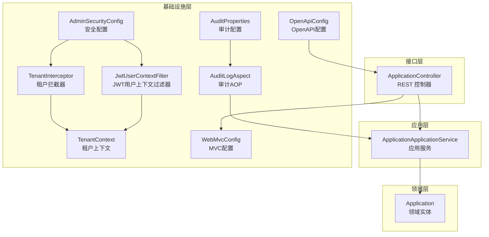
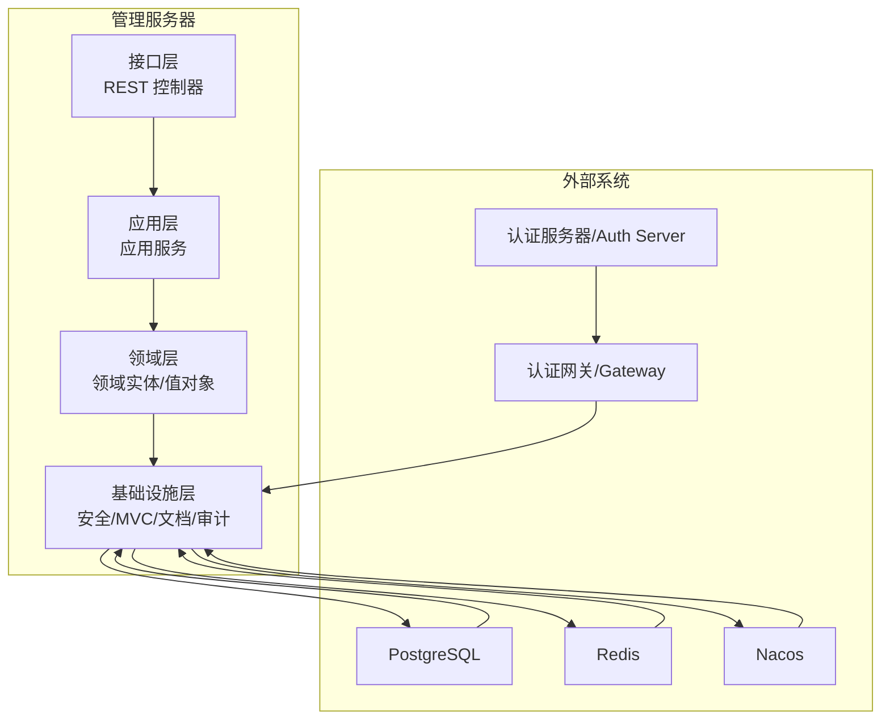
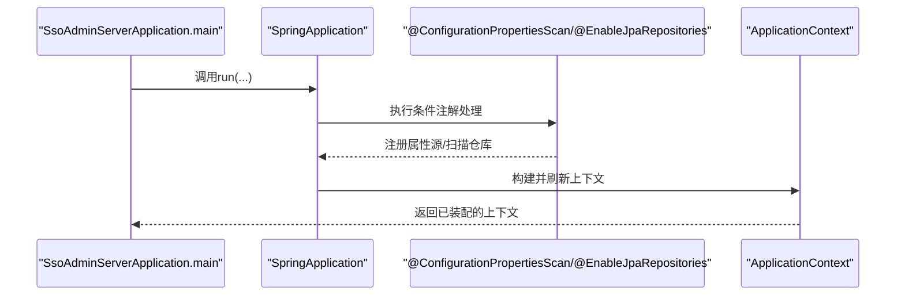
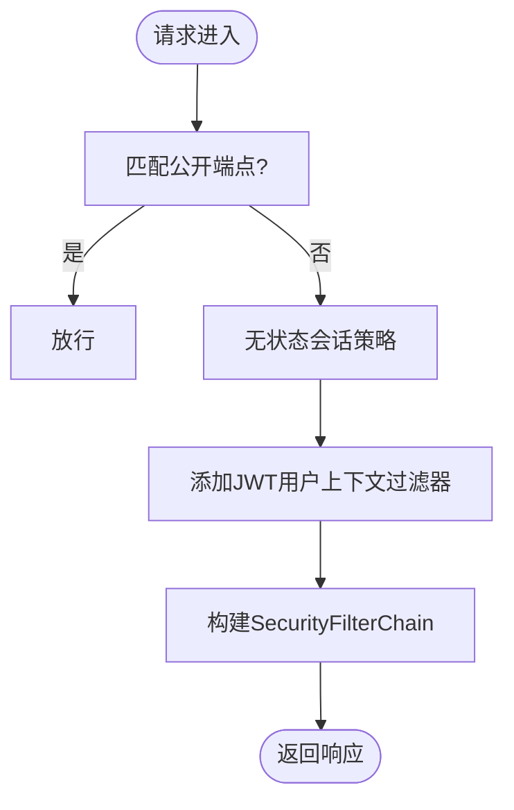
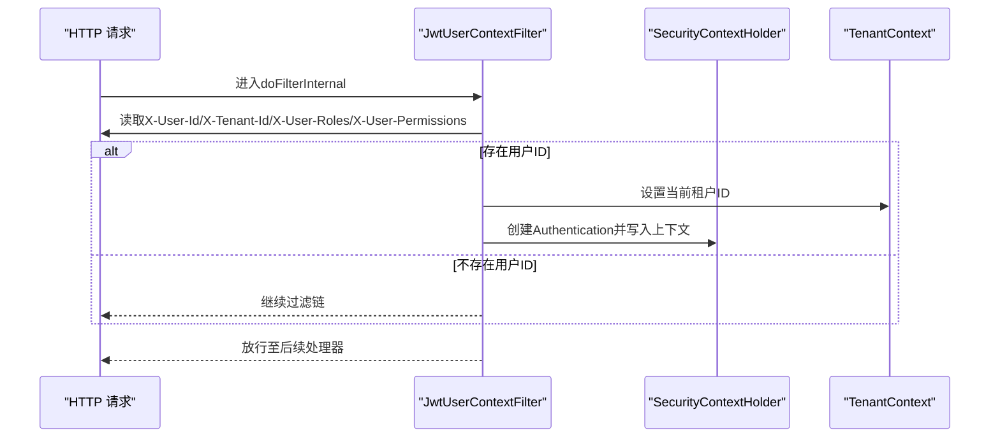
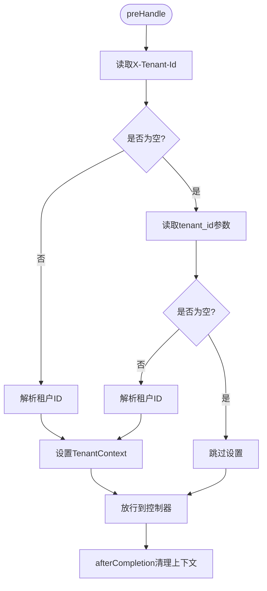
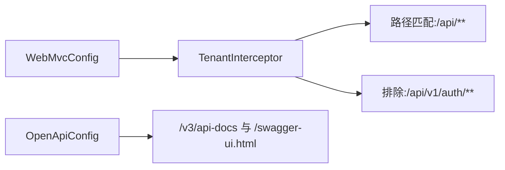
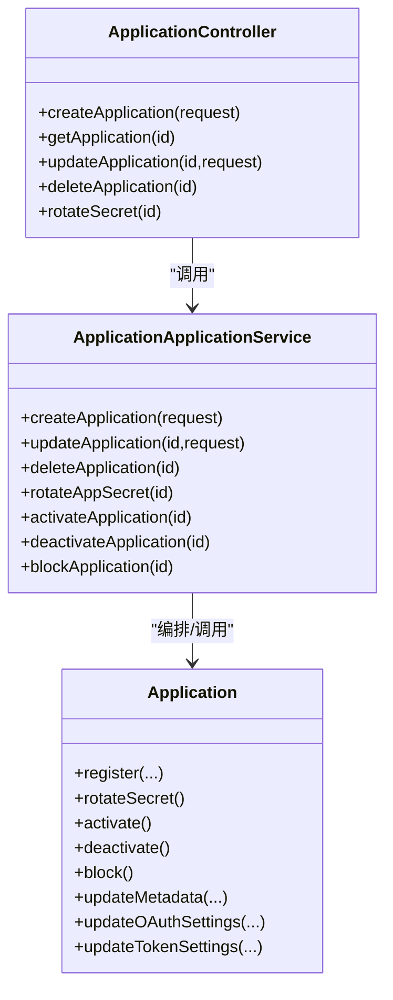
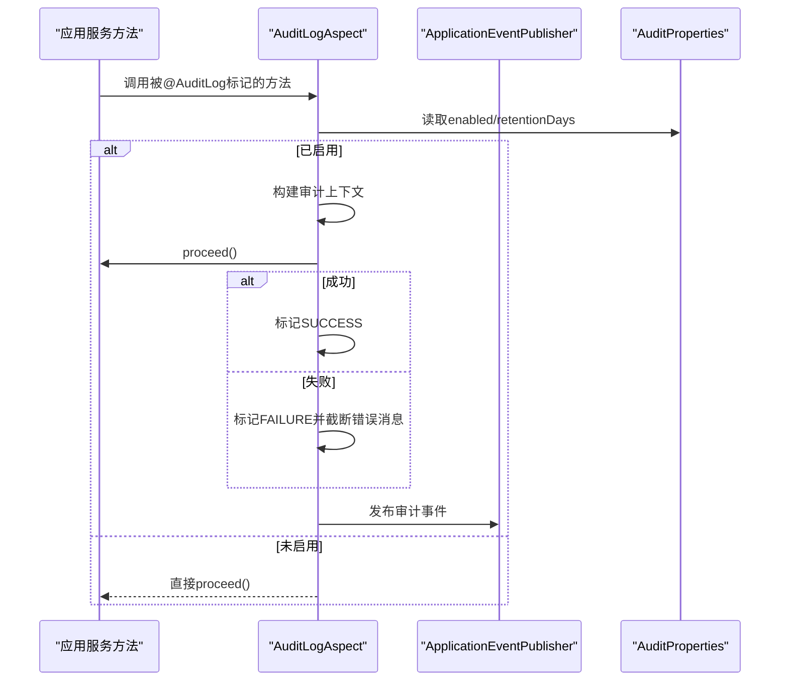
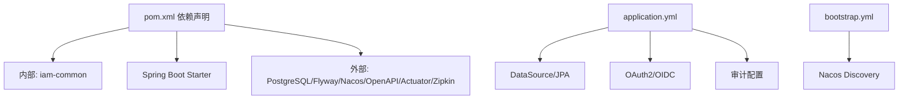

# 管理服务器架构

<cite>
**本文引用的文件**
- [SsoAdminServerApplication.java](file://iam-admin-server/src/main/java/iam/platform/admin/SsoAdminServerApplication.java)
- [AdminSecurityConfig.java](file://iam-admin-server/src/main/java/iam/platform/admin/infrastructure/config/AdminSecurityConfig.java)
- [WebMvcConfig.java](file://iam-admin-server/src/main/java/iam/platform/admin/infrastructure/config/WebMvcConfig.java)
- [OpenApiConfig.java](file://iam-admin-server/src/main/java/iam/platform/admin/infrastructure/config/OpenApiConfig.java)
- [JwtUserContextFilter.java](file://iam-admin-server/src/main/java/iam/platform/admin/infrastructure/security/JwtUserContextFilter.java)
- [TenantInterceptor.java](file://iam-admin-server/src/main/java/iam/platform/admin/infrastructure/security/TenantInterceptor.java)
- [TenantContext.java](file://iam-admin-server/src/main/java/iam/platform/admin/infrastructure/security/TenantContext.java)
- [application.yml](file://iam-admin-server/src/main/resources/application.yml)
- [bootstrap.yml](file://iam-admin-server/bootstrap.yml)
- [pom.xml](file://iam-admin-server/pom.xml)
- [ApplicationController.java](file://iam-admin-server/src/main/java/iam/platform/admin/interfaces/rest/ApplicationController.java)
- [ApplicationApplicationService.java](file://iam-admin-server/src/main/java/iam/platform/admin/application/service/ApplicationApplicationService.java)
- [Application.java](file://iam-admin-server/src/main/java/iam/platform/admin/domain/model/entity/Application.java)
- [AuditLogAspect.java](file://iam-admin-server/src/main/java/iam/platform/admin/infrastructure/aspect/AuditLogAspect.java)
- [AuditProperties.java](file://iam-admin-server/src/main/java/iam/platform/admin/infrastructure/config/AuditProperties.java)
</cite>

## 目录
1. [引言](#引言)
2. [项目结构](#项目结构)
3. [核心组件](#核心组件)
4. [架构总览](#架构总览)
5. [详细组件分析](#详细组件分析)
6. [依赖分析](#依赖分析)
7. [性能考虑](#性能考虑)
8. [故障排查指南](#故障排查指南)
9. [结论](#结论)
10. [附录](#附录)

## 引言
本文件面向管理服务器（iam-admin-server）的架构与实现，围绕以下目标展开：  
- 深入解析启动类的设计与配置，说明Spring Boot应用的启动流程与关键注解作用；  
- 详解管理服务器整体架构设计，包括分层架构模式、Clean Architecture思想在本项目中的落地与模块职责划分；  
- 解析安全配置类AdminSecurityConfig的实现，涵盖JWT用户上下文过滤器、租户上下文管理与权限授权拦截器的设计原理；  
- 说明Web MVC配置与OpenAPI文档配置的作用与实现细节；  
- 介绍管理服务器与其他微服务（如认证网关、认证服务器、BFF等）的集成方式与通信机制。

## 项目结构
管理服务器采用多模块分层组织，遵循Clean Architecture理念，将“接口层-应用层-领域层-基础设施层”清晰分离，并通过依赖倒置原则保证内聚与可测试性。  
- 接口层（interfaces/rest）：对外暴露REST API，负责请求参数校验、响应封装与Swagger标注；  
- 应用层（application/service）：编排业务用例，协调领域模型与基础设施，处理事务边界与审计事件发布；  
- 领域层（domain/model/entity）：承载核心业务规则与不变量，提供状态变更与行为方法；  
- 基础设施层（infrastructure）：包含配置、持久化、安全、监控、文档等横切能力与外部集成适配。

图表来源
- [ApplicationController.java:1-139](file://iam-admin-server/src/main/java/iam/platform/admin/interfaces/rest/ApplicationController.java#L1-L139)
- [ApplicationApplicationService.java:1-255](file://iam-admin-server/src/main/java/iam/platform/admin/application/service/ApplicationApplicationService.java#L1-L255)
- [Application.java:1-211](file://iam-admin-server/src/main/java/iam/platform/admin/domain/model/entity/Application.java#L1-L211)
- [AdminSecurityConfig.java:1-41](file://iam-admin-server/src/main/java/iam/platform/admin/infrastructure/config/AdminSecurityConfig.java#L1-L41)
- [JwtUserContextFilter.java:1-87](file://iam-admin-server/src/main/java/iam/platform/admin/infrastructure/security/JwtUserContextFilter.java#L1-L87)
- [TenantInterceptor.java:1-51](file://iam-admin-server/src/main/java/iam/platform/admin/infrastructure/security/TenantInterceptor.java#L1-L51)
- [TenantContext.java:1-45](file://iam-admin-server/src/main/java/iam/platform/admin/infrastructure/security/TenantContext.java#L1-L45)
- [WebMvcConfig.java:1-21](file://iam-admin-server/src/main/java/iam/platform/admin/infrastructure/config/WebMvcConfig.java#L1-L21)
- [OpenApiConfig.java:1-22](file://iam-admin-server/src/main/java/iam/platform/admin/infrastructure/config/OpenApiConfig.java#L1-L22)
- [AuditLogAspect.java:1-66](file://iam-admin-server/src/main/java/iam/platform/admin/infrastructure/aspect/AuditLogAspect.java#L1-L66)
- [AuditProperties.java:1-37](file://iam-admin-server/src/main/java/iam/platform/admin/infrastructure/config/AuditProperties.java#L1-L37)

章节来源
- [SsoAdminServerApplication.java:1-17](file://iam-admin-server/src/main/java/iam/platform/admin/SsoAdminServerApplication.java#L1-L17)
- [pom.xml:18-150](file://iam-admin-server/pom.xml#L18-L150)

## 核心组件
- 启动类与Spring Boot装配：通过@SpringBootApplication、@ConfigurationPropertiesScan、@EnableJpaRepositories完成自动装配、属性扫描与JPA仓库启用，确保应用快速启动并加载自定义配置与数据访问层。
- 安全子系统：基于Spring Security的无状态会话策略，结合JWT用户上下文过滤器与租户拦截器，实现从网关传递的用户信息注入与租户上下文贯穿请求生命周期。
- Web与文档：通过WebMvcConfig注册租户拦截器，限定对/api/**路径生效；OpenAPI配置提供统一的API文档入口与元信息。
- 业务编排：应用服务作为用例编排者，调用领域模型执行业务行为，同时触发审计AOP记录操作日志。
- 基础设施横切：审计AOP、租户上下文、安全过滤链、MVC拦截器、OpenAPI文档等共同构成稳定的运行时环境。

章节来源
- [SsoAdminServerApplication.java:8-16](file://iam-admin-server/src/main/java/iam/platform/admin/SsoAdminServerApplication.java#L8-L16)
- [AdminSecurityConfig.java:14-40](file://iam-admin-server/src/main/java/iam/platform/admin/infrastructure/config/AdminSecurityConfig.java#L14-L40)
- [WebMvcConfig.java:9-20](file://iam-admin-server/src/main/java/iam/platform/admin/infrastructure/config/WebMvcConfig.java#L9-L20)
- [OpenApiConfig.java:9-22](file://iam-admin-server/src/main/java/iam/platform/admin/infrastructure/config/OpenApiConfig.java#L9-L22)
- [AuditLogAspect.java:17-66](file://iam-admin-server/src/main/java/iam/platform/admin/infrastructure/aspect/AuditLogAspect.java#L17-L66)

## 架构总览
管理服务器采用Clean Architecture分层与依赖倒置：  
- 外部依赖（HTTP、数据库、Redis、Nacos、OAuth2/OIDC）由基础设施层适配；  
- 接口层仅依赖应用层契约，不直接依赖外部；  
- 应用层依赖领域层契约，负责编排与事务；  
- 领域层保持纯净业务规则，不依赖外部框架。

图表来源
- [pom.xml:25-104](file://iam-admin-server/pom.xml#L25-L104)
- [application.yml:10-102](file://iam-admin-server/src/main/resources/application.yml#L10-L102)
- [bootstrap.yml:1-10](file://iam-admin-server/bootstrap.yml#L1-L10)

## 详细组件分析

### 启动类与Spring Boot装配
- @SpringBootApplication：启用组件扫描、自动配置与嵌入式Web容器；  
- @ConfigurationPropertiesScan：扫描指定包下的@ConfigurationProperties类，使外部化配置生效；  
- @EnableJpaRepositories：启用JPA仓库扫描，支持按约定命名查询与分页排序；  
- main方法：通过SpringApplication.run启动应用上下文。

图表来源
- [SsoAdminServerApplication.java:13-16](file://iam-admin-server/src/main/java/iam/platform/admin/SsoAdminServerApplication.java#L13-L16)
- [SsoAdminServerApplication.java:9-10](file://iam-admin-server/src/main/java/iam/platform/admin/SsoAdminServerApplication.java#L9-L10)

章节来源
- [SsoAdminServerApplication.java:8-16](file://iam-admin-server/src/main/java/iam/platform/admin/SsoAdminServerApplication.java#L8-L16)

### 安全配置与过滤链
- 无状态会话：禁用Session，采用STATELESS策略；  
- 公开端点：健康检查、OpenAPI文档与错误页面无需鉴权；  
- 过滤器链：在用户名密码过滤器之前插入JWT用户上下文过滤器，用于从网关头提取用户身份与权限；  
- 密码编码：BCryptPasswordEncoder提供安全的密码存储。

图表来源
- [AdminSecurityConfig.java:19-34](file://iam-admin-server/src/main/java/iam/platform/admin/infrastructure/config/AdminSecurityConfig.java#L19-L34)

章节来源
- [AdminSecurityConfig.java:14-40](file://iam-admin-server/src/main/java/iam/platform/admin/infrastructure/config/AdminSecurityConfig.java#L14-L40)

### JWT用户上下文过滤器
- 功能：从网关头提取用户标识、租户ID、角色与权限，设置到Spring Security上下文与租户上下文中；  
- 权限解析：支持JSON数组格式的角色与权限字符串，统一转换为GrantedAuthority集合；  
- 容错：解析失败时记录错误并继续放行，交由后续安全机制处理。

图表来源
- [JwtUserContextFilter.java:30-63](file://iam-admin-server/src/main/java/iam/platform/admin/infrastructure/security/JwtUserContextFilter.java#L30-L63)
- [JwtUserContextFilter.java:65-85](file://iam-admin-server/src/main/java/iam/platform/admin/infrastructure/security/JwtUserContextFilter.java#L65-L85)

章节来源
- [JwtUserContextFilter.java:21-87](file://iam-admin-server/src/main/java/iam/platform/admin/infrastructure/security/JwtUserContextFilter.java#L21-L87)

### 租户上下文与拦截器
- 拦截器策略：优先从请求头X-Tenant-Id获取，否则回退到查询参数tenant_id；  
- 生命周期：请求前设置租户上下文，请求完成后清理，避免线程泄漏；  
- 上下文存储：ThreadLocal保存当前租户ID、人员ID与租户账户ID，供领域与应用层使用。

图表来源
- [TenantInterceptor.java:24-49](file://iam-admin-server/src/main/java/iam/platform/admin/infrastructure/security/TenantInterceptor.java#L24-L49)
- [TenantContext.java:7-44](file://iam-admin-server/src/main/java/iam/platform/admin/infrastructure/security/TenantContext.java#L7-L44)

章节来源
- [TenantInterceptor.java:10-51](file://iam-admin-server/src/main/java/iam/platform/admin/infrastructure/security/TenantInterceptor.java#L10-L51)
- [TenantContext.java:3-45](file://iam-admin-server/src/main/java/iam/platform/admin/infrastructure/security/TenantContext.java#L3-L45)

### Web MVC与OpenAPI配置
- MVC拦截器：对/api/**路径生效，排除鉴权相关路径，确保租户上下文在业务接口中可用；  
- OpenAPI：定义标题、描述、版本与联系人信息，统一API文档入口路径，便于联调与测试。

图表来源
- [WebMvcConfig.java:16-19](file://iam-admin-server/src/main/java/iam/platform/admin/infrastructure/config/WebMvcConfig.java#L16-L19)
- [OpenApiConfig.java:12-20](file://iam-admin-server/src/main/java/iam/platform/admin/infrastructure/config/OpenApiConfig.java#L12-L20)

章节来源
- [WebMvcConfig.java:9-21](file://iam-admin-server/src/main/java/iam/platform/admin/infrastructure/config/WebMvcConfig.java#L9-L21)
- [OpenApiConfig.java:9-22](file://iam-admin-server/src/main/java/iam/platform/admin/infrastructure/config/OpenApiConfig.java#L9-L22)

### 业务编排与领域模型
- 控制器：以Swagger标注与响应封装，调用应用服务执行业务；  
- 应用服务：事务边界内编排领域行为，触发审计AOP记录事件；  
- 领域实体：Application提供工厂方法、状态机与行为方法，确保业务不变量与可测试性。

图表来源
- [ApplicationController.java:28-139](file://iam-admin-server/src/main/java/iam/platform/admin/interfaces/rest/ApplicationController.java#L28-L139)
- [ApplicationApplicationService.java:30-255](file://iam-admin-server/src/main/java/iam/platform/admin/application/service/ApplicationApplicationService.java#L30-L255)
- [Application.java:17-211](file://iam-admin-server/src/main/java/iam/platform/admin/domain/model/entity/Application.java#L17-L211)

章节来源
- [ApplicationController.java:1-139](file://iam-admin-server/src/main/java/iam/platform/admin/interfaces/rest/ApplicationController.java#L1-L139)
- [ApplicationApplicationService.java:1-255](file://iam-admin-server/src/main/java/iam/platform/admin/application/service/ApplicationApplicationService.java#L1-L255)
- [Application.java:1-211](file://iam-admin-server/src/main/java/iam/platform/admin/domain/model/entity/Application.java#L1-L211)

### 审计AOP与配置
- AOP拦截：对带@AuditLog注解的方法进行环绕增强，捕获异常并发布审计事件；  
- 配置开关：通过AuditProperties控制审计开关、保留天数与异步线程池参数；  
- 事件发布：通过ApplicationEventPublisher异步发布审计事件，降低同步开销。

图表来源
- [AuditLogAspect.java:27-58](file://iam-admin-server/src/main/java/iam/platform/admin/infrastructure/aspect/AuditLogAspect.java#L27-L58)
- [AuditProperties.java:13-36](file://iam-admin-server/src/main/java/iam/platform/admin/infrastructure/config/AuditProperties.java#L13-36)

章节来源
- [AuditLogAspect.java:1-66](file://iam-admin-server/src/main/java/iam/platform/admin/infrastructure/aspect/AuditLogAspect.java#L1-L66)
- [AuditProperties.java:1-37](file://iam-admin-server/src/main/java/iam/platform/admin/infrastructure/config/AuditProperties.java#L1-L37)

## 依赖分析
- 外部依赖：Spring Boot Starter（web、security、data-jpa、data-redis、validation、aop、oauth2-client）、Nacos发现、PostgreSQL驱动、Flyway、OpenAPI、Actuator+Prometheus+Zipkin、Lombok、MapStruct等；  
- 内部依赖：iam-common公共模块提供DTO、枚举、注解与通用异常；  
- 运行时配置：application.yml集中管理数据库、Redis、JPA、OAuth2/OIDC、审计、OpenAPI、管理端点与Zipkin采样；  
- 服务发现：bootstrap.yml配置Nacos地址、命名空间与元数据，暴露管理端点。

图表来源
- [pom.xml:18-150](file://iam-admin-server/pom.xml#L18-L150)
- [application.yml:10-102](file://iam-admin-server/src/main/resources/application.yml#L10-L102)
- [bootstrap.yml:1-10](file://iam-admin-server/bootstrap.yml#L1-L10)

章节来源
- [pom.xml:18-150](file://iam-admin-server/pom.xml#L18-L150)
- [application.yml:10-102](file://iam-admin-server/src/main/resources/application.yml#L10-L102)
- [bootstrap.yml:1-10](file://iam-admin-server/bootstrap.yml#L1-L10)

## 性能考虑
- 无状态会话：减少服务器端会话存储压力，提升横向扩展能力；  
- 异步审计：通过线程池异步发布审计事件，避免阻塞主业务路径；  
- 连接池与缓存：合理配置Hikari连接池与Redis连接，结合Spring Session Redis实现分布式会话；  
- 监控与可观测性：Actuator+Prometheus+Zipkin提供指标采集与链路追踪，便于定位性能瓶颈；  
- 数据库迁移：Flyway自动迁移，避免手工维护带来的性能与一致性风险。

## 故障排查指南
- 认证失败或未注入用户上下文：检查网关是否正确转发X-User-*头，确认JwtUserContextFilter是否生效；  
- 租户上下文缺失：核对请求头或参数是否符合TenantInterceptor策略，确认afterCompletion是否清理成功；  
- 审计事件未记录：检查AuditProperties.enabled开关与异步线程池配置，关注AOP异常吞吐；  
- 数据库连接问题：核对application.yml中的数据库URL、凭据与连接池参数；  
- 文档不可见：确认OpenAPI路径与跨域配置，确保Swagger UI可访问。

章节来源
- [JwtUserContextFilter.java:33-60](file://iam-admin-server/src/main/java/iam/platform/admin/infrastructure/security/JwtUserContextFilter.java#L33-L60)
- [TenantInterceptor.java:24-49](file://iam-admin-server/src/main/java/iam/platform/admin/infrastructure/security/TenantInterceptor.java#L24-L49)
- [AuditLogAspect.java:34-58](file://iam-admin-server/src/main/java/iam/platform/admin/infrastructure/aspect/AuditLogAspect.java#L34-L58)
- [application.yml:15-50](file://iam-admin-server/src/main/resources/application.yml#L15-L50)
- [OpenApiConfig.java:12-20](file://iam-admin-server/src/main/java/iam/platform/admin/infrastructure/config/OpenApiConfig.java#L12-L20)

## 结论
管理服务器通过Clean Architecture与分层设计，实现了高内聚、低耦合与强可测试性的系统结构。借助Spring Security无状态过滤链、租户上下文贯穿与审计AOP，系统在保障安全性的同时具备良好的可运维性与可观测性。配合Nacos服务发现与OpenAPI文档，管理服务器能够稳定地支撑上层BFF与下游认证服务的协同工作。

## 附录
- 与其他微服务的集成要点：  
  - 与认证网关：通过网关头传递用户上下文，避免重复认证；  
  - 与认证服务器：使用OAuth2/OIDC客户端配置，支持授权码流程与令牌交换；  
  - 与BFF：通过Feign或HTTP客户端消费管理服务器提供的管理API；  
  - 与监控：Actuator暴露健康、指标与Prometheus端点，Zipkin收集链路数据。

章节来源
- [application.yml:52-68](file://iam-admin-server/src/main/resources/application.yml#L52-L68)
- [bootstrap.yml:1-10](file://iam-admin-server/bootstrap.yml#L1-L10)
- [pom.xml:53-69](file://iam-admin-server/pom.xml#L53-L69)