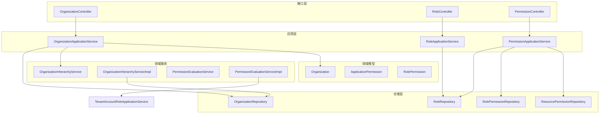
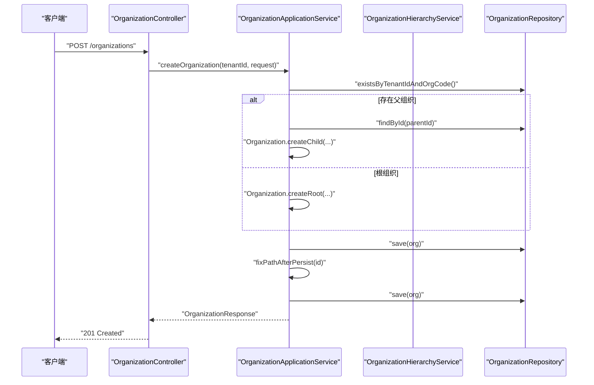
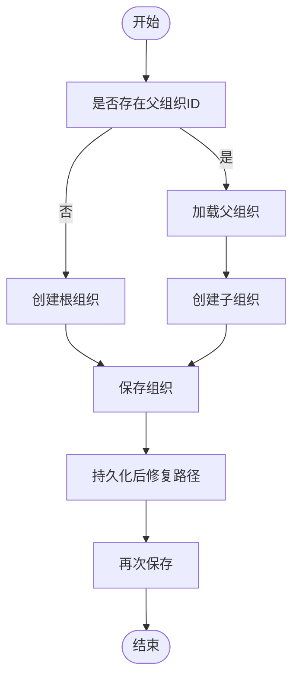
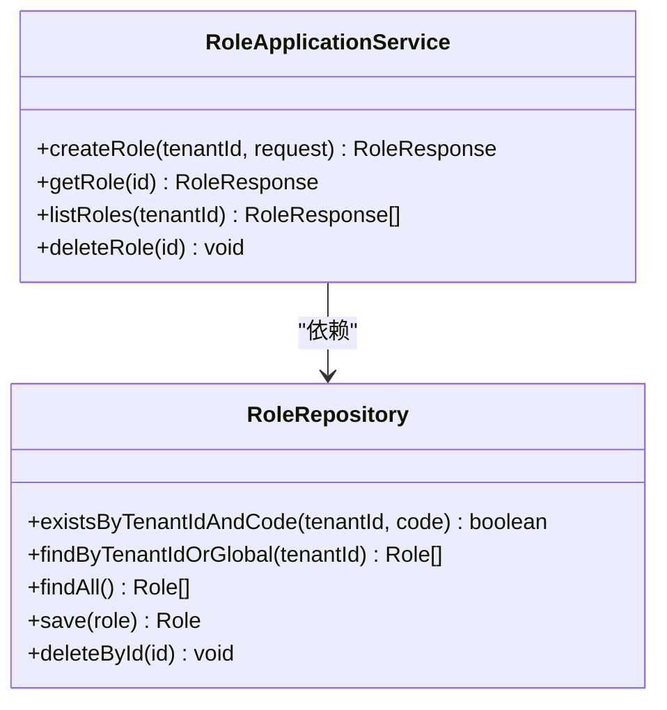
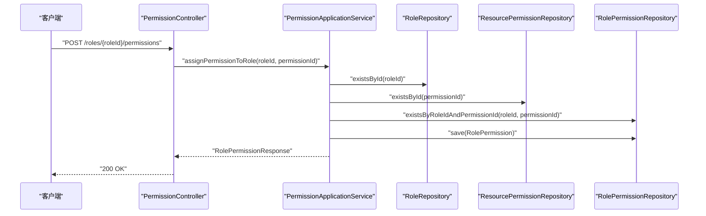
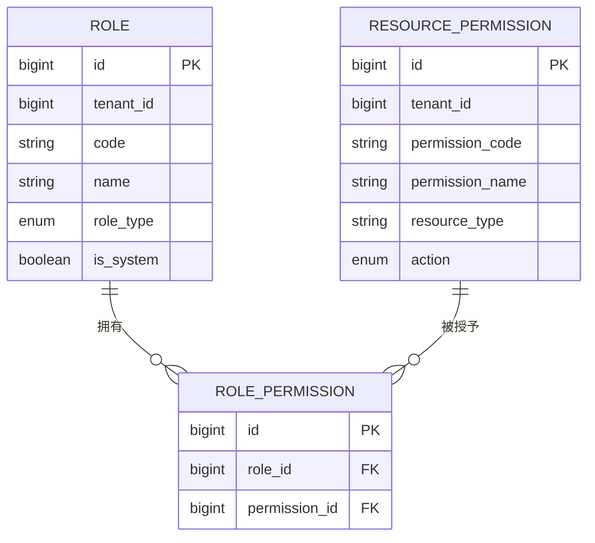
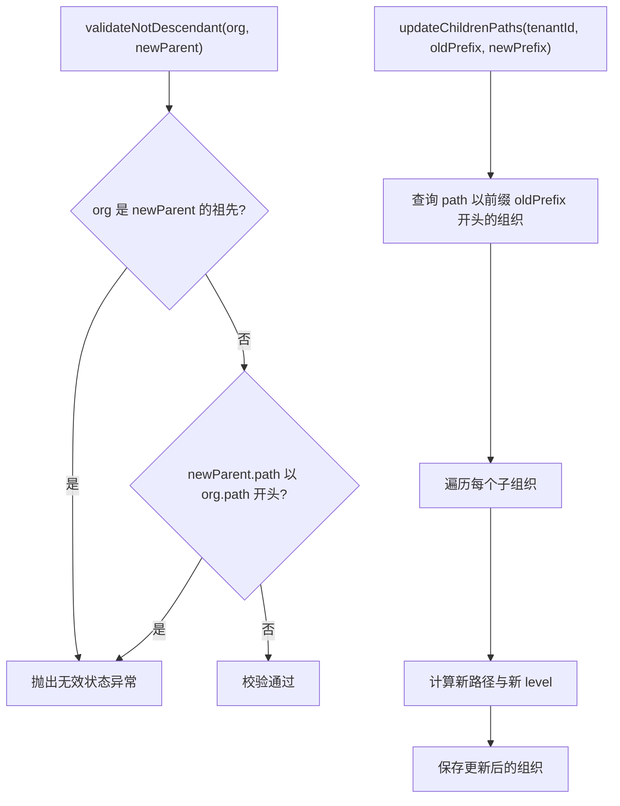
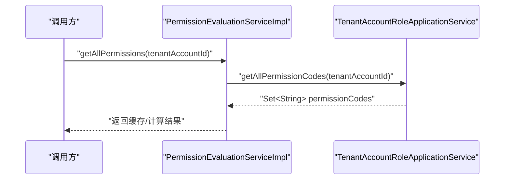
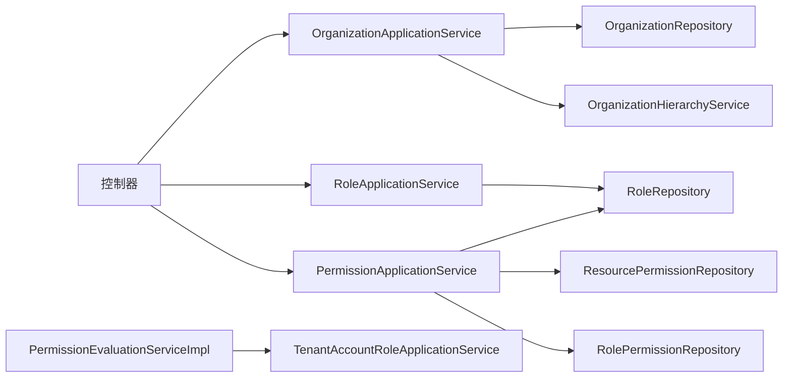

# 组织与权限管理

<cite>
**本文引用的文件**
- [OrganizationApplicationService.java](file://iam-admin-server/src/main/java/iam/platform/admin/application/service/OrganizationApplicationService.java)
- [RoleApplicationService.java](file://iam-admin-server/src/main/java/iam/platform/admin/application/service/RoleApplicationService.java)
- [PermissionApplicationService.java](file://iam-admin-server/src/main/java/iam/platform/admin/application/service/PermissionApplicationService.java)
- [ApplicationPermission.java](file://iam-admin-server/src/main/java/iam/platform/admin/domain/model/entity/ApplicationPermission.java)
- [RolePermission.java](file://iam-admin-server/src/main/java/iam/platform/admin/domain/model/entity/RolePermission.java)
- [OrganizationHierarchyService.java](file://iam-admin-server/src/main/java/iam/platform/admin/domain/service/OrganizationHierarchyService.java)
- [OrganizationHierarchyServiceImpl.java](file://iam-admin-server/src/main/java/iam/platform/admin/domain/service/impl/OrganizationHierarchyServiceImpl.java)
- [PermissionEvaluationService.java](file://iam-admin-server/src/main/java/iam/platform/admin/domain/service/PermissionEvaluationService.java)
- [PermissionEvaluationServiceImpl.java](file://iam-admin-server/src/main/java/iam/platform/admin/domain/service/impl/PermissionEvaluationServiceImpl.java)
- [OrganizationController.java](file://iam-admin-server/src/main/java/iam/platform/admin/interfaces/rest/OrganizationController.java)
- [RoleController.java](file://iam-admin-server/src/main/java/iam/platform/admin/interfaces/rest/RoleController.java)
- [OrganizationRepository.java](file://iam-admin-server/src/main/java/iam/platform/admin/domain/repository/OrganizationRepository.java)
- [RoleRepository.java](file://iam-admin-server/src/main/java/iam/platform/admin/domain/repository/RoleRepository.java)
- [ResourcePermissionRepository.java](file://iam-admin-server/src/main/java/iam/platform/admin/domain/repository/ResourcePermissionRepository.java)
- [RolePermissionRepository.java](file://iam-admin-server/src/main/java/iam/platform/admin/domain/repository/RolePermissionRepository.java)
- [TenantAccountRoleApplicationService.java](file://iam-admin-server/src/main/java/iam/platform/admin/application/service/TenantAccountRoleApplicationService.java)
- [Organization.java](file://iam-admin-server/src/main/java/iam/platform/admin/domain/model/entity/Organization.java)
- [OrganizationPath.java](file://iam-admin-server/src/main/java/iam/platform/common/model/valueobject/OrganizationPath.java)
- [RequirePermission.java](file://iam-admin-server/src/main/java/iam/platform/common/model/annotation/RequirePermission.java)
- [PermissionAuthorizationAspect.java](file://iam-admin-server/src/main/java/iam/platform/admin/infrastructure/aspect/PermissionAuthorizationAspect.java)
- [PermissionController.java](file://iam-admin-server/src/main/java/iam/platform/admin/interfaces/rest/PermissionController.java)
- [TenantAccountOrganizationApplicationService.java](file://iam-admin-server/src/main/java/iam/platform/admin/application/service/TenantAccountOrganizationApplicationService.java)
- [TenantAccountRoleApplicationService.java](file://iam-admin-server/src/main/java/iam/platform/admin/application/service/TenantAccountRoleApplicationService.java)
</cite>

## 目录
1. [简介](#简介)
2. [项目结构](#项目结构)
3. [核心组件](#核心组件)
4. [架构总览](#架构总览)
5. [详细组件分析](#详细组件分析)
6. [依赖分析](#依赖分析)
7. [性能考虑](#性能考虑)
8. [故障排查指南](#故障排查指南)
9. [结论](#结论)
10. [附录](#附录)

## 简介
本技术文档聚焦于组织与权限管理功能，系统性阐述以下方面：
- 组织管理：OrganizationApplicationService 的职责、组织层级结构设计与路径维护机制
- 角色管理：RoleApplicationService 的实现与角色类型分类
- 权限管理：PermissionApplicationService 的权限分配与评估体系
- 权限模型：ApplicationPermission 与 RolePermission 的关系映射及权限继承
- 层级服务：OrganizationHierarchyServiceImpl 的层级计算与路径传播
- 权限评估：PermissionEvaluationServiceImpl 的评估算法与缓存优化
- REST API：组织、角色、权限相关的接口设计与实现要点

## 项目结构
围绕“组织与权限”主题，代码主要分布在以下模块与包中：
- 应用层服务：application/service 下的 OrganizationApplicationService、RoleApplicationService、PermissionApplicationService 等
- 领域模型：domain/model/entity 下的 Organization、ApplicationPermission、RolePermission 等
- 领域服务：domain/service 及其实现类，负责组织层级校验与权限评估
- 接口层：interfaces/rest 下的 OrganizationController、RoleController、PermissionController 等
- 仓储层：domain/repository 下的各类 Repository 接口与实现
- 公共模型与注解：common/model 下的枚举、值对象、注解等

图表来源
- [OrganizationApplicationService.java:27-66](file://iam-admin-server/src/main/java/iam/platform/admin/application/service/OrganizationApplicationService.java#L27-L66)
- [RoleApplicationService.java:20-43](file://iam-admin-server/src/main/java/iam/platform/admin/application/service/RoleApplicationService.java#L20-L43)
- [PermissionApplicationService.java:25-49](file://iam-admin-server/src/main/java/iam/platform/admin/application/service/PermissionApplicationService.java#L25-L49)
- [OrganizationHierarchyServiceImpl.java:15-72](file://iam-admin-server/src/main/java/iam/platform/admin/domain/service/impl/OrganizationHierarchyServiceImpl.java#L15-L72)
- [PermissionEvaluationServiceImpl.java:16-52](file://iam-admin-server/src/main/java/iam/platform/admin/domain/service/impl/PermissionEvaluationServiceImpl.java#L16-L52)
- [OrganizationController.java:25-84](file://iam-admin-server/src/main/java/iam/platform/admin/interfaces/rest/OrganizationController.java#L25-L84)
- [RoleController.java:23-58](file://iam-admin-server/src/main/java/iam/platform/admin/interfaces/rest/RoleController.java#L23-L58)

章节来源
- [OrganizationApplicationService.java:27-66](file://iam-admin-server/src/main/java/iam/platform/admin/application/service/OrganizationApplicationService.java#L27-L66)
- [RoleApplicationService.java:20-43](file://iam-admin-server/src/main/java/iam/platform/admin/application/service/RoleApplicationService.java#L20-L43)
- [PermissionApplicationService.java:25-49](file://iam-admin-server/src/main/java/iam/platform/admin/application/service/PermissionApplicationService.java#L25-L49)

## 核心组件
本节对组织、角色、权限三大核心组件进行深入剖析。

- 组织管理（OrganizationApplicationService）
  - 职责：创建、查询、更新、删除组织；激活/停用组织；构建组织树；处理组织重父操作与路径修复
  - 关键点：通过领域工厂方法创建根/子组织；调用组织层级服务校验环路；重父后批量更新子节点路径
  - 复杂度：单次更新/删除为 O(1)，批量路径更新受子节点数量影响

- 角色管理（RoleApplicationService）
  - 职责：租户内唯一性校验、创建/查询/列出角色、删除非系统角色
  - 关键点：支持租户作用域与全局角色合并查询；系统角色不可删除

- 权限管理（PermissionApplicationService）
  - 职责：资源权限创建/查询/列表/删除；角色-权限映射分配与移除；按角色查询权限
  - 关键点：权限删除前先清理角色映射；避免重复分配；支持租户或全局权限查询

章节来源
- [OrganizationApplicationService.java:32-151](file://iam-admin-server/src/main/java/iam/platform/admin/application/service/OrganizationApplicationService.java#L32-L151)
- [RoleApplicationService.java:24-75](file://iam-admin-server/src/main/java/iam/platform/admin/application/service/RoleApplicationService.java#L24-L75)
- [PermissionApplicationService.java:31-118](file://iam-admin-server/src/main/java/iam/platform/admin/application/service/PermissionApplicationService.java#L31-L118)

## 架构总览
下图展示从接口到应用服务、领域模型与仓储的完整调用链，并标注关键的权限评估与层级服务交互。

图表来源
- [OrganizationController.java:33-40](file://iam-admin-server/src/main/java/iam/platform/admin/interfaces/rest/OrganizationController.java#L33-L40)
- [OrganizationApplicationService.java:34-66](file://iam-admin-server/src/main/java/iam/platform/admin/application/service/OrganizationApplicationService.java#L34-L66)
- [OrganizationRepository.java](file://iam-admin-server/src/main/java/iam/platform/admin/domain/repository/OrganizationRepository.java)

## 详细组件分析

### 组织管理组件分析
- 设计要点
  - 使用领域工厂方法创建组织，确保数据一致性与业务规则前置校验
  - 重父操作通过组织层级服务校验环路，再批量更新子节点路径
  - 路径修复在持久化后执行，保证父子关系与层级路径一致
- 数据结构与复杂度
  - 组织树构建采用分组+递归方式，时间复杂度 O(n)
  - 批量路径更新遍历子节点，复杂度 O(k)，k 为子节点数
- 错误处理
  - 不存在组织时抛出异常；存在子组织时禁止删除；重父目标为后代时拒绝

图表来源
- [OrganizationApplicationService.java:42-61](file://iam-admin-server/src/main/java/iam/platform/admin/application/service/OrganizationApplicationService.java#L42-L61)

章节来源
- [OrganizationApplicationService.java:32-151](file://iam-admin-server/src/main/java/iam/platform/admin/application/service/OrganizationApplicationService.java#L32-L151)
- [Organization.java](file://iam-admin-server/src/main/java/iam/platform/admin/domain/model/entity/Organization.java)

### 角色管理组件分析
- 设计要点
  - 角色编码在租户内唯一；支持租户与全局角色合并查询
  - 系统角色不可删除，防止破坏基础权限结构
- 性能与可用性
  - 列表查询按需组合条件，减少不必要扫描

图表来源
- [RoleApplicationService.java:20-75](file://iam-admin-server/src/main/java/iam/platform/admin/application/service/RoleApplicationService.java#L20-L75)
- [RoleRepository.java](file://iam-admin-server/src/main/java/iam/platform/admin/domain/repository/RoleRepository.java)

章节来源
- [RoleApplicationService.java:24-75](file://iam-admin-server/src/main/java/iam/platform/admin/application/service/RoleApplicationService.java#L24-L75)

### 权限管理组件分析
- 设计要点
  - 资源权限创建时进行租户内唯一性校验；支持资源类型过滤与租户/全局查询
  - 角色-权限映射通过独立实体维护，删除权限前清理映射
- 关键流程
  - 分配权限：校验角色与权限存在性，检查重复分配
  - 移除权限：校验映射存在性后删除
  - 查询权限：按角色查询已分配的资源权限

图表来源
- [PermissionController.java](file://iam-admin-server/src/main/java/iam/platform/admin/interfaces/rest/PermissionController.java)
- [PermissionApplicationService.java:82-102](file://iam-admin-server/src/main/java/iam/platform/admin/application/service/PermissionApplicationService.java#L82-L102)
- [RoleRepository.java](file://iam-admin-server/src/main/java/iam/platform/admin/domain/repository/RoleRepository.java)
- [ResourcePermissionRepository.java](file://iam-admin-server/src/main/java/iam/platform/admin/domain/repository/ResourcePermissionRepository.java)
- [RolePermissionRepository.java](file://iam-admin-server/src/main/java/iam/platform/admin/domain/repository/RolePermissionRepository.java)

章节来源
- [PermissionApplicationService.java:31-118](file://iam-admin-server/src/main/java/iam/platform/admin/application/service/PermissionApplicationService.java#L31-L118)

### 权限模型与继承机制
- 实体关系
  - ApplicationPermission：应用级权限定义，包含资源类型与动作
  - RolePermission：角色与权限的多对多映射中间表
- 权限继承
  - 用户权限集由其角色集合推导而来；评估服务聚合所有角色权限，形成最终权限集合
- 映射与约束
  - 角色-权限映射唯一性约束，避免重复授权
  - 删除权限会级联清理映射，保持数据一致性

图表来源
- [ApplicationPermission.java:16-53](file://iam-admin-server/src/main/java/iam/platform/admin/domain/model/entity/ApplicationPermission.java#L16-L53)
- [RolePermission.java:14-19](file://iam-admin-server/src/main/java/iam/platform/admin/domain/model/entity/RolePermission.java#L14-L19)
- [RoleRepository.java](file://iam-admin-server/src/main/java/iam/platform/admin/domain/repository/RoleRepository.java)
- [ResourcePermissionRepository.java](file://iam-admin-server/src/main/java/iam/platform/admin/domain/repository/ResourcePermissionRepository.java)
- [RolePermissionRepository.java](file://iam-admin-server/src/main/java/iam/platform/admin/domain/repository/RolePermissionRepository.java)

章节来源
- [ApplicationPermission.java:27-74](file://iam-admin-server/src/main/java/iam/platform/admin/domain/model/entity/ApplicationPermission.java#L27-L74)
- [RolePermission.java:14-19](file://iam-admin-server/src/main/java/iam/platform/admin/domain/model/entity/RolePermission.java#L14-L19)

### 组织层级服务实现
- 校验逻辑
  - 通过祖先判断与路径前缀判断双重校验，防止环路与自包含
- 路径传播
  - 将旧路径前缀替换为新路径前缀，同时按层级差调整 level
  - 逐条重建实体并保存，确保路径与层级一致性

图表来源
- [OrganizationHierarchyService.java:10-33](file://iam-admin-server/src/main/java/iam/platform/admin/domain/service/OrganizationHierarchyService.java#L10-L33)
- [OrganizationHierarchyServiceImpl.java:19-71](file://iam-admin-server/src/main/java/iam/platform/admin/domain/service/impl/OrganizationHierarchyServiceImpl.java#L19-L71)
- [OrganizationRepository.java](file://iam-admin-server/src/main/java/iam/platform/admin/domain/repository/OrganizationRepository.java)

章节来源
- [OrganizationHierarchyServiceImpl.java:19-71](file://iam-admin-server/src/main/java/iam/platform/admin/domain/service/impl/OrganizationHierarchyServiceImpl.java#L19-L71)

### 权限评估服务实现
- 评估算法
  - hasPermission：判断单个权限码
  - hasAnyPermission / hasAllPermissions：分别判断任一或全部权限
  - checkPermission：无权限时抛出访问拒绝异常
- 缓存策略
  - 使用缓存存储租户账号的权限集合，降低重复查询成本
- 依赖关系
  - 权限集合来源于租户账号-角色服务，聚合角色所拥有的权限码

图表来源
- [PermissionEvaluationServiceImpl.java:38-42](file://iam-admin-server/src/main/java/iam/platform/admin/domain/service/impl/PermissionEvaluationServiceImpl.java#L38-L42)
- [TenantAccountRoleApplicationService.java](file://iam-admin-server/src/main/java/iam/platform/admin/application/service/TenantAccountRoleApplicationService.java)

章节来源
- [PermissionEvaluationService.java:8-53](file://iam-admin-server/src/main/java/iam/platform/admin/domain/service/PermissionEvaluationService.java#L8-L53)
- [PermissionEvaluationServiceImpl.java:16-52](file://iam-admin-server/src/main/java/iam/platform/admin/domain/service/impl/PermissionEvaluationServiceImpl.java#L16-L52)

### REST API 设计与实现
- 组织 API
  - 创建、查询、更新、删除、激活/停用、获取组织树
  - 路径：/v1/tenants/{tenantId}/organizations
- 角色 API
  - 创建、查询、列表（含全局）、删除
  - 路径：/v1/tenants/{tenantId}/roles
- 权限 API
  - 资源权限创建/查询/列表/删除
  - 角色-权限映射分配/移除/查询
  - 路径：/v1/tenants/{tenantId}/permissions 与 /v1/roles/{roleId}/permissions

章节来源
- [OrganizationController.java:25-84](file://iam-admin-server/src/main/java/iam/platform/admin/interfaces/rest/OrganizationController.java#L25-L84)
- [RoleController.java:23-58](file://iam-admin-server/src/main/java/iam/platform/admin/interfaces/rest/RoleController.java#L23-L58)

## 依赖分析
- 应用服务与仓储
  - OrganizationApplicationService 依赖 OrganizationRepository 与 OrganizationHierarchyService
  - RoleApplicationService 依赖 RoleRepository
  - PermissionApplicationService 依赖 ResourcePermissionRepository、RolePermissionRepository、RoleRepository
- 权限评估与角色服务
  - PermissionEvaluationServiceImpl 依赖 TenantAccountRoleApplicationService 获取权限集合
- 注解与切面
  - RequirePermission 注解用于声明式权限校验
  - PermissionAuthorizationAspect 提供权限拦截与校验

图表来源
- [OrganizationApplicationService.java:29-30](file://iam-admin-server/src/main/java/iam/platform/admin/application/service/OrganizationApplicationService.java#L29-L30)
- [RoleApplicationService.java](file://iam-admin-server/src/main/java/iam/platform/admin/application/service/RoleApplicationService.java#L22)
- [PermissionApplicationService.java:27-29](file://iam-admin-server/src/main/java/iam/platform/admin/application/service/PermissionApplicationService.java#L27-L29)
- [PermissionEvaluationServiceImpl.java](file://iam-admin-server/src/main/java/iam/platform/admin/domain/service/impl/PermissionEvaluationServiceImpl.java#L18)

章节来源
- [PermissionAuthorizationAspect.java](file://iam-admin-server/src/main/java/iam/platform/admin/infrastructure/aspect/PermissionAuthorizationAspect.java)
- [RequirePermission.java](file://iam-admin-server/src/main/java/iam/platform/common/model/annotation/RequirePermission.java)

## 性能考虑
- 缓存优化
  - 权限评估服务对租户账号权限集合进行缓存，显著降低重复查询开销
- 查询优化
  - 组织树构建采用分组+递归，避免多次数据库往返
  - 权限查询按租户或资源类型过滤，缩小扫描范围
- 批量更新
  - 组织重父后批量更新子节点路径，减少多次事务开销

## 故障排查指南
- 组织相关
  - 无法删除组织：若存在子组织，将抛出冲突异常
  - 重父失败：若目标为当前组织的后代，将抛出无效状态异常
- 角色相关
  - 系统角色不可删除：尝试删除系统角色将抛出非法状态异常
- 权限相关
  - 权限分配重复：若角色已拥有该权限，将抛出参数异常
  - 权限删除失败：权限不存在或映射不存在时抛出异常
- 访问控制
  - 权限不足：checkPermission 未命中时抛出访问拒绝异常

章节来源
- [OrganizationApplicationService.java:122-128](file://iam-admin-server/src/main/java/iam/platform/admin/application/service/OrganizationApplicationService.java#L122-L128)
- [OrganizationHierarchyServiceImpl.java:20-33](file://iam-admin-server/src/main/java/iam/platform/admin/domain/service/impl/OrganizationHierarchyServiceImpl.java#L20-L33)
- [RoleApplicationService.java:68-71](file://iam-admin-server/src/main/java/iam/platform/admin/application/service/RoleApplicationService.java#L68-L71)
- [PermissionApplicationService.java:94-96](file://iam-admin-server/src/main/java/iam/platform/admin/application/service/PermissionApplicationService.java#L94-L96)
- [PermissionEvaluationServiceImpl.java:44-51](file://iam-admin-server/src/main/java/iam/platform/admin/domain/service/impl/PermissionEvaluationServiceImpl.java#L44-L51)

## 结论
本方案通过清晰的应用层服务、稳健的领域模型与仓储层配合，实现了可扩展的组织与权限管理体系。组织层级通过路径前缀与祖先关系双重校验保障稳定性；角色-权限映射提供灵活的权限继承；权限评估结合缓存提升性能。REST API 设计遵循资源导向与租户隔离原则，便于集成与扩展。

## 附录
- 关键实体与值对象
  - Organization：组织实体，包含层级、路径、状态等
  - OrganizationPath：组织路径值对象，支持层级计算与前缀匹配
  - ApplicationPermission：应用级权限定义
  - RolePermission：角色-权限映射实体
- 典型用例
  - 新建组织并自动修复路径
  - 重父组织并批量更新子节点路径
  - 为角色分配权限并校验重复
  - 校验用户是否具备某项或多项权限