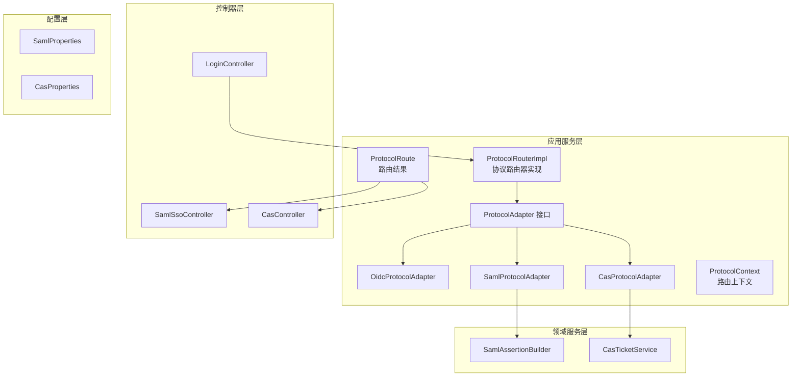
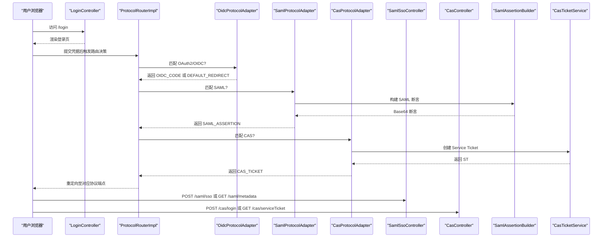
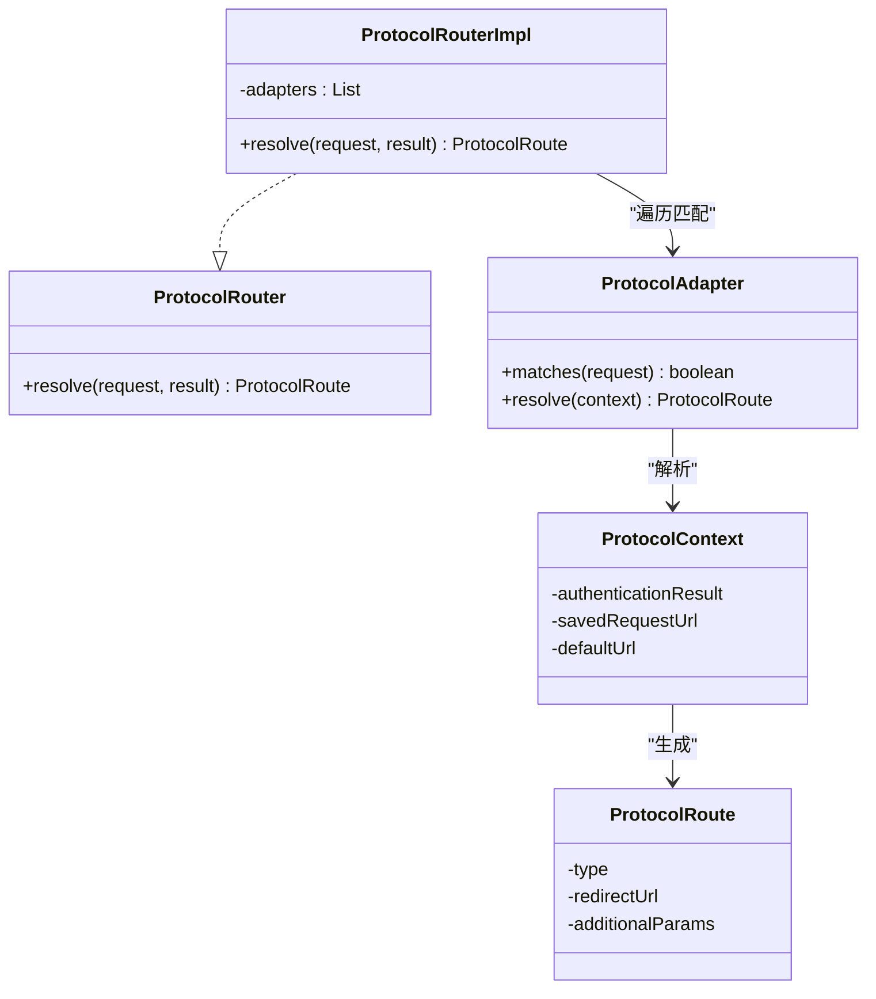
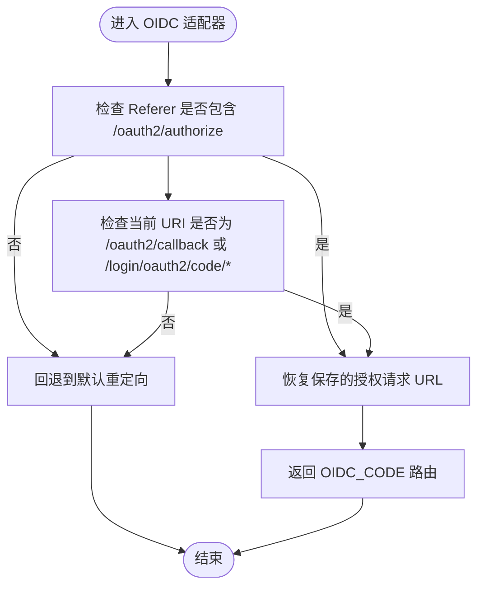
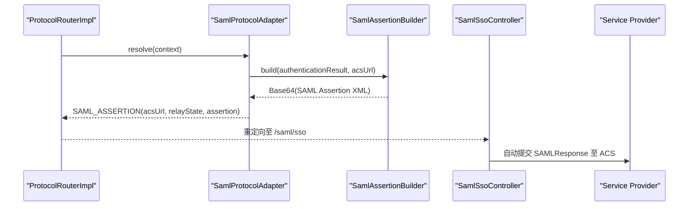
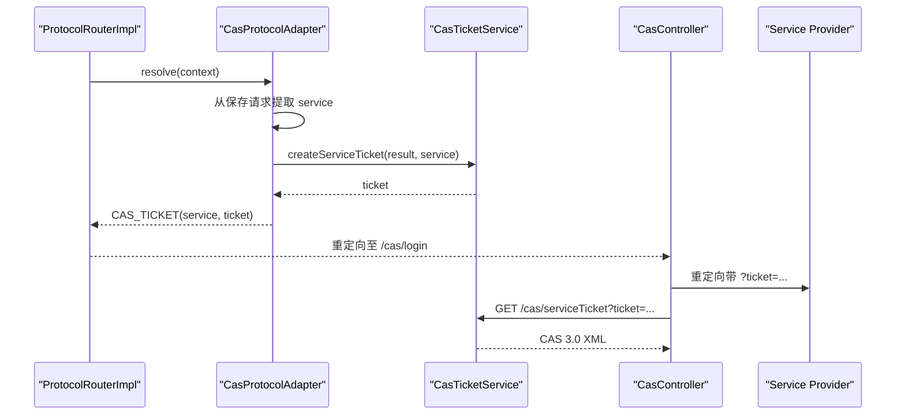
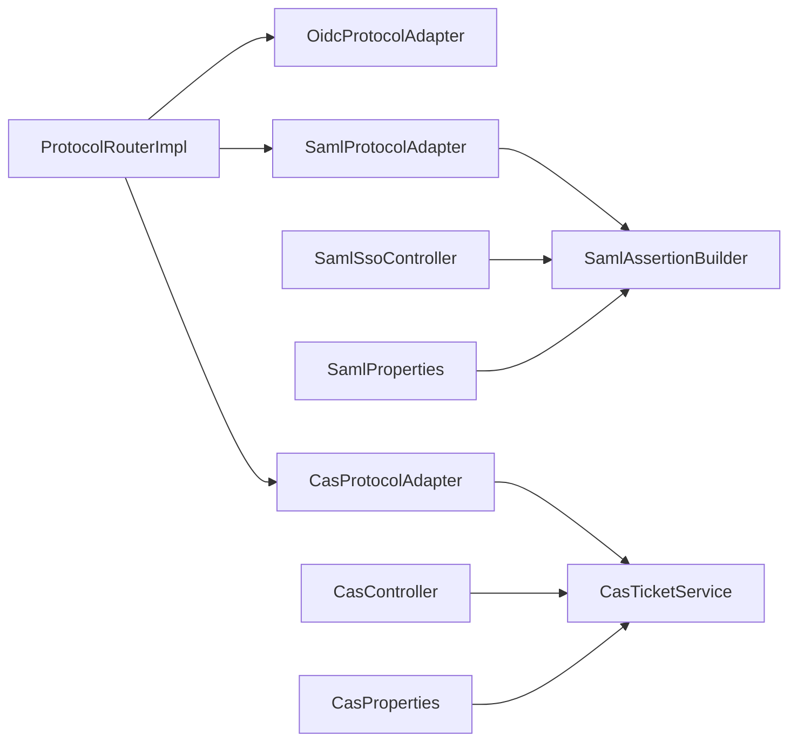

# 协议适配器

<cite>
**本文引用的文件**   
- [ProtocolRouter.java](file://iam-auth-server/src/main/java/iam/platform/auth/application/service/routing/ProtocolRouter.java)
- [ProtocolRouterImpl.java](file://iam-auth-server/src/main/java/iam/platform/auth/application/service/routing/ProtocolRouterImpl.java)
- [ProtocolAdapter.java](file://iam-auth-server/src/main/java/iam/platform/auth/application/service/routing/ProtocolAdapter.java)
- [ProtocolContext.java](file://iam-auth-server/src/main/java/iam/platform/auth/application/service/routing/ProtocolContext.java)
- [ProtocolRoute.java](file://iam-auth-server/src/main/java/iam/platform/auth/application/service/routing/ProtocolRoute.java)
- [OidcProtocolAdapter.java](file://iam-auth-server/src/main/java/iam/platform/auth/application/service/routing/OidcProtocolAdapter.java)
- [SamlProtocolAdapter.java](file://iam-auth-server/src/main/java/iam/platform/auth/application/service/routing/SamlProtocolAdapter.java)
- [CasProtocolAdapter.java](file://iam-auth-server/src/main/java/iam/platform/auth/application/service/routing/CasProtocolAdapter.java)
- [SamlAssertionBuilder.java](file://iam-auth-server/src/main/java/iam/platform/auth/application/service/SamlAssertionBuilder.java)
- [CasTicketService.java](file://iam-auth-server/src/main/java/iam/platform/auth/application/service/CasTicketService.java)
- [SamlSsoController.java](file://iam-auth-server/src/main/java/iam/platform/auth/interfaces/web/SamlSsoController.java)
- [CasController.java](file://iam-auth-server/src/main/java/iam/platform/auth/interfaces/web/CasController.java)
- [SamlProperties.java](file://iam-auth-server/src/main/java/iam/platform/auth/infrastructure/config/SamlProperties.java)
- [CasProperties.java](file://iam-auth-server/src/main/java/iam/platform/auth/infrastructure/config/CasProperties.java)
- [application.yml](file://iam-auth-server/src/main/resources/application.yml)
- [LoginController.java](file://iam-auth-server/src/main/java/iam/platform/auth/interfaces/web/LoginController.java)
</cite>

## 目录
1. [简介](#简介)
2. [项目结构](#项目结构)
3. [核心组件](#核心组件)
4. [架构总览](#架构总览)
5. [组件详解](#组件详解)
6. [依赖关系分析](#依赖关系分析)
7. [性能考量](#性能考量)
8. [故障排查指南](#故障排查指南)
9. [结论](#结论)
10. [附录](#附录)

## 简介
本文件面向协议适配器系统，系统性阐述协议路由器的设计与实现，说明如何基于请求来源自动选择合适的协议适配器（OAuth2/OIDC、SAML、CAS）。文档同时深入解析各协议适配器的关键流程：OAuth2 授权码流程与回调重定向、SAML 断言生成与元数据管理、CAS 票据签发与单点登出（SLO）能力，并给出扩展新协议的机制与最佳实践。

## 项目结构
协议适配器相关代码集中在认证服务模块中，采用“接口 + 多实现 + 路由器”的分层设计：
- 应用服务层：路由接口与实现、协议上下文与路由结果对象
- 控制器层：SAML 与 CAS 的对外端点
- 领域服务层：SAML 断言构建器、CAS 票据服务
- 配置层：SAML/CAS 属性配置
- 资源与模板：登录页、SAML 元数据输出、CAS 登录页等

图表来源
- [ProtocolRouterImpl.java:1-52](file://iam-auth-server/src/main/java/iam/platform/auth/application/service/routing/ProtocolRouterImpl.java#L1-L52)
- [ProtocolAdapter.java:1-20](file://iam-auth-server/src/main/java/iam/platform/auth/application/service/routing/ProtocolAdapter.java#L1-L20)
- [OidcProtocolAdapter.java:1-40](file://iam-auth-server/src/main/java/iam/platform/auth/application/service/routing/OidcProtocolAdapter.java#L1-L40)
- [SamlProtocolAdapter.java:1-47](file://iam-auth-server/src/main/java/iam/platform/auth/application/service/routing/SamlProtocolAdapter.java#L1-L47)
- [CasProtocolAdapter.java:1-80](file://iam-auth-server/src/main/java/iam/platform/auth/application/service/routing/CasProtocolAdapter.java#L1-L80)
- [SamlSsoController.java:1-151](file://iam-auth-server/src/main/java/iam/platform/auth/interfaces/web/SamlSsoController.java#L1-L151)
- [CasController.java:1-170](file://iam-auth-server/src/main/java/iam/platform/auth/interfaces/web/CasController.java#L1-L170)
- [SamlAssertionBuilder.java:1-115](file://iam-auth-server/src/main/java/iam/platform/auth/application/service/SamlAssertionBuilder.java#L1-L115)
- [CasTicketService.java:1-127](file://iam-auth-server/src/main/java/iam/platform/auth/application/service/CasTicketService.java#L1-L127)
- [SamlProperties.java:1-39](file://iam-auth-server/src/main/java/iam/platform/auth/infrastructure/config/SamlProperties.java#L1-L39)
- [CasProperties.java:1-45](file://iam-auth-server/src/main/java/iam/platform/auth/infrastructure/config/CasProperties.java#L1-L45)

章节来源
- [ProtocolRouter.java:1-19](file://iam-auth-server/src/main/java/iam/platform/auth/application/service/routing/ProtocolRouter.java#L1-L19)
- [ProtocolRouterImpl.java:1-52](file://iam-auth-server/src/main/java/iam/platform/auth/application/service/routing/ProtocolRouterImpl.java#L1-L52)
- [ProtocolAdapter.java:1-20](file://iam-auth-server/src/main/java/iam/platform/auth/application/service/routing/ProtocolAdapter.java#L1-L20)
- [ProtocolContext.java:1-21](file://iam-auth-server/src/main/java/iam/platform/auth/application/service/routing/ProtocolContext.java#L1-L21)
- [ProtocolRoute.java:1-74](file://iam-auth-server/src/main/java/iam/platform/auth/application/service/routing/ProtocolRoute.java#L1-L74)

## 核心组件
- 协议路由器接口与实现：负责从保存的请求中识别来源协议，并委派给具体适配器；若无匹配则回退到默认重定向或租户选择。
- 协议适配器接口：定义匹配与解析方法，不同协议各自实现。
- 路由上下文与结果：封装认证结果、原始请求与默认目标，统一返回路由类型与参数。
- OAuth2/OIDC 适配器：通过 Referer 与回调路径判断授权码流程，恢复保存的授权请求或进行默认重定向。
- SAML 适配器：从上下文中提取 ACS 与 RelayState，调用断言构建器生成 Base64 编码断言并返回 SAML 路由。
- CAS 适配器：从保存请求中解析 service 参数，生成 ST 并返回 CAS 路由；同时控制器提供登录、票据校验与健康检查。

章节来源
- [OidcProtocolAdapter.java:1-40](file://iam-auth-server/src/main/java/iam/platform/auth/application/service/routing/OidcProtocolAdapter.java#L1-L40)
- [SamlProtocolAdapter.java:1-47](file://iam-auth-server/src/main/java/iam/platform/auth/application/service/routing/SamlProtocolAdapter.java#L1-L47)
- [CasProtocolAdapter.java:1-80](file://iam-auth-server/src/main/java/iam/platform/auth/application/service/routing/CasProtocolAdapter.java#L1-L80)

## 架构总览
下图展示从登录页到协议路由、再到各协议控制器与服务的完整链路：

图表来源
- [LoginController.java:1-58](file://iam-auth-server/src/main/java/iam/platform/auth/interfaces/web/LoginController.java#L1-L58)
- [ProtocolRouterImpl.java:1-52](file://iam-auth-server/src/main/java/iam/platform/auth/application/service/routing/ProtocolRouterImpl.java#L1-L52)
- [OidcProtocolAdapter.java:1-40](file://iam-auth-server/src/main/java/iam/platform/auth/application/service/routing/OidcProtocolAdapter.java#L1-L40)
- [SamlProtocolAdapter.java:1-47](file://iam-auth-server/src/main/java/iam/platform/auth/application/service/routing/SamlProtocolAdapter.java#L1-L47)
- [CasProtocolAdapter.java:1-80](file://iam-auth-server/src/main/java/iam/platform/auth/application/service/routing/CasProtocolAdapter.java#L1-L80)
- [SamlSsoController.java:1-151](file://iam-auth-server/src/main/java/iam/platform/auth/interfaces/web/SamlSsoController.java#L1-L151)
- [CasController.java:1-170](file://iam-auth-server/src/main/java/iam/platform/auth/interfaces/web/CasController.java#L1-L170)
- [SamlAssertionBuilder.java:1-115](file://iam-auth-server/src/main/java/iam/platform/auth/application/service/SamlAssertionBuilder.java#L1-L115)
- [CasTicketService.java:1-127](file://iam-auth-server/src/main/java/iam/platform/auth/application/service/CasTicketService.java#L1-L127)

## 组件详解

### 协议路由器与上下文
- 路由器实现会先检查是否需要租户选择，再读取保存的请求以确定来源协议，遍历适配器集合进行匹配，最终返回路由结果。
- 上下文对象承载认证结果、保存的请求 URL 与默认 URL，供适配器解析时使用。
- 路由结果包含类型枚举与附加参数，如 SAML 的断言与 RelayState、CAS 的票据与 service。

图表来源
- [ProtocolRouter.java:1-19](file://iam-auth-server/src/main/java/iam/platform/auth/application/service/routing/ProtocolRouter.java#L1-L19)
- [ProtocolRouterImpl.java:1-52](file://iam-auth-server/src/main/java/iam/platform/auth/application/service/routing/ProtocolRouterImpl.java#L1-L52)
- [ProtocolAdapter.java:1-20](file://iam-auth-server/src/main/java/iam/platform/auth/application/service/routing/ProtocolAdapter.java#L1-L20)
- [ProtocolContext.java:1-21](file://iam-auth-server/src/main/java/iam/platform/auth/application/service/routing/ProtocolContext.java#L1-L21)
- [ProtocolRoute.java:1-74](file://iam-auth-server/src/main/java/iam/platform/auth/application/service/routing/ProtocolRoute.java#L1-L74)

章节来源
- [ProtocolRouterImpl.java:24-50](file://iam-auth-server/src/main/java/iam/platform/auth/application/service/routing/ProtocolRouterImpl.java#L24-L50)
- [ProtocolContext.java:10-20](file://iam-auth-server/src/main/java/iam/platform/auth/application/service/routing/ProtocolContext.java#L10-L20)
- [ProtocolRoute.java:8-74](file://iam-auth-server/src/main/java/iam/platform/auth/application/service/routing/ProtocolRoute.java#L8-L74)

### OAuth2/OIDC 适配器
- 匹配逻辑：依据 Referer 是否包含授权端点或回调 URI 判断是否为 OIDC 流程。
- 解析逻辑：若保存的授权请求是授权端点，则恢复该 URL 进行授权码流程；否则回退到默认重定向。

图表来源
- [OidcProtocolAdapter.java:14-38](file://iam-auth-server/src/main/java/iam/platform/auth/application/service/routing/OidcProtocolAdapter.java#L14-L38)

章节来源
- [OidcProtocolAdapter.java:14-38](file://iam-auth-server/src/main/java/iam/platform/auth/application/service/routing/OidcProtocolAdapter.java#L14-L38)

### SAML 适配器与断言生成
- 匹配逻辑：URI 包含 /saml/ 或 /sso/saml。
- 解析逻辑：从上下文提取 ACS URL，构造 RelayState（使用人员编码），调用断言构建器生成 Base64 编码的 SAML 断言，返回 SAML_ASSERTION 路由。
- 断言构建器：按 SAML 2.0 规范生成 XML，设置 Issuer、Subject、Conditions、AuthnStatement、AttributeStatement 等字段，并进行 Base64 编码。
- 控制器：提供登录页、SSO 处理与元数据输出，自动提交表单至 SP 的 ACS。

图表来源
- [SamlProtocolAdapter.java:25-45](file://iam-auth-server/src/main/java/iam/platform/auth/application/service/routing/SamlProtocolAdapter.java#L25-L45)
- [SamlAssertionBuilder.java:32-100](file://iam-auth-server/src/main/java/iam/platform/auth/application/service/SamlAssertionBuilder.java#L32-L100)
- [SamlSsoController.java:58-93](file://iam-auth-server/src/main/java/iam/platform/auth/interfaces/web/SamlSsoController.java#L58-L93)

章节来源
- [SamlProtocolAdapter.java:19-45](file://iam-auth-server/src/main/java/iam/platform/auth/application/service/routing/SamlProtocolAdapter.java#L19-L45)
- [SamlAssertionBuilder.java:32-100](file://iam-auth-server/src/main/java/iam/platform/auth/application/service/SamlAssertionBuilder.java#L32-L100)
- [SamlSsoController.java:42-103](file://iam-auth-server/src/main/java/iam/platform/auth/interfaces/web/SamlSsoController.java#L42-L103)

### CAS 适配器与票据服务
- 匹配逻辑：URI 包含 /cas/。
- 解析逻辑：从保存请求中提取 service 参数，若为空则回退默认重定向；否则生成 Service Ticket 并返回 CAS_TICKET 路由。
- 票据服务：使用 Redis 存储票据数据（用户名、邮箱、昵称、service），设置 TTL；失败时降级到内存存储；票据一次性消费并删除。
- 控制器：提供登录、票据校验（返回 CAS 3.0 XML）、健康检查；在登录成功后注册服务用于 SLO。

图表来源
- [CasProtocolAdapter.java:27-50](file://iam-auth-server/src/main/java/iam/platform/auth/application/service/routing/CasProtocolAdapter.java#L27-L50)
- [CasTicketService.java:36-106](file://iam-auth-server/src/main/java/iam/platform/auth/application/service/CasTicketService.java#L36-L106)
- [CasController.java:61-107](file://iam-auth-server/src/main/java/iam/platform/auth/interfaces/web/CasController.java#L61-L107)

章节来源
- [CasProtocolAdapter.java:52-78](file://iam-auth-server/src/main/java/iam/platform/auth/application/service/routing/CasProtocolAdapter.java#L52-L78)
- [CasTicketService.java:36-106](file://iam-auth-server/src/main/java/iam/platform/auth/application/service/CasTicketService.java#L36-L106)
- [CasController.java:114-149](file://iam-auth-server/src/main/java/iam/platform/auth/interfaces/web/CasController.java#L114-L149)

### 扩展新协议适配器
新增协议适配器的步骤建议：
- 实现 ProtocolAdapter 接口，定义匹配规则与解析逻辑。
- 在路由器实现中注入新适配器实例，确保其参与匹配顺序。
- 定义新的 ProtocolRoute 类型与工厂方法，以便路由器返回统一结果。
- 如需外部服务交互，新增对应的领域服务（如票据、断言、元数据等）。
- 在控制器层提供必要的端点与页面模板，遵循现有命名与参数约定。

章节来源
- [ProtocolAdapter.java:9-19](file://iam-auth-server/src/main/java/iam/platform/auth/application/service/routing/ProtocolAdapter.java#L9-L19)
- [ProtocolRoute.java:13-72](file://iam-auth-server/src/main/java/iam/platform/auth/application/service/routing/ProtocolRoute.java#L13-L72)
- [ProtocolRouterImpl.java:22-45](file://iam-auth-server/src/main/java/iam/platform/auth/application/service/routing/ProtocolRouterImpl.java#L22-L45)

## 依赖关系分析
- 路由器对适配器集合存在直接依赖，适配器之间相互独立，耦合度低。
- SAML 适配器依赖断言构建器；CAS 适配器依赖票据服务。
- 控制器层分别依赖各自协议的服务与仓库；控制器与路由解耦，仅通过路由结果进行重定向。
- 配置层通过属性类注入到服务与控制器，便于集中管理。

图表来源
- [ProtocolRouterImpl.java:22](file://iam-auth-server/src/main/java/iam/platform/auth/application/service/routing/ProtocolRouterImpl.java#L22)
- [SamlProtocolAdapter.java:17](file://iam-auth-server/src/main/java/iam/platform/auth/application/service/routing/SamlProtocolAdapter.java#L17)
- [CasProtocolAdapter.java:19](file://iam-auth-server/src/main/java/iam/platform/auth/application/service/routing/CasProtocolAdapter.java#L19)
- [SamlSsoController.java:34-36](file://iam-auth-server/src/main/java/iam/platform/auth/interfaces/web/SamlSsoController.java#L34-L36)
- [CasController.java:36-38](file://iam-auth-server/src/main/java/iam/platform/auth/interfaces/web/CasController.java#L36-L38)
- [SamlProperties.java:23](file://iam-auth-server/src/main/java/iam/platform/auth/infrastructure/config/SamlProperties.java#L23)
- [CasProperties.java:25](file://iam-auth-server/src/main/java/iam/platform/auth/infrastructure/config/CasProperties.java#L25)

章节来源
- [application.yml:115-127](file://iam-auth-server/src/main/resources/application.yml#L115-L127)

## 性能考量
- 路由器匹配：遍历适配器列表，时间复杂度 O(N)；可通过优先级排序或更精确的匹配条件优化。
- SAML 断言：XML 构建与 Base64 编码为 CPU 密集操作，建议缓存常用元数据与签名材料。
- CAS 票据：Redis 操作为瓶颈之一，应确保连接池与 TTL 合理配置；内存降级仅作容错，生产环境应避免频繁触发。
- 登录页与模板：Thymeleaf 关闭缓存仅用于开发阶段，生产应开启缓存以降低模板渲染开销。
- 会话与存储：Redis 作为会话存储可提升横向扩展能力，注意键空间与过期策略。

## 故障排查指南
- OIDC 回调未恢复授权请求
  - 检查保存请求是否正确记录，确认 Referer 与回调路径是否匹配。
  - 参考路径：[OidcProtocolAdapter.java:14-38](file://iam-auth-server/src/main/java/iam/platform/auth/application/service/routing/OidcProtocolAdapter.java#L14-L38)
- SAML 断言为空或 ACS 未找到
  - 确认上下文中的 ACS URL 来源与 RelayState 设置；检查断言构建器的实体 ID 与名称格式。
  - 参考路径：[SamlProtocolAdapter.java:27-45](file://iam-auth-server/src/main/java/iam/platform/auth/application/service/routing/SamlProtocolAdapter.java#L27-L45)、[SamlAssertionBuilder.java:32-100](file://iam-auth-server/src/main/java/iam/platform/auth/application/service/SamlAssertionBuilder.java#L32-L100)
- CAS 票据无效或已消费
  - 检查 Redis 是否可用与键值格式；确认票据 TTL 与消费逻辑。
  - 参考路径：[CasTicketService.java:67-106](file://iam-auth-server/src/main/java/iam/platform/auth/application/service/CasTicketService.java#L67-L106)
- 登录页无法加载或模板异常
  - 检查 Thymeleaf 配置与模板路径；生产环境应启用模板缓存。
  - 参考路径：[application.yml:45-48](file://iam-auth-server/src/main/resources/application.yml#L45-L48)
- 租户选择未触发
  - 确认认证结果是否标记需要租户选择；检查路由器对租户选择分支的处理。
  - 参考路径：[ProtocolRouterImpl.java:27-30](file://iam-auth-server/src/main/java/iam/platform/auth/application/service/routing/ProtocolRouterImpl.java#L27-L30)

章节来源
- [SamlProtocolAdapter.java:30-33](file://iam-auth-server/src/main/java/iam/platform/auth/application/service/routing/SamlProtocolAdapter.java#L30-L33)
- [CasTicketService.java:75-92](file://iam-auth-server/src/main/java/iam/platform/auth/application/service/CasTicketService.java#L75-L92)
- [application.yml:45-48](file://iam-auth-server/src/main/resources/application.yml#L45-L48)
- [ProtocolRouterImpl.java:27-30](file://iam-auth-server/src/main/java/iam/platform/auth/application/service/routing/ProtocolRouterImpl.java#L27-L30)

## 结论
协议适配器系统通过“路由器 + 多适配器 + 统一路由结果”的架构，实现了对 OAuth2/OIDC、SAML、CAS 的统一接入与扩展。SAML 与 CAS 的实现分别覆盖了断言生成与票据签发的核心能力，配合控制器与服务层形成闭环。通过合理的配置与监控，可在保证安全性的同时获得良好的性能与可维护性。

## 附录
- 配置参考
  - SAML 属性：实体 ID、SSO URL、断言有效期、签名算法、名称格式、签名密钥等。
    - 参考路径：[SamlProperties.java:13-38](file://iam-auth-server/src/main/java/iam/platform/auth/infrastructure/config/SamlProperties.java#L13-L38)
  - CAS 属性：服务器 URL、票据有效期、前缀、SLO 开关、前后通道登出、请求 TTL、全局登出策略等。
    - 参考路径：[CasProperties.java:12-44](file://iam-auth-server/src/main/java/iam/platform/auth/infrastructure/config/CasProperties.java#L12-L44)
  - 应用配置：数据库、Redis、会话存储、模板路径、JWK 等。
    - 参考路径：[application.yml:15-53](file://iam-auth-server/src/main/resources/application.yml#L15-L53)