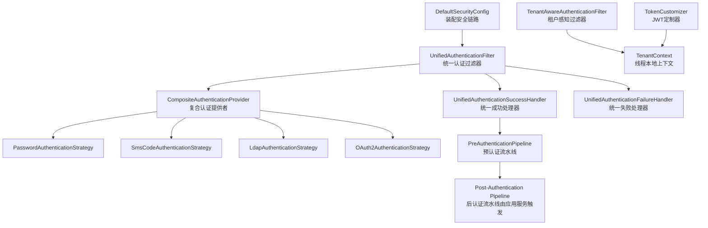
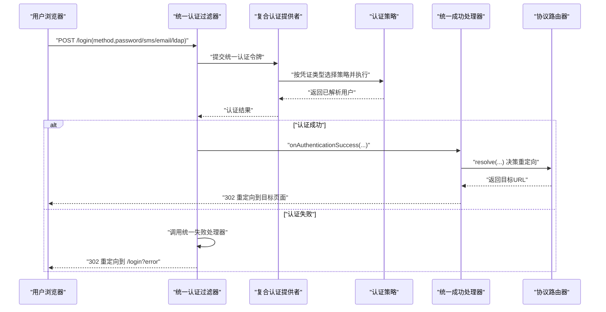
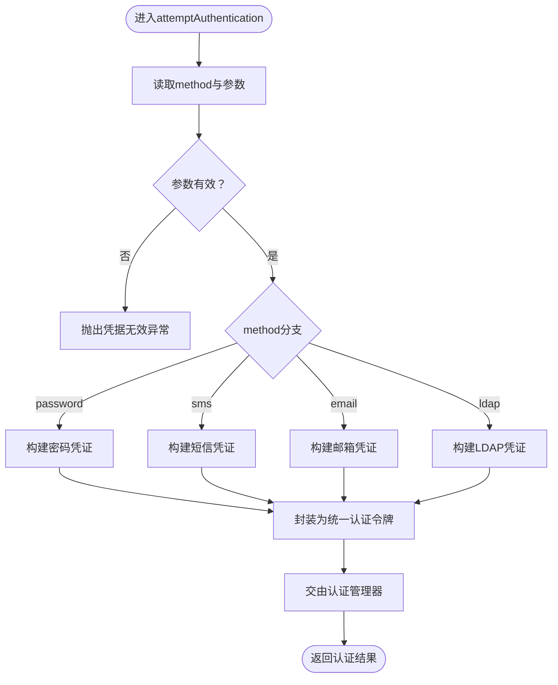
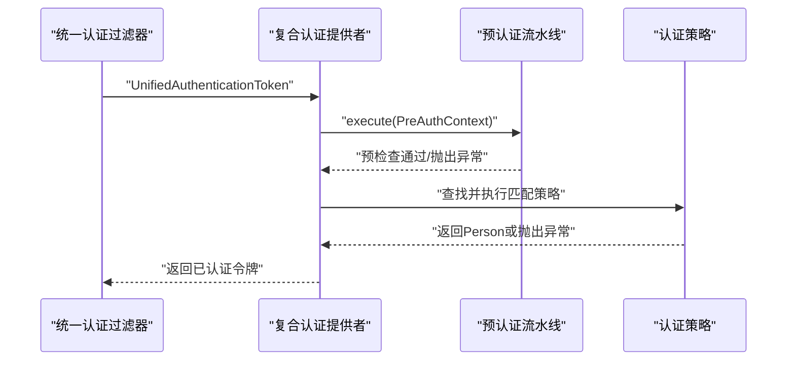
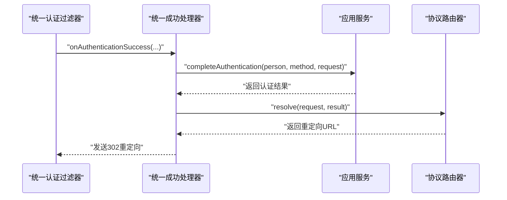
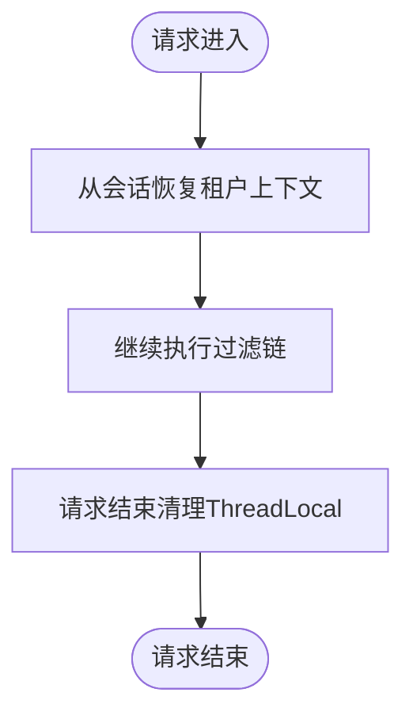
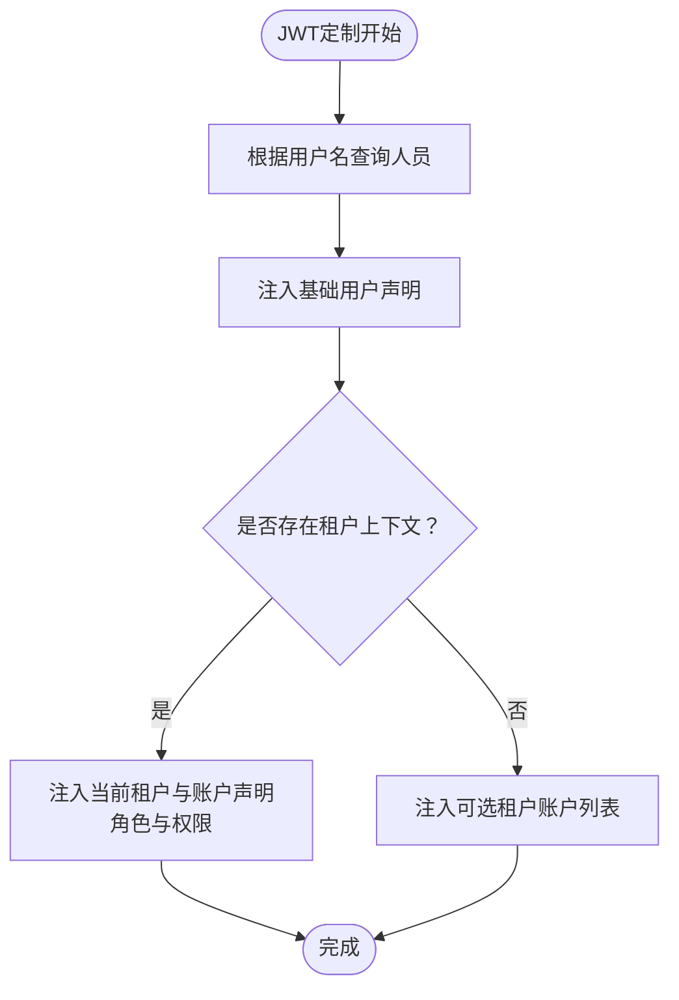
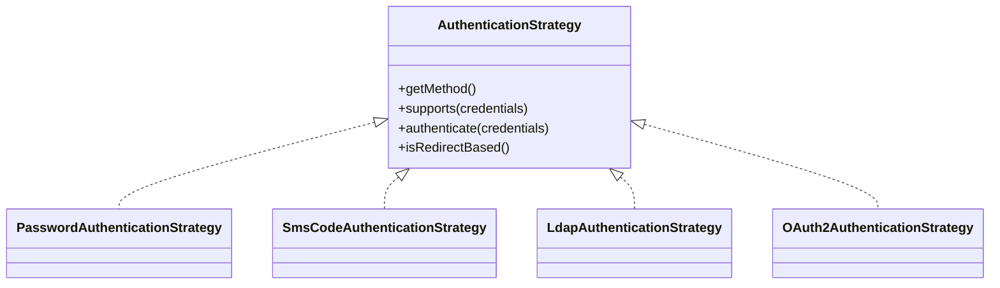
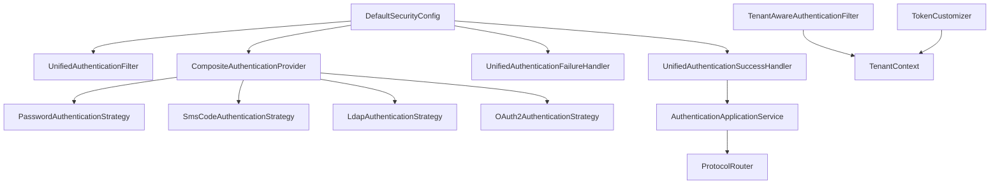

# 安全过滤器

<cite>
**本文引用的文件**
- [DefaultSecurityConfig.java](file://iam-auth-server/src/main/java/iam/platform/auth/infrastructure/config/DefaultSecurityConfig.java)
- [UnifiedAuthenticationFilter.java](file://iam-auth-server/src/main/java/iam/platform/auth/infrastructure/security/UnifiedAuthenticationFilter.java)
- [CompositeAuthenticationProvider.java](file://iam-auth-server/src/main/java/iam/platform/auth/infrastructure/security/CompositeAuthenticationProvider.java)
- [UnifiedAuthenticationSuccessHandler.java](file://iam-auth-server/src/main/java/iam/platform/auth/infrastructure/security/UnifiedAuthenticationSuccessHandler.java)
- [UnifiedAuthenticationFailureHandler.java](file://iam-auth-server/src/main/java/iam/platform/auth/infrastructure/security/UnifiedAuthenticationFailureHandler.java)
- [TenantAwareAuthenticationFilter.java](file://iam-auth-server/src/main/java/iam/platform/auth/infrastructure/security/TenantAwareAuthenticationFilter.java)
- [TenantContext.java](file://iam-auth-server/src/main/java/iam/platform/auth/infrastructure/security/TenantContext.java)
- [TokenCustomizer.java](file://iam-auth-server/src/main/java/iam/platform/auth/infrastructure/security/TokenCustomizer.java)
- [UnifiedAuthenticationToken.java](file://iam-auth-server/src/main/java/iam/platform/auth/infrastructure/security/UnifiedAuthenticationToken.java)
- [PreAuthenticationPipeline.java](file://iam-auth-server/src/main/java/iam/platform/auth/application/service/pipeline/PreAuthenticationPipeline.java)
- [AuthenticationStrategy.java](file://iam-auth-server/src/main/java/iam/platform/auth/domain/service/AuthenticationStrategy.java)
- [PasswordAuthenticationStrategy.java](file://iam-auth-server/src/main/java/iam/platform/auth/domain/service/impl/PasswordAuthenticationStrategy.java)
- [SmsCodeAuthenticationStrategy.java](file://iam-auth-server/src/main/java/iam/platform/auth/domain/service/impl/SmsCodeAuthenticationStrategy.java)
- [LdapAuthenticationStrategy.java](file://iam-auth-server/src/main/java/iam/platform/auth/domain/service/impl/LdapAuthenticationStrategy.java)
- [OAuth2AuthenticationStrategy.java](file://iam-auth-server/src/main/java/iam/platform/auth/domain/service/impl/OAuth2AuthenticationStrategy.java)
- [application.yml](file://iam-auth-server/src/main/resources/application.yml)
</cite>

## 目录
1. [简介](#简介)
2. [项目结构](#项目结构)
3. [核心组件](#核心组件)
4. [架构总览](#架构总览)
5. [组件详解](#组件详解)
6. [依赖关系分析](#依赖关系分析)
7. [性能考量](#性能考量)
8. [故障排查指南](#故障排查指南)
9. [结论](#结论)
10. [附录：配置示例与最佳实践](#附录配置示例与最佳实践)

## 简介
本技术文档聚焦于统一认证过滤器与多租户安全过滤器模块，系统性阐述以下内容：
- 统一认证过滤器的设计与实现：如何在单一入口处理密码、短信验证码、邮箱验证码与LDAP等多种认证方式，并统一接入Spring Security认证流程。
- 认证成功/失败处理器的配置与定制：重定向策略、JSON响应与错误码处理思路。
- 租户感知认证过滤器：多租户环境下认证上下文的传递与隔离。
- 令牌定制器（TokenCustomizer）：JWT声明扩展、权限映射与自定义字段注入。
- 复合认证提供者（CompositeAuthenticationProvider）：如何组合多种认证策略并实现优先级与匹配逻辑。
- 配置示例与性能优化建议。

## 项目结构
围绕安全过滤器的关键代码位于认证服务模块中，主要分布在以下包：
- 配置层：DefaultSecurityConfig 负责装配统一认证过滤器、成功/失败处理器、认证管理器与安全链路。
- 过滤器与处理器：UnifiedAuthenticationFilter、UnifiedAuthenticationSuccessHandler、UnifiedAuthenticationFailureHandler、TenantAwareAuthenticationFilter。
- 认证与策略：CompositeAuthenticationProvider、AuthenticationStrategy接口及其实现（密码、短信验证码、LDAP、OAuth2）。
- 上下文与令牌：TenantContext、TokenCustomizer。
- 应用管道：PreAuthenticationPipeline（预认证流水线）。

图表来源
- [DefaultSecurityConfig.java:35-62](file://iam-auth-server/src/main/java/iam/platform/auth/infrastructure/config/DefaultSecurityConfig.java#L35-L62)
- [UnifiedAuthenticationFilter.java:18-38](file://iam-auth-server/src/main/java/iam/platform/auth/infrastructure/security/UnifiedAuthenticationFilter.java#L18-L38)
- [CompositeAuthenticationProvider.java:26-68](file://iam-auth-server/src/main/java/iam/platform/auth/infrastructure/security/CompositeAuthenticationProvider.java#L26-L68)
- [TenantAwareAuthenticationFilter.java:23-44](file://iam-auth-server/src/main/java/iam/platform/auth/infrastructure/security/TenantAwareAuthenticationFilter.java#L23-L44)
- [TokenCustomizer.java:27-61](file://iam-auth-server/src/main/java/iam/platform/auth/infrastructure/security/TokenCustomizer.java#L27-L61)

章节来源
- [DefaultSecurityConfig.java:27-95](file://iam-auth-server/src/main/java/iam/platform/auth/infrastructure/config/DefaultSecurityConfig.java#L27-L95)

## 核心组件
- 统一认证过滤器（UnifiedAuthenticationFilter）
  - 将多种认证方法统一到一个POST端点，通过隐藏参数识别认证类型，构造统一凭证对象并交由认证管理器处理。
- 复合认证提供者（CompositeAuthenticationProvider）
  - 在认证前执行预认证流水线，按凭证类型选择匹配的认证策略，完成用户解析与认证记录。
- 统一成功/失败处理器
  - 成功：统一收敛所有认证路径，执行后认证流水线并根据协议路由决定重定向地址。
  - 失败：统一路由至登录页并携带错误参数。
- 租户感知过滤器（TenantAwareAuthenticationFilter）
  - 从会话恢复租户上下文，确保后续请求可感知当前租户与账户。
- 令牌定制器（TokenCustomizer）
  - 向JWT注入多租户上下文、角色与权限等声明，支持未选择租户时返回可选账户列表。
- 认证令牌与上下文
  - UnifiedAuthenticationToken 表示统一认证过程中的令牌状态；TenantContext 提供线程本地的租户上下文存储。

章节来源
- [UnifiedAuthenticationFilter.java:18-79](file://iam-auth-server/src/main/java/iam/platform/auth/infrastructure/security/UnifiedAuthenticationFilter.java#L18-L79)
- [CompositeAuthenticationProvider.java:26-75](file://iam-auth-server/src/main/java/iam/platform/auth/infrastructure/security/CompositeAuthenticationProvider.java#L26-L75)
- [UnifiedAuthenticationSuccessHandler.java:28-67](file://iam-auth-server/src/main/java/iam/platform/auth/infrastructure/security/UnifiedAuthenticationSuccessHandler.java#L28-L67)
- [UnifiedAuthenticationFailureHandler.java:13-36](file://iam-auth-server/src/main/java/iam/platform/auth/infrastructure/security/UnifiedAuthenticationFailureHandler.java#L13-L36)
- [TenantAwareAuthenticationFilter.java:23-68](file://iam-auth-server/src/main/java/iam/platform/auth/infrastructure/security/TenantAwareAuthenticationFilter.java#L23-L68)
- [TokenCustomizer.java:27-127](file://iam-auth-server/src/main/java/iam/platform/auth/infrastructure/security/TokenCustomizer.java#L27-L127)
- [UnifiedAuthenticationToken.java:17-68](file://iam-auth-server/src/main/java/iam/platform/auth/infrastructure/security/UnifiedAuthenticationToken.java#L17-L68)

## 架构总览
统一认证过滤器替换默认表单登录过滤器，将所有第一方认证（密码、短信、邮箱、LDAP）与OAuth2社交登录汇聚到同一入口。认证成功后，统一成功处理器触发后认证流水线并依据协议路由决定最终跳转地址；失败则统一重定向到带错误参数的登录页。租户感知过滤器在每次请求中恢复租户上下文，保证后续业务逻辑的多租户隔离。令牌定制器在生成JWT时注入多租户上下文与权限信息。

图表来源
- [DefaultSecurityConfig.java:53-60](file://iam-auth-server/src/main/java/iam/platform/auth/infrastructure/config/DefaultSecurityConfig.java#L53-L60)
- [UnifiedAuthenticationFilter.java:31-38](file://iam-auth-server/src/main/java/iam/platform/auth/infrastructure/security/UnifiedAuthenticationFilter.java#L31-L38)
- [CompositeAuthenticationProvider.java:32-68](file://iam-auth-server/src/main/java/iam/platform/auth/infrastructure/security/CompositeAuthenticationProvider.java#L32-L68)
- [UnifiedAuthenticationSuccessHandler.java:36-66](file://iam-auth-server/src/main/java/iam/platform/auth/infrastructure/security/UnifiedAuthenticationSuccessHandler.java#L36-L66)
- [UnifiedAuthenticationFailureHandler.java:22-35](file://iam-auth-server/src/main/java/iam/platform/auth/infrastructure/security/UnifiedAuthenticationFailureHandler.java#L22-L35)

## 组件详解

### 统一认证过滤器（UnifiedAuthenticationFilter）
- 设计要点
  - 单一入口：统一接收多种认证方式的表单提交，通过method参数区分类型。
  - 凭证解析：根据method动态构建对应的AuthenticationCredentials子类。
  - 统一令牌：将凭证封装为UnifiedAuthenticationToken交由认证管理器。
- 请求处理流程
  - 读取method与必要参数，校验必填项。
  - 解析为具体凭证对象，设置远程地址等细节。
  - 调用认证管理器，进入复合认证提供者与策略层。

图表来源
- [UnifiedAuthenticationFilter.java:31-71](file://iam-auth-server/src/main/java/iam/platform/auth/infrastructure/security/UnifiedAuthenticationFilter.java#L31-L71)

章节来源
- [UnifiedAuthenticationFilter.java:18-79](file://iam-auth-server/src/main/java/iam/platform/auth/infrastructure/security/UnifiedAuthenticationFilter.java#L18-L79)

### 复合认证提供者（CompositeAuthenticationProvider）
- 设计要点
  - 预认证流水线：在策略执行前统一执行预检查（如限流、封禁、白名单等）。
  - 策略匹配：根据凭证类型自动选择对应AuthenticationStrategy。
  - 结果记录：成功/失败分别记录到预认证流水线，用于后续审计与风控。
- 执行序列
  - 从统一令牌提取凭证，构建预认证上下文。
  - 执行预认证流水线。
  - 查找匹配策略并执行认证。
  - 记录成功或失败，返回已解析用户与认证方式。

图表来源
- [CompositeAuthenticationProvider.java:32-68](file://iam-auth-server/src/main/java/iam/platform/auth/infrastructure/security/CompositeAuthenticationProvider.java#L32-L68)
- [PreAuthenticationPipeline.java:26-60](file://iam-auth-server/src/main/java/iam/platform/auth/application/service/pipeline/PreAuthenticationPipeline.java#L26-L60)

章节来源
- [CompositeAuthenticationProvider.java:26-75](file://iam-auth-server/src/main/java/iam/platform/auth/infrastructure/security/CompositeAuthenticationProvider.java#L26-L75)
- [PreAuthenticationPipeline.java:16-60](file://iam-auth-server/src/main/java/iam/platform/auth/application/service/pipeline/PreAuthenticationPipeline.java#L16-L60)

### 统一成功/失败处理器
- 统一成功处理器（UnifiedAuthenticationSuccessHandler）
  - 支持统一认证令牌与OAuth2令牌两种输入。
  - 调用应用服务完成认证收尾（如权限加载、会话建立），随后委托协议路由器决定重定向地址。
- 统一失败处理器（UnifiedAuthenticationFailureHandler）
  - 默认重定向到登录页并附加错误参数，具备兜底重定向能力以应对异常场景。

图表来源
- [UnifiedAuthenticationSuccessHandler.java:36-66](file://iam-auth-server/src/main/java/iam/platform/auth/infrastructure/security/UnifiedAuthenticationSuccessHandler.java#L36-L66)
- [DefaultSecurityConfig.java:76-79](file://iam-auth-server/src/main/java/iam/platform/auth/infrastructure/config/DefaultSecurityConfig.java#L76-L79)

章节来源
- [UnifiedAuthenticationSuccessHandler.java:28-67](file://iam-auth-server/src/main/java/iam/platform/auth/infrastructure/security/UnifiedAuthenticationSuccessHandler.java#L28-L67)
- [UnifiedAuthenticationFailureHandler.java:13-36](file://iam-auth-server/src/main/java/iam/platform/auth/infrastructure/security/UnifiedAuthenticationFailureHandler.java#L13-L36)

### 租户感知认证过滤器与上下文
- 设计要点
  - 仅负责从会话恢复租户上下文，不参与认证决策。
  - 在请求结束时清理ThreadLocal，避免内存泄漏。
- 上下文传递
  - TenantContext提供当前人员、租户与租户账户ID的线程本地存储。
  - 租户感知过滤器在每次请求开始时恢复这些值，确保后续业务逻辑可见。

图表来源
- [TenantAwareAuthenticationFilter.java:28-44](file://iam-auth-server/src/main/java/iam/platform/auth/infrastructure/security/TenantAwareAuthenticationFilter.java#L28-L44)
- [TenantContext.java:7-45](file://iam-auth-server/src/main/java/iam/platform/auth/infrastructure/security/TenantContext.java#L7-L45)

章节来源
- [TenantAwareAuthenticationFilter.java:23-68](file://iam-auth-server/src/main/java/iam/platform/auth/infrastructure/security/TenantAwareAuthenticationFilter.java#L23-L68)
- [TenantContext.java:1-45](file://iam-auth-server/src/main/java/iam/platform/auth/infrastructure/security/TenantContext.java#L1-L45)

### 令牌定制器（TokenCustomizer）
- 设计要点
  - 注入基础用户信息（邮箱、昵称、人员ID）。
  - 若存在租户上下文：注入当前租户ID/编码、账户ID、员工号、角色与权限集合。
  - 若不存在租户上下文：注入可选租户账户列表，允许客户端选择。
  - 权限加载失败时，令牌仍可生成但权限为空，保证可用性。
- 适用场景
  - OAuth2授权码/密码模式发放JWT时，统一注入多租户上下文与权限。

图表来源
- [TokenCustomizer.java:33-61](file://iam-auth-server/src/main/java/iam/platform/auth/infrastructure/security/TokenCustomizer.java#L33-L61)
- [TokenCustomizer.java:66-97](file://iam-auth-server/src/main/java/iam/platform/auth/infrastructure/security/TokenCustomizer.java#L66-L97)
- [TokenCustomizer.java:103-125](file://iam-auth-server/src/main/java/iam/platform/auth/infrastructure/security/TokenCustomizer.java#L103-L125)

章节来源
- [TokenCustomizer.java:17-127](file://iam-auth-server/src/main/java/iam/platform/auth/infrastructure/security/TokenCustomizer.java#L17-L127)

### 认证策略与方法
- 接口契约（AuthenticationStrategy）
  - 暴露认证方法枚举、凭证类型匹配、认证执行与是否需要外部重定向的能力。
- 具体策略
  - 密码认证：基于BCrypt验证本地存储的哈希。
  - 短信验证码：校验验证码有效性并解析或创建人员。
  - LDAP：通过目录服务绑定验证，按需创建本地人员。
  - OAuth2：外部已验证，此处仅做映射与标记。

图表来源
- [AuthenticationStrategy.java:11-40](file://iam-auth-server/src/main/java/iam/platform/auth/domain/service/AuthenticationStrategy.java#L11-L40)
- [PasswordAuthenticationStrategy.java:26-63](file://iam-auth-server/src/main/java/iam/platform/auth/domain/service/impl/PasswordAuthenticationStrategy.java#L26-L63)
- [SmsCodeAuthenticationStrategy.java:14-39](file://iam-auth-server/src/main/java/iam/platform/auth/domain/service/impl/SmsCodeAuthenticationStrategy.java#L14-L39)
- [LdapAuthenticationStrategy.java:30-136](file://iam-auth-server/src/main/java/iam/platform/auth/domain/service/impl/LdapAuthenticationStrategy.java#L30-L136)
- [OAuth2AuthenticationStrategy.java:17-54](file://iam-auth-server/src/main/java/iam/platform/auth/domain/service/impl/OAuth2AuthenticationStrategy.java#L17-L54)

章节来源
- [AuthenticationStrategy.java:1-41](file://iam-auth-server/src/main/java/iam/platform/auth/domain/service/AuthenticationStrategy.java#L1-L41)
- [PasswordAuthenticationStrategy.java:1-64](file://iam-auth-server/src/main/java/iam/platform/auth/domain/service/impl/PasswordAuthenticationStrategy.java#L1-L64)
- [SmsCodeAuthenticationStrategy.java:1-39](file://iam-auth-server/src/main/java/iam/platform/auth/domain/service/impl/SmsCodeAuthenticationStrategy.java#L1-L39)
- [LdapAuthenticationStrategy.java:1-137](file://iam-auth-server/src/main/java/iam/platform/auth/domain/service/impl/LdapAuthenticationStrategy.java#L1-L137)
- [OAuth2AuthenticationStrategy.java:1-55](file://iam-auth-server/src/main/java/iam/platform/auth/domain/service/impl/OAuth2AuthenticationStrategy.java#L1-L55)

## 依赖关系分析
- 组件耦合
  - DefaultSecurityConfig将统一过滤器、成功/失败处理器与认证管理器装配到安全链路，耦合度低，职责清晰。
  - CompositeAuthenticationProvider依赖策略列表与预认证流水线，策略通过Spring自动发现，便于扩展。
  - TokenCustomizer依赖仓储与应用服务以加载权限，具备降级容错。
- 外部依赖
  - OAuth2社交登录通过Spring Security OAuth2配置，与统一成功处理器解耦。
  - LDAP认证依赖配置属性与目录服务连接，策略内聚处理异常。

图表来源
- [DefaultSecurityConfig.java:35-88](file://iam-auth-server/src/main/java/iam/platform/auth/infrastructure/config/DefaultSecurityConfig.java#L35-L88)
- [CompositeAuthenticationProvider.java:28-29](file://iam-auth-server/src/main/java/iam/platform/auth/infrastructure/security/CompositeAuthenticationProvider.java#L28-L29)
- [UnifiedAuthenticationSuccessHandler.java:30-31](file://iam-auth-server/src/main/java/iam/platform/auth/infrastructure/security/UnifiedAuthenticationSuccessHandler.java#L30-L31)
- [TokenCustomizer.java:29-31](file://iam-auth-server/src/main/java/iam/platform/auth/infrastructure/security/TokenCustomizer.java#L29-L31)

章节来源
- [DefaultSecurityConfig.java:27-95](file://iam-auth-server/src/main/java/iam/platform/auth/infrastructure/config/DefaultSecurityConfig.java#L27-L95)
- [CompositeAuthenticationProvider.java:26-75](file://iam-auth-server/src/main/java/iam/platform/auth/infrastructure/security/CompositeAuthenticationProvider.java#L26-L75)

## 性能考量
- 连接池与超时
  - 数据库连接池参数已在配置中设定，建议结合压测调整最大池大小与超时时间，避免高并发下的连接争用。
- 缓存与限流
  - 预认证流水线包含限流与封禁处理，建议启用并合理配置阈值与窗口，降低暴力破解风险。
- 令牌生成
  - TokenCustomizer在权限加载失败时降级为空集合，避免阻塞令牌生成；建议对权限加载进行缓存或异步刷新。
- 过滤器链顺序
  - 统一认证过滤器替换默认表单过滤器，租户感知过滤器在统一认证之后，减少重复上下文设置开销。

## 故障排查指南
- 登录失败重定向
  - 若统一失败处理器无法重定向，检查会话创建与转发策略配置，确保允许会话创建且未启用forward。
- OAuth2登录异常
  - 确认OAuth2注册ID与用户信息服务配置正确，统一成功处理器会根据注册ID映射认证方法。
- LDAP认证失败
  - 检查LDAP连接参数、SSL配置与用户DN构造规则，策略内部已捕获并转换为凭据无效异常。
- 租户上下文丢失
  - 确认会话中存在租户ID与账户ID，租户感知过滤器会在请求结束清理ThreadLocal，避免内存泄漏。

章节来源
- [UnifiedAuthenticationFailureHandler.java:15-35](file://iam-auth-server/src/main/java/iam/platform/auth/infrastructure/security/UnifiedAuthenticationFailureHandler.java#L15-L35)
- [OAuth2AuthenticationStrategy.java:47-53](file://iam-auth-server/src/main/java/iam/platform/auth/domain/service/impl/OAuth2AuthenticationStrategy.java#L47-L53)
- [LdapAuthenticationStrategy.java:106-130](file://iam-auth-server/src/main/java/iam/platform/auth/domain/service/impl/LdapAuthenticationStrategy.java#L106-L130)
- [TenantAwareAuthenticationFilter.java:38-43](file://iam-auth-server/src/main/java/iam/platform/auth/infrastructure/security/TenantAwareAuthenticationFilter.java#L38-L43)

## 结论
该安全过滤器模块通过统一认证入口、复合认证策略与租户上下文管理，实现了多认证方式的一致化与多租户隔离。配合令牌定制器与协议路由，既能满足传统表单登录，也能兼容OAuth2与LDAP等企业级需求。通过预认证流水线与限流封禁策略，系统在安全性与可用性之间取得平衡。

## 附录：配置示例与最佳实践
- 安全配置要点
  - 启用统一认证过滤器替换默认表单登录过滤器，确保所有认证走同一入口。
  - OAuth2登录页面与用户信息服务配置正确，成功处理器指向统一成功处理器。
  - 会话存储使用Redis，租户上下文在登录后写入会话，后续请求由租户感知过滤器恢复。
- 认证策略启用
  - 根据部署环境启用密码、短信、邮箱、LDAP或OAuth2策略，避免不必要的暴露面。
  - LDAP生产环境务必使用LDAPS，严格限制绑定DN与搜索范围。
- 令牌声明扩展
  - TokenCustomizer默认注入基础用户信息与多租户上下文；如需扩展自定义字段，可在定制器中追加声明，注意与客户端约定。
- 性能优化建议
  - 调整数据库连接池参数与Redis连接配置，结合监控指标持续优化。
  - 对权限加载进行缓存或批量预热，降低令牌生成时延。
  - 合理设置限流与封禁阈值，平衡安全与用户体验。

章节来源
- [DefaultSecurityConfig.java:35-62](file://iam-auth-server/src/main/java/iam/platform/auth/infrastructure/config/DefaultSecurityConfig.java#L35-L62)
- [application.yml:54-127](file://iam-auth-server/src/main/resources/application.yml#L54-L127)
- [TokenCustomizer.java:33-61](file://iam-auth-server/src/main/java/iam/platform/auth/infrastructure/security/TokenCustomizer.java#L33-L61)