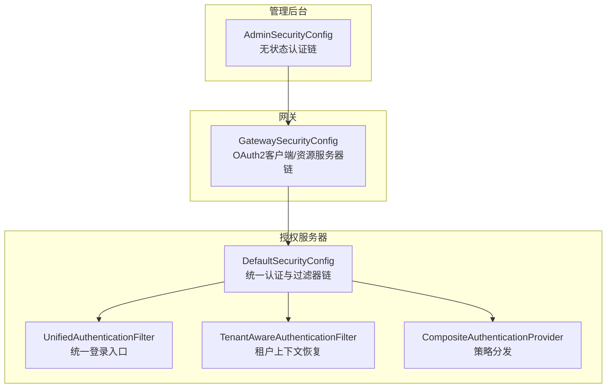
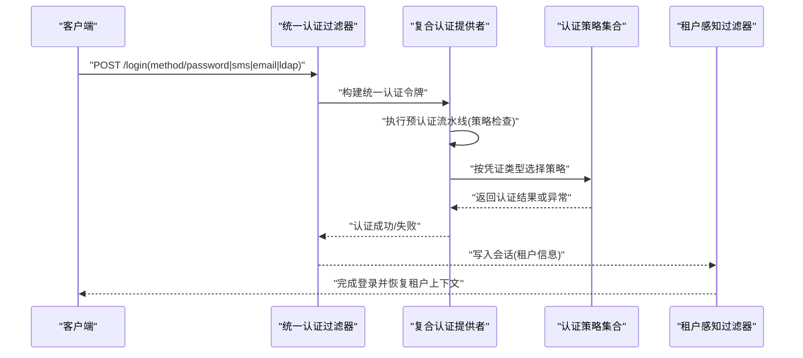
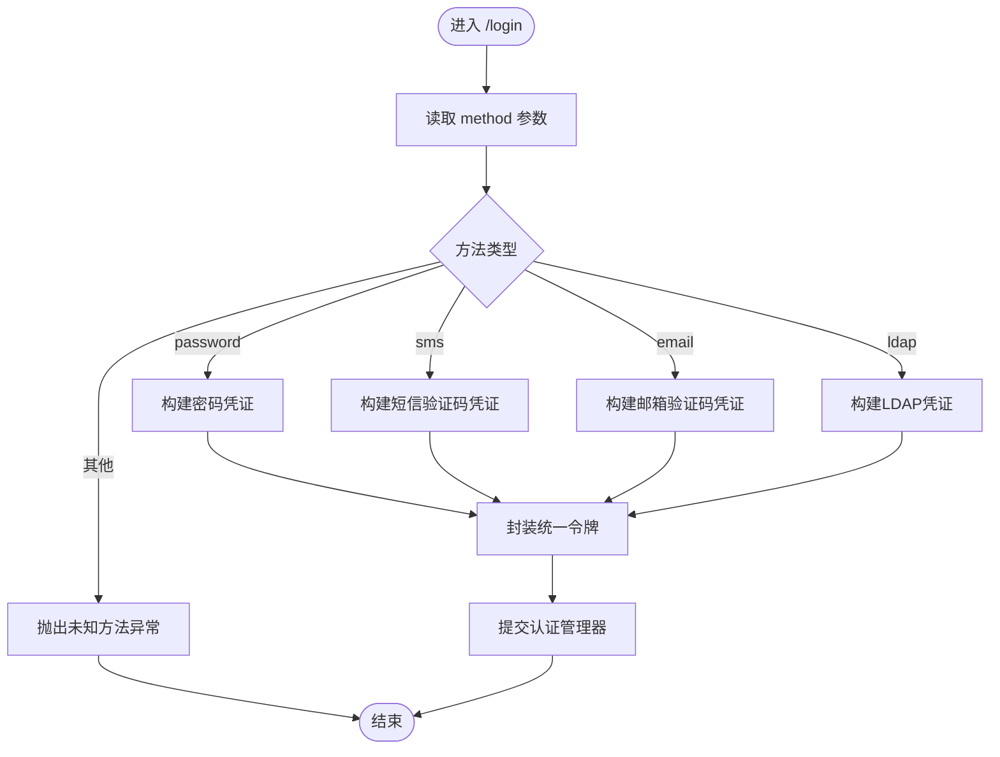
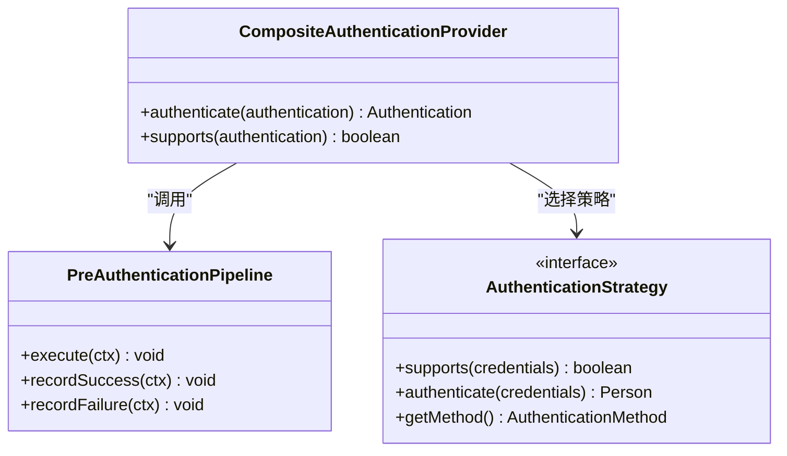
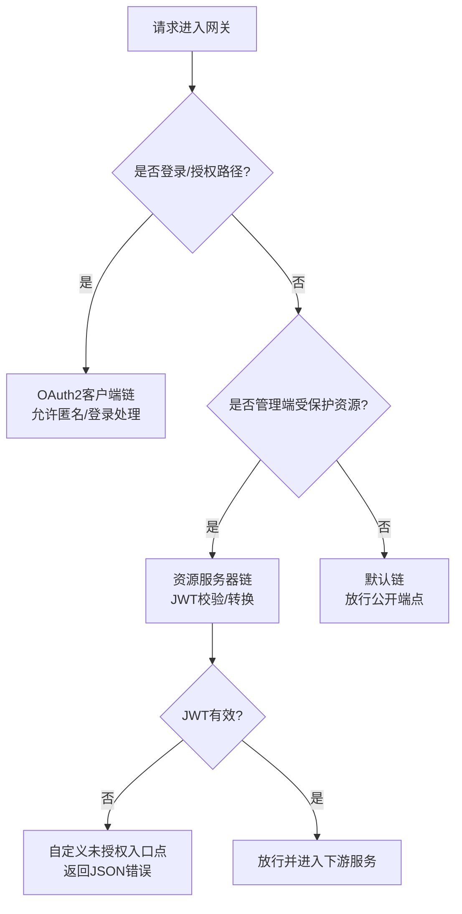
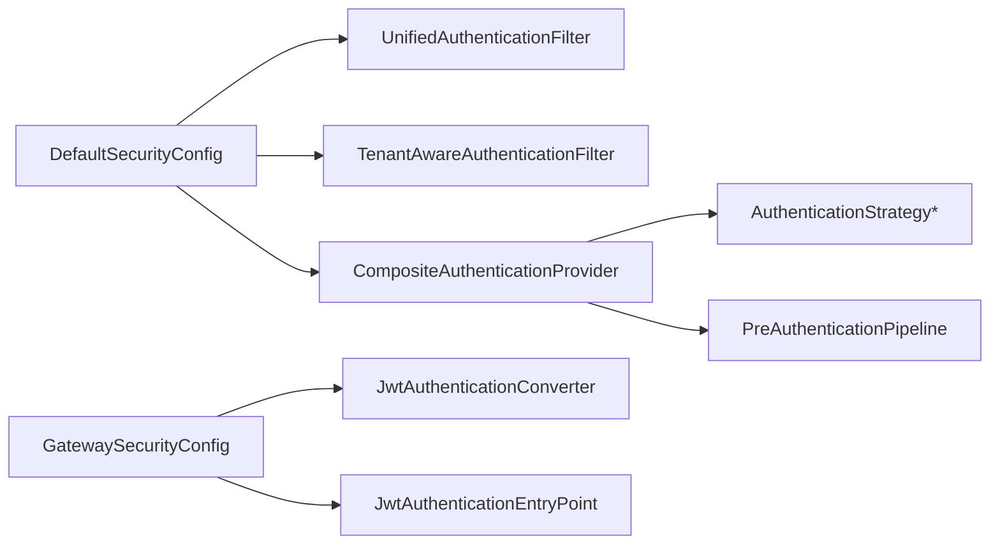

# 安全配置

<cite>
**本文引用的文件**
- [DefaultSecurityConfig.java](file://iam-auth-server/src/main/java/iam/platform/auth/infrastructure/config/DefaultSecurityConfig.java)
- [AdminSecurityConfig.java](file://iam-admin-server/src/main/java/iam/platform/admin/infrastructure/config/AdminSecurityConfig.java)
- [GatewaySecurityConfig.java](file://iam-gateway/src/main/java/iam/platform/gateway/infrastructure/security/GatewaySecurityConfig.java)
- [EncryptionProperties.java](file://iam-auth-server/src/main/java/iam/platform/auth/infrastructure/config/EncryptionProperties.java)
- [JwkProperties.java](file://iam-auth-server/src/main/java/iam/platform/auth/infrastructure/config/JwkProperties.java)
- [LdapProperties.java](file://iam-auth-server/src/main/java/iam/platform/auth/infrastructure/config/LdapProperties.java)
- [SamlProperties.java](file://iam-auth-server/src/main/java/iam/platform/auth/infrastructure/config/SamlProperties.java)
- [CasProperties.java](file://iam-auth-server/src/main/java/iam/platform/auth/infrastructure/config/CasProperties.java)
- [SecurityPolicyProperties.java](file://iam-auth-server/src/main/java/iam/platform/auth/infrastructure/config/SecurityPolicyProperties.java)
- [application.yml](file://iam-auth-server/src/main/resources/application.yml)
- [application-dev.yml](file://iam-auth-server/src/main/resources/application-dev.yml)
- [UnifiedAuthenticationFilter.java](file://iam-auth-server/src/main/java/iam/platform/auth/infrastructure/security/UnifiedAuthenticationFilter.java)
- [TenantAwareAuthenticationFilter.java](file://iam-auth-server/src/main/java/iam/platform/auth/infrastructure/security/TenantAwareAuthenticationFilter.java)
- [CompositeAuthenticationProvider.java](file://iam-auth-server/src/main/java/iam/platform/auth/infrastructure/security/CompositeAuthenticationProvider.java)
</cite>

## 目录
1. [简介](#简介)
2. [项目结构](#项目结构)
3. [核心组件](#核心组件)
4. [架构总览](#架构总览)
5. [详细组件分析](#详细组件分析)
6. [依赖分析](#依赖分析)
7. [性能考虑](#性能考虑)
8. [故障排查指南](#故障排查指南)
9. [结论](#结论)
10. [附录](#附录)

## 简介
本文件面向安全配置模块，系统性梳理授权服务器（Auth Server）的安全设计与配置要点，覆盖以下主题：
- 授权服务器配置：客户端注册、令牌配置、JWK密钥管理、端点安全保护
- 默认安全配置：HTTP安全头、CSRF保护、CORS配置、会话管理策略
- 加密属性：敏感数据加密、密钥轮换、安全存储机制
- LDAP属性：连接参数、搜索过滤器、用户映射规则
- 外部协议：SAML、CAS等配置参数与集成要点
- 最佳实践与常见问题解决方案

## 项目结构
安全相关代码主要分布在三个子系统中：
- 授权服务器（iam-auth-server）：统一认证入口、多协议适配、安全策略与密钥管理
- 网关（iam-gateway）：OAuth2客户端链、资源服务器链、JWT校验与统一错误处理
- 管理后台（iam-admin-server）：基于网关的无状态认证链路

图表来源
- [DefaultSecurityConfig.java:35-63](file://iam-auth-server/src/main/java/iam/platform/auth/infrastructure/config/DefaultSecurityConfig.java#L35-L63)
- [UnifiedAuthenticationFilter.java:18-79](file://iam-auth-server/src/main/java/iam/platform/auth/infrastructure/security/UnifiedAuthenticationFilter.java#L18-L79)
- [TenantAwareAuthenticationFilter.java:23-67](file://iam-auth-server/src/main/java/iam/platform/auth/infrastructure/security/TenantAwareAuthenticationFilter.java#L23-L67)
- [CompositeAuthenticationProvider.java:24-75](file://iam-auth-server/src/main/java/iam/platform/auth/infrastructure/security/CompositeAuthenticationProvider.java#L24-L75)
- [GatewaySecurityConfig.java:28-73](file://iam-gateway/src/main/java/iam/platform/gateway/infrastructure/security/GatewaySecurityConfig.java#L28-L73)
- [AdminSecurityConfig.java:18-34](file://iam-admin-server/src/main/java/iam/platform/admin/infrastructure/config/AdminSecurityConfig.java#L18-L34)

章节来源
- [DefaultSecurityConfig.java:24-95](file://iam-auth-server/src/main/java/iam/platform/auth/infrastructure/config/DefaultSecurityConfig.java#L24-L95)
- [GatewaySecurityConfig.java:21-131](file://iam-gateway/src/main/java/iam/platform/gateway/infrastructure/security/GatewaySecurityConfig.java#L21-L131)
- [AdminSecurityConfig.java:14-41](file://iam-admin-server/src/main/java/iam/platform/admin/infrastructure/config/AdminSecurityConfig.java#L14-L41)

## 核心组件
- 统一认证过滤器链：通过自定义过滤器替代传统表单登录，集中处理多种认证方式（密码、短信验证码、邮箱验证码、LDAP），并注入租户上下文。
- 统一认证过滤器：从POST /login读取method字段决定认证类型，构造统一认证令牌并交由认证提供者处理。
- 复合认证提供者：根据凭证类型选择具体认证策略，执行预认证流水线（速率限制、账户锁定、IP白名单等），再进行认证并记录结果。
- 租户感知过滤器：从会话恢复租户上下文，确保后续请求在正确的租户域内运行。
- 网关安全链：区分OAuth2客户端链（浏览器登录）、资源服务器链（JWT校验）与默认链（公开端点放行），统一处理未授权错误。
- 管理后台安全链：无状态会话策略，禁用CSRF，前置JWT上下文过滤器。

章节来源
- [DefaultSecurityConfig.java:35-88](file://iam-auth-server/src/main/java/iam/platform/auth/infrastructure/config/DefaultSecurityConfig.java#L35-L88)
- [UnifiedAuthenticationFilter.java:18-79](file://iam-auth-server/src/main/java/iam/platform/auth/infrastructure/security/UnifiedAuthenticationFilter.java#L18-L79)
- [CompositeAuthenticationProvider.java:24-75](file://iam-auth-server/src/main/java/iam/platform/auth/infrastructure/security/CompositeAuthenticationProvider.java#L24-L75)
- [TenantAwareAuthenticationFilter.java:23-67](file://iam-auth-server/src/main/java/iam/platform/auth/infrastructure/security/TenantAwareAuthenticationFilter.java#L23-L67)
- [GatewaySecurityConfig.java:28-73](file://iam-gateway/src/main/java/iam/platform/gateway/infrastructure/security/GatewaySecurityConfig.java#L28-L73)
- [AdminSecurityConfig.java:18-34](file://iam-admin-server/src/main/java/iam/platform/admin/infrastructure/config/AdminSecurityConfig.java#L18-L34)

## 架构总览
下图展示认证主链路与外部协议集成的关键交互：

图表来源
- [UnifiedAuthenticationFilter.java:31-62](file://iam-auth-server/src/main/java/iam/platform/auth/infrastructure/security/UnifiedAuthenticationFilter.java#L31-L62)
- [CompositeAuthenticationProvider.java:32-68](file://iam-auth-server/src/main/java/iam/platform/auth/infrastructure/security/CompositeAuthenticationProvider.java#L32-L68)
- [TenantAwareAuthenticationFilter.java:49-66](file://iam-auth-server/src/main/java/iam/platform/auth/infrastructure/security/TenantAwareAuthenticationFilter.java#L49-L66)

章节来源
- [DefaultSecurityConfig.java:35-88](file://iam-auth-server/src/main/java/iam/platform/auth/infrastructure/config/DefaultSecurityConfig.java#L35-L88)

## 详细组件分析

### 授权服务器安全配置（DefaultSecurityConfig）
- 过滤器链组织
  - 明确放行静态资源、登录页、注册页、授权回调等端点
  - 其余请求均需认证
  - 替换Spring默认表单登录为统一认证过滤器
  - 在统一认证后追加租户感知过滤器
- 认证管理器与密码编码器
  - 注册复合认证提供者作为认证策略源
  - 提供BCrypt密码编码器
- OAuth2登录与登出
  - 登录页指向统一登录入口
  - 用户信息服务使用自定义实现
  - 成功处理器委托统一成功处理逻辑
  - 登出后失效HTTP会话并重定向到登录页

章节来源
- [DefaultSecurityConfig.java:35-88](file://iam-auth-server/src/main/java/iam/platform/auth/infrastructure/config/DefaultSecurityConfig.java#L35-L88)

### 统一认证过滤器（UnifiedAuthenticationFilter）
- 单一登录入口：POST /login
- 方法路由：通过隐藏参数method识别认证方式
  - 密码认证：用户名+密码
  - 短信验证码：手机号+验证码
  - 邮箱验证码：邮箱+验证码
  - LDAP认证：用户名+密码+域名
- 参数校验：缺失必填参数时抛出凭据无效异常
- 统一令牌：将凭证封装为统一认证令牌并提交给认证管理器

图表来源
- [UnifiedAuthenticationFilter.java:43-62](file://iam-auth-server/src/main/java/iam/platform/auth/infrastructure/security/UnifiedAuthenticationFilter.java#L43-L62)

章节来源
- [UnifiedAuthenticationFilter.java:18-79](file://iam-auth-server/src/main/java/iam/platform/auth/infrastructure/security/UnifiedAuthenticationFilter.java#L18-L79)

### 复合认证提供者（CompositeAuthenticationProvider）
- 职责
  - 识别凭证类型并选择对应认证策略
  - 执行预认证流水线（包含策略检查）
  - 记录认证成功/失败事件
  - 返回已认证的统一令牌
- 预认证流水线
  - 通过上下文对象承载凭证与环境信息
  - 流水线负责策略执行与结果记录

图表来源
- [CompositeAuthenticationProvider.java:24-75](file://iam-auth-server/src/main/java/iam/platform/auth/infrastructure/security/CompositeAuthenticationProvider.java#L24-L75)

章节来源
- [CompositeAuthenticationProvider.java:24-75](file://iam-auth-server/src/main/java/iam/platform/auth/infrastructure/security/CompositeAuthenticationProvider.java#L24-L75)

### 租户感知过滤器（TenantAwareAuthenticationFilter）
- 作用
  - 从会话恢复租户上下文（租户ID、租户账号ID、人员ID）
  - 在请求结束后清理ThreadLocal，避免内存泄漏
- 触发时机
  - 在统一认证之后，对后续请求恢复上下文

章节来源
- [TenantAwareAuthenticationFilter.java:23-67](file://iam-auth-server/src/main/java/iam/platform/auth/infrastructure/security/TenantAwareAuthenticationFilter.java#L23-L67)

### 网关安全链（GatewaySecurityConfig）
- OAuth2客户端链（优先级1）
  - 匹配登录与授权相关路径，允许匿名访问
  - 启用OAuth2登录并配置成功处理器
  - 关闭CSRF
- 资源服务器链（优先级2）
  - 匹配管理端路径，要求认证
  - 使用JWT转换器验证令牌
  - 自定义未授权入口点，输出结构化JSON错误
- 默认链（优先级3）
  - 放行公开端点（认证、静态、健康检查、Well-Known等）

图表来源
- [GatewaySecurityConfig.java:28-73](file://iam-gateway/src/main/java/iam/platform/gateway/infrastructure/security/GatewaySecurityConfig.java#L28-L73)
- [GatewaySecurityConfig.java:78-129](file://iam-gateway/src/main/java/iam/platform/gateway/infrastructure/security/GatewaySecurityConfig.java#L78-L129)

章节来源
- [GatewaySecurityConfig.java:21-131](file://iam-gateway/src/main/java/iam/platform/gateway/infrastructure/security/GatewaySecurityConfig.java#L21-L131)

### 管理后台安全链（AdminSecurityConfig）
- 无状态会话策略：禁止会话创建
- 放行监控与API文档端点
- 禁用CSRF
- 前置JWT上下文过滤器，信任来自网关的认证头

章节来源
- [AdminSecurityConfig.java:18-34](file://iam-admin-server/src/main/java/iam/platform/admin/infrastructure/config/AdminSecurityConfig.java#L18-L34)

### 安全策略与默认安全配置
- 安全策略属性（SecurityPolicyProperties）
  - 速率限制：启用开关、最大尝试次数、时间窗口
  - 账户锁定：启用开关、阈值、锁定时长
  - IP白名单/黑名单：支持动态配置
- 默认安全配置要点
  - 放行静态资源、登录页、注册页、授权回调
  - 其他请求必须认证
  - 禁用CSRF（统一认证过滤器替代）
  - 会话管理：通过Redis存储，命名空间隔离

章节来源
- [SecurityPolicyProperties.java:15-37](file://iam-auth-server/src/main/java/iam/platform/auth/infrastructure/config/SecurityPolicyProperties.java#L15-L37)
- [application.yml:49-53](file://iam-auth-server/src/main/resources/application.yml#L49-L53)
- [DefaultSecurityConfig.java:39-51](file://iam-auth-server/src/main/java/iam/platform/auth/infrastructure/config/DefaultSecurityConfig.java#L39-L51)

### 加密属性与密钥管理
- 加密属性（EncryptionProperties）
  - 配置项：security.encryption.key
  - 用途：敏感数据加密（如存储在数据库中的密文字段）
- JWK密钥属性（JwkProperties）
  - 配置项：security.jwk.rsa.private-key-location、security.jwk.rsa.public-key-location
  - 用途：用于生成/验证JWT签名（RSA）
- 应用配置
  - 生产环境建议通过环境变量注入密钥与证书路径
  - 开发环境提供默认值便于本地调试

章节来源
- [EncryptionProperties.java:12-14](file://iam-auth-server/src/main/java/iam/platform/auth/infrastructure/config/EncryptionProperties.java#L12-L14)
- [JwkProperties.java:12-15](file://iam-auth-server/src/main/java/iam/platform/auth/infrastructure/config/JwkProperties.java#L12-L15)
- [application.yml:81-88](file://iam-auth-server/src/main/resources/application.yml#L81-L88)
- [application-dev.yml:24-26](file://iam-auth-server/src/main/resources/application-dev.yml#L24-L26)

### LDAP属性配置
- 属性清单（LdapProperties）
  - 启用开关、服务器URL、基础DN、绑定DN与密码
  - 用户搜索基DN与过滤器、是否使用SSL
  - 连接超时、读取超时、连接池大小
- 集成要点
  - 与统一认证过滤器联动，支持method=ldap的登录方式
  - 搜索过滤器可参数化占位符以适配不同目录结构

章节来源
- [LdapProperties.java:13-33](file://iam-auth-server/src/main/java/iam/platform/auth/infrastructure/config/LdapProperties.java#L13-L33)
- [application.yml:104-114](file://iam-auth-server/src/main/resources/application.yml#L104-L114)
- [UnifiedAuthenticationFilter.java:56-58](file://iam-auth-server/src/main/java/iam/platform/auth/infrastructure/security/UnifiedAuthenticationFilter.java#L56-L58)

### SAML属性配置
- 属性清单（SamlProperties）
  - 实体ID、SSO端点URL、断言有效期、签名算法、NameID格式
  - 是否签名断言、签名密钥路径与密码
- 集成要点
  - 断言有效期应结合业务场景合理设置
  - 签名算法与密钥需与身份提供商一致

章节来源
- [SamlProperties.java:13-38](file://iam-auth-server/src/main/java/iam/platform/auth/infrastructure/config/SamlProperties.java#L13-L38)
- [application.yml:128-144](file://iam-auth-server/src/main/resources/application.yml#L128-L144)

### CAS属性配置
- 属性清单（CasProperties）
  - 服务器URL、票据有效期、票据前缀
  - 单点登出开关、登出URL、登录URL
  - 前后通道登出开关、登出请求TTL、是否向所有服务发送登出
- 集成要点
  - 票据有效期与前端刷新策略匹配
  - 登出通道配置需与服务端一致，避免“假登出”

章节来源
- [CasProperties.java:13-44](file://iam-auth-server/src/main/java/iam/platform/auth/infrastructure/config/CasProperties.java#L13-L44)
- [application.yml:115-127](file://iam-auth-server/src/main/resources/application.yml#L115-L127)

## 依赖分析
- 组件耦合
  - DefaultSecurityConfig依赖统一认证过滤器、租户感知过滤器、复合认证提供者与应用服务
  - 复合认证提供者依赖认证策略集合与预认证流水线
  - 网关安全链独立于授权服务器，仅依赖JWT转换器与自定义入口点
- 外部依赖
  - Redis：会话存储与速率限制
  - 数据库：持久化认证与审计日志
  - 外部协议：SAML IdP、CAS Server、OAuth2提供商

图表来源
- [DefaultSecurityConfig.java:35-88](file://iam-auth-server/src/main/java/iam/platform/auth/infrastructure/config/DefaultSecurityConfig.java#L35-L88)
- [CompositeAuthenticationProvider.java:24-75](file://iam-auth-server/src/main/java/iam/platform/auth/infrastructure/security/CompositeAuthenticationProvider.java#L24-L75)
- [GatewaySecurityConfig.java:45-58](file://iam-gateway/src/main/java/iam/platform/gateway/infrastructure/security/GatewaySecurityConfig.java#L45-L58)

章节来源
- [DefaultSecurityConfig.java:24-95](file://iam-auth-server/src/main/java/iam/platform/auth/infrastructure/config/DefaultSecurityConfig.java#L24-L95)
- [CompositeAuthenticationProvider.java:24-75](file://iam-auth-server/src/main/java/iam/platform/auth/infrastructure/security/CompositeAuthenticationProvider.java#L24-L75)
- [GatewaySecurityConfig.java:21-131](file://iam-gateway/src/main/java/iam/platform/gateway/infrastructure/security/GatewaySecurityConfig.java#L21-L131)

## 性能考虑
- 速率限制与账户锁定
  - 通过安全策略属性控制最大尝试次数与时间窗口，降低暴力破解风险
  - 锁定时长与阈值需平衡安全与可用性
- 连接池与超时
  - LDAP连接池大小与超时应结合并发与网络状况调整
- 会话存储
  - Redis会话存储具备高可用与横向扩展能力，命名空间隔离避免键冲突
- 日志与追踪
  - 开启调试级别有助于定位认证问题，但生产环境需谨慎控制日志量

## 故障排查指南
- 401未授权（网关资源服务器链）
  - 现象：资源服务器链返回结构化JSON错误
  - 排查：检查令牌是否过期、签名是否有效、发行者是否正确
- 登录失败
  - 现象：统一认证过滤器抛出凭据无效异常
  - 排查：确认method参数与必填字段；检查LDAP连接参数与搜索过滤器
- 会话丢失
  - 现象：租户上下文无法恢复
  - 排查：确认会话存储可用、命名空间正确、过滤器顺序无误
- CSRF相关问题
  - 现象：表单提交被拦截
  - 说明：默认安全配置已禁用CSRF，统一由认证过滤器处理

章节来源
- [GatewaySecurityConfig.java:78-129](file://iam-gateway/src/main/java/iam/platform/gateway/infrastructure/security/GatewaySecurityConfig.java#L78-L129)
- [UnifiedAuthenticationFilter.java:64-71](file://iam-auth-server/src/main/java/iam/platform/auth/infrastructure/security/UnifiedAuthenticationFilter.java#L64-L71)
- [TenantAwareAuthenticationFilter.java:49-66](file://iam-auth-server/src/main/java/iam/platform/auth/infrastructure/security/TenantAwareAuthenticationFilter.java#L49-L66)
- [DefaultSecurityConfig.java:39-51](file://iam-auth-server/src/main/java/iam/platform/auth/infrastructure/config/DefaultSecurityConfig.java#L39-L51)

## 结论
本安全配置模块通过统一认证入口、策略化认证提供者与清晰的过滤器链，实现了对多认证方式与多协议（LDAP、SAML、CAS）的统一治理。配合安全策略、密钥管理与网关资源服务器链，形成从入口到下游服务的完整安全闭环。建议在生产环境中严格管理密钥与证书、审慎配置LDAP与外部协议参数，并持续优化速率限制与会话策略以平衡安全与性能。

## 附录
- 配置清单与建议
  - SSL/TLS：启用HTTPS，使用强密码套件与证书固定
  - 密钥轮换：定期更换JWK私钥与加密密钥，旧密钥保留过渡期
  - LDAP：使用只读绑定DN，合理设置搜索过滤器与超时
  - 外部协议：与IdP保持版本与参数同步，启用必要的签名与加密
  - 日志：生产环境关闭调试日志，保留必要审计日志