# 认证应用服务

<cite>
**本文档引用的文件**
- [AuthenticationApplicationService.java](file://iam-auth-server/src/main/java/iam/platform/auth/application/service/AuthenticationApplicationService.java)
- [LdapUserLookupService.java](file://iam-auth-server/src/main/java/iam/platform/auth/application/service/LdapUserLookupService.java)
- [SsoProactiveAuthService.java](file://iam-auth-server/src/main/java/iam/platform/auth/application/service/SsoProactiveAuthService.java)
- [TenantAccountRoleApplicationService.java](file://iam-auth-server/src/main/java/iam/platform/auth/application/service/TenantAccountRoleApplicationService.java)
- [PostAuthenticationPipeline.java](file://iam-auth-server/src/main/java/iam/platform/auth/application/service/pipeline/PostAuthenticationPipeline.java)
- [PostAuthHandler.java](file://iam-auth-server/src/main/java/iam/platform/auth/application/service/pipeline/PostAuthHandler.java)
- [PostAuthContext.java](file://iam-auth-server/src/main/java/iam/platform/auth/application/service/pipeline/PostAuthContext.java)
- [AuditEventHandler.java](file://iam-auth-server/src/main/java/iam/platform/auth/application/service/pipeline/AuditEventHandler.java)
- [LdapProperties.java](file://iam-auth-server/src/main/java/iam/platform/auth/infrastructure/config/LdapProperties.java)
- [LdapConfig.java](file://iam-auth-server/src/main/java/iam/platform/auth/infrastructure/config/LdapConfig.java)
- [AuthenticationResult.java](file://iam-auth-server/src/main/java/iam/platform/auth/domain/model/valueobject/AuthenticationResult.java)
- [TenantAwareAuthenticationToken.java](file://iam-auth-server/src/main/java/iam/platform/auth/infrastructure/security/TenantAwareAuthenticationToken.java)
- [TenantContext.java](file://iam-auth-server/src/main/java/iam/platform/auth/infrastructure/security/TenantContext.java)
- [DefaultSecurityConfig.java](file://iam-auth-server/src/main/java/iam/platform/auth/infrastructure/config/DefaultSecurityConfig.java)
- [AuthenticationController.java](file://iam-auth-server/src/main/java/iam/platform/auth/interfaces/rest/AuthenticationController.java)
- [CasSloService.java](file://iam-auth-server/src/main/java/iam/platform/auth/application/service/CasSloService.java)
- [CasTicketService.java](file://iam-auth-server/src/main/java/iam/platform/auth/application/service/CasTicketService.java)
- [SamlMetadataGenerator.java](file://iam-auth-server/src/main/java/iam/platform/auth/application/service/SamlMetadataGenerator.java)
- [SamlAssertionBuilder.java](file://iam-auth-server/src/main/java/iam/platform/auth/application/service/SamlAssertionBuilder.java)
- [ProtocolRouterImpl.java](file://iam-auth-server/src/main/java/iam/platform/auth/application/service/routing/ProtocolRouterImpl.java)
- [CasProtocolAdapter.java](file://iam-auth-server/src/main/java/iam/platform/auth/application/service/routing/CasProtocolAdapter.java)
- [TenantSelectionController.java](file://iam-auth-server/src/main/java/iam/platform/auth/interfaces/web/TenantSelectionController.java)
- [CasSloHandler.java](file://iam-auth-server/src/main/java/iam/platform/auth/interfaces/web/CasSloHandler.java)
- [CasController.java](file://iam-auth-server/src/main/java/iam/platform/auth/interfaces/web/CasController.java)
- [SamlSsoController.java](file://iam-auth-server/src/main/java/iam/platform/auth/interfaces/web/SamlSsoController.java)
- [CasProperties.java](file://iam-auth-server/src/main/java/iam/platform/auth/infrastructure/config/CasProperties.java)
- [SamlProperties.java](file://iam-auth-server/src/main/java/iam/platform/auth/infrastructure/config/SamlProperties.java)
- [OpenSamlConfig.java](file://iam-auth-server/src/main/java/iam/platform/auth/infrastructure/config/OpenSamlConfig.java)
- [BffTenantSelectionController.java](file://iam-bff-server/src/main/java/iam/platform/bff/interfaces/web/BffTenantSelectionController.java)
</cite>

## 更新摘要
**所做更改**
- 更新了 selectTenant() 方法签名的描述，移除了未使用的 HttpServletRequest 参数
- 更新了租户选择流程的架构图和代码示例
- 新增了BFF服务器中的租户选择控制器分析
- 扩展了多租户选择的完整工作流程说明
- **更新** 完善了CAS单点登出服务的详细实现说明，包括会话跟踪、前后通道登出协调和会话失效机制
- **更新** 新增了CAS票据服务的实现细节，包括服务票据生成、验证和分布式存储
- **更新** 扩展了CAS协议适配器的功能说明，包括服务URL提取和票据生成流程
- **更新** 完善了CAS控制器和登出处理器的端点说明，包括登录、票据验证和登出流程

## 目录
1. [简介](#简介)
2. [项目结构](#项目结构)
3. [核心组件](#核心组件)
4. [架构总览](#架构总览)
5. [详细组件分析](#详细组件分析)
6. [依赖分析](#依赖分析)
7. [性能考虑](#性能考虑)
8. [故障排查指南](#故障排查指南)
9. [结论](#结论)
10. [附录](#附录)

## 简介
本文件面向认证应用服务，聚焦以下能力：
- AuthenticationApplicationService：统一完成认证收尾与租户上下文建立，编排后置认证流水线，处理多租户选择与会话维护。
- LDAP 用户查找服务：集成企业AD/LDAP目录，实现用户DN解析、本地Person实体映射与按需创建。
- 主动认证服务（SSO Proactive Auth）：面向内部服务的授权码推送，校验客户端配置并构造标准授权URL。
- 租户账户角色应用服务：读取账户角色与资源权限，支持权限集合评估与动态权限查询。
- **新增** CAS单点登出服务：实现完整的CAS协议登出流程，支持前后通道登出协调和会话跟踪。
- **新增** CAS票据服务：管理CAS服务票据的生成、验证和分布式存储，支持Redis降级和TTL过期。
- **新增** CAS协议适配器：根据保存的请求URL自动判断CAS协议类型并进行相应路由。
- **新增** BFF服务器中的租户选择控制器：提供前端友好的租户选择界面和用户体验。
- **更新** 简化了 selectTenant() 方法签名，移除了未使用的 HttpServletRequest 参数，提升了API简洁性。

文档将从架构、数据流、处理逻辑、错误处理与性能优化等维度进行深入解析，并提供可视化图示与使用指引。

## 项目结构
认证模块位于 iam-auth-server，核心由"应用服务层""领域模型与值对象""基础设施配置与安全过滤器链"构成。应用服务层负责编排认证流程；LDAP与安全配置在基础设施层提供支撑；值对象承载认证结果与令牌上下文。**新增**的CAS服务提供了企业级单点登出能力，**新增**的BFF服务器提供前端租户选择界面，**更新**的认证应用服务简化了租户选择方法签名。

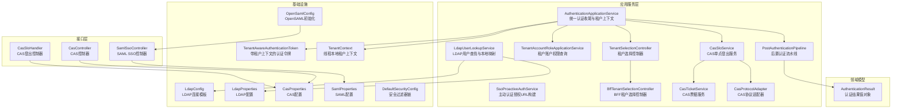

**图表来源**
- [AuthenticationApplicationService.java:24-138](file://iam-auth-server/src/main/java/iam/platform/auth/application/service/AuthenticationApplicationService.java#L24-L138)
- [LdapUserLookupService.java:22-86](file://iam-auth-server/src/main/java/iam/platform/auth/application/service/LdapUserLookupService.java#L22-L86)
- [SsoProactiveAuthService.java:22-89](file://iam-auth-server/src/main/java/iam/platform/auth/application/service/SsoProactiveAuthService.java#L22-L89)
- [TenantAccountRoleApplicationService.java:26-66](file://iam-auth-server/src/main/java/iam/platform/auth/application/service/TenantAccountRoleApplicationService.java#L26-L66)
- [PostAuthenticationPipeline.java:18-30](file://iam-auth-server/src/main/java/iam/platform/auth/application/service/pipeline/PostAuthenticationPipeline.java#L18-L30)
- [LdapConfig.java:12-38](file://iam-auth-server/src/main/java/iam/platform/auth/infrastructure/config/LdapConfig.java#L12-L38)
- [LdapProperties.java:10-33](file://iam-auth-server/src/main/java/iam/platform/auth/infrastructure/config/LdapProperties.java#L10-L33)
- [CasSloService.java:24-302](file://iam-auth-server/src/main/java/iam/platform/auth/application/service/CasSloService.java#L24-L302)
- [CasTicketService.java:22-127](file://iam-auth-server/src/main/java/iam/platform/auth/application/service/CasTicketService.java#L22-L127)
- [CasProtocolAdapter.java:17-80](file://iam-auth-server/src/main/java/iam/platform/auth/application/service/routing/CasProtocolAdapter.java#L17-L80)
- [SamlMetadataGenerator.java:23-128](file://iam-auth-server/src/main/java/iam/platform/auth/application/service/SamlMetadataGenerator.java#L23-L128)
- [SamlAssertionBuilder.java:21-115](file://iam-auth-server/src/main/java/iam/platform/auth/application/service/SamlAssertionBuilder.java#L21-L115)
- [ProtocolRouterImpl.java:20-52](file://iam-auth-server/src/main/java/iam/platform/auth/application/service/routing/ProtocolRouterImpl.java#L20-L52)
- [CasSloHandler.java:29-198](file://iam-auth-server/src/main/java/iam/platform/auth/interfaces/web/CasSloHandler.java#L29-L198)
- [CasController.java:34-170](file://iam-auth-server/src/main/java/iam/platform/auth/interfaces/web/CasController.java#L34-L170)
- [SamlSsoController.java:32-151](file://iam-auth-server/src/main/java/iam/platform/auth/interfaces/web/SamlSsoController.java#L32-L151)
- [CasProperties.java:13-45](file://iam-auth-server/src/main/java/iam/platform/auth/infrastructure/config/CasProperties.java#L13-L45)
- [SamlProperties.java:12-39](file://iam-auth-server/src/main/java/iam/platform/auth/infrastructure/config/SamlProperties.java#L12-L39)
- [OpenSamlConfig.java:14-29](file://iam-auth-server/src/main/java/iam/platform/auth/infrastructure/config/OpenSamlConfig.java#L14-L29)
- [TenantSelectionController.java:17-56](file://iam-auth-server/src/main/java/iam/platform/auth/interfaces/web/TenantSelectionController.java#L17-L56)
- [BffTenantSelectionController.java:14-39](file://iam-bff-server/src/main/java/iam/platform/bff/interfaces/web/BffTenantSelectionController.java#L14-L39)

**章节来源**
- [AuthenticationApplicationService.java:24-138](file://iam-auth-server/src/main/java/iam/platform/auth/application/service/AuthenticationApplicationService.java#L24-L138)
- [DefaultSecurityConfig.java:27-94](file://iam-auth-server/src/main/java/iam/platform/auth/infrastructure/config/DefaultSecurityConfig.java#L27-L94)

## 核心组件
- 统一认证应用服务：完成认证收尾、租户选择、权限装载、令牌封装与上下文注册。
- LDAP 用户查找服务：基于配置的搜索基与过滤器定位用户DN，按需创建本地Person。
- 主动认证服务：校验客户端配置，拼装授权URL（含PKCE与OIDC参数）。
- 租户账户角色应用服务：查询账户关联角色的资源权限，输出权限集合。
- **新增** CAS单点登出服务：实现会话跟踪、前后通道登出协调和会话失效机制，支持Redis降级存储。
- **新增** CAS票据服务：管理服务票据的生成、验证和分布式存储，支持TTL过期和降级机制。
- **新增** CAS协议适配器：根据保存的请求URL自动判断CAS协议类型并进行相应路由。
- **新增** BFF服务器租户选择控制器：提供前端友好的租户选择界面，支持用户友好的多租户切换体验。
- **更新** 简化的租户选择方法：selectTenant() 方法移除了未使用的 HttpServletRequest 参数，直接通过 TenantContext 获取当前用户信息。
- 后置认证流水线：可扩展的处理器链，按序执行审计、会签、租户解析等步骤。
- 安全上下文：TenantAwareAuthenticationToken与TenantContext，承载多租户认证状态。

**章节来源**
- [AuthenticationApplicationService.java:32-111](file://iam-auth-server/src/main/java/iam/platform/auth/application/service/AuthenticationApplicationService.java#L32-L111)
- [LdapUserLookupService.java:24-85](file://iam-auth-server/src/main/java/iam/platform/auth/application/service/LdapUserLookupService.java#L24-L85)
- [SsoProactiveAuthService.java:24-88](file://iam-auth-server/src/main/java/iam/platform/auth/application/service/SsoProactiveAuthService.java#L24-L88)
- [TenantAccountRoleApplicationService.java:28-56](file://iam-auth-server/src/main/java/iam/platform/auth/application/service/TenantAccountRoleApplicationService.java#L28-L56)
- [CasSloService.java:24-302](file://iam-auth-server/src/main/java/iam/platform/auth/application/service/CasSloService.java#L24-L302)
- [CasTicketService.java:22-127](file://iam-auth-server/src/main/java/iam/platform/auth/application/service/CasTicketService.java#L22-L127)
- [CasProtocolAdapter.java:17-80](file://iam-auth-server/src/main/java/iam/platform/auth/application/service/routing/CasProtocolAdapter.java#L17-L80)
- [TenantSelectionController.java:17-56](file://iam-auth-server/src/main/java/iam/platform/auth/interfaces/web/TenantSelectionController.java#L17-L56)
- [BffTenantSelectionController.java:14-39](file://iam-bff-server/src/main/java/iam/platform/bff/interfaces/web/BffTenantSelectionController.java#L14-L39)
- [PostAuthenticationPipeline.java:18-29](file://iam-auth-server/src/main/java/iam/platform/auth/application/service/pipeline/PostAuthenticationPipeline.java#L18-L29)
- [TenantAwareAuthenticationToken.java:11-131](file://iam-auth-server/src/main/java/iam/platform/auth/infrastructure/security/TenantAwareAuthenticationToken.java#L11-L131)
- [TenantContext.java:7-44](file://iam-auth-server/src/main/java/iam/platform/auth/infrastructure/security/TenantContext.java#L7-L44)

## 架构总览
认证请求通过统一过滤器进入，交由认证应用服务完成收尾与租户上下文建立，随后进入后置流水线执行审计、会话与租户解析等步骤。**新增**的CAS服务提供了企业级单点登出能力，**新增**的BFF服务器提供前端租户选择界面，**更新**的认证应用服务简化了租户选择方法签名。租户选择流程支持两种模式：自动租户解析和用户手动选择。

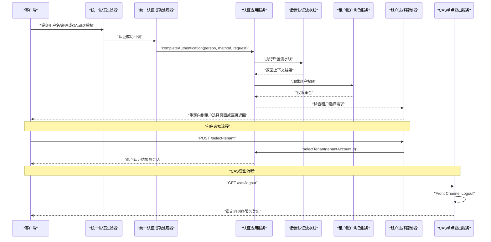

**图表来源**
- [DefaultSecurityConfig.java:66-79](file://iam-auth-server/src/main/java/iam/platform/auth/infrastructure/config/DefaultSecurityConfig.java#L66-L79)
- [AuthenticationApplicationService.java:42-45](file://iam-auth-server/src/main/java/iam/platform/auth/application/service/AuthenticationApplicationService.java#L42-L45)
- [PostAuthenticationPipeline.java:22-29](file://iam-auth-server/src/main/java/iam/platform/auth/application/service/pipeline/PostAuthenticationPipeline.java#L22-L29)
- [TenantAccountRoleApplicationService.java:35-47](file://iam-auth-server/src/main/java/iam/platform/auth/application/service/TenantAccountRoleApplicationService.java#L35-L47)
- [TenantSelectionController.java:46-55](file://iam-auth-server/src/main/java/iam/platform/auth/interfaces/web/TenantSelectionController.java#L46-L55)
- [CasSloHandler.java:42-66](file://iam-auth-server/src/main/java/iam/platform/auth/interfaces/web/CasSloHandler.java#L42-66)

## 详细组件分析

### 统一认证应用服务（AuthenticationApplicationService）
职责与流程
- 完成认证收尾：调用后置认证流水线，生成统一认证结果。
- 租户选择：根据用户选择的租户账户，加载权限、构建带租户上下文的认证令牌，更新TenantContext与HTTP会话。
- 可用租户查询：返回当前用户有效的租户账户列表。
- 结果封装：使用AuthenticationResult记录人员、方法、选中租户、可用租户与权限集合。

**更新** 简化后的租户选择方法签名
- 移除了未使用的 HttpServletRequest 参数，直接通过 TenantContext 获取当前用户信息
- 保持了完整的租户选择逻辑和权限加载功能

关键要点
- 使用TenantAwareAuthenticationToken携带租户ID、租户编码与权限集合。
- 通过TenantContext在请求生命周期内保存当前人员、租户与租户账户ID。
- 在HTTP会话中写入租户标识，便于后续请求识别。

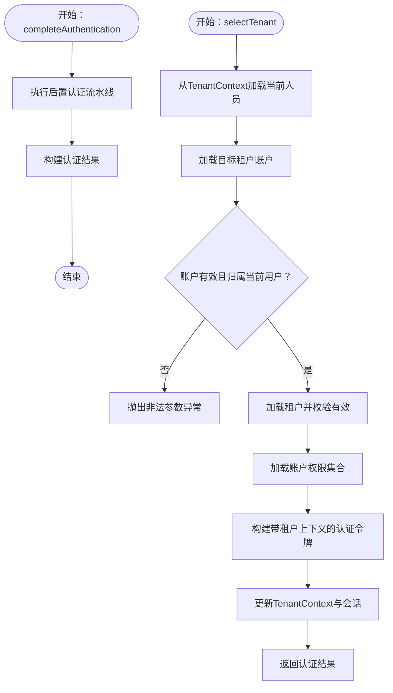

**图表来源**
- [AuthenticationApplicationService.java:42-111](file://iam-auth-server/src/main/java/iam/platform/auth/application/service/AuthenticationApplicationService.java#L42-L111)
- [TenantAwareAuthenticationToken.java:50-58](file://iam-auth-server/src/main/java/iam/platform/auth/infrastructure/security/TenantAwareAuthenticationToken.java#L50-L58)
- [TenantContext.java:19-42](file://iam-auth-server/src/main/java/iam/platform/auth/infrastructure/security/TenantContext.java#L19-L42)

**章节来源**
- [AuthenticationApplicationService.java:32-138](file://iam-auth-server/src/main/java/iam/platform/auth/application/service/AuthenticationApplicationService.java#L32-L138)
- [AuthenticationResult.java:14-55](file://iam-auth-server/src/main/java/iam/platform/auth/domain/model/valueobject/AuthenticationResult.java#L14-L55)

### LDAP 用户查找服务（LdapUserLookupService）
职责与机制
- 用户DN查找：基于配置的搜索基与过滤器，查询用户DN，用于后续绑定验证。
- 本地用户映射：若本地不存在对应用户名的Person，则按约定规则创建新Person，不存储明文密码。
- 配置驱动：通过LdapProperties与LdapConfig提供连接参数与连接池设置。

查询流程
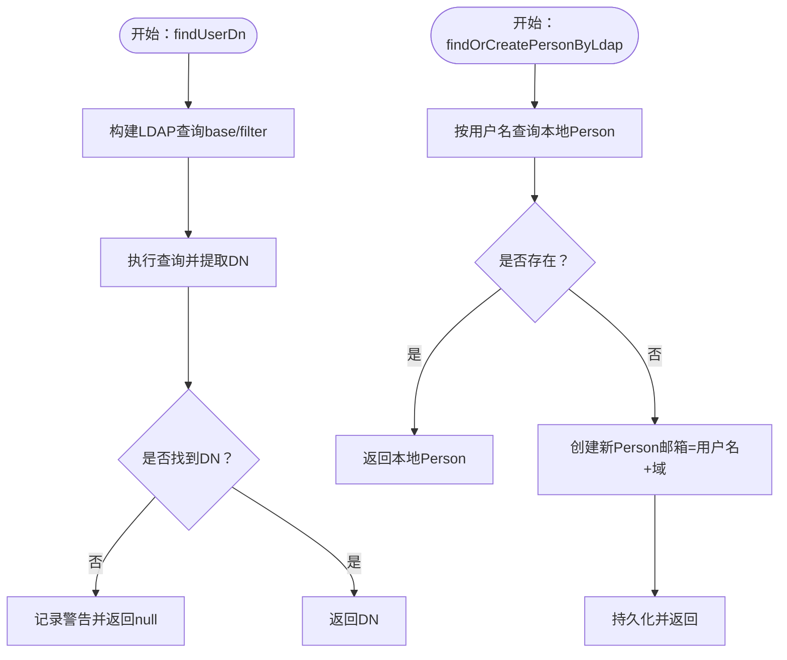

**图表来源**
- [LdapUserLookupService.java:31-85](file://iam-auth-server/src/main/java/iam/platform/auth/application/service/LdapUserLookupService.java#L31-L85)
- [LdapProperties.java:13-33](file://iam-auth-server/src/main/java/iam/platform/auth/infrastructure/config/LdapProperties.java#L13-L33)
- [LdapConfig.java:20-37](file://iam-auth-server/src/main/java/iam/platform/auth/infrastructure/config/LdapConfig.java#L20-L37)

**章节来源**
- [LdapUserLookupService.java:24-86](file://iam-auth-server/src/main/java/iam/platform/auth/application/service/LdapUserLookupService.java#L24-L86)
- [LdapProperties.java:13-33](file://iam-auth-server/src/main/java/iam/platform/auth/infrastructure/config/LdapProperties.java#L13-L33)
- [LdapConfig.java:12-38](file://iam-auth-server/src/main/java/iam/platform/auth/infrastructure/config/LdapConfig.java#L12-L38)

### 主动认证服务（SsoProactiveAuthService）
设计理念与场景
- 面向内部服务的"授权码推送"模式：无需用户交互，由服务端直接发起授权请求。
- 客户端校验：确保client_id存在且已注册重定向地址与作用域。
- 参数支持：state、nonce（OIDC）、PKCE（code_challenge/method），并进行URL编码。

流程图

**图表来源**
- [SsoProactiveAuthService.java:37-88](file://iam-auth-server/src/main/java/iam/platform/auth/application/service/SsoProactiveAuthService.java#L37-L88)

**章节来源**
- [SsoProactiveAuthService.java:22-89](file://iam-auth-server/src/main/java/iam/platform/auth/application/service/SsoProactiveAuthService.java#L22-L89)

### 租户账户角色应用服务（TenantAccountRoleApplicationService）
功能与实现
- 账户权限查询：根据租户账户ID查询角色映射，再聚合角色下的资源权限，最终返回权限集合。
- 权限代码集：提供仅权限码集合，便于鉴权决策。
- 读取型设计：仅提供认证流程所需的只读查询能力。

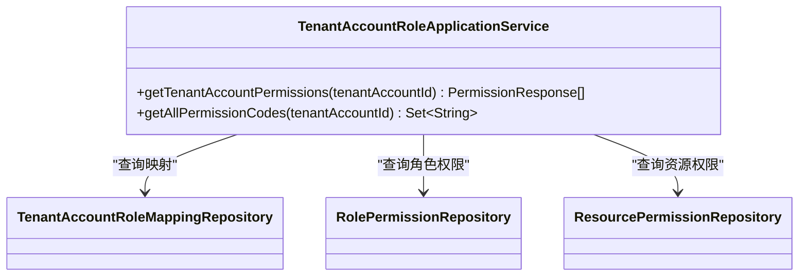

**图表来源**
- [TenantAccountRoleApplicationService.java:28-66](file://iam-auth-server/src/main/java/iam/platform/auth/application/service/TenantAccountRoleApplicationService.java#L28-L66)

**章节来源**
- [TenantAccountRoleApplicationService.java:26-66](file://iam-auth-server/src/main/java/iam/platform/auth/application/service/TenantAccountRoleApplicationService.java#L26-L66)

### 后置认证流水线与处理器
- 流水线：自动发现PostAuthHandler并按顺序执行，最终产出AuthenticationResult。
- 处理器接口：PostAuthHandler扩展Ordered，便于控制执行顺序。
- 上下文：PostAuthContext在流水线中传递Person、方法、请求、租户选择状态与权限等。

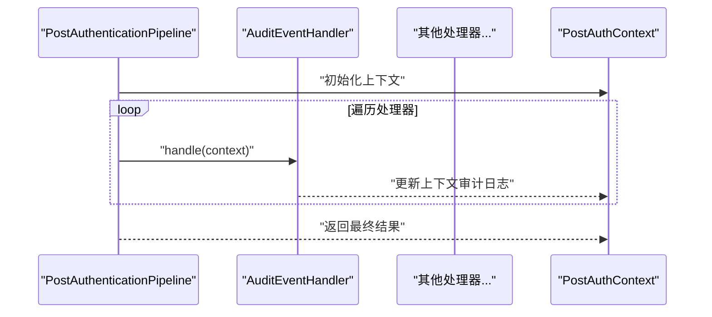

**图表来源**
- [PostAuthenticationPipeline.java:22-29](file://iam-auth-server/src/main/java/iam/platform/auth/application/service/pipeline/PostAuthenticationPipeline.java#L22-L29)
- [PostAuthHandler.java:9-11](file://iam-auth-server/src/main/java/iam/platform/auth/application/service/pipeline/PostAuthHandler.java#L9-L11)
- [PostAuthContext.java:20-36](file://iam-auth-server/src/main/java/iam/platform/auth/application/service/pipeline/PostAuthContext.java#L20-L36)
- [AuditEventHandler.java:15-41](file://iam-auth-server/src/main/java/iam/platform/auth/application/service/pipeline/AuditEventHandler.java#L15-L41)

**章节来源**
- [PostAuthenticationPipeline.java:18-30](file://iam-auth-server/src/main/java/iam/platform/auth/application/service/pipeline/PostAuthenticationPipeline.java#L18-L30)
- [PostAuthHandler.java:9-11](file://iam-auth-server/src/main/java/iam/platform/auth/application/service/pipeline/PostAuthHandler.java#L9-L11)
- [PostAuthContext.java:20-36](file://iam-auth-server/src/main/java/iam/platform/auth/application/service/pipeline/PostAuthContext.java#L20-L36)
- [AuditEventHandler.java:15-41](file://iam-auth-server/src/main/java/iam/platform/auth/application/service/pipeline/AuditEventHandler.java#L15-L41)

### 安全上下文与过滤器链
- TenantAwareAuthenticationToken：扩展标准Authentication，增加租户ID、租户编码与权限集合，并支持注册到SecurityContext与TenantContext。
- TenantContext：线程本地存储当前人员、租户与租户账户ID。
- DefaultSecurityConfig：替换默认表单登录过滤器为统一认证过滤器，添加租户感知过滤器，配置认证管理器与密码编码器。

**图表来源**
- [TenantAwareAuthenticationToken.java:50-131](file://iam-auth-server/src/main/java/iam/platform/auth/infrastructure/security/TenantAwareAuthenticationToken.java#L50-L131)
- [TenantContext.java:7-44](file://iam-auth-server/src/main/java/iam/platform/auth/infrastructure/security/TenantContext.java#L7-L44)
- [DefaultSecurityConfig.java:66-94](file://iam-auth-server/src/main/java/iam/platform/auth/infrastructure/config/DefaultSecurityConfig.java#L66-L94)

**章节来源**
- [TenantAwareAuthenticationToken.java:11-131](file://iam-auth-server/src/main/java/iam/platform/auth/infrastructure/security/TenantAwareAuthenticationToken.java#L11-L131)
- [TenantContext.java:7-44](file://iam-auth-server/src/main/java/iam/platform/auth/infrastructure/security/TenantContext.java#L7-L44)
- [DefaultSecurityConfig.java:27-94](file://iam-auth-server/src/main/java/iam/platform/auth/infrastructure/config/DefaultSecurityConfig.java#L27-L94)

### 租户选择控制器（TenantSelectionController）
**新增** 租户选择控制器提供了完整的租户选择功能，支持用户手动选择租户账户。

核心功能
- 租户列表展示：GET /select-tenant 显示用户可用的租户列表。
- 租户选择处理：POST /select-tenant 处理用户选择的租户账户。
- 错误处理：处理用户未认证、租户账户无效等情况。
- 重定向逻辑：选择成功后重定向到应用根路径。

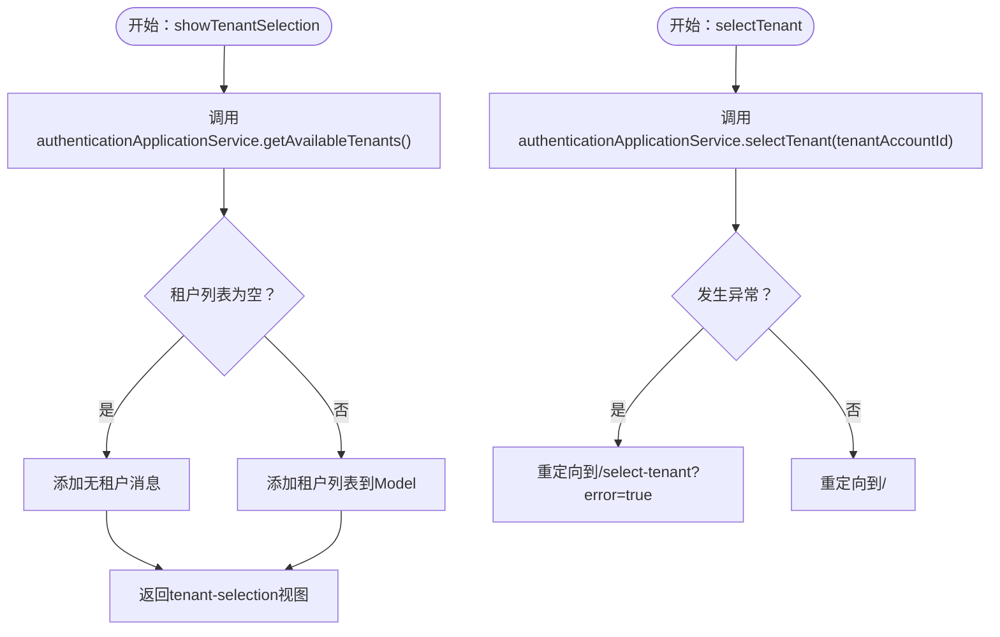

**图表来源**
- [TenantSelectionController.java:27-55](file://iam-auth-server/src/main/java/iam/platform/auth/interfaces/web/TenantSelectionController.java#L27-L55)

**章节来源**
- [TenantSelectionController.java:17-56](file://iam-auth-server/src/main/java/iam/platform/auth/interfaces/web/TenantSelectionController.java#L17-L56)

### BFF服务器租户选择控制器（BffTenantSelectionController）
**新增** BFF服务器中的租户选择控制器提供了前端友好的租户选择界面，支持用户友好的多租户切换体验。

核心功能
- 用户信息获取：根据userId获取用户详情和可用租户列表。
- 租户数据聚合：通过AdminDashboardAggregationService聚合用户租户信息。
- 视图渲染：渲染tenant-selection.html模板，提供用户友好的选择界面。
- 参数传递：支持userId参数，便于BFF服务器集成。

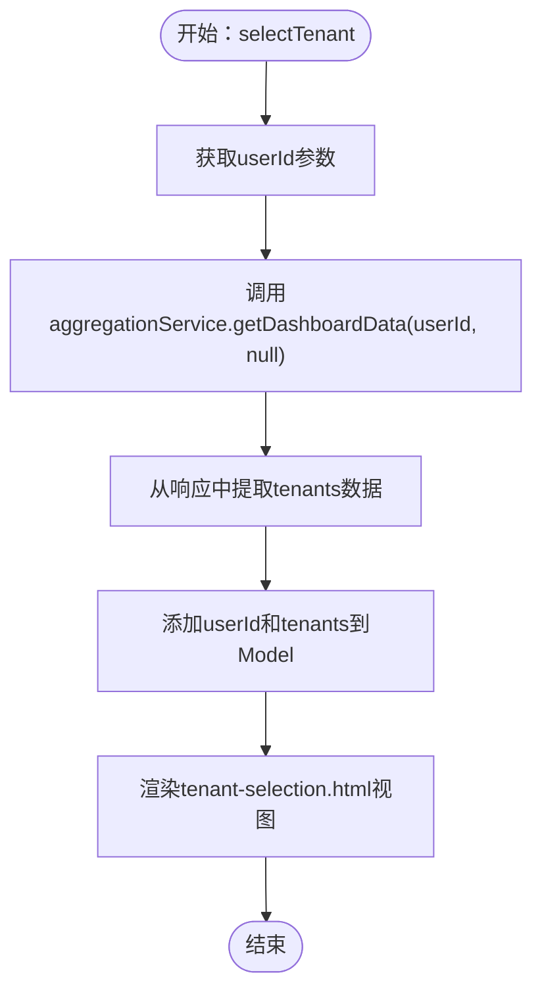

**图表来源**
- [BffTenantSelectionController.java:25-37](file://iam-bff-server/src/main/java/iam/platform/bff/interfaces/web/BffTenantSelectionController.java#L25-L37)

**章节来源**
- [BffTenantSelectionController.java:14-39](file://iam-bff-server/src/main/java/iam/platform/bff/interfaces/web/BffTenantSelectionController.java#L14-L39)

### CAS单点登出服务（CasSloService）
**新增** CAS单点登出服务实现了完整的CAS协议登出流程，支持前后通道登出协调和会话跟踪。

核心功能
- 会话跟踪：使用Redis存储会话-服务映射关系，支持降级到内存存储。
- 前后通道登出：支持服务端到服务端的Back Channel Logout和浏览器重定向的Front Channel Logout。
- 会话失效：清理会话关联的所有票据和服务注册信息。
- 登录状态管理：标记服务登出状态，协调多服务登出流程。

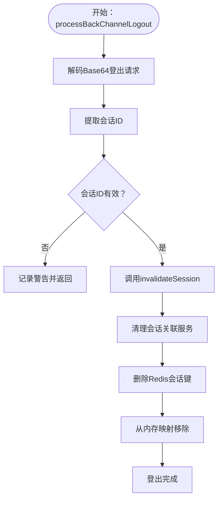

**图表来源**
- [CasSloService.java:97-119](file://iam-auth-server/src/main/java/iam/platform/auth/application/service/CasSloService.java#L97-L119)
- [CasSloService.java:252-278](file://iam-auth-server/src/main/java/iam/platform/auth/application/service/CasSloService.java#L252-L278)

**章节来源**
- [CasSloService.java:24-302](file://iam-auth-server/src/main/java/iam/platform/auth/application/service/CasSloService.java#L24-L302)
- [CasProperties.java:13-45](file://iam-auth-server/src/main/java/iam/platform/auth/infrastructure/config/CasProperties.java#L13-L45)

### CAS票据服务（CasTicketService）
**新增** CAS票据服务管理服务票据的生成、验证和分布式存储，支持Redis降级和TTL过期。

核心功能
- 票据生成：为认证结果生成唯一的服务票据，包含用户名、邮箱和昵称信息。
- 分布式存储：使用Redis存储票据数据，支持TTL过期和降级到内存存储。
- 票据验证：验证票据有效性并消费票据（一次性使用）。
- 用户信息提取：从票据数据中提取用户基本信息。

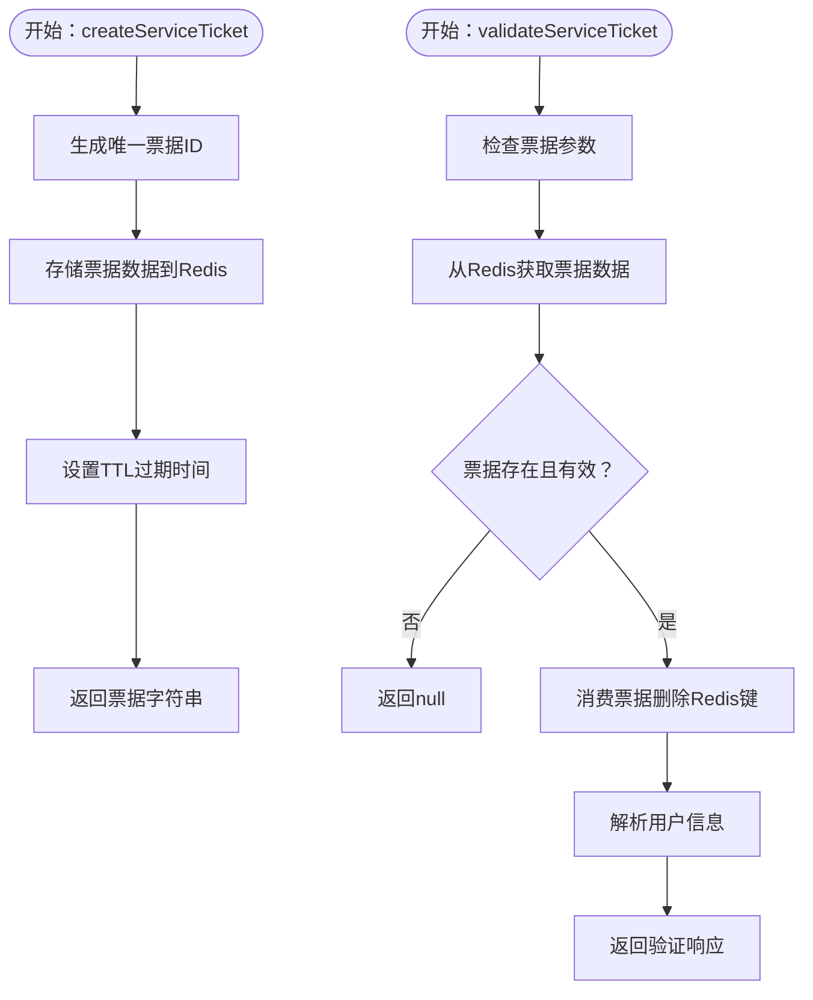

**图表来源**
- [CasTicketService.java:36-58](file://iam-auth-server/src/main/java/iam/platform/auth/application/service/CasTicketService.java#L36-L58)
- [CasTicketService.java:67-106](file://iam-auth-server/src/main/java/iam/platform/auth/application/service/CasTicketService.java#L67-L106)

**章节来源**
- [CasTicketService.java:22-127](file://iam-auth-server/src/main/java/iam/platform/auth/application/service/CasTicketService.java#L22-L127)
- [CasProperties.java:18-22](file://iam-auth-server/src/main/java/iam/platform/auth/infrastructure/config/CasProperties.java#L18-L22)

### CAS协议适配器（CasProtocolAdapter）
**新增** CAS协议适配器根据保存的请求URL自动判断CAS协议类型并进行相应路由。

核心功能
- 协议匹配：检查请求URI是否包含"/cas/"来识别CAS协议。
- 服务URL提取：从保存的请求URL中提取服务参数或使用保存的URL。
- 票据生成：为认证结果生成CAS服务票据并返回路由结果。

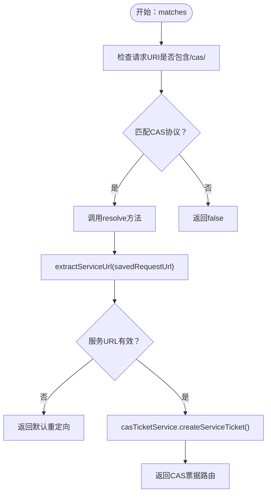

**图表来源**
- [CasProtocolAdapter.java:22-25](file://iam-auth-server/src/main/java/iam/platform/auth/application/service/routing/CasProtocolAdapter.java#L22-L25)
- [CasProtocolAdapter.java:56-78](file://iam-auth-server/src/main/java/iam/platform/auth/application/service/routing/CasProtocolAdapter.java#L56-L78)

**章节来源**
- [CasProtocolAdapter.java:17-80](file://iam-auth-server/src/main/java/iam/platform/auth/application/service/routing/CasProtocolAdapter.java#L17-L80)

### CAS控制器（CasController）
**新增** CAS控制器处理CAS登录、服务票据验证和登出流程。

核心功能
- 登录页面：显示CAS登录表单，支持service、renew、gateway参数。
- 登录处理：验证用户凭据，生成认证结果并创建服务票据。
- 票据验证：验证服务票据并返回CAS 3.0兼容的XML响应。
- 健康检查：提供CAS协议健康检查端点。

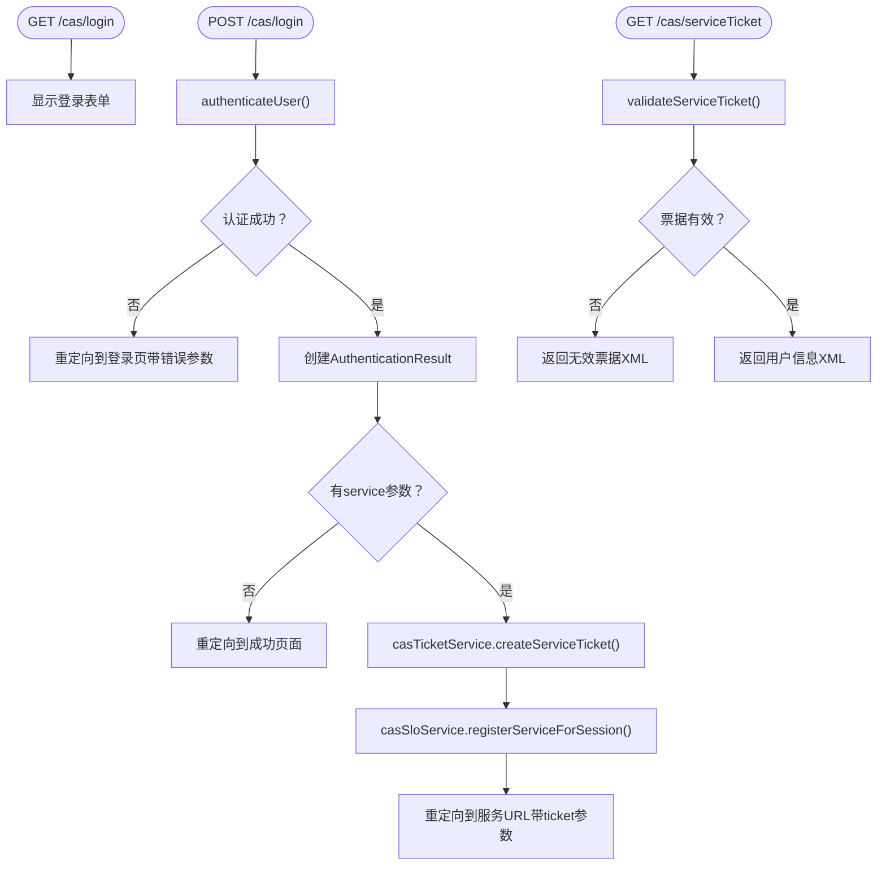

**图表来源**
- [CasController.java:44-56](file://iam-auth-server/src/main/java/iam/platform/auth/interfaces/web/CasController.java#L44-L56)
- [CasController.java:61-107](file://iam-auth-server/src/main/java/iam/platform/auth/interfaces/web/CasController.java#L61-L107)
- [CasController.java:114-149](file://iam-auth-server/src/main/java/iam/platform/auth/interfaces/web/CasController.java#L114-L149)

**章节来源**
- [CasController.java:34-170](file://iam-auth-server/src/main/java/iam/platform/auth/interfaces/web/CasController.java#L34-L170)

### CAS登出控制器（CasSloHandler）
**新增** CAS协议登出控制器，处理前端和后端登出请求。

核心功能
- 前端登出：GET /cas/logout，启动Front Channel登出流程。
- 后端登出：POST /cas/logout/backChannel，处理Back Channel登出请求。
- 回调处理：GET /cas/logout/frontChannel，处理服务登出回调。
- 登出响应：GET /cas/logoutResponse，接收服务登出响应。

**章节来源**
- [CasSloHandler.java:29-198](file://iam-auth-server/src/main/java/iam/platform/auth/interfaces/web/CasSloHandler.java#L29-L198)

### 后置认证流水线与处理器
- 流水线：自动发现PostAuthHandler并按顺序执行，最终产出AuthenticationResult。
- 处理器接口：PostAuthHandler扩展Ordered，便于控制执行顺序。
- 上下文：PostAuthContext在流水线中传递Person、方法、请求、租户选择状态与权限等。

**图表来源**
- [PostAuthenticationPipeline.java:22-29](file://iam-auth-server/src/main/java/iam/platform/auth/application/service/pipeline/PostAuthenticationPipeline.java#L22-L29)
- [PostAuthHandler.java:9-11](file://iam-auth-server/src/main/java/iam/platform/auth/application/service/pipeline/PostAuthHandler.java#L9-L11)
- [PostAuthContext.java:20-36](file://iam-auth-server/src/main/java/iam/platform/auth/application/service/pipeline/PostAuthContext.java#L20-L36)
- [AuditEventHandler.java:15-41](file://iam-auth-server/src/main/java/iam/platform/auth/application/service/pipeline/AuditEventHandler.java#L15-L41)

**章节来源**
- [PostAuthenticationPipeline.java:18-30](file://iam-auth-server/src/main/java/iam/platform/auth/application/service/pipeline/PostAuthenticationPipeline.java#L18-L30)
- [PostAuthHandler.java:9-11](file://iam-auth-server/src/main/java/iam/platform/auth/application/service/pipeline/PostAuthHandler.java#L9-L11)
- [PostAuthContext.java:20-36](file://iam-auth-server/src/main/java/iam/platform/auth/application/service/pipeline/PostAuthContext.java#L20-L36)
- [AuditEventHandler.java:15-41](file://iam-auth-server/src/main/java/iam/platform/auth/application/service/pipeline/AuditEventHandler.java#L15-L41)

### 安全上下文与过滤器链
- TenantAwareAuthenticationToken：扩展标准Authentication，增加租户ID、租户编码与权限集合，并支持注册到SecurityContext与TenantContext。
- TenantContext：线程本地存储当前人员、租户与租户账户ID。
- DefaultSecurityConfig：替换默认表单登录过滤器为统一认证过滤器，添加租户感知过滤器，配置认证管理器与密码编码器。

**图表来源**
- [TenantAwareAuthenticationToken.java:50-131](file://iam-auth-server/src/main/java/iam/platform/auth/infrastructure/security/TenantAwareAuthenticationToken.java#L50-L131)
- [TenantContext.java:7-44](file://iam-auth-server/src/main/java/iam/platform/auth/infrastructure/security/TenantContext.java#L7-L44)
- [DefaultSecurityConfig.java:66-94](file://iam-auth-server/src/main/java/iam/platform/auth/infrastructure/config/DefaultSecurityConfig.java#L66-L94)

**章节来源**
- [TenantAwareAuthenticationToken.java:11-131](file://iam-auth-server/src/main/java/iam/platform/auth/infrastructure/security/TenantAwareAuthenticationToken.java#L11-L131)
- [TenantContext.java:7-44](file://iam-auth-server/src/main/java/iam/platform/auth/infrastructure/security/TenantContext.java#L7-L44)
- [DefaultSecurityConfig.java:27-94](file://iam-auth-server/src/main/java/iam/platform/auth/infrastructure/config/DefaultSecurityConfig.java#L27-L94)

### SAML元数据生成器（SamlMetadataGenerator）
**新增** 基于OpenSAML库的SAML 2.0 IdP元数据生成器，遵循SAML 2.0规范生成标准元数据XML。

核心功能
- 元数据生成：创建EntityDescriptor和IDPSSODescriptor节点。
- 协议支持：配置多种绑定方式（HTTP-Redirect、HTTP-POST）。
- 名称ID格式：支持emailAddress、persistent、transient格式。
- 签名配置：支持断言签名配置（待证书实现）。

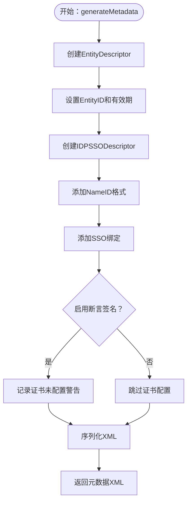

**图表来源**
- [SamlMetadataGenerator.java:40-101](file://iam-auth-server/src/main/java/iam/platform/auth/application/service/SamlMetadataGenerator.java#L40-L101)

**章节来源**
- [SamlMetadataGenerator.java:23-128](file://iam-auth-server/src/main/java/iam/platform/auth/application/service/SamlMetadataGenerator.java#L23-L128)
- [SamlProperties.java:12-39](file://iam-auth-server/src/main/java/iam/platform/auth/infrastructure/config/SamlProperties.java#L12-L39)
- [OpenSamlConfig.java:14-29](file://iam-auth-server/src/main/java/iam/platform/auth/infrastructure/config/OpenSamlConfig.java#L14-L29)

### 协议路由机制（ProtocolRouterImpl）
**新增** 智能协议路由机制，根据保存的请求URL自动判断源协议类型并进行相应路由。

核心功能
- 保存请求检测：通过HttpSessionRequestCache获取原始请求URL。
- 租户选择判断：检查认证结果是否需要租户选择。
- 协议适配器匹配：遍历ProtocolAdapter列表匹配请求。
- 默认路由回退：找不到匹配适配器时使用默认重定向。

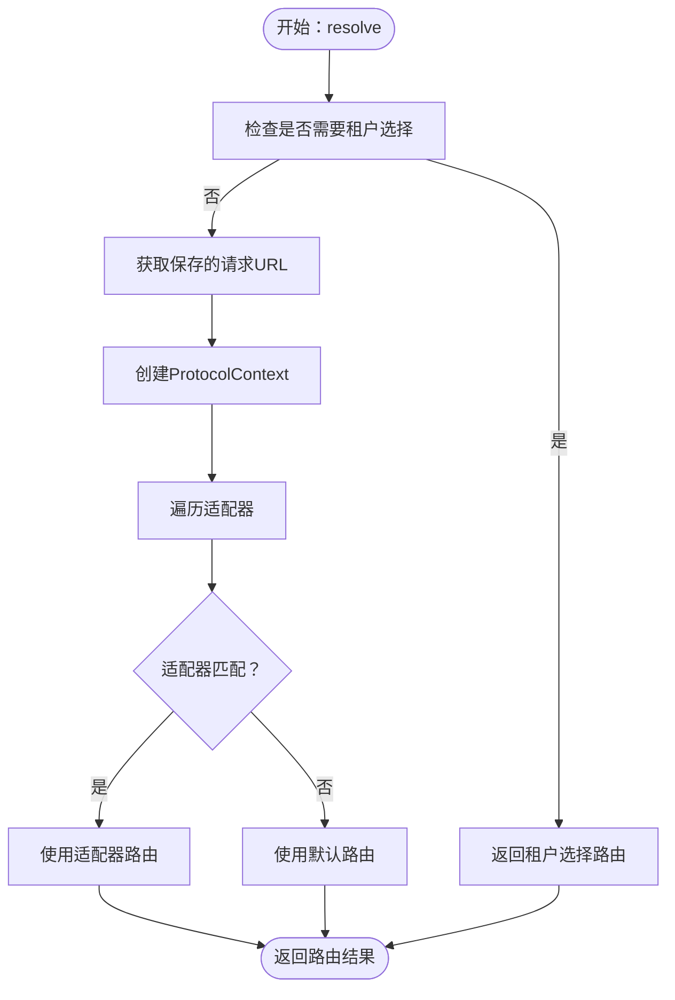

**图表来源**
- [ProtocolRouterImpl.java:24-50](file://iam-auth-server/src/main/java/iam/platform/auth/application/service/routing/ProtocolRouterImpl.java#L24-L50)

**章节来源**
- [ProtocolRouterImpl.java:20-52](file://iam-auth-server/src/main/java/iam/platform/auth/application/service/routing/ProtocolRouterImpl.java#L20-L52)

### SAML断言构建服务（SamlAssertionBuilder）
**新增** SAML 2.0断言构建服务，基于认证结果生成符合规范的XML断言。

核心功能
- 断言生成：创建完整的SAML Response和Assertion结构。
- 属性声明：包含email和nickname等用户属性。
- 时间戳管理：设置IssueInstant、NotBefore、NotOnOrAfter等时间戳。
- NameID解析：优先使用邮箱地址，否则使用用户名。

**章节来源**
- [SamlAssertionBuilder.java:21-115](file://iam-auth-server/src/main/java/iam/platform/auth/application/service/SamlAssertionBuilder.java#L21-L115)

### SAML SSO控制器（SamlSsoController）
**新增** SAML 2.0 SSO控制器，处理SAML认证请求和元数据生成。

核心功能
- 登录页面：GET /saml/sso，显示SAML登录页面。
- 认证处理：POST /saml/sso，验证用户并生成SAML断言。
- 元数据服务：GET /saml/metadata，提供IdP元数据XML。
- 自动提交表单：生成HTML表单自动提交SAML Response到SP。

**章节来源**
- [SamlSsoController.java:32-151](file://iam-auth-server/src/main/java/iam/platform/auth/interfaces/web/SamlSsoController.java#L32-L151)

## 依赖分析
- 认证应用服务依赖后置流水线、租户账户仓库、人员仓库、租户仓库与租户账户角色应用服务。
- LDAP服务依赖LdapTemplate、Person仓库与LdapProperties。
- 主动认证服务依赖RegisteredClientRepository与安全配置。
- **新增** CAS单点登出服务依赖StringRedisTemplate、CasProperties和会话管理。
- **新增** CAS票据服务依赖StringRedisTemplate、CasProperties和分布式存储。
- **新增** CAS协议适配器依赖CasTicketService和认证结果。
- **新增** BFF服务器租户选择控制器依赖AdminDashboardAggregationService。
- **更新** 简化的租户选择方法移除了HttpServletRequest依赖，直接通过TenantContext获取用户信息。
- 安全上下文贯穿认证流程，作为多租户状态载体。

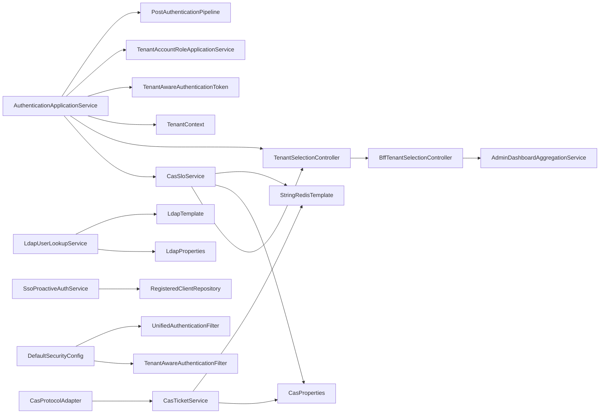

**图表来源**
- [AuthenticationApplicationService.java:32-36](file://iam-auth-server/src/main/java/iam/platform/auth/application/service/AuthenticationApplicationService.java#L32-L36)
- [LdapUserLookupService.java:24-26](file://iam-auth-server/src/main/java/iam/platform/auth/application/service/LdapUserLookupService.java#L24-L26)
- [SsoProactiveAuthService.java:24-25](file://iam-auth-server/src/main/java/iam/platform/auth/application/service/SsoProactiveAuthService.java#L24-L25)
- [CasSloService.java:26-27](file://iam-auth-server/src/main/java/iam/platform/auth/application/service/CasSloService.java#L26-L27)
- [CasTicketService.java:24-25](file://iam-auth-server/src/main/java/iam/platform/auth/application/service/CasTicketService.java#L24-L25)
- [CasProtocolAdapter.java:19](file://iam-auth-server/src/main/java/iam/platform/auth/application/service/routing/CasProtocolAdapter.java#L19)
- [TenantSelectionController.java:20](file://iam-auth-server/src/main/java/iam/platform/auth/interfaces/web/TenantSelectionController.java#L20)
- [BffTenantSelectionController.java:23](file://iam-bff-server/src/main/java/iam/platform/bff/interfaces/web/BffTenantSelectionController.java#L23)
- [DefaultSecurityConfig.java:35-62](file://iam-auth-server/src/main/java/iam/platform/auth/infrastructure/config/DefaultSecurityConfig.java#L35-L62)

**章节来源**
- [AuthenticationApplicationService.java:32-36](file://iam-auth-server/src/main/java/iam/platform/auth/application/service/AuthenticationApplicationService.java#L32-L36)
- [LdapUserLookupService.java:24-26](file://iam-auth-server/src/main/java/iam/platform/auth/application/service/LdapUserLookupService.java#L24-L26)
- [SsoProactiveAuthService.java:24-25](file://iam-auth-server/src/main/java/iam/platform/auth/application/service/SsoProactiveAuthService.java#L24-L25)
- [CasSloService.java:26-27](file://iam-auth-server/src/main/java/iam/platform/auth/application/service/CasSloService.java#L26-L27)
- [CasTicketService.java:24-25](file://iam-auth-server/src/main/java/iam/platform/auth/application/service/CasTicketService.java#L24-L25)
- [CasProtocolAdapter.java:19](file://iam-auth-server/src/main/java/iam/platform/auth/application/service/routing/CasProtocolAdapter.java#L19)
- [TenantSelectionController.java:20](file://iam-auth-server/src/main/java/iam/platform/auth/interfaces/web/TenantSelectionController.java#L20)
- [BffTenantSelectionController.java:23](file://iam-bff-server/src/main/java/iam/platform/bff/interfaces/web/BffTenantSelectionController.java#L23)
- [DefaultSecurityConfig.java:35-62](file://iam-auth-server/src/main/java/iam/platform/auth/infrastructure/config/DefaultSecurityConfig.java#L35-L62)

## 性能考虑
- LDAP查询优化
  - 使用精确的搜索基与过滤器，避免宽泛查询。
  - 启用连接池（LdapConfig中基于配置的池参数），合理设置最大活跃数与空闲数。
  - 对常用用户属性进行索引，减少查询时间。
- 权限加载
  - 租户账户权限查询采用分步聚合（映射→角色权限→资源权限），建议对映射与角色权限表建立必要索引。
  - 按需加载权限，避免一次性拉取过多数据。
- 会话与上下文
  - 仅在需要时写入会话属性，减少会话膨胀。
  - 使用线程本地上下文（TenantContext）降低跨层传递成本。
- **新增** CAS服务性能优化
  - 使用Redis存储会话-服务映射和票据数据，支持TTL过期和降级机制。
  - 前后通道登出采用异步处理，避免阻塞主请求线程。
  - 会话跟踪使用分布式缓存，支持水平扩展。
- **新增** BFF服务器性能
  - 租户选择界面采用Thymeleaf模板，支持客户端JavaScript增强。
  - 数据聚合通过AdminDashboardAggregationService统一处理，避免重复查询。
- **更新** 简化方法签名的性能影响
  - 移除HttpServletRequest参数减少了方法调用开销。
  - 直接通过TenantContext获取用户信息，避免了请求参数解析。

## 故障排查指南
- LDAP用户未找到
  - 现象：findUserDn返回null并记录警告。
  - 排查：检查LdapProperties中的urls、baseDn、userSearchBase与userSearchFilter配置是否正确。
  - 参考路径：[LdapUserLookupService.java:31-58](file://iam-auth-server/src/main/java/iam/platform/auth/application/service/LdapUserLookupService.java#L31-L58)、[LdapProperties.java:15-24](file://iam-auth-server/src/main/java/iam/platform/auth/infrastructure/config/LdapProperties.java#L15-L24)
- 租户账户无效或不属于当前用户
  - 现象：selectTenant抛出非法参数或状态异常。
  - 排查：确认租户账户ID存在、账户处于激活状态、且属于当前登录人员。
  - 参考路径：[AuthenticationApplicationService.java:51-75](file://iam-auth-server/src/main/java/iam/platform/auth/application/service/AuthenticationApplicationService.java#L51-L75)
- 客户端未注册或缺少重定向URI
  - 现象：buildAuthorizationUrl抛出非法参数异常。
  - 排查：确认RegisteredClient已注册至少一个重定向URI与作用域。
  - 参考路径：[SsoProactiveAuthService.java:44-55](file://iam-auth-server/src/main/java/iam/platform/auth/application/service/SsoProactiveAuthService.java#L44-L55)
- 认证成功但无租户账户
  - 现象：返回noTenantAccounts结果。
  - 处理：引导用户完成租户账户创建或加入流程。
  - 参考路径：[AuthenticationResult.java:50-54](file://iam-auth-server/src/main/java/iam/platform/auth/domain/model/valueobject/AuthenticationResult.java#L50-L54)
- **新增** CAS票据验证失败
  - 现象：validateServiceTicket返回null或记录警告。
  - 排查：检查Redis连接状态、票据TTL设置和票据数据格式。
  - 参考路径：[CasTicketService.java:67-106](file://iam-auth-server/src/main/java/iam/platform/auth/application/service/CasTicketService.java#L67-L106)
- **新增** CAS登出流程异常
  - 现象：Front Channel Logout无法正确重定向到各服务。
  - 排查：检查Redis会话存储、服务注册状态和回调处理逻辑。
  - 参考路径：[CasSloHandler.java:42-66](file://iam-auth-server/src/main/java/iam/platform/auth/interfaces/web/CasSloHandler.java#L42-L66)、[CasSloService.java:167-201](file://iam-auth-server/src/main/java/iam/platform/auth/application/service/CasSloService.java#L167-L201)
- **新增** CAS协议适配器匹配失败
  - 现象：协议路由无法识别CAS请求。
  - 排查：确认请求URI包含"/cas/"、保存的请求URL格式正确。
  - 参考路径：[CasProtocolAdapter.java:22-25](file://iam-auth-server/src/main/java/iam/platform/auth/application/service/routing/CasProtocolAdapter.java#L22-L25)
- **新增** BFF服务器租户选择问题
  - 现象：BffTenantSelectionController无法获取用户租户信息。
  - 排查：检查AdminDashboardAggregationService的API调用状态和userId参数传递。
  - 参考路径：[BffTenantSelectionController.java:25-37](file://iam-bff-server/src/main/java/iam/platform/bff/interfaces/web/BffTenantSelectionController.java#L25-L37)
- **新增** 租户选择控制器错误
  - 现象：TenantSelectionController重定向到错误页面。
  - 排查：检查租户选择表单参数、用户认证状态和异常处理逻辑。
  - 参考路径：[TenantSelectionController.java:46-55](file://iam-auth-server/src/main/java/iam/platform/auth/interfaces/web/TenantSelectionController.java#L46-L55)

**章节来源**
- [LdapUserLookupService.java:31-58](file://iam-auth-server/src/main/java/iam/platform/auth/application/service/LdapUserLookupService.java#L31-L58)
- [LdapProperties.java:15-24](file://iam-auth-server/src/main/java/iam/platform/auth/infrastructure/config/LdapProperties.java#L15-L24)
- [AuthenticationApplicationService.java:51-75](file://iam-auth-server/src/main/java/iam/platform/auth/application/service/AuthenticationApplicationService.java#L51-L75)
- [SsoProactiveAuthService.java:44-55](file://iam-auth-server/src/main/java/iam/platform/auth/application/service/SsoProactiveAuthService.java#L44-L55)
- [AuthenticationResult.java:50-54](file://iam-auth-server/src/main/java/iam/platform/auth/domain/model/valueobject/AuthenticationResult.java#L50-L54)
- [CasTicketService.java:67-106](file://iam-auth-server/src/main/java/iam/platform/auth/application/service/CasTicketService.java#L67-L106)
- [CasSloHandler.java:42-66](file://iam-auth-server/src/main/java/iam/platform/auth/interfaces/web/CasSloHandler.java#L42-L66)
- [CasSloService.java:167-201](file://iam-auth-server/src/main/java/iam/platform/auth/application/service/CasSloService.java#L167-L201)
- [CasProtocolAdapter.java:22-25](file://iam-auth-server/src/main/java/iam/platform/auth/application/service/routing/CasProtocolAdapter.java#L22-L25)
- [BffTenantSelectionController.java:25-37](file://iam-bff-server/src/main/java/iam/platform/bff/interfaces/web/BffTenantSelectionController.java#L25-L37)
- [TenantSelectionController.java:46-55](file://iam-auth-server/src/main/java/iam/platform/auth/interfaces/web/TenantSelectionController.java#L46-L55)

## 结论
本认证应用服务通过统一的认证收尾与租户上下文建立，结合可扩展的后置流水线、LDAP目录集成与权限读取能力，实现了多租户、多协议的统一认证体验。**新增**的CAS单点登出服务提供了企业级的单点登出能力，支持前后通道登出协调和会话跟踪，**新增**的CAS票据服务实现了服务票据的分布式存储和验证，**新增**的CAS协议适配器提供了智能协议路由功能。**新增**的BFF服务器租户选择控制器提供了用户友好的多租户切换界面，**更新**的认证应用服务简化了租户选择方法签名，移除了未使用的HttpServletRequest参数，提升了API简洁性和易用性。整体设计强调职责分离、配置驱动与可扩展性，便于在生产环境中进行安全加固与性能优化。

## 附录
- 使用与配置示例（以路径代替具体代码）
  - 统一认证收尾调用：参考 [AuthenticationApplicationService.completeAuthentication:42-45](file://iam-auth-server/src/main/java/iam/platform/auth/application/service/AuthenticationApplicationService.java#L42-L45)
  - 简化后的租户选择调用：参考 [AuthenticationApplicationService.selectTenant:51-111](file://iam-auth-server/src/main/java/iam/platform/auth/application/service/AuthenticationApplicationService.java#L51-L111)
  - 可用租户查询：参考 [AuthenticationApplicationService.getAvailableTenants:117-127](file://iam-auth-server/src/main/java/iam/platform/auth/application/service/AuthenticationApplicationService.java#L117-L127)
  - LDAP用户查找：参考 [LdapUserLookupService.findUserDn:31-58](file://iam-auth-server/src/main/java/iam/platform/auth/application/service/LdapUserLookupService.java#L31-L58)、[LdapUserLookupService.findOrCreatePersonByLdap:63-85](file://iam-auth-server/src/main/java/iam/platform/auth/application/service/LdapUserLookupService.java#L63-L85)
  - 主动认证授权URL构建：参考 [SsoProactiveAuthService.buildAuthorizationUrl:37-88](file://iam-auth-server/src/main/java/iam/platform/auth/application/service/SsoProactiveAuthService.java#L37-L88)
  - 租户账户权限查询：参考 [TenantAccountRoleApplicationService.getTenantAccountPermissions:35-47](file://iam-auth-server/src/main/java/iam/platform/auth/application/service/TenantAccountRoleApplicationService.java#L35-L47)、[TenantAccountRoleApplicationService.getAllPermissionCodes:52-56](file://iam-auth-server/src/main/java/iam/platform/auth/application/service/TenantAccountRoleApplicationService.java#L52-L56)
  - **新增** CAS单点登出服务：参考 [CasSloService.registerServiceForSession:42-55](file://iam-auth-server/src/main/java/iam/platform/auth/application/service/CasSloService.java#L42-L55)、[CasSloService.processBackChannelLogout:97-119](file://iam-auth-server/src/main/java/iam/platform/auth/application/service/CasSloService.java#L97-L119)
  - **新增** CAS票据服务：参考 [CasTicketService.createServiceTicket:36-58](file://iam-auth-server/src/main/java/iam/platform/auth/application/service/CasTicketService.java#L36-L58)、[CasTicketService.validateServiceTicket:67-106](file://iam-auth-server/src/main/java/iam/platform/auth/application/service/CasTicketService.java#L67-L106)
  - **新增** CAS协议适配器：参考 [CasProtocolAdapter.matches:22-25](file://iam-auth-server/src/main/java/iam/platform/auth/application/service/routing/CasProtocolAdapter.java#L22-L25)、[CasProtocolAdapter.resolve:28-50](file://iam-auth-server/src/main/java/iam/platform/auth/application/service/routing/CasProtocolAdapter.java#L28-L50)
  - **新增** CAS控制器：参考 [CasController.casLoginPage:44-56](file://iam-auth-server/src/main/java/iam/platform/auth/interfaces/web/CasController.java#L44-L56)、[CasController.processCasLogin:61-107](file://iam-auth-server/src/main/java/iam/platform/auth/interfaces/web/CasController.java#L61-L107)
  - **新增** CAS登出控制器：参考 [CasSloHandler.initiateLogout:42-66](file://iam-auth-server/src/main/java/iam/platform/auth/interfaces/web/CasSloHandler.java#L42-L66)
  - **新增** BFF服务器租户选择控制器：参考 [BffTenantSelectionController.selectTenant:25-37](file://iam-bff-server/src/main/java/iam/platform/bff/interfaces/web/BffTenantSelectionController.java#L25-L37)
  - **新增** 租户选择控制器：参考 [TenantSelectionController.showTenantSelection:27-44](file://iam-auth-server/src/main/java/iam/platform/auth/interfaces/web/TenantSelectionController.java#L27-L44)、[TenantSelectionController.selectTenant:46-55](file://iam-auth-server/src/main/java/iam/platform/auth/interfaces/web/TenantSelectionController.java#L46-L55)
  - 安全过滤器链与认证管理器：参考 [DefaultSecurityConfig.defaultSecurityFilterChain:37-62](file://iam-auth-server/src/main/java/iam/platform/auth/infrastructure/config/DefaultSecurityConfig.java#L37-L62)、[DefaultSecurityConfig.authenticationManager:82-88](file://iam-auth-server/src/main/java/iam/platform/auth/infrastructure/config/DefaultSecurityConfig.java#L82-L88)
  - 内部认证API说明：参考 [AuthenticationController:7-38](file://iam-auth-server/src/main/java/iam/platform/auth/interfaces/rest/AuthenticationController.java#L7-L38)
  - **新增** SAML元数据生成：参考 [SamlMetadataGenerator.generateMetadata:40-101](file://iam-auth-server/src/main/java/iam/platform/auth/application/service/SamlMetadataGenerator.java#L40-L101)
  - **新增** 协议路由机制：参考 [ProtocolRouterImpl.resolve:24-50](file://iam-auth-server/src/main/java/iam/platform/auth/application/service/routing/ProtocolRouterImpl.java#L24-L50)
  - **新增** SAML SSO控制器：参考 [SamlSsoController.samlMetadata:98-103](file://iam-auth-server/src/main/java/iam/platform/auth/interfaces/web/SamlSsoController.java#L98-L103)