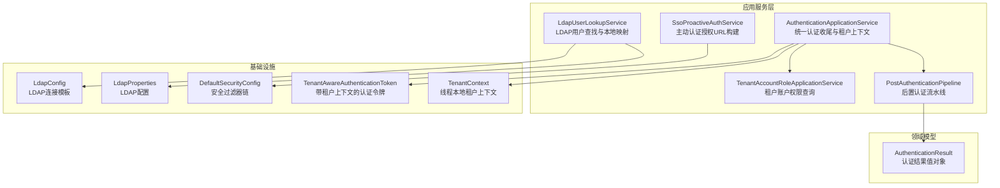
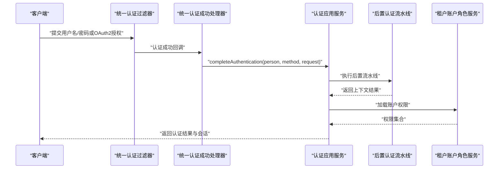
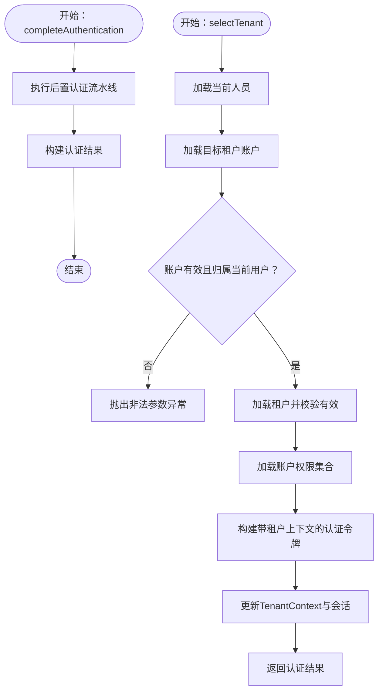
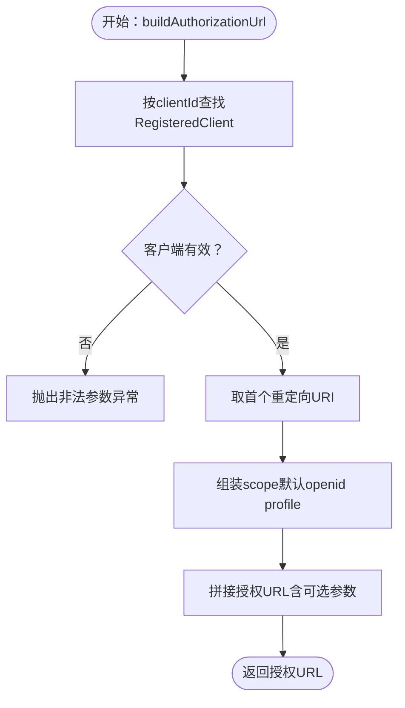
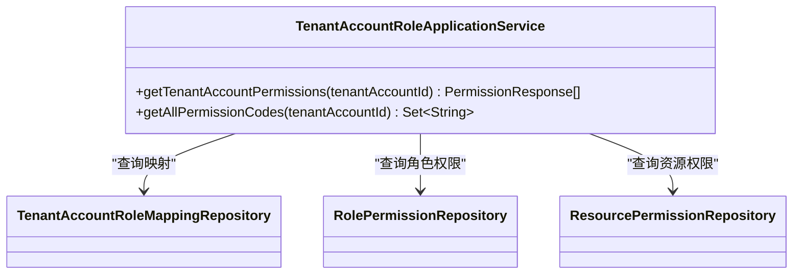
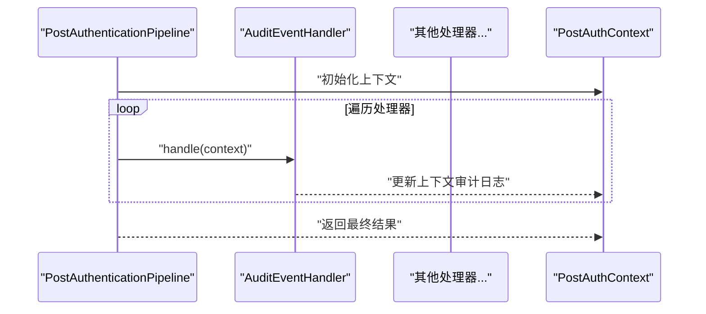
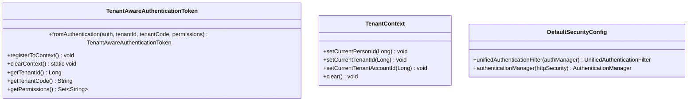
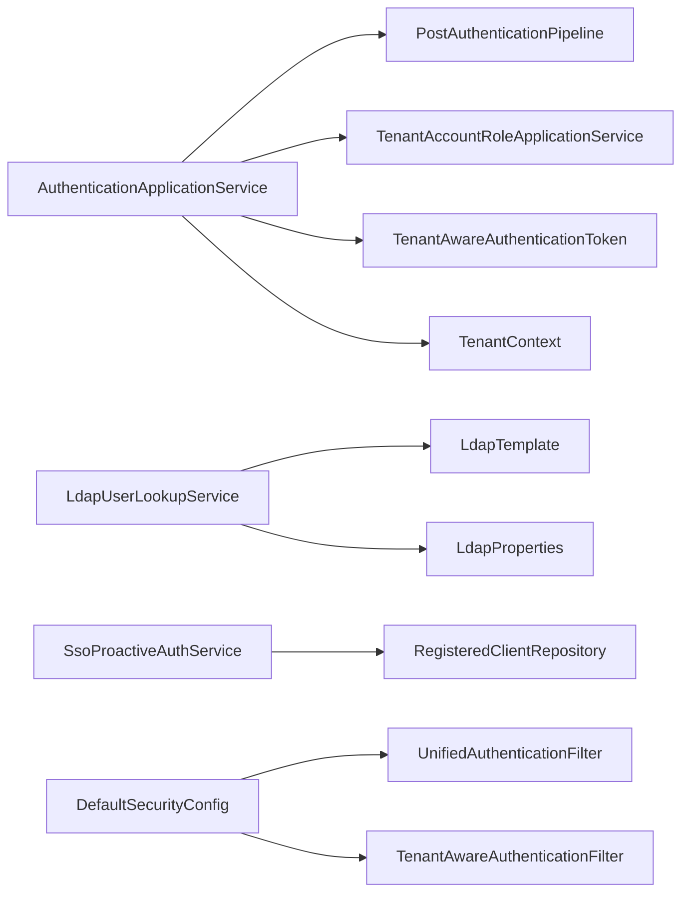

# 认证应用服务

<cite>
**本文引用的文件**
- [AuthenticationApplicationService.java](file://iam-auth-server/src/main/java/iam/platform/auth/application/service/AuthenticationApplicationService.java)
- [LdapUserLookupService.java](file://iam-auth-server/src/main/java/iam/platform/auth/application/service/LdapUserLookupService.java)
- [SsoProactiveAuthService.java](file://iam-auth-server/src/main/java/iam/platform/auth/application/service/SsoProactiveAuthService.java)
- [TenantAccountRoleApplicationService.java](file://iam-auth-server/src/main/java/iam/platform/auth/application/service/TenantAccountRoleApplicationService.java)
- [PostAuthenticationPipeline.java](file://iam-auth-server/src/main/java/iam/platform/auth/application/service/pipeline/PostAuthenticationPipeline.java)
- [PostAuthHandler.java](file://iam-auth-server/src/main/java/iam/platform/auth/application/service/pipeline/PostAuthHandler.java)
- [PostAuthContext.java](file://iam-auth-server/src/main/java/iam/platform/auth/application/service/pipeline/PostAuthContext.java)
- [AuditEventHandler.java](file://iam-auth-server/src/main/java/iam/platform/auth/application/service/pipeline/AuditEventHandler.java)
- [LdapProperties.java](file://iam-auth-server/src/main/java/iam/platform/auth/infrastructure/config/LdapProperties.java)
- [LdapConfig.java](file://iam-auth-server/src/main/java/iam/platform/auth/infrastructure/config/LdapConfig.java)
- [AuthenticationResult.java](file://iam-auth-server/src/main/java/iam/platform/auth/domain/model/valueobject/AuthenticationResult.java)
- [TenantAwareAuthenticationToken.java](file://iam-auth-server/src/main/java/iam/platform/auth/infrastructure/security/TenantAwareAuthenticationToken.java)
- [TenantContext.java](file://iam-auth-server/src/main/java/iam/platform/auth/infrastructure/security/TenantContext.java)
- [DefaultSecurityConfig.java](file://iam-auth-server/src/main/java/iam/platform/auth/infrastructure/config/DefaultSecurityConfig.java)
- [AuthenticationController.java](file://iam-auth-server/src/main/java/iam/platform/auth/interfaces/rest/AuthenticationController.java)
</cite>

## 目录
1. [简介](#简介)
2. [项目结构](#项目结构)
3. [核心组件](#核心组件)
4. [架构总览](#架构总览)
5. [详细组件分析](#详细组件分析)
6. [依赖分析](#依赖分析)
7. [性能考虑](#性能考虑)
8. [故障排查指南](#故障排查指南)
9. [结论](#结论)
10. [附录](#附录)

## 简介
本文件面向认证应用服务，聚焦以下能力：
- AuthenticationApplicationService：统一完成认证收尾与租户上下文建立，编排后置认证流水线，处理多租户选择与会话维护。
- LDAP 用户查找服务：集成企业AD/LDAP目录，实现用户DN解析、本地Person实体映射与按需创建。
- 主动认证服务（SSO Proactive Auth）：面向内部服务的授权码推送，校验客户端配置并构造标准授权URL。
- 租户账户角色应用服务：读取账户角色与资源权限，支持权限集合评估与动态权限查询。

文档将从架构、数据流、处理逻辑、错误处理与性能优化等维度进行深入解析，并提供可视化图示与使用指引。

## 项目结构
认证模块位于 iam-auth-server，核心由“应用服务层”“领域模型与值对象”“基础设施配置与安全过滤器链”构成。应用服务层负责编排认证流程；LDAP与安全配置在基础设施层提供支撑；值对象承载认证结果与令牌上下文。

图表来源
- [AuthenticationApplicationService.java:30-138](file://iam-auth-server/src/main/java/iam/platform/auth/application/service/AuthenticationApplicationService.java#L30-L138)
- [LdapUserLookupService.java:22-86](file://iam-auth-server/src/main/java/iam/platform/auth/application/service/LdapUserLookupService.java#L22-L86)
- [SsoProactiveAuthService.java:22-89](file://iam-auth-server/src/main/java/iam/platform/auth/application/service/SsoProactiveAuthService.java#L22-L89)
- [TenantAccountRoleApplicationService.java:26-66](file://iam-auth-server/src/main/java/iam/platform/auth/application/service/TenantAccountRoleApplicationService.java#L26-L66)
- [PostAuthenticationPipeline.java:18-30](file://iam-auth-server/src/main/java/iam/platform/auth/application/service/pipeline/PostAuthenticationPipeline.java#L18-L30)
- [LdapConfig.java:12-38](file://iam-auth-server/src/main/java/iam/platform/auth/infrastructure/config/LdapConfig.java#L12-L38)
- [LdapProperties.java:10-33](file://iam-auth-server/src/main/java/iam/platform/auth/infrastructure/config/LdapProperties.java#L10-L33)
- [DefaultSecurityConfig.java:27-94](file://iam-auth-server/src/main/java/iam/platform/auth/infrastructure/config/DefaultSecurityConfig.java#L27-L94)
- [TenantAwareAuthenticationToken.java:11-131](file://iam-auth-server/src/main/java/iam/platform/auth/infrastructure/security/TenantAwareAuthenticationToken.java#L11-L131)
- [TenantContext.java:7-44](file://iam-auth-server/src/main/java/iam/platform/auth/infrastructure/security/TenantContext.java#L7-L44)
- [AuthenticationResult.java:14-55](file://iam-auth-server/src/main/java/iam/platform/auth/domain/model/valueobject/AuthenticationResult.java#L14-L55)

章节来源
- [AuthenticationApplicationService.java:24-138](file://iam-auth-server/src/main/java/iam/platform/auth/application/service/AuthenticationApplicationService.java#L24-L138)
- [DefaultSecurityConfig.java:27-94](file://iam-auth-server/src/main/java/iam/platform/auth/infrastructure/config/DefaultSecurityConfig.java#L27-L94)

## 核心组件
- 统一认证应用服务：完成认证收尾、租户选择、权限装载、令牌封装与上下文注册。
- LDAP 用户查找服务：基于配置的搜索基与过滤器定位用户DN，按需创建本地Person。
- 主动认证服务：校验客户端配置，拼装授权URL（含PKCE与OIDC参数）。
- 租户账户角色应用服务：查询账户关联角色的资源权限，输出权限集合。
- 后置认证流水线：可扩展的处理器链，按序执行审计、会话、租户解析等步骤。
- 安全上下文：TenantAwareAuthenticationToken与TenantContext，承载多租户认证状态。

章节来源
- [AuthenticationApplicationService.java:32-111](file://iam-auth-server/src/main/java/iam/platform/auth/application/service/AuthenticationApplicationService.java#L32-L111)
- [LdapUserLookupService.java:24-85](file://iam-auth-server/src/main/java/iam/platform/auth/application/service/LdapUserLookupService.java#L24-L85)
- [SsoProactiveAuthService.java:24-88](file://iam-auth-server/src/main/java/iam/platform/auth/application/service/SsoProactiveAuthService.java#L24-L88)
- [TenantAccountRoleApplicationService.java:28-56](file://iam-auth-server/src/main/java/iam/platform/auth/application/service/TenantAccountRoleApplicationService.java#L28-L56)
- [PostAuthenticationPipeline.java:18-29](file://iam-auth-server/src/main/java/iam/platform/auth/application/service/pipeline/PostAuthenticationPipeline.java#L18-L29)
- [TenantAwareAuthenticationToken.java:11-131](file://iam-auth-server/src/main/java/iam/platform/auth/infrastructure/security/TenantAwareAuthenticationToken.java#L11-L131)
- [TenantContext.java:7-44](file://iam-auth-server/src/main/java/iam/platform/auth/infrastructure/security/TenantContext.java#L7-L44)

## 架构总览
认证请求通过统一过滤器进入，交由认证应用服务完成收尾与租户上下文建立，随后进入后置流水线执行审计、会话与租户解析等步骤。LDAP与安全配置分别在基础设施层提供连接与过滤器链支持。

图表来源
- [DefaultSecurityConfig.java:66-79](file://iam-auth-server/src/main/java/iam/platform/auth/infrastructure/config/DefaultSecurityConfig.java#L66-L79)
- [AuthenticationApplicationService.java:42-45](file://iam-auth-server/src/main/java/iam/platform/auth/application/service/AuthenticationApplicationService.java#L42-L45)
- [PostAuthenticationPipeline.java:22-29](file://iam-auth-server/src/main/java/iam/platform/auth/application/service/pipeline/PostAuthenticationPipeline.java#L22-L29)
- [TenantAccountRoleApplicationService.java:35-47](file://iam-auth-server/src/main/java/iam/platform/auth/application/service/TenantAccountRoleApplicationService.java#L35-L47)

## 详细组件分析

### 统一认证应用服务（AuthenticationApplicationService）
职责与流程
- 完成认证收尾：调用后置认证流水线，生成统一认证结果。
- 租户选择：根据用户选择的租户账户，加载权限、构建带租户上下文的认证令牌，更新TenantContext与HTTP会话。
- 可用租户查询：返回当前用户有效的租户账户列表。
- 结果封装：使用AuthenticationResult记录人员、方法、选中租户、可用租户与权限集合。

关键要点
- 使用TenantAwareAuthenticationToken携带租户ID、租户编码与权限集合。
- 通过TenantContext在请求生命周期内保存当前人员、租户与租户账户ID。
- 在HTTP会话中写入租户标识，便于后续请求识别。

图表来源
- [AuthenticationApplicationService.java:42-111](file://iam-auth-server/src/main/java/iam/platform/auth/application/service/AuthenticationApplicationService.java#L42-L111)
- [TenantAwareAuthenticationToken.java:50-58](file://iam-auth-server/src/main/java/iam/platform/auth/infrastructure/security/TenantAwareAuthenticationToken.java#L50-L58)
- [TenantContext.java:19-42](file://iam-auth-server/src/main/java/iam/platform/auth/infrastructure/security/TenantContext.java#L19-L42)

章节来源
- [AuthenticationApplicationService.java:32-138](file://iam-auth-server/src/main/java/iam/platform/auth/application/service/AuthenticationApplicationService.java#L32-L138)
- [AuthenticationResult.java:14-55](file://iam-auth-server/src/main/java/iam/platform/auth/domain/model/valueobject/AuthenticationResult.java#L14-L55)

### LDAP 用户查找服务（LdapUserLookupService）
职责与机制
- 用户DN查找：基于配置的搜索基与过滤器，查询用户DN，用于后续绑定验证。
- 本地用户映射：若本地不存在对应用户名的Person，则按约定规则创建新Person，不存储明文密码。
- 配置驱动：通过LdapProperties与LdapConfig提供连接参数与连接池设置。

查询流程

图表来源
- [LdapUserLookupService.java:31-85](file://iam-auth-server/src/main/java/iam/platform/auth/application/service/LdapUserLookupService.java#L31-L85)
- [LdapProperties.java:13-33](file://iam-auth-server/src/main/java/iam/platform/auth/infrastructure/config/LdapProperties.java#L13-L33)
- [LdapConfig.java:20-37](file://iam-auth-server/src/main/java/iam/platform/auth/infrastructure/config/LdapConfig.java#L20-L37)

章节来源
- [LdapUserLookupService.java:24-86](file://iam-auth-server/src/main/java/iam/platform/auth/application/service/LdapUserLookupService.java#L24-L86)
- [LdapProperties.java:13-33](file://iam-auth-server/src/main/java/iam/platform/auth/infrastructure/config/LdapProperties.java#L13-L33)
- [LdapConfig.java:12-38](file://iam-auth-server/src/main/java/iam/platform/auth/infrastructure/config/LdapConfig.java#L12-L38)

### 主动认证服务（SsoProactiveAuthService）
设计理念与场景
- 面向内部服务的“授权码推送”模式：无需用户交互，由服务端直接发起授权请求。
- 客户端校验：确保client_id存在且已注册重定向地址与作用域。
- 参数支持：state、nonce（OIDC）、PKCE（code_challenge/method），并进行URL编码。

流程图

图表来源
- [SsoProactiveAuthService.java:37-88](file://iam-auth-server/src/main/java/iam/platform/auth/application/service/SsoProactiveAuthService.java#L37-L88)

章节来源
- [SsoProactiveAuthService.java:22-89](file://iam-auth-server/src/main/java/iam/platform/auth/application/service/SsoProactiveAuthService.java#L22-L89)

### 租户账户角色应用服务（TenantAccountRoleApplicationService）
功能与实现
- 账户权限查询：根据租户账户ID查询角色映射，再聚合角色下的资源权限，最终返回权限集合。
- 权限代码集：提供仅权限码集合，便于鉴权决策。
- 读取型设计：仅提供认证流程所需的只读查询能力。

图表来源
- [TenantAccountRoleApplicationService.java:28-66](file://iam-auth-server/src/main/java/iam/platform/auth/application/service/TenantAccountRoleApplicationService.java#L28-L66)

章节来源
- [TenantAccountRoleApplicationService.java:26-66](file://iam-auth-server/src/main/java/iam/platform/auth/application/service/TenantAccountRoleApplicationService.java#L26-L66)

### 后置认证流水线与处理器
- 流水线：自动发现PostAuthHandler并按顺序执行，最终产出AuthenticationResult。
- 处理器接口：PostAuthHandler扩展Ordered，便于控制执行顺序。
- 上下文：PostAuthContext在流水线中传递Person、方法、请求、租户选择状态与权限等。

图表来源
- [PostAuthenticationPipeline.java:22-29](file://iam-auth-server/src/main/java/iam/platform/auth/application/service/pipeline/PostAuthenticationPipeline.java#L22-L29)
- [PostAuthHandler.java:9-11](file://iam-auth-server/src/main/java/iam/platform/auth/application/service/pipeline/PostAuthHandler.java#L9-L11)
- [PostAuthContext.java:20-36](file://iam-auth-server/src/main/java/iam/platform/auth/application/service/pipeline/PostAuthContext.java#L20-L36)
- [AuditEventHandler.java:15-41](file://iam-auth-server/src/main/java/iam/platform/auth/application/service/pipeline/AuditEventHandler.java#L15-L41)

章节来源
- [PostAuthenticationPipeline.java:18-30](file://iam-auth-server/src/main/java/iam/platform/auth/application/service/pipeline/PostAuthenticationPipeline.java#L18-L30)
- [PostAuthHandler.java:9-11](file://iam-auth-server/src/main/java/iam/platform/auth/application/service/pipeline/PostAuthHandler.java#L9-L11)
- [PostAuthContext.java:20-36](file://iam-auth-server/src/main/java/iam/platform/auth/application/service/pipeline/PostAuthContext.java#L20-L36)
- [AuditEventHandler.java:15-41](file://iam-auth-server/src/main/java/iam/platform/auth/application/service/pipeline/AuditEventHandler.java#L15-L41)

### 安全上下文与过滤器链
- TenantAwareAuthenticationToken：扩展标准Authentication，增加租户ID、租户编码与权限集合，并支持注册到SecurityContext与TenantContext。
- TenantContext：线程本地存储当前人员、租户与租户账户ID。
- DefaultSecurityConfig：替换默认表单登录过滤器为统一认证过滤器，添加租户感知过滤器，配置认证管理器与密码编码器。

图表来源
- [TenantAwareAuthenticationToken.java:50-131](file://iam-auth-server/src/main/java/iam/platform/auth/infrastructure/security/TenantAwareAuthenticationToken.java#L50-L131)
- [TenantContext.java:7-44](file://iam-auth-server/src/main/java/iam/platform/auth/infrastructure/security/TenantContext.java#L7-L44)
- [DefaultSecurityConfig.java:66-94](file://iam-auth-server/src/main/java/iam/platform/auth/infrastructure/config/DefaultSecurityConfig.java#L66-L94)

章节来源
- [TenantAwareAuthenticationToken.java:11-131](file://iam-auth-server/src/main/java/iam/platform/auth/infrastructure/security/TenantAwareAuthenticationToken.java#L11-L131)
- [TenantContext.java:7-44](file://iam-auth-server/src/main/java/iam/platform/auth/infrastructure/security/TenantContext.java#L7-L44)
- [DefaultSecurityConfig.java:27-94](file://iam-auth-server/src/main/java/iam/platform/auth/infrastructure/config/DefaultSecurityConfig.java#L27-L94)

## 依赖分析
- 认证应用服务依赖后置流水线、租户账户仓库、人员仓库、租户仓库与租户账户角色应用服务。
- LDAP服务依赖LdapTemplate、Person仓库与LdapProperties。
- 主动认证服务依赖RegisteredClientRepository与安全配置。
- 安全上下文贯穿认证流程，作为多租户状态载体。

图表来源
- [AuthenticationApplicationService.java:32-36](file://iam-auth-server/src/main/java/iam/platform/auth/application/service/AuthenticationApplicationService.java#L32-L36)
- [LdapUserLookupService.java:24-26](file://iam-auth-server/src/main/java/iam/platform/auth/application/service/LdapUserLookupService.java#L24-L26)
- [SsoProactiveAuthService.java:24-25](file://iam-auth-server/src/main/java/iam/platform/auth/application/service/SsoProactiveAuthService.java#L24-L25)
- [DefaultSecurityConfig.java:35-62](file://iam-auth-server/src/main/java/iam/platform/auth/infrastructure/config/DefaultSecurityConfig.java#L35-L62)

章节来源
- [AuthenticationApplicationService.java:32-36](file://iam-auth-server/src/main/java/iam/platform/auth/application/service/AuthenticationApplicationService.java#L32-L36)
- [LdapUserLookupService.java:24-26](file://iam-auth-server/src/main/java/iam/platform/auth/application/service/LdapUserLookupService.java#L24-L26)
- [SsoProactiveAuthService.java:24-25](file://iam-auth-server/src/main/java/iam/platform/auth/application/service/SsoProactiveAuthService.java#L24-L25)
- [DefaultSecurityConfig.java:35-62](file://iam-auth-server/src/main/java/iam/platform/auth/infrastructure/config/DefaultSecurityConfig.java#L35-L62)

## 性能考虑
- LDAP查询优化
  - 使用精确的搜索基与过滤器，避免宽泛查询。
  - 启用连接池（LdapConfig中基于配置的池参数），合理设置最大活跃数与空闲数。
  - 对常用用户属性进行索引，减少查询时间。
- 权限加载
  - 租户账户权限查询采用分步聚合（映射→角色权限→资源权限），建议对映射与角色权限表建立必要索引。
  - 按需加载权限，避免一次性拉取过多数据。
- 会话与上下文
  - 仅在需要时写入会话属性，减少会话膨胀。
  - 使用线程本地上下文（TenantContext）降低跨层传递成本。

## 故障排查指南
- LDAP用户未找到
  - 现象：findUserDn返回null并记录警告。
  - 排查：检查LdapProperties中的urls、baseDn、userSearchBase与userSearchFilter配置是否正确。
  - 参考路径：[LdapUserLookupService.java:31-58](file://iam-auth-server/src/main/java/iam/platform/auth/application/service/LdapUserLookupService.java#L31-L58)、[LdapProperties.java:15-24](file://iam-auth-server/src/main/java/iam/platform/auth/infrastructure/config/LdapProperties.java#L15-L24)
- 租户账户无效或不属于当前用户
  - 现象：selectTenant抛出非法参数或状态异常。
  - 排查：确认租户账户ID存在、账户处于激活状态、且属于当前登录人员。
  - 参考路径：[AuthenticationApplicationService.java:51-75](file://iam-auth-server/src/main/java/iam/platform/auth/application/service/AuthenticationApplicationService.java#L51-L75)
- 客户端未注册或缺少重定向URI
  - 现象：buildAuthorizationUrl抛出非法参数异常。
  - 排查：确认RegisteredClient已注册至少一个重定向URI与作用域。
  - 参考路径：[SsoProactiveAuthService.java:44-55](file://iam-auth-server/src/main/java/iam/platform/auth/application/service/SsoProactiveAuthService.java#L44-L55)
- 认证成功但无租户账户
  - 现象：返回noTenantAccounts结果。
  - 处理：引导用户完成租户账户创建或加入流程。
  - 参考路径：[AuthenticationResult.java:50-54](file://iam-auth-server/src/main/java/iam/platform/auth/domain/model/valueobject/AuthenticationResult.java#L50-L54)

章节来源
- [LdapUserLookupService.java:31-58](file://iam-auth-server/src/main/java/iam/platform/auth/application/service/LdapUserLookupService.java#L31-L58)
- [LdapProperties.java:15-24](file://iam-auth-server/src/main/java/iam/platform/auth/infrastructure/config/LdapProperties.java#L15-L24)
- [AuthenticationApplicationService.java:51-75](file://iam-auth-server/src/main/java/iam/platform/auth/application/service/AuthenticationApplicationService.java#L51-L75)
- [SsoProactiveAuthService.java:44-55](file://iam-auth-server/src/main/java/iam/platform/auth/application/service/SsoProactiveAuthService.java#L44-L55)
- [AuthenticationResult.java:50-54](file://iam-auth-server/src/main/java/iam/platform/auth/domain/model/valueobject/AuthenticationResult.java#L50-L54)

## 结论
本认证应用服务通过统一的认证收尾与租户上下文建立，结合可扩展的后置流水线、LDAP目录集成与权限读取能力，实现了多租户、多协议的统一认证体验。主动认证服务为内部服务提供了标准化的授权码推送能力。整体设计强调职责分离、配置驱动与可扩展性，便于在生产环境中进行安全加固与性能优化。

## 附录
- 使用与配置示例（以路径代替具体代码）
  - 统一认证收尾调用：参考 [AuthenticationApplicationService.completeAuthentication:42-45](file://iam-auth-server/src/main/java/iam/platform/auth/application/service/AuthenticationApplicationService.java#L42-L45)
  - 租户选择与上下文建立：参考 [AuthenticationApplicationService.selectTenant:51-111](file://iam-auth-server/src/main/java/iam/platform/auth/application/service/AuthenticationApplicationService.java#L51-L111)
  - 可用租户查询：参考 [AuthenticationApplicationService.getAvailableTenants:117-127](file://iam-auth-server/src/main/java/iam/platform/auth/application/service/AuthenticationApplicationService.java#L117-L127)
  - LDAP用户查找：参考 [LdapUserLookupService.findUserDn:31-58](file://iam-auth-server/src/main/java/iam/platform/auth/application/service/LdapUserLookupService.java#L31-L58)、[LdapUserLookupService.findOrCreatePersonByLdap:63-85](file://iam-auth-server/src/main/java/iam/platform/auth/application/service/LdapUserLookupService.java#L63-L85)
  - 主动认证授权URL构建：参考 [SsoProactiveAuthService.buildAuthorizationUrl:37-88](file://iam-auth-server/src/main/java/iam/platform/auth/application/service/SsoProactiveAuthService.java#L37-L88)
  - 租户账户权限查询：参考 [TenantAccountRoleApplicationService.getTenantAccountPermissions:35-47](file://iam-auth-server/src/main/java/iam/platform/auth/application/service/TenantAccountRoleApplicationService.java#L35-L47)、[TenantAccountRoleApplicationService.getAllPermissionCodes:52-56](file://iam-auth-server/src/main/java/iam/platform/auth/application/service/TenantAccountRoleApplicationService.java#L52-L56)
  - 安全过滤器链与认证管理器：参考 [DefaultSecurityConfig.defaultSecurityFilterChain:37-62](file://iam-auth-server/src/main/java/iam/platform/auth/infrastructure/config/DefaultSecurityConfig.java#L37-L62)、[DefaultSecurityConfig.authenticationManager:82-88](file://iam-auth-server/src/main/java/iam/platform/auth/infrastructure/config/DefaultSecurityConfig.java#L82-L88)
  - 内部认证API说明：参考 [AuthenticationController:7-38](file://iam-auth-server/src/main/java/iam/platform/auth/interfaces/rest/AuthenticationController.java#L7-L38)