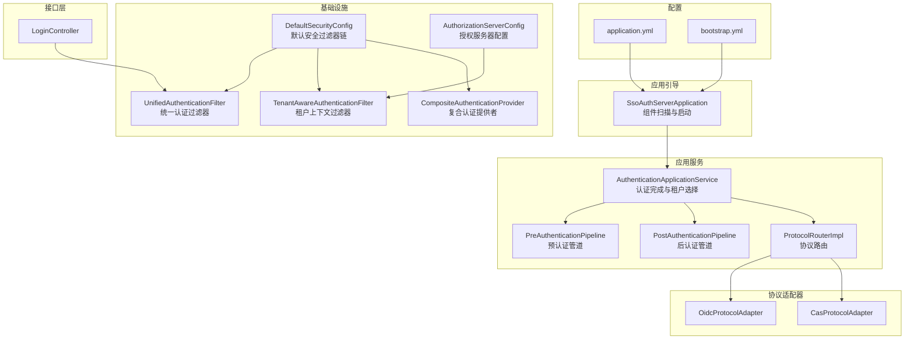
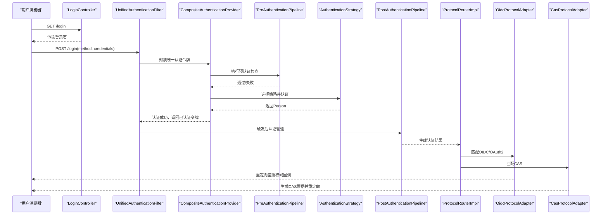
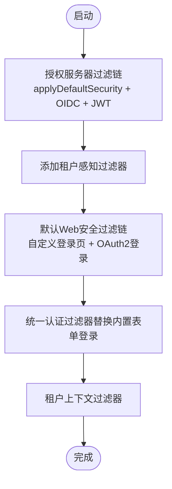
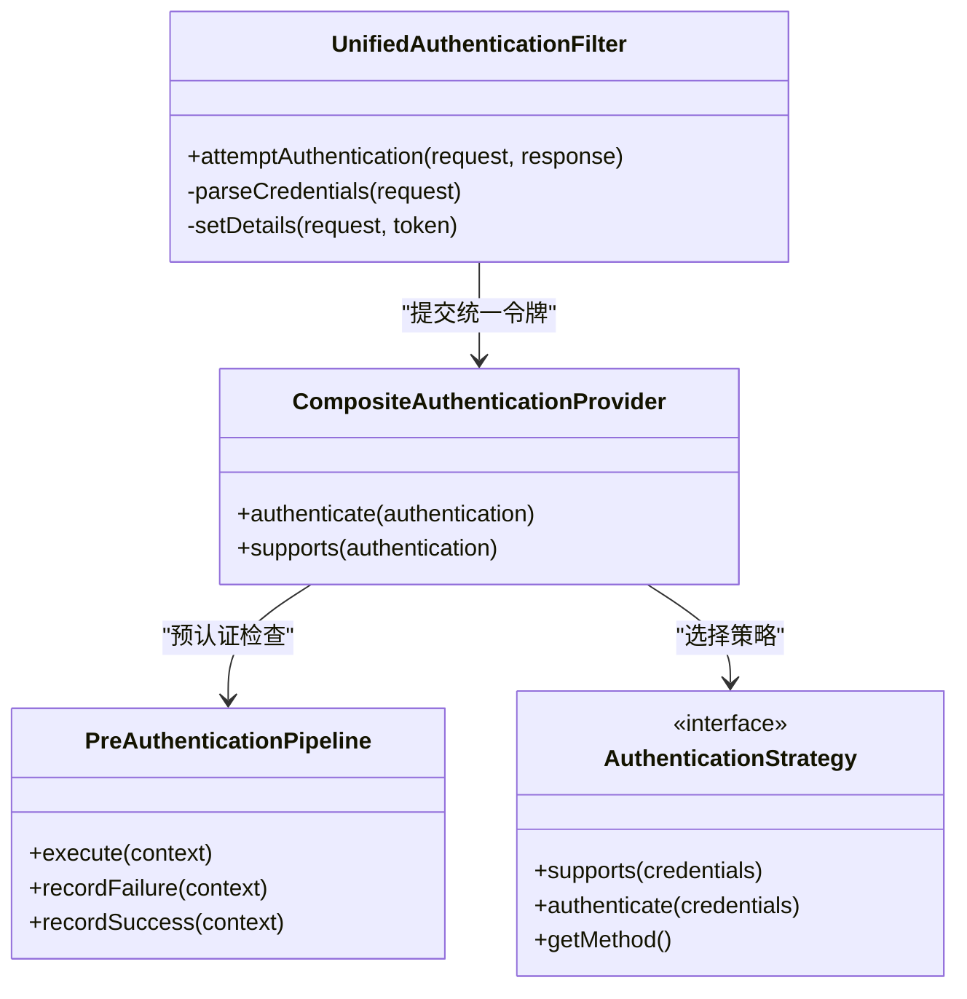
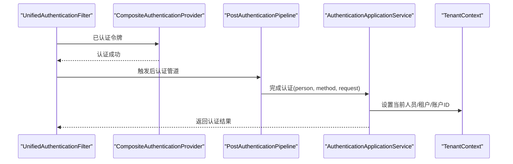
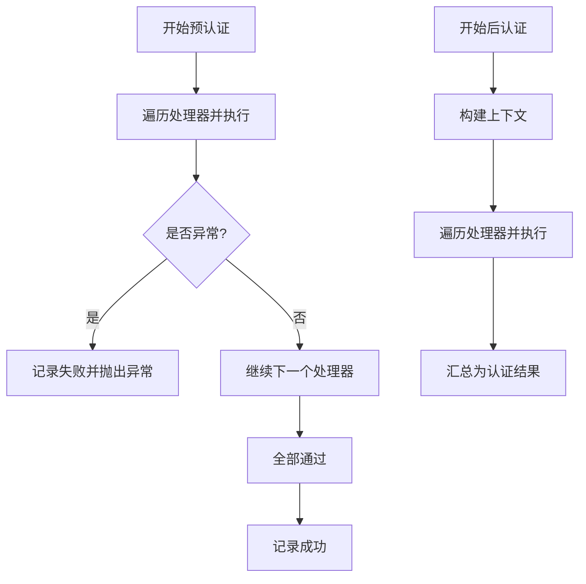
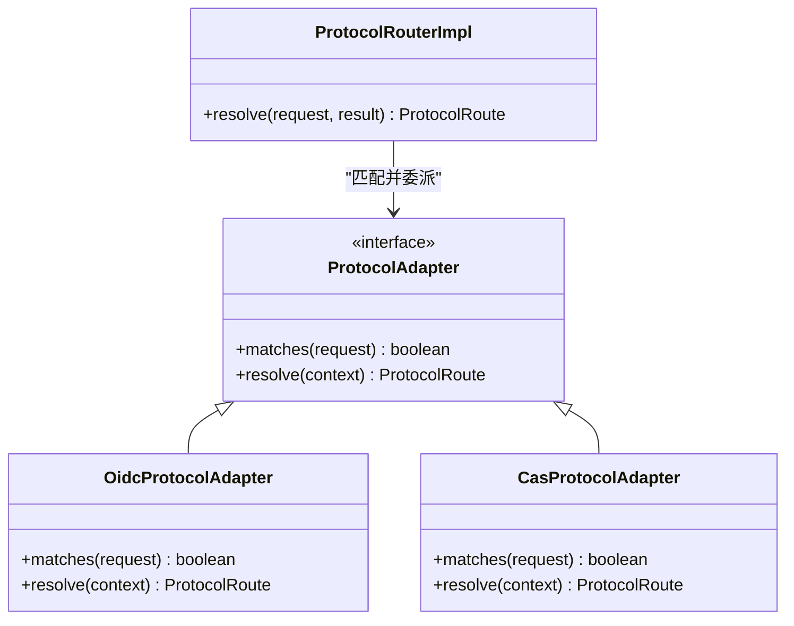
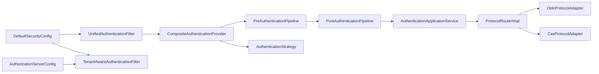

# 认证服务器 (iam-auth-server)

<cite>
**本文引用的文件**
- [SsoAuthServerApplication.java](file://iam-auth-server/src/main/java/iam/platform/auth/SsoAuthServerApplication.java)
- [AuthenticationApplicationService.java](file://iam-auth-server/src/main/java/iam/platform/auth/application/service/AuthenticationApplicationService.java)
- [AuthorizationServerConfig.java](file://iam-auth-server/src/main/java/iam/platform/auth/infrastructure/config/AuthorizationServerConfig.java)
- [DefaultSecurityConfig.java](file://iam-auth-server/src/main/java/iam/platform/auth/infrastructure/config/DefaultSecurityConfig.java)
- [PreAuthenticationPipeline.java](file://iam-auth-server/src/main/java/iam/platform/auth/application/service/pipeline/PreAuthenticationPipeline.java)
- [PostAuthenticationPipeline.java](file://iam-auth-server/src/main/java/iam/platform/auth/application/service/pipeline/PostAuthenticationPipeline.java)
- [ProtocolRouterImpl.java](file://iam-auth-server/src/main/java/iam/platform/auth/application/service/routing/ProtocolRouterImpl.java)
- [UnifiedAuthenticationFilter.java](file://iam-auth-server/src/main/java/iam/platform/auth/infrastructure/security/UnifiedAuthenticationFilter.java)
- [TenantAwareAuthenticationFilter.java](file://iam-auth-server/src/main/java/iam/platform/auth/infrastructure/security/TenantAwareAuthenticationFilter.java)
- [LoginController.java](file://iam-auth-server/src/main/java/iam/platform/auth/interfaces/web/LoginController.java)
- [application.yml](file://iam-auth-server/src/main/resources/application.yml)
- [bootstrap.yml](file://iam-auth-server/bootstrap.yml)
- [CasProtocolAdapter.java](file://iam-auth-server/src/main/java/iam/platform/auth/application/service/routing/CasProtocolAdapter.java)
- [OidcProtocolAdapter.java](file://iam-auth-server/src/main/java/iam/platform/auth/application/service/routing/OidcProtocolAdapter.java)
- [CompositeAuthenticationProvider.java](file://iam-auth-server/src/main/java/iam/platform/auth/infrastructure/security/CompositeAuthenticationProvider.java)
- [PersonRepository.java](file://iam-auth-server/src/main/java/iam/platform/auth/domain/repository/PersonRepository.java)
</cite>

## 目录
1. [简介](#简介)
2. [项目结构](#项目结构)
3. [核心组件](#核心组件)
4. [架构总览](#架构总览)
5. [详细组件分析](#详细组件分析)
6. [依赖分析](#依赖分析)
7. [性能考虑](#性能考虑)
8. [故障排查指南](#故障排查指南)
9. [结论](#结论)
10. [附录](#附录)

## 简介
本文件为认证服务器模块（iam-auth-server）的全面技术文档，围绕OAuth2/OIDC认证中心进行系统化阐述。重点覆盖：
- 应用启动类与配置扫描范围
- Spring Security与OAuth2 Authorization Server的初始化与集成
- 认证应用服务的编排与业务逻辑
- 预认证与后认证管道的设计与执行顺序
- 协议适配器（OAuth2/OIDC、SAML、CAS）的适配机制
- 安全配置（授权服务器配置、安全过滤器链、令牌配置）
- 与管理服务器的用户信息同步机制

## 项目结构
认证服务器采用分层+按职责划分的组织方式：
- 启动入口：应用引导与组件扫描
- 应用服务：认证完成与租户选择编排
- 基础设施：安全配置、过滤器链、协议路由与适配器
- 接口层：Web控制器与前端模板
- 领域模型与仓储：人员、租户、权限等实体与仓库接口

图表来源
- [SsoAuthServerApplication.java:1-19](file://iam-auth-server/src/main/java/iam/platform/auth/SsoAuthServerApplication.java#L1-L19)
- [DefaultSecurityConfig.java:24-63](file://iam-auth-server/src/main/java/iam/platform/auth/infrastructure/config/DefaultSecurityConfig.java#L24-L63)
- [AuthorizationServerConfig.java:36-64](file://iam-auth-server/src/main/java/iam/platform/auth/infrastructure/config/AuthorizationServerConfig.java#L36-L64)
- [UnifiedAuthenticationFilter.java:18-79](file://iam-auth-server/src/main/java/iam/platform/auth/infrastructure/security/UnifiedAuthenticationFilter.java#L18-L79)
- [TenantAwareAuthenticationFilter.java:21-67](file://iam-auth-server/src/main/java/iam/platform/auth/infrastructure/security/TenantAwareAuthenticationFilter.java#L21-L67)
- [CompositeAuthenticationProvider.java:24-74](file://iam-auth-server/src/main/java/iam/platform/auth/infrastructure/security/CompositeAuthenticationProvider.java#L24-L74)
- [PreAuthenticationPipeline.java:14-60](file://iam-auth-server/src/main/java/iam/platform/auth/application/service/pipeline/PreAuthenticationPipeline.java#L14-L60)
- [PostAuthenticationPipeline.java:16-30](file://iam-auth-server/src/main/java/iam/platform/auth/application/service/pipeline/PostAuthenticationPipeline.java#L16-L30)
- [ProtocolRouterImpl.java:18-51](file://iam-auth-server/src/main/java/iam/platform/auth/application/service/routing/ProtocolRouterImpl.java#L18-L51)
- [OidcProtocolAdapter.java:11-39](file://iam-auth-server/src/main/java/iam/platform/auth/application/service/routing/OidcProtocolAdapter.java#L11-L39)
- [CasProtocolAdapter.java:14-79](file://iam-auth-server/src/main/java/iam/platform/auth/application/service/routing/CasProtocolAdapter.java#L14-L79)
- [LoginController.java:16-57](file://iam-auth-server/src/main/java/iam/platform/auth/interfaces/web/LoginController.java#L16-L57)
- [application.yml:1-144](file://iam-auth-server/src/main/resources/application.yml#L1-L144)
- [bootstrap.yml:1-10](file://iam-auth-server/bootstrap.yml#L1-L10)

章节来源
- [SsoAuthServerApplication.java:1-19](file://iam-auth-server/src/main/java/iam/platform/auth/SsoAuthServerApplication.java#L1-L19)
- [application.yml:1-144](file://iam-auth-server/src/main/resources/application.yml#L1-L144)
- [bootstrap.yml:1-10](file://iam-auth-server/bootstrap.yml#L1-L10)

## 核心组件
- 应用启动类：负责组件扫描范围与模块装配，启用配置属性扫描、JPA仓库扫描与Feign客户端扫描。
- 认证应用服务：统一完成认证收尾（后认证管道）、租户选择与上下文建立，并返回认证结果。
- 安全配置：分别定义授权服务器过滤链与默认Web安全过滤链，注入自定义过滤器与认证提供者。
- 统一认证过滤器：在统一登录端点接收多种认证方式参数，封装为统一认证令牌交由认证提供者处理。
- 复合认证提供者：根据凭证类型分派到具体认证策略，串联预认证管道与策略执行。
- 协议路由与适配器：基于保存请求与适配器匹配，将认证结果映射到OAuth2/OIDC或CAS等协议的重定向或票据。

章节来源
- [SsoAuthServerApplication.java:9-18](file://iam-auth-server/src/main/java/iam/platform/auth/SsoAuthServerApplication.java#L9-L18)
- [AuthenticationApplicationService.java:28-45](file://iam-auth-server/src/main/java/iam/platform/auth/application/service/AuthenticationApplicationService.java#L28-L45)
- [DefaultSecurityConfig.java:27-63](file://iam-auth-server/src/main/java/iam/platform/auth/infrastructure/config/DefaultSecurityConfig.java#L27-L63)
- [AuthorizationServerConfig.java:38-64](file://iam-auth-server/src/main/java/iam/platform/auth/infrastructure/config/AuthorizationServerConfig.java#L38-L64)
- [UnifiedAuthenticationFilter.java:18-79](file://iam-auth-server/src/main/java/iam/platform/auth/infrastructure/security/UnifiedAuthenticationFilter.java#L18-L79)
- [CompositeAuthenticationProvider.java:24-74](file://iam-auth-server/src/main/java/iam/platform/auth/infrastructure/security/CompositeAuthenticationProvider.java#L24-L74)
- [ProtocolRouterImpl.java:18-51](file://iam-auth-server/src/main/java/iam/platform/auth/application/service/routing/ProtocolRouterImpl.java#L18-L51)

## 架构总览
认证服务器以“统一入口 + 分层管道 + 协议适配”的方式实现多协议认证与会话上下文管理。整体流程：
- 用户通过统一登录端点提交凭证，统一认证过滤器解析方法与参数
- 复合认证提供者根据凭证类型选择认证策略，先执行预认证管道（如限流、锁定、IP白名单等），再执行策略认证
- 认证成功后进入后认证管道（审计、登录记录、权限加载、租户上下文建立等），随后由协议路由器根据来源协议生成对应路由结果
- 租户上下文过滤器在后续请求中恢复租户信息，保障多租户访问一致性

图表来源
- [LoginController.java:19-47](file://iam-auth-server/src/main/java/iam/platform/auth/interfaces/web/LoginController.java#L19-L47)
- [UnifiedAuthenticationFilter.java:31-38](file://iam-auth-server/src/main/java/iam/platform/auth/infrastructure/security/UnifiedAuthenticationFilter.java#L31-L38)
- [CompositeAuthenticationProvider.java:32-68](file://iam-auth-server/src/main/java/iam/platform/auth/infrastructure/security/CompositeAuthenticationProvider.java#L32-L68)
- [PreAuthenticationPipeline.java:26-31](file://iam-auth-server/src/main/java/iam/platform/auth/application/service/pipeline/PreAuthenticationPipeline.java#L26-L31)
- [PostAuthenticationPipeline.java:22-29](file://iam-auth-server/src/main/java/iam/platform/auth/application/service/pipeline/PostAuthenticationPipeline.java#L22-L29)
- [ProtocolRouterImpl.java:24-50](file://iam-auth-server/src/main/java/iam/platform/auth/application/service/routing/ProtocolRouterImpl.java#L24-L50)
- [OidcProtocolAdapter.java:14-38](file://iam-auth-server/src/main/java/iam/platform/auth/application/service/routing/OidcProtocolAdapter.java#L14-L38)
- [CasProtocolAdapter.java:21-50](file://iam-auth-server/src/main/java/iam/platform/auth/application/service/routing/CasProtocolAdapter.java#L21-L50)

## 详细组件分析

### 应用启动类与配置扫描
- 启动类启用配置属性扫描、JPA仓库扫描与Feign客户端扫描，确保配置、持久化与远程调用能力可用。
- application.yml提供数据库、Redis、OAuth2客户端、安全策略、LDAP、CAS等配置项；bootstrap.yml接入Nacos注册发现。

章节来源
- [SsoAuthServerApplication.java:9-18](file://iam-auth-server/src/main/java/iam/platform/auth/SsoAuthServerApplication.java#L9-L18)
- [application.yml:10-144](file://iam-auth-server/src/main/resources/application.yml#L10-L144)
- [bootstrap.yml:1-10](file://iam-auth-server/bootstrap.yml#L1-L10)

### 安全配置与过滤器链
- 授权服务器过滤链：启用默认安全设置、OIDC扩展、资源服务器JWT解码、登录入口与租户感知过滤器。
- 默认Web安全过滤链：自定义登录页面、OAuth2登录配置、统一认证过滤器替换内置表单登录、租户上下文过滤器。
- 密码编码器：BCrypt。
- 认证管理器：通过复合认证提供者装配。

图表来源
- [AuthorizationServerConfig.java:46-64](file://iam-auth-server/src/main/java/iam/platform/auth/infrastructure/config/AuthorizationServerConfig.java#L46-L64)
- [DefaultSecurityConfig.java:37-63](file://iam-auth-server/src/main/java/iam/platform/auth/infrastructure/config/DefaultSecurityConfig.java#L37-L63)
- [TenantAwareAuthenticationFilter.java:28-44](file://iam-auth-server/src/main/java/iam/platform/auth/infrastructure/security/TenantAwareAuthenticationFilter.java#L28-L44)

章节来源
- [AuthorizationServerConfig.java:38-99](file://iam-auth-server/src/main/java/iam/platform/auth/infrastructure/config/AuthorizationServerConfig.java#L38-L99)
- [DefaultSecurityConfig.java:27-94](file://iam-auth-server/src/main/java/iam/platform/auth/infrastructure/config/DefaultSecurityConfig.java#L27-L94)

### 统一认证过滤器与复合认证提供者
- 统一认证过滤器：在统一登录端点解析method与参数，封装为统一认证令牌，支持密码、短信验证码、邮箱验证码、LDAP等多种方式。
- 复合认证提供者：在认证前执行预认证管道，按凭证类型选择策略执行认证，记录成功/失败并返回已认证令牌。

图表来源
- [UnifiedAuthenticationFilter.java:18-79](file://iam-auth-server/src/main/java/iam/platform/auth/infrastructure/security/UnifiedAuthenticationFilter.java#L18-L79)
- [CompositeAuthenticationProvider.java:26-74](file://iam-auth-server/src/main/java/iam/platform/auth/infrastructure/security/CompositeAuthenticationProvider.java#L26-L74)
- [PreAuthenticationPipeline.java:16-60](file://iam-auth-server/src/main/java/iam/platform/auth/application/service/pipeline/PreAuthenticationPipeline.java#L16-L60)

章节来源
- [UnifiedAuthenticationFilter.java:18-79](file://iam-auth-server/src/main/java/iam/platform/auth/infrastructure/security/UnifiedAuthenticationFilter.java#L18-L79)
- [CompositeAuthenticationProvider.java:26-74](file://iam-auth-server/src/main/java/iam/platform/auth/infrastructure/security/CompositeAuthenticationProvider.java#L26-L74)

### 认证应用服务与后认证管道
- 认证应用服务：完成认证后执行后认证管道，构建带租户上下文的认证令牌，更新会话与上下文，返回认证结果。
- 后认证管道：自动发现处理器并顺序执行，最终汇总为认证结果对象。

图表来源
- [PostAuthenticationPipeline.java:18-30](file://iam-auth-server/src/main/java/iam/platform/auth/application/service/pipeline/PostAuthenticationPipeline.java#L18-L30)
- [AuthenticationApplicationService.java:42-111](file://iam-auth-server/src/main/java/iam/platform/auth/application/service/AuthenticationApplicationService.java#L42-L111)

章节来源
- [AuthenticationApplicationService.java:28-138](file://iam-auth-server/src/main/java/iam/platform/auth/application/service/AuthenticationApplicationService.java#L28-L138)
- [PostAuthenticationPipeline.java:16-30](file://iam-auth-server/src/main/java/iam/platform/auth/application/service/pipeline/PostAuthenticationPipeline.java#L16-L30)

### 预认证与后认证管道
- 预认证管道：按顺序执行各处理器（如限流、锁定、IP校验、状态校验、审计等），失败时记录失败，成功时记录成功。
- 后认证管道：按顺序执行各处理器（如审计、登录记录、权限加载、上下文建立等），最终输出认证结果。

图表来源
- [PreAuthenticationPipeline.java:26-59](file://iam-auth-server/src/main/java/iam/platform/auth/application/service/pipeline/PreAuthenticationPipeline.java#L26-L59)
- [PostAuthenticationPipeline.java:22-29](file://iam-auth-server/src/main/java/iam/platform/auth/application/service/pipeline/PostAuthenticationPipeline.java#L22-L29)

章节来源
- [PreAuthenticationPipeline.java:14-60](file://iam-auth-server/src/main/java/iam/platform/auth/application/service/pipeline/PreAuthenticationPipeline.java#L14-L60)
- [PostAuthenticationPipeline.java:16-30](file://iam-auth-server/src/main/java/iam/platform/auth/application/service/pipeline/PostAuthenticationPipeline.java#L16-L30)

### 协议适配器与路由
- 协议路由：根据保存请求URL与适配器匹配规则，决定是跳转租户选择、默认重定向还是特定协议路由。
- OAuth2/OIDC适配器：检测授权请求或回调路径，恢复授权码流程或默认重定向。
- CAS适配器：从保存请求中提取service参数，生成服务票据并返回。

图表来源
- [ProtocolRouterImpl.java:20-51](file://iam-auth-server/src/main/java/iam/platform/auth/application/service/routing/ProtocolRouterImpl.java#L20-L51)
- [OidcProtocolAdapter.java:11-39](file://iam-auth-server/src/main/java/iam/platform/auth/application/service/routing/OidcProtocolAdapter.java#L11-L39)
- [CasProtocolAdapter.java:14-79](file://iam-auth-server/src/main/java/iam/platform/auth/application/service/routing/CasProtocolAdapter.java#L14-L79)

章节来源
- [ProtocolRouterImpl.java:18-51](file://iam-auth-server/src/main/java/iam/platform/auth/application/service/routing/ProtocolRouterImpl.java#L18-L51)
- [OidcProtocolAdapter.java:11-39](file://iam-auth-server/src/main/java/iam/platform/auth/application/service/routing/OidcProtocolAdapter.java#L11-L39)
- [CasProtocolAdapter.java:14-79](file://iam-auth-server/src/main/java/iam/platform/auth/application/service/routing/CasProtocolAdapter.java#L14-L79)

### 登录控制器与多租户支持
- 登录控制器：渲染登录页，支持从子域名、查询参数或头部识别租户代码；支持错误与退出提示。
- 租户上下文过滤器：从会话恢复租户信息，清理线程本地变量防止内存泄漏。

章节来源
- [LoginController.java:16-57](file://iam-auth-server/src/main/java/iam/platform/auth/interfaces/web/LoginController.java#L16-L57)
- [TenantAwareAuthenticationFilter.java:28-67](file://iam-auth-server/src/main/java/iam/platform/auth/infrastructure/security/TenantAwareAuthenticationFilter.java#L28-L67)

### 与管理服务器的用户信息同步机制
- 认证服务器通过Feign客户端与管理服务器交互，用于用户信息同步与权限拉取等场景。
- 启动类启用Feign客户端扫描，配置文件中定义了管理端暴露端口与指标采集等。

章节来源
- [SsoAuthServerApplication.java:12](file://iam-auth-server/src/main/java/iam/platform/auth/SsoAuthServerApplication.java#L12)
- [application.yml:128-144](file://iam-auth-server/src/main/resources/application.yml#L128-L144)

## 依赖分析
- 组件内聚性：认证相关逻辑集中在应用服务与管道层，安全配置与过滤器独立于业务逻辑，便于扩展与维护。
- 耦合关系：统一认证过滤器与复合认证提供者耦合度高，但通过策略接口降低对具体实现的依赖；协议路由与适配器通过接口解耦。
- 外部依赖：Spring Security、OAuth2 Authorization Server、OpenSAML（SAML）、Nacos（注册发现）、Redis（会话与缓存）、PostgreSQL（数据存储）。

图表来源
- [DefaultSecurityConfig.java:37-63](file://iam-auth-server/src/main/java/iam/platform/auth/infrastructure/config/DefaultSecurityConfig.java#L37-L63)
- [AuthorizationServerConfig.java:46-64](file://iam-auth-server/src/main/java/iam/platform/auth/infrastructure/config/AuthorizationServerConfig.java#L46-L64)
- [UnifiedAuthenticationFilter.java:31-38](file://iam-auth-server/src/main/java/iam/platform/auth/infrastructure/security/UnifiedAuthenticationFilter.java#L31-L38)
- [CompositeAuthenticationProvider.java:32-68](file://iam-auth-server/src/main/java/iam/platform/auth/infrastructure/security/CompositeAuthenticationProvider.java#L32-L68)
- [PreAuthenticationPipeline.java:26-31](file://iam-auth-server/src/main/java/iam/platform/auth/application/service/pipeline/PreAuthenticationPipeline.java#L26-L31)
- [PostAuthenticationPipeline.java:22-29](file://iam-auth-server/src/main/java/iam/platform/auth/application/service/pipeline/PostAuthenticationPipeline.java#L22-L29)
- [AuthenticationApplicationService.java:42-111](file://iam-auth-server/src/main/java/iam/platform/auth/application/service/AuthenticationApplicationService.java#L42-L111)
- [ProtocolRouterImpl.java:24-50](file://iam-auth-server/src/main/java/iam/platform/auth/application/service/routing/ProtocolRouterImpl.java#L24-L50)
- [OidcProtocolAdapter.java:14-38](file://iam-auth-server/src/main/java/iam/platform/auth/application/service/routing/OidcProtocolAdapter.java#L14-L38)
- [CasProtocolAdapter.java:21-50](file://iam-auth-server/src/main/java/iam/platform/auth/application/service/routing/CasProtocolAdapter.java#L21-L50)

## 性能考虑
- 过滤器链顺序：统一认证过滤器与租户上下文过滤器的顺序影响请求处理开销，应避免重复解析与上下文重建。
- 管道执行：预/后认证处理器数量与复杂度直接影响认证耗时，建议将轻量检查前置，耗时操作（如远程调用）尽量异步化。
- 会话与缓存：使用Redis存储会话与速率限制状态，注意键空间与过期策略，避免热点Key。
- JWK与JWT：JWK生成KeyID基于公钥指纹，保证重启后KeyID稳定，减少客户端JWKS缓存失效带来的额外请求。

## 故障排查指南
- 登录失败：检查统一认证过滤器参数解析与复合认证提供者的策略匹配；查看预认证管道记录的失败原因（限流、锁定、IP黑名单等）。
- 会话丢失：确认租户上下文过滤器是否正确从会话恢复租户ID与账户ID，以及线程本地变量清理是否生效。
- 协议路由异常：检查协议路由是否正确识别保存请求URL，适配器匹配逻辑是否覆盖目标协议路径。
- OAuth2/OIDC异常：确认授权服务器配置中的Issuer URI、JWK源与JWT解码器是否正确加载。
- CAS票据生成：检查CAS适配器是否能从保存请求中提取service参数，以及票据服务是否可用。

章节来源
- [UnifiedAuthenticationFilter.java:43-62](file://iam-auth-server/src/main/java/iam/platform/auth/infrastructure/security/UnifiedAuthenticationFilter.java#L43-L62)
- [CompositeAuthenticationProvider.java:48-67](file://iam-auth-server/src/main/java/iam/platform/auth/infrastructure/security/CompositeAuthenticationProvider.java#L48-L67)
- [PreAuthenticationPipeline.java:36-59](file://iam-auth-server/src/main/java/iam/platform/auth/application/service/pipeline/PreAuthenticationPipeline.java#L36-L59)
- [TenantAwareAuthenticationFilter.java:32-43](file://iam-auth-server/src/main/java/iam/platform/auth/infrastructure/security/TenantAwareAuthenticationFilter.java#L32-L43)
- [ProtocolRouterImpl.java:24-50](file://iam-auth-server/src/main/java/iam/platform/auth/application/service/routing/ProtocolRouterImpl.java#L24-L50)
- [AuthorizationServerConfig.java:96-99](file://iam-auth-server/src/main/java/iam/platform/auth/infrastructure/config/AuthorizationServerConfig.java#L96-L99)
- [CasProtocolAdapter.java:28-50](file://iam-auth-server/src/main/java/iam/platform/auth/application/service/routing/CasProtocolAdapter.java#L28-L50)

## 结论
认证服务器通过统一入口、分层管道与协议适配器实现了对OAuth2/OIDC、CAS等多协议的支持，并结合多租户上下文与安全策略，提供了可扩展、可维护的认证中心能力。配合管理服务器的用户信息同步与外部注册发现，形成完整的SSO解决方案。

## 附录
- 关键配置项参考：
  - 数据库连接与JPA配置
  - Redis会话与缓存
  - OAuth2客户端注册与提供商配置
  - 安全策略（限流、锁定、IP白名单）
  - LDAP与CAS配置
  - SSL与JWK密钥位置
  - Nacos注册发现与监控指标

章节来源
- [application.yml:10-144](file://iam-auth-server/src/main/resources/application.yml#L10-L144)
- [bootstrap.yml:1-10](file://iam-auth-server/bootstrap.yml#L1-L10)