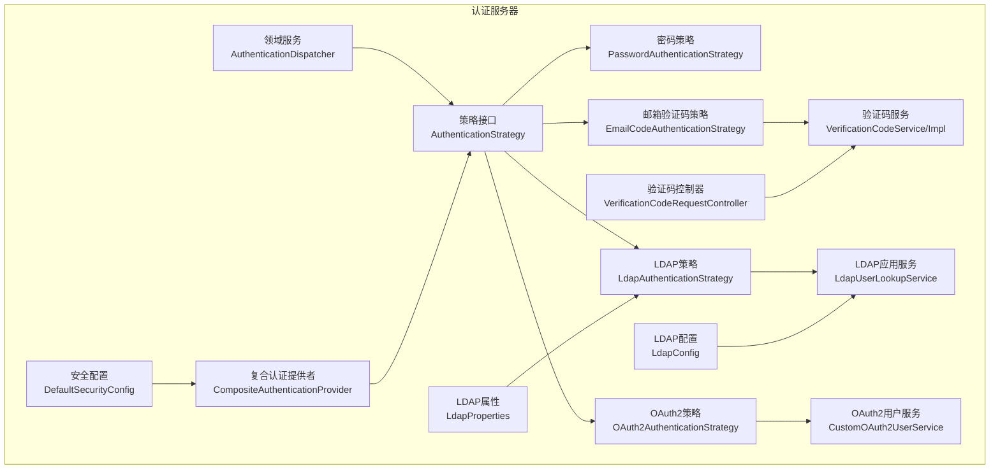
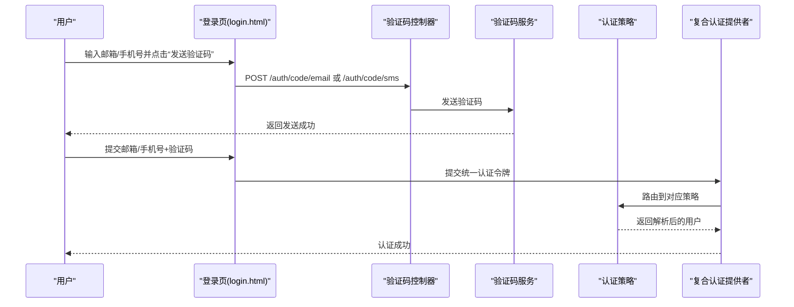
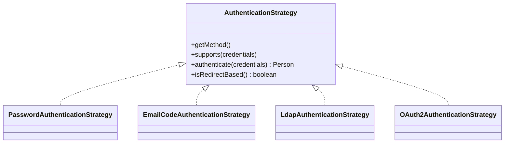
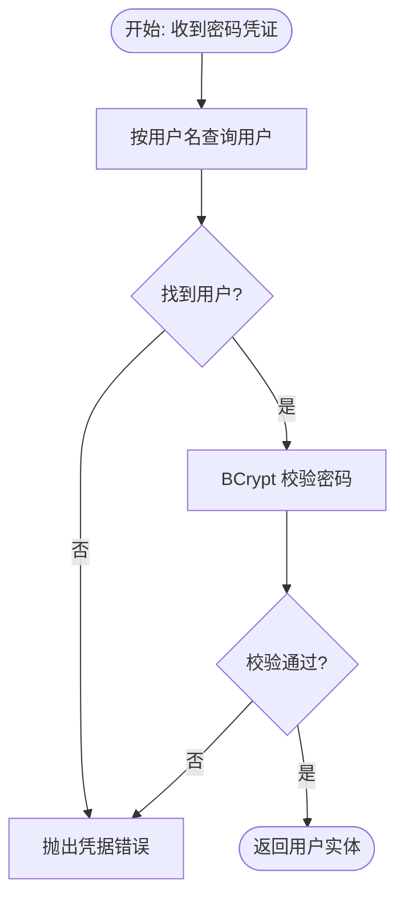
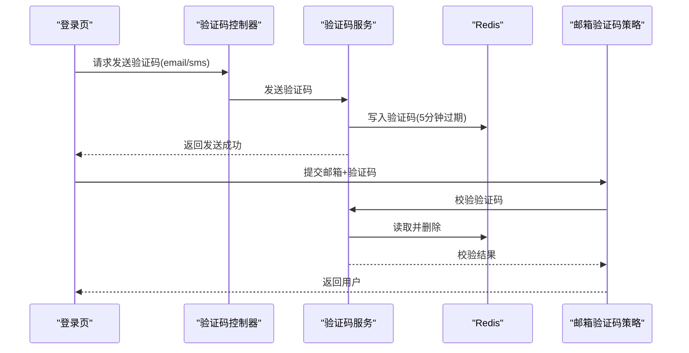
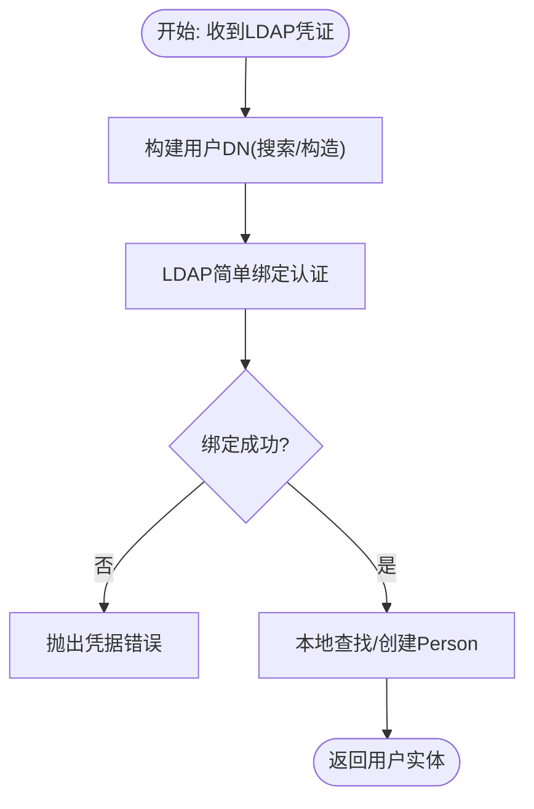
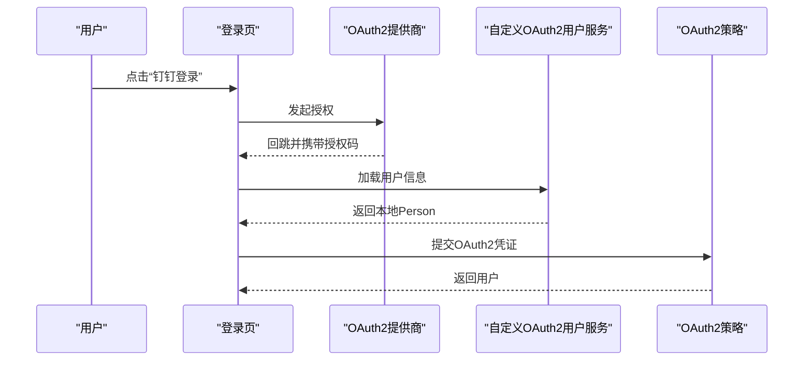
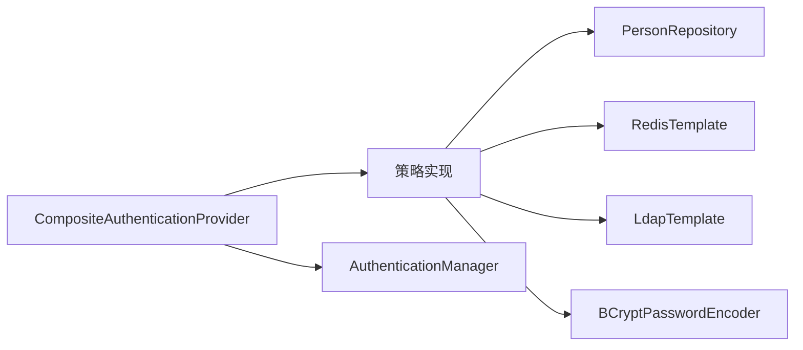

# 认证策略

<cite>
**本文引用的文件**
- [AuthenticationStrategy.java](file://iam-auth-server/src/main/java/iam/platform/auth/domain/service/AuthenticationStrategy.java)
- [AuthenticationDispatcher.java](file://iam-auth-server/src/main/java/iam/platform/auth/domain/service/AuthenticationDispatcher.java)
- [PasswordAuthenticationStrategy.java](file://iam-auth-server/src/main/java/iam/platform/auth/domain/service/impl/PasswordAuthenticationStrategy.java)
- [EmailCodeAuthenticationStrategy.java](file://iam-auth-server/src/main/java/iam/platform/auth/domain/service/impl/EmailCodeAuthenticationStrategy.java)
- [VerificationCodeService.java](file://iam-auth-server/src/main/java/iam/platform/auth/domain/service/VerificationCodeService.java)
- [VerificationCodeServiceImpl.java](file://iam-auth-server/src/main/java/iam/platform/auth/domain/service/impl/VerificationCodeServiceImpl.java)
- [VerificationCodeRequestController.java](file://iam-auth-server/src/main/java/iam/platform/auth/interfaces/rest/VerificationCodeRequestController.java)
- [LdapAuthenticationStrategy.java](file://iam-auth-server/src/main/java/iam/platform/auth/domain/service/impl/LdapAuthenticationStrategy.java)
- [LdapUserLookupService.java](file://iam-auth-server/src/main/java/iam/platform/auth/application/service/LdapUserLookupService.java)
- [LdapConfig.java](file://iam-auth-server/src/main/java/iam/platform/auth/infrastructure/config/LdapConfig.java)
- [LdapProperties.java](file://iam-auth-server/src/main/java/iam/platform/auth/infrastructure/config/LdapProperties.java)
- [OAuth2AuthenticationStrategy.java](file://iam-auth-server/src/main/java/iam/platform/auth/domain/service/impl/OAuth2AuthenticationStrategy.java)
- [CustomOAuth2UserService.java](file://iam-auth-server/src/main/java/iam/platform/auth/infrastructure/security/CustomOAuth2UserService.java)
- [CustomOAuth2User.java](file://iam-auth-server/src/main/java/iam/platform/auth/infrastructure/security/CustomOAuth2User.java)
- [CompositeAuthenticationProvider.java](file://iam-auth-server/src/main/java/iam/platform/auth/infrastructure/security/CompositeAuthenticationProvider.java)
- [DefaultSecurityConfig.java](file://iam-auth-server/src/main/java/iam/platform/auth/infrastructure/config/DefaultSecurityConfig.java)
- [SecurityPolicyProperties.java](file://iam-auth-server/src/main/java/iam/platform/auth/infrastructure/config/SecurityPolicyProperties.java)
- [application.yml](file://iam-auth-server/src/main/resources/application.yml)
- [login.html（认证服务器）](file://iam-auth-server/src/main/resources/templates/login.html)
- [login.html（BFF）](file://iam-auth-server/src/main/resources/templates/login.html)
- [login.html（BFF）](file://iam-bff-server/src/main/resources/templates/login.html)
</cite>

## 目录
1. [简介](#简介)
2. [项目结构](#项目结构)
3. [核心组件](#核心组件)
4. [架构总览](#架构总览)
5. [详细组件分析](#详细组件分析)
6. [依赖分析](#依赖分析)
7. [性能考虑](#性能考虑)
8. [故障排查指南](#故障排查指南)
9. [结论](#结论)
10. [附录](#附录)

## 简介
本文件面向认证策略模块，系统性阐述统一认证框架中的策略设计、扩展机制与多因素组合能力。内容覆盖：
- 策略接口设计理念与扩展点
- 多因素认证与灵活组合
- 密码认证策略：密码验证、盐值处理与安全存储
- 邮箱/短信验证码策略：生成、发送、有效期与风控
- LDAP 策略：目录服务查询与用户属性映射
- OAuth2 策略：第三方平台集成与用户信息获取
- 策略配置方法与自定义策略开发指南

## 项目结构
认证策略相关代码主要位于认证服务器模块中，采用“领域服务 + 基础设施配置 + 接口控制器”的分层组织：
- domain/service：认证策略接口与调度器
- domain/service/impl：具体策略实现（密码、邮箱验证码、LDAP、OAuth2）
- application/service：应用级服务（LDAP 用户查找）
- infrastructure/config：安全与外部系统配置（LDAP、OAuth2、加密、安全策略）
- infrastructure/security：Spring Security 扩展（复合认证提供者、OAuth2 用户服务）
- interfaces/rest：验证码请求等 REST 入口
- resources/templates：登录页前端模板（含验证码发送交互）

图表来源
- [AuthenticationDispatcher.java:25-54](file://iam-auth-server/src/main/java/iam/platform/auth/domain/service/AuthenticationDispatcher.java#L25-L54)
- [AuthenticationStrategy.java:11-40](file://iam-auth-server/src/main/java/iam/platform/auth/domain/service/AuthenticationStrategy.java#L11-L40)
- [PasswordAuthenticationStrategy.java:26-63](file://iam-auth-server/src/main/java/iam/platform/auth/domain/service/impl/PasswordAuthenticationStrategy.java#L26-L63)
- [EmailCodeAuthenticationStrategy.java:14-39](file://iam-auth-server/src/main/java/iam/platform/auth/domain/service/impl/EmailCodeAuthenticationStrategy.java#L14-L39)
- [VerificationCodeService.java:5-21](file://iam-auth-server/src/main/java/iam/platform/auth/domain/service/VerificationCodeService.java#L5-L21)
- [VerificationCodeServiceImpl.java:17-153](file://iam-auth-server/src/main/java/iam/platform/auth/domain/service/impl/VerificationCodeServiceImpl.java#L17-L153)
- [LdapAuthenticationStrategy.java:30-136](file://iam-auth-server/src/main/java/iam/platform/auth/domain/service/impl/LdapAuthenticationStrategy.java#L30-L136)
- [LdapUserLookupService.java:22-73](file://iam-auth-server/src/main/java/iam/platform/auth/application/service/LdapUserLookupService.java#L22-L73)
- [OAuth2AuthenticationStrategy.java:17-54](file://iam-auth-server/src/main/java/iam/platform/auth/domain/service/impl/OAuth2AuthenticationStrategy.java#L17-L54)
- [CustomOAuth2UserService.java:22-90](file://iam-auth-server/src/main/java/iam/platform/auth/infrastructure/security/CustomOAuth2UserService.java#L22-L90)
- [CompositeAuthenticationProvider.java:25-31](file://iam-auth-server/src/main/java/iam/platform/auth/infrastructure/security/CompositeAuthenticationProvider.java#L25-L31)
- [DefaultSecurityConfig.java:82-94](file://iam-auth-server/src/main/java/iam/platform/auth/infrastructure/config/DefaultSecurityConfig.java#L82-L94)
- [LdapConfig.java:20-38](file://iam-auth-server/src/main/java/iam/platform/auth/infrastructure/config/LdapConfig.java#L20-L38)
- [LdapProperties.java:13-34](file://iam-auth-server/src/main/java/iam/platform/auth/infrastructure/config/LdapProperties.java#L13-L34)
- [VerificationCodeRequestController.java:15-30](file://iam-auth-server/src/main/java/iam/platform/auth/interfaces/rest/VerificationCodeRequestController.java#L15-L30)

章节来源
- [DefaultSecurityConfig.java:82-94](file://iam-auth-server/src/main/java/iam/platform/auth/infrastructure/config/DefaultSecurityConfig.java#L82-L94)
- [CompositeAuthenticationProvider.java:25-31](file://iam-auth-server/src/main/java/iam/platform/auth/infrastructure/security/CompositeAuthenticationProvider.java#L25-L31)

## 核心组件
- 策略接口 AuthenticationStrategy：定义认证方法标识、支持性判断、执行认证与是否重定向型策略等约定，确保各策略实现的一致性与可扩展性。
- 调度器 AuthenticationDispatcher：根据传入凭证类型自动选择匹配策略，作为统一入口协调所有认证方法。
- 复合认证提供者 CompositeAuthenticationProvider：在 Spring Security 中注册为 AuthenticationProvider，负责将令牌与策略解耦，自动发现并路由到对应策略。

章节来源
- [AuthenticationStrategy.java:11-40](file://iam-auth-server/src/main/java/iam/platform/auth/domain/service/AuthenticationStrategy.java#L11-L40)
- [AuthenticationDispatcher.java:25-54](file://iam-auth-server/src/main/java/iam/platform/auth/domain/service/AuthenticationDispatcher.java#L25-L54)
- [CompositeAuthenticationProvider.java:25-31](file://iam-auth-server/src/main/java/iam/platform/auth/infrastructure/security/CompositeAuthenticationProvider.java#L25-L31)

## 架构总览
统一认证框架通过“策略即插件”的模式，将不同认证方式（密码、验证码、LDAP、OAuth2）以相同契约接入同一调度与安全体系。前端登录页提供验证码发送与切换输入的能力；后端控制器触发验证码生成与校验；策略实现完成最终用户解析与认证。

图表来源
- [VerificationCodeRequestController.java:19-29](file://iam-auth-server/src/main/java/iam/platform/auth/interfaces/rest/VerificationCodeRequestController.java#L19-L29)
- [VerificationCodeServiceImpl.java:29-55](file://iam-auth-server/src/main/java/iam/platform/auth/domain/service/impl/VerificationCodeServiceImpl.java#L29-L55)
- [CompositeAuthenticationProvider.java:25-31](file://iam-auth-server/src/main/java/iam/platform/auth/infrastructure/security/CompositeAuthenticationProvider.java#L25-L31)
- [EmailCodeAuthenticationStrategy.java:14-39](file://iam-auth-server/src/main/java/iam/platform/auth/domain/service/impl/EmailCodeAuthenticationStrategy.java#L14-L39)
- [login.html（认证服务器）:270-340](file://iam-auth-server/src/main/resources/templates/login.html#L270-L340)
- [login.html（BFF）:267-340](file://iam-bff-server/src/main/resources/templates/login.html#L267-L340)

## 详细组件分析

### 策略接口与扩展机制
- 设计理念：以密封接口 + 记录变体的方式表达凭证类型，确保类型安全与可扩展；策略仅关注自身方法的验证与用户解析。
- 扩展机制：新增策略只需实现接口并声明支持的凭证类型，即可被调度器自动发现与路由。

图表来源
- [AuthenticationStrategy.java:11-40](file://iam-auth-server/src/main/java/iam/platform/auth/domain/service/AuthenticationStrategy.java#L11-L40)
- [PasswordAuthenticationStrategy.java:26-63](file://iam-auth-server/src/main/java/iam/platform/auth/domain/service/impl/PasswordAuthenticationStrategy.java#L26-L63)
- [EmailCodeAuthenticationStrategy.java:14-39](file://iam-auth-server/src/main/java/iam/platform/auth/domain/service/impl/EmailCodeAuthenticationStrategy.java#L14-L39)
- [LdapAuthenticationStrategy.java:30-136](file://iam-auth-server/src/main/java/iam/platform/auth/domain/service/impl/LdapAuthenticationStrategy.java#L30-L136)
- [OAuth2AuthenticationStrategy.java:17-54](file://iam-auth-server/src/main/java/iam/platform/auth/domain/service/impl/OAuth2AuthenticationStrategy.java#L17-L54)

章节来源
- [AuthenticationStrategy.java:11-40](file://iam-auth-server/src/main/java/iam/platform/auth/domain/service/AuthenticationStrategy.java#L11-L40)

### 密码认证策略
- 功能要点
  - 通过用户名查询用户并进行密码校验（BCrypt）
  - 认证失败抛出凭据错误异常
  - 日志记录成功与失败场景
- 安全要点
  - 使用 BCrypt 进行密码哈希存储
  - 仅建议用于高信任客户端；OAuth2 授权码 + PKCE 更推荐

图表来源
- [PasswordAuthenticationStrategy.java:42-62](file://iam-auth-server/src/main/java/iam/platform/auth/domain/service/impl/PasswordAuthenticationStrategy.java#L42-L62)
- [DefaultSecurityConfig.java:91-93](file://iam-auth-server/src/main/java/iam/platform/auth/infrastructure/config/DefaultSecurityConfig.java#L91-L93)

章节来源
- [PasswordAuthenticationStrategy.java:14-63](file://iam-auth-server/src/main/java/iam/platform/auth/domain/service/impl/PasswordAuthenticationStrategy.java#L14-L63)
- [DefaultSecurityConfig.java:91-93](file://iam-auth-server/src/main/java/iam/platform/auth/infrastructure/config/DefaultSecurityConfig.java#L91-L93)

### 邮箱/短信验证码认证策略
- 功能要点
  - 验证码生成：固定长度随机数字
  - 存储与过期：Redis 存储，5 分钟过期
  - 发送：限流（每分钟一次）、日限额（默认每日最多 10 次），开发环境日志输出，生产需接入真实短信/邮件服务
  - 校验：验证码正确则删除缓存，错误则记录告警
  - 用户解析：找不到用户时按邮箱/手机创建新用户
- 前端交互
  - 登录页提供邮箱/短信两种验证码输入与发送按钮，支持切换输入类型

图表来源
- [VerificationCodeRequestController.java:19-29](file://iam-auth-server/src/main/java/iam/platform/auth/interfaces/rest/VerificationCodeRequestController.java#L19-L29)
- [VerificationCodeServiceImpl.java:29-95](file://iam-auth-server/src/main/java/iam/platform/auth/domain/service/impl/VerificationCodeServiceImpl.java#L29-L95)
- [EmailCodeAuthenticationStrategy.java:28-38](file://iam-auth-server/src/main/java/iam/platform/auth/domain/service/impl/EmailCodeAuthenticationStrategy.java#L28-L38)
- [login.html（认证服务器）:270-340](file://iam-auth-server/src/main/resources/templates/login.html#L270-L340)
- [login.html（BFF）:267-340](file://iam-bff-server/src/main/resources/templates/login.html#L267-L340)

章节来源
- [VerificationCodeService.java:5-21](file://iam-auth-server/src/main/java/iam/platform/auth/domain/service/VerificationCodeService.java#L5-L21)
- [VerificationCodeServiceImpl.java:17-153](file://iam-auth-server/src/main/java/iam/platform/auth/domain/service/impl/VerificationCodeServiceImpl.java#L17-L153)
- [VerificationCodeRequestController.java:15-30](file://iam-auth-server/src/main/java/iam/platform/auth/interfaces/rest/VerificationCodeRequestController.java#L15-L30)
- [login.html（认证服务器）:270-340](file://iam-auth-server/src/main/resources/templates/login.html#L270-L340)
- [login.html（BFF）:267-340](file://iam-bff-server/src/main/resources/templates/login.html#L267-L340)

### LDAP 认证策略
- 功能要点
  - 支持基于搜索过滤器定位用户 DN，或直接构造 DN（兼容 AD 与通用 LDAP）
  - 使用简单绑定（bind）对 LDAP 服务器进行认证
  - 成功后在本地数据库查找或创建 Person 实体
- 配置要点
  - 通过 LdapProperties 读取连接参数（URL、基础 DN、绑定账号、SSL、连接池等）
  - LdapConfig 注入 LdapTemplate，供应用服务使用

图表来源
- [LdapAuthenticationStrategy.java:46-75](file://iam-auth-server/src/main/java/iam/platform/auth/domain/service/impl/LdapAuthenticationStrategy.java#L46-L75)
- [LdapAuthenticationStrategy.java:80-101](file://iam-auth-server/src/main/java/iam/platform/auth/domain/service/impl/LdapAuthenticationStrategy.java#L80-L101)
- [LdapAuthenticationStrategy.java:106-130](file://iam-auth-server/src/main/java/iam/platform/auth/domain/service/impl/LdapAuthenticationStrategy.java#L106-L130)
- [LdapUserLookupService.java:63-73](file://iam-auth-server/src/main/java/iam/platform/auth/application/service/LdapUserLookupService.java#L63-L73)
- [LdapProperties.java:13-34](file://iam-auth-server/src/main/java/iam/platform/auth/infrastructure/config/LdapProperties.java#L13-L34)
- [LdapConfig.java:20-38](file://iam-auth-server/src/main/java/iam/platform/auth/infrastructure/config/LdapConfig.java#L20-L38)

章节来源
- [LdapAuthenticationStrategy.java:18-136](file://iam-auth-server/src/main/java/iam/platform/auth/domain/service/impl/LdapAuthenticationStrategy.java#L18-L136)
- [LdapUserLookupService.java:28-73](file://iam-auth-server/src/main/java/iam/platform/auth/application/service/LdapUserLookupService.java#L28-L73)
- [LdapProperties.java:13-34](file://iam-auth-server/src/main/java/iam/platform/auth/infrastructure/config/LdapProperties.java#L13-L34)
- [LdapConfig.java:20-38](file://iam-auth-server/src/main/java/iam/platform/auth/infrastructure/config/LdapConfig.java#L20-L38)

### OAuth2 认证策略
- 功能要点
  - OAuth2 凭证由外部提供商完成验证，本策略仅做方法标识与重定向标记
  - 自定义 OAuth2 用户服务负责拉取第三方用户信息、关联本地用户或创建新用户
  - 支持钉钉、企业微信等提供商，映射到对应的 AuthenticationMethod
- 前端交互
  - 登录页提供“使用钉钉登录”等社交登录入口，触发 OAuth2 授权流程

图表来源
- [login.html（认证服务器）:214-219](file://iam-auth-server/src/main/resources/templates/login.html#L214-L219)
- [CustomOAuth2UserService.java:27-50](file://iam-auth-server/src/main/java/iam/platform/auth/infrastructure/security/CustomOAuth2UserService.java#L27-L50)
- [OAuth2AuthenticationStrategy.java:30-42](file://iam-auth-server/src/main/java/iam/platform/auth/domain/service/impl/OAuth2AuthenticationStrategy.java#L30-L42)

章节来源
- [OAuth2AuthenticationStrategy.java:10-54](file://iam-auth-server/src/main/java/iam/platform/auth/domain/service/impl/OAuth2AuthenticationStrategy.java#L10-L54)
- [CustomOAuth2UserService.java:22-90](file://iam-auth-server/src/main/java/iam/platform/auth/infrastructure/security/CustomOAuth2UserService.java#L22-L90)
- [login.html（认证服务器）:214-219](file://iam-auth-server/src/main/resources/templates/login.html#L214-L219)

### 多因素认证与灵活组合
- 组合思路
  - 通过统一调度器与策略接口，可将多种认证方式组合为“先密码后验证码”、“LDAP 后 OAuth2”等流程
  - 可在前置/后置管道中插入风控、审计、权限加载等横切逻辑
- 实现建议
  - 在策略层保持单一职责：每个策略只处理一种认证方式
  - 通过控制器与表单参数控制认证方法（如邮箱/短信切换），由策略自动识别并执行

章节来源
- [AuthenticationDispatcher.java:25-54](file://iam-auth-server/src/main/java/iam/platform/auth/domain/service/AuthenticationDispatcher.java#L25-L54)
- [login.html（认证服务器）:327-340](file://iam-auth-server/src/main/resources/templates/login.html#L327-L340)
- [login.html（BFF）:324-337](file://iam-bff-server/src/main/resources/templates/login.html#L324-L337)

## 依赖分析
- 组件耦合
  - 策略实现依赖于仓储与基础设施服务（如 Redis、LDAP Template、PasswordEncoder）
  - 复合认证提供者依赖 Spring Security 的 AuthenticationManager 与策略集合
- 外部依赖
  - Redis：验证码存储与限流
  - LDAP：目录服务查询与绑定
  - OAuth2 提供商：钉钉、企业微信等
- 风险点
  - LDAP/网络异常需降级处理
  - 验证码服务需接入真实短信/邮件通道
  - OAuth2 用户映射需保证唯一性与一致性

图表来源
- [CompositeAuthenticationProvider.java:25-31](file://iam-auth-server/src/main/java/iam/platform/auth/infrastructure/security/CompositeAuthenticationProvider.java#L25-L31)
- [PasswordAuthenticationStrategy.java:28-29](file://iam-auth-server/src/main/java/iam/platform/auth/domain/service/impl/PasswordAuthenticationStrategy.java#L28-L29)
- [VerificationCodeServiceImpl.java:19-20](file://iam-auth-server/src/main/java/iam/platform/auth/domain/service/impl/VerificationCodeServiceImpl.java#L19-L20)
- [LdapConfig.java:35-37](file://iam-auth-server/src/main/java/iam/platform/auth/infrastructure/config/LdapConfig.java#L35-L37)
- [DefaultSecurityConfig.java:91-93](file://iam-auth-server/src/main/java/iam/platform/auth/infrastructure/config/DefaultSecurityConfig.java#L91-L93)

章节来源
- [CompositeAuthenticationProvider.java:25-31](file://iam-auth-server/src/main/java/iam/platform/auth/infrastructure/security/CompositeAuthenticationProvider.java#L25-L31)
- [DefaultSecurityConfig.java:82-94](file://iam-auth-server/src/main/java/iam/platform/auth/infrastructure/config/DefaultSecurityConfig.java#L82-L94)

## 性能考虑
- 缓存与限流
  - 验证码使用 Redis 快速存取与过期控制，避免数据库压力
  - 限流与日限额防止滥用，降低短信/邮件成本
- 数据库访问
  - 密码认证与验证码解析均通过仓储按主键/索引查询，建议确保索引完善
- LDAP 连接
  - 启用连接池与合适的超时配置，避免阻塞与资源耗尽
- OAuth2
  - 用户信息拉取尽量复用缓存，减少第三方调用次数

## 故障排查指南
- 密码认证失败
  - 检查用户名是否存在与密码哈希是否匹配
  - 确认 BCrypt 配置一致
- 验证码无效或过期
  - 核对 Redis 中验证码键是否存在与过期时间
  - 检查限流键是否命中（每分钟一次）
  - 确认日限额未达上限
- LDAP 认证失败
  - 核对 LdapProperties 中 URL、基础 DN、绑定账号与 SSL 设置
  - 检查用户 DN 构造逻辑（搜索过滤器优先）
- OAuth2 登录异常
  - 检查提供商回调地址与 scope 配置
  - 关注自定义用户服务的映射逻辑与唯一性约束

章节来源
- [VerificationCodeServiceImpl.java:58-95](file://iam-auth-server/src/main/java/iam/platform/auth/domain/service/impl/VerificationCodeServiceImpl.java#L58-L95)
- [LdapProperties.java:13-34](file://iam-auth-server/src/main/java/iam/platform/auth/infrastructure/config/LdapProperties.java#L13-L34)
- [CustomOAuth2UserService.java:27-50](file://iam-auth-server/src/main/java/iam/platform/auth/infrastructure/security/CustomOAuth2UserService.java#L27-L50)

## 结论
该认证策略模块以“策略即插件”的架构实现了密码、验证码、LDAP、OAuth2 等多种认证方式的统一接入与扩展。通过调度器与复合认证提供者，系统具备良好的可维护性与可演进性；结合 Redis 限流、LDAP 连接池与 BCrypt 哈希，满足了生产环境的安全与性能要求。建议在生产环境中补齐短信/邮件通道与完善的监控告警体系。

## 附录

### 配置方法
- OAuth2 客户端与提供商
  - 在配置文件中设置客户端 ID/Secret、授权类型、回调地址与提供商元数据
- 验证码服务
  - 开启邮箱验证码，配置发件人地址
  - 可选开启短信验证码与提供商
- LDAP
  - 开启 LDAP 并配置 URL、基础 DN、绑定账号、搜索过滤器、SSL 与连接池
- 安全策略
  - 配置速率限制、账户锁定阈值与白名单/黑名单

章节来源
- [application.yml:54-89](file://iam-auth-server/src/main/resources/application.yml#L54-L89)
- [LdapProperties.java:13-34](file://iam-auth-server/src/main/java/iam/platform/auth/infrastructure/config/LdapProperties.java#L13-L34)
- [SecurityPolicyProperties.java:13-37](file://iam-auth-server/src/main/java/iam/platform/auth/infrastructure/config/SecurityPolicyProperties.java#L13-L37)

### 自定义策略开发指南
- 实现步骤
  - 新建策略类并实现 AuthenticationStrategy 接口
  - 在 supports 中声明支持的凭证类型
  - 在 authenticate 中完成验证与用户解析
  - 如为重定向型（如 OAuth2），覆写 isRedirectBased 返回 true
  - 在 Spring 容器中注册为 Bean，自动被调度器发现
- 注意事项
  - 严格区分“凭证类型”与“认证方法”，避免混淆
  - 对外服务（短信/邮件/LDAP）需做好异常与降级处理
  - 与统一安全配置集成，遵循认证成功/失败处理器约定

章节来源
- [AuthenticationStrategy.java:11-40](file://iam-auth-server/src/main/java/iam/platform/auth/domain/service/AuthenticationStrategy.java#L11-L40)
- [OAuth2AuthenticationStrategy.java:39-42](file://iam-auth-server/src/main/java/iam/platform/auth/domain/service/impl/OAuth2AuthenticationStrategy.java#L39-L42)
- [DefaultSecurityConfig.java:82-88](file://iam-auth-server/src/main/java/iam/platform/auth/infrastructure/config/DefaultSecurityConfig.java#L82-L88)