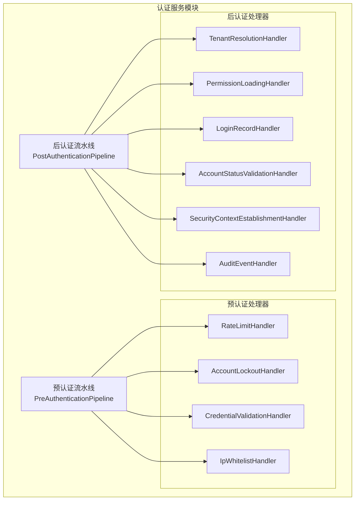
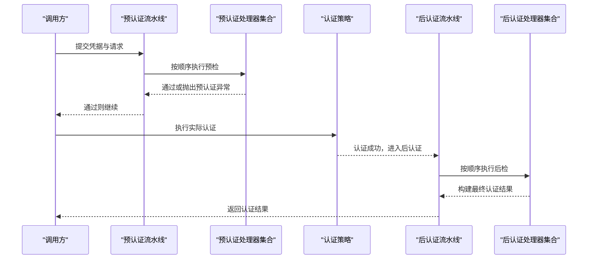
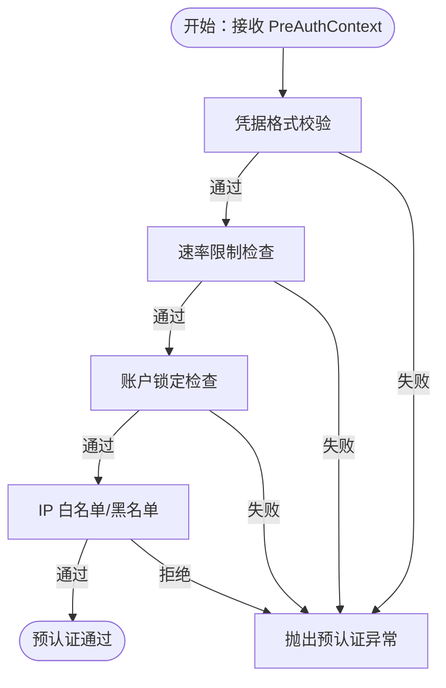
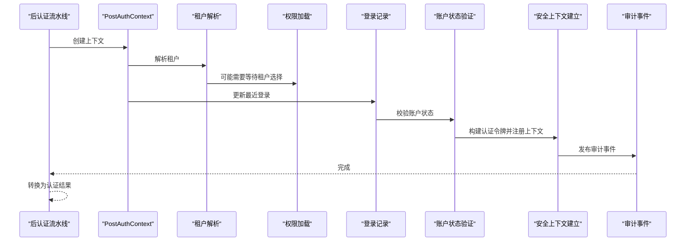
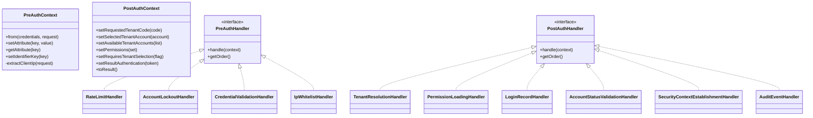
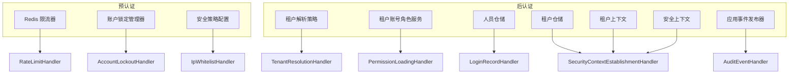

# 认证管道系统

<cite>
**本文引用的文件**
- [PreAuthContext.java](file://iam-auth-server/src/main/java/iam/platform/auth/application/service/pipeline/PreAuthContext.java)
- [PostAuthContext.java](file://iam-auth-server/src/main/java/iam/platform/auth/application/service/pipeline/PostAuthContext.java)
- [PreAuthHandler.java](file://iam-auth-server/src/main/java/iam/platform/auth/application/service/pipeline/PreAuthHandler.java)
- [PostAuthHandler.java](file://iam-auth-server/src/main/java/iam/platform/auth/application/service/pipeline/PostAuthHandler.java)
- [PreAuthenticationPipeline.java](file://iam-auth-server/src/main/java/iam/platform/auth/application/service/pipeline/PreAuthenticationPipeline.java)
- [PostAuthenticationPipeline.java](file://iam-auth-server/src/main/java/iam/platform/auth/application/service/pipeline/PostAuthenticationPipeline.java)
- [IpWhitelistHandler.java](file://iam-auth-server/src/main/java/iam/platform/auth/application/service/pipeline/IpWhitelistHandler.java)
- [RateLimitHandler.java](file://iam-auth-server/src/main/java/iam/platform/auth/application/service/pipeline/RateLimitHandler.java)
- [AccountLockoutHandler.java](file://iam-auth-server/src/main/java/iam/platform/auth/application/service/pipeline/AccountLockoutHandler.java)
- [CredentialValidationHandler.java](file://iam-auth-server/src/main/java/iam/platform/auth/application/service/pipeline/CredentialValidationHandler.java)
- [AccountStatusValidationHandler.java](file://iam-auth-server/src/main/java/iam/platform/auth/application/service/pipeline/AccountStatusValidationHandler.java)
- [TenantResolutionHandler.java](file://iam-auth-server/src/main/java/iam/platform/auth/application/service/pipeline/TenantResolutionHandler.java)
- [PermissionLoadingHandler.java](file://iam-auth-server/src/main/java/iam/platform/auth/application/service/pipeline/PermissionLoadingHandler.java)
- [LoginRecordHandler.java](file://iam-auth-server/src/main/java/iam/platform/auth/application/service/pipeline/LoginRecordHandler.java)
- [AuditEventHandler.java](file://iam-auth-server/src/main/java/iam/platform/auth/application/service/pipeline/AuditEventHandler.java)
- [SecurityContextEstablishmentHandler.java](file://iam-auth-server/src/main/java/iam/platform/auth/application/service/pipeline/SecurityContextEstablishmentHandler.java)
- [PreAuthenticationException.java](file://iam-auth-server/src/main/java/iam/platform/auth/application/service/pipeline/PreAuthenticationException.java)
- [AuthenticationCredentials.java](file://iam-auth-server/src/main/java/iam/platform/auth/domain/model/valueobject/AuthenticationCredentials.java)
</cite>

## 目录
1. [简介](#简介)
2. [项目结构](#项目结构)
3. [核心组件](#核心组件)
4. [架构总览](#架构总览)
5. [详细组件分析](#详细组件分析)
6. [依赖分析](#依赖分析)
7. [性能考虑](#性能考虑)
8. [故障排查指南](#故障排查指南)
9. [结论](#结论)
10. [附录：配置与自定义开发指南](#附录配置与自定义开发指南)

## 简介
本文件面向认证管道系统，系统采用“预认证-后认证”双阶段流水线设计，通过可插拔的处理器（Handler）实现高内聚、低耦合的认证流程编排。预认证阶段负责安全前置校验（如IP白名单、速率限制、账户锁定检查、凭据格式校验），后认证阶段负责权限加载、租户选择、审计事件与会话建立。认证上下文 PreAuthContext 与 PostAuthContext 在各阶段之间传递状态与共享数据，确保流程可控、可观测且易于扩展。

## 项目结构
认证管道位于认证服务模块中，核心代码集中在 application/service/pipeline 包下，配合 domain 与 infrastructure 层的模型与基础设施组件协同工作。

图表来源
- [PreAuthenticationPipeline.java:1-61](file://iam-auth-server/src/main/java/iam/platform/auth/application/service/pipeline/PreAuthenticationPipeline.java#L1-L61)
- [PostAuthenticationPipeline.java:1-31](file://iam-auth-server/src/main/java/iam/platform/auth/application/service/pipeline/PostAuthenticationPipeline.java#L1-L31)
- [RateLimitHandler.java:1-42](file://iam-auth-server/src/main/java/iam/platform/auth/application/service/pipeline/RateLimitHandler.java#L1-L42)
- [AccountLockoutHandler.java:1-42](file://iam-auth-server/src/main/java/iam/platform/auth/application/service/pipeline/AccountLockoutHandler.java#L1-L42)
- [CredentialValidationHandler.java:1-97](file://iam-auth-server/src/main/java/iam/platform/auth/application/service/pipeline/CredentialValidationHandler.java#L1-L97)
- [IpWhitelistHandler.java:1-107](file://iam-auth-server/src/main/java/iam/platform/auth/application/service/pipeline/IpWhitelistHandler.java#L1-L107)
- [TenantResolutionHandler.java:1-66](file://iam-auth-server/src/main/java/iam/platform/auth/application/service/pipeline/TenantResolutionHandler.java#L1-L66)
- [PermissionLoadingHandler.java:1-40](file://iam-auth-server/src/main/java/iam/platform/auth/application/service/pipeline/PermissionLoadingHandler.java#L1-L40)
- [LoginRecordHandler.java:1-29](file://iam-auth-server/src/main/java/iam/platform/auth/application/service/pipeline/LoginRecordHandler.java#L1-L29)
- [AccountStatusValidationHandler.java:1-27](file://iam-auth-server/src/main/java/iam/platform/auth/application/service/pipeline/AccountStatusValidationHandler.java#L1-L27)
- [SecurityContextEstablishmentHandler.java:1-86](file://iam-auth-server/src/main/java/iam/platform/auth/application/service/pipeline/SecurityContextEstablishmentHandler.java#L1-L86)
- [AuditEventHandler.java:1-42](file://iam-auth-server/src/main/java/iam/platform/auth/application/service/pipeline/AuditEventHandler.java#L1-L42)

章节来源
- [PreAuthenticationPipeline.java:1-61](file://iam-auth-server/src/main/java/iam/platform/auth/application/service/pipeline/PreAuthenticationPipeline.java#L1-L61)
- [PostAuthenticationPipeline.java:1-31](file://iam-auth-server/src/main/java/iam/platform/auth/application/service/pipeline/PostAuthenticationPipeline.java#L1-L31)

## 核心组件
- 预认证上下文 PreAuthContext：承载认证凭据、HTTP 请求、客户端 IP、可选标识键（用于限流/锁定追踪）与通用属性映射。
- 后认证上下文 PostAuthContext：承载用户、认证方式、请求、目标/可用租户账号、权限集合、租户选择需求与最终认证结果对象。
- 预认证处理器接口 PreAuthHandler：统一处理入口，支持通过 getOrder() 控制执行顺序。
- 后认证处理器接口 PostAuthHandler：统一处理入口，按序执行构建最终认证结果。
- 预认证流水线 PreAuthenticationPipeline：遍历并执行所有预认证处理器；提供失败/成功计数记录能力。
- 后认证流水线 PostAuthenticationPipeline：创建后认证上下文并依次执行处理器，最终生成不可变的认证结果对象。

章节来源
- [PreAuthContext.java:1-75](file://iam-auth-server/src/main/java/iam/platform/auth/application/service/pipeline/PreAuthContext.java#L1-L75)
- [PostAuthContext.java:1-71](file://iam-auth-server/src/main/java/iam/platform/auth/application/service/pipeline/PostAuthContext.java#L1-L71)
- [PreAuthHandler.java:1-18](file://iam-auth-server/src/main/java/iam/platform/auth/application/service/pipeline/PreAuthHandler.java#L1-L18)
- [PostAuthHandler.java:1-12](file://iam-auth-server/src/main/java/iam/platform/auth/application/service/pipeline/PostAuthHandler.java#L1-L12)
- [PreAuthenticationPipeline.java:1-61](file://iam-auth-server/src/main/java/iam/platform/auth/application/service/pipeline/PreAuthenticationPipeline.java#L1-L61)
- [PostAuthenticationPipeline.java:1-31](file://iam-auth-server/src/main/java/iam/platform/auth/application/service/pipeline/PostAuthenticationPipeline.java#L1-L31)

## 架构总览
认证流程分为两个阶段：预认证与后认证。预认证阶段在进入实际认证策略前完成安全前置检查；后认证阶段在认证成功后完成权限、租户与会话建立等收尾工作。

图表来源
- [PreAuthenticationPipeline.java:26-31](file://iam-auth-server/src/main/java/iam/platform/auth/application/service/pipeline/PreAuthenticationPipeline.java#L26-L31)
- [PostAuthenticationPipeline.java:22-29](file://iam-auth-server/src/main/java/iam/platform/auth/application/service/pipeline/PostAuthenticationPipeline.java#L22-L29)

## 详细组件分析

### 预认证流水线与处理器
- 预认证流水线负责顺序执行所有 PreAuthHandler，并在失败/成功时委托对应处理器进行计数记录。
- 典型处理器职责：
  - 凭据格式校验：对不同凭据类型进行字段完整性与格式校验，并设置标识键以供后续限流/锁定使用。
  - IP 白名单/黑名单：基于配置列表与 CIDR 支持进行访问控制。
  - 速率限制：基于 Redis 的限流器进行尝试次数控制。
  - 账户锁定：根据失败次数阈值临时锁定账户。
- 失败/成功计数由流水线在运行时识别具体处理器类型并调用其记录方法。

图表来源
- [CredentialValidationHandler.java:23-90](file://iam-auth-server/src/main/java/iam/platform/auth/application/service/pipeline/CredentialValidationHandler.java#L23-L90)
- [RateLimitHandler.java:18-21](file://iam-auth-server/src/main/java/iam/platform/auth/application/service/pipeline/RateLimitHandler.java#L18-L21)
- [AccountLockoutHandler.java:18-21](file://iam-auth-server/src/main/java/iam/platform/auth/application/service/pipeline/AccountLockoutHandler.java#L18-L21)
- [IpWhitelistHandler.java:24-46](file://iam-auth-server/src/main/java/iam/platform/auth/application/service/pipeline/IpWhitelistHandler.java#L24-L46)

章节来源
- [PreAuthenticationPipeline.java:26-59](file://iam-auth-server/src/main/java/iam/platform/auth/application/service/pipeline/PreAuthenticationPipeline.java#L26-L59)
- [CredentialValidationHandler.java:1-97](file://iam-auth-server/src/main/java/iam/platform/auth/application/service/pipeline/CredentialValidationHandler.java#L1-L97)
- [IpWhitelistHandler.java:1-107](file://iam-auth-server/src/main/java/iam/platform/auth/application/service/pipeline/IpWhitelistHandler.java#L1-L107)
- [RateLimitHandler.java:1-42](file://iam-auth-server/src/main/java/iam/platform/auth/application/service/pipeline/RateLimitHandler.java#L1-L42)
- [AccountLockoutHandler.java:1-42](file://iam-auth-server/src/main/java/iam/platform/auth/application/service/pipeline/AccountLockoutHandler.java#L1-L42)

### 后认证流水线与处理器
- 后认证流水线接收用户与认证方式，创建 PostAuthContext 并依次执行后认证处理器。
- 典型处理器职责：
  - 租户解析：从请求头/参数提取租户编码，结合用户可用租户账号决定自动选择或要求用户选择。
  - 权限加载：在已选定租户账号后加载权限集合；若需租户选择则先置空。
  - 登录记录：持久化最近登录时间。
  - 账户状态验证：确保用户与租户账号处于允许状态。
  - 安全上下文建立：构建带租户信息的认证令牌，写入 SecurityContext 与 TenantContext，并将租户信息写入会话。
  - 审计事件：记录登录审计（预留与审计系统集成）。
- 最终将上下文转换为不可变的认证结果对象返回。

图表来源
- [PostAuthenticationPipeline.java:22-29](file://iam-auth-server/src/main/java/iam/platform/auth/application/service/pipeline/PostAuthenticationPipeline.java#L22-L29)
- [TenantResolutionHandler.java:24-46](file://iam-auth-server/src/main/java/iam/platform/auth/application/service/pipeline/TenantResolutionHandler.java#L24-L46)
- [PermissionLoadingHandler.java:21-33](file://iam-auth-server/src/main/java/iam/platform/auth/application/service/pipeline/PermissionLoadingHandler.java#L21-L33)
- [LoginRecordHandler.java:17-22](file://iam-auth-server/src/main/java/iam/platform/auth/application/service/pipeline/LoginRecordHandler.java#L17-L22)
- [AccountStatusValidationHandler.java:17-20](file://iam-auth-server/src/main/java/iam/platform/auth/application/service/pipeline/AccountStatusValidationHandler.java#L17-L20)
- [SecurityContextEstablishmentHandler.java:32-79](file://iam-auth-server/src/main/java/iam/platform/auth/application/service/pipeline/SecurityContextEstablishmentHandler.java#L32-L79)
- [AuditEventHandler.java:23-35](file://iam-auth-server/src/main/java/iam/platform/auth/application/service/pipeline/AuditEventHandler.java#L23-L35)

章节来源
- [PostAuthContext.java:1-71](file://iam-auth-server/src/main/java/iam/platform/auth/application/service/pipeline/PostAuthContext.java#L1-L71)
- [PostAuthenticationPipeline.java:1-31](file://iam-auth-server/src/main/java/iam/platform/auth/application/service/pipeline/PostAuthenticationPipeline.java#L1-L31)
- [TenantResolutionHandler.java:1-66](file://iam-auth-server/src/main/java/iam/platform/auth/application/service/pipeline/TenantResolutionHandler.java#L1-L66)
- [PermissionLoadingHandler.java:1-40](file://iam-auth-server/src/main/java/iam/platform/auth/application/service/pipeline/PermissionLoadingHandler.java#L1-L40)
- [LoginRecordHandler.java:1-29](file://iam-auth-server/src/main/java/iam/platform/auth/application/service/pipeline/LoginRecordHandler.java#L1-L29)
- [AccountStatusValidationHandler.java:1-27](file://iam-auth-server/src/main/java/iam/platform/auth/application/service/pipeline/AccountStatusValidationHandler.java#L1-L27)
- [SecurityContextEstablishmentHandler.java:1-86](file://iam-auth-server/src/main/java/iam/platform/auth/application/service/pipeline/SecurityContextEstablishmentHandler.java#L1-L86)
- [AuditEventHandler.java:1-42](file://iam-auth-server/src/main/java/iam/platform/auth/application/service/pipeline/AuditEventHandler.java#L1-L42)

### 认证上下文设计与传递机制
- PreAuthContext
  - 字段：认证凭据、HTTP 请求、客户端 IP、通用属性映射、标识键（用于限流/锁定）。
  - 生命周期：从接收入口到预认证结束；可跨处理器共享数据（如设置标识键）。
  - IP 提取：优先读取代理头，回退至真实地址。
- PostAuthContext
  - 字段：用户、认证方式、请求、目标/可用租户账号、权限集合、租户选择需求、最终认证令牌。
  - 生命周期：从后认证开始到结束；最终转换为不可变认证结果。
  - 结果转换：toResult() 将当前状态封装为不可变对象。

图表来源
- [PreAuthContext.java:14-75](file://iam-auth-server/src/main/java/iam/platform/auth/application/service/pipeline/PreAuthContext.java#L14-L75)
- [PostAuthContext.java:20-71](file://iam-auth-server/src/main/java/iam/platform/auth/application/service/pipeline/PostAuthContext.java#L20-L71)
- [PreAuthHandler.java:9-17](file://iam-auth-server/src/main/java/iam/platform/auth/application/service/pipeline/PreAuthHandler.java#L9-L17)
- [PostAuthHandler.java:9-11](file://iam-auth-server/src/main/java/iam/platform/auth/application/service/pipeline/PostAuthHandler.java#L9-L11)
- [RateLimitHandler.java:14](file://iam-auth-server/src/main/java/iam/platform/auth/application/service/pipeline/RateLimitHandler.java#L14)
- [AccountLockoutHandler.java:14](file://iam-auth-server/src/main/java/iam/platform/auth/application/service/pipeline/AccountLockoutHandler.java#L14)
- [CredentialValidationHandler.java:14](file://iam-auth-server/src/main/java/iam/platform/auth/application/service/pipeline/CredentialValidationHandler.java#L14)
- [IpWhitelistHandler.java:15](file://iam-auth-server/src/main/java/iam/platform/auth/application/service/pipeline/IpWhitelistHandler.java#L15)
- [TenantResolutionHandler.java:16](file://iam-auth-server/src/main/java/iam/platform/auth/application/service/pipeline/TenantResolutionHandler.java#L16)
- [PermissionLoadingHandler.java:16](file://iam-auth-server/src/main/java/iam/platform/auth/application/service/pipeline/PermissionLoadingHandler.java#L16)
- [LoginRecordHandler.java:13](file://iam-auth-server/src/main/java/iam/platform/auth/application/service/pipeline/LoginRecordHandler.java#L13)
- [AccountStatusValidationHandler.java:13](file://iam-auth-server/src/main/java/iam/platform/auth/application/service/pipeline/AccountStatusValidationHandler.java#L13)
- [SecurityContextEstablishmentHandler.java:25](file://iam-auth-server/src/main/java/iam/platform/auth/application/service/pipeline/SecurityContextEstablishmentHandler.java#L25)
- [AuditEventHandler.java:15](file://iam-auth-server/src/main/java/iam/platform/auth/application/service/pipeline/AuditEventHandler.java#L15)

章节来源
- [PreAuthContext.java:1-75](file://iam-auth-server/src/main/java/iam/platform/auth/application/service/pipeline/PreAuthContext.java#L1-L75)
- [PostAuthContext.java:1-71](file://iam-auth-server/src/main/java/iam/platform/auth/application/service/pipeline/PostAuthContext.java#L1-L71)

### 管道模式的应用优势
- 可扩展性：新增处理器只需实现对应接口并声明顺序，无需修改既有逻辑。
- 可测试性：每个处理器职责单一，便于单元测试与集成测试。
- 可维护性：上下文清晰、顺序明确、异常隔离，便于定位问题与演进。

章节来源
- [PreAuthHandler.java:9-17](file://iam-auth-server/src/main/java/iam/platform/auth/application/service/pipeline/PreAuthHandler.java#L9-L17)
- [PostAuthHandler.java:9-11](file://iam-auth-server/src/main/java/iam/platform/auth/application/service/pipeline/PostAuthHandler.java#L9-L11)
- [PreAuthenticationPipeline.java:26-31](file://iam-auth-server/src/main/java/iam/platform/auth/application/service/pipeline/PreAuthenticationPipeline.java#L26-L31)
- [PostAuthenticationPipeline.java:22-29](file://iam-auth-server/src/main/java/iam/platform/auth/application/service/pipeline/PostAuthenticationPipeline.java#L22-L29)

## 依赖分析
- 预认证处理器依赖：
  - 速率限制：Redis 限流器
  - 账户锁定：账户锁定管理器
  - IP 白名单：安全策略配置
- 后认证处理器依赖：
  - 租户解析：租户解析策略
  - 权限加载：租户账号角色服务
  - 登录记录：人员仓储
  - 安全上下文：租户仓储、租户上下文、安全上下文
  - 审计事件：应用事件发布器（预留）

图表来源
- [RateLimitHandler.java:16](file://iam-auth-server/src/main/java/iam/platform/auth/application/service/pipeline/RateLimitHandler.java#L16)
- [AccountLockoutHandler.java:16](file://iam-auth-server/src/main/java/iam/platform/auth/application/service/pipeline/AccountLockoutHandler.java#L16)
- [IpWhitelistHandler.java:17](file://iam-auth-server/src/main/java/iam/platform/auth/application/service/pipeline/IpWhitelistHandler.java#L17)
- [TenantResolutionHandler.java:21](file://iam-auth-server/src/main/java/iam/platform/auth/application/service/pipeline/TenantResolutionHandler.java#L21)
- [PermissionLoadingHandler.java:18](file://iam-auth-server/src/main/java/iam/platform/auth/application/service/pipeline/PermissionLoadingHandler.java#L18)
- [LoginRecordHandler.java:15](file://iam-auth-server/src/main/java/iam/platform/auth/application/service/pipeline/LoginRecordHandler.java#L15)
- [SecurityContextEstablishmentHandler.java:30](file://iam-auth-server/src/main/java/iam/platform/auth/application/service/pipeline/SecurityContextEstablishmentHandler.java#L30)
- [AuditEventHandler.java:19](file://iam-auth-server/src/main/java/iam/platform/auth/application/service/pipeline/AuditEventHandler.java#L19)

章节来源
- [RateLimitHandler.java:1-42](file://iam-auth-server/src/main/java/iam/platform/auth/application/service/pipeline/RateLimitHandler.java#L1-L42)
- [AccountLockoutHandler.java:1-42](file://iam-auth-server/src/main/java/iam/platform/auth/application/service/pipeline/AccountLockoutHandler.java#L1-L42)
- [IpWhitelistHandler.java:1-107](file://iam-auth-server/src/main/java/iam/platform/auth/application/service/pipeline/IpWhitelistHandler.java#L1-L107)
- [TenantResolutionHandler.java:1-66](file://iam-auth-server/src/main/java/iam/platform/auth/application/service/pipeline/TenantResolutionHandler.java#L1-L66)
- [PermissionLoadingHandler.java:1-40](file://iam-auth-server/src/main/java/iam/platform/auth/application/service/pipeline/PermissionLoadingHandler.java#L1-L40)
- [LoginRecordHandler.java:1-29](file://iam-auth-server/src/main/java/iam/platform/auth/application/service/pipeline/LoginRecordHandler.java#L1-L29)
- [SecurityContextEstablishmentHandler.java:1-86](file://iam-auth-server/src/main/java/iam/platform/auth/application/service/pipeline/SecurityContextEstablishmentHandler.java#L1-L86)
- [AuditEventHandler.java:1-42](file://iam-auth-server/src/main/java/iam/platform/auth/application/service/pipeline/AuditEventHandler.java#L1-L42)

## 性能考虑
- 顺序执行：处理器顺序固定，建议将轻量处理器前置，重 IO 处理器（如仓储、外部服务）靠后，避免阻塞。
- 缓存与限流：利用 Redis 限流与账户锁定减少无效尝试；IP 白名单/黑名单在网关层或前置组件处理可进一步降低后端压力。
- 上下文最小化：仅在必要时在上下文中传递大对象，避免序列化与拷贝开销。
- 异常短路：预认证阶段尽早失败可减少后续昂贵操作。

## 故障排查指南
- 预认证异常
  - 触发条件：凭据格式不合法、IP 被拉黑、超过速率限制、账户被锁定。
  - 排查要点：确认处理器顺序与配置项（白名单/黑名单、限流阈值、锁定阈值）；查看流水线对失败/成功的记录调用。
- 后认证异常
  - 触发条件：租户解析失败、权限加载异常、安全上下文注册失败、审计事件发布异常。
  - 排查要点：检查租户解析策略输入（请求头/参数）、权限服务可用性、仓储一致性、会话与上下文初始化。
- 常见问题定位路径
  - 预认证：[PreAuthenticationPipeline.recordFailure:36-45](file://iam-auth-server/src/main/java/iam/platform/auth/application/service/pipeline/PreAuthenticationPipeline.java#L36-L45)、[PreAuthenticationPipeline.recordSuccess:50-59](file://iam-auth-server/src/main/java/iam/platform/auth/application/service/pipeline/PreAuthenticationPipeline.java#L50-L59)
  - 后认证：[PostAuthenticationPipeline.execute:22-29](file://iam-auth-server/src/main/java/iam/platform/auth/application/service/pipeline/PostAuthenticationPipeline.java#L22-L29)
  - 异常类型：[PreAuthenticationException:1-18](file://iam-auth-server/src/main/java/iam/platform/auth/application/service/pipeline/PreAuthenticationException.java#L1-L18)

章节来源
- [PreAuthenticationPipeline.java:36-59](file://iam-auth-server/src/main/java/iam/platform/auth/application/service/pipeline/PreAuthenticationPipeline.java#L36-L59)
- [PostAuthenticationPipeline.java:22-29](file://iam-auth-server/src/main/java/iam/platform/auth/application/service/pipeline/PostAuthenticationPipeline.java#L22-L29)
- [PreAuthenticationException.java:1-18](file://iam-auth-server/src/main/java/iam/platform/auth/application/service/pipeline/PreAuthenticationException.java#L1-L18)

## 结论
该认证管道通过“预认证-后认证”的分层设计与可插拔处理器，实现了高扩展、高可测试与高可维护的认证流程。PreAuthContext 与 PostAuthContext 清晰地承载了流程状态，使各处理器职责单一、边界明确。结合顺序控制与异常短路机制，整体具备良好的性能与可观测性。

## 附录：配置与自定义开发指南
- 自定义预认证处理器
  - 实现接口：[PreAuthHandler:9-17](file://iam-auth-server/src/main/java/iam/platform/auth/application/service/pipeline/PreAuthHandler.java#L9-L17)
  - 设置顺序：覆写 getOrder()，数值越小越先执行
  - 典型场景：二次校验、风控规则、审计前置
- 自定义后认证处理器
  - 实现接口：[PostAuthHandler:9-11](file://iam-auth-server/src/main/java/iam/platform/auth/application/service/pipeline/PostAuthHandler.java#L9-L11)
  - 设置顺序：覆写 getOrder()，通常在权限加载之后、上下文建立之前
  - 典型场景：业务钩子、额外审计、会话扩展
- 认证凭据模型
  - 凭据类型：密码、短信验证码、邮箱验证码、LDAP、OAuth2
  - 数据结构参考：[AuthenticationCredentials:9-59](file://iam-auth-server/src/main/java/iam/platform/auth/domain/model/valueobject/AuthenticationCredentials.java#L9-L59)
- 配置要点
  - 预认证：速率限制阈值、锁定阈值、IP 白名单/黑名单
  - 后认证：租户解析策略、权限加载策略、审计事件发布策略
- 最佳实践
  - 将轻量处理器前置，重 IO 处理器靠后
  - 使用上下文属性进行跨处理器数据传递，避免全局状态
  - 对关键处理器增加日志与指标埋点，便于观测与排障