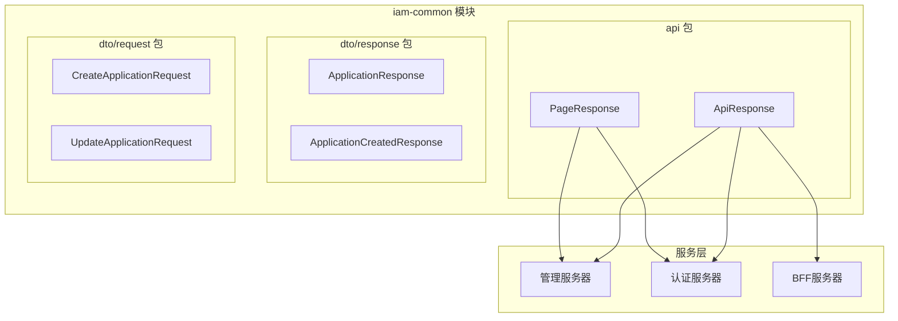
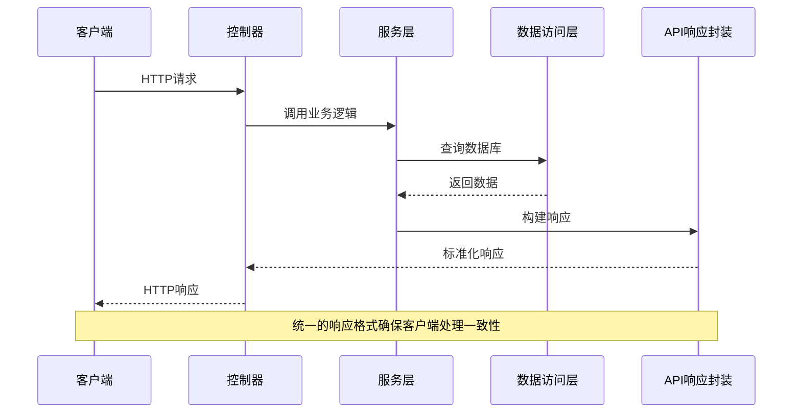
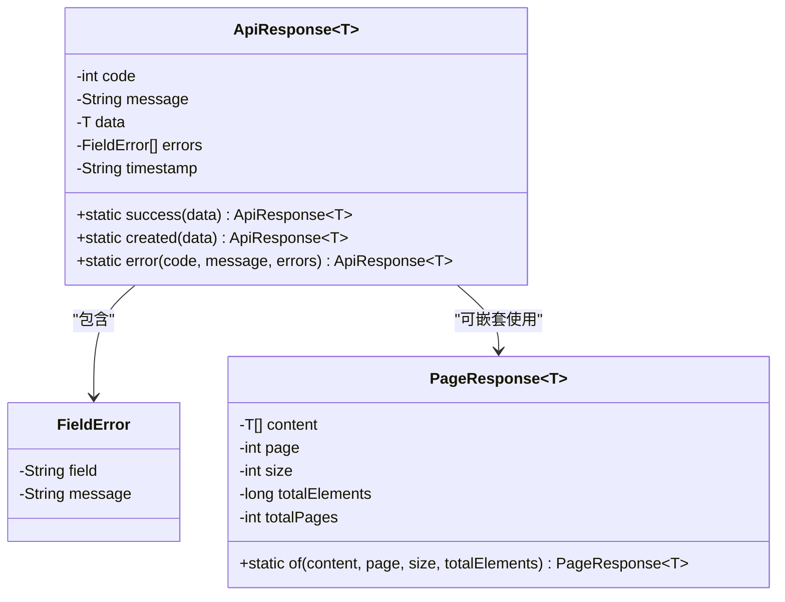
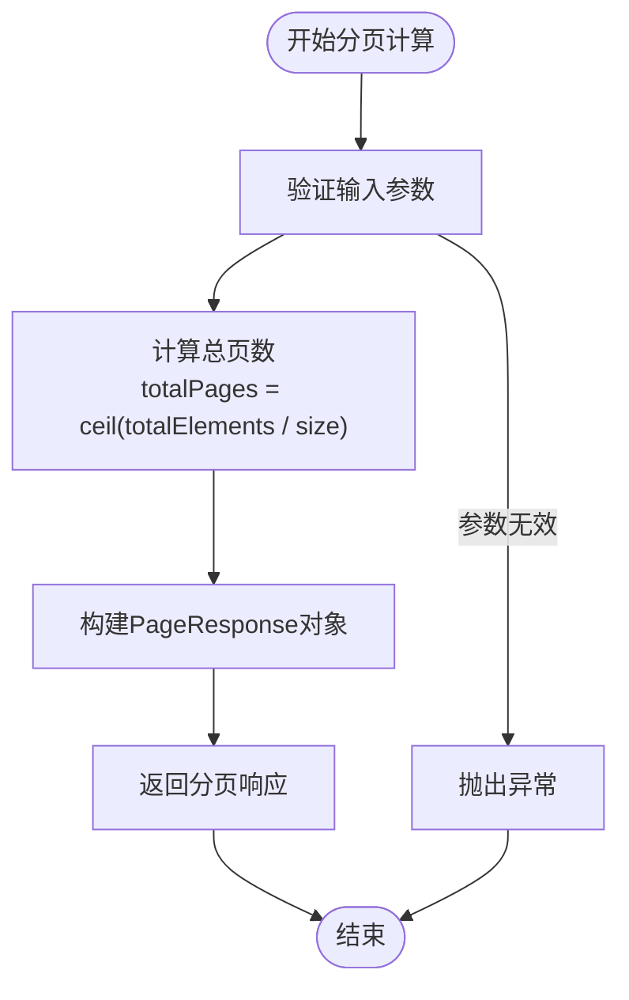
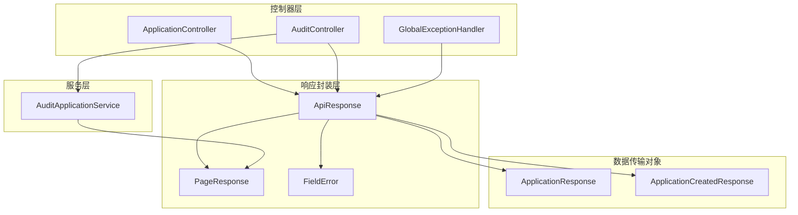
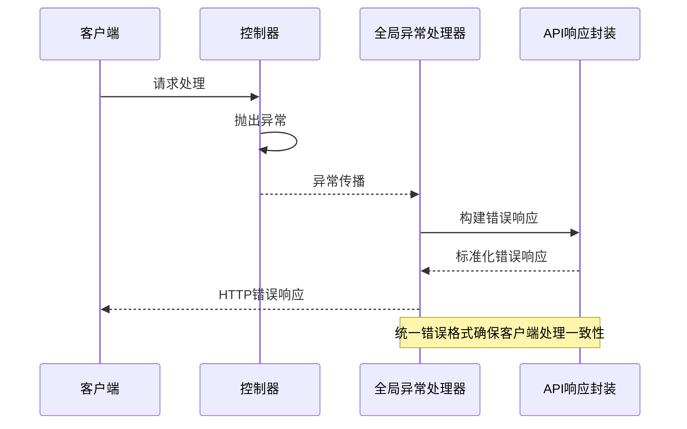

# API响应封装

<cite>
**本文档引用的文件**
- [ApiResponse.java](file://iam-common/src/main/java/iam/platform/common/api/ApiResponse.java)
- [PageResponse.java](file://iam-common/src/main/java/iam/platform/common/api/PageResponse.java)
- [GlobalExceptionHandler.java](file://iam-admin-server/src/main/java/iam/platform/admin/interfaces/rest/common/GlobalExceptionHandler.java)
- [ApplicationController.java](file://iam-admin-server/src/main/java/iam/platform/admin/interfaces/rest/ApplicationController.java)
- [AuditController.java](file://iam-admin-server/src/main/java/iam/platform/admin/interfaces/rest/AuditController.java)
- [AuditApplicationService.java](file://iam-admin-server/src/main/java/iam/platform/admin/application/service/AuditApplicationService.java)
- [ApplicationResponse.java](file://iam-common/src/main/java/iam/platform/common/dto/response/ApplicationResponse.java)
- [ApplicationCreatedResponse.java](file://iam-common/src/main/java/iam/platform/common/dto/response/ApplicationCreatedResponse.java)
</cite>

## 目录
1. [简介](#简介)
2. [项目结构](#项目结构)
3. [核心组件](#核心组件)
4. [架构概览](#架构概览)
5. [详细组件分析](#详细组件分析)
6. [依赖关系分析](#依赖关系分析)
7. [性能考虑](#性能考虑)
8. [故障排除指南](#故障排除指南)
9. [结论](#结论)

## 简介

API响应封装组件是IAM平台统一API响应格式的核心基础设施，旨在为整个微服务架构提供一致、标准化的HTTP响应格式。该组件通过ApiResponse和PageResponse两个核心类，实现了以下目标：

- **统一响应格式**：为所有API端点提供标准化的响应结构
- **类型安全**：利用泛型确保响应数据的类型安全性
- **错误处理**：提供结构化的错误信息和字段级验证错误支持
- **分页支持**：为大数据集查询提供标准的分页响应格式
- **序列化控制**：通过注解控制JSON序列化行为，避免不必要的字段输出

## 项目结构

API响应封装组件位于iam-common模块中，采用简洁而高效的设计模式：



**图表来源**
- [ApiResponse.java:1-61](file://iam-common/src/main/java/iam/platform/common/api/ApiResponse.java#L1-L61)
- [PageResponse.java:1-32](file://iam-common/src/main/java/iam/platform/common/api/PageResponse.java#L1-L32)

**章节来源**
- [ApiResponse.java:1-61](file://iam-common/src/main/java/iam/platform/common/api/ApiResponse.java#L1-L61)
- [PageResponse.java:1-32](file://iam-common/src/main/java/iam/platform/common/api/PageResponse.java#L1-L32)

## 核心组件

### ApiResponse<T> 类

ApiResponse是统一API响应格式的核心类，采用Builder模式和泛型设计，提供了类型安全的响应封装能力。

#### 设计特点

- **泛型支持**：通过`<T>`泛型参数支持任意类型的响应数据
- **Builder模式**：使用Lombok的@Builder注解简化对象构建
- **数据传输对象**：专门用于HTTP响应的数据传输

#### 字段设计详解

| 字段名 | 类型 | 是否必需 | 默认值 | 描述 | 使用场景 |
|--------|------|----------|--------|------|----------|
| code | int | 是 | - | HTTP状态码或业务状态码 | 标识请求处理结果状态 |
| message | String | 是 | - | 响应消息描述 | 提供人类可读的结果说明 |
| data | T | 否 | null | 实际响应数据 | 包含业务逻辑返回的具体数据 |
| errors | List<FieldError> | 否 | null | 错误列表 | 存储字段级验证错误信息 |
| timestamp | String | 是 | 当前时间 | ISO 8601格式的时间戳 | 记录响应生成时间 |

#### 静态工厂方法

ApiResponse提供了三种常用的静态工厂方法：

1. **success()**：用于成功响应，code固定为200
2. **created()**：用于资源创建成功，code固定为201  
3. **error()**：用于错误响应，支持自定义状态码和错误信息

**章节来源**
- [ApiResponse.java:18-60](file://iam-common/src/main/java/iam/platform/common/api/ApiResponse.java#L18-L60)

### PageResponse<T> 类

PageResponse专门用于分页查询的响应封装，提供了标准的分页数据格式。

#### 分页字段设计

| 字段名 | 类型 | 描述 | 使用场景 |
|--------|------|------|----------|
| content | List<T> | 分页数据内容 | 返回当前页面的具体数据项 |
| page | int | 当前页码（从0开始） | 标识用户当前查看的页面 |
| size | int | 每页大小 | 定义每页返回的数据条数 |
| totalElements | long | 总记录数 | 数据库中符合条件的总记录数 |
| totalPages | int | 总页数 | 基于总记录数计算得出的总页数 |

**章节来源**
- [PageResponse.java:14-31](file://iam-common/src/main/java/iam/platform/common/api/PageResponse.java#L14-L31)

## 架构概览

API响应封装组件在整个系统架构中扮演着关键角色，连接了控制器层、服务层和数据访问层：



**图表来源**
- [ApplicationController.java:38-45](file://iam-admin-server/src/main/java/iam/platform/admin/interfaces/rest/ApplicationController.java#L38-L45)
- [AuditController.java:36-38](file://iam-admin-server/src/main/java/iam/platform/admin/interfaces/rest/AuditController.java#L36-L38)

## 详细组件分析

### ApiResponse 类深度分析

#### 类结构设计



**图表来源**
- [ApiResponse.java:18-60](file://iam-common/src/main/java/iam/platform/common/api/ApiResponse.java#L18-L60)
- [PageResponse.java:14-31](file://iam-common/src/main/java/iam/platform/common/api/PageResponse.java#L14-L31)

#### FieldError 内部类分析

FieldError是ApiResponse的内部类，专门用于处理字段级验证错误：

- **field属性**：标识发生验证错误的具体字段名称
- **message属性**：包含详细的错误描述信息
- **不可变性**：通过Lombok生成的不可变数据类

这种设计使得前端可以精确地定位到具体表单字段的验证问题，提升用户体验。

**章节来源**
- [ApiResponse.java:52-59](file://iam-common/src/main/java/iam/platform/common/api/ApiResponse.java#L52-L59)

### PageResponse 分页响应分析

#### 分页算法实现

PageResponse的of静态方法实现了标准的分页计算逻辑：



**图表来源**
- [PageResponse.java:21-30](file://iam-common/src/main/java/iam/platform/common/api/PageResponse.java#L21-L30)

#### 分页使用场景

分页响应广泛应用于以下场景：
- 大数据量列表查询
- 审计日志浏览
- 用户管理界面
- 权限列表展示

**章节来源**
- [PageResponse.java:21-30](file://iam-common/src/main/java/iam/platform/common/api/PageResponse.java#L21-L30)

### 序列化控制机制

#### @JsonInclude 注解分析

ApiResponse类使用了`@JsonInclude(JsonInclude.Include.NON_NULL)`注解，这是序列化控制的关键机制：

```mermaid
graph LR
subgraph "序列化前"
A[code: 200]
B[message: "Success"]
C[data: null]
D[errors: null]
E[timestamp: "2024-01-01 12:00:00"]
end
subgraph "序列化后"
F[code: 200]
G[message: "Success"]
H[timestamp: "2024-01-01 12:00:00"]
end
C -.->|被忽略| I[]
D -.->|被忽略| J[]
A --> F
B --> G
E --> H
```

**图表来源**
- [ApiResponse.java:17-17](file://iam-common/src/main/java/iam/platform/common/api/ApiResponse.java#L17-L17)

这种设计策略的优势：
- **减少响应体积**：避免发送null值字段
- **保持向后兼容**：不改变已有字段的语义
- **提高传输效率**：降低网络带宽占用

**章节来源**
- [ApiResponse.java:17-17](file://iam-common/src/main/java/iam/platform/common/api/ApiResponse.java#L17-L17)

## 依赖关系分析

### 组件间依赖关系



**图表来源**
- [ApplicationController.java:24-24](file://iam-admin-server/src/main/java/iam/platform/admin/interfaces/rest/ApplicationController.java#L24-L24)
- [AuditController.java:36-38](file://iam-admin-server/src/main/java/iam/platform/admin/interfaces/rest/AuditController.java#L36-L38)
- [GlobalExceptionHandler.java:14-14](file://iam-admin-server/src/main/java/iam/platform/admin/interfaces/rest/common/GlobalExceptionHandler.java#L14-L14)

### 异常处理集成

全局异常处理器与API响应封装的集成展现了优雅的错误处理模式：



**图表来源**
- [GlobalExceptionHandler.java:24-29](file://iam-admin-server/src/main/java/iam/platform/admin/interfaces/rest/common/GlobalExceptionHandler.java#L24-L29)

**章节来源**
- [GlobalExceptionHandler.java:24-50](file://iam-admin-server/src/main/java/iam/platform/admin/interfaces/rest/common/GlobalExceptionHandler.java#L24-L50)

## 性能考虑

### 序列化优化

API响应封装组件在性能方面采用了多项优化策略：

1. **延迟初始化**：只有在需要时才创建响应对象
2. **内存复用**：使用Builder模式减少对象创建开销
3. **条件序列化**：通过@JsonInclude避免不必要的字段序列化

### 分页性能优化

PageResponse的分页计算采用数学优化：
- 使用`Math.ceil()`进行精确的页数计算
- 避免循环计算，直接基于总数和大小计算总页数

## 故障排除指南

### 常见问题及解决方案

#### 1. 响应格式不一致

**问题症状**：某些API端点返回的响应格式与其他端点不一致

**解决方案**：
- 确保所有控制器方法都返回ApiResponse包装的对象
- 检查是否遗漏了ApiResponse.success()或ApiResponse.error()的调用

#### 2. 分页数据不正确

**问题症状**：分页查询返回的totalPages或content数量不正确

**排查步骤**：
1. 检查数据库查询是否正确返回了总数
2. 验证PageRequest的page和size参数
3. 确认PageResponse.of()方法的参数传递

#### 3. 错误响应缺失

**问题症状**：验证错误没有返回具体的字段信息

**检查清单**：
1. 确认GlobalExceptionHandler正确处理了MethodArgumentNotValidException
2. 检查FieldError的构建是否包含正确的field和message
3. 验证@Valid注解是否正确应用在请求参数上

**章节来源**
- [GlobalExceptionHandler.java:31-42](file://iam-admin-server/src/main/java/iam/platform/admin/interfaces/rest/common/GlobalExceptionHandler.java#L31-L42)

## 结论

API响应封装组件通过ApiResponse和PageResponse两个核心类，成功实现了IAM平台的统一响应格式标准化。该组件具有以下显著优势：

### 设计优势
- **类型安全**：泛型设计确保编译时类型检查
- **扩展性强**：Builder模式便于添加新的响应类型
- **向后兼容**：@JsonInclude确保新旧版本的兼容性

### 实践价值
- **开发效率**：统一的响应格式减少了重复代码
- **维护成本**：集中式的错误处理降低了维护复杂度
- **用户体验**：标准化的响应格式提升了客户端处理体验

### 最佳实践建议
1. 在所有控制器方法中统一使用ApiResponse包装响应
2. 对于分页查询，优先使用PageResponse标准格式
3. 错误处理应遵循统一的错误响应规范
4. 定期审查和优化响应数据的序列化策略

该组件为整个IAM平台的API生态系统奠定了坚实的基础，确保了系统的整体一致性和可维护性。