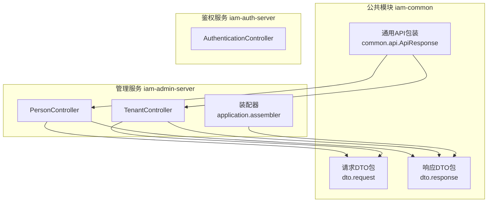
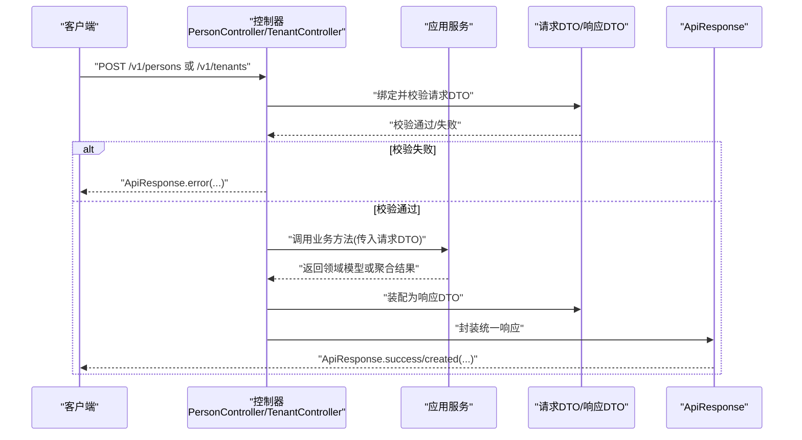
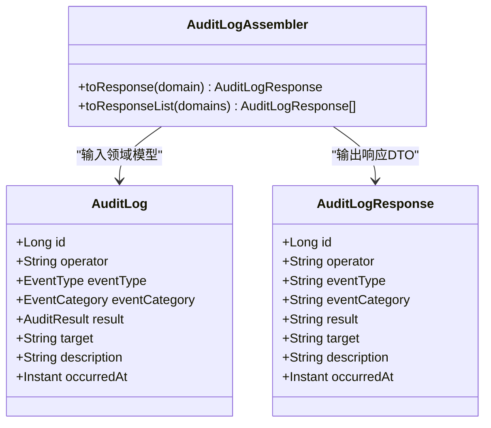
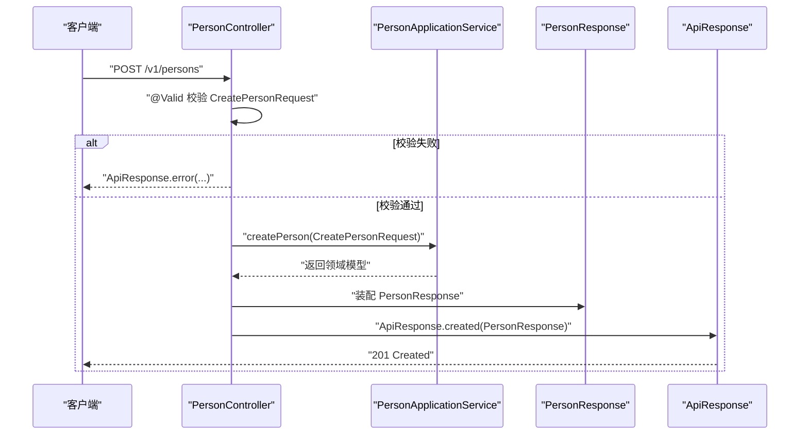
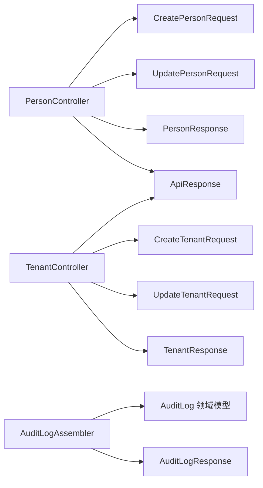

# DTO数据传输对象

<cite>
**本文引用的文件**
- [CreatePersonRequest.java](file://iam-common/src/main/java/iam/platform/common/dto/request/CreatePersonRequest.java)
- [UpdatePersonRequest.java](file://iam-common/src/main/java/iam/platform/common/dto/request/UpdatePersonRequest.java)
- [PersonResponse.java](file://iam-common/src/main/java/iam/platform/common/dto/response/PersonResponse.java)
- [CreateTenantRequest.java](file://iam-common/src/main/java/iam/platform/common/dto/request/CreateTenantRequest.java)
- [UpdateTenantRequest.java](file://iam-common/src/main/java/iam/platform/common/dto/request/UpdateTenantRequest.java)
- [TenantResponse.java](file://iam-common/src/main/java/iam/platform/common/dto/response/TenantResponse.java)
- [CreateApplicationRequest.java](file://iam-common/src/main/java/iam/platform/common/dto/request/CreateApplicationRequest.java)
- [ApplicationResponse.java](file://iam-common/src/main/java/iam/platform/common/dto/response/ApplicationResponse.java)
- [TenantAccountResponse.java](file://iam-common/src/main/java/iam/platform/common/dto/response/TenantAccountResponse.java)
- [UpdateTenantAccountRequest.java](file://iam-common/src/main/java/iam/platform/common/dto/request/UpdateTenantAccountRequest.java)
- [ApiResponse.java](file://iam-common/src/main/java/iam/platform/common/api/ApiResponse.java)
- [PersonController.java](file://iam-admin-server/src/main/java/iam/platform/admin/interfaces/rest/PersonController.java)
- [TenantController.java](file://iam-admin-server/src/main/java/iam/platform/admin/interfaces/rest/TenantController.java)
- [AuditLogAssembler.java](file://iam-admin-server/src/main/java/iam/platform/admin/application/assembler/AuditLogAssembler.java)
</cite>

## 目录
1. [引言](#引言)
2. [项目结构](#项目结构)
3. [核心组件](#核心组件)
4. [架构总览](#架构总览)
5. [详细组件分析](#详细组件分析)
6. [依赖分析](#依赖分析)
7. [性能考量](#性能考量)
8. [故障排查指南](#故障排查指南)
9. [结论](#结论)
10. [附录](#附录)

## 引言
本文件系统性阐述IAM平台中DTO（数据传输对象）的设计与实践，重点覆盖以下方面：
- DTO在微服务架构中的作用：隔离API边界、封装请求/响应契约、统一错误返回格式。
- 请求DTO与响应DTO的设计原则：字段命名规范、数据校验注解、业务逻辑分离。
- 典型请求DTO（如CreatePersonRequest、UpdateTenantRequest）的参数与校验规则。
- 典型响应DTO（如PersonResponse、TenantResponse）的数据映射与序列化策略。
- DTO与领域模型的差异与转换机制（装配器MapStruct）。
- 版本管理与向后兼容性建议。
- 在服务间传递数据时的使用示例与API边界验证、安全注意事项。

## 项目结构
DTO位于公共模块iam-common中，按“请求/响应”分包组织；控制器位于各业务服务模块（iam-admin-server、iam-auth-server），通过请求DTO接收输入，应用服务处理后返回响应DTO；公共API包装类ApiResponse统一输出格式。

图表来源
- [PersonController.java:1-68](file://iam-admin-server/src/main/java/iam/platform/admin/interfaces/rest/PersonController.java#L1-L68)
- [TenantController.java:1-90](file://iam-admin-server/src/main/java/iam/platform/admin/interfaces/rest/TenantController.java#L1-L90)
- [ApiResponse.java:1-61](file://iam-common/src/main/java/iam/platform/common/api/ApiResponse.java#L1-L61)

章节来源
- [PersonController.java:1-68](file://iam-admin-server/src/main/java/iam/platform/admin/interfaces/rest/PersonController.java#L1-L68)
- [TenantController.java:1-90](file://iam-admin-server/src/main/java/iam/platform/admin/interfaces/rest/TenantController.java#L1-L90)
- [ApiResponse.java:1-61](file://iam-common/src/main/java/iam/platform/common/api/ApiResponse.java#L1-L61)

## 核心组件
- 请求DTO：封装客户端提交的输入数据，包含字段约束与格式校验，确保进入应用层前的数据质量。
- 响应DTO：封装对外输出的数据结构，聚焦展示所需字段，避免泄露领域模型细节。
- API包装类：统一响应结构（状态码、消息、时间戳、数据体、错误列表），便于前端与网关消费。

章节来源
- [CreatePersonRequest.java:1-37](file://iam-common/src/main/java/iam/platform/common/dto/request/CreatePersonRequest.java#L1-L37)
- [UpdatePersonRequest.java:1-30](file://iam-common/src/main/java/iam/platform/common/dto/request/UpdatePersonRequest.java#L1-L30)
- [PersonResponse.java:1-30](file://iam-common/src/main/java/iam/platform/common/dto/response/PersonResponse.java#L1-L30)
- [CreateTenantRequest.java:1-43](file://iam-common/src/main/java/iam/platform/common/dto/request/CreateTenantRequest.java#L1-L43)
- [UpdateTenantRequest.java:1-34](file://iam-common/src/main/java/iam/platform/common/dto/request/UpdateTenantRequest.java#L1-L34)
- [TenantResponse.java:1-27](file://iam-common/src/main/java/iam/platform/common/dto/response/TenantResponse.java#L1-L27)
- [CreateApplicationRequest.java:1-44](file://iam-common/src/main/java/iam/platform/common/dto/request/CreateApplicationRequest.java#L1-L44)
- [ApplicationResponse.java:1-34](file://iam-common/src/main/java/iam/platform/common/dto/response/ApplicationResponse.java#L1-L34)
- [TenantAccountResponse.java:1-30](file://iam-common/src/main/java/iam/platform/common/dto/response/TenantAccountResponse.java#L1-L30)
- [UpdateTenantAccountRequest.java:1-23](file://iam-common/src/main/java/iam/platform/common/dto/request/UpdateTenantAccountRequest.java#L1-L23)
- [ApiResponse.java:1-61](file://iam-common/src/main/java/iam/platform/common/api/ApiResponse.java#L1-L61)

## 架构总览
下图展示了从HTTP请求到应用服务再到响应DTO的整体流程，以及公共API包装的统一输出。

图表来源
- [PersonController.java:33-51](file://iam-admin-server/src/main/java/iam/platform/admin/interfaces/rest/PersonController.java#L33-L51)
- [TenantController.java:34-55](file://iam-admin-server/src/main/java/iam/platform/admin/interfaces/rest/TenantController.java#L34-L55)
- [ApiResponse.java:25-50](file://iam-common/src/main/java/iam/platform/common/api/ApiResponse.java#L25-L50)

## 详细组件分析

### 请求DTO设计原则与示例
- 字段命名规范：采用驼峰命名，语义明确，避免缩写。
- 数据校验注解：使用Jakarta Validation标准注解，覆盖必填、长度、格式、范围、时间等。
- 业务逻辑分离：请求DTO仅承载输入约束，不包含业务行为；具体业务规则由应用服务实现。

示例要点（以CreatePersonRequest为例）：
- 用户名：必填且长度限制，防止过短或过长。
- 邮箱：必填且邮箱格式校验。
- 密码：必填且长度限制，保障最小强度。
- 手机号/昵称/头像URL：可选但有长度上限，避免异常数据。

章节来源
- [CreatePersonRequest.java:16-29](file://iam-common/src/main/java/iam/platform/common/dto/request/CreatePersonRequest.java#L16-L29)

示例要点（以UpdateTenantRequest为例）：
- 租户名称：长度范围校验。
- 最大用户数：最小值校验。
- 联系邮箱：格式校验。
- 到期时间：未来时间校验。
- 联系电话：长度限制。

章节来源
- [UpdateTenantRequest.java:19-32](file://iam-common/src/main/java/iam/platform/common/dto/request/UpdateTenantRequest.java#L19-L32)

示例要点（以CreateApplicationRequest为例）：
- 应用名称：必填。
- 租户ID：必填。
- 应用类型：必填。
- 回调地址与允许作用域：非空集合校验。
- 安全开关：PKCE、授权同意等布尔字段。

章节来源
- [CreateApplicationRequest.java:18-42](file://iam-common/src/main/java/iam/platform/common/dto/request/CreateApplicationRequest.java#L18-L42)

### 响应DTO设计原则与示例
- 字段选择：仅暴露对外展示所需字段，隐藏内部标识、敏感信息或实现细节。
- 时间字段：统一使用LocalDateTime等类型，便于序列化与跨语言消费。
- 结构稳定：保持字段顺序与命名稳定，便于前端适配。

示例要点（以PersonResponse为例）：
- 基础信息：id、personCode、username、email、phone、nickname、avatarUrl。
- 状态与时间：emailVerified、phoneVerified、enabled、accountLocked、lastLoginAt、createdAt、updatedAt。

章节来源
- [PersonResponse.java:15-29](file://iam-common/src/main/java/iam/platform/common/dto/response/PersonResponse.java#L15-L29)

示例要点（以TenantResponse为例）：
- 基础信息：id、tenantCode、tenantName、status、maxUsers、currentUsers、contactEmail、contactPhone、expiresAt。
- 时间字段：createdAt、updatedAt。

章节来源
- [TenantResponse.java:15-26](file://iam-common/src/main/java/iam/platform/common/dto/response/TenantResponse.java#L15-L26)

示例要点（以ApplicationResponse为例）：
- 基础信息：appId、appName、tenantId、appType、description、logoUrl、status、homePageUrl。
- 安全配置：callbackUrls、postLogoutRedirectUris、allowedScopes、requirePkce、requireAuthorizationConsent。
- 开关与时间：enabled、createdAt、updatedAt。

章节来源
- [ApplicationResponse.java:15-33](file://iam-common/src/main/java/iam/platform/common/dto/response/ApplicationResponse.java#L15-L33)

示例要点（以TenantAccountResponse为例）：
- 关联标识：personId、tenantId、tenantCode、tenantName、accountCode。
- 人员信息：employeeNo、joinedAt、leftAt、preferredLanguage、timezone。
- 时间字段：createdAt、updatedAt。

章节来源
- [TenantAccountResponse.java:15-29](file://iam-common/src/main/java/iam/platform/common/dto/response/TenantAccountResponse.java#L15-L29)

### DTO与领域模型的差异与转换机制
- 差异：DTO是API边界的数据载体，强调可序列化与约束；领域模型承载业务状态与行为。
- 转换：通过装配器（MapStruct）将领域模型映射为响应DTO，同时进行枚举转字符串、空值表达式等处理，保证输出一致与安全。

图表来源
- [AuditLogAssembler.java:10-22](file://iam-admin-server/src/main/java/iam/platform/admin/application/assembler/AuditLogAssembler.java#L10-L22)

章节来源
- [AuditLogAssembler.java:1-23](file://iam-admin-server/src/main/java/iam/platform/admin/application/assembler/AuditLogAssembler.java#L1-L23)

### 版本管理与向后兼容性
- 版本策略：在REST路径中引入版本号（如/v1），便于后续演进。
- 向后兼容：新增字段采用可选策略，避免破坏现有客户端；变更字段需通过新版本端点发布。
- 示例参考：控制器路径均采用/v1前缀，便于后续扩展。

章节来源
- [PersonController.java](file://iam-admin-server/src/main/java/iam/platform/admin/interfaces/rest/PersonController.java#L26)
- [TenantController.java](file://iam-admin-server/src/main/java/iam/platform/admin/interfaces/rest/TenantController.java#L27)

### 实际使用示例与最佳实践
- 控制器接收请求DTO并进行校验，失败时返回统一错误结构；成功则调用应用服务并返回响应DTO。
- 使用ApiResponse统一封装响应，包含状态码、消息、时间戳与数据体，便于前端与网关处理。

图表来源
- [PersonController.java:33-38](file://iam-admin-server/src/main/java/iam/platform/admin/interfaces/rest/PersonController.java#L33-L38)
- [ApiResponse.java:34-41](file://iam-common/src/main/java/iam/platform/common/api/ApiResponse.java#L34-L41)

章节来源
- [PersonController.java:33-51](file://iam-admin-server/src/main/java/iam/platform/admin/interfaces/rest/PersonController.java#L33-L51)
- [ApiResponse.java:25-50](file://iam-common/src/main/java/iam/platform/common/api/ApiResponse.java#L25-L50)

## 依赖分析
- 控制器依赖请求DTO与响应DTO，并通过应用服务协调业务。
- 装配器依赖领域模型与响应DTO，负责映射与转换。
- ApiResponse作为统一输出，被所有控制器使用。

图表来源
- [PersonController.java:18-21](file://iam-admin-server/src/main/java/iam/platform/admin/interfaces/rest/PersonController.java#L18-L21)
- [TenantController.java:18-21](file://iam-admin-server/src/main/java/iam/platform/admin/interfaces/rest/TenantController.java#L18-L21)
- [AuditLogAssembler.java:10-19](file://iam-admin-server/src/main/java/iam/platform/admin/application/assembler/AuditLogAssembler.java#L10-L19)

章节来源
- [PersonController.java:1-68](file://iam-admin-server/src/main/java/iam/platform/admin/interfaces/rest/PersonController.java#L1-L68)
- [TenantController.java:1-90](file://iam-admin-server/src/main/java/iam/platform/admin/interfaces/rest/TenantController.java#L1-L90)
- [AuditLogAssembler.java:1-23](file://iam-admin-server/src/main/java/iam/platform/admin/application/assembler/AuditLogAssembler.java#L1-L23)

## 性能考量
- DTO体积控制：仅包含必要字段，避免过度序列化大对象。
- 校验前置：在控制器层尽早失败，减少无效调用链开销。
- 装配器复用：MapStruct生成代码，避免手写映射带来的重复与性能损耗。
- 分页与列表：响应DTO支持分页包装，降低一次性传输大量数据的成本。

## 故障排查指南
- 参数校验失败：检查请求DTO上的校验注解是否满足要求（必填、长度、格式、范围、时间）。
- 统一错误响应：使用ApiResponse.error携带错误列表，定位具体字段问题。
- 装配器映射异常：确认领域模型与响应DTO字段映射关系，特别是枚举与空值处理。

章节来源
- [ApiResponse.java:43-50](file://iam-common/src/main/java/iam/platform/common/api/ApiResponse.java#L43-L50)
- [AuditLogAssembler.java:13-18](file://iam-admin-server/src/main/java/iam/platform/admin/application/assembler/AuditLogAssembler.java#L13-L18)

## 结论
DTO在本项目中承担了清晰的API边界职责：请求DTO确保输入质量，响应DTO保证输出一致性，装配器实现领域模型与DTO的解耦转换，统一的ApiResponse提升跨服务交互的稳定性与可观测性。遵循本文的设计原则与最佳实践，可在微服务架构中高效、安全地传递数据。

## 附录
- 字段命名与校验清单（示例）
  - 必填字段：使用@NotBlank/@NotNull。
  - 长度限制：使用@Size(min=..., max=...)。
  - 格式校验：使用@Email、@Pattern等。
  - 数值范围：使用@Min、@Max等。
  - 时间约束：使用@Future、@Past等。
- 版本演进建议
  - 新增字段默认可选，旧字段保持不变。
  - 重大变更通过新版本端点发布，保留旧版本一段时间以便迁移。
- 安全与验证
  - 在API边界进行严格校验，避免脏数据进入应用层。
  - 对敏感字段（如密码）不在响应DTO中返回，避免泄露。
  - 使用统一错误格式，便于日志与监控系统采集。