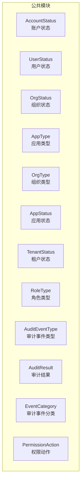
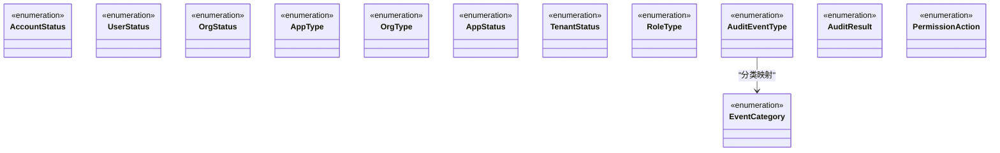
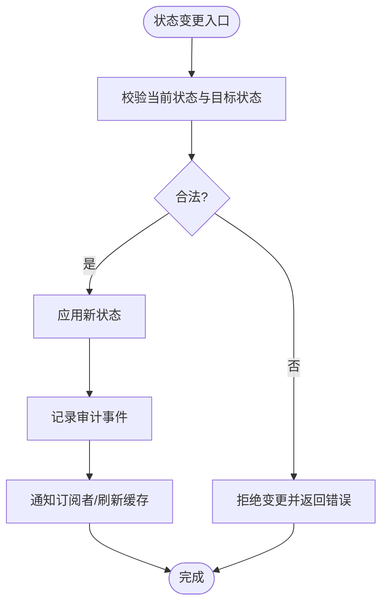
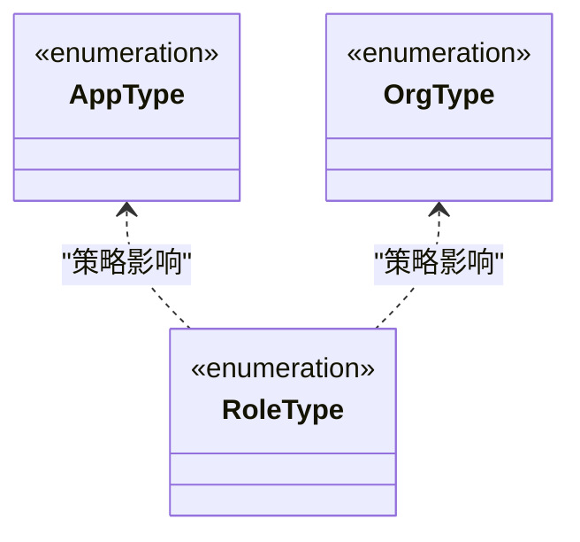
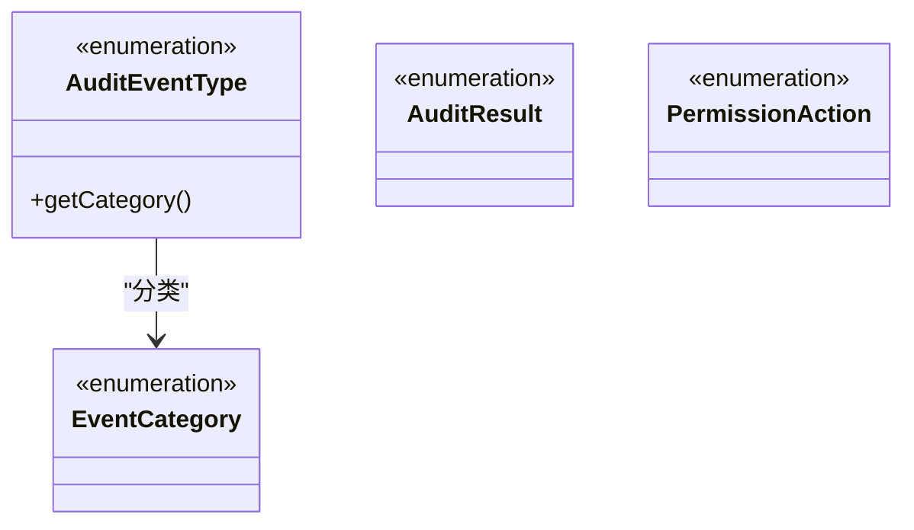
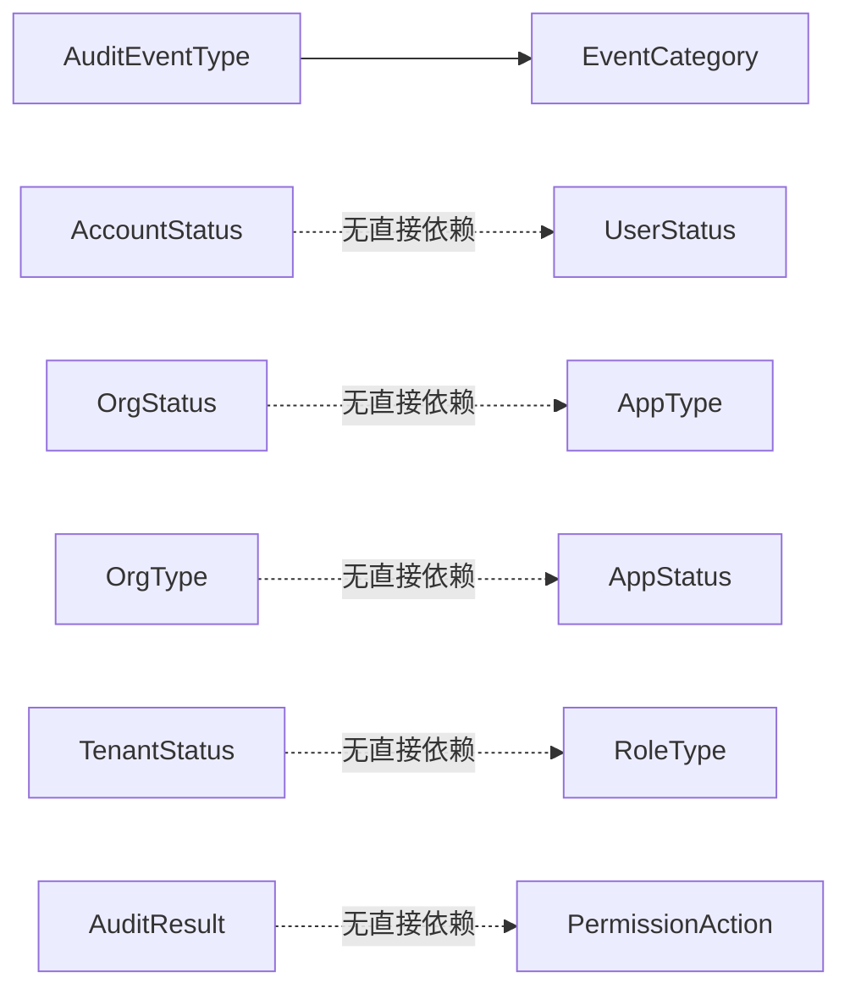

# 业务枚举类型

<cite>
**本文引用的文件**
- [AccountStatus.java](file://iam-common/src/main/java/iam/platform/common/model/enums/AccountStatus.java)
- [UserStatus.java](file://iam-common/src/main/java/iam/platform/common/model/enums/UserStatus.java)
- [OrgStatus.java](file://iam-common/src/main/java/iam/platform/common/model/enums/OrgStatus.java)
- [AppType.java](file://iam-common/src/main/java/iam/platform/common/model/enums/AppType.java)
- [OrgType.java](file://iam-common/src/main/java/iam/platform/common/model/enums/OrgType.java)
- [AppStatus.java](file://iam-common/src/main/java/iam/platform/common/model/enums/AppStatus.java)
- [TenantStatus.java](file://iam-common/src/main/java/iam/platform/common/model/enums/TenantStatus.java)
- [RoleType.java](file://iam-common/src/main/java/iam/platform/common/model/enums/RoleType.java)
- [AuditEventType.java](file://iam-common/src/main/java/iam/platform/common/model/enums/AuditEventType.java)
- [AuditResult.java](file://iam-common/src/main/java/iam/platform/common/model/enums/AuditResult.java)
- [EventCategory.java](file://iam-common/src/main/java/iam/platform/common/model/enums/EventCategory.java)
- [PermissionAction.java](file://iam-common/src/main/java/iam/platform/common/model/enums/PermissionAction.java)
</cite>

## 目录
1. [引言](#引言)
2. [项目结构](#项目结构)
3. [核心组件](#核心组件)
4. [架构总览](#架构总览)
5. [详细组件分析](#详细组件分析)
6. [依赖分析](#依赖分析)
7. [性能考量](#性能考量)
8. [故障排查指南](#故障排查指南)
9. [结论](#结论)
10. [附录](#附录)

## 引言
本文件聚焦于 IAM 平台中“业务枚举类型”的设计与使用，系统梳理账户、用户、组织、应用、租户、角色、审计与权限等关键枚举的取值语义、分类维度与业务场景；并结合现有代码库中的枚举实现，说明其在领域模型中的职责边界与协作关系。由于仓库未包含显式的国际化与本地化实现代码，本文件不提供该方面的具体实现细节，仅给出可落地的实践建议与注意事项。

## 项目结构
业务枚举集中位于公共模块 iam-common 的枚举包中，采用按“领域实体”分组的方式组织，便于跨服务复用与统一治理。各枚举文件彼此独立，无循环依赖，符合高内聚低耦合的设计原则。

**图表来源**
- [AccountStatus.java:1-6](file://iam-common/src/main/java/iam/platform/common/model/enums/AccountStatus.java#L1-L6)
- [UserStatus.java:1-8](file://iam-common/src/main/java/iam/platform/common/model/enums/UserStatus.java#L1-L8)
- [OrgStatus.java:1-6](file://iam-common/src/main/java/iam/platform/common/model/enums/OrgStatus.java#L1-L6)
- [AppType.java:1-6](file://iam-common/src/main/java/iam/platform/common/model/enums/AppType.java#L1-L6)
- [OrgType.java:1-6](file://iam-common/src/main/java/iam/platform/common/model/enums/OrgType.java#L1-L6)
- [AppStatus.java:1-6](file://iam-common/src/main/java/iam/platform/common/model/enums/AppStatus.java#L1-L6)
- [TenantStatus.java:1-6](file://iam-common/src/main/java/iam/platform/common/model/enums/TenantStatus.java#L1-L6)
- [RoleType.java:1-7](file://iam-common/src/main/java/iam/platform/common/model/enums/RoleType.java#L1-L7)
- [AuditEventType.java:1-59](file://iam-common/src/main/java/iam/platform/common/model/enums/AuditEventType.java#L1-L59)
- [AuditResult.java:1-9](file://iam-common/src/main/java/iam/platform/common/model/enums/AuditResult.java#L1-L9)
- [EventCategory.java:1-13](file://iam-common/src/main/java/iam/platform/common/model/enums/EventCategory.java#L1-L13)
- [PermissionAction.java:1-6](file://iam-common/src/main/java/iam/platform/common/model/enums/PermissionAction.java#L1-L6)

**章节来源**
- [AccountStatus.java:1-6](file://iam-common/src/main/java/iam/platform/common/model/enums/AccountStatus.java#L1-L6)
- [UserStatus.java:1-8](file://iam-common/src/main/java/iam/platform/common/model/enums/UserStatus.java#L1-L8)
- [OrgStatus.java:1-6](file://iam-common/src/main/java/iam/platform/common/model/enums/OrgStatus.java#L1-L6)
- [AppType.java:1-6](file://iam-common/src/main/java/iam/platform/common/model/enums/AppType.java#L1-L6)
- [OrgType.java:1-6](file://iam-common/src/main/java/iam/platform/common/model/enums/OrgType.java#L1-L6)
- [AppStatus.java:1-6](file://iam-common/src/main/java/iam/platform/common/model/enums/AppStatus.java#L1-L6)
- [TenantStatus.java:1-6](file://iam-common/src/main/java/iam/platform/common/model/enums/TenantStatus.java#L1-L6)
- [RoleType.java:1-7](file://iam-common/src/main/java/iam/platform/common/model/enums/RoleType.java#L1-L7)
- [AuditEventType.java:1-59](file://iam-common/src/main/java/iam/platform/common/model/enums/AuditEventType.java#L1-L59)
- [AuditResult.java:1-9](file://iam-common/src/main/java/iam/platform/common/model/enums/AuditResult.java#L1-L9)
- [EventCategory.java:1-13](file://iam-common/src/main/java/iam/platform/common/model/enums/EventCategory.java#L1-L13)
- [PermissionAction.java:1-6](file://iam-common/src/main/java/iam/platform/common/model/enums/PermissionAction.java#L1-L6)

## 核心组件
本节对关键业务枚举进行逐项说明，涵盖取值含义、典型业务场景与使用建议。

- 账户状态（AccountStatus）
  - 取值：ACTIVE、SUSPENDED、LEFT
  - 含义：账户处于启用、停用、离职态
  - 典型场景：账户生命周期管理、登录授权前置校验
  - 使用建议：与用户状态联动，避免状态不一致

- 用户状态（UserStatus）
  - 取值：ACTIVE、INACTIVE、LOCKED
  - 含义：用户处于启用、未激活、锁定态
  - 典型场景：登录安全控制、账号治理
  - 使用建议：锁定策略与审计事件联动

- 组织状态（OrgStatus）
  - 取值：ACTIVE、INACTIVE
  - 含义：组织处于启用或停用
  - 典型场景：组织禁用后限制关联资源访问
  - 使用建议：与组织层级变更配合使用

- 应用类型（AppType）
  - 取值：WEB、MOBILE、API、THIRD_PARTY
  - 含义：应用形态划分（网页、移动端、内部 API、第三方集成）
  - 典型场景：协议适配、权限策略差异化
  - 使用建议：与认证协议路由策略结合

- 组织类型（OrgType）
  - 取值：COMPANY、DEPARTMENT、TEAM
  - 含义：组织层级类型
  - 典型场景：组织树构建、权限继承规则
  - 使用建议：类型与权限模型耦合度较高，需谨慎扩展

- 应用状态（AppStatus）
  - 取值：ACTIVE、INACTIVE、REVIEWING、BLOCKED
  - 含义：应用启用、停用、审核中、封禁
  - 典型场景：应用上线审批、违规处置
  - 使用建议：与审核流程集成，避免状态漂移

- 租户状态（TenantStatus）
  - 取值：ACTIVE、SUSPENDED、DELETED
  - 含义：租户启用、停用、删除
  - 典型场景：多租户隔离与清理
  - 使用建议：删除前确保数据归档与迁移

- 角色类型（RoleType）
  - 取值：SYSTEM、TENANT_CUSTOM
  - 含义：系统内置角色、租户自定义角色
  - 典型场景：权限基线与租户扩展
  - 使用建议：内置角色不可删除，自定义角色可回收

- 审计事件类型（AuditEventType）
  - 分类：认证、授权、账户、管理、会话
  - 含义：事件分类到具体动作的映射
  - 典型场景：审计日志分类检索、统计报表
  - 使用建议：事件类型与分类解耦，利于扩展

- 审计结果（AuditResult）
  - 取值：SUCCESS、FAILURE
  - 含义：事件执行结果
  - 典型场景：审计统计、告警触发
  - 使用建议：与事件类型配套记录

- 权限动作（PermissionAction）
  - 取值：READ、WRITE、DELETE、EXPORT、APPROVE、EXECUTE
  - 含义：资源操作动作集合
  - 典型场景：细粒度权限控制
  - 使用建议：动作组合与资源类型绑定

**章节来源**
- [AccountStatus.java:1-6](file://iam-common/src/main/java/iam/platform/common/model/enums/AccountStatus.java#L1-L6)
- [UserStatus.java:1-8](file://iam-common/src/main/java/iam/platform/common/model/enums/UserStatus.java#L1-L8)
- [OrgStatus.java:1-6](file://iam-common/src/main/java/iam/platform/common/model/enums/OrgStatus.java#L1-L6)
- [AppType.java:1-6](file://iam-common/src/main/java/iam/platform/common/model/enums/AppType.java#L1-L6)
- [OrgType.java:1-6](file://iam-common/src/main/java/iam/platform/common/model/enums/OrgType.java#L1-L6)
- [AppStatus.java:1-6](file://iam-common/src/main/java/iam/platform/common/model/enums/AppStatus.java#L1-L6)
- [TenantStatus.java:1-6](file://iam-common/src/main/java/iam/platform/common/model/enums/TenantStatus.java#L1-L6)
- [RoleType.java:1-7](file://iam-common/src/main/java/iam/platform/common/model/enums/RoleType.java#L1-L7)
- [AuditEventType.java:1-59](file://iam-common/src/main/java/iam/platform/common/model/enums/AuditEventType.java#L1-L59)
- [AuditResult.java:1-9](file://iam-common/src/main/java/iam/platform/common/model/enums/AuditResult.java#L1-L9)
- [EventCategory.java:1-13](file://iam-common/src/main/java/iam/platform/common/model/enums/EventCategory.java#L1-L13)
- [PermissionAction.java:1-6](file://iam-common/src/main/java/iam/platform/common/model/enums/PermissionAction.java#L1-L6)

## 架构总览
从领域模型视角看，业务枚举承担“状态与分类”的稳定契约，贯穿认证授权、资源管理、审计追踪等子域。下图展示了主要枚举之间的关系与职责边界。

**图表来源**
- [AuditEventType.java:1-59](file://iam-common/src/main/java/iam/platform/common/model/enums/AuditEventType.java#L1-L59)
- [EventCategory.java:1-13](file://iam-common/src/main/java/iam/platform/common/model/enums/EventCategory.java#L1-L13)

## 详细组件分析

### 状态枚举：账户、用户、组织、应用、租户
- 设计原则
  - 单一职责：每个状态枚举仅表达一个维度的状态
  - 语义清晰：取值名称直接反映业务含义
  - 可扩展：预留中间态（如应用的审核中）以支持流程演进
- 使用建议
  - 状态机约束：通过领域服务或策略对象控制状态流转合法性
  - 与审计联动：状态变更应伴随审计事件记录
  - 与前端交互：状态值应与 UI 层的视觉提示保持一致

**章节来源**
- [AccountStatus.java:1-6](file://iam-common/src/main/java/iam/platform/common/model/enums/AccountStatus.java#L1-L6)
- [UserStatus.java:1-8](file://iam-common/src/main/java/iam/platform/common/model/enums/UserStatus.java#L1-L8)
- [OrgStatus.java:1-6](file://iam-common/src/main/java/iam/platform/common/model/enums/OrgStatus.java#L1-L6)
- [AppStatus.java:1-6](file://iam-common/src/main/java/iam/platform/common/model/enums/AppStatus.java#L1-L6)
- [TenantStatus.java:1-6](file://iam-common/src/main/java/iam/platform/common/model/enums/TenantStatus.java#L1-L6)

### 分类枚举：应用类型、组织类型、角色类型
- 设计原则
  - 分类明确：类型之间互斥且覆盖主要业务形态
  - 扩展可控：新增类型需评估对协议、策略与 UI 的影响
- 使用建议
  - 协议适配：应用类型决定认证协议与端点策略
  - 权限模型：组织类型与角色类型共同决定权限继承与覆盖规则

**图表来源**
- [AppType.java:1-6](file://iam-common/src/main/java/iam/platform/common/model/enums/AppType.java#L1-L6)
- [OrgType.java:1-6](file://iam-common/src/main/java/iam/platform/common/model/enums/OrgType.java#L1-L6)
- [RoleType.java:1-7](file://iam-common/src/main/java/iam/platform/common/model/enums/RoleType.java#L1-L7)

**章节来源**
- [AppType.java:1-6](file://iam-common/src/main/java/iam/platform/common/model/enums/AppType.java#L1-L6)
- [OrgType.java:1-6](file://iam-common/src/main/java/iam/platform/common/model/enums/OrgType.java#L1-L6)
- [RoleType.java:1-7](file://iam-common/src/main/java/iam/platform/common/model/enums/RoleType.java#L1-L7)

### 审计与权限枚举
- 审计事件类型与分类
  - 事件类型覆盖认证、授权、账户、管理、会话五大类
  - 通过分类字段实现事件类型的二次聚合
- 权限动作
  - 动作集合面向资源操作的最小粒度
  - 建议与资源类型、角色类型形成“动作矩阵”

**图表来源**
- [AuditEventType.java:1-59](file://iam-common/src/main/java/iam/platform/common/model/enums/AuditEventType.java#L1-L59)
- [EventCategory.java:1-13](file://iam-common/src/main/java/iam/platform/common/model/enums/EventCategory.java#L1-L13)
- [AuditResult.java:1-9](file://iam-common/src/main/java/iam/platform/common/model/enums/AuditResult.java#L1-L9)
- [PermissionAction.java:1-6](file://iam-common/src/main/java/iam/platform/common/model/enums/PermissionAction.java#L1-L6)

**章节来源**
- [AuditEventType.java:1-59](file://iam-common/src/main/java/iam/platform/common/model/enums/AuditEventType.java#L1-L59)
- [EventCategory.java:1-13](file://iam-common/src/main/java/iam/platform/common/model/enums/EventCategory.java#L1-L13)
- [AuditResult.java:1-9](file://iam-common/src/main/java/iam/platform/common/model/enums/AuditResult.java#L1-L9)
- [PermissionAction.java:1-6](file://iam-common/src/main/java/iam/platform/common/model/enums/PermissionAction.java#L1-L6)

## 依赖分析
- 内部依赖
  - 审计事件类型依赖事件分类，形成“事件-分类”映射关系
  - 其他枚举彼此独立，无直接依赖
- 外部依赖
  - 本仓库未发现显式的 JSON 序列化/反序列化配置文件，因此无法确认枚举在 API 中的具体序列化策略
  - 若需在 API 中使用，建议在 DTO 或实体层通过标准库或注解实现序列化映射

**图表来源**
- [AuditEventType.java:1-59](file://iam-common/src/main/java/iam/platform/common/model/enums/AuditEventType.java#L1-L59)
- [EventCategory.java:1-13](file://iam-common/src/main/java/iam/platform/common/model/enums/EventCategory.java#L1-L13)
- [AccountStatus.java:1-6](file://iam-common/src/main/java/iam/platform/common/model/enums/AccountStatus.java#L1-L6)
- [UserStatus.java:1-8](file://iam-common/src/main/java/iam/platform/common/model/enums/UserStatus.java#L1-L8)
- [OrgStatus.java:1-6](file://iam-common/src/main/java/iam/platform/common/model/enums/OrgStatus.java#L1-L6)
- [AppType.java:1-6](file://iam-common/src/main/java/iam/platform/common/model/enums/AppType.java#L1-L6)
- [OrgType.java:1-6](file://iam-common/src/main/java/iam/platform/common/model/enums/OrgType.java#L1-L6)
- [AppStatus.java:1-6](file://iam-common/src/main/java/iam/platform/common/model/enums/AppStatus.java#L1-L6)
- [TenantStatus.java:1-6](file://iam-common/src/main/java/iam/platform/common/model/enums/TenantStatus.java#L1-L6)
- [RoleType.java:1-7](file://iam-common/src/main/java/iam/platform/common/model/enums/RoleType.java#L1-L7)
- [AuditResult.java:1-9](file://iam-common/src/main/java/iam/platform/common/model/enums/AuditResult.java#L1-L9)
- [PermissionAction.java:1-6](file://iam-common/src/main/java/iam/platform/common/model/enums/PermissionAction.java#L1-L6)

**章节来源**
- [AuditEventType.java:1-59](file://iam-common/src/main/java/iam/platform/common/model/enums/AuditEventType.java#L1-L59)
- [EventCategory.java:1-13](file://iam-common/src/main/java/iam/platform/common/model/enums/EventCategory.java#L1-L13)
- [AccountStatus.java:1-6](file://iam-common/src/main/java/iam/platform/common/model/enums/AccountStatus.java#L1-L6)
- [UserStatus.java:1-8](file://iam-common/src/main/java/iam/platform/common/model/enums/UserStatus.java#L1-L8)
- [OrgStatus.java:1-6](file://iam-common/src/main/java/iam/platform/common/model/enums/OrgStatus.java#L1-L6)
- [AppType.java:1-6](file://iam-common/src/main/java/iam/platform/common/model/enums/AppType.java#L1-L6)
- [OrgType.java:1-6](file://iam-common/src/main/java/iam/platform/common/model/enums/OrgType.java#L1-L6)
- [AppStatus.java:1-6](file://iam-common/src/main/java/iam/platform/common/model/enums/AppStatus.java#L1-L6)
- [TenantStatus.java:1-6](file://iam-common/src/main/java/iam/platform/common/model/enums/TenantStatus.java#L1-L6)
- [RoleType.java:1-7](file://iam-common/src/main/java/iam/platform/common/model/enums/RoleType.java#L1-L7)
- [AuditResult.java:1-9](file://iam-common/src/main/java/iam/platform/common/model/enums/AuditResult.java#L1-L9)
- [PermissionAction.java:1-6](file://iam-common/src/main/java/iam/platform/common/model/enums/PermissionAction.java#L1-L6)

## 性能考量
- 枚举比较与分支判断
  - 枚举比较为常量时间，适合在高频路径中使用
  - 避免在热路径中进行字符串转换，优先使用枚举值
- 存储与序列化
  - 数据库存储建议使用短整型或枚举名字符串，结合索引提升查询性能
  - 序列化时尽量保持原生枚举或紧凑字符串，减少体积
- 缓存与更新
  - 枚举值变更需谨慎，建议通过灰度发布与版本兼容策略降低风险

## 故障排查指南
- 状态不一致
  - 现象：用户状态与账户状态不匹配
  - 排查：检查状态流转策略与审计事件是否完整记录
- 类型误用
  - 现象：应用类型导致协议适配错误
  - 排查：核对路由策略与类型映射表
- 审计缺失
  - 现象：关键事件未被记录
  - 排查：确认事件类型与分类映射、审计开关与落库逻辑

## 结论
本仓库的业务枚举以“清晰语义、单一职责、可扩展”为核心设计原则，覆盖认证授权、资源管理与审计追踪的关键维度。建议在后续迭代中补充：
- 明确的国际化与本地化策略（例如基于消息键的映射）
- API 层的序列化/反序列化规范（如使用标准注解或自定义转换器）
- 状态机与权限矩阵的可视化与自动化校验

## 附录
- 最佳实践清单
  - 枚举值命名遵循“名词+形容词”的语义化风格
  - 新增枚举值需评估对协议、策略与 UI 的影响
  - 状态变更必须伴随审计事件与一致性校验
  - 对外 API 建议提供稳定字符串映射，兼顾人类可读与机器友好
  - 国际化场景建议通过消息键与语言包实现本地化显示