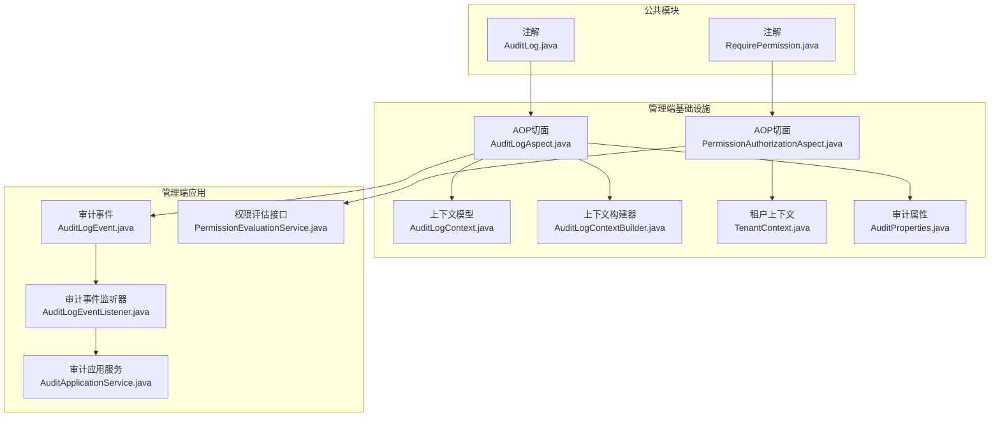
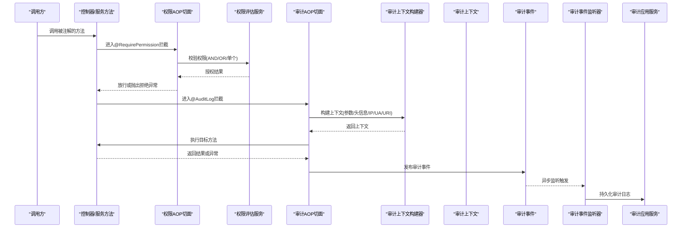
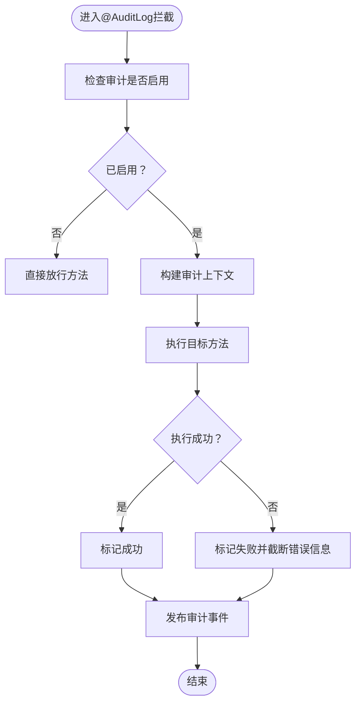
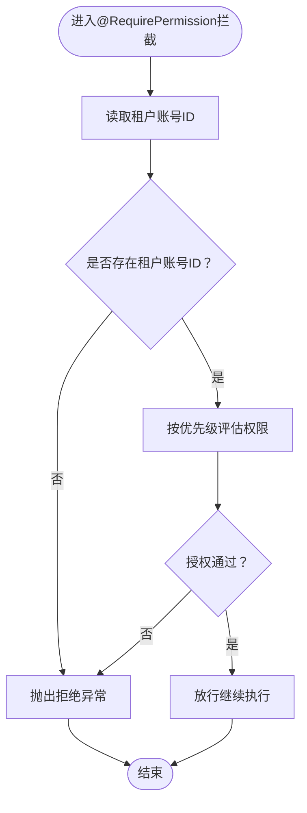
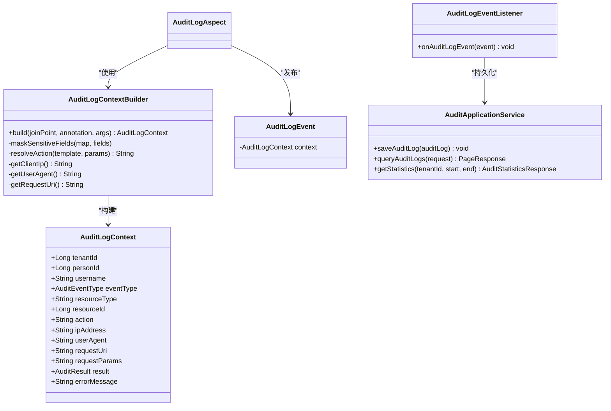
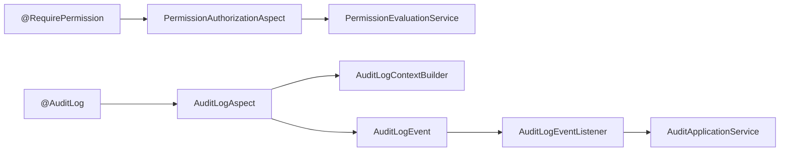

# 安全注解

<cite>
**本文引用的文件**
- [AuditLog.java](file://iam-common/src/main/java/iam/platform/common/model/annotation/AuditLog.java)
- [RequirePermission.java](file://iam-common/src/main/java/iam/platform/common/model/annotation/RequirePermission.java)
- [AuditLogAspect.java](file://iam-admin-server/src/main/java/iam/platform/admin/infrastructure/aspect/AuditLogAspect.java)
- [PermissionAuthorizationAspect.java](file://iam-admin-server/src/main/java/iam/platform/admin/infrastructure/aspect/PermissionAuthorizationAspect.java)
- [AuditLogContext.java](file://iam-admin-server/src/main/java/iam/platform/admin/infrastructure/aspect/AuditLogContext.java)
- [AuditLogContextBuilder.java](file://iam-admin-server/src/main/java/iam/platform/admin/infrastructure/aspect/AuditLogContextBuilder.java)
- [AuditProperties.java](file://iam-admin-server/src/main/java/iam/platform/admin/infrastructure/config/AuditProperties.java)
- [PermissionEvaluationService.java](file://iam-admin-server/src/main/java/iam/platform/admin/domain/service/PermissionEvaluationService.java)
- [AuditLogEvent.java](file://iam-admin-server/src/main/java/iam/platform/admin/application/event/AuditLogEvent.java)
- [AuditLogEventListener.java](file://iam-admin-server/src/main/java/iam/platform/admin/application/event/AuditLogEventListener.java)
- [AuditApplicationService.java](file://iam-admin-server/src/main/java/iam/platform/admin/application/service/AuditApplicationService.java)
- [TenantContext.java](file://iam-admin-server/src/main/java/iam/platform/admin/infrastructure/security/TenantContext.java)
</cite>

## 目录
1. [简介](#简介)
2. [项目结构](#项目结构)
3. [核心组件](#核心组件)
4. [架构总览](#架构总览)
5. [详细组件分析](#详细组件分析)
6. [依赖分析](#依赖分析)
7. [性能考虑](#性能考虑)
8. [故障排查指南](#故障排查指南)
9. [结论](#结论)
10. [附录：使用示例与最佳实践](#附录使用示例与最佳实践)

## 简介
本文件聚焦于IAM平台中的两类安全注解：AuditLog与RequirePermission。前者用于自动记录方法级审计事件，后者用于在方法执行前进行权限校验。文档从设计目标、实现机制、AOP拦截链路、与Spring Security集成、性能与优化策略等方面进行全面解析，并提供可操作的使用示例与排障建议。

## 项目结构
围绕安全注解的相关代码分布在以下模块与包中：
- 注解定义位于公共模块，确保跨模块复用
- AOP切面与上下文构建位于管理端基础设施层
- 权限评估接口与租户上下文位于管理端领域与基础设施层
- 审计事件发布与异步监听位于应用层

图表来源
- [AuditLog.java:1-46](file://iam-common/src/main/java/iam/platform/common/model/annotation/AuditLog.java#L1-L46)
- [RequirePermission.java:1-35](file://iam-common/src/main/java/iam/platform/common/model/annotation/RequirePermission.java#L1-L35)
- [AuditLogAspect.java:1-66](file://iam-admin-server/src/main/java/iam/platform/admin/infrastructure/aspect/AuditLogAspect.java#L1-L66)
- [PermissionAuthorizationAspect.java:1-79](file://iam-admin-server/src/main/java/iam/platform/admin/infrastructure/aspect/PermissionAuthorizationAspect.java#L1-L79)
- [AuditLogContext.java:1-32](file://iam-admin-server/src/main/java/iam/platform/admin/infrastructure/aspect/AuditLogContext.java#L1-L32)
- [AuditLogContextBuilder.java:1-183](file://iam-admin-server/src/main/java/iam/platform/admin/infrastructure/aspect/AuditLogContextBuilder.java#L1-L183)
- [AuditProperties.java:1-37](file://iam-admin-server/src/main/java/iam/platform/admin/infrastructure/config/AuditProperties.java#L1-L37)
- [AuditLogEvent.java:1-21](file://iam-admin-server/src/main/java/iam/platform/admin/application/event/AuditLogEvent.java#L1-L21)
- [AuditLogEventListener.java:1-31](file://iam-admin-server/src/main/java/iam/platform/admin/application/event/AuditLogEventListener.java#L1-L31)
- [AuditApplicationService.java:1-217](file://iam-admin-server/src/main/java/iam/platform/admin/application/service/AuditApplicationService.java#L1-L217)
- [PermissionEvaluationService.java:1-54](file://iam-admin-server/src/main/java/iam/platform/admin/domain/service/PermissionEvaluationService.java#L1-L54)
- [TenantContext.java:1-45](file://iam-admin-server/src/main/java/iam/platform/admin/infrastructure/security/TenantContext.java#L1-L45)

章节来源
- [AuditLog.java:1-46](file://iam-common/src/main/java/iam/platform/common/model/annotation/AuditLog.java#L1-L46)
- [RequirePermission.java:1-35](file://iam-common/src/main/java/iam/platform/common/model/annotation/RequirePermission.java#L1-L35)
- [AuditLogAspect.java:1-66](file://iam-admin-server/src/main/java/iam/platform/admin/infrastructure/aspect/AuditLogAspect.java#L1-L66)
- [PermissionAuthorizationAspect.java:1-79](file://iam-admin-server/src/main/java/iam/platform/admin/infrastructure/aspect/PermissionAuthorizationAspect.java#L1-L79)
- [AuditLogContext.java:1-32](file://iam-admin-server/src/main/java/iam/platform/admin/infrastructure/aspect/AuditLogContext.java#L1-L32)
- [AuditLogContextBuilder.java:1-183](file://iam-admin-server/src/main/java/iam/platform/admin/infrastructure/aspect/AuditLogContextBuilder.java#L1-L183)
- [AuditProperties.java:1-37](file://iam-admin-server/src/main/java/iam/platform/admin/infrastructure/config/AuditProperties.java#L1-L37)
- [AuditLogEvent.java:1-21](file://iam-admin-server/src/main/java/iam/platform/admin/application/event/AuditLogEvent.java#L1-L21)
- [AuditLogEventListener.java:1-31](file://iam-admin-server/src/main/java/iam/platform/admin/application/event/AuditLogEventListener.java#L1-L31)
- [AuditApplicationService.java:1-217](file://iam-admin-server/src/main/java/iam/platform/admin/application/service/AuditApplicationService.java#L1-L217)
- [PermissionEvaluationService.java:1-54](file://iam-admin-server/src/main/java/iam/platform/admin/domain/service/PermissionEvaluationService.java#L1-L54)
- [TenantContext.java:1-45](file://iam-admin-server/src/main/java/iam/platform/admin/infrastructure/security/TenantContext.java#L1-L45)

## 核心组件
- 审计注解AuditLog：通过元注解声明作用范围与生命周期，提供事件类型、资源类型、动作模板、参数记录开关与敏感字段掩码等参数，用于标记需要审计的方法。
- 权限注解RequirePermission：支持单一权限、任意满足（OR）与全部满足（AND）三种组合模式，用于在方法执行前进行权限校验。
- 审计AOP切面AuditLogAspect：拦截带@AuditLog的方法，构建上下文、记录结果与错误信息，并发布审计事件。
- 权限AOP切面PermissionAuthorizationAspect：拦截带@RequirePermission的方法，读取租户上下文，调用权限评估服务，按优先级判定授权。
- 审计上下文与构建器：从请求与方法参数提取关键信息，支持SpEL风格的动作模板替换、敏感字段掩码与参数截断。
- 审计事件与监听：以Spring事件形式异步持久化审计日志，避免阻塞主业务流程。
- 权限评估接口：抽象权限判断能力，支持单个、任一、全部权限判断及权限集合查询。
- 租户上下文：线程本地存储当前租户账号ID，作为权限校验的上下文依据。

章节来源
- [AuditLog.java:1-46](file://iam-common/src/main/java/iam/platform/common/model/annotation/AuditLog.java#L1-L46)
- [RequirePermission.java:1-35](file://iam-common/src/main/java/iam/platform/common/model/annotation/RequirePermission.java#L1-L35)
- [AuditLogAspect.java:1-66](file://iam-admin-server/src/main/java/iam/platform/admin/infrastructure/aspect/AuditLogAspect.java#L1-L66)
- [PermissionAuthorizationAspect.java:1-79](file://iam-admin-server/src/main/java/iam/platform/admin/infrastructure/aspect/PermissionAuthorizationAspect.java#L1-L79)
- [AuditLogContext.java:1-32](file://iam-admin-server/src/main/java/iam/platform/admin/infrastructure/aspect/AuditLogContext.java#L1-L32)
- [AuditLogContextBuilder.java:1-183](file://iam-admin-server/src/main/java/iam/platform/admin/infrastructure/aspect/AuditLogContextBuilder.java#L1-L183)
- [AuditLogEvent.java:1-21](file://iam-admin-server/src/main/java/iam/platform/admin/application/event/AuditLogEvent.java#L1-L21)
- [AuditLogEventListener.java:1-31](file://iam-admin-server/src/main/java/iam/platform/admin/application/event/AuditLogEventListener.java#L1-L31)
- [PermissionEvaluationService.java:1-54](file://iam-admin-server/src/main/java/iam/platform/admin/domain/service/PermissionEvaluationService.java#L1-L54)
- [TenantContext.java:1-45](file://iam-admin-server/src/main/java/iam/platform/admin/infrastructure/security/TenantContext.java#L1-L45)

## 架构总览
下图展示了注解驱动的安全控制在系统中的整体流转：注解标注方法 → AOP拦截 → 上下文采集/权限评估 → 异步事件持久化。

图表来源
- [PermissionAuthorizationAspect.java:1-79](file://iam-admin-server/src/main/java/iam/platform/admin/infrastructure/aspect/PermissionAuthorizationAspect.java#L1-L79)
- [PermissionEvaluationService.java:1-54](file://iam-admin-server/src/main/java/iam/platform/admin/domain/service/PermissionEvaluationService.java#L1-L54)
- [AuditLogAspect.java:1-66](file://iam-admin-server/src/main/java/iam/platform/admin/infrastructure/aspect/AuditLogAspect.java#L1-L66)
- [AuditLogContextBuilder.java:1-183](file://iam-admin-server/src/main/java/iam/platform/admin/infrastructure/aspect/AuditLogContextBuilder.java#L1-L183)
- [AuditLogEvent.java:1-21](file://iam-admin-server/src/main/java/iam/platform/admin/application/event/AuditLogEvent.java#L1-L21)
- [AuditLogEventListener.java:1-31](file://iam-admin-server/src/main/java/iam/platform/admin/application/event/AuditLogEventListener.java#L1-L31)
- [AuditApplicationService.java:1-217](file://iam-admin-server/src/main/java/iam/platform/admin/application/service/AuditApplicationService.java#L1-L217)

## 详细组件分析

### AuditLog 注解与审计AOP
- 设计目的：统一在方法层面开启审计，减少重复代码，保证关键操作可追溯。
- 关键参数：
  - 事件类型：用于标识审计事件类别
  - 资源类型：标识被操作资源的类型
  - 动作模板：支持简单占位符替换，便于生成可读描述
  - 参数记录开关：控制是否记录请求参数
  - 敏感字段：对密码、密钥、令牌等字段进行掩码处理
- 切面行为：
  - 启用检查：根据配置决定是否执行审计
  - 上下文构建：从请求与方法参数构造审计上下文
  - 结果与错误：成功/失败标记与错误消息截断
  - 异步发布：通过事件总线异步写入数据库
- 数据收集要点：
  - 用户名来自安全上下文
  - IP地址支持代理头解析
  - UA与URI来自请求上下文
  - 请求参数序列化并限制长度

图表来源
- [AuditLogAspect.java:1-66](file://iam-admin-server/src/main/java/iam/platform/admin/infrastructure/aspect/AuditLogAspect.java#L1-L66)
- [AuditLogContextBuilder.java:1-183](file://iam-admin-server/src/main/java/iam/platform/admin/infrastructure/aspect/AuditLogContextBuilder.java#L1-L183)
- [AuditProperties.java:1-37](file://iam-admin-server/src/main/java/iam/platform/admin/infrastructure/config/AuditProperties.java#L1-L37)

章节来源
- [AuditLog.java:1-46](file://iam-common/src/main/java/iam/platform/common/model/annotation/AuditLog.java#L1-L46)
- [AuditLogAspect.java:1-66](file://iam-admin-server/src/main/java/iam/platform/admin/infrastructure/aspect/AuditLogAspect.java#L1-L66)
- [AuditLogContext.java:1-32](file://iam-admin-server/src/main/java/iam/platform/admin/infrastructure/aspect/AuditLogContext.java#L1-L32)
- [AuditLogContextBuilder.java:1-183](file://iam-admin-server/src/main/java/iam/platform/admin/infrastructure/aspect/AuditLogContextBuilder.java#L1-L183)
- [AuditProperties.java:1-37](file://iam-admin-server/src/main/java/iam/platform/admin/infrastructure/config/AuditProperties.java#L1-L37)
- [AuditLogEvent.java:1-21](file://iam-admin-server/src/main/java/iam/platform/admin/application/event/AuditLogEvent.java#L1-L21)
- [AuditLogEventListener.java:1-31](file://iam-admin-server/src/main/java/iam/platform/admin/application/event/AuditLogEventListener.java#L1-L31)
- [AuditApplicationService.java:1-217](file://iam-admin-server/src/main/java/iam/platform/admin/application/service/AuditApplicationService.java#L1-L217)

### RequirePermission 注解与权限AOP
- 设计目的：在不侵入业务逻辑的前提下，对方法访问进行细粒度权限控制。
- 权限表达式与优先级：
  - 单一权限：直接校验
  - 全部权限（AND）：要求集合内所有权限均具备
  - 任意权限（OR）：集合内任一权限具备即可
  - 优先级：value > allOf > anyOf；若均未设置，默认放行
- 执行流程：
  - 读取租户账号ID（必须存在）
  - 依据注解参数调用权限评估服务
  - 授权通过则放行，否则抛出拒绝异常
- 与租户上下文集成：
  - 通过线程本地变量获取当前租户账号ID
  - 若缺失则直接拒绝，避免越权风险

图表来源
- [PermissionAuthorizationAspect.java:1-79](file://iam-admin-server/src/main/java/iam/platform/admin/infrastructure/aspect/PermissionAuthorizationAspect.java#L1-L79)
- [TenantContext.java:1-45](file://iam-admin-server/src/main/java/iam/platform/admin/infrastructure/security/TenantContext.java#L1-L45)
- [PermissionEvaluationService.java:1-54](file://iam-admin-server/src/main/java/iam/platform/admin/domain/service/PermissionEvaluationService.java#L1-L54)

章节来源
- [RequirePermission.java:1-35](file://iam-common/src/main/java/iam/platform/common/model/annotation/RequirePermission.java#L1-L35)
- [PermissionAuthorizationAspect.java:1-79](file://iam-admin-server/src/main/java/iam/platform/admin/infrastructure/aspect/PermissionAuthorizationAspect.java#L1-L79)
- [TenantContext.java:1-45](file://iam-admin-server/src/main/java/iam/platform/admin/infrastructure/security/TenantContext.java#L1-L45)
- [PermissionEvaluationService.java:1-54](file://iam-admin-server/src/main/java/iam/platform/admin/domain/service/PermissionEvaluationService.java#L1-L54)

### 审计上下文与事件链路
- 上下文模型包含：租户ID、人员ID、用户名、事件类型、资源类型、资源ID、动作、IP、UA、URI、请求参数、结果、错误信息等。
- 上下文构建器负责：
  - 参数映射与过滤（忽略HTTP类型参数）
  - 敏感字段掩码（支持嵌套Map）
  - 动作模板替换（简单SpEL风格）
  - 请求信息采集与截断
- 事件与监听：
  - 切面发布审计事件
  - 监听器异步持久化到数据库
  - 应用服务负责保存与查询统计导出

图表来源
- [AuditLogContext.java:1-32](file://iam-admin-server/src/main/java/iam/platform/admin/infrastructure/aspect/AuditLogContext.java#L1-L32)
- [AuditLogContextBuilder.java:1-183](file://iam-admin-server/src/main/java/iam/platform/admin/infrastructure/aspect/AuditLogContextBuilder.java#L1-L183)
- [AuditLogEvent.java:1-21](file://iam-admin-server/src/main/java/iam/platform/admin/application/event/AuditLogEvent.java#L1-L21)
- [AuditLogEventListener.java:1-31](file://iam-admin-server/src/main/java/iam/platform/admin/application/event/AuditLogEventListener.java#L1-L31)
- [AuditApplicationService.java:1-217](file://iam-admin-server/src/main/java/iam/platform/admin/application/service/AuditApplicationService.java#L1-L217)

章节来源
- [AuditLogContext.java:1-32](file://iam-admin-server/src/main/java/iam/platform/admin/infrastructure/aspect/AuditLogContext.java#L1-L32)
- [AuditLogContextBuilder.java:1-183](file://iam-admin-server/src/main/java/iam/platform/admin/infrastructure/aspect/AuditLogContextBuilder.java#L1-L183)
- [AuditLogEvent.java:1-21](file://iam-admin-server/src/main/java/iam/platform/admin/application/event/AuditLogEvent.java#L1-L21)
- [AuditLogEventListener.java:1-31](file://iam-admin-server/src/main/java/iam/platform/admin/application/event/AuditLogEventListener.java#L1-L31)
- [AuditApplicationService.java:1-217](file://iam-admin-server/src/main/java/iam/platform/admin/application/service/AuditApplicationService.java#L1-L217)

## 依赖分析
- 注解与切面的耦合：注解仅定义元数据，切面通过AOP拦截器读取注解并执行相应逻辑，保持低耦合高内聚。
- 权限评估接口：权限AOP切面依赖接口，具体实现由领域服务提供，便于替换与扩展。
- 审计事件链：切面→事件→监听→应用服务，采用异步写入，降低对主流程的影响。
- 配置与运行时：审计开关、保留期与异步线程池通过配置类注入，便于运维调整。

图表来源
- [RequirePermission.java:1-35](file://iam-common/src/main/java/iam/platform/common/model/annotation/RequirePermission.java#L1-L35)
- [PermissionAuthorizationAspect.java:1-79](file://iam-admin-server/src/main/java/iam/platform/admin/infrastructure/aspect/PermissionAuthorizationAspect.java#L1-L79)
- [PermissionEvaluationService.java:1-54](file://iam-admin-server/src/main/java/iam/platform/admin/domain/service/PermissionEvaluationService.java#L1-L54)
- [AuditLog.java:1-46](file://iam-common/src/main/java/iam/platform/common/model/annotation/AuditLog.java#L1-L46)
- [AuditLogAspect.java:1-66](file://iam-admin-server/src/main/java/iam/platform/admin/infrastructure/aspect/AuditLogAspect.java#L1-L66)
- [AuditLogContextBuilder.java:1-183](file://iam-admin-server/src/main/java/iam/platform/admin/infrastructure/aspect/AuditLogContextBuilder.java#L1-L183)
- [AuditLogEvent.java:1-21](file://iam-admin-server/src/main/java/iam/platform/admin/application/event/AuditLogEvent.java#L1-L21)
- [AuditLogEventListener.java:1-31](file://iam-admin-server/src/main/java/iam/platform/admin/application/event/AuditLogEventListener.java#L1-L31)
- [AuditApplicationService.java:1-217](file://iam-admin-server/src/main/java/iam/platform/admin/application/service/AuditApplicationService.java#L1-L217)

章节来源
- [RequirePermission.java:1-35](file://iam-common/src/main/java/iam/platform/common/model/annotation/RequirePermission.java#L1-L35)
- [PermissionAuthorizationAspect.java:1-79](file://iam-admin-server/src/main/java/iam/platform/admin/infrastructure/aspect/PermissionAuthorizationAspect.java#L1-L79)
- [PermissionEvaluationService.java:1-54](file://iam-admin-server/src/main/java/iam/platform/admin/domain/service/PermissionEvaluationService.java#L1-L54)
- [AuditLog.java:1-46](file://iam-common/src/main/java/iam/platform/common/model/annotation/AuditLog.java#L1-L46)
- [AuditLogAspect.java:1-66](file://iam-admin-server/src/main/java/iam/platform/admin/infrastructure/aspect/AuditLogAspect.java#L1-L66)
- [AuditLogContextBuilder.java:1-183](file://iam-admin-server/src/main/java/iam/platform/admin/infrastructure/aspect/AuditLogContextBuilder.java#L1-L183)
- [AuditLogEvent.java:1-21](file://iam-admin-server/src/main/java/iam/platform/admin/application/event/AuditLogEvent.java#L1-L21)
- [AuditLogEventListener.java:1-31](file://iam-admin-server/src/main/java/iam/platform/admin/application/event/AuditLogEventListener.java#L1-L31)
- [AuditApplicationService.java:1-217](file://iam-admin-server/src/main/java/iam/platform/admin/application/service/AuditApplicationService.java#L1-L217)

## 性能考虑
- 异步审计：审计事件通过异步监听器持久化，避免阻塞主业务线程，提升吞吐量。
- 参数截断与掩码：对请求参数进行长度限制与敏感字段掩码，降低日志体积与泄露风险。
- 条件启用：可通过配置开关全局关闭审计，便于在高负载场景临时降载。
- 权限评估：优先级判断与短路逻辑（AND/OR/单个）减少不必要的权限查询。
- 线程安全：租户上下文采用线程本地存储，避免并发污染，同时注意在异步场景下的传递问题。

[本节为通用性能指导，无需特定文件来源]

## 故障排查指南
- 权限拒绝：
  - 现象：抛出拒绝异常
  - 排查：确认租户上下文是否正确设置；核对注解参数（单个/任一/全部）与权限评估服务实现
- 审计未记录：
  - 现象：无审计日志
  - 排查：检查审计开关配置；确认方法确实标注了@AuditLog；查看事件发布与监听器是否正常
- 审计参数过大：
  - 现象：日志截断或性能下降
  - 排查：调整参数记录开关与截断阈值；减少非必要参数传入
- 敏感字段未掩码：
  - 现象：日志泄露
  - 排查：核对敏感字段列表；确认嵌套对象处理逻辑

章节来源
- [PermissionAuthorizationAspect.java:1-79](file://iam-admin-server/src/main/java/iam/platform/admin/infrastructure/aspect/PermissionAuthorizationAspect.java#L1-L79)
- [AuditLogAspect.java:1-66](file://iam-admin-server/src/main/java/iam/platform/admin/infrastructure/aspect/AuditLogAspect.java#L1-L66)
- [AuditLogContextBuilder.java:1-183](file://iam-admin-server/src/main/java/iam/platform/admin/infrastructure/aspect/AuditLogContextBuilder.java#L1-L183)
- [AuditProperties.java:1-37](file://iam-admin-server/src/main/java/iam/platform/admin/infrastructure/config/AuditProperties.java#L1-L37)

## 结论
AuditLog与RequirePermission通过注解+AOP的方式，将审计与权限控制从业务代码中解耦，既提升了安全性与可追溯性，又保持了良好的可维护性。结合异步事件与配置化策略，可在保证性能的同时满足合规与安全需求。

[本节为总结性内容，无需特定文件来源]

## 附录：使用示例与最佳实践
- 在控制器或服务方法上标注@AuditLog，选择合适的事件类型与资源类型，并根据需要开启动作模板与参数记录。
- 在需要权限控制的方法上标注@RequirePermission，合理组织单个/任一/全部权限组合，避免过度授权。
- 将租户上下文在认证阶段正确填充，确保权限校验有效。
- 对高并发接口谨慎开启审计参数记录，必要时关闭参数记录或缩短截断阈值。
- 使用异步线程池与合理的队列容量，平衡延迟与吞吐。

[本节为概念性指导，无需特定文件来源]