# 工具类集合

<cite>
**本文引用的文件**
- [Guard.java](file://iam-common/src/main/java/iam/platform/common/util/Guard.java)
- [Email.java](file://iam-common/src/main/java/iam/platform/common/model/valueobject/Email.java)
- [Password.java](file://iam-common/src/main/java/iam/platform/common/model/valueobject/Password.java)
- [TokenSettings.java](file://iam-common/src/main/java/iam/platform/common/model/valueobject/TokenSettings.java)
- [AppCredential.java](file://iam-common/src/main/java/iam/platform/common/model/valueobject/AppCredential.java)
- [OrganizationPath.java](file://iam-common/src/main/java/iam/platform/common/model/valueobject/OrganizationPath.java)
- [PersonCode.java](file://iam-common/src/main/java/iam/platform/common/model/valueobject/PersonCode.java)
- [InvalidStateException.java](file://iam-common/src/main/java/iam/platform/common/model/exception/InvalidStateException.java)
- [Application.java（管理端）](file://iam-admin-server/src/main/java/iam/platform/admin/domain/model/entity/Application.java)
- [Application.java（认证端）](file://iam-auth-server/src/main/java/iam/platform/auth/domain/model/entity/Application.java)
- [PersonApplicationService.java](file://iam-admin-server/src/main/java/iam/platform/admin/application/service/PersonApplicationService.java)
- [AuthenticationApplicationService.java](file://iam-auth-server/src/main/java/iam/platform/auth/application/service/AuthenticationApplicationService.java)
</cite>

## 目录
1. [简介](#简介)
2. [项目结构](#项目结构)
3. [核心组件](#核心组件)
4. [架构总览](#架构总览)
5. [详细组件分析](#详细组件分析)
6. [依赖分析](#依赖分析)
7. [性能考量](#性能考量)
8. [故障排查指南](#故障排查指南)
9. [结论](#结论)
10. [附录：使用示例与最佳实践](#附录使用示例与最佳实践)

## 简介
本文件系统化梳理 IAM 平台中的“工具类集合”，重点覆盖以下主题：
- Guard 类的空值检查机制与防御式编程应用
- 值对象（ValueObject）设计理念与实现要点：Email、Password、TokenSettings、AppCredential、OrganizationPath、PersonCode
- 值对象的验证逻辑、equals/hashCode 实现与线程安全性
- 工具类在业务逻辑中的作用与典型使用场景
- 值对象与传统实体的区别与优势
- 测试策略与单元测试最佳实践
- 具体使用示例与扩展性、可维护性设计原则

## 项目结构
工具类与值对象主要位于公共模块 iam-common 中，业务侧在管理端与认证端通过依赖使用这些能力。

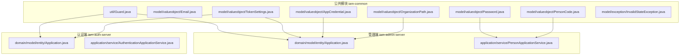

图示来源
- [Guard.java:1-37](file://iam-common/src/main/java/iam/platform/common/util/Guard.java#L1-L37)
- [Email.java:1-31](file://iam-common/src/main/java/iam/platform/common/model/valueobject/Email.java#L1-L31)
- [Password.java:1-90](file://iam-common/src/main/java/iam/platform/common/model/valueobject/Password.java#L1-L90)
- [TokenSettings.java:1-63](file://iam-common/src/main/java/iam/platform/common/model/valueobject/TokenSettings.java#L1-L63)
- [AppCredential.java:1-67](file://iam-common/src/main/java/iam/platform/common/model/valueobject/AppCredential.java#L1-L67)
- [OrganizationPath.java:1-93](file://iam-common/src/main/java/iam/platform/common/model/valueobject/OrganizationPath.java#L1-L93)
- [PersonCode.java:1-51](file://iam-common/src/main/java/iam/platform/common/model/valueobject/PersonCode.java#L1-L51)
- [InvalidStateException.java:1-10](file://iam-common/src/main/java/iam/platform/common/model/exception/InvalidStateException.java#L1-L10)
- [Application.java（管理端）:50-120](file://iam-admin-server/src/main/java/iam/platform/admin/domain/model/entity/Application.java#L50-L120)
- [Application.java（认证端）:1-139](file://iam-auth-server/src/main/java/iam/platform/auth/domain/model/entity/Application.java#L1-L139)
- [PersonApplicationService.java:35-45](file://iam-admin-server/src/main/java/iam/platform/admin/application/service/PersonApplicationService.java#L35-L45)
- [AuthenticationApplicationService.java:50-110](file://iam-auth-server/src/main/java/iam/platform/auth/application/service/AuthenticationApplicationService.java#L50-L110)

章节来源
- [Guard.java:1-37](file://iam-common/src/main/java/iam/platform/common/util/Guard.java#L1-L37)
- [Email.java:1-31](file://iam-common/src/main/java/iam/platform/common/model/valueobject/Email.java#L1-L31)
- [Password.java:1-90](file://iam-common/src/main/java/iam/platform/common/model/valueobject/Password.java#L1-L90)
- [TokenSettings.java:1-63](file://iam-common/src/main/java/iam/platform/common/model/valueobject/TokenSettings.java#L1-L63)
- [AppCredential.java:1-67](file://iam-common/src/main/java/iam/platform/common/model/valueobject/AppCredential.java#L1-L67)
- [OrganizationPath.java:1-93](file://iam-common/src/main/java/iam/platform/common/model/valueobject/OrganizationPath.java#L1-L93)
- [PersonCode.java:1-51](file://iam-common/src/main/java/iam/platform/common/model/valueobject/PersonCode.java#L1-L51)
- [InvalidStateException.java:1-10](file://iam-common/src/main/java/iam/platform/common/model/exception/InvalidStateException.java#L1-L10)

## 核心组件
- 防御式断言工具 Guard：提供 notNull、notBlank、state、positive 等静态方法，统一前置条件与不变式校验，抛出语义明确的异常类型，避免空指针与非法状态传播到业务层。
- 值对象集合：以不可变、自约束的方式封装业务数据与行为，确保数据一致性与可读性。

章节来源
- [Guard.java:13-35](file://iam-common/src/main/java/iam/platform/common/util/Guard.java#L13-L35)
- [InvalidStateException.java:3-8](file://iam-common/src/main/java/iam/platform/common/model/exception/InvalidStateException.java#L3-L8)

## 架构总览
工具类与值对象作为横切能力，被各领域实体与应用服务复用，形成“公共能力—业务实体”的解耦架构。

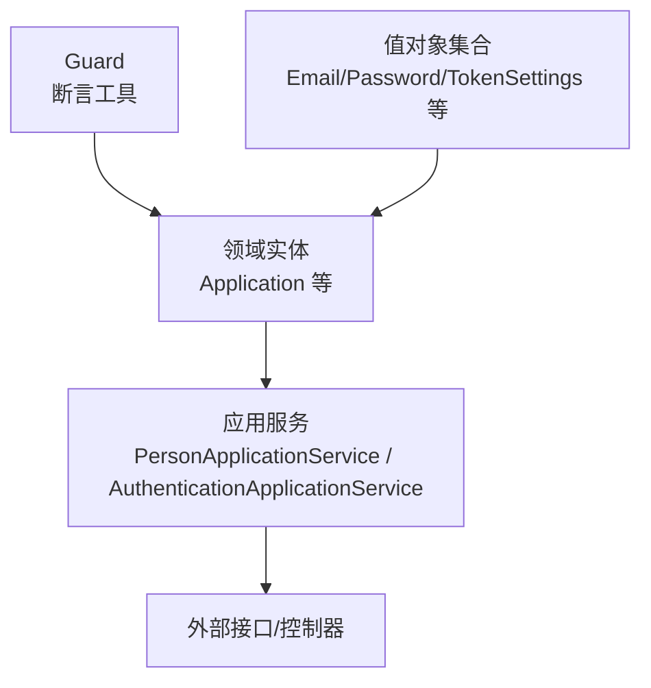

图示来源
- [Guard.java:1-37](file://iam-common/src/main/java/iam/platform/common/util/Guard.java#L1-L37)
- [Email.java:1-31](file://iam-common/src/main/java/iam/platform/common/model/valueobject/Email.java#L1-L31)
- [Password.java:1-90](file://iam-common/src/main/java/iam/platform/common/model/valueobject/Password.java#L1-L90)
- [TokenSettings.java:1-63](file://iam-common/src/main/java/iam/platform/common/model/valueobject/TokenSettings.java#L1-L63)
- [Application.java（管理端）:50-120](file://iam-admin-server/src/main/java/iam/platform/admin/domain/model/entity/Application.java#L50-L120)
- [Application.java（认证端）:1-139](file://iam-auth-server/src/main/java/iam/platform/auth/domain/model/entity/Application.java#L1-L139)
- [PersonApplicationService.java:35-45](file://iam-admin-server/src/main/java/iam/platform/admin/application/service/PersonApplicationService.java#L35-L45)
- [AuthenticationApplicationService.java:50-110](file://iam-auth-server/src/main/java/iam/platform/auth/application/service/AuthenticationApplicationService.java#L50-L110)

## 详细组件分析

### Guard：防御式编程与空值检查
- 设计目标：在方法入口与状态变更处集中进行参数与状态校验，失败即抛错，避免错误状态继续传播。
- 关键方法与语义
  - notNull：禁止传入 null，用于非空约束
  - notBlank：禁止 null 或空白字符串，用于字符串必填约束
  - state：检查业务不变式，不满足时抛出 InvalidStateException
  - positive：检查正整数约束
- 异常体系：IllegalArgumentException 与 InvalidStateException 分别对应参数/状态非法，便于上层区分处理。
- 使用模式：在构造器、setter、业务方法入口调用 Guard，确保“早失败”。

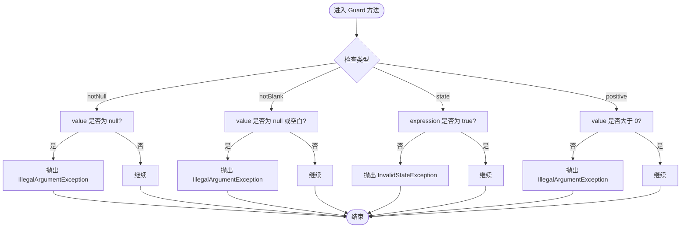

图示来源
- [Guard.java:13-35](file://iam-common/src/main/java/iam/platform/common/util/Guard.java#L13-L35)
- [InvalidStateException.java:3-8](file://iam-common/src/main/java/iam/platform/common/model/exception/InvalidStateException.java#L3-L8)

章节来源
- [Guard.java:13-35](file://iam-common/src/main/java/iam/platform/common/util/Guard.java#L13-L35)
- [InvalidStateException.java:3-8](file://iam-common/src/main/java/iam/platform/common/model/exception/InvalidStateException.java#L3-L8)

### 值对象：Email
- 不可变性：字段为 final，构造时一次性赋值；对外只暴露 getter。
- 验证逻辑：构造时对格式进行正则校验，非法直接抛异常。
- equals/hashCode：基于注解生成，保证相等性与散列一致性。
- 线程安全：仅包含不可变字段，天然线程安全。
- toString：直接返回内部值，避免泄露敏感信息。

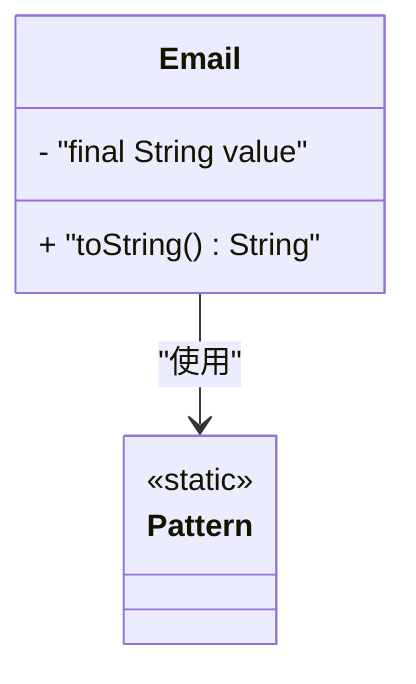

图示来源
- [Email.java:14-24](file://iam-common/src/main/java/iam/platform/common/model/valueobject/Email.java#L14-L24)

章节来源
- [Email.java:1-31](file://iam-common/src/main/java/iam/platform/common/model/valueobject/Email.java#L1-L31)

### 值对象：Password
- 不可变性：仅保存哈希后的值，原始密码不在对象内保留。
- 创建路径：
  - fromRawPassword：执行策略校验（长度、大小写、数字），再由调用方提供的编码函数生成哈希并构造对象
  - fromHash：从数据库等存储中重建对象，不做二次校验
- 匹配：通过调用方提供的匹配函数进行比对，避免在通用模块引入具体加密实现
- equals/hashCode：基于注解生成
- 线程安全：不可变字段，线程安全
- toString：屏蔽敏感信息

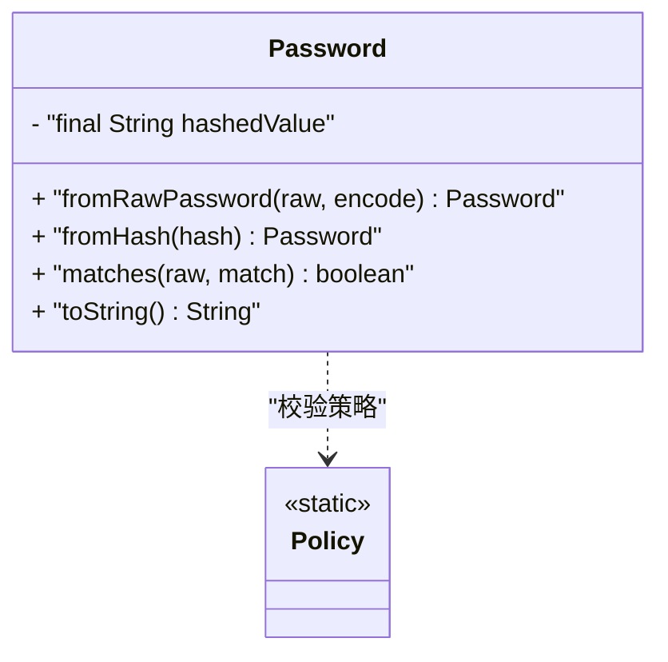

图示来源
- [Password.java:37-65](file://iam-common/src/main/java/iam/platform/common/model/valueobject/Password.java#L37-L65)

章节来源
- [Password.java:1-90](file://iam-common/src/main/java/iam/platform/common/model/valueobject/Password.java#L1-L90)

### 值对象：TokenSettings
- 不可变性：两个 TTL 字段均为 final
- 工厂方法：
  - of：允许传入 null，内部以默认值替代；同时校验正数约束
  - ofExact：直接以显式值构造，用于从持久化恢复
- equals/hashCode：基于注解生成
- 线程安全：不可变字段，线程安全
- toString：输出可读的 TTL 描述

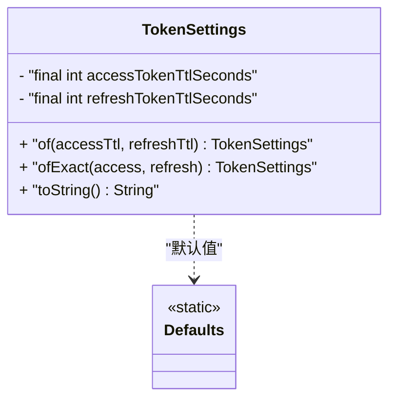

图示来源
- [TokenSettings.java:36-55](file://iam-common/src/main/java/iam/platform/common/model/valueobject/TokenSettings.java#L36-L55)

章节来源
- [TokenSettings.java:1-63](file://iam-common/src/main/java/iam/platform/common/model/valueobject/TokenSettings.java#L1-L63)

### 值对象：AppCredential
- 不可变性：appId 与 appSecret 为 final
- 工厂方法：
  - generate：随机生成符合长度与字符集要求的 appId 与 appSecret
  - of：从持久化恢复，校验非空
- 行为：rotateSecret 保持 appId 不变，生成新密钥
- equals/hashCode：基于注解生成
- 线程安全：不可变字段，线程安全
- toString：保护密钥显示

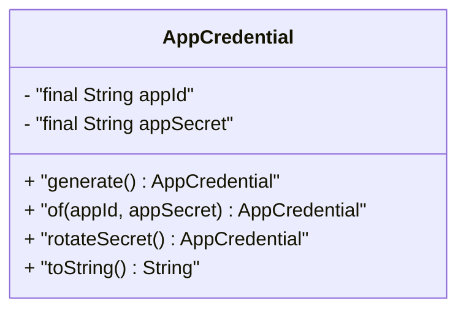

图示来源
- [AppCredential.java:31-60](file://iam-common/src/main/java/iam/platform/common/model/valueobject/AppCredential.java#L31-L60)

章节来源
- [AppCredential.java:1-67](file://iam-common/src/main/java/iam/platform/common/model/valueobject/AppCredential.java#L1-L67)

### 值对象：OrganizationPath
- 不可变性：value 为 final
- 工厂方法：
  - root：为租户生成根路径
  - of：从持久化恢复，校验非空
- 行为：
  - childPath：追加子节点 ID 生成子路径
  - isAncestorOf：判断祖先关系
  - reparent：替换前缀生成重定位路径
  - calculateLevel：按分隔符计算层级
- equals/hashCode：基于注解生成
- 线程安全：不可变字段，线程安全
- toString：返回原始路径

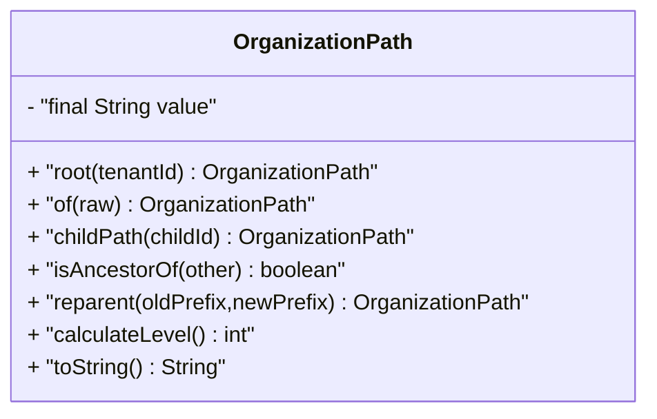

图示来源
- [OrganizationPath.java:28-86](file://iam-common/src/main/java/iam/platform/common/model/valueobject/OrganizationPath.java#L28-L86)

章节来源
- [OrganizationPath.java:1-93](file://iam-common/src/main/java/iam/platform/common/model/valueobject/OrganizationPath.java#L1-L93)

### 值对象：PersonCode
- 不可变性：value 为 final
- 工厂方法：
  - generate：生成指定格式的唯一编码
  - of：从持久化恢复，严格校验格式
- equals/hashCode：基于注解生成
- 线程安全：不可变字段，线程安全
- toString：返回原始编码

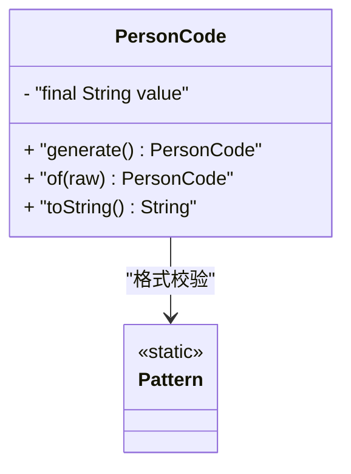

图示来源
- [PersonCode.java:30-44](file://iam-common/src/main/java/iam/platform/common/model/valueobject/PersonCode.java#L30-L44)

章节来源
- [PersonCode.java:1-51](file://iam-common/src/main/java/iam/platform/common/model/valueobject/PersonCode.java#L1-L51)

## 依赖分析
- Guard 与值对象均无外部依赖，属于纯 Java 实现，便于跨模块复用。
- 值对象之间相互独立，彼此不依赖，降低耦合度。
- 业务侧通过应用服务间接依赖值对象，例如 Password 的创建依赖调用方提供的编码函数，避免在公共模块引入具体加密框架。

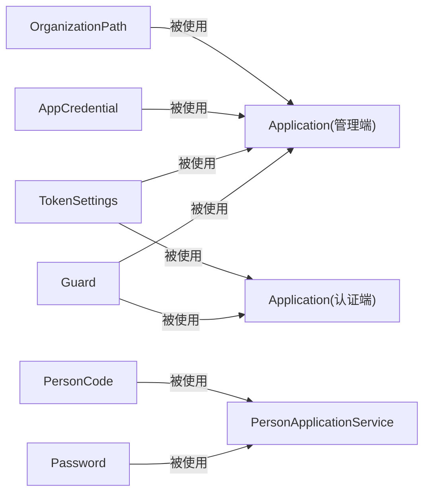

图示来源
- [Guard.java:1-37](file://iam-common/src/main/java/iam/platform/common/util/Guard.java#L1-L37)
- [Email.java:1-31](file://iam-common/src/main/java/iam/platform/common/model/valueobject/Email.java#L1-L31)
- [Password.java:1-90](file://iam-common/src/main/java/iam/platform/common/model/valueobject/Password.java#L1-L90)
- [TokenSettings.java:1-63](file://iam-common/src/main/java/iam/platform/common/model/valueobject/TokenSettings.java#L1-L63)
- [AppCredential.java:1-67](file://iam-common/src/main/java/iam/platform/common/model/valueobject/AppCredential.java#L1-L67)
- [OrganizationPath.java:1-93](file://iam-common/src/main/java/iam/platform/common/model/valueobject/OrganizationPath.java#L1-L93)
- [PersonCode.java:1-51](file://iam-common/src/main/java/iam/platform/common/model/valueobject/PersonCode.java#L1-L51)
- [Application.java（管理端）:50-120](file://iam-admin-server/src/main/java/iam/platform/admin/domain/model/entity/Application.java#L50-L120)
- [Application.java（认证端）:1-139](file://iam-auth-server/src/main/java/iam/platform/auth/domain/model/entity/Application.java#L1-L139)
- [PersonApplicationService.java:35-45](file://iam-admin-server/src/main/java/iam/platform/admin/application/service/PersonApplicationService.java#L35-L45)

章节来源
- [Application.java（管理端）:50-120](file://iam-admin-server/src/main/java/iam/platform/admin/domain/model/entity/Application.java#L50-L120)
- [Application.java（认证端）:1-139](file://iam-auth-server/src/main/java/iam/platform/auth/domain/model/entity/Application.java#L1-L139)
- [PersonApplicationService.java:35-45](file://iam-admin-server/src/main/java/iam/platform/admin/application/service/PersonApplicationService.java#L35-L45)

## 性能考量
- 值对象不可变且字段数量少，内存占用低，equals/hashCode 基于注解生成，性能稳定。
- 正则校验仅发生在构造阶段，运行期无额外开销。
- Guard 的检查为 O(1)，在高频路径上应尽量减少重复校验，必要时结合业务上下文合并校验。
- Password 的哈希与匹配由调用方函数完成，避免在公共模块引入复杂依赖，有利于按需替换实现。

## 故障排查指南
- 参数为空或空白
  - 症状：抛出 IllegalArgumentException
  - 排查：确认调用前是否已使用 Guard.notNull/Guard.notBlank
  - 参考：[Guard.java:13-23](file://iam-common/src/main/java/iam/platform/common/util/Guard.java#L13-L23)
- 状态不合法
  - 症状：抛出 InvalidStateException
  - 排查：检查业务不变式是否满足；确认 Guard.state 的表达式
  - 参考：[InvalidStateException.java:3-8](file://iam-common/src/main/java/iam/platform/common/model/exception/InvalidStateException.java#L3-L8)
- 密码策略不满足
  - 症状：创建 Password 失败
  - 排查：确认长度、大小写、数字要求是否满足；核对调用方编码函数是否正确
  - 参考：[Password.java:67-83](file://iam-common/src/main/java/iam/platform/common/model/valueobject/Password.java#L67-L83)
- TokenSettings TTL 非正
  - 症状：创建 TokenSettings 失败
  - 排查：确认传入值为正数；若使用 of，请确认传入值未被置为 null 导致默认值生效
  - 参考：[TokenSettings.java:39-47](file://iam-common/src/main/java/iam/platform/common/model/valueobject/TokenSettings.java#L39-L47)
- 路径前缀不匹配
  - 症状：reparent 抛出 IllegalArgumentException
  - 排查：确认当前路径确实以前缀开头
  - 参考：[OrganizationPath.java:68-75](file://iam-common/src/main/java/iam/platform/common/model/valueobject/OrganizationPath.java#L68-L75)

章节来源
- [Guard.java:13-29](file://iam-common/src/main/java/iam/platform/common/util/Guard.java#L13-L29)
- [InvalidStateException.java:3-8](file://iam-common/src/main/java/iam/platform/common/model/exception/InvalidStateException.java#L3-L8)
- [Password.java:67-83](file://iam-common/src/main/java/iam/platform/common/model/valueobject/Password.java#L67-L83)
- [TokenSettings.java:39-47](file://iam-common/src/main/java/iam/platform/common/model/valueobject/TokenSettings.java#L39-L47)
- [OrganizationPath.java:68-75](file://iam-common/src/main/java/iam/platform/common/model/valueobject/OrganizationPath.java#L68-L75)

## 结论
- Guard 提供了统一、清晰的防御式编程入口，显著降低了空值与非法状态在业务层扩散的风险。
- 值对象以不可变、自约束的方式封装业务数据，提升了模型表达力、可测试性与可维护性。
- 通过工厂方法与最小依赖设计，值对象与业务服务解耦良好，便于演进与替换实现。
- 建议在新增工具类或值对象时，遵循“不可变、自校验、无副作用”的原则，并配套完善的单元测试与边界用例。

## 附录：使用示例与最佳实践

### 在实体中使用 Guard 进行防御式编程
- 示例场景：更新应用令牌设置
  - 步骤：接收参数 → 使用 Guard.notNull/Guard.state 校验 → 更新实体 → 持久化
  - 参考文件：
    - [Application.java（管理端）:160-180](file://iam-admin-server/src/main/java/iam/platform/admin/domain/model/entity/Application.java#L160-L180)
    - [Application.java（认证端）:1-139](file://iam-auth-server/src/main/java/iam/platform/auth/domain/model/entity/Application.java#L1-L139)

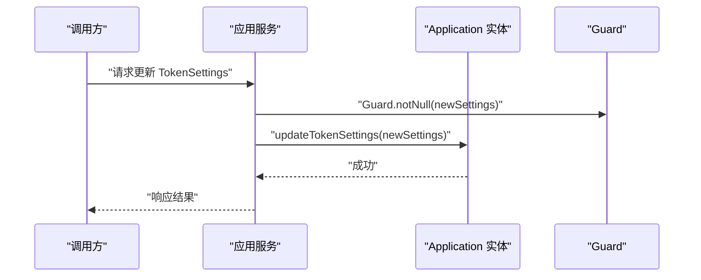

图示来源
- [Application.java（管理端）:160-180](file://iam-admin-server/src/main/java/iam/platform/admin/domain/model/entity/Application.java#L160-L180)
- [Guard.java:13-17](file://iam-common/src/main/java/iam/platform/common/util/Guard.java#L13-L17)

### 使用 Password 值对象进行密码创建与匹配
- 创建：调用 fromRawPassword(raw, encodeFn)，内部执行策略校验并生成哈希
- 匹配：调用 matches(raw, matchFn) 进行验证
- 参考文件：
  - [Password.java:37-65](file://iam-common/src/main/java/iam/platform/common/model/valueobject/Password.java#L37-L65)
  - [PersonApplicationService.java:35-45](file://iam-admin-server/src/main/java/iam/platform/admin/application/service/PersonApplicationService.java#L35-L45)

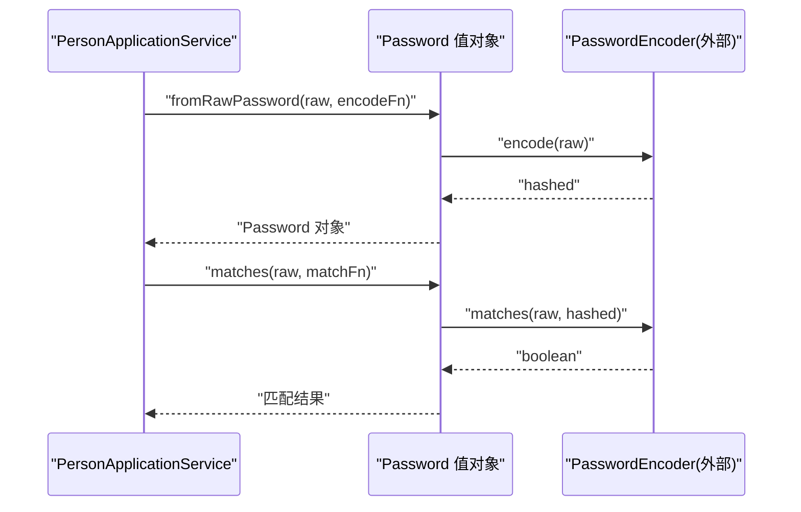

图示来源
- [Password.java:37-65](file://iam-common/src/main/java/iam/platform/common/model/valueobject/Password.java#L37-L65)
- [PersonApplicationService.java:35-45](file://iam-admin-server/src/main/java/iam/platform/admin/application/service/PersonApplicationService.java#L35-L45)

### 使用 TokenSettings 设置令牌 TTL
- 场景：创建或更新应用时设置访问令牌与刷新令牌有效期
- 参考文件：
  - [TokenSettings.java:36-48](file://iam-common/src/main/java/iam/platform/common/model/valueobject/TokenSettings.java#L36-L48)
  - [Application.java（管理端）:100-120](file://iam-admin-server/src/main/java/iam/platform/admin/domain/model/entity/Application.java#L100-L120)

### 值对象与传统实体的区别与优势
- 不可变性：值对象一旦创建不可修改，避免并发与状态漂移问题
- 自约束：构造器即校验，确保对象始终处于有效状态
- 可读性强：字段名与工厂方法表达业务含义，降低理解成本
- 易测试：无外部依赖，易于构造边界输入与断言
- 与实体区别：实体强调标识与生命周期，值对象强调描述与行为；值对象通常作为实体属性出现

### 测试策略与单元测试最佳实践
- 值对象测试
  - 构造器边界：null、空、非法格式、越界值
  - 行为方法：边界输入、异常路径、相等性与散列一致性
  - 线程安全：多线程并发构造与访问
- 工具类测试
  - Guard：覆盖所有分支（null、blank、负数、false 条件）
  - 异常类型：确保抛出正确的异常类型与消息
- 最佳实践
  - 使用参数化测试覆盖典型与极端输入
  - 优先使用工厂方法与构造器进行正向与反向测试
  - 对依赖外部函数（如编码/匹配）的值对象，使用桩函数隔离外部依赖