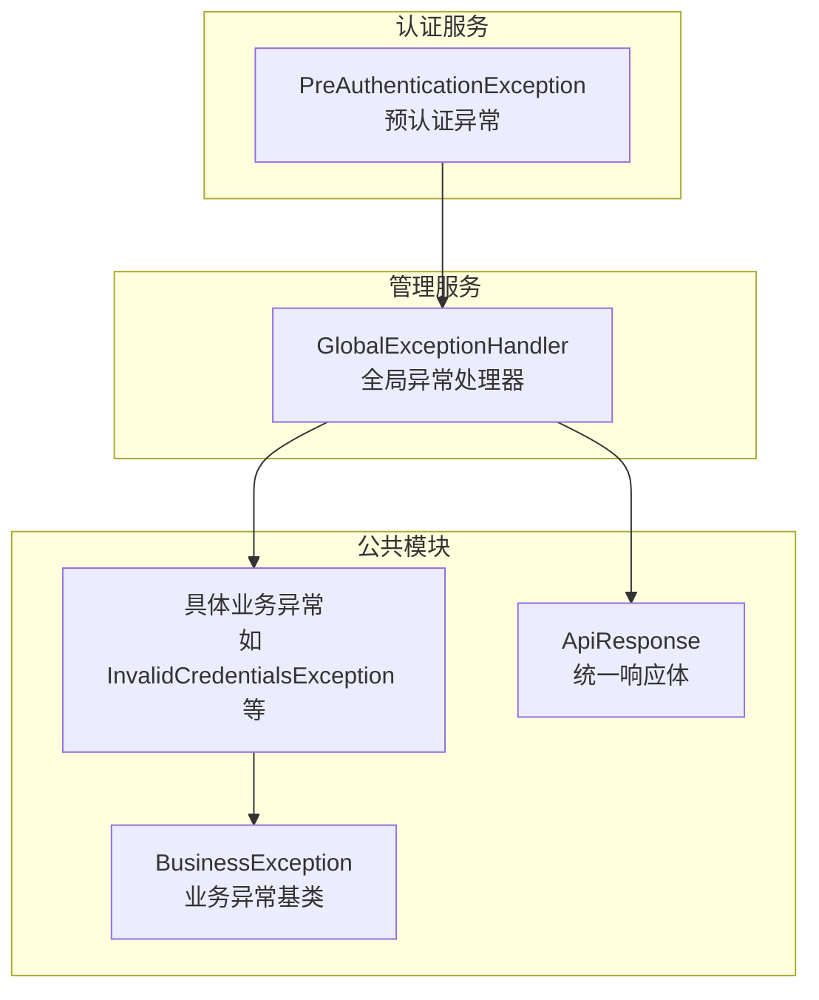
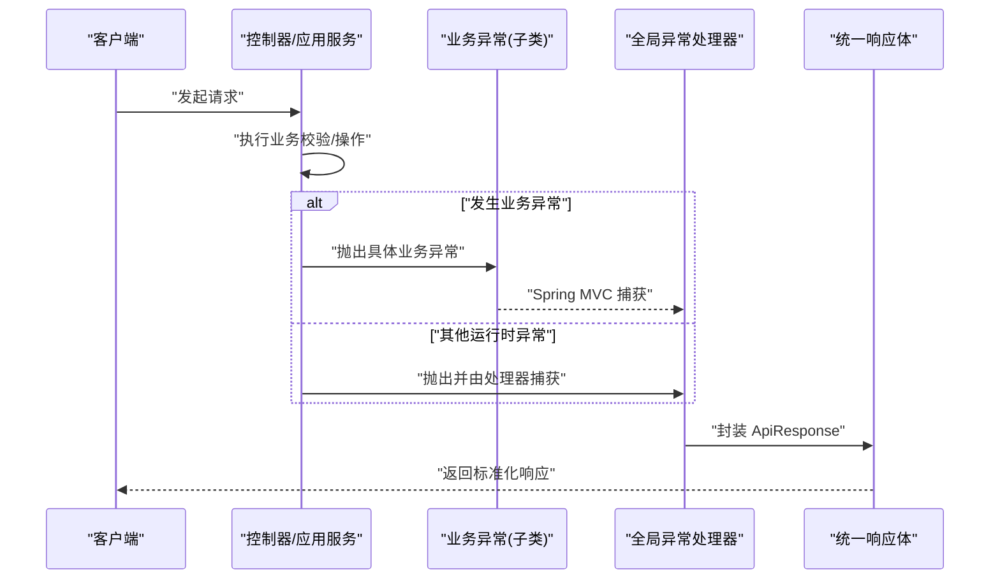
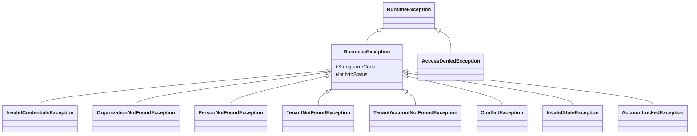
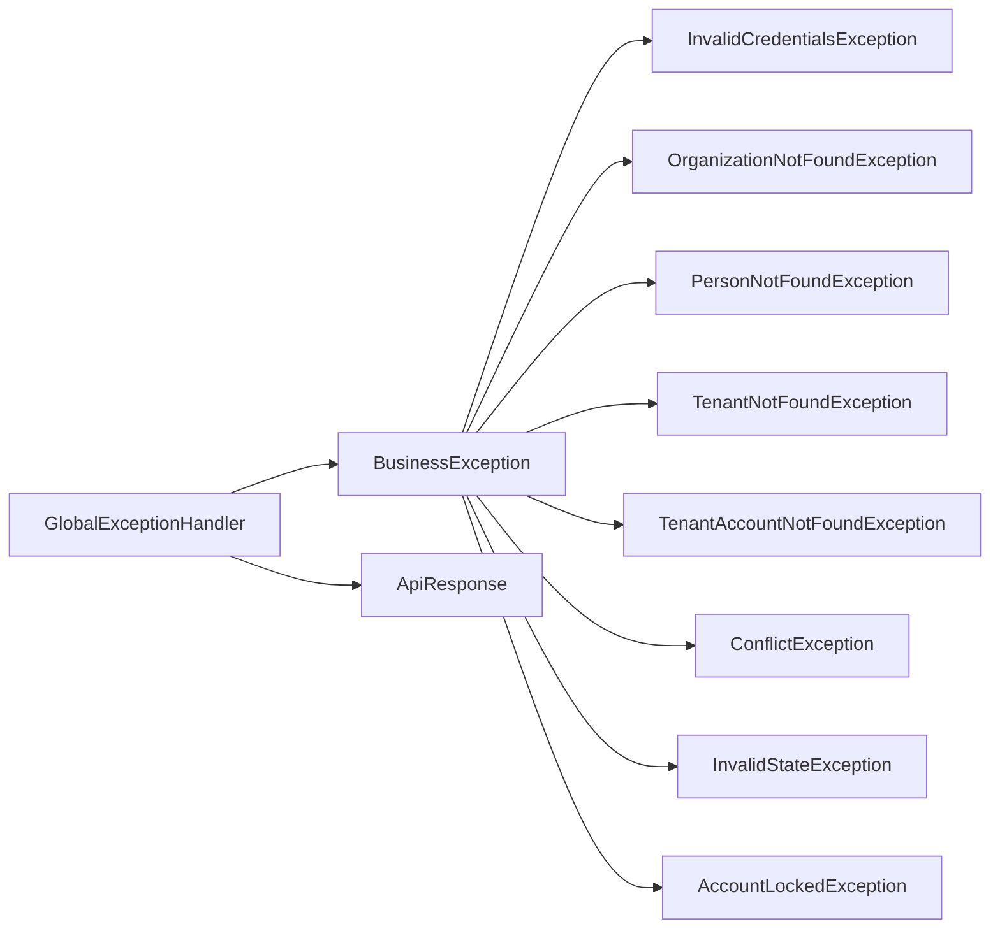

# 异常处理体系

<cite>
**本文引用的文件**
- [BusinessException.java](file://iam-common/src/main/java/iam/platform/common/model/exception/BusinessException.java)
- [InvalidCredentialsException.java](file://iam-common/src/main/java/iam/platform/common/model/exception/InvalidCredentialsException.java)
- [AccessDeniedException.java](file://iam-common/src/main/java/iam/platform/common/model/exception/AccessDeniedException.java)
- [OrganizationNotFoundException.java](file://iam-common/src/main/java/iam/platform/common/model/exception/OrganizationNotFoundException.java)
- [PersonNotFoundException.java](file://iam-common/src/main/java/iam/platform/common/model/exception/PersonNotFoundException.java)
- [TenantNotFoundException.java](file://iam-common/src/main/java/iam/platform/common/model/exception/TenantNotFoundException.java)
- [TenantAccountNotFoundException.java](file://iam-common/src/main/java/iam/platform/common/model/exception/TenantAccountNotFoundException.java)
- [ConflictException.java](file://iam-common/src/main/java/iam/platform/common/model/exception/ConflictException.java)
- [InvalidStateException.java](file://iam-common/src/main/java/iam/platform/common/model/exception/InvalidStateException.java)
- [AccountLockedException.java](file://iam-common/src/main/java/iam/platform/common/model/exception/AccountLockedException.java)
- [PreAuthenticationException.java](file://iam-auth-server/src/main/java/iam/platform/auth/application/service/pipeline/PreAuthenticationException.java)
- [GlobalExceptionHandler.java](file://iam-admin-server/src/main/java/iam/platform/admin/interfaces/rest/common/GlobalExceptionHandler.java)
- [ApiResponse.java](file://iam-common/src/main/java/iam/platform/common/api/ApiResponse.java)
</cite>

## 目录
1. [引言](#引言)
2. [项目结构](#项目结构)
3. [核心组件](#核心组件)
4. [架构总览](#架构总览)
5. [详细组件分析](#详细组件分析)
6. [依赖分析](#依赖分析)
7. [性能考虑](#性能考虑)
8. [故障排查指南](#故障排查指南)
9. [结论](#结论)
10. [附录](#附录)

## 引言
本文件系统性梳理 IAM 平台的异常处理体系，覆盖从基础异常类到业务特定异常的完整设计层次，说明异常类的参数设计、错误码与 HTTP 状态标准化策略，并结合全局异常处理器展示异常在微服务中的传播与统一响应格式。同时给出最佳实践建议与实际示例路径，帮助开发者在不同服务中正确抛出与捕获异常。

## 项目结构
异常处理体系主要分布在以下模块：
- iam-common：定义通用异常基类与业务异常类型，以及统一响应体模型
- iam-admin-server：提供全局异常处理器，负责将各类异常映射为统一的 API 响应
- iam-auth-server：包含认证阶段的异常类型（如预认证失败），用于在认证流水线中抛出并被上层捕获或转换

图表来源
- [BusinessException.java:1-17](file://iam-common/src/main/java/iam/platform/common/model/exception/BusinessException.java#L1-L17)
- [InvalidCredentialsException.java:1-10](file://iam-common/src/main/java/iam/platform/common/model/exception/InvalidCredentialsException.java#L1-L10)
- [GlobalExceptionHandler.java:1-101](file://iam-admin-server/src/main/java/iam/platform/admin/interfaces/rest/common/GlobalExceptionHandler.java#L1-L101)
- [ApiResponse.java:1-61](file://iam-common/src/main/java/iam/platform/common/api/ApiResponse.java#L1-L61)
- [PreAuthenticationException.java:1-18](file://iam-auth-server/src/main/java/iam/platform/auth/application/service/pipeline/PreAuthenticationException.java#L1-L18)

章节来源
- [BusinessException.java:1-17](file://iam-common/src/main/java/iam/platform/common/model/exception/BusinessException.java#L1-L17)
- [GlobalExceptionHandler.java:1-101](file://iam-admin-server/src/main/java/iam/platform/admin/interfaces/rest/common/GlobalExceptionHandler.java#L1-L101)

## 核心组件
- 业务异常基类 BusinessException：抽象类，统一承载错误码与 HTTP 状态，便于上层统一处理与序列化输出
- 具体业务异常：如无效凭据、组织/人员/租户/账户不存在、冲突、状态非法、账号锁定等，均继承自 BusinessException
- 全局异常处理器 GlobalExceptionHandler：集中捕获并转换异常为统一响应体 ApiResponse
- 统一响应体 ApiResponse：标准化返回结构，包含状态码、消息、时间戳与可选字段级错误列表

章节来源
- [BusinessException.java:1-17](file://iam-common/src/main/java/iam/platform/common/model/exception/BusinessException.java#L1-L17)
- [InvalidCredentialsException.java:1-10](file://iam-common/src/main/java/iam/platform/common/model/exception/InvalidCredentialsException.java#L1-L10)
- [OrganizationNotFoundException.java:1-10](file://iam-common/src/main/java/iam/platform/common/model/exception/OrganizationNotFoundException.java#L1-L10)
- [PersonNotFoundException.java:1-10](file://iam-common/src/main/java/iam/platform/common/model/exception/PersonNotFoundException.java#L1-L10)
- [TenantNotFoundException.java:1-10](file://iam-common/src/main/java/iam/platform/common/model/exception/TenantNotFoundException.java#L1-L10)
- [TenantAccountNotFoundException.java:1-10](file://iam-common/src/main/java/iam/platform/common/model/exception/TenantAccountNotFoundException.java#L1-L10)
- [ConflictException.java:1-10](file://iam-common/src/main/java/iam/platform/common/model/exception/ConflictException.java#L1-L10)
- [InvalidStateException.java:1-10](file://iam-common/src/main/java/iam/platform/common/model/exception/InvalidStateException.java#L1-L10)
- [AccountLockedException.java:1-10](file://iam-common/src/main/java/iam/platform/common/model/exception/AccountLockedException.java#L1-L10)
- [GlobalExceptionHandler.java:1-101](file://iam-admin-server/src/main/java/iam/platform/admin/interfaces/rest/common/GlobalExceptionHandler.java#L1-L101)
- [ApiResponse.java:1-61](file://iam-common/src/main/java/iam/platform/common/api/ApiResponse.java#L1-L61)

## 架构总览
异常处理在服务内的传播与响应如下：

图表来源
- [GlobalExceptionHandler.java:24-29](file://iam-admin-server/src/main/java/iam/platform/admin/interfaces/rest/common/GlobalExceptionHandler.java#L24-L29)
- [ApiResponse.java:43-50](file://iam-common/src/main/java/iam/platform/common/api/ApiResponse.java#L43-L50)

## 详细组件分析

### 基础异常类：BusinessException
- 设计理念
  - 抽象基类，统一承载错误码与 HTTP 状态，便于上层按错误码与状态进行差异化处理
  - 继承自 RuntimeException，避免强制在调用链中显式声明
- 关键属性
  - 错误码：字符串标识，便于前端与日志检索与国际化
  - HTTP 状态：整型状态码，直接映射到 HTTP 响应状态
- 使用方式
  - 各业务异常通过构造函数传入固定错误码与状态，确保一致性

章节来源
- [BusinessException.java:1-17](file://iam-common/src/main/java/iam/platform/common/model/exception/BusinessException.java#L1-L17)

### 业务异常类一览与使用场景
- 无效凭据异常 InvalidCredentialsException
  - 场景：登录或认证阶段凭据不合法
  - 错误码与状态：对应未授权状态
  - 示例路径：[InvalidCredentialsException.java:1-10](file://iam-common/src/main/java/iam/platform/common/model/exception/InvalidCredentialsException.java#L1-L10)
- 访问拒绝异常 AccessDeniedException
  - 场景：鉴权通过但缺少所需权限
  - 特性：除通用异常外，额外携带权限码字段，便于前端引导或审计
  - 示例路径：[AccessDeniedException.java:1-25](file://iam-common/src/main/java/iam/platform/common/model/exception/AccessDeniedException.java#L1-L25)
- 组织/人员/租户/账户不存在异常
  - 场景：查询实体不存在
  - 错误码与状态：对应未找到状态
  - 示例路径：
    - [OrganizationNotFoundException.java:1-10](file://iam-common/src/main/java/iam/platform/common/model/exception/OrganizationNotFoundException.java#L1-L10)
    - [PersonNotFoundException.java:1-10](file://iam-common/src/main/java/iam/platform/common/model/exception/PersonNotFoundException.java#L1-L10)
    - [TenantNotFoundException.java:1-10](file://iam-common/src/main/java/iam/platform/common/model/exception/TenantNotFoundException.java#L1-L10)
    - [TenantAccountNotFoundException.java:1-10](file://iam-common/src/main/java/iam/platform/common/model/exception/TenantAccountNotFoundException.java#L1-L10)
- 冲突异常 ConflictException
  - 场景：数据约束冲突（如重复创建）
  - 错误码与状态：对应冲突状态
  - 示例路径：[ConflictException.java:1-10](file://iam-common/src/main/java/iam/platform/common/model/exception/ConflictException.java#L1-L10)
- 非法状态异常 InvalidStateException
  - 场景：业务状态不允许的操作
  - 错误码与状态：对应客户端错误状态
  - 示例路径：[InvalidStateException.java:1-10](file://iam-common/src/main/java/iam/platform/common/model/exception/InvalidStateException.java#L1-L10)
- 账号锁定异常 AccountLockedException
  - 场景：账户被锁定
  - 错误码与状态：对应禁止访问状态
  - 示例路径：[AccountLockedException.java:1-10](file://iam-common/src/main/java/iam/platform/common/model/exception/AccountLockedException.java#L1-L10)

章节来源
- [InvalidCredentialsException.java:1-10](file://iam-common/src/main/java/iam/platform/common/model/exception/InvalidCredentialsException.java#L1-L10)
- [AccessDeniedException.java:1-25](file://iam-common/src/main/java/iam/platform/common/model/exception/AccessDeniedException.java#L1-L25)
- [OrganizationNotFoundException.java:1-10](file://iam-common/src/main/java/iam/platform/common/model/exception/OrganizationNotFoundException.java#L1-L10)
- [PersonNotFoundException.java:1-10](file://iam-common/src/main/java/iam/platform/common/model/exception/PersonNotFoundException.java#L1-L10)
- [TenantNotFoundException.java:1-10](file://iam-common/src/main/java/iam/platform/common/model/exception/TenantNotFoundException.java#L1-L10)
- [TenantAccountNotFoundException.java:1-10](file://iam-common/src/main/java/iam/platform/common/model/exception/TenantAccountNotFoundException.java#L1-L10)
- [ConflictException.java:1-10](file://iam-common/src/main/java/iam/platform/common/model/exception/ConflictException.java#L1-L10)
- [InvalidStateException.java:1-10](file://iam-common/src/main/java/iam/platform/common/model/exception/InvalidStateException.java#L1-L10)
- [AccountLockedException.java:1-10](file://iam-common/src/main/java/iam/platform/common/model/exception/AccountLockedException.java#L1-L10)

### 异常类继承关系与参数设计

图表来源
- [BusinessException.java:1-17](file://iam-common/src/main/java/iam/platform/common/model/exception/BusinessException.java#L1-L17)
- [InvalidCredentialsException.java:1-10](file://iam-common/src/main/java/iam/platform/common/model/exception/InvalidCredentialsException.java#L1-L10)
- [AccessDeniedException.java:1-25](file://iam-common/src/main/java/iam/platform/common/model/exception/AccessDeniedException.java#L1-L25)
- [OrganizationNotFoundException.java:1-10](file://iam-common/src/main/java/iam/platform/common/model/exception/OrganizationNotFoundException.java#L1-L10)
- [PersonNotFoundException.java:1-10](file://iam-common/src/main/java/iam/platform/common/model/exception/PersonNotFoundException.java#L1-L10)
- [TenantNotFoundException.java:1-10](file://iam-common/src/main/java/iam/platform/common/model/exception/TenantNotFoundException.java#L1-L10)
- [TenantAccountNotFoundException.java:1-10](file://iam-common/src/main/java/iam/platform/common/model/exception/TenantAccountNotFoundException.java#L1-L10)
- [ConflictException.java:1-10](file://iam-common/src/main/java/iam/platform/common/model/exception/ConflictException.java#L1-L10)
- [InvalidStateException.java:1-10](file://iam-common/src/main/java/iam/platform/common/model/exception/InvalidStateException.java#L1-L10)
- [AccountLockedException.java:1-10](file://iam-common/src/main/java/iam/platform/common/model/exception/AccountLockedException.java#L1-L10)

### 全局异常处理器与统一响应
- 处理范围
  - 捕获业务异常 BusinessException，按其错误码与状态返回统一响应
  - 捕获参数校验异常、鉴权/访问拒绝异常、用户名不存在、非法参数、数据完整性冲突、资源不存在、通用异常等
- 统一响应体 ApiResponse
  - 包含状态码、消息、时间戳与可选字段级错误列表
  - 便于前端统一解析与展示

章节来源
- [GlobalExceptionHandler.java:24-29](file://iam-admin-server/src/main/java/iam/platform/admin/interfaces/rest/common/GlobalExceptionHandler.java#L24-L29)
- [GlobalExceptionHandler.java:31-42](file://iam-admin-server/src/main/java/iam/platform/admin/interfaces/rest/common/GlobalExceptionHandler.java#L31-L42)
- [GlobalExceptionHandler.java:44-50](file://iam-admin-server/src/main/java/iam/platform/admin/interfaces/rest/common/GlobalExceptionHandler.java#L44-L50)
- [GlobalExceptionHandler.java:52-58](file://iam-admin-server/src/main/java/iam/platform/admin/interfaces/rest/common/GlobalExceptionHandler.java#L52-L58)
- [GlobalExceptionHandler.java:60-66](file://iam-admin-server/src/main/java/iam/platform/admin/interfaces/rest/common/GlobalExceptionHandler.java#L60-L66)
- [GlobalExceptionHandler.java:68-74](file://iam-admin-server/src/main/java/iam/platform/admin/interfaces/rest/common/GlobalExceptionHandler.java#L68-L74)
- [GlobalExceptionHandler.java:76-83](file://iam-admin-server/src/main/java/iam/platform/admin/interfaces/rest/common/GlobalExceptionHandler.java#L76-L83)
- [GlobalExceptionHandler.java:85-91](file://iam-admin-server/src/main/java/iam/platform/admin/interfaces/rest/common/GlobalExceptionHandler.java#L85-L91)
- [GlobalExceptionHandler.java:93-99](file://iam-admin-server/src/main/java/iam/platform/admin/interfaces/rest/common/GlobalExceptionHandler.java#L93-L99)
- [ApiResponse.java:18-50](file://iam-common/src/main/java/iam/platform/common/api/ApiResponse.java#L18-L50)

### 认证阶段异常与微服务间传播
- 预认证异常 PreAuthenticationException
  - 场景：认证前检查失败（如 IP 白名单、租户解析失败等）
  - 传播：在认证服务内部抛出，由统一认证过滤器或异常处理器捕获并转换为标准响应
- 微服务间传播
  - 业务异常在服务边界保持 BusinessException 家族，配合错误码与 HTTP 状态，便于网关或下游服务识别与转发
  - 建议：跨服务调用时保留错误码与消息，必要时在网关层做统一映射与透传

章节来源
- [PreAuthenticationException.java:1-18](file://iam-auth-server/src/main/java/iam/platform/auth/application/service/pipeline/PreAuthenticationException.java#L1-L18)
- [GlobalExceptionHandler.java:24-29](file://iam-admin-server/src/main/java/iam/platform/admin/interfaces/rest/common/GlobalExceptionHandler.java#L24-L29)

### 错误码标准化与国际化支持
- 错误码设计
  - 采用大写字符串标识，语义明确且便于前端匹配与本地化
  - 建议：为每类业务异常定义唯一错误码，避免歧义
- 国际化支持
  - 建议：在全局异常处理器或响应层引入消息源，根据区域返回本地化消息
  - 当前实现：消息直接来自异常构造，可在后续扩展中接入消息源

章节来源
- [BusinessException.java:8-15](file://iam-common/src/main/java/iam/platform/common/model/exception/BusinessException.java#L8-L15)
- [InvalidCredentialsException.java](file://iam-common/src/main/java/iam/platform/common/model/exception/InvalidCredentialsException.java#L7)
- [OrganizationNotFoundException.java](file://iam-common/src/main/java/iam/platform/common/model/exception/OrganizationNotFoundException.java#L7)
- [PersonNotFoundException.java](file://iam-common/src/main/java/iam/platform/common/model/exception/PersonNotFoundException.java#L7)
- [TenantNotFoundException.java](file://iam-common/src/main/java/iam/platform/common/model/exception/TenantNotFoundException.java#L7)
- [TenantAccountNotFoundException.java](file://iam-common/src/main/java/iam/platform/common/model/exception/TenantAccountNotFoundException.java#L7)
- [ConflictException.java](file://iam-common/src/main/java/iam/platform/common/model/exception/ConflictException.java#L7)
- [InvalidStateException.java](file://iam-common/src/main/java/iam/platform/common/model/exception/InvalidStateException.java#L7)
- [AccountLockedException.java](file://iam-common/src/main/java/iam/platform/common/model/exception/AccountLockedException.java#L7)

### 实际示例与最佳实践
- 在控制器/应用服务中抛出业务异常
  - 示例路径：在业务逻辑分支中抛出 InvalidCredentialsException 或 OrganizationNotFoundException 等
- 在全局异常处理器中统一处理
  - 示例路径：GlobalExceptionHandler 对 BusinessException 的处理逻辑
- 日志记录与用户友好提示
  - 建议：对业务异常记录警告级别日志；对通用异常记录错误级别日志
  - 建议：对外仅返回通用提示，敏感信息保留在后端日志
- 最佳实践清单
  - 明确异常分类：业务异常、参数校验异常、认证/授权异常、通用异常
  - 统一错误码与 HTTP 状态，便于前端与监控系统识别
  - 保持错误消息简洁、可理解，避免泄露内部实现细节
  - 在微服务间传递错误码与上下文信息，便于链路追踪与问题定位

章节来源
- [GlobalExceptionHandler.java:24-29](file://iam-admin-server/src/main/java/iam/platform/admin/interfaces/rest/common/GlobalExceptionHandler.java#L24-L29)
- [GlobalExceptionHandler.java:93-99](file://iam-admin-server/src/main/java/iam/platform/admin/interfaces/rest/common/GlobalExceptionHandler.java#L93-L99)

## 依赖分析
- 组件耦合
  - 业务异常类仅依赖 BusinessException 基类，低耦合高内聚
  - 全局异常处理器依赖 ApiResponse 与各业务异常类型，承担统一出口职责
- 外部依赖
  - Spring MVC 注解驱动的异常处理机制
  - 日志框架用于记录异常信息

图表来源
- [BusinessException.java:1-17](file://iam-common/src/main/java/iam/platform/common/model/exception/BusinessException.java#L1-L17)
- [InvalidCredentialsException.java:1-10](file://iam-common/src/main/java/iam/platform/common/model/exception/InvalidCredentialsException.java#L1-L10)
- [OrganizationNotFoundException.java:1-10](file://iam-common/src/main/java/iam/platform/common/model/exception/OrganizationNotFoundException.java#L1-L10)
- [PersonNotFoundException.java:1-10](file://iam-common/src/main/java/iam/platform/common/model/exception/PersonNotFoundException.java#L1-L10)
- [TenantNotFoundException.java:1-10](file://iam-common/src/main/java/iam/platform/common/model/exception/TenantNotFoundException.java#L1-L10)
- [TenantAccountNotFoundException.java:1-10](file://iam-common/src/main/java/iam/platform/common/model/exception/TenantAccountNotFoundException.java#L1-L10)
- [ConflictException.java:1-10](file://iam-common/src/main/java/iam/platform/common/model/exception/ConflictException.java#L1-L10)
- [InvalidStateException.java:1-10](file://iam-common/src/main/java/iam/platform/common/model/exception/InvalidStateException.java#L1-L10)
- [AccountLockedException.java:1-10](file://iam-common/src/main/java/iam/platform/common/model/exception/AccountLockedException.java#L1-L10)
- [GlobalExceptionHandler.java:1-101](file://iam-admin-server/src/main/java/iam/platform/admin/interfaces/rest/common/GlobalExceptionHandler.java#L1-L101)
- [ApiResponse.java:1-61](file://iam-common/src/main/java/iam/platform/common/api/ApiResponse.java#L1-L61)

## 性能考虑
- 异常处理开销控制
  - 将业务异常作为正常流程的一部分，避免频繁创建异常对象
  - 在高频路径中优先使用快速失败与参数校验，减少异常抛出频率
- 响应体序列化
  - 统一响应体结构简单，序列化成本较低；建议避免在 data 中返回超大数据

## 故障排查指南
- 常见问题定位
  - 业务异常未被捕获：检查是否在服务边界抛出了非 BusinessException 子类
  - 响应状态不符预期：确认异常构造时的 HTTP 状态是否正确
  - 参数校验错误未返回字段级错误：检查是否使用了验证注解并在全局处理器中处理
- 排查步骤
  - 查看全局异常处理器的日志记录位置与级别
  - 核对 ApiResponse 的字段与时间戳，确认响应格式一致
  - 在认证服务中关注预认证异常的触发条件与上下文

章节来源
- [GlobalExceptionHandler.java:31-42](file://iam-admin-server/src/main/java/iam/platform/admin/interfaces/rest/common/GlobalExceptionHandler.java#L31-L42)
- [GlobalExceptionHandler.java:44-50](file://iam-admin-server/src/main/java/iam/platform/admin/interfaces/rest/common/GlobalExceptionHandler.java#L44-L50)
- [GlobalExceptionHandler.java:52-58](file://iam-admin-server/src/main/java/iam/platform/admin/interfaces/rest/common/GlobalExceptionHandler.java#L52-L58)
- [GlobalExceptionHandler.java:60-66](file://iam-admin-server/src/main/java/iam/platform/admin/interfaces/rest/common/GlobalExceptionHandler.java#L60-L66)
- [GlobalExceptionHandler.java:68-74](file://iam-admin-server/src/main/java/iam/platform/admin/interfaces/rest/common/GlobalExceptionHandler.java#L68-L74)
- [GlobalExceptionHandler.java:76-83](file://iam-admin-server/src/main/java/iam/platform/admin/interfaces/rest/common/GlobalExceptionHandler.java#L76-L83)
- [GlobalExceptionHandler.java:85-91](file://iam-admin-server/src/main/java/iam/platform/admin/interfaces/rest/common/GlobalExceptionHandler.java#L85-L91)
- [GlobalExceptionHandler.java:93-99](file://iam-admin-server/src/main/java/iam/platform/admin/interfaces/rest/common/GlobalExceptionHandler.java#L93-L99)

## 结论
该异常处理体系以 BusinessException 为核心，通过标准化错误码与 HTTP 状态，结合全局异常处理器与统一响应体，实现了跨服务的一致性与可观测性。建议在后续迭代中完善国际化与更细粒度的错误分类，持续提升用户体验与运维效率。

## 附录
- 示例路径参考
  - 抛出业务异常：在应用服务或领域服务中根据业务规则抛出具体异常类
  - 全局处理：确保控制器层不直接处理业务异常，交由 GlobalExceptionHandler 统一处理
  - 响应格式：统一使用 ApiResponse，保证前后端交互一致性