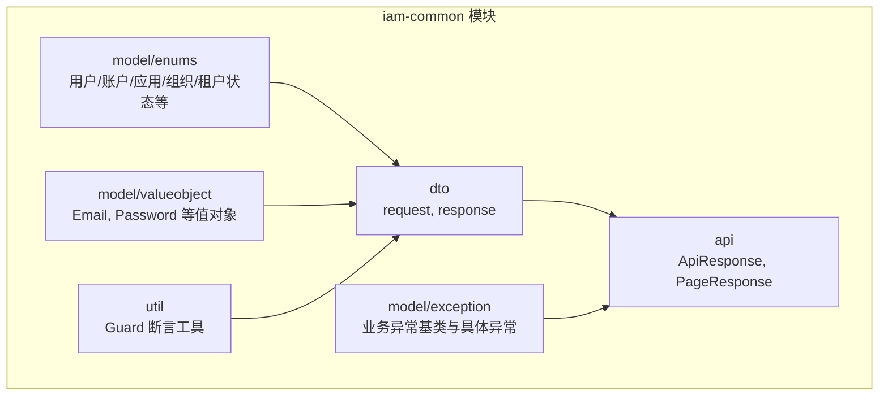
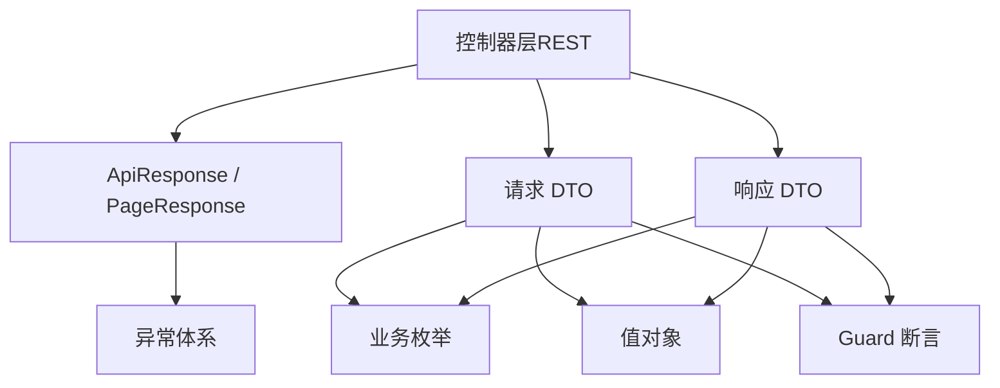
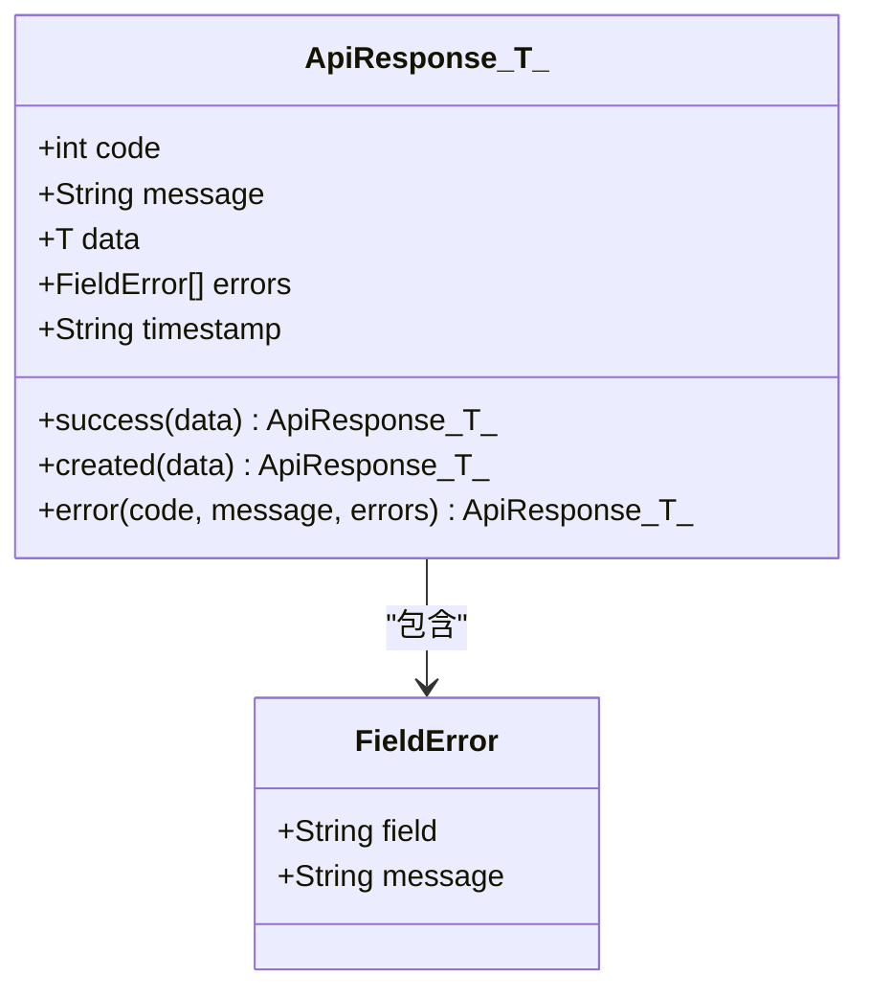
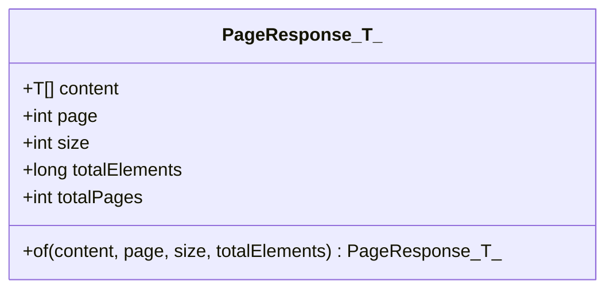
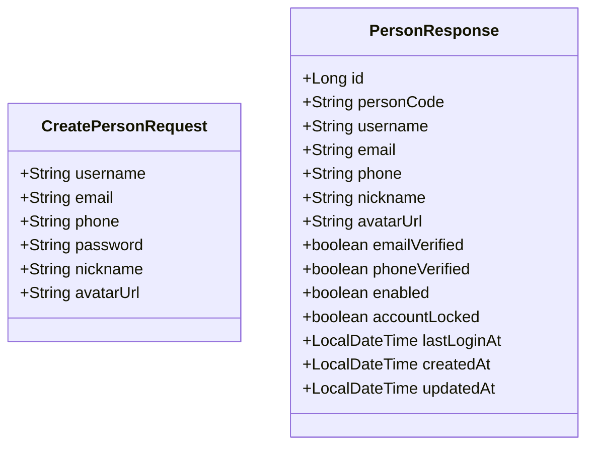
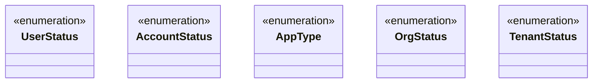
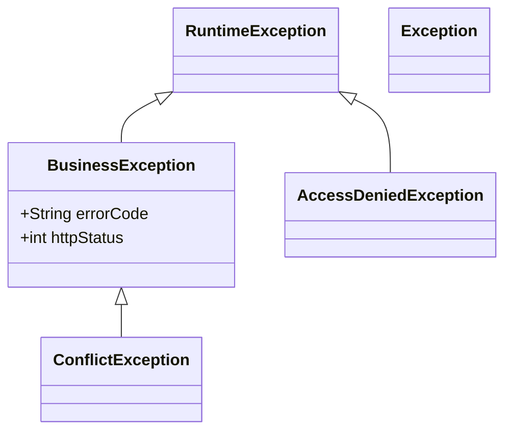
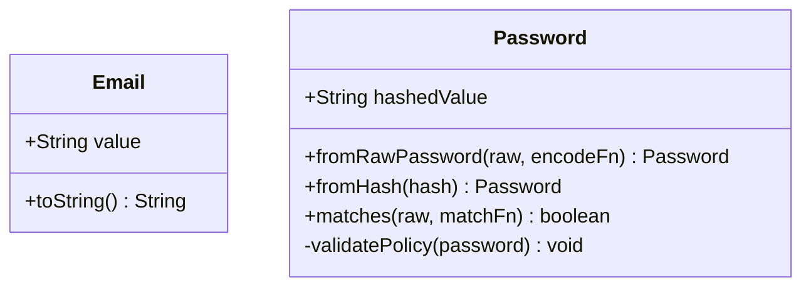
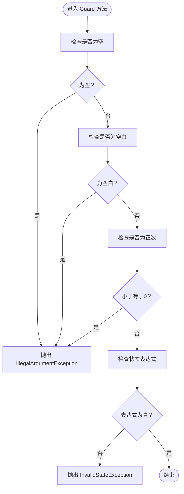
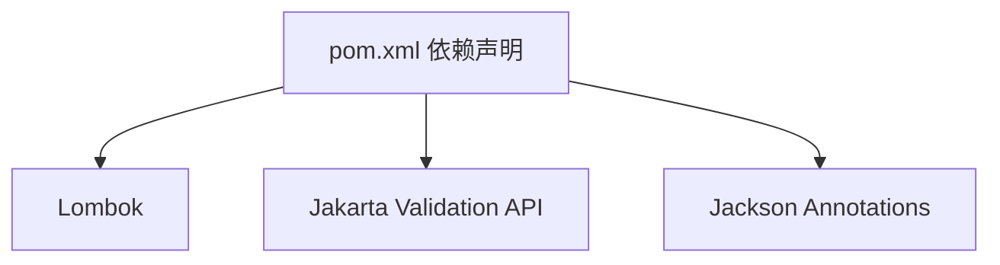

# 通用模块（iam-common）

<cite>
**本文引用的文件**
- [ApiResponse.java](file://iam-common/src/main/java/iam/platform/common/api/ApiResponse.java)
- [PageResponse.java](file://iam-common/src/main/java/iam/platform/common/api/PageResponse.java)
- [Guard.java](file://iam-common/src/main/java/iam/platform/common/util/Guard.java)
- [BusinessException.java](file://iam-common/src/main/java/iam/platform/common/model/exception/BusinessException.java)
- [AccessDeniedException.java](file://iam-common/src/main/java/iam/platform/common/model/exception/AccessDeniedException.java)
- [ConflictException.java](file://iam-common/src/main/java/iam/platform/common/model/exception/ConflictException.java)
- [UserStatus.java](file://iam-common/src/main/java/iam/platform/common/model/enums/UserStatus.java)
- [AccountStatus.java](file://iam-common/src/main/java/iam/platform/common/model/enums/AccountStatus.java)
- [AppType.java](file://iam-common/src/main/java/iam/platform/common/model/enums/AppType.java)
- [OrgStatus.java](file://iam-common/src/main/java/iam/platform/common/model/enums/OrgStatus.java)
- [TenantStatus.java](file://iam-common/src/main/java/iam/platform/common/model/enums/TenantStatus.java)
- [CreatePersonRequest.java](file://iam-common/src/main/java/iam/platform/common/dto/request/CreatePersonRequest.java)
- [PersonResponse.java](file://iam-common/src/main/java/iam/platform/common/dto/response/PersonResponse.java)
- [Email.java](file://iam-common/src/main/java/iam/platform/common/model/valueobject/Email.java)
- [Password.java](file://iam-common/src/main/java/iam/platform/common/model/valueobject/Password.java)
- [pom.xml](file://iam-common/pom.xml)
</cite>

## 目录
1. [简介](#简介)
2. [项目结构](#项目结构)
3. [核心组件](#核心组件)
4. [架构总览](#架构总览)
5. [详细组件分析](#详细组件分析)
6. [依赖分析](#依赖分析)
7. [性能考虑](#性能考虑)
8. [故障排查指南](#故障排查指南)
9. [结论](#结论)
10. [附录](#附录)

## 简介
iam-common 是 IAM 平台的跨模块共享通用层，提供统一的 API 响应封装、分页模型、DTO 数据传输对象、业务枚举、异常体系以及领域值对象与断言工具。其设计目标是通过标准化的数据结构与契约，降低各子系统之间的耦合度，提升可维护性与可扩展性。

## 项目结构
模块采用按职责分层的包结构，清晰划分 API 封装、DTO、枚举、异常、值对象与工具类，便于在多模块间复用。

图表来源
- [ApiResponse.java:1-61](file://iam-common/src/main/java/iam/platform/common/api/ApiResponse.java#L1-L61)
- [PageResponse.java:1-32](file://iam-common/src/main/java/iam/platform/common/api/PageResponse.java#L1-L32)
- [BusinessException.java:1-17](file://iam-common/src/main/java/iam/platform/common/model/exception/BusinessException.java#L1-L17)
- [AccessDeniedException.java:1-25](file://iam-common/src/main/java/iam/platform/common/model/exception/AccessDeniedException.java#L1-L25)
- [ConflictException.java:1-10](file://iam-common/src/main/java/iam/platform/common/model/exception/ConflictException.java#L1-L10)
- [UserStatus.java:1-8](file://iam-common/src/main/java/iam/platform/common/model/enums/UserStatus.java#L1-L8)
- [AccountStatus.java:1-6](file://iam-common/src/main/java/iam/platform/common/model/enums/AccountStatus.java#L1-L6)
- [AppType.java:1-6](file://iam-common/src/main/java/iam/platform/common/model/enums/AppType.java#L1-L6)
- [OrgStatus.java:1-6](file://iam-common/src/main/java/iam/platform/common/model/enums/OrgStatus.java#L1-L6)
- [TenantStatus.java:1-6](file://iam-common/src/main/java/iam/platform/common/model/enums/TenantStatus.java#L1-L6)
- [Email.java:1-31](file://iam-common/src/main/java/iam/platform/common/model/valueobject/Email.java#L1-L31)
- [Password.java:1-90](file://iam-common/src/main/java/iam/platform/common/model/valueobject/Password.java#L1-L90)
- [Guard.java:1-37](file://iam-common/src/main/java/iam/platform/common/util/Guard.java#L1-L37)

章节来源
- [pom.xml:1-47](file://iam-common/pom.xml#L1-L47)

## 核心组件
- API 响应封装：统一返回体结构，支持成功、创建、错误三类响应，并包含时间戳与字段级错误信息。
- 分页响应：统一分页返回结构，包含页码、大小、总数与总页数计算。
- DTO 设计：请求 DTO 负责输入校验与参数约束；响应 DTO 负责输出数据结构与字段映射。
- 枚举体系：用户状态、账户状态、应用类型、组织状态、租户状态等，统一业务语义。
- 异常体系：抽象业务异常基类与具体异常，明确错误码与 HTTP 状态。
- 值对象：Email、Password 等不可变值对象，封装业务规则与校验。
- 工具类：Guard 提供空值、空白、正数与状态断言，保障前置条件与不变式。

章节来源
- [ApiResponse.java:1-61](file://iam-common/src/main/java/iam/platform/common/api/ApiResponse.java#L1-L61)
- [PageResponse.java:1-32](file://iam-common/src/main/java/iam/platform/common/api/PageResponse.java#L1-L32)
- [BusinessException.java:1-17](file://iam-common/src/main/java/iam/platform/common/model/exception/BusinessException.java#L1-L17)
- [AccessDeniedException.java:1-25](file://iam-common/src/main/java/iam/platform/common/model/exception/AccessDeniedException.java#L1-L25)
- [ConflictException.java:1-10](file://iam-common/src/main/java/iam/platform/common/model/exception/ConflictException.java#L1-L10)
- [UserStatus.java:1-8](file://iam-common/src/main/java/iam/platform/common/model/enums/UserStatus.java#L1-L8)
- [AccountStatus.java:1-6](file://iam-common/src/main/java/iam/platform/common/model/enums/AccountStatus.java#L1-L6)
- [AppType.java:1-6](file://iam-common/src/main/java/iam/platform/common/model/enums/AppType.java#L1-L6)
- [OrgStatus.java:1-6](file://iam-common/src/main/java/iam/platform/common/model/enums/OrgStatus.java#L1-L6)
- [TenantStatus.java:1-6](file://iam-common/src/main/java/iam/platform/common/model/enums/TenantStatus.java#L1-L6)
- [Email.java:1-31](file://iam-common/src/main/java/iam/platform/common/model/valueobject/Email.java#L1-L31)
- [Password.java:1-90](file://iam-common/src/main/java/iam/platform/common/model/valueobject/Password.java#L1-L90)
- [Guard.java:1-37](file://iam-common/src/main/java/iam/platform/common/util/Guard.java#L1-L37)

## 架构总览
iam-common 作为平台的“契约与基础设施”，向上游控制器提供统一的响应模型，向下游服务提供 DTO、枚举与值对象，同时通过异常体系与断言工具保证一致性与健壮性。

图表来源
- [ApiResponse.java:1-61](file://iam-common/src/main/java/iam/platform/common/api/ApiResponse.java#L1-L61)
- [PageResponse.java:1-32](file://iam-common/src/main/java/iam/platform/common/api/PageResponse.java#L1-L32)
- [BusinessException.java:1-17](file://iam-common/src/main/java/iam/platform/common/model/exception/BusinessException.java#L1-L17)
- [AccessDeniedException.java:1-25](file://iam-common/src/main/java/iam/platform/common/model/exception/AccessDeniedException.java#L1-L25)
- [ConflictException.java:1-10](file://iam-common/src/main/java/iam/platform/common/model/exception/ConflictException.java#L1-L10)
- [UserStatus.java:1-8](file://iam-common/src/main/java/iam/platform/common/model/enums/UserStatus.java#L1-L8)
- [AccountStatus.java:1-6](file://iam-common/src/main/java/iam/platform/common/model/enums/AccountStatus.java#L1-L6)
- [AppType.java:1-6](file://iam-common/src/main/java/iam/platform/common/model/enums/AppType.java#L1-L6)
- [OrgStatus.java:1-6](file://iam-common/src/main/java/iam/platform/common/model/enums/OrgStatus.java#L1-L6)
- [TenantStatus.java:1-6](file://iam-common/src/main/java/iam/platform/common/model/enums/TenantStatus.java#L1-L6)
- [Email.java:1-31](file://iam-common/src/main/java/iam/platform/common/model/valueobject/Email.java#L1-L31)
- [Password.java:1-90](file://iam-common/src/main/java/iam/platform/common/model/valueobject/Password.java#L1-L90)
- [Guard.java:1-37](file://iam-common/src/main/java/iam/platform/common/util/Guard.java#L1-L37)

## 详细组件分析

### API 响应封装：ApiResponse
- 设计要点
  - 泛型承载任意数据类型，支持成功、创建、错误三类静态工厂方法。
  - 时间戳自动注入，统一格式化。
  - 错误字段支持字段级错误列表，便于前端精准提示。
- 使用场景
  - 控制器统一返回结构，简化调用方处理。
  - 配合全局异常处理器输出标准错误响应。
- 关键路径
  - 成功响应：[ApiResponse.success(...):25-32](file://iam-common/src/main/java/iam/platform/common/api/ApiResponse.java#L25-L32)
  - 创建响应：[ApiResponse.created(...):34-41](file://iam-common/src/main/java/iam/platform/common/api/ApiResponse.java#L34-L41)
  - 错误响应：[ApiResponse.error(...):43-50](file://iam-common/src/main/java/iam/platform/common/api/ApiResponse.java#L43-L50)

图表来源
- [ApiResponse.java:1-61](file://iam-common/src/main/java/iam/platform/common/api/ApiResponse.java#L1-L61)

章节来源
- [ApiResponse.java:1-61](file://iam-common/src/main/java/iam/platform/common/api/ApiResponse.java#L1-L61)

### 分页响应：PageResponse
- 设计要点
  - 泛型承载分页内容类型。
  - 提供静态工厂方法，自动计算总页数。
  - 字段覆盖内容、页码、大小、元素总数与总页数。
- 使用场景
  - 列表查询统一分页输出。
  - 与分页仓库或服务层配合，屏蔽分页细节。
- 关键路径
  - 构造分页：[PageResponse.of(...):21-30](file://iam-common/src/main/java/iam/platform/common/api/PageResponse.java#L21-L30)

图表来源
- [PageResponse.java:1-32](file://iam-common/src/main/java/iam/platform/common/api/PageResponse.java#L1-L32)

章节来源
- [PageResponse.java:1-32](file://iam-common/src/main/java/iam/platform/common/api/PageResponse.java#L1-L32)

### DTO 设计模式与命名规范
- 请求 DTO（request）
  - 命名以 Request 结尾，集中定义输入参数与校验注解。
  - 示例：[CreatePersonRequest:1-37](file://iam-common/src/main/java/iam/platform/common/dto/request/CreatePersonRequest.java#L1-L37)
- 响应 DTO（response）
  - 命名以 Response 结尾，聚焦对外输出字段与映射。
  - 示例：[PersonResponse:1-30](file://iam-common/src/main/java/iam/platform/common/dto/response/PersonResponse.java#L1-L30)
- 字段定义与验证规则
  - 使用 Jakarta Validation 注解进行参数校验，如非空、长度、邮箱格式等。
  - 通过 Lombok 简化样板代码，保持 DTO 清晰与一致。

图表来源
- [CreatePersonRequest.java:1-37](file://iam-common/src/main/java/iam/platform/common/dto/request/CreatePersonRequest.java#L1-L37)
- [PersonResponse.java:1-30](file://iam-common/src/main/java/iam/platform/common/dto/response/PersonResponse.java#L1-L30)

章节来源
- [CreatePersonRequest.java:1-37](file://iam-common/src/main/java/iam/platform/common/dto/request/CreatePersonRequest.java#L1-L37)
- [PersonResponse.java:1-30](file://iam-common/src/main/java/iam/platform/common/dto/response/PersonResponse.java#L1-L30)

### 枚举类型组织方式
- 用户状态：ACTIVE、INACTIVE、LOCKED
- 账户状态：ACTIVE、SUSPENDED、LEFT
- 应用类型：WEB、MOBILE、API、THIRD_PARTY
- 组织状态：ACTIVE、INACTIVE
- 租户状态：ACTIVE、SUSPENDED、DELETED
- 设计原则
  - 语义明确、取值稳定，避免在运行期动态变更。
  - 与 DTO/值对象协作，统一业务语义表达。

图表来源
- [UserStatus.java:1-8](file://iam-common/src/main/java/iam/platform/common/model/enums/UserStatus.java#L1-L8)
- [AccountStatus.java:1-6](file://iam-common/src/main/java/iam/platform/common/model/enums/AccountStatus.java#L1-L6)
- [AppType.java:1-6](file://iam-common/src/main/java/iam/platform/common/model/enums/AppType.java#L1-L6)
- [OrgStatus.java:1-6](file://iam-common/src/main/java/iam/platform/common/model/enums/OrgStatus.java#L1-L6)
- [TenantStatus.java:1-6](file://iam-common/src/main/java/iam/platform/common/model/enums/TenantStatus.java#L1-L6)

章节来源
- [UserStatus.java:1-8](file://iam-common/src/main/java/iam/platform/common/model/enums/UserStatus.java#L1-L8)
- [AccountStatus.java:1-6](file://iam-common/src/main/java/iam/platform/common/model/enums/AccountStatus.java#L1-L6)
- [AppType.java:1-6](file://iam-common/src/main/java/iam/platform/common/model/enums/AppType.java#L1-L6)
- [OrgStatus.java:1-6](file://iam-common/src/main/java/iam/platform/common/model/enums/OrgStatus.java#L1-L6)
- [TenantStatus.java:1-6](file://iam-common/src/main/java/iam/platform/common/model/enums/TenantStatus.java#L1-L6)

### 异常体系层次结构
- 抽象基类：BusinessException，统一错误码与 HTTP 状态。
- 具体异常：ConflictException 等继承自 BusinessException，提供领域特定错误。
- 运行时异常：AccessDeniedException 等直接继承 RuntimeException，用于权限与状态类问题。
- 使用场景
  - 业务规则违反：使用 BusinessException 及其子类。
  - 权限不足：使用 AccessDeniedException。
  - 参数/状态非法：结合 Guard 断言与 InvalidStateException。

图表来源
- [BusinessException.java:1-17](file://iam-common/src/main/java/iam/platform/common/model/exception/BusinessException.java#L1-L17)
- [ConflictException.java:1-10](file://iam-common/src/main/java/iam/platform/common/model/exception/ConflictException.java#L1-L10)
- [AccessDeniedException.java:1-25](file://iam-common/src/main/java/iam/platform/common/model/exception/AccessDeniedException.java#L1-L25)

章节来源
- [BusinessException.java:1-17](file://iam-common/src/main/java/iam/platform/common/model/exception/BusinessException.java#L1-L17)
- [ConflictException.java:1-10](file://iam-common/src/main/java/iam/platform/common/model/exception/ConflictException.java#L1-L10)
- [AccessDeniedException.java:1-25](file://iam-common/src/main/java/iam/platform/common/model/exception/AccessDeniedException.java#L1-L25)

### 值对象设计：Email 与 Password
- Email
  - 不可变值对象，构造时进行格式校验。
  - 提供 toString 输出，避免泄露原始值。
- Password
  - 通过策略函数（编码/匹配）与外部密码器解耦。
  - 支持从明文创建并哈希、从存储哈希重建、匹配校验。
  - 内置最小长度与字符集策略校验。
- 使用场景
  - 输入校验与持久化前的规范化。
  - 与 DTO 协作，确保数据质量与安全。

图表来源
- [Email.java:1-31](file://iam-common/src/main/java/iam/platform/common/model/valueobject/Email.java#L1-L31)
- [Password.java:1-90](file://iam-common/src/main/java/iam/platform/common/model/valueobject/Password.java#L1-L90)

章节来源
- [Email.java:1-31](file://iam-common/src/main/java/iam/platform/common/model/valueobject/Email.java#L1-L31)
- [Password.java:1-90](file://iam-common/src/main/java/iam/platform/common/model/valueobject/Password.java#L1-L90)

### 工具类：Guard 断言
- 功能
  - notNull：空值检查。
  - notBlank：空白字符串检查。
  - positive：正数检查。
  - state：状态断言，失败抛出 InvalidStateException。
- 设计原则
  - 静态工具类，禁止实例化。
  - 与领域断言结合，确保前置条件与不变式。

图表来源
- [Guard.java:1-37](file://iam-common/src/main/java/iam/platform/common/util/Guard.java#L1-L37)

章节来源
- [Guard.java:1-37](file://iam-common/src/main/java/iam/platform/common/util/Guard.java#L1-L37)

## 依赖分析
- 外部依赖
  - Lombok：生成 getter/setter/equals/hashCode/builder 等。
  - Jakarta Validation API：提供校验注解（仅注解，无运行时依赖）。
  - Jackson Annotations：JSON 序列化相关注解（如 @JsonInclude）。
- 模块内依赖
  - DTO 依赖枚举与值对象。
  - API 封装依赖异常与 DTO。
  - 工具类被 DTO 与领域逻辑广泛使用。

图表来源
- [pom.xml:18-37](file://iam-common/pom.xml#L18-L37)

章节来源
- [pom.xml:1-47](file://iam-common/pom.xml#L1-L47)

## 性能考虑
- DTO 与值对象尽量保持不可变，减少并发修改开销。
- ApiResponse/ PageResponse 仅承载数据与元信息，避免复杂序列化逻辑。
- Guard 断言为轻量级检查，建议在边界与关键路径使用，避免过度频繁调用。
- 枚举与值对象的构造校验在输入端执行，有助于提前失败，减少后续处理成本。

## 故障排查指南
- API 返回结构不一致
  - 检查控制器是否使用 ApiResponse/ PageResponse 统一封装。
  - 参考：[ApiResponse:1-61](file://iam-common/src/main/java/iam/platform/common/api/ApiResponse.java#L1-L61)、[PageResponse:1-32](file://iam-common/src/main/java/iam/platform/common/api/PageResponse.java#L1-L32)
- 参数校验失败
  - 确认请求 DTO 的 Jakarta Validation 注解配置正确。
  - 参考：[CreatePersonRequest:1-37](file://iam-common/src/main/java/iam/platform/common/dto/request/CreatePersonRequest.java#L1-L37)
- 领域断言失败
  - 使用 Guard 进行前置条件检查，定位非法状态。
  - 参考：[Guard:1-37](file://iam-common/src/main/java/iam/platform/common/util/Guard.java#L1-L37)
- 密码策略校验失败
  - 确认 Password 的策略函数传入正确，且满足最小长度与字符集要求。
  - 参考：[Password:1-90](file://iam-common/src/main/java/iam/platform/common/model/valueobject/Password.java#L1-L90)
- 权限不足
  - 捕获 AccessDeniedException 并记录权限码。
  - 参考：[AccessDeniedException:1-25](file://iam-common/src/main/java/iam/platform/common/model/exception/AccessDeniedException.java#L1-L25)

章节来源
- [ApiResponse.java:1-61](file://iam-common/src/main/java/iam/platform/common/api/ApiResponse.java#L1-L61)
- [PageResponse.java:1-32](file://iam-common/src/main/java/iam/platform/common/api/PageResponse.java#L1-L32)
- [CreatePersonRequest.java:1-37](file://iam-common/src/main/java/iam/platform/common/dto/request/CreatePersonRequest.java#L1-L37)
- [Guard.java:1-37](file://iam-common/src/main/java/iam/platform/common/util/Guard.java#L1-L37)
- [Password.java:1-90](file://iam-common/src/main/java/iam/platform/common/model/valueobject/Password.java#L1-L90)
- [AccessDeniedException.java:1-25](file://iam-common/src/main/java/iam/platform/common/model/exception/AccessDeniedException.java#L1-L25)

## 结论
iam-common 通过统一的 API 响应、分页模型、DTO、枚举、异常与值对象，构建了平台跨模块共享的“契约层”。它不仅提升了接口一致性与可维护性，也为上层控制器与服务提供了清晰的边界与稳定的交互协议。借助 Guard 断言与严格的输入校验，进一步增强了系统的健壮性与安全性。

## 附录
- 包结构与命名约定
  - api：统一响应与分页模型。
  - dto/request：请求 DTO，集中参数校验。
  - dto/response：响应 DTO，专注输出结构。
  - model/enums：业务枚举，统一语义。
  - model/exception：异常体系，抽象与具体分离。
  - model/valueobject：不可变值对象，封装业务规则。
  - util：断言与工具类，保障前置条件与不变式。
- 最佳实践
  - 在控制器中统一使用 ApiResponse/ PageResponse。
  - 请求 DTO 使用 Jakarta Validation 注解，响应 DTO 保持只读与简洁。
  - 枚举与值对象优先使用，避免裸字符串与数字。
  - 异常分类明确，错误码与 HTTP 状态与业务一一对应。
  - 使用 Guard 在关键路径进行断言，尽早暴露问题。