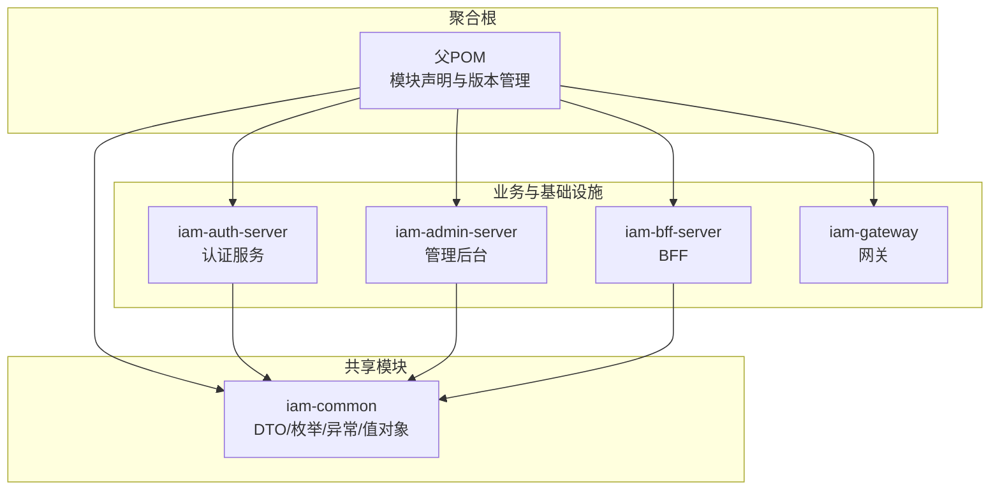
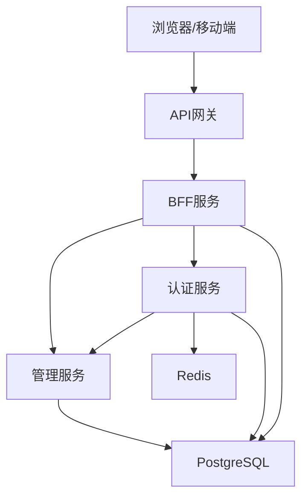
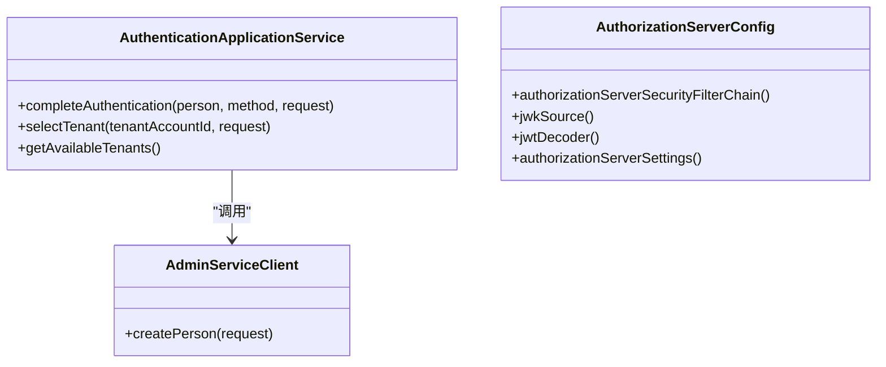
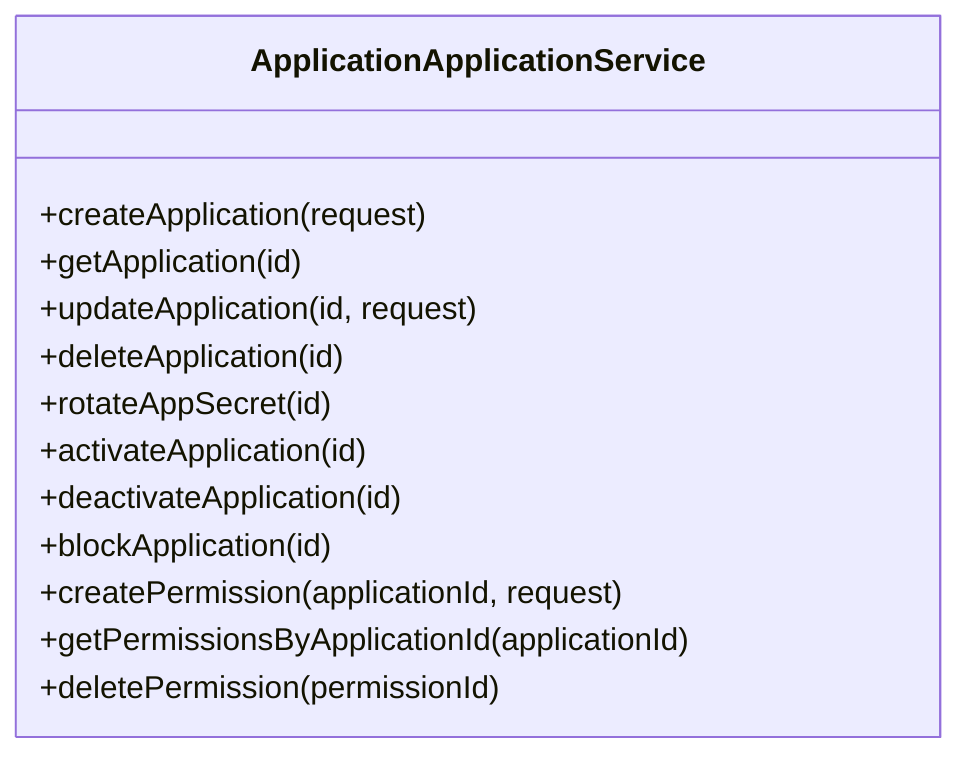
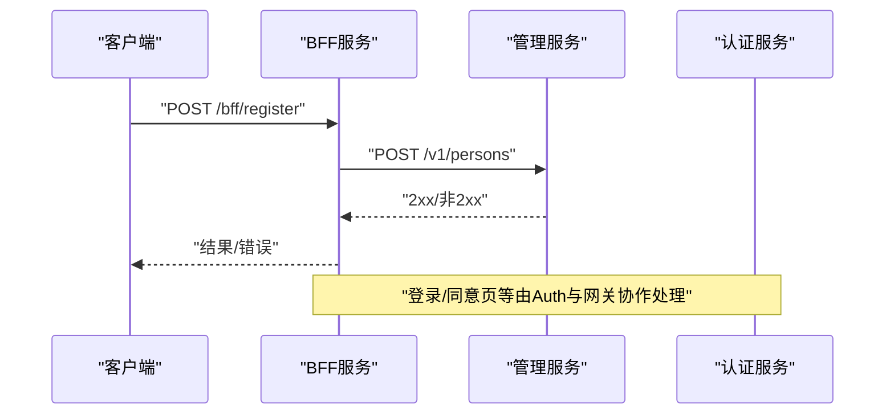
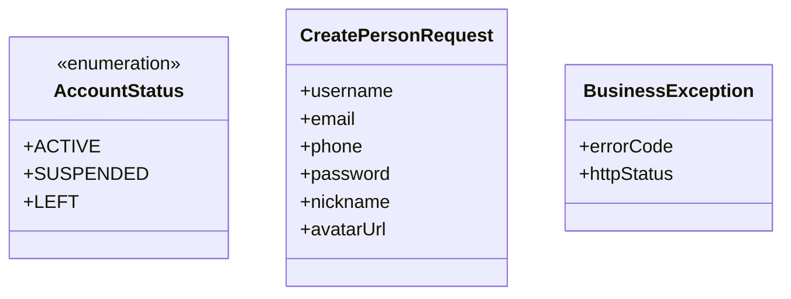
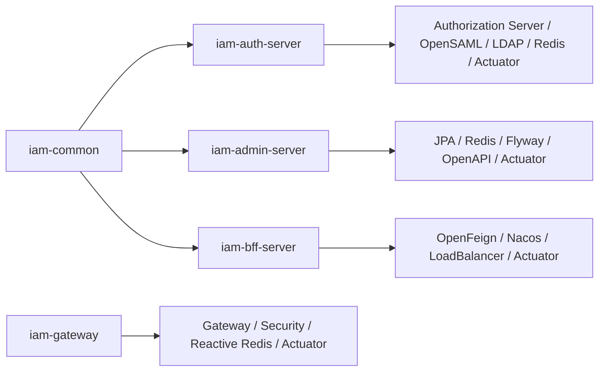

# 项目结构

<cite>
**本文引用的文件**
- [pom.xml](file://pom.xml)
- [iam-common/pom.xml](file://iam-common/pom.xml)
- [iam-auth-server/pom.xml](file://iam-auth-server/pom.xml)
- [iam-admin-server/pom.xml](file://iam-admin-server/pom.xml)
- [iam-bff-server/pom.xml](file://iam-bff-server/pom.xml)
- [iam-gateway/pom.xml](file://iam-gateway/pom.xml)
- [iam-common/src/main/java/iam/platform/common/model/enums/AccountStatus.java](file://iam-common/src/main/java/iam/platform/common/model/enums/AccountStatus.java)
- [iam-common/src/main/java/iam/platform/common/dto/request/CreatePersonRequest.java](file://iam-common/src/main/java/iam/platform/common/dto/request/CreatePersonRequest.java)
- [iam-common/src/main/java/iam/platform/common/model/exception/BusinessException.java](file://iam-common/src/main/java/iam/platform/common/model/exception/BusinessException.java)
- [iam-auth-server/src/main/java/iam/platform/auth/SsoAuthServerApplication.java](file://iam-auth-server/src/main/java/iam/platform/auth/SsoAuthServerApplication.java)
- [iam-admin-server/src/main/java/iam/platform/admin/SsoAdminServerApplication.java](file://iam-admin-server/src/main/java/iam/platform/admin/SsoAdminServerApplication.java)
- [iam-bff-server/src/main/java/iam/platform/bff/IamBffServerApplication.java](file://iam-bff-server/src/main/java/iam/platform/bff/IamBffServerApplication.java)
- [iam-gateway/src/main/java/iam/platform/gateway/IamGatewayApplication.java](file://iam-gateway/src/main/java/iam/platform/gateway/IamGatewayApplication.java)
- [iam-auth-server/src/main/java/iam/platform/auth/application/service/AuthenticationApplicationService.java](file://iam-auth-server/src/main/java/iam/platform/auth/application/service/AuthenticationApplicationService.java)
- [iam-admin-server/src/main/java/iam/platform/admin/application/service/ApplicationApplicationService.java](file://iam-admin-server/src/main/java/iam/platform/admin/application/service/ApplicationApplicationService.java)
- [iam-bff-server/src/main/java/iam/platform/bff/application/service/BffRegistrationService.java](file://iam-bff-server/src/main/java/iam/platform/bff/application/service/BffRegistrationService.java)
- [iam-auth-server/src/main/java/iam/platform/auth/interfaces/client/AdminServiceClient.java](file://iam-auth-server/src/main/java/iam/platform/auth/interfaces/client/AdminServiceClient.java)
- [iam-bff-server/src/main/java/iam/platform/bff/infrastructure/client/AdminFeignClient.java](file://iam-bff-server/src/main/java/iam/platform/bff/infrastructure/client/AdminFeignClient.java)
- [iam-auth-server/src/main/java/iam/platform/auth/infrastructure/config/AuthorizationServerConfig.java](file://iam-auth-server/src/main/java/iam/platform/auth/infrastructure/config/AuthorizationServerConfig.java)
</cite>

## 目录
1. [简介](#简介)
2. [项目结构](#项目结构)
3. [核心组件](#核心组件)
4. [架构总览](#架构总览)
5. [详细组件分析](#详细组件分析)
6. [依赖分析](#依赖分析)
7. [性能考虑](#性能考虑)
8. [故障排查指南](#故障排查指南)
9. [结论](#结论)
10. [附录](#附录)

## 简介
本项目是一个基于Spring Cloud与Spring Security的多模块IAM平台，采用分层与模块化设计，围绕“统一认证授权”“租户与账号管理”“权限与审计”“前后端分离代理”等能力进行解耦。核心模块包括：
- iam-common：通用DTO、枚举、异常、值对象与注解，供所有业务模块共享
- iam-auth-server：认证服务器（OAuth2/OIDC/CAS/SAML/LDAP），负责登录、令牌签发与协议适配
- iam-admin-server：管理后台服务（业务CRUD、审计日志、Flyway迁移）
- iam-bff-server：前端后端服务（聚合调用、简化前端逻辑）
- iam-gateway：API网关（路由、鉴权、限流、可观测）

通过模块化实现关注点分离与代码复用，同时以OpenFeign进行服务间通信，结合Nacos注册发现与Spring Security/JWT保障安全。

## 项目结构
项目采用Maven多模块聚合结构，父POM集中管理版本与插件，并定义了五个子模块。每个子模块均遵循“application/domain/infrastructure/interfaces”分层组织，配合测试与资源目录。

图表来源
- [pom.xml:21-27](file://pom.xml#L21-L27)
- [iam-common/pom.xml:14](file://iam-common/pom.xml#L14)
- [iam-auth-server/pom.xml:20-23](file://iam-auth-server/pom.xml#L20-L23)
- [iam-admin-server/pom.xml:20-23](file://iam-admin-server/pom.xml#L20-L23)
- [iam-bff-server/pom.xml:20-23](file://iam-bff-server/pom.xml#L20-L23)

章节来源
- [pom.xml:21-27](file://pom.xml#L21-L27)
- [iam-common/pom.xml:14](file://iam-common/pom.xml#L14)
- [iam-auth-server/pom.xml:20-23](file://iam-auth-server/pom.xml#L20-L23)
- [iam-admin-server/pom.xml:20-23](file://iam-admin-server/pom.xml#L20-L23)
- [iam-bff-server/pom.xml:20-23](file://iam-bff-server/pom.xml#L20-L23)

## 核心组件
- iam-common：提供跨模块共享的数据传输对象、领域枚举、业务异常基类、值对象与注解，确保契约一致与复用
- iam-auth-server：统一认证入口，支持OIDC、CAS、SAML、LDAP等多种协议；内置租户上下文与会话管理
- iam-admin-server：面向管理员的业务中心，提供应用、人员、组织、角色、权限等CRUD与审计
- iam-bff-server：前端后端聚合层，封装对admin/auth的调用，简化前端交互
- iam-gateway：统一入口，负责路由、鉴权、限流与可观测性

章节来源
- [iam-common/src/main/java/iam/platform/common/model/enums/AccountStatus.java:1-6](file://iam-common/src/main/java/iam/platform/common/model/enums/AccountStatus.java#L1-L6)
- [iam-common/src/main/java/iam/platform/common/dto/request/CreatePersonRequest.java:1-37](file://iam-common/src/main/java/iam/platform/common/dto/request/CreatePersonRequest.java#L1-L37)
- [iam-common/src/main/java/iam/platform/common/model/exception/BusinessException.java:1-17](file://iam-common/src/main/java/iam/platform/common/model/exception/BusinessException.java#L1-L17)
- [iam-auth-server/src/main/java/iam/platform/auth/SsoAuthServerApplication.java:1-19](file://iam-auth-server/src/main/java/iam/platform/auth/SsoAuthServerApplication.java#L1-L19)
- [iam-admin-server/src/main/java/iam/platform/admin/SsoAdminServerApplication.java:1-17](file://iam-admin-server/src/main/java/iam/platform/admin/SsoAdminServerApplication.java#L1-L17)
- [iam-bff-server/src/main/java/iam/platform/bff/IamBffServerApplication.java:1-17](file://iam-bff-server/src/main/java/iam/platform/bff/IamBffServerApplication.java#L1-L17)
- [iam-gateway/src/main/java/iam/platform/gateway/IamGatewayApplication.java:1-15](file://iam-gateway/src/main/java/iam/platform/gateway/IamGatewayApplication.java#L1-L15)

## 架构总览
系统采用“网关+认证+管理+聚合+BFF”的分层架构，通过OpenFeign在服务间进行声明式调用，结合Nacos进行服务发现与配置管理。

图表来源
- [iam-gateway/src/main/java/iam/platform/gateway/IamGatewayApplication.java:1-15](file://iam-gateway/src/main/java/iam/platform/gateway/IamGatewayApplication.java#L1-L15)
- [iam-bff-server/src/main/java/iam/platform/bff/IamBffServerApplication.java:1-17](file://iam-bff-server/src/main/java/iam/platform/bff/IamBffServerApplication.java#L1-L17)
- [iam-auth-server/src/main/java/iam/platform/auth/SsoAuthServerApplication.java:1-19](file://iam-auth-server/src/main/java/iam/platform/auth/SsoAuthServerApplication.java#L1-L19)
- [iam-admin-server/src/main/java/iam/platform/admin/SsoAdminServerApplication.java:1-17](file://iam-admin-server/src/main/java/iam/platform/admin/SsoAdminServerApplication.java#L1-L17)

## 详细组件分析

### 认证服务（iam-auth-server）
- 职责：统一认证、OIDC/CAS/SAML/LDAP接入、租户上下文、会话与令牌管理
- 关键点：
  - 应用服务完成认证收尾与租户选择，建立带租户信息的认证上下文
  - 安全配置集成Authorization Server，加载JWK并注入租户过滤器
  - 接口层通过Feign客户端调用管理服务（如注册）

图表来源
- [iam-auth-server/src/main/java/iam/platform/auth/application/service/AuthenticationApplicationService.java:1-139](file://iam-auth-server/src/main/java/iam/platform/auth/application/service/AuthenticationApplicationService.java#L1-L139)
- [iam-auth-server/src/main/java/iam/platform/auth/infrastructure/config/AuthorizationServerConfig.java:1-130](file://iam-auth-server/src/main/java/iam/platform/auth/infrastructure/config/AuthorizationServerConfig.java#L1-L130)
- [iam-auth-server/src/main/java/iam/platform/auth/interfaces/client/AdminServiceClient.java:1-27](file://iam-auth-server/src/main/java/iam/platform/auth/interfaces/client/AdminServiceClient.java#L1-L27)

章节来源
- [iam-auth-server/src/main/java/iam/platform/auth/application/service/AuthenticationApplicationService.java:1-139](file://iam-auth-server/src/main/java/iam/platform/auth/application/service/AuthenticationApplicationService.java#L1-L139)
- [iam-auth-server/src/main/java/iam/platform/auth/infrastructure/config/AuthorizationServerConfig.java:1-130](file://iam-auth-server/src/main/java/iam/platform/auth/infrastructure/config/AuthorizationServerConfig.java#L1-L130)
- [iam-auth-server/src/main/java/iam/platform/auth/interfaces/client/AdminServiceClient.java:1-27](file://iam-auth-server/src/main/java/iam/platform/auth/interfaces/client/AdminServiceClient.java#L1-L27)

### 管理服务（iam-admin-server）
- 职责：应用管理、人员组织、角色权限、审计日志、数据库迁移
- 关键点：
  - 应用服务封装业务操作，使用审计注解记录变更事件
  - 领域模型与仓储分离，保证业务规则内聚

图表来源
- [iam-admin-server/src/main/java/iam/platform/admin/application/service/ApplicationApplicationService.java:1-255](file://iam-admin-server/src/main/java/iam/platform/admin/application/service/ApplicationApplicationService.java#L1-L255)

章节来源
- [iam-admin-server/src/main/java/iam/platform/admin/application/service/ApplicationApplicationService.java:1-255](file://iam-admin-server/src/main/java/iam/platform/admin/application/service/ApplicationApplicationService.java#L1-L255)

### BFF服务（iam-bff-server）
- 职责：前端后端聚合，封装对认证与管理服务的调用，简化前端交互
- 关键点：
  - 通过Feign客户端调用管理服务进行用户注册等操作
  - 与网关协同，统一处理登录、注册、同意页等流程

图表来源
- [iam-bff-server/src/main/java/iam/platform/bff/application/service/BffRegistrationService.java:1-31](file://iam-bff-server/src/main/java/iam/platform/bff/application/service/BffRegistrationService.java#L1-L31)
- [iam-bff-server/src/main/java/iam/platform/bff/infrastructure/client/AdminFeignClient.java:1-26](file://iam-bff-server/src/main/java/iam/platform/bff/infrastructure/client/AdminFeignClient.java#L1-L26)
- [iam-auth-server/src/main/java/iam/platform/auth/interfaces/client/AdminServiceClient.java:1-27](file://iam-auth-server/src/main/java/iam/platform/auth/interfaces/client/AdminServiceClient.java#L1-L27)

章节来源
- [iam-bff-server/src/main/java/iam/platform/bff/application/service/BffRegistrationService.java:1-31](file://iam-bff-server/src/main/java/iam/platform/bff/application/service/BffRegistrationService.java#L1-L31)
- [iam-bff-server/src/main/java/iam/platform/bff/infrastructure/client/AdminFeignClient.java:1-26](file://iam-bff-server/src/main/java/iam/platform/bff/infrastructure/client/AdminFeignClient.java#L1-L26)
- [iam-auth-server/src/main/java/iam/platform/auth/interfaces/client/AdminServiceClient.java:1-27](file://iam-auth-server/src/main/java/iam/platform/auth/interfaces/client/AdminServiceClient.java#L1-L27)

### 网关（iam-gateway）
- 职责：统一入口、路由、鉴权（JWT）、限流、可观测
- 关键点：启用网关与安全模块，结合Nacos与负载均衡

章节来源
- [iam-gateway/src/main/java/iam/platform/gateway/IamGatewayApplication.java:1-15](file://iam-gateway/src/main/java/iam/platform/gateway/IamGatewayApplication.java#L1-L15)

### 通用模块（iam-common）
- 设计思想：提供跨模块共享的契约（DTO/枚举/异常/值对象/注解），确保一致性与可复用性
- 典型元素：
  - 枚举：账户状态等
  - 请求DTO：如创建人员请求
  - 异常基类：统一错误码与HTTP状态
  - 注解：审计、权限等横切能力

图表来源
- [iam-common/src/main/java/iam/platform/common/model/enums/AccountStatus.java:1-6](file://iam-common/src/main/java/iam/platform/common/model/enums/AccountStatus.java#L1-L6)
- [iam-common/src/main/java/iam/platform/common/dto/request/CreatePersonRequest.java:1-37](file://iam-common/src/main/java/iam/platform/common/dto/request/CreatePersonRequest.java#L1-L37)
- [iam-common/src/main/java/iam/platform/common/model/exception/BusinessException.java:1-17](file://iam-common/src/main/java/iam/platform/common/model/exception/BusinessException.java#L1-L17)

章节来源
- [iam-common/src/main/java/iam/platform/common/model/enums/AccountStatus.java:1-6](file://iam-common/src/main/java/iam/platform/common/model/enums/AccountStatus.java#L1-L6)
- [iam-common/src/main/java/iam/platform/common/dto/request/CreatePersonRequest.java:1-37](file://iam-common/src/main/java/iam/platform/common/dto/request/CreatePersonRequest.java#L1-L37)
- [iam-common/src/main/java/iam/platform/common/model/exception/BusinessException.java:1-17](file://iam-common/src/main/java/iam/platform/common/model/exception/BusinessException.java#L1-L17)

## 依赖分析
- 父POM集中管理Spring Cloud与Spring Cloud Alibaba版本，统一插件与编码
- 子模块依赖关系：
  - 认证/管理/BFF显式依赖通用模块
  - 认证服务引入Authorization Server、OpenSAML、LDAP、Redis、Actuator等
  - 管理服务引入JPA、Redis、Flyway、OpenAPI等
  - BFF引入OpenFeign、Nacos、LoadBalancer、Actuator
  - 网关引入Gateway、Security、Reactive Redis、Prometheus、Zipkin

图表来源
- [pom.xml:43-122](file://pom.xml#L43-L122)
- [iam-auth-server/pom.xml:18-166](file://iam-auth-server/pom.xml#L18-L166)
- [iam-admin-server/pom.xml:18-136](file://iam-admin-server/pom.xml#L18-L136)
- [iam-bff-server/pom.xml:18-88](file://iam-bff-server/pom.xml#L18-L88)
- [iam-gateway/pom.xml:17-95](file://iam-gateway/pom.xml#L17-L95)

章节来源
- [pom.xml:43-122](file://pom.xml#L43-L122)
- [iam-auth-server/pom.xml:18-166](file://iam-auth-server/pom.xml#L18-L166)
- [iam-admin-server/pom.xml:18-136](file://iam-admin-server/pom.xml#L18-L136)
- [iam-bff-server/pom.xml:18-88](file://iam-bff-server/pom.xml#L18-L88)
- [iam-gateway/pom.xml:17-95](file://iam-gateway/pom.xml#L17-L95)

## 性能考虑
- 服务拆分与职责单一：认证、管理、聚合、网关各司其职，降低耦合度与热点集中风险
- 缓存与会话：认证与管理服务使用Redis缓存与分布式会话，提升并发与可用性
- 观测性：Actuator + Prometheus + Brave Zipkin，便于追踪与指标采集
- 协议与算法：JWK KeyID稳定策略减少客户端缓存失效，提升令牌验证效率
- 负载均衡与限流：网关侧结合负载均衡与限流策略，保护下游服务

## 故障排查指南
- 认证失败
  - 检查Authorization Server安全链路与租户过滤器是否正确注入
  - 核对JWK私钥/公钥路径与KeyID生成逻辑
- 服务间调用异常
  - 确认Feign客户端配置与服务名映射
  - 检查Nacos注册发现与负载均衡配置
- 数据不一致或迁移问题
  - 管理服务Flyway脚本执行顺序与版本
- 会话与租户上下文
  - 租户选择后上下文是否正确写入Session与TenantContext

章节来源
- [iam-auth-server/src/main/java/iam/platform/auth/infrastructure/config/AuthorizationServerConfig.java:1-130](file://iam-auth-server/src/main/java/iam/platform/auth/infrastructure/config/AuthorizationServerConfig.java#L1-L130)
- [iam-auth-server/src/main/java/iam/platform/auth/interfaces/client/AdminServiceClient.java:1-27](file://iam-auth-server/src/main/java/iam/platform/auth/interfaces/client/AdminServiceClient.java#L1-L27)
- [iam-bff-server/src/main/java/iam/platform/bff/infrastructure/client/AdminFeignClient.java:1-26](file://iam-bff-server/src/main/java/iam/platform/bff/infrastructure/client/AdminFeignClient.java#L1-L26)

## 结论
本项目通过清晰的模块划分与分层设计，实现了认证、管理、聚合与网关的解耦，借助OpenFeign与Nacos构建了高可用的服务网络。通用模块提供一致的契约与基础能力，支撑上层业务快速演进。建议在新增模块时遵循现有分层与命名约定，优先复用iam-common，确保跨模块一致性与可维护性。

## 附录
- 包结构最佳实践
  - application：应用服务编排、事务边界、审计注解
  - domain：领域模型与行为、不变量与业务规则
  - infrastructure：配置、持久化、外部接口适配
  - interfaces：REST/Web/Clients、模板与静态资源
- 扩展与定制指导
  - 新增领域实体时，先在domain定义行为，再在application编排，最后在infrastructure实现仓储
  - 通过Feign客户端与Nacos实现服务解耦，避免硬编码URL
  - 使用iam-common中的枚举与异常体系，保持错误语义一致