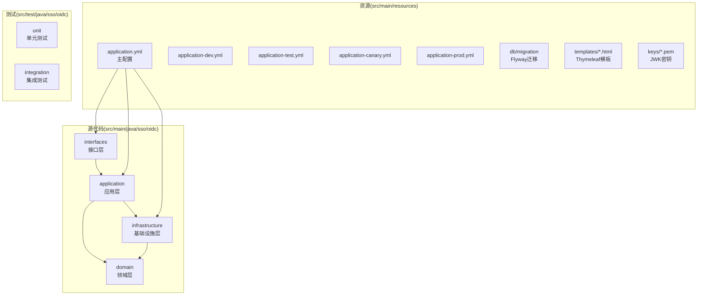
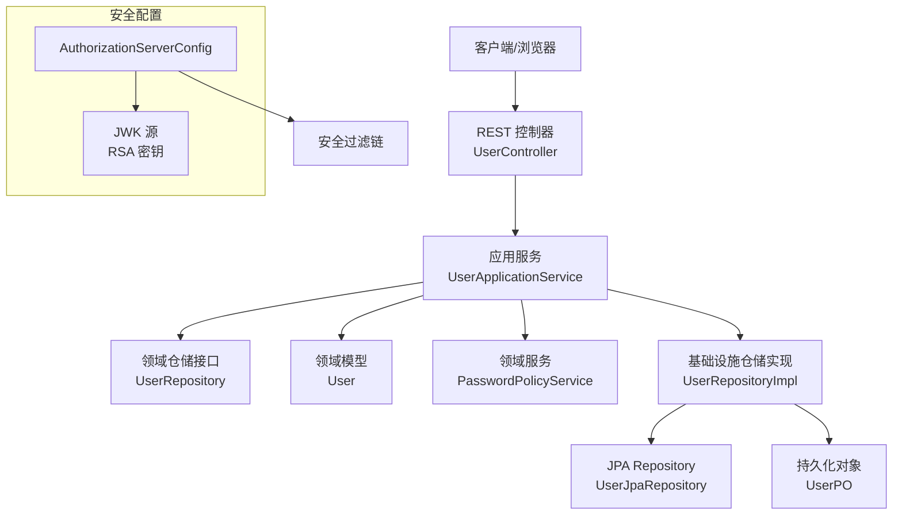
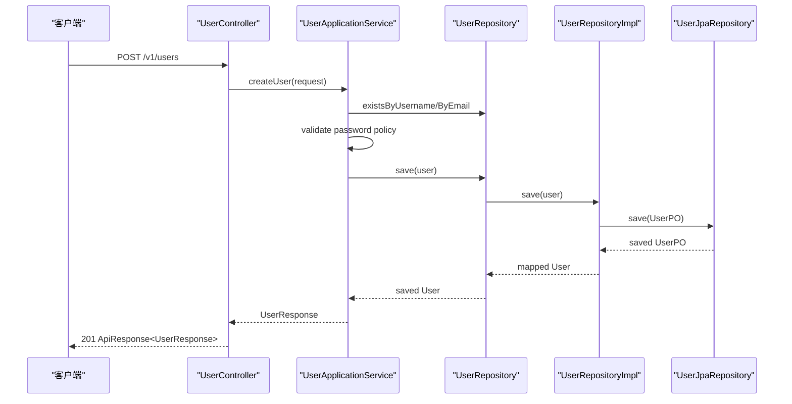
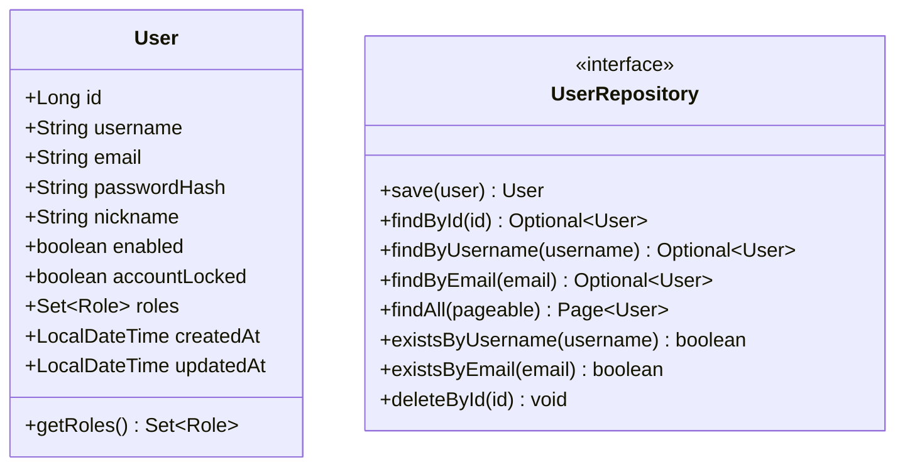
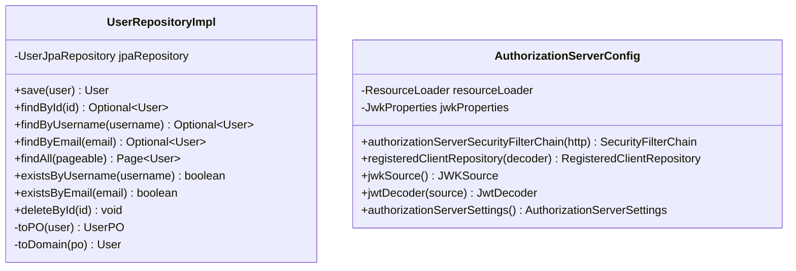
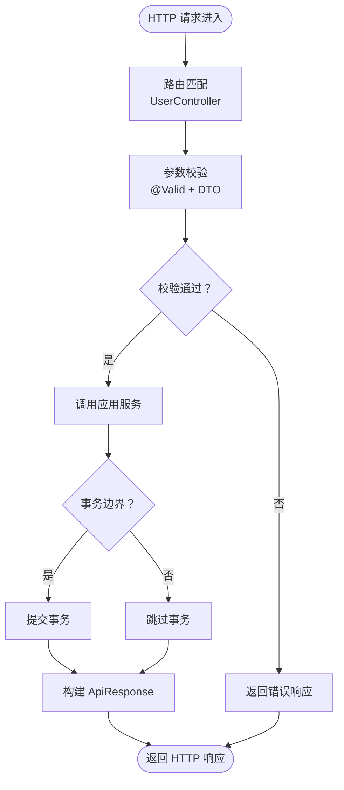

# 项目结构说明

<cite>
**本文引用的文件**
- [pom.xml](file://pom.xml)
- [SsoOidcApplication.java](file://src/main/java/sso/oidc/SsoOidcApplication.java)
- [application.yml](file://src/main/resources/application.yml)
- [application-dev.yml](file://src/main/resources/application-dev.yml)
- [application-prod.yml](file://src/main/resources/application-prod.yml)
- [User.java](file://src/main/java/sso/oidc/domain/model/entity/User.java)
- [UserApplicationService.java](file://src/main/java/sso/oidc/application/service/UserApplicationService.java)
- [UserController.java](file://src/main/java/sso/oidc/interfaces/rest/UserController.java)
- [AuthorizationServerConfig.java](file://src/main/java/sso/oidc/infrastructure/config/AuthorizationServerConfig.java)
- [UserRepository.java](file://src/main/java/sso/oidc/domain/repository/UserRepository.java)
- [UserRepositoryImpl.java](file://src/main/java/sso/oidc/infrastructure/persistence/impl/UserRepositoryImpl.java)
- [CreateUserRequest.java](file://src/main/java/sso/oidc/application/dto/request/CreateUserRequest.java)
- [UserStatus.java](file://src/main/java/sso/oidc/domain/model/enums/UserStatus.java)
- [README.md](file://README.md)
</cite>

## 目录
1. [简介](#简介)
2. [项目结构](#项目结构)
3. [核心组件](#核心组件)
4. [架构总览](#架构总览)
5. [详细组件分析](#详细组件分析)
6. [依赖分析](#依赖分析)
7. [性能考虑](#性能考虑)
8. [故障排查指南](#故障排查指南)
9. [结论](#结论)
10. [附录](#附录)

## 简介
本项目是一个基于 Spring Authorization Server 的 IAM Platform 认证服务，采用 DDD 分层架构设计，将应用层、领域层、基础设施层和接口层清晰分离，确保业务逻辑与技术实现解耦。项目通过 Spring Boot 提供开箱即用的 Web、安全、数据访问与可观测性能力，并结合 Kustomize/Kubernetes 实现多环境部署与配置隔离。

## 项目结构
项目遵循标准 Maven 结构，核心代码位于 src/main/java 下，按 DDD 分层组织；资源文件位于 src/main/resources；测试位于 src/test/java。

**图表来源**
- [SsoOidcApplication.java:1-13](file://src/main/java/sso/oidc/SsoOidcApplication.java#L1-L13)
- [application.yml:1-78](file://src/main/resources/application.yml#L1-L78)
- [application-dev.yml:1-22](file://src/main/resources/application-dev.yml#L1-L22)
- [application-prod.yml:1-25](file://src/main/resources/application-prod.yml#L1-L25)

**章节来源**
- [README.md:104-139](file://README.md#L104-L139)

## 核心组件
- 应用层(application)：封装业务用例，协调领域服务与仓储，负责输入输出 DTO 映射与事务边界控制。
- 领域层(domain)：承载核心业务实体、值对象、枚举与领域异常，定义不变业务规则与行为契约。
- 基础设施层(infrastructure)：提供持久化实现、安全配置、外部服务适配与技术细节。
- 接口层(interfaces)：暴露 REST API 与 Web 页面控制器，作为系统入口。

**章节来源**
- [UserApplicationService.java:1-165](file://src/main/java/sso/oidc/application/service/UserApplicationService.java#L1-L165)
- [User.java:1-36](file://src/main/java/sso/oidc/domain/model/entity/User.java#L1-L36)
- [AuthorizationServerConfig.java:1-144](file://src/main/java/sso/oidc/infrastructure/config/AuthorizationServerConfig.java#L1-L144)
- [UserController.java:1-90](file://src/main/java/sso/oidc/interfaces/rest/UserController.java#L1-L90)

## 架构总览
下图展示了从接口层到应用层、领域层与基础设施层的调用关系，以及 OIDC 授权服务器配置与 JWK 密钥加载的关键交互。

**图表来源**
- [UserController.java:1-90](file://src/main/java/sso/oidc/interfaces/rest/UserController.java#L1-L90)
- [UserApplicationService.java:1-165](file://src/main/java/sso/oidc/application/service/UserApplicationService.java#L1-L165)
- [UserRepository.java:1-26](file://src/main/java/sso/oidc/domain/repository/UserRepository.java#L1-L26)
- [UserRepositoryImpl.java:1-92](file://src/main/java/sso/oidc/infrastructure/persistence/impl/UserRepositoryImpl.java#L1-L92)
- [AuthorizationServerConfig.java:1-144](file://src/main/java/sso/oidc/infrastructure/config/AuthorizationServerConfig.java#L1-L144)

## 详细组件分析

### 应用层：用户管理用例
- 职责：处理用户创建、更新、删除、列表、密码修改、角色分配/移除等业务用例。
- 关键点：统一事务边界、参数校验、密码策略校验、异常处理与日志记录。
- DTO：请求 DTO(CreateUserRequest)与响应 DTO(UserResponse)。

**图表来源**
- [UserController.java:35-40](file://src/main/java/sso/oidc/interfaces/rest/UserController.java#L35-L40)
- [UserApplicationService.java:36-63](file://src/main/java/sso/oidc/application/service/UserApplicationService.java#L36-L63)
- [UserRepositoryImpl.java:20-25](file://src/main/java/sso/oidc/infrastructure/persistence/impl/UserRepositoryImpl.java#L20-L25)

**章节来源**
- [UserApplicationService.java:1-165](file://src/main/java/sso/oidc/application/service/UserApplicationService.java#L1-L165)
- [CreateUserRequest.java:1-31](file://src/main/java/sso/oidc/application/dto/request/CreateUserRequest.java#L1-L31)

### 领域层：用户实体与仓储接口
- User 实体：包含用户标识、凭证、属性与角色集合，提供空集合防御。
- UserRepository 接口：定义领域级的读写与存在性检查方法，屏蔽底层实现。

**图表来源**
- [User.java:1-36](file://src/main/java/sso/oidc/domain/model/entity/User.java#L1-L36)
- [UserRepository.java:1-26](file://src/main/java/sso/oidc/domain/repository/UserRepository.java#L1-L26)

**章节来源**
- [User.java:1-36](file://src/main/java/sso/oidc/domain/model/entity/User.java#L1-L36)
- [UserRepository.java:1-26](file://src/main/java/sso/oidc/domain/repository/UserRepository.java#L1-L26)
- [UserStatus.java:1-8](file://src/main/java/sso/oidc/domain/model/enums/UserStatus.java#L1-L8)

### 基础设施层：仓储实现与安全配置
- UserRepositoryImpl：将领域模型与 JPA 实体双向映射，委托 JPA Repository 完成持久化。
- AuthorizationServerConfig：配置 OIDC 授权服务器、安全过滤链、JWK 源与授权设置。

**图表来源**
- [UserRepositoryImpl.java:1-92](file://src/main/java/sso/oidc/infrastructure/persistence/impl/UserRepositoryImpl.java#L1-L92)
- [AuthorizationServerConfig.java:1-144](file://src/main/java/sso/oidc/infrastructure/config/AuthorizationServerConfig.java#L1-L144)

**章节来源**
- [UserRepositoryImpl.java:1-92](file://src/main/java/sso/oidc/infrastructure/persistence/impl/UserRepositoryImpl.java#L1-L92)
- [AuthorizationServerConfig.java:1-144](file://src/main/java/sso/oidc/infrastructure/config/AuthorizationServerConfig.java#L1-L144)

### 接口层：REST API 与 Web 控制器
- UserController：提供用户资源的 REST API，统一返回 ApiResponse 包装。
- Web 控制器：LoginController、RegistrationController、ConsentController（位于 interfaces/web）用于服务端渲染页面。

**图表来源**
- [UserController.java:1-90](file://src/main/java/sso/oidc/interfaces/rest/UserController.java#L1-L90)

**章节来源**
- [UserController.java:1-90](file://src/main/java/sso/oidc/interfaces/rest/UserController.java#L1-L90)

## 依赖分析
- 构建与打包：Maven + Spring Boot 插件，支持多环境 Profile 与 Docker 镜像标签。
- 运行时依赖：Web、Security、JPA、Redis、Thymeleaf、Authorization Server、OpenAPI、Actuator/Micrometer/Tracing。
- 测试依赖：Spring Boot Test、Security Test、Testcontainers(PostgreSQL)。

```mermaid
graph TB
POM["pom.xml 依赖声明"] --> Web["spring-boot-starter-web"]
POM --> Sec["spring-boot-starter-security"]
POM --> JPA["spring-boot-starter-data-jpa"]
POM --> Redis["spring-boot-starter-data-redis"]
POM --> Thym["spring-boot-starter-thymeleaf"]
POM --> OA["springdoc-openapi-starter-webmvc-ui"]
POM --> Act["spring-boot-starter-actuator"]
POM --> Mic["micrometer-registry-prometheus"]
POM --> Zip["zipkin-reporter-brave"]
POM --> Authz["spring-security-oauth2-authorization-server"]
POM --> Fly["flyway-core"]
POM --> Pg["postgresql(runtime)"]
POM --> TC["testcontainers"]
```

**图表来源**
- [pom.xml:29-140](file://pom.xml#L29-L140)

**章节来源**
- [pom.xml:1-225](file://pom.xml#L1-L225)

## 性能考虑
- 数据库连接池：HikariCP，根据环境调整最大池大小与空闲超时。
- 缓存与会话：Redis 作为缓存与分布式会话存储，提升并发与横向扩展能力。
- ORM 优化：禁用 open-in-view，避免懒加载陷阱；SQL 输出仅在开发环境开启。
- 观测性：Prometheus 指标与 Zipkin 链路追踪，默认全采样，生产降低采样率。
- API 文档：Swagger UI 在开发/测试环境启用，生产关闭以减少攻击面。

**章节来源**
- [application.yml:13-46](file://src/main/resources/application.yml#L13-L46)
- [application-dev.yml:1-22](file://src/main/resources/application-dev.yml#L1-L22)
- [application-prod.yml:1-25](file://src/main/resources/application-prod.yml#L1-L25)

## 故障排查指南
- 配置隔离问题：确认 SPRING_PROFILES_ACTIVE 与 Docker 镜像标签一致；检查环境配置文件差异。
- 数据库迁移失败：查看 Flyway 迁移脚本执行状态与日志，确认 V1/V2 是否正确应用。
- OIDC 认证失败：核对 JWK 私钥/公钥路径、JWT 解码器配置与授权服务器设置。
- 密码策略校验失败：检查密码策略服务实现与请求 DTO 字段约束。
- 日志级别：开发环境开启 DEBUG，生产环境收敛至 INFO/WARN。

**章节来源**
- [application.yml:1-78](file://src/main/resources/application.yml#L1-L78)
- [AuthorizationServerConfig.java:93-124](file://src/main/java/sso/oidc/infrastructure/config/AuthorizationServerConfig.java#L93-L124)

## 结论
本项目通过 DDD 分层与清晰的包结构，实现了业务与技术的解耦，配合 Spring Authorization Server 提供了标准的 OIDC 能力。借助多环境配置与 Kustomize/Kubernetes，能够稳定地支撑从开发到生产的全生命周期交付。

## 附录

### 配置文件命名规范与环境隔离
- 主配置：application.yml（定义基础配置与环境变量占位符）
- 环境配置：application-{env}.yml（dev/test/canary/prod）
- 激活方式：SPRING_PROFILES_ACTIVE 环境变量或 Maven Profile
- Docker 标签：随 Profile 动态生成镜像标签

**章节来源**
- [application.yml:7-8](file://src/main/resources/application.yml#L7-L8)
- [application-dev.yml:1-22](file://src/main/resources/application-dev.yml#L1-L22)
- [application-prod.yml:1-25](file://src/main/resources/application-prod.yml#L1-L25)
- [pom.xml:184-223](file://pom.xml#L184-L223)

### 构建配置关键设置
- Java 版本：21
- Spring Boot 版本：父工程继承
- 编译插件：启用 Lombok 与 MapStruct 注解处理器
- Profile：dev/test/canary/prod，分别对应不同 Docker 镜像标签
- 依赖：Authorization Server、JPA、Redis、Flyway、OpenAPI、Actuator/Micrometer/Tracing、Testcontainers

**章节来源**
- [pom.xml:20-27](file://pom.xml#L20-L27)
- [pom.xml:142-182](file://pom.xml#L142-L182)
- [pom.xml:184-223](file://pom.xml#L184-L223)

### 代码导航建议与最佳实践
- 导航建议：从 SsoOidcApplication 启动类入手，依次浏览 interfaces -> application -> domain -> infrastructure。
- 最佳实践：
  - 严格区分领域模型与持久化对象，通过仓储实现解耦。
  - 应用服务承担事务边界与用例编排，避免在控制器中直接调用仓储。
  - DTO 与响应包装类统一返回格式，便于前端消费与可观测性采集。
  - 领域异常与业务异常明确区分，避免泄漏敏感信息。
  - 配置通过环境变量注入，避免硬编码。

**章节来源**
- [SsoOidcApplication.java:1-13](file://src/main/java/sso/oidc/SsoOidcApplication.java#L1-L13)
- [README.md:141-185](file://README.md#L141-L185)