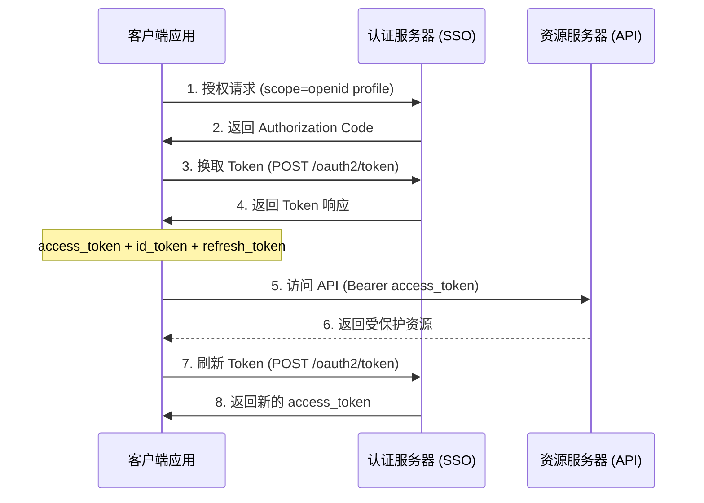
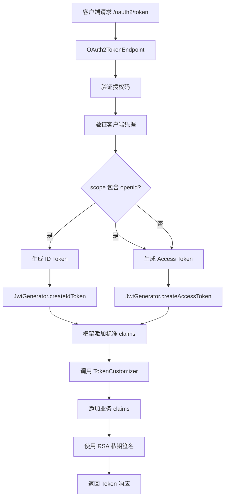
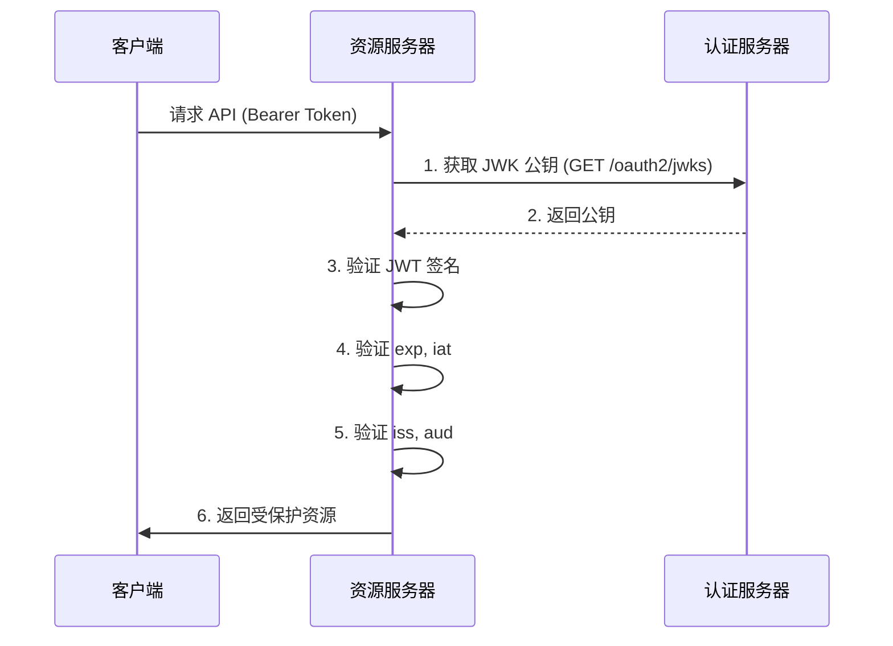
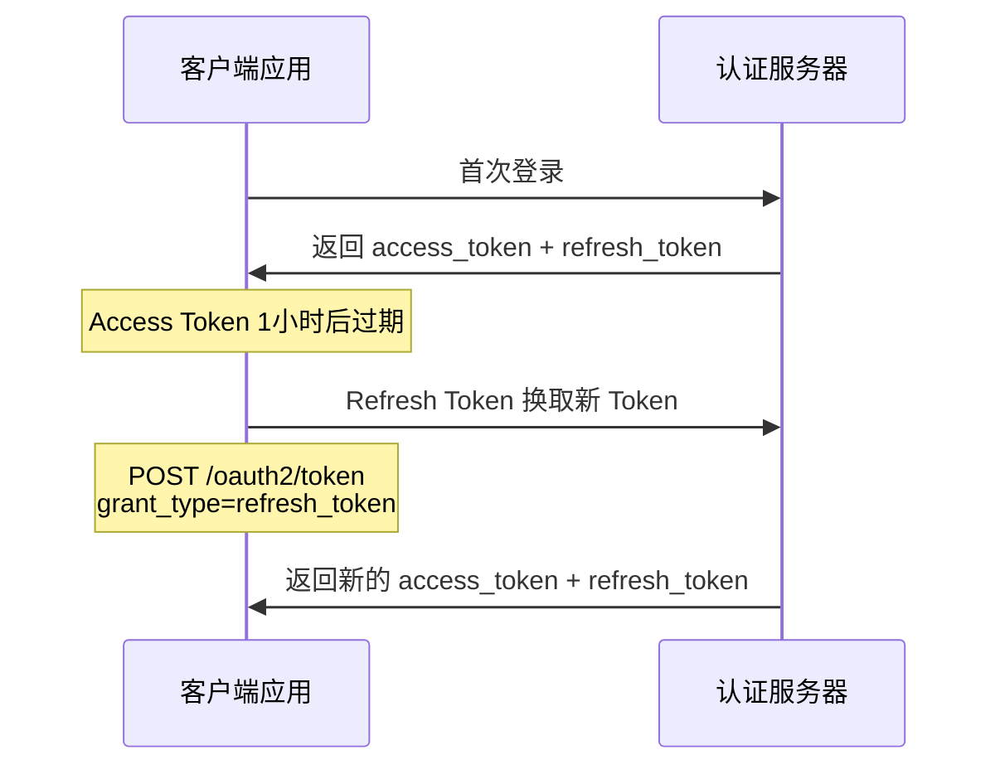

# Token 机制详解

## 目录

1. [Token 类型与用途](#1-token-类型与用途)
2. [ID Token vs Access Token](#2-id-token-vs-access-token)
3. [Token 生成机制](#3-token-生成机制)
4. [标准 Claims (框架自动添加)](#4-标准-claims-框架自动添加)
5. [自定义 Claims (业务扩展)](#5-自定义-claims-业务扩展)
6. [Scope 驱动的 Claims 过滤](#6-scope-驱动的-claims-过滤)
7. [Token 生命周期管理](#7-token-生命周期管理)
8. [Token 签名与验证](#8-token-签名与验证)
9. [Refresh Token 机制](#9-refresh-token-机制)
10. [最佳实践](#10-最佳实践)

---

## 1. Token 类型与用途

### OAuth 2.0 / OIDC 中的三种 Token

| Token 类型 | 用途 | 格式 | 受众 |
|-----------|------|------|------|
| **Access Token** | 授权访问资源服务器 | JWT 或 不透明 Token | 资源服务器 (API) |
| **ID Token** | 证明用户身份 | JWT (必须) | 客户端应用 |
| **Refresh Token** | 刷新 Access Token | 不透明字符串 | 认证服务器 |

### Token 在认证流程中的位置



---

## 2. ID Token vs Access Token

### 核心区别

| 对比项 | ID Token | Access Token |
|-------|----------|--------------|
| **主要用途** | 证明用户身份（我是谁） | 授权访问资源（我能做什么） |
| **协议要求** | OIDC 必须 (scope 包含 openid) | OAuth 2.0 基础 |
| **格式** | JWT (标准化) | JWT 或 不透明 Token |
| **受众 (aud)** | 客户端应用 ID | 资源服务器标识 |
| **验证方** | 客户端验证签名 | 资源服务器验证或内省 |
| **生命周期** | 较短 (通常 1 小时) | 可配置 (1-24 小时) |

### ID Token 示例

```json
{
  "alg": "RS256",
  "typ": "JWT"
}
.
{
  // 标准 OIDC Claims
  "iss": "http://localhost:9000",
  "sub": "person-uuid-123",
  "aud": "client-id-abc",
  "exp": 1704067200,
  "iat": 1704063600,
  "auth_time": 1704063500,
  "nonce": "n-0S6_WzA2Mj",
  
  // 自定义 Claims (根据 scope)
  "email": "user@example.com",
  "nickname": "张三",
  "person_id": 123
}
.
[Signature]
```

### Access Token 示例

```json
{
  "alg": "RS256",
  "typ": "JWT"
}
.
{
  // 标准 OAuth2 Claims
  "iss": "http://localhost:9000",
  "sub": "person-uuid-123",
  "aud": "client-id-abc",
  "exp": 1704067200,
  "iat": 1704063600,
  "scope": "openid profile email",
  "client_id": "client-id-abc",
  
  // 自定义 Claims
  "tenant_id": 456,
  "roles": ["admin", "user"],
  "permissions": ["read", "write"]
}
.
[Signature]
```

---

## 3. Token 生成机制

### 项目架构：框架自动 + 自定义扩展

本项目基于 **Spring Authorization Server** 构建，Token 生成采用两层架构：

```
┌─────────────────────────────────────────────────┐
│  第一层：框架自动生成标准 Claims                  │
│  - iss, sub, aud, exp, iat, scope, jti          │
│  - auth_time, nonce (ID Token 特有)             │
└─────────────────────────────────────────────────┘
                    ↓
┌─────────────────────────────────────────────────┐
│  第二层：TokenCustomizer 添加业务 Claims         │
│  - email, nickname, roles                       │
│  - tenant_id, tenant_code                       │
│  - permissions, tenant_accounts                 │
└─────────────────────────────────────────────────┘
```

### 代码实现位置

#### 1. 框架配置

[AuthorizationServerConfig.java](file:///d:/VsCodeProject/iam-platform/sso-auth-server/src/main/java/sso/oidc/auth/infrastructure/config/AuthorizationServerConfig.java)

```java
@Configuration
public class AuthorizationServerConfig {
    
    @Bean
    @Order(1)
    public SecurityFilterChain authorizationServerSecurityFilterChain(HttpSecurity http) 
            throws Exception {
        // 应用默认 OAuth2 安全配置
        OAuth2AuthorizationServerConfiguration.applyDefaultSecurity(http);
        
        // 启用 OIDC 支持 (启用 ID Token 生成)
        http.getConfigurer(OAuth2AuthorizationServerConfigurer.class)
                .oidc(Customizer.withDefaults());  // ← 关键配置
        
        // 启用 JWT Resource Server 支持
        http.oauth2ResourceServer(rs -> rs.jwt(Customizer.withDefaults()));
        
        return http.build();
    }
    
    // JWK 密钥源 (用于签名 Token)
    @Bean
    public JWKSource<SecurityContext> jwkSource() {
        // 加载 RSA 密钥对
        RSAKey rsaKey = new RSAKey.Builder(publicKey)
                .privateKey(privateKey)
                .keyID(keyId)
                .build();
        return new ImmutableJWKSet<>(new JWKSet(rsaKey));
    }
}
```

#### 2. 自定义 Claims

[TokenCustomizer.java](file:///d:/VsCodeProject/iam-platform/sso-auth-server/src/main/java/sso/oidc/auth/infrastructure/security/TokenCustomizer.java)

```java
@Component
@RequiredArgsConstructor
public class TokenCustomizer implements OAuth2TokenCustomizer<JwtEncodingContext> {
    
    private final PersonRepository personRepository;
    private final TenantAccountRepository tenantAccountRepository;
    private final TenantAccountRoleApplicationService tenantAccountRoleService;
    
    @Override
    public void customize(JwtEncodingContext context) {
        String username = context.getPrincipal().getName();
        Person person = personRepository.findByUsername(username).orElse(null);
        
        if (person == null) {
            return;
        }
        
        // 添加基本用户信息
        context.getClaims().claim("email", person.getEmail());
        if (person.getNickname() != null) {
            context.getClaims().claim("nickname", person.getNickname());
        }
        context.getClaims().claim("person_id", person.getId());
        
        // 添加租户上下文
        Long tenantId = TenantContext.getCurrentTenantId();
        Long tenantAccountId = TenantContext.getCurrentTenantAccountId();
        
        if (tenantId != null && tenantAccountId != null) {
            addTenantClaims(context, tenantId, tenantAccountId, person);
        } else {
            addAllTenantAccountsClaims(context, person);
        }
    }
    
    private void addTenantClaims(JwtEncodingContext context, Long tenantId, 
                                  Long tenantAccountId, Person person) {
        context.getClaims().claim("tenant_id", tenantId);
        context.getClaims().claim("tenant_account_id", tenantAccountId);
        
        TenantAccount tenantAccount = tenantAccountRepository.findById(tenantAccountId).orElse(null);
        if (tenantAccount != null) {
            context.getClaims().claim("tenant_code", tenantAccount.getTenantCode());
            context.getClaims().claim("employee_no", tenantAccount.getEmployeeNo());
            
            // 添加角色
            if (tenantAccount.getRoles() != null) {
                List<String> roles = tenantAccount.getRoles().stream()
                        .map(role -> role.getCode())
                        .collect(Collectors.toList());
                context.getClaims().claim("roles", roles);
            }
            
            // 添加权限
            Set<String> permissions = tenantAccountRoleService
                    .getTenantAccountPermissions(tenantAccountId).stream()
                    .map(p -> p.getPermissionCode())
                    .collect(Collectors.toSet());
            context.getClaims().claim("permissions", permissions);
        }
    }
}
```

### Token 生成流程



---

## 4. 标准 Claims (框架自动添加)

### 所有 Token 都会包含

| Claim | 类型 | 说明 | 示例值 | 来源 |
|-------|------|------|--------|------|
| **iss** | String | Issuer (签发者) | `http://localhost:9000` | `application.yml` 的 `issuer-uri` |
| **sub** | String | Subject (用户唯一标识) | `person-uuid-123` | `Authentication.getPrincipal()` |
| **aud** | String | Audience (受众) | `client-id-abc` | 客户端注册 ID |
| **exp** | Number | Expiration Time (过期时间) | `1704067200` | 配置的 TTL |
| **iat** | Number | Issued At (签发时间) | `1704063600` | 当前时间戳 |
| **jti** | String | JWT ID (唯一标识) | `uuid-abc-123` | 随机 UUID |

### ID Token 特有 Claims

| Claim | 类型 | 说明 | 示例值 |
|-------|------|------|--------|
| **auth_time** | Number | 用户认证时间 | `1704063500` |
| **nonce** | String | 防重放攻击随机数 | `n-0S6_WzA2Mj` |

### Access Token 特有 Claims

| Claim | 类型 | 说明 | 示例值 |
|-------|------|------|--------|
| **scope** | String | 授权范围 | `openid profile email` |
| **client_id** | String | 客户端 ID | `client-id-abc` |

### 配置来源

[application.yml](file:///d:/VsCodeProject/iam-platform/sso-auth-server/src/main/resources/application.yml)

```yaml
spring:
  security:
    oauth2:
      resourceserver:
        jwt:
          issuer-uri: http://localhost:9000  # ← iss claim 的来源
```

---

## 5. 自定义 Claims (业务扩展)

### 当前项目添加的自定义 Claims

| Claim | 类型 | 说明 | 添加条件 |
|-------|------|------|---------|
| **email** | String | 用户邮箱 | 总是添加 |
| **nickname** | String | 用户昵称 | 当 nickname 不为 null 时 |
| **person_id** | Long | 自然人 ID | 总是添加 |
| **tenant_id** | Long | 租户 ID | 根据租户上下文 |
| **tenant_code** | String | 租户编码 | 当有租户上下文时 |
| **tenant_account_id** | Long | 租户账号 ID | 根据租户上下文 |
| **employee_no** | String | 员工编号 | 当有租户上下文时 |
| **roles** | Array | 角色列表 | 根据租户上下文 |
| **permissions** | Array | 权限列表 | 根据租户上下文 |
| **tenant_accounts** | Array | 可用租户账号列表 | 当无特定租户上下文时 |

### 完整 Token 示例

```json
{
  // === 框架自动添加的标准 Claims ===
  "iss": "http://localhost:9000",
  "sub": "person-uuid-123",
  "aud": "client-id-abc",
  "exp": 1704067200,
  "iat": 1704063600,
  "auth_time": 1704063500,
  "nonce": "n-0S6_WzA2Mj",
  "scope": "openid profile email",
  "client_id": "client-id-abc",
  "jti": "uuid-abc-123",
  
  // === TokenCustomizer 添加的业务 Claims ===
  "email": "zhangsan@company.com",
  "nickname": "张三",
  "person_id": 123,
  "tenant_id": 456,
  "tenant_code": "company-a",
  "tenant_account_id": 789,
  "employee_no": "EMP001",
  "roles": ["admin", "user"],
  "permissions": ["read", "write", "delete"]
}
```

---

## 6. Scope 驱动的 Claims 过滤

### OIDC 标准 Scope 规范

根据 OIDC 规范，应该根据请求的 scope 返回对应的 claims：

| Scope | 应该返回的 Claims |
|-------|------------------|
| **openid** | `sub` (必须) |
| **profile** | `name`, `nickname`, `picture`, `roles`, `tenant_id` 等 |
| **email** | `email`, `email_verified` |
| **phone** | `phone_number`, `phone_number_verified` |
| **address** | `address` 对象 |

### ⚠️ 当前项目问题

**当前实现没有根据 scope 过滤 claims**，所有自定义 claims 都会被添加到 Token 中，无论请求什么 scope。

### 改进方案

```java
@Override
public void customize(JwtEncodingContext context) {
    Set<String> scopes = context.getAuthorizedScopes();
    String username = context.getPrincipal().getName();
    Person person = personRepository.findByUsername(username).orElse(null);
    
    if (person == null) {
        return;
    }
    
    // 只在请求 openid 时添加基本标识
    if (scopes.contains("openid")) {
        context.getClaims().claim("person_id", person.getId());
    }
    
    // 只在请求 profile 时添加个人信息和租户信息
    if (scopes.contains("profile")) {
        if (person.getNickname() != null) {
            context.getClaims().claim("nickname", person.getNickname());
        }
        addTenantClaims(context, ...);
    }
    
    // 只在请求 email 时添加邮箱
    if (scopes.contains("email")) {
        context.getClaims().claim("email", person.getEmail());
    }
}
```

### 区分 Token 类型

```java
@Override
public void customize(JwtEncodingContext context) {
    String tokenType = context.getTokenType().getValue();
    
    // 只在 ID Token 中添加
    if (OidcIdToken.ID_TOKEN.equals(tokenType)) {
        context.getClaims().claim("auth_time", authTime);
    }
    
    // 只在 Access Token 中添加
    if (OAuth2TokenType.ACCESS_TOKEN.equals(tokenType)) {
        context.getClaims().claim("permissions", permissions);
    }
    
    // 两者都添加
    context.getClaims().claim("email", email);
}
```

---

## 7. Token 生命周期管理

### Token 有效期配置

| Token 类型 | 默认有效期 | 说明 |
|-----------|-----------|------|
| **Access Token** | 1 小时 (3600s) | 用于 API 访问 |
| **Refresh Token** | 24 小时 (86400s) | 用于刷新 Access Token |
| **ID Token** | 1 小时 (3600s) | 用于身份验证 |
| **Authorization Code** | 5 分钟 (300s) | 一次性使用，换取 Token |

### 配置位置

Token 生命周期在客户端注册时配置，存储在数据库 `oauth2_registered_client` 表中：

```sql
-- 示例：客户端配置
INSERT INTO oauth2_registered_client (
    id, 
    client_id, 
    access_token_time_to_live,      -- Access Token TTL
    refresh_token_time_to_live,     -- Refresh Token TTL
    id_token_signature_algorithm    -- ID Token 签名算法
) VALUES (
    'uuid-123',
    'my-client',
    'PT1H',     -- 1 小时 (ISO 8601 格式)
    'PT24H',    -- 24 小时
    'RS256'
);
```

### ISO 8601 时间格式

| 格式 | 含义 | 示例 |
|------|------|------|
| **PT5M** | 5 分钟 | Authorization Code |
| **PT1H** | 1 小时 | Access Token, ID Token |
| **PT24H** | 24 小时 | Refresh Token |
| **P7D** | 7 天 | 长期 Refresh Token |

---

## 8. Token 签名与验证

### 签名算法

- **算法**: RS256 (RSA Signature with SHA-256)
- **密钥类型**: RSA 非对称加密
- **私钥**: 用于签名 Token (仅认证服务器持有)
- **公钥**: 用于验证 Token 签名 (公开)

### 密钥配置

#### DEV 环境

```yaml
# application-dev.yml
sso:
  security:
    jwk:
      rsa:
        private-key-location: classpath:keys/private.pem
        public-key-location: classpath:keys/public.pem
```

密钥文件位置：
- 私钥：[keys/private.pem](file:///d:/VsCodeProject/iam-platform/sso-auth-server/src/main/resources/keys/private.pem)
- 公钥：[keys/public.pem](file:///d:/VsCodeProject/iam-platform/sso-auth-server/src/main/resources/keys/public.pem)

#### PROD 环境

通过 K8s Secret 注入：

```yaml
# 环境变量
JWK_RSA_PRIVATE_KEY: /etc/secrets/private.pem
JWK_RSA_PUBLIC_KEY: /etc/secrets/public.pem
```

### JWK 端点

```bash
# 获取公钥
GET /oauth2/jwks

# 响应
{
  "keys": [
    {
      "kty": "RSA",
      "kid": "key-id-abc",
      "use": "sig",
      "alg": "RS256",
      "n": "public-key-modulus...",
      "e": "AQAB"
    }
  ]
}
```

### Token 验证流程



### 验证内容

1. **签名验证**: 使用 RSA 公钥验证 JWT 签名
2. **时间验证**: 检查 `exp` (未过期) 和 `iat` (已生效)
3. **签发者验证**: 检查 `iss` 是否匹配预期的认证服务器
4. **受众验证**: 检查 `aud` 是否包含当前客户端 ID
5. **Scope 验证**: 检查 `scope` 是否包含所需权限

### 代码示例

```java
// 资源服务器验证 Token
@Bean
public SecurityFilterChain resourceServerSecurityFilterChain(HttpSecurity http) 
        throws Exception {
    http.oauth2ResourceServer(rs -> rs
        .jwt(jwt -> jwt
            .decoder(jwtDecoder())
        )
    );
    return http.build();
}

@Bean
public JwtDecoder jwtDecoder() {
    return JwtDecoders.fromIssuerLocation("http://localhost:9000");
}
```

---

## 9. Refresh Token 机制

### 为什么需要 Refresh Token

- Access Token 生命周期短 (1 小时)
- 避免用户频繁重新登录
- 提供平滑的用户体验

### Refresh Token 流程



### 使用示例

```bash
# 使用 Refresh Token 获取新 Token
POST /oauth2/token
Content-Type: application/x-www-form-urlencoded

grant_type=refresh_token
&refresh_token=dGhpcyBpcyBhIHJlZnJlc2ggdG9rZW4...
&client_id=my-app
&client_secret=secret
```

### 响应示例

```json
{
  "access_token": "eyJhbGciOiJSUzI1NiIsInR5cCI6IkpXVCJ9...",
  "token_type": "Bearer",
  "expires_in": 3600,
  "refresh_token": "bmV3IHJlZnJlc2ggdG9rZW4...",
  "scope": "openid profile email"
}
```

### Refresh Token 轮换

为增强安全性，每次使用 Refresh Token 时：
1. 返回新的 Access Token
2. 返回新的 Refresh Token (旧的使用后失效)
3. 防止 Refresh Token 被窃取后重复使用

---

## 10. 最佳实践

### 1. Scope 最小化原则

```java
// ❌ 错误：请求过多不必要的 scope
scope=openid profile email phone address

// ✅ 正确：只请求需要的 scope
scope=openid profile
```

### 2. Token 安全存储

```javascript
// ❌ 错误：存储在 localStorage (易受 XSS 攻击)
localStorage.setItem('access_token', token);

// ✅ 正确：存储在内存或 HttpOnly Cookie
sessionStorage.setItem('access_token', token);
// 或使用后端 Session
```

### 3. Access Token 不应包含敏感信息

```json
// ❌ 错误：包含密码
{
  "password": "user-password",
  "ssn": "123-45-6789"
}

// ✅ 正确：只包含必要的标识和权限
{
  "sub": "user-123",
  "roles": ["admin"],
  "tenant_id": 456
}
```

### 4. 实现 Scope 驱动的 Claims 过滤

```java
// ✅ 推荐：根据 scope 过滤 claims
@Override
public void customize(JwtEncodingContext context) {
    Set<String> scopes = context.getAuthorizedScopes();
    
    if (scopes.contains("email")) {
        context.getClaims().claim("email", email);
    }
    
    if (scopes.contains("profile")) {
        context.getClaims().claim("roles", roles);
    }
}
```

### 5. 区分 ID Token 和 Access Token 的 Claims

```java
// ✅ 推荐：根据 Token 类型添加不同的 claims
@Override
public void customize(JwtEncodingContext context) {
    if (OidcIdToken.ID_TOKEN.equals(context.getTokenType().getValue())) {
        // 只添加到 ID Token
        context.getClaims().claim("auth_time", authTime);
    }
    
    if (OAuth2TokenType.ACCESS_TOKEN.equals(context.getTokenType().getValue())) {
        // 只添加到 Access Token
        context.getClaims().claim("permissions", permissions);
    }
}
```

### 6. 定期轮换密钥

```bash
# 生产环境建议
- 每 6-12 个月轮换 RSA 密钥对
- 使用多个 Key ID 支持平滑过渡
- 旧密钥保留一段时间用于验证旧 Token
```

### 7. 监控 Token 颁发和使用

```java
// 添加审计日志
@EventListener
public void onTokenIssued(OAuth2TokenIssuedEvent event) {
    log.info("Token issued: client={}, user={}, scope={}", 
        event.getClientId(), 
        event.getUserId(), 
        event.getScopes()
    );
}
```

---

## 附录

### A. Token 解码工具

```bash
# Linux/macOS
echo "eyJhbGciOiJSUzI1NiIsInR5cCI6IkpXVCJ9.eyJzdWIiOiIxMjM..." | \
  cut -d'.' -f2 | base64 -d | jq

# Windows PowerShell
$token = "eyJhbGciOiJSUzI1NiIsInR5cCI6IkpXVCJ9.eyJzdWIiOiIxMjM..."
$payload = $token.Split('.')[1]
$decoded = [System.Text.Encoding]::UTF8.GetString(
    [System.Convert]::FromBase64String($payload)
)
$decoded | ConvertFrom-Json | ConvertTo-Json -Depth 10
```

### B. 在线调试工具

- **JWT.io**: https://jwt.io - 在线解码和验证 JWT
- **JWKS 端点**: `http://localhost:9000/oauth2/jwks` - 获取公钥
- **OIDC Discovery**: `http://localhost:9000/.well-known/openid-configuration`

### C. 相关文档

- [Spring Authorization Server 原理与流程](./Spring%20Authorization%20Server%20原理与流程.md)
- [第三方服务对接指南](./第三方服务对接指南.md)
- [OIDC 规范](https://openid.net/specs/openid-connect-core-1_0.html)
- [OAuth 2.0 规范](https://datatracker.ietf.org/doc/html/rfc6749)
- [JWT 规范](https://datatracker.ietf.org/doc/html/rfc7519)

---

**文档版本**: 1.0  
**最后更新**: 2026-05-16  
**维护者**: iam-platform 团队
