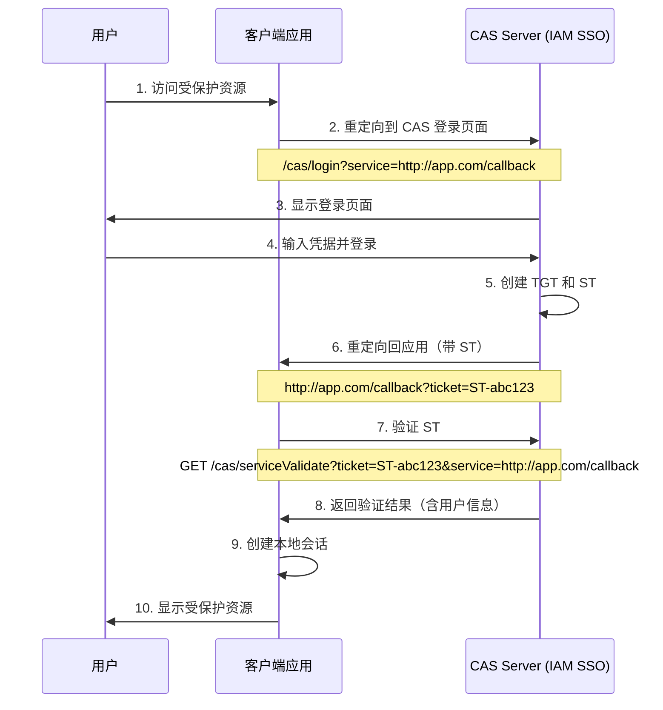
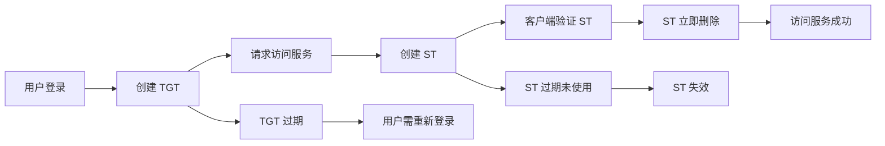

# Central Authentication Service (CAS) 完整文档

## 目录

1. [CAS 概述](#1-cas-概述)
2. [核心概念](#2-核心概念)
3. [CAS 协议版本](#3-cas-协议版本)
4. [CAS 认证流程](#4-cas-认证流程)
5. [单点登出 (SLO) 实现](#5-单点登出-slo-实现)
6. [Ticket 管理](#6-ticket-管理)
7. [配置项说明](#7-配置项说明)
8. [客户端集成指南](#8-客户端集成指南)
9. [安全考虑](#9-安全考虑)
10. [测试与调试](#10-测试与调试)
11. [最佳实践](#11-最佳实践)
12. [常见问题](#12-常见问题)

---

## 1. CAS 概述

Central Authentication Service (CAS) 是一个企业级单点登录协议，由耶鲁大学发起，现由 Apereo 基金会维护。CAS 允许用户通过一次登录访问多个应用系统。

### 1.1 核心特性

- **单点登录 (SSO)**: 一次登录，多处访问
- **单点登出 (SLO)**: 一次登出，全局退出
- **多协议支持**: 支持 CAS 3.0、SAML 2.0 等
- **多认证方式**: 支持用户名密码、LDAP、OAuth2 等
- **高可用性**: 支持分布式部署和集群

### 1.2 协议版本

- **CAS 2.0**: 基础 SSO 功能
- **CAS 3.0**: 增强协议，支持更多属性传递
- **CAS 3.5+**: 支持单点登出 (SLO)

---

## 2. 核心概念

### 2.1 角色定义

| 角色 | 说明 | 示例 |
|------|------|------|
| **User** | 最终用户 | 登录的用户 |
| **Client Application** | 客户端应用，依赖 CAS 进行认证 | Web 应用、API 服务 |
| **CAS Server** | CAS 认证服务器，负责用户认证和 Ticket 发放 | IAM Platform SSO |

### 2.2 核心组件

| 组件 | 说明 | 端点 |
|------|------|------|
| **Login Endpoint** | 登录端点，处理用户认证 | `/cas/login` |
| **Logout Endpoint** | 登出端点，处理单点登出 | `/cas/logout` |
| **Service Ticket Validation** | ST 验证端点 | `/cas/serviceValidate` |
| **Back Channel Logout** | 后端通道登出 | `/cas/logout/backChannel` |
| **Front Channel Logout** | 前端通道登出 | `/cas/logout/frontChannel` |

### 2.3 Ticket 类型

| Ticket 类型 | 用途 | 生命周期 | 说明 |
|------------|------|---------|------|
| **TGT (Ticket Granting Ticket)** | 用户会话标识 | 较长（数小时） | 存储在 CAS Server，用户登录成功后创建 |
| **ST (Service Ticket)** | 服务访问凭证 | 短（一次性使用） | 用于访问特定服务，验证后立即删除 |

---

## 3. CAS 协议版本

### 3.1 CAS 3.0 协议特性

IAM Platform 实现了 CAS 3.0 协议，包含以下核心功能：

1. **Service Ticket (ST) 机制**
   - 一次性使用的服务访问凭证
   - 支持自定义有效期（默认 600 秒）
   - 支持自定义 Ticket 前缀（默认 ST）

2. **单点登出 (SLO) 支持**
   - Back Channel Logout（服务端到服务端）
   - Front Channel Logout（浏览器重定向）
   - 会话管理与 Ticket 清理

3. **属性传递**
   - 支持在 ST 验证响应中返回用户属性
   - 支持自定义属性过滤器

---

## 4. CAS 认证流程

### 4.1 标准认证流程



### 4.2 请求参数详解

#### 登录请求参数

| 参数 | 必需 | 说明 | 示例 |
|------|------|------|------|
| `service` | 是 | 客户端应用回调 URL | `http://app.example.com/cas/callback` |
| `method` | 否 | 认证方法 | `POST` |
| `renew` | 否 | 强制重新认证 | `true` |
| `gateway` | 否 | 网关模式（不显示登录页） | `true` |

#### ST 验证请求参数

| 参数 | 必需 | 说明 | 示例 |
|------|------|------|------|
| `ticket` | 是 | Service Ticket | `ST-abc123` |
| `service` | 是 | 必须与登录时一致 | `http://app.example.com/cas/callback` |
| `format` | 否 | 响应格式 | `CAS30` |

### 4.3 ST 验证响应

#### 成功响应（CAS 3.0 格式）

```xml
<cas:serviceResponse xmlns:cas='http://www.yale.edu/tp/cas'>
    <cas:authenticationSuccess>
        <cas:user>username</cas:user>
        <cas:attributes>
            <cas:email>user@example.com</cas:email>
            <cas:name>张三</cas:name>
            <cas:roles>
                <cas:role>admin</cas:role>
                <cas:role>user</cas:role>
            </cas:roles>
        </cas:attributes>
    </cas:authenticationSuccess>
</cas:serviceResponse>
```

#### 失败响应

```xml
<cas:serviceResponse xmlns:cas='http://www.yale.edu/tp/cas'>
    <cas:authenticationFailure code='INVALID_TICKET'>
        Ticket 'ST-abc123' not recognized
    </cas:authenticationFailure>
</cas:serviceResponse>
```

---

## 5. 单点登出 (SLO) 实现

IAM Platform 实现了完整的 CAS 3.0 单点登出功能，支持 Back Channel 和 Front Channel 两种登出模式。

### 5.1 Back Channel Logout（服务端到服务端）

**工作原理：**
- CAS Server 直接向所有已注册的服务发送 HTTP POST 请求
- 服务在后台处理登出，无需用户浏览器参与
- 更安全可靠，用户无感知

**实现端点：**
- `POST /cas/logout/backChannel` - 接收 Back Channel 登出请求

**请求格式：**
```xml
<samlp:LogoutRequest xmlns:samlp="urn:oasis:names:tc:SAML:2.0:protocol"
                     xmlns:saml="urn:oasis:names:tc:SAML:2.0:assertion"
                     ID="_unique-id"
                     Version="2.0"
                     IssueInstant="2024-01-01T00:00:00Z">
    <saml:Issuer>https://sso.example.com</saml:Issuer>
    <samlp:SessionIndex>session-id-here</samlp:SessionIndex>
</samlp:LogoutRequest>
```

**实现流程：**
1. 用户发起登出请求
2. CAS Server 查询该会话关联的所有服务
3. 向每个服务发送 HTTP POST 请求（包含 Base64 编码的 `logoutRequest` 参数）
4. 各服务解码并处理登出请求，使本地会话失效
5. CAS Server 清理所有相关 Ticket

### 5.2 Front Channel Logout（浏览器重定向）

**工作原理：**
- 通过浏览器依次重定向到所有已注册的服务
- 使用隐藏的 iframe 实现无缝登出
- 用户可以看到登出进度

**实现端点：**
- `GET /cas/logout` - 发起 Front Channel 登出
- `GET /cas/logout/frontChannel` - 服务登出回调
- `GET /cas/logoutResponse` - 接收登出响应

**流程：**
1. 用户访问 `/cas/logout`
2. 系统显示登出进度页面（`cas-logout-redirect.html`）
3. 通过 iframe 依次调用各服务的登出 URL
4. 所有服务登出完成后重定向到指定页面

### 5.3 会话管理与 Ticket 清理

**CasSloService 核心功能：**
- `registerServiceForSession()` - 注册服务到会话（在创建 ST 时调用）
- `getServicesForSession()` - 获取会话关联的所有服务
- `invalidateSession()` - 使会话失效并清理所有相关 Ticket
- `processBackChannelLogout()` - 处理 Back Channel 登出请求
- `continueFrontChannelLogout()` - 继续 Front Channel 登出流程

**存储机制：**
- 主存储：Redis（支持分布式部署）
- 降级方案：内存 ConcurrentHashMap（Redis 不可用时）

### 5.4 登出使用示例

#### 用户发起登出

```
GET http://localhost:9000/cas/logout?service=https://app.example.com
```

- 如果有已注册的服务：显示登出进度页面，依次登出所有服务
- 如果没有服务：直接完成登出并重定向到 service 参数指定的 URL

#### Front Channel Logout 流程示例

```
用户浏览器 -> http://localhost:9000/cas/logout?service=http://app-a.example.com
```

**流程：**
1. CAS 显示登出进度页面
2. 通过 iframe 依次调用：
   - `http://app-a.example.com/cas/callback?logoutRequest=<session-id>`
   - `http://app-b.example.com/cas/callback?logoutRequest=<session-id>`
3. 所有服务登出完成后，重定向到 `http://app-a.example.com`

---

## 6. Ticket 管理

### 6.1 Ticket 生命周期



### 6.2 Ticket 存储策略

| 存储类型 | 用途 | 清理策略 |
|---------|------|---------|
| **TGT** | 用户会话 | TTL 过期或用户登出时清理 |
| **ST** | 服务访问凭证 | 一次性使用后立即删除 |
| **SLO Session** | 登出会话关联 | TTL 过期（默认 300 秒） |

### 6.3 Ticket 清理机制

1. **ST 验证后立即删除**：防止重放攻击
2. **TTL 过期自动清理**：所有 Ticket 都有过期时间
3. **登出时主动清理**：用户登出时清理所有关联 Ticket
4. **异步清理任务**：定期清理过期 Ticket

---

## 7. 配置项说明

在 `application.yml` 中的 CAS 配置：

```yaml
sso:
  cas:
    # CAS 服务器地址
    server-url: ${CAS_SERVER_URL:http://localhost:9000/cas}
    
    # Ticket 有效期（秒）
    ticket-validity-seconds: ${CAS_TICKET_VALIDITY:600}
    
    # Ticket 前缀
    ticket-prefix: ${CAS_TICKET_PREFIX:ST}
    
    # 单点登出启用开关
    single-sign-out-enabled: ${CAS_SLO_ENABLED:true}
    
    # 登出 URL
    logout-url: ${CAS_LOGOUT_URL:http://localhost:9000/cas/logout}
    
    # 登录 URL
    login-url: ${CAS_LOGIN_URL:http://localhost:9000/cas/login}
    
    # 前端通道登出启用开关
    front-channel-logout-enabled: ${CAS_FRONT_CHANNEL_LOGOUT:true}
    
    # 后端通道登出启用开关
    back-channel-logout-enabled: ${CAS_BACK_CHANNEL_LOGOUT:true}
    
    # 登出请求 TTL（秒）
    logout-request-ttl-seconds: ${CAS_LOGOUT_TTL:300}
    
    # 登出时是否通知所有服务
    send-logout-to-all-services: ${CAS_LOGOUT_ALL_SERVICES:true}
```

---

## 8. 客户端集成指南

### 8.1 Spring Boot 应用集成

#### 添加依赖

```xml
<dependency>
    <groupId>org.jasig.cas.client</groupId>
    <artifactId>cas-client-core</artifactId>
    <version>3.6.2</version>
</dependency>
```

#### 配置 CAS Filter

```java
@Configuration
public class CasConfig {
    
    @Value("${cas.server.url}")
    private String casServerUrl;
    
    @Value("${cas.client.url}")
    private String clientUrl;
    
    // CAS 认证 Filter
    @Bean
    public FilterRegistrationBean<CasAuthenticationFilter> casAuthenticationFilter() {
        FilterRegistrationBean<CasAuthenticationFilter> registration = new FilterRegistrationBean<>();
        registration.setFilter(new CasAuthenticationFilter());
        registration.addUrlPatterns("/*");
        registration.addInitParameter("casServerLoginUrl", casServerUrl + "/login");
        registration.addInitParameter("serverName", clientUrl);
        registration.setOrder(2);
        return registration;
    }
    
    // CAS 登出 Filter - 支持 Back Channel
    @Bean
    public FilterRegistrationBean<SingleSignOutFilter> singleSignOutFilter() {
        FilterRegistrationBean<SingleSignOutFilter> registration = new FilterRegistrationBean<>();
        registration.setFilter(new SingleSignOutFilter());
        registration.addUrlPatterns("/*");
        registration.addInitParameter("casServerUrlPrefix", casServerUrl);
        registration.setOrder(1);
        return registration;
    }
    
    // 登出 Servlet
    @Bean
    public ServletRegistrationBean<CasSingleSignOutServlet> casSingleSignOutServlet() {
        ServletRegistrationBean<CasSingleSignOutServlet> registration = new ServletRegistrationBean<>();
        registration.setServlet(new CasSingleSignOutServlet());
        registration.addUrlMappings("/logout");
        return registration;
    }
}
```

### 8.2 手动实现登出端点

如果不使用 CAS Client 库，可以手动实现：

#### Back Channel 登出端点

```java
@RestController
@RequestMapping("/cas")
public class CasLogoutController {
    
    @PostMapping("/logout")
    public void handleBackChannelLogout(
            @RequestParam String logoutRequest,
            HttpServletRequest httpRequest) {
        
        try {
            // 解码 logoutRequest (Base64)
            String decoded = new String(
                Base64.getDecoder().decode(logoutRequest), 
                StandardCharsets.UTF_8
            );
            
            // 提取 SessionIndex
            String sessionId = extractSessionIndex(decoded);
            
            // 使本地会话失效
            if (sessionId != null) {
                // 根据 sessionId 找到对应的 HttpSession 并 invalidate
                SessionRegistry.invalidateSession(sessionId);
                log.info("Session {} invalidated via Back Channel Logout", sessionId);
            }
            
        } catch (Exception e) {
            log.error("Failed to process logout request", e);
        }
    }
    
    private String extractSessionIndex(String logoutRequest) {
        int start = logoutRequest.indexOf("<samlp:SessionIndex>");
        if (start == -1) {
            start = logoutRequest.indexOf("<SessionIndex>");
        }
        if (start != -1) {
            int contentStart = logoutRequest.indexOf(">", start) + 1;
            int contentEnd = logoutRequest.indexOf("</", contentStart);
            if (contentEnd != -1) {
                return logoutRequest.substring(contentStart, contentEnd).trim();
            }
        }
        return null;
    }
}
```

#### Front Channel 登出端点

```java
@GetMapping("/logout")
public String handleFrontChannelLogout(HttpServletRequest request) {
    // 使 HTTP 会话失效
    if (request.getSession(false) != null) {
        request.getSession().invalidate();
    }
    
    log.info("Front Channel Logout completed for this service");
    
    // 返回简单的登出成功页面
    return "logout-success";
}
```

### 8.3 基本的登出流程示例

#### 用户访问应用 A

```
用户浏览器 -> http://app-a.example.com/protected
```

应用 A 检测到未登录，重定向到 CAS 登录页面：

```
http://localhost:9000/cas/login?service=http://app-a.example.com/cas/callback
```

#### 用户登录成功

CAS 验证用户身份后，生成 Service Ticket 并重定向回应用 A：

```
http://app-a.example.com/cas/callback?ticket=ST-abc123
```

应用 A 验证 Ticket 成功，建立本地会话。

#### 用户访问应用 B

用户访问应用 B 时，由于 CAS 会话已存在，自动登录：

```
http://localhost:9000/cas/login?service=http://app-b.example.com/cas/callback
-> 自动重定向到 http://app-b.example.com/cas/callback?ticket=ST-def456
```

此时，CAS 会话中记录了两个服务：
- `http://app-a.example.com/cas/callback`
- `http://app-b.example.com/cas/callback`

#### 用户发起登出

用户访问 CAS 登出页面：

```
GET http://localhost:9000/cas/logout?service=http://app-a.example.com
```

**Front Channel Logout 流程：**

1. CAS 显示登出进度页面
2. 通过 iframe 依次调用：
   - `http://app-a.example.com/cas/callback?logoutRequest=<session-id>`
   - `http://app-b.example.com/cas/callback?logoutRequest=<session-id>`
3. 所有服务登出完成后，重定向到 `http://app-a.example.com`

---

## 9. 安全考虑

### 9.1 攻击防护

| 攻击类型 | 防护措施 |
|----------|----------|
| **重放攻击** | ST 一次性使用，验证后立即删除 |
| **Ticket 劫持** | 短期 Ticket 有效期，HTTPS 传输 |
| **会话固定** | 登录时创建新会话 |
| **CSRF** | Service URL 严格验证 |

### 9.2 安全最佳实践

1. **Ticket 一次性使用**：ST 验证后立即删除，防止重放攻击
2. **会话关联追踪**：记录每个会话访问的所有服务，确保登出完整
3. **TTL 过期机制**：所有登出相关数据都有过期时间，防止内存泄漏
4. **降级容错**：Redis 不可用时自动切换到内存存储
5. **HTTPS 强制**：所有 CAS 通信必须使用 HTTPS

### 9.3 安全配置建议

```yaml
sso:
  cas:
    # 启用 HTTPS
    server-url: https://sso.example.com/cas
    
    # 缩短 Ticket 有效期
    ticket-validity-seconds: 300
    
    # 启用所有安全特性
    single-sign-out-enabled: true
    front-channel-logout-enabled: true
    back-channel-logout-enabled: true
```

---

## 10. 测试与调试

### 10.1 使用 Postman 测试

#### 测试 Back Channel 登出

```http
POST http://localhost:9000/cas/logout/backChannel
Content-Type: application/x-www-form-urlencoded

logoutRequest=PHNhbWxwOkxvZ291dFJlcXVlc3QgeG1sbnM6c2FtbHA9InVybjpvYXNpczpuYW1lczp0YzpTQU1MOjIuMDpwcm90b2NvbCIgSUQ9Il8xMjM0NTYiIFZlcnNpb249IjIuMCIgSXNzdWVJbnN0YW50PSIyMDI0LTAxLTAxVDAwOjAwOjAwWiI+PHNhbWw6SXNzdWVyPmh0dHBzOi8vc3NvLmV4YW1wbGUuY29tPC9zYW1sOklzc3Vlcj48c2FtbHA6U2Vzc2lvbkluZGV4PnRlc3Qtc2Vzc2lvbi1pZDwvc2FtbHA6U2Vzc2lvbkluZGV4Pjwvc2FtbHA6TG9nb3V0UmVxdWVzdD4=
```

**预期响应：**

```xml
<cas:serviceResponse xmlns:cas='http://www.yale.edu/tp/cas'>
    <cas:logoutSuccess/>
</cas:serviceResponse>
```

#### 测试健康检查

```http
GET http://localhost:9000/cas/health
```

**预期响应：**

```json
{
    "status": "UP",
    "protocol": "CAS 3.0",
    "slo": "enabled"
}
```

### 10.2 启用调试日志

在 `application.yml` 中添加：

```yaml
logging:
  level:
    iam.platform.auth.interfaces.web.CasSloHandler: DEBUG
    iam.platform.auth.application.service.CasSloService: DEBUG
    iam.platform.auth.interfaces.web.CasController: DEBUG
```

### 10.3 查看登出流程日志

正常登出流程会输出类似以下日志：

```
2024-01-01 12:00:00 INFO  - CAS logout initiated
2024-01-01 12:00:00 DEBUG - Service registered for SLO session abc123
2024-01-01 12:00:00 INFO  - Front Channel Logout to 2 services
2024-01-01 12:00:01 INFO  - Front Channel Logout callback from service: http://app-a.example.com
2024-01-01 12:00:02 INFO  - Front Channel Logout callback from service: http://app-b.example.com
2024-01-01 12:00:02 INFO  - Session abc123 invalidated, all tickets cleaned up
2024-01-01 12:00:02 INFO  - CAS logout completed
```

### 10.4 测试建议

1. **单元测试**：测试 CasSloService 的各个方法
2. **集成测试**：模拟完整的登出流程
3. **端到端测试**：使用真实服务验证 Front/Back Channel 登出
4. **压力测试**：测试大量服务同时登出的性能
5. **异常测试**：验证 Redis 不可用时的降级逻辑

---

## 11. 最佳实践

### 11.1 客户端实现

1. **使用 Back Channel 优先**：更安全，用户体验更好
2. **实现幂等登出**：多次登出请求不会产生错误
3. **添加超时机制**：避免登出流程长时间阻塞
4. **记录审计日志**：追踪登出操作，便于问题排查
5. **测试异常场景**：验证服务不可用时的降级逻辑

### 11.2 服务端实现

1. **强制 HTTPS**：拒绝非 HTTPS 请求
2. **验证 Service URL**：严格匹配注册的服务 URL
3. **限制 Ticket 生命周期**：ST 短期，TGT 中期
4. **监控异常行为**：检测暴力破解和异常登录
5. **定期清理过期数据**：防止内存泄漏

### 11.3 安全实践

```java
// ✅ 推荐：验证 Service URL
if (!isValidServiceUrl(serviceUrl)) {
    throw new SecurityException("Invalid service URL");
}

// ✅ 推荐：ST 验证后立即删除
ticketRegistry.deleteTicket(ticket);

// ✅ 推荐：记录登出审计日志
auditLogger.logLogout(userId, sessionId, services);

// ✅ 推荐：实现幂等登出
if (sessionAlreadyInvalidated(sessionId)) {
    return; // 已经登出过，直接返回
}
```

---

## 12. 常见问题

### 12.1 登出后仍然可以访问应用？

**原因：** 应用本地会话未正确失效

**解决方案：**
- 检查是否正确实现了 `/logout` 端点
- 确认 `request.getSession().invalidate()` 被调用
- 检查应用的 Session 管理逻辑

### 12.2 某些服务没有登出？

**原因：** 服务未正确注册到 SLO 会话

**解决方案：**
- 确认 `CasController.processCasLogin()` 中调用了 `registerServiceForSession()`
- 检查 Redis 连接是否正常
- 查看日志确认服务注册情况

### 12.3 登出页面一直加载？

**原因：** Front Channel Logout 的 iframe 请求超时

**解决方案：**
- 检查所有服务的登出端点是否可达
- 确认服务能快速响应登出请求
- 页面有 10 秒超时自动跳转机制

### 12.4 ID Token 和 Access Token 有什么区别？

在 CAS 协议中，不涉及 ID Token 和 Access Token 的概念，这是 OAuth2/OIDC 协议的内容。CAS 使用的是 Ticket（TGT 和 ST）机制。

### 12.5 如何处理 Ticket 过期？

1. ST 过期：客户端需要重新获取 ST（重定向到 CAS 登录页面）
2. TGT 过期：用户需要重新登录
3. 监控 Ticket 的 `expires_in` 值
4. 在过期前刷新或重新获取

### 12.6 如何实现单点登出？

1. 用户向 CAS Server 发起登出请求
2. CAS Server 清除用户会话（TGT）
3. CAS Server 通知所有 RP 用户已登出（前端或后端通道）
4. 各 RP 清除本地会话
5. CAS Server 清理所有相关 ST

---

## 附录

### A. CAS 规范参考

- [CAS Protocol 3.0 Specification](https://apereo.github.io/cas/6.6.x/protocol/CAS-Protocol-Specification.html)
- [CAS Single Logout Specification](https://apereo.github.io/cas/6.6.x/protocol/CAS-Single-Logout-Specification.html)
- [SAML 2.0 Logout Protocol](https://docs.oasis-open.org/security/saml/v2.0/saml-core-2.0-os.pdf)

### B. 在线工具

- [Base64 Decode/Encode](https://www.base64decode.org/) - 解码 logoutRequest
- [XML Formatter](https://www.freeformatter.com/xml-formatter.html) - 格式化 SAML XML

### C. 相关文档

- [协议文档-OIDC.md](./协议文档-OIDC.md)
- [协议文档-SAML.md](./协议文档-SAML.md)
- [Spring Authorization Server 原理与流程](../Spring%20Authorization%20Server%20原理与流程.md)
- [Token 机制详解](../Token机制详解.md)
- [第三方服务对接指南](../第三方服务对接指南.md)

### D. 实现文件清单

#### 新增文件

1. **CasSloHandler.java**
   - 路径：`iam-auth-server/src/main/java/iam/platform/auth/interfaces/web/CasSloHandler.java`
   - 功能：处理所有 SLO 相关的 HTTP 请求

2. **CasSloService.java**
   - 路径：`iam-auth-server/src/main/java/iam/platform/auth/application/service/CasSloService.java`
   - 功能：SLO 业务逻辑，会话管理，Ticket 清理

3. **cas-logout-redirect.html**
   - 路径：`iam-auth-server/src/main/resources/templates/cas-logout-redirect.html`
   - 功能：Front Channel 登出进度页面，带动画效果

#### 修改文件

1. **CasController.java**
   - 移除了简单的 logout 方法（由 CasSloHandler 接管）
   - 添加了 CasSloService 依赖
   - 在创建 ST 时注册服务到 SLO 会话
   - 更新 health 端点显示 SLO 状态

2. **CasProperties.java**
   - 添加了 SLO 相关配置属性

3. **application.yml**
   - 添加了完整的 CAS 配置段

---

**文档版本**: 1.0  
**最后更新**: 2026-05-22  
**维护者**: IAM Platform 团队  
**协议版本**: CAS 3.0
