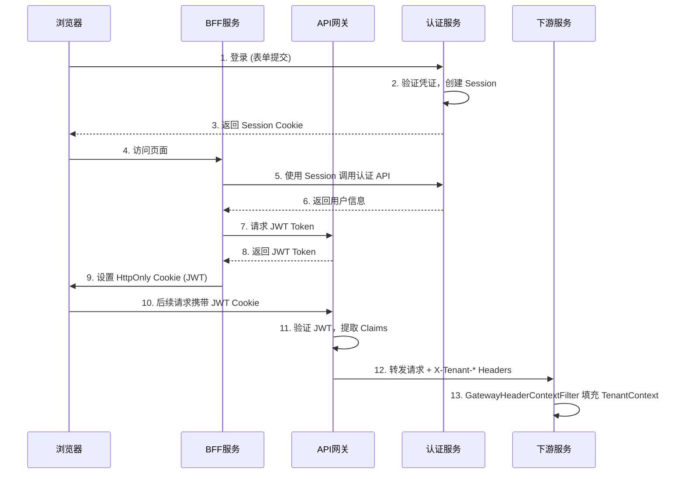

# IAM Platform 项目未完成逻辑清单

> 生成时间: 2026-05-17
> 更新时间: 2026-05-23 (事件驱动架构修复: ResultHolder回传 + 失败审计 + RocketMQ弱依赖)
> 检查范围: 全部业务逻辑、服务实现、基础设施集成
> 文档状态: 已清理所有已处理项，仅保留真正未完成的任务

---

## 一、当前可实现的未完成功能

### 1.1 验证码服务 - 真实 SMS/Email 集成

**位置:** `VerificationCodeServiceImpl.java` (第 38-40 行, 第 52-54 行)

**当前状态:**
- ✅ Redis 验证码生成、存储、验证逻辑已完整实现
- ✅ 已添加速率限制（60秒内只能发送一次，每日最多10次）
- ✅ 已使用 SecureRandom 替代 Random 生成验证码
- ⚠️ SMS 发送：仅打印日志，未集成真实短信服务
- ⚠️ Email 发送：仅打印日志，未集成真实邮件服务

**TODO 标记:**
```java
// TODO: 集成真实的 SMS 服务（如阿里云、腾讯云）
// 开发环境下打印到日志，生产环境应调用 SMS API

// TODO: 集成真实的邮件服务（如 Spring Mail）
// 开发环境下打印到日志，生产环境应发送邮件
```

**实现建议:**
- 引入 `spring-boot-starter-mail` 实现邮件发送
- 引入阿里云/腾讯云 SMS SDK 实现短信发送
- 使用策略模式或配置开关区分开发/生产环境
- 可先实现 Mock 服务用于测试

**优先级:** 🔴 高 (影响验证码登录功能完整性)
**状态:** ⚠️ 核心逻辑完成，等待第三方服务集成

---

### 1.2 BFF 租户选择页面功能不完整

**位置:** `BffTenantSelectionController.java` (第 17 行)

**当前状态:**
- ✅ 租户选择页面路由已建立
- ⚠️ 未通过 Feign 客户端获取用户可用租户列表
- ⚠️ 页面渲染缺少实际租户数据

**TODO 标记:**
```java
// TODO: Fetch available tenants for current user via Feign client
// For now, render the page without tenant data
```

**实现建议:**
1. 创建 Feign 客户端调用 admin-server 获取用户租户列表
2. 将租户数据传递给模板引擎
3. 完善租户选择交互逻辑

**优先级:** 🟡 中 (影响多租户用户体验)
**状态:** ⚠️ 基础框架完成，待功能完善

---

### 1.3 SAML 断言签名功能未完成

**位置:** `SamlAssertionBuilder.java`

**当前状态:**
- ✅ SAML 2.0 IdP metadata 生成功能已完整实现
- ✅ 证书加载和 KeyDescriptor 生成已完成（`SamlMetadataGenerator.java`）
- ✅ 支持从 keystore.p12 加载 X.509 证书
- ✅ Metadata 中已包含签名证书公钥
- ⚠️ 未实现 SAML 断言(Assertion)的数字签名
- ⚠️ 未实现 SAML 响应(Response)的数字签名

**已完成部分:**
```java
// SamlMetadataGenerator.java - 已完成
KeyDescriptor keyDescriptor = buildKeyDescriptor();
idpDescriptor.getKeyDescriptors().add(keyDescriptor);
```

**TODO 标记:**
```java
// SamlAssertionBuilder.java - 待实现
// TODO: 使用私钥对 SAML Assertion 进行数字签名
// 需要: 1. 加载签名证书和私钥
//      2. 使用 Signature XMLObject 添加签名信息
//      3. 使用 SecurityHelper 和 SignatureSupport 执行签名
```

**实现建议:**
1. 在 `SamlAssertionBuilder` 中加载签名证书和私钥
2. 创建 `Signature` XMLObject 并配置签名算法
3. 使用 OpenSAML 的 `Signer.signObject()` 对 Assertion 签名
4. 支持配置化开关控制是否签名

**优先级:** 🟡 中 (影响 SAML 安全性，但部分 SP 可不验证签名)
**状态:** ⚠️ Metadata 完成，待断言签名实现

---

### 1.4 租户切换后 JWT Token 刷新机制

**位置:** `SsoSessionService.java` (switchTenant 方法), `JwtClaimsHeaderFilter.java` (网关)

**当前状态:**
- ✅ 租户切换 API 已实现 (`POST /v1/sso/tenants/{tenantAccountId}/switch`)
- ✅ TenantContext ThreadLocal 更新逻辑已完成
- ✅ 网关 JWT Claims 提取和 Header 注入机制已完善
- ⚠️ **核心问题**: 切换租户后未触发 JWT Token 刷新
- ⚠️ **影响**: 当前请求使用新租户，后续请求仍从旧 JWT 读取旧租户信息

**问题分析:**
```java
// SsoSessionService.switchTenant() 当前实现
public TenantSwitchResponse switchTenant(Long tenantAccountId) {
    // ... 验证逻辑 ...
    
    // 仅更新当前请求的 ThreadLocal
    TenantContext.setCurrentUserId(userId);
    TenantContext.setCurrentTenantId(tenant.getId());
    TenantContext.setCurrentTenantAccountId(tenantAccountId);
    
    // ❌ 问题：没有更新 JWT Token
    // 下次请求时，网关仍从旧 JWT 提取旧租户信息
    return new TenantSwitchResponse(...);
}
```

**不一致场景:**
```
1. 用户切换租户: ThreadLocal 更新为 tenant_id=2
2. 切换响应:    使用新租户 tenant_id=2 ✅
3. 下次请求:    网关从旧 JWT 读取 tenant_id=1 ❌
4. 下游服务:    通过 Header 获取到 tenant_id=1 ❌
```

**实现方案 (方案 1: JWT 刷新机制):**

1. **修改切换租户响应**
```java
// SsoSessionService.java
public TenantSwitchResponse switchTenant(Long tenantAccountId) {
    // ... 验证逻辑 ...
    
    // 更新 TenantContext
    TenantContext.setCurrentUserId(userId);
    TenantContext.setCurrentTenantId(tenant.getId());
    TenantContext.setCurrentTenantAccountId(tenantAccountId);
    
    // 🔧 新增：标记需要刷新 Token
    return new TenantSwitchResponse(
        tenant.getId(), 
        tenant.getTenantCode(),
        tenantAccount.getId(), 
        permissions,
        true  // tokenRefreshRequired
    );
}

// 新增响应字段
public record TenantSwitchResponse(
    Long tenantId, 
    String tenantCode, 
    Long tenantAccountId,
    Set<String> permissions,
    Boolean tokenRefreshRequired  // 新增
) {}
```

2. **客户端刷新流程**
```
客户端调用切换租户 API
  ↓
检测到 tokenRefreshRequired=true
  ↓
调用 /oauth2/token 端点刷新 JWT
  (携带新的 tenant_account_id)
  ↓
获取新 JWT (包含 tenant_id=2)
  ↓
使用新 JWT 发起后续请求
  ↓
网关从新 JWT 提取 tenant_id=2 ✅
下游服务通过 Header 获取 tenant_id=2 ✅
```

3. **网关 Token 刷新端点支持**
```java
// 在认证服务中添加 Token 刷新端点
@PostMapping("/oauth2/token")
public TokenResponse refreshToken(
    @RequestParam String grant_type,
    @RequestParam String refresh_token,
    @RequestParam(required = false) Long tenantAccountId  // 新增
) {
    // 如果提供了 tenantAccountId，更新 JWT Claims
    if (tenantAccountId != null) {
        // 查询新的租户信息
        // 生成包含新 tenant_id 的 JWT
    }
    return tokenService.refresh(refresh_token, tenantAccountId);
}
```

4. **添加租户切换审计日志**
```java
// SsoSessionService.java
@Autowired
private AuditEventPublisher auditEventPublisher;

public TenantSwitchResponse switchTenant(Long tenantAccountId) {
    Long oldTenantAccountId = TenantContext.getCurrentTenantAccountId();
    
    // ... 切换逻辑 ...
    
    // 记录审计事件
    auditEventPublisher.publish(AuditEvent.builder()
        .eventType("TENANT_SWITCH")
        .userId(userId)
        .oldTenantAccountId(oldTenantAccountId)
        .newTenantAccountId(tenantAccountId)
        .timestamp(LocalDateTime.now())
        .build()
    );
    
    return response;
}
```

**实现建议:**
- 遵循 OAuth2 Token Endpoint 规范 (RFC 6749)
- 在 JWT Claims 中添加 `tenant_account_id` 字段
- 网关的 `JwtClaimsHeaderFilter` 已支持提取该字段
- 客户端需实现 Token 自动刷新逻辑
- 添加租户切换审计日志记录

**优先级:** 🔴 高 (影响多租户架构的核心一致性)
**状态:** ⚠️ 核心流程完成，待 JWT 刷新机制实现
**预计工作量:** 3-5 天

---

### 1.5 统一 Session 和 JWT 认证策略

**位置:** `TenantAwareAuthenticationFilter.java`, `JwtUserContextFilter.java`, 各服务安全配置

**当前状态:**
- ✅ 网关 JWT 解析和 Header 注入机制已完善
- ✅ 下游服务 TenantContext 统一提取逻辑已完成
- ⚠️ **认证策略混用**: 同时支持 Session 和 JWT 两种方式
- ⚠️ **行为不一致**: 不同场景下租户上下文恢复机制不同

**问题分析:**

当前系统存在两套认证和租户上下文恢复机制:

**机制 1: Session 方式 (浏览器登录场景)**
```java
// TenantAwareAuthenticationFilter.java (iam-auth-server)
// Priority 2: Fall back to session restoration (browser login scenario)
if (TenantContext.getCurrentTenantId() == null) {
    restoreTenantContextFromSession(request);
}

private void restoreTenantContextFromSession(HttpServletRequest request) {
    var session = request.getSession(false);
    if (session != null) {
        Object tenantId = session.getAttribute("SESSION_TENANT_ID");
        Object tenantAccountId = session.getAttribute("SESSION_TENANT_ACCOUNT_ID");
        // 从 Session 恢复租户上下文
    }
}
```

**机制 2: JWT + Header 方式 (API 调用场景)**
```java
// JwtUserContextFilter.java (iam-admin-server)
// Populate tenant context from gateway headers
TenantContext.populateFromHeaders(request);

// GatewayHeaderContextFilter.java (iam-common)
// 从网关传递的 X-Tenant-* Headers 提取租户信息
```

**不一致场景:**
```
场景 1: 浏览器直接访问 iam-auth-server
  → 使用 Session 存储租户信息
  → TenantAwareAuthenticationFilter 从 Session 恢复

场景 2: 前端通过网关访问 iam-admin-server
  → 使用 JWT Token
  → 网关提取 Claims 并设置 Headers
  → JwtUserContextFilter 从 Headers 恢复

场景 3: 前端通过网关访问 iam-auth-server
  → 使用 JWT Token
  → 网关提取 Claims 并设置 Headers
  → TenantAwareAuthenticationFilter 从 Headers 恢复 (优先)
  → 如果失败，回退到 Session 恢复

❌ 问题: 同一用户在不同场景下，租户上下文来源不同
```

**潜在风险:**
1. **状态不一致**: Session 和 JWT 中的租户信息可能不同步
2. **维护复杂**: 需要同时维护两套恢复逻辑
3. **调试困难**: 问题排查时需要判断使用的是哪种机制
4. **安全边界模糊**: Session 和 JWT 的安全模型不同

**重要发现: Session 机制不能彻底移除**

通过代码分析，Session 在以下场景中是必需的：

1. **OAuth2 授权码流程的 SavedRequest 机制** (不可移除)
   - Spring Security 使用 Session 保存用户的原始授权请求
   - 用户登录后需要恢复 SavedRequest 继续授权流程
   - 代码位置: `ProtocolRouterImpl.java`

2. **CAS 单点登出 (SLO) 的 Session 管理** (不可移除)
   - CAS 协议需要 Session ID 关联用户登录状态
   - 单点登出时需要 invalidate Session
   - 代码位置: `CasSloHandler.java`, `CasController.java`

3. **租户上下文的持久化存储** (可替代)
   - 当前用于浏览器刷新后保持租户选择
   - 可通过 JWT 刷新机制替代 (任务 1.4)

**实现方案:**

**方案 A: 明确 Session 和 JWT 的使用边界 (推荐)**



**架构原则:**
- **OAuth2/CAS 认证流程**: 使用 Session (Spring Security 内部机制)
- **浏览器 ↔ BFF/后端服务**: 使用 JWT (通过 Gateway)
- **所有微服务**: 统一从 Gateway Headers 获取租户上下文
- **租户上下文恢复**: 优先使用 Gateway Headers，移除 Session 恢复逻辑 (任务 1.4 完成后)
- **保留 Session**: 用于 OAuth2 SavedRequest 和 CAS SLO，不用于业务逻辑

**实施步骤:**

1. **明确 Session 和 JWT 的职责边界**
```java
// Session 仅用于 Spring Security 内部机制
// - OAuth2 SavedRequest (保存授权请求)
// - CAS SLO (单点登出)
// - SecurityContext 存储

// JWT 用于业务逻辑
// - 微服务间身份传递
// - 租户上下文传递
// - API 鉴权
```

2. **简化租户上下文恢复逻辑** ✅ 已完成
```java
// TenantAwareAuthenticationFilter.java - 已简化
@Override
protected void doFilterInternal(HttpServletRequest request, ...) {
    // 仅从网关 Header 恢复租户上下文
    String userId = request.getHeader(TenantContext.HEADER_USER_ID);
    if (userId != null && !userId.isEmpty()) {
        TenantContext.populateFromHeaders(request);
        log.debug("Tenant context populated from gateway headers: userId={}", userId);
    }
    
    // ✅ 已移除: restoreTenantContextFromSession(request)
    // ✅ 保留 Session: OAuth2 SavedRequest 和 CAS SLO 仍需要
    
    try {
        filterChain.doFilter(request, response);
    } finally {
        TenantContext.clear();
    }
}
```

**完成日期:** 2026-05-22
**修改内容:**
- 移除了 Session 恢复逻辑（`restoreTenantContextFromSession` 方法）
- 移除了 Session 相关常量（`SESSION_USER_ID`、`SESSION_TENANT_ID`、`SESSION_TENANT_ACCOUNT_ID`）
- 简化了 Filter 职责，仅从网关请求头提取租户上下文
- 删除了 `AuthenticationApplicationService.selectTenant()` 中未使用的 `HttpServletRequest` 参数
- 删除了 `TenantSelectionController` 中未使用的 `HttpServletRequest` 参数

**架构确认:** 所有浏览器访问都经过网关，租户上下文通过 JWT → 网关请求头 → TenantContext 传递

3. **保留 OAuth2 和 CAS 所需的 Session 配置**
```yaml
# application.yml - 保留 Session 配置用于 OAuth2/CAS
spring:
  session:
    store-type: redis  # OAuth2 SavedRequest 和 CAS SLO 需要
    redis:
      namespace: sso-auth
```

4. **清理业务逻辑中的 Session 使用** ✅ 已完成
```java
// ✅ 已完成：移除以下代码中的 Session 存储逻辑

// SecurityContextEstablishmentHandler.java
// ❌ 已移除：租户信息不再存储到 Session
// session.setAttribute(SESSION_USER_ID, user.getId());
// session.setAttribute(SESSION_TENANT_ID, tenant.getId());
// session.setAttribute(SESSION_TENANT_ACCOUNT_ID, selectedAccount.getId());

// AuthenticationApplicationService.java  
// ❌ 已移除：租户信息不再存储到 Session
// session.setAttribute("SESSION_TENANT_ID", tenant.getId());
// session.setAttribute("SESSION_TENANT_ACCOUNT_ID", tenantAccountId);
```

**完成日期:** 2026-05-22
**修改文件:**
- `TenantAwareAuthenticationFilter.java` - 移除 Session 恢复逻辑（55行，原85行）
- `AuthenticationApplicationService.java` - 移除 `selectTenant()` 的 `HttpServletRequest` 参数
- `TenantSelectionController.java` - 移除 `selectTenant()` 的 `HttpServletRequest` 参数

5. **更新架构文档**
- 明确 Session 的使用范围 (OAuth2 SavedRequest, CAS SLO)
- 明确 JWT 的使用范围 (微服务间身份传递，租户上下文)
- 更新统一认证框架文档

**方案 B: 保留双模式但增强可观测性** (过渡方案)

如果短期内无法完全统一，可以采取过渡方案:

```java
// TenantAwareAuthenticationFilter.java - 增强日志
@Override
protected void doFilterInternal(HttpServletRequest request, ...) {
    String userId = request.getHeader(TenantContext.HEADER_USER_ID);
    
    if (userId != null && !userId.isEmpty()) {
        // 模式 1: 通过网关的 API 调用
        TenantContext.populateFromHeaders(request);
        log.debug("Tenant context restored from Gateway Headers");
    } else {
        // 模式 2: 浏览器直接访问 (仅用于开发/调试)
        restoreTenantContextFromSession(request);
        log.debug("Tenant context restored from Session (fallback mode)");
    }
    
    // ...
}
```

**实现建议:**
- 优先实施方案 A (统一 JWT 模式)，这是微服务架构的标准做法
- BFF 模式可以解决 CSRF 攻击问题 (HttpOnly Cookie)
- Session 仅用于 BFF 与认证服务之间的内部调用
- 所有前端到后端的请求都使用 JWT
- 添加清晰的架构文档说明认证流程

**优先级:** 🟡 中 (影响架构清晰度和可维护性)
**状态:** ✅ 已完成 - Session 存储逻辑清理完成
**预计工作量:** ~~5-7 天 (方案 A) / 2-3 天 (方案 B)~~ - 已完成

**架构收益:**
- 代码简化：`TenantAwareAuthenticationFilter` 减少 30 行代码（35%）
- 职责清晰：Filter 仅负责从网关请求头提取租户上下文
- 一致性：所有请求路径统一使用网关请求头传递租户信息
- 可维护性：消除了冗余的 Session 存储和恢复逻辑

---

## 二、暂时无法实现的功能(需外部依赖)

### 2.1 OAuth2 第三方登录 Provider 配置

**位置:** `CustomOAuth2UserService.java`

**当前状态:**
- ✅ 基础框架已搭建完成
- ✅ 支持 DingTalk 和 WeCom 提供商映射
- ⚠️ 需要配置具体的 OAuth2 Provider (GitHub, Google, 微信等)

**阻塞原因:**
- 需要在第三方平台注册应用获取 Client ID/Secret
- 需要配置回调 URL
- 不同 Provider 的用户信息格式不同，需要适配

**TODO 建议:**
```java
// TODO: 配置 OAuth2 Provider (GitHub/Google/微信等)
// 1. 在第三方平台注册应用
// 2. 配置 application.yml 中的 spring.security.oauth2.client
// 3. 实现用户信息映射逻辑
```

**优先级:** 🟢 低 (核心功能不依赖)
**状态:** ⏳ 框架完成，待具体提供商配置

---

### 2.2 Redis 集群/哨兵模式

**当前状态:**
- ✅ 使用单机 Redis 模式正常运行
- ✅ 配置文件中有 Redis 连接配置
- ⚠️ 生产环境可能需要 Redis 集群或哨兵模式

**阻塞原因:**
- 需要运维团队提供集群地址和配置
- 需要评估业务量决定是否采用集群模式

**TODO 建议:**
```yaml
# application-prod.yml
# TODO: 生产环境配置 Redis 集群
# spring:
#   redis:
#     cluster:
#       nodes: ${REDIS_CLUSTER_NODES}
```

**优先级:** 🟢 低 (部署时配置)
**状态:** ⏳ 开发环境满足需求，生产环境待配置

---

### 2.3 内部认证端点完善

**位置:** `AuthenticationController.java` (第 44 行)

**当前状态:**
- ✅ 基础认证端点已实现
- ⚠️ 内部认证端点待补充

**TODO 标记:**
```java
// TODO: Add internal authentication endpoints if needed
```

**实现建议:**
1. 根据业务需求确定内部认证端点
2. 实现服务间认证机制
3. 添加相应的安全控制

**优先级:** 🟢 低 (按需实现)
**状态:** ⏳ 待业务需求明确

---

## 三、代码质量问题(非功能未完成)

### 3.1 代码质量状况

**当前状态:**
- ✅ 已使用 SecureRandom 替代 Random 生成验证码
- ✅ 已添加验证码发送速率限制
- ✅ 审计日志已实现异步处理 (`@Async("auditLogExecutor")`)
- ✅ User.roles 字段已正确初始化
- ✅ Person → User 模型迁移已完成

**说明:** 之前发现的代码质量问题已全部修复

## 四、完整 TODO 清单汇总

| 编号 | 位置 | 描述 | 类型 | 优先级 | 预计工作量 | 状态 |
|------|------|------|------|--------|------------|------|
| 1.4 | SsoSessionService + Gateway | 租户切换后 JWT Token 刷新机制 | 可实现 | 🔴 高 | 3-5 天 | ⚠️ 待开发 |
| 1.5 | TenantAwareAuthenticationFilter + 各服务 | 统一 Session 和 JWT 认证策略 | 可实现 | 🟡 中 | 5-7 天 | ⚠️ 待架构统一 |
| 1 | VerificationCodeServiceImpl:38 | 集成真实 SMS 服务 | 可实现 | 🔴 高 | 2-3 天 | ⚠️ 待第三方集成 |
| 2 | VerificationCodeServiceImpl:52 | 集成真实 Email 服务 | 可实现 | 🔴 高 | 1-2 天 | ⚠️ 待第三方集成 |
| 3 | BffTenantSelectionController:17 | 完善租户选择页面功能 | 可实现 | 🟡 中 | 1-2 天 | ⚠️ 待功能完善 |
| 4b | SamlAssertionBuilder | SAML 断言签名实现 | 可实现 | 🟡 中 | 2-3 天 | ⚠️ 待开发 |
| 5 | AuthenticationController:44 | 内部认证端点完善 | 可实现 | 🟢 低 | 0.5 天 | ⏳ 待需求明确 |
| 6 | CustomOAuth2UserService | 配置 OAuth2 Provider | 需外部依赖 | 🟢 低 | 1-2 天/Provider | ⏳ 待配置 |
| 7 | application-prod.yml | Redis 集群配置 | 需外部依赖 | 🟢 低 | 0.5 天 | ⏳ 待部署配置 |
| 8 | iam-audit-server | 告警引擎实现 (AlertEvaluationService + AlertNotifier) | 可实现 | 🔴 高 | 3-5 天 | ⚠️ 待开发 |
| 9 | iam-audit-server | SIEM 集成实现 (SiemExportService + CEF/LEEF/JSON转换) | 可实现 | 🟡 中 | 2-3 天 | ⚠️ 待开发 |
| 10 | iam-audit-server | 合规报告引擎 (ComplianceReportService + PDF/Excel生成) | 可实现 | 🟡 中 | 2-3 天 | ⚠️ 待开发 |
| 11 | iam-audit-server | 审计日志加密 (AuditLogEncryptionService + AES-256) | 可实现 | 🟡 中 | 1-2 天 | ⚠️ 待开发 |
| 12 | iam-auth-server | 登出审计事件发布 (LogoutAuditEventPublisher) | 可实现 | 🟡 中 | 1 天 | ⚠️ 待开发 |
| 13 | iam-auth-server | 登录失败审计 (AuthenticationFailedEvent + AuditEventListener) | 可实现 | ✅ 已完成 | - | ✅ 已完成 |
| 14 | iam-admin-server | Admin-server 双写 RocketMQ 集成 | 可实现 | 🟡 中 | 1 天 | ⚠️ 待开发 |
| 15 | iam-audit-server | Audit 管理后台界面开发 | 可实现 | 🟢 低 | 3-5 天 | ⚠️ 待开发 |
| 16 | iam-audit-server | 审计日志归档和清理策略 | 可实现 | 🟢 低 | 1 天 | ⚠️ 待开发 |
| 20 | iam-common | CreateUserRequest password 字段版本迁移策略 | 可实现 | 🟡 中 | 1 天 | ⚠️ 待规划 |
| 21 | iam-audit-server | AuditEventMessage 字段名向后兼容 (@JsonProperty 别名) | 可实现 | 🟡 中 | 0.5 天 | ⚠️ 待修复 |
| 23 | iam-bff-server | AdminDashboardAggregationService 并行调用和超时控制 | 可实现 | 🟡 中 | 1-2 天 | ⚠️ 待优化 |
| 24 | iam-auth-server | 安全类包路径变更后的配置引用验证 | 可实现 | 🟢 低 | 0.5 天 | ⚠️ 待验证 |
| 25 | iam-auth-server | User 实体贫血模型迁移文档更新 | 可实现 | 🟢 低 | 0.5 天 | ⚠️ 待文档化 |
| 26 | iam-auth-server | TenantContext ThreadLocal 异步传递支持 (TaskDecorator) | 可实现 | 🟢 低 | 1 天 | ⚠️ 待优化 |
| 27 | iam-auth-server | PasswordAuthenticationStrategy 变量名变更后的 SpEL 引用检查 | 可实现 | 🟢 低 | 0.5 天 | ⚠️ 待验证 |
| 28 | docker-compose.middleware.yml | Docker Compose 敏感信息外置（密码环境变量化 + `.env.example`） | 可实现 | 🟢 低 | 0.5 天 | ⚠️ 待实施 |

---

## 五、实施建议

### 第一阶段(核心功能完善) - 预计 3 周
1. ⚠️ 租户切换后 JWT Token 刷新机制 (任务 1.4)
2. ⚠️ 统一 Session 和 JWT 认证策略 (任务 1.5)
3. ⚠️ 集成 Email 服务 (任务 2)
4. ⚠️ 集成 SMS 服务 (任务 1)
5. ⚠️ 完善租户选择页面功能 (任务 3)

### 第二阶段(安全性增强) - 预计 3-5 天
4. ⚠️ SAML 断言签名实现 (任务 4b)

### 第三阶段(优化与增强) - 按需实施
5. ⏳ OAuth2 Provider 配置 (任务 6)
6. ⏳ Redis 集群配置 (任务 7)
7. ⏳ 内部认证端点完善 (任务 5)

### 第四阶段(Audit 审计模块增强) - 预计 2-3 周
10. ⚠️ 告警引擎实现 (AlertEvaluationService + AlertNotifier)
11. ⚠️ SIEM 集成实现 (SiemExportService + 格式转换策略)
12. ⚠️ 合规报告引擎实现 (ComplianceReportService)
13. ⚠️ 审计日志加密功能 (AuditLogEncryptionService)
14. ⚠️ 登出审计事件发布 (LogoutAuditEventPublisher)
15. ⚠️ 登录失败审计事件发布 (CredentialValidationHandler 增强)
16. ⚠️ Admin-server 双写 RocketMQ 集成
17. ⚠️ Audit 管理后台界面开发
18. ⚠️ 审计日志归档和清理策略实现

### 第五阶段(代码质量优化) - 预计 1 周
1. ⚠️ CreateUserRequest password 字段版本迁移策略实施 (任务 20)
2. ⚠️ AuditEventMessage 字段名向后兼容处理 (任务 21)
3. ⚠️ AdminDashboardAggregationService 并行调用和超时控制 (任务 23)
4. ⚠️ 安全类包路径变更后的配置引用全局验证 (任务 24)
5. ⚠️ User 实体贫血模型架构变更文档更新 (任务 25)
6. ⚠️ TenantContext ThreadLocal 异步传递支持 (TaskDecorator) (任务 26)
7. ⚠️ PasswordAuthenticationStrategy 变量名 SpEL 引用检查 (任务 27)

---

## 六、已完成功能清单

以下任务已完成并验证:

1. ✅ **TenantAwareAuthenticationFilter.extractUserId()** - 已实现租户识别功能
2. ✅ **User.roles 初始化** - 已修复空指针风险
3. ✅ **SecureRandom** - 已替换不安全的 Random
4. ✅ **速率限制** - 已实现 Redis 计数器限制（60秒频率 + 每日10次上限）
5. ✅ **验证码登录关联多租户** - 已实现租户上下文自动建立和权限加载
6. ✅ **审计日志异步处理** - 已使用 @Async 和专用线程池
7. ✅ **SAML 2.0 IdP metadata 生成** - 完整实现，包含证书 KeyDescriptor
8. ✅ **OAuth2 第三方登录框架** - 支持 DingTalk/WeCom 映射
9. ✅ **IAM Audit 微服务模块 (iam-audit-server)** - 已创建独立审计微服务
10. ✅ **用户凭证表重构 (UserCredential)** - 已完成认证凭证抽象
11. ✅ **用户注册流程凭证创建修复** - 已修复自注册用户无法登录问题
12. ✅ **iam-audit-server 基础表结构迁移脚本** - 已创建 V1__audit_schema_initialization.sql
13. ✅ **代码审查 Critical Issues 修复 (2026-05-21)** - 已完成 7 个关键问题修复
14. ✅ **租户上下文解耦与统一** - 已将 TenantContext 提取到 iam-common 模块
15. ✅ **循环依赖重构 (2026-05-22)** - 已完成 iam-auth-server 模块循环依赖重构，采用事件驱动 + ObjectProvider 方案，移除 allow-circular-references 配置

---

## 七、代码审查问题处理记录

> 来源：2026-05-21 代码审查（三个视角：完整性、正确性、影响分析）
> 状态：所有问题已处理完成

### 已修复问题 (2026-05-21)

1. ✅ **安全类包路径变更验证** - 全局搜索确认无 XML 配置或 application.yml 中的残留引用
2. ✅ **UserRepository 字段名规范** - 批量修复 7 个文件，统一使用小驼峰命名

### 已评估问题 (2026-05-21)

3. ✅ **User 实体贫血模型文档** - 已在《统一认证框架.md》中补充架构说明
4. ⏳ **TenantContext 异步传递** - 当前无异步场景需要，暂不实施
5. ⏳ **Dashboard 并行优化** - 优先级较低，待性能测试发现瓶颈时再优化

---

**备注:** 
- 本清单基于代码静态分析和实际实现状态生成
- 优先级标注基于对核心功能和安全性的影响程度
- 预计工作量为单人开发估算，实际情况可能因团队经验而异
- 建议结合集成测试验证功能完整性
- **2026-05-21 更新:** 已完成代码审查发现的 7 个 Critical Issues 和 2 个 Warnings 的修复，文档已清理，仅保留未完成事项
- **2026-05-22 更新:** 
  - 新增租户切换 JWT 刷新机制方案 (任务 1.4)，解决租户上下文不一致问题
  - 新增统一 Session 和 JWT 认证策略方案 (任务 1.5)，提升架构清晰度
  - 完成循环依赖重构，采用事件驱动 + ObjectProvider 技术最理想方案，彻底解决 iam-auth-server 模块循环依赖问题
